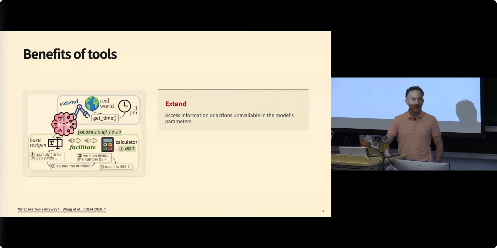
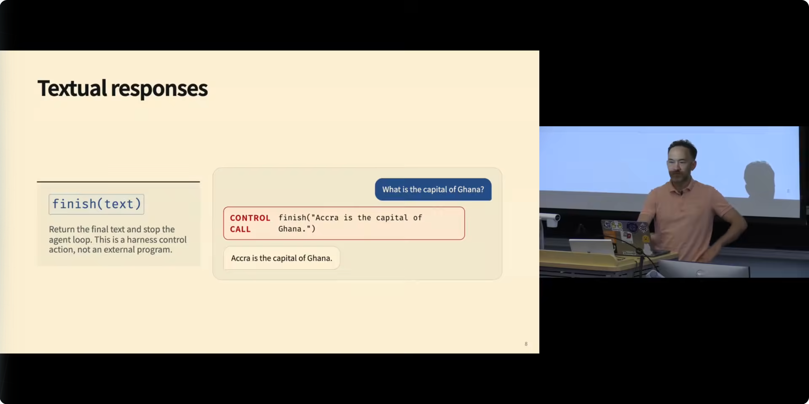
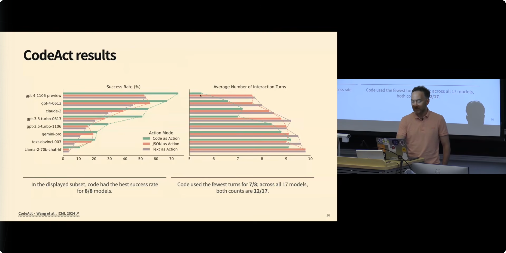
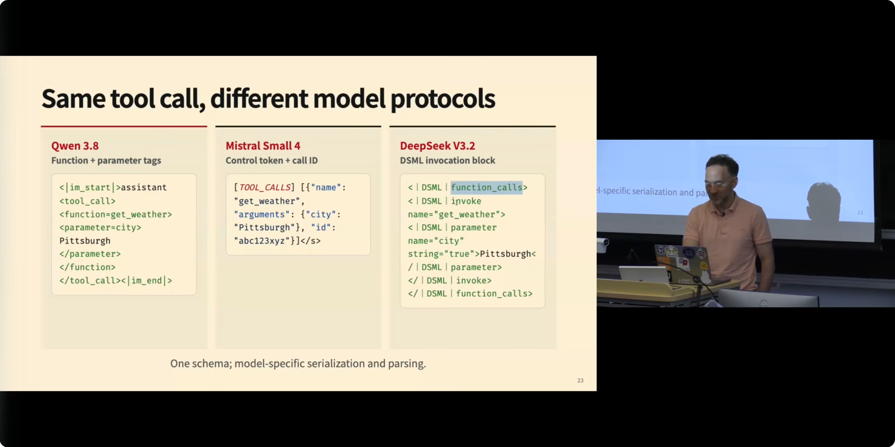
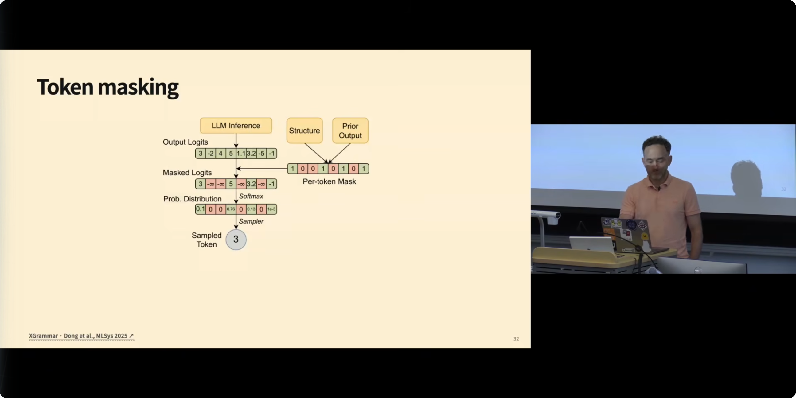
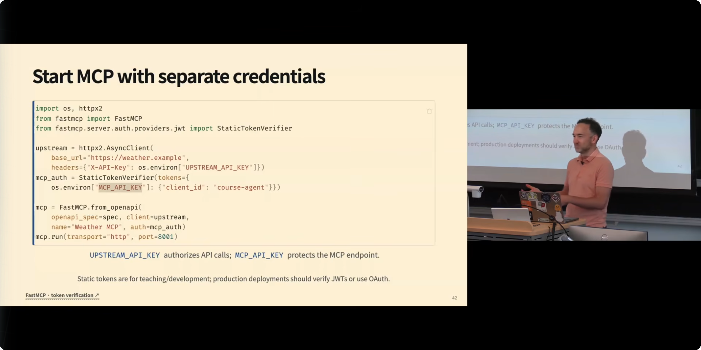
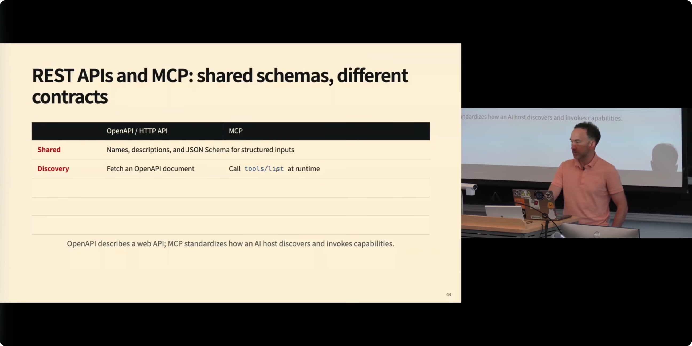

# 语言模型智能体的工具使用（Tool Use for Language Model Agents）

## Metadata

- **Title**: CMU AI Agents 2026: 2. Tool Use for Language Model Agents
- **Author**: Graham Neubig（CMU，课程主讲）
- **URL**: https://www.youtube.com/watch?v=jXChFB4JSyw

## Overview

这是 CMU「AI Agents」课程的第二讲，核心论题是：**工具（tool）是让语言模型从"文本生成器"变成"智能体（agent）"的那个分水岭**。语言模型本质上是一个 token 预测机，无法自己触碰外部世界；而工具就是语言模型调用外部计算机程序的接口。课程沿着一条完整的工程链路展开：为什么需要工具（Extend 与 Facilitate 两大收益）→ 常见工具的分类 → 用 API 列表还是用代码来表达工具调用（代码是"元工具"，CodeAct 的实验证据）→ 工具调用在底层如何被表示为特殊 token、各家模型格式为何互不通用 → 如何解析、校验、分发工具调用并按 ID 匹配结果 → 如何用语法约束解码（grammar-constrained decoding，XGrammar）保证输出必然合法 → 工具的两种远程化形态（REST API / FastAPI 与 MCP）及其安全模型 → 并行工具调用为什么让"贵模型反而更便宜" → 最后是如何评估工具使用能力（Berkeley Function Calling Leaderboard 与 OpenRouter 错误率基准）。结论可以浓缩为一句话：工具使用不是一个单点功能，而是一个**分层系统**——schema 进 prompt、模型发调用、系统校验分发、按 ID 配对结果，每一层都有明确的失败模式和对应的工程对策。

## 按照主题来梳理

### 1. 什么是工具：智能体与裸语言模型的分水岭 [0:00](https://www.youtube.com/watch?v=jXChFB4JSyw&t=0s)

课程一开场，Neubig 就给出本讲的中心定位：工具使用（tool use）是智能体区别于普通语言模型的最根本特征——"the most fundamental thing about agents that makes them different from a language model"。一个语言模型本质上是"a token predicting machine"（一台 token 预测机）：它能做的唯一事情就是根据前文续写下一个 token。它无法查询当前时间、无法访问训练数据截止之后的信息、无法真正执行一次乘法运算并把结果写进外部系统。

工具的定义因此非常朴素：**工具是一个接口（interface），语言模型通过它可以调用一个外部的计算机程序**。通过这个接口，模型可以搜索网页、调用计算器、驱动浏览器、执行 Python 代码、或者调用任意第三方 API——能力清单几乎是开放式的。

课程特别强调了一个结构性观察：工具**调用**的方法（tool calling 的语法与协议）如今已经高度标准化，但工具调用**下游能做什么**却几乎没有边界——"the method for tool calling is standardized, but what you do downstream with the tool call can be very different"。这正是"标准接口 + 无限能力"的组合让智能体生态得以爆发的原因：接口收敛了，能力发散了。对学习者来说这意味着两件事：其一，学会这一套标准化机制，就拿到了整个生态的钥匙；其二，真正的产品设计空间在"下游"——给模型接什么工具、工具之间怎么编排，才是差异化所在。

这一讲的大部分材料来自一篇课程网站上也贴出了的综述（slide 引用为 *What Are Tools Anyway?*，Wang et al., COLM 2024，由 Neubig、Daniel 与学生合作撰写；口述中提到的学生姓名听起来接近 "Zoro Wang"，具体拼写以论文页面为准）。换句话说，这堂课不是零散经验的堆砌，而是有一篇系统性综述作为骨架，读者若想深入可以直接回到原始文献。

### 2. 工具的两大收益：Extend 与 Facilitate [1:12](https://www.youtube.com/watch?v=jXChFB4JSyw&t=72s)

综述把工具的收益分成两大类，这个二分法贯穿了整门课：

- **Extending（扩展能力）**：让语言模型做到它**根本上做不到**的事，即访问语言模型行动空间（action space）之外的信息或动作。典型例子是"获取当前时间"。模型的参数在训练结束时就被冻结了，它见过的最新信息可能是四个月前的，除此之外没有任何办法知道"现在几点"——除非调用一个外部函数。同理，访问用户私有状态、改变外部环境都属于这一类。
- **Facilitating（提供便利）**：有些事模型**原则上能做**，但"如果你不要求语言模型亲自做，事情会容易得多"（"a lot easier if you don't require the language model to do it"）。最经典的例子是算术。现在的语言模型做数学其实相当不错，但如果你让它心算两个七位数相乘，它需要展开大量推理、花费很长时间；而计算器一瞬间就能给出精确结果。

Neubig 在课堂上先让学生自己举例，再点破：这两个例子恰好各代表一个基本类别——"get the time four months ago"是模型**不可能**知道的（参数冻结），七位数乘法是模型**不划算**亲自做的（推理链又长又脆）。

往更细的方向展开（[2:54](https://www.youtube.com/watch?v=jXChFB4JSyw&t=174s)），这两大收益具体对应四类典型用途：其一，**查询当前信息（look up current information）**，好处是为回答提供"新鲜的证据（fresh evidence）"来 grounding（接地），避免模型凭过时记忆编造；其二，**精确计算（exact computation）**，用计算器或 Python 执行，比模型自身推理更快更可靠；其三，**访问私有状态（private states）**，让模型拿到关于用户的信息，从而基于用户状态作答；其四，**改变外部环境**，比如通过浏览网页或调 API 在真实世界里产生副作用。这四类几乎覆盖了今天所有智能体产品的工具需求。

### 3. 从 ChatGPT 的演变看工具生态的扩张 [3:33](https://www.youtube.com/watch?v=jXChFB4JSyw&t=213s)

为了让"工具"从抽象概念落地，Neubig 用 ChatGPT 的演变做了一条时间线：ChatGPT 刚发布时真的只是"text in, text out"（文本进、文本出）——它对用户查询唯一能做的就是返回文本响应。而今天它已经是一个"everything app"（万能应用），允许你做数不清的事情，这一切变化几乎都来自工具的叠加。

课堂上他与学生一起枚举了大家真实使用 ChatGPT 的高频场景，每个场景背后都能指认出对应的工具：

- **写代码**：有学生提到 Cursor 或 Codex，Neubig 澄清说那严格来说不是 ChatGPT 本身，而是构建在模型之上的智能体产品——但思路相同，背后都需要调用代码相关的工具。
- **渲染 Blender 场景**：有学生补充，在 ChatGPT 界面里可以直接调用 Blender 渲染——这既需要执行代码，又需要把结果以合适的格式展示出来。
- **生成图片**：调用的是图像生成工具。
- **推荐商品**（比如"推荐一款搅拌机"）：需要任意网页搜索（arbitrary web search），或者一个直接接入 Google、Amazon 这类平台的 API。
- **渲染 LaTeX 并编译 PDF**：有学生说把一团糟的 LaTeX 文件丢给它就能修好并编译出 PDF，非常方便。Neubig 坦言他一开始不确定这算工具调用还是前端界面渲染（"I actually don't know if this is a tool or if this is just a front-end interface thing"），但"它真的会生成 PDF"这一点确认了背后确有工具在干活。
- **操作 Slack 等第三方服务**：对应各种专用 API（specialized API）。

他还追问学生"有没有更奇怪的用法？有没有什么事让你惊讶 ChatGPT 居然能做到？"——这类问题的答案几乎总是某种新接上的工具。这段课堂讨论的意义在于：**任何你能想到的"模型突然会做的事"，追下去几乎都是一次工具调用**。工具的边界就是产品能力的边界——这也顺势引出下一个话题：把这些五花八门的工具归纳成一个谱系。

### 4. 常见工具的分类谱系 [6:09](https://www.youtube.com/watch?v=jXChFB4JSyw&t=369s)

Neubig 给出了一份他认为最具代表性的工具清单，绝大多数其他工具都可以归入这几类（理论上它们都可以被看成一个 API，这里只是拆得更细）：

- **文本响应（textual responses）**：最"无聊"但最基础的一种——就是给用户一个答案。值得注意的是，在智能体循环（agentic loop）里有两种实现方式：一种是显式提供一个 `finish` 工具，模型调用它表示"我交互完了，输出这段文字并结束"；另一种是模型这一轮干脆不调用任何工具，系统就把它当作循环结束的信号。Neubig 在此顺势强调：**ChatGPT 现在已经是一个智能体**——"if there was any question about it, ChatGPT is not just a chat app"——因为它通过迭代式的工具调用来回答查询，而这正是智能体的定义。
- **搜索网络（searching the web）**：从各处拉取信息。这里他做了一个很有现场效果的调查："听过 RAG（retrieval-augmented generation，检索增强生成）的举手？"几乎全员。"听过'RAG is dead'（RAG 已死）这种说法的举手？"也有不少人。他的论断很精辟：**RAG 不是死了，而是"活得太好以至于人们以为它死了"**——检索上下文再基于上下文生成答案这件事已经变成了所有应用的默认行为，平常到人们意识不到自己在用它（"it's so alive that people think it's dead"）。
- **代码执行（code execution）**：扔一段代码进去做计算或其他操作，是前面所有计算类用途的通用底座。
- **图像生成（image generation）**：与前面几类有个微妙差异——前面那些主要和文本打交道，而这个是和图像打交道。Neubig 指出了一个鲜为人知的细节：调用图像生成工具时，**一大半功夫花在"决定把什么 query 送进生成器"上**。语言模型会把用户的请求大幅扩写（比如用户只说画个机器人，最终生成的却是"水彩风格的、在图书馆里学习的机器人"，与原始 query 并不相同）。旧版 ChatGPT 下载图片时能看到一个与用户输入截然不同的 caption，可以借此窥见模型实际发给图像生成器的 query。
- **自定义函数（custom functions）**：比如"帮我买香蕉、牛奶和咖啡"——模型可以为你创建一个购物车并调用 Instacart 的 API。这一类是开放式的："you can basically go as wild as you want"，想加多野的工具都可以。

### 5. 两种工具调用观：API 列表 vs. 代码即"元工具" [10:20](https://www.youtube.com/watch?v=jXChFB4JSyw&t=620s)

关于"怎么让智能体调用工具"，存在两种思路。第一种是经典做法：给智能体一张清单，上面列着 50 到 70 个 API 函数，每一步它调用其中一个（如果支持并行调用则一次调多个）。

第二种思路是把**代码**看作一种特殊的、极其强大的工具——一个"元工具（meta tool）"。Neubig 用一个算术应用题拆解了这一点：面对"面包师烤了 200 个面包……还剩多少"这类问题，模型写下的每一行代码其实都是一次工具调用——赋值是"赋值工具"，减法是"减法工具"。学过编程语言课的人都知道，**一段代码本质上是函数调用构成的一棵树**，而且这棵树里还可以有循环和其他控制流，所以代码是一种表达能力极其丰富的工具调用方式。更重要的是，代码可以 `import` 外部库——一旦引入 pandas，你就瞬间解锁了 pandas 里的全部工具；你也可以自己写专用的工具函数（utility functions）在程序里反复调用。

这不只是理论美感，有实验证据支撑。三四年前人们刚开始用 LLM 搭建智能体时，标准做法是一步步调 API：比如要回答"在美、日、德、印四国中，买某款手机最划算的是哪个国家"，老办法需要反复调用 lookup rates（查汇率）、lookup phone price（查价格）、convert and tax（换算加税）……一步步循环很多轮才能"finally get the result"。而写成代码的话，**一个程序就能完成全部流程**——既是更丰富的表达，也是更高效的方式。这就是 CodeAct（Wang et al., ICML 2024；口述转写听起来像 "Kodak"，实为 CodeAct）这篇论文的方法，其核心结果是双重的：**成功率上升，同时平均交互轮数下降**。尤其值得注意的是，这个收益连传统上不需要代码的任务也能拿到——这些任务本来被视为普通工具调用任务，但代码恰好是一种更好的表达媒介（"code is just a good medium for how you would do this"）。

### 6. 代码调用的代价：权力越大，风险越大 [14:20](https://www.youtube.com/watch?v=jXChFB4JSyw&t=860s)

既然代码这么好，为什么不所有工具调用都用代码（"programmatic tool calling for everything"）？Neubig 的回答是：这很大程度上与"你愿意给智能体多大的权力（the level of power that you want to give to the agent）"直接相关。代码是**高权力（high-powered）**的：表达力强、有循环、有变量、有库——"this is good, but what could be a downside of this?"每一点优点都对应着代价。他逐条与课堂讨论展开：

- **循环与变量**：有学生立刻答出"get stuck"——模型可能写出死循环，然后你的系统里必须有东西来检测和处理死循环，这很烦人（"that's a little bit annoying"）。
- **库**：有学生答出安全问题，也有版本管理（versioning）问题。Neubig 特别警告：**当前网络安全领域智能体的一个重大问题，就是智能体会拉入一个已被攻陷的库**——智能体先被攻陷，然后你的整个系统被攻陷（"the agent gets compromised and then your whole system gets compromised"）。这是必须极度小心对待的供应链风险。
- **更难约束（harder to constrain）**：代码拥有宽广的行动空间（broad action space），因此更难验证（validate）、更难获得可预测的行为（predictable behavior）。
- **影响面更大（higher impact）**：代码可能消耗更多内存、磁盘和 CPU，失控时的破坏半径也更大。

因此课程给出的工程结论是：一旦转向程序化工具调用（programmatic tool calling），就必须认真考虑**沙箱（sandbox）**——如何隔离和圈住智能体（"how you're going to contain the agent"）。这个话题会在后面的安全专题课（safety lecture）里详细展开，这里先埋个伏笔。这一段的核心心智是：能力光谱的一端是 50 个固定 API（可控但表达力弱），另一端是任意代码（表达力无限但必须配套隔离设施），系统设计就是在这条光谱上选点——选点的依据不是"哪个更强"，而是"我需要多强的表达力，以及我能收容多大的失控后果"。两个维度分别由任务需求和工程能力决定，缺一不可。

### 7. 工具调用的底层机制：一切都是 token [16:06](https://www.youtube.com/watch?v=jXChFB4JSyw&t=966s)

进入实现层面（"the mechanics of providing tools"）。今天每个主流语言模型都很擅长调用工具，但这并非理所当然（"this was not taken for granted"）。底层上，**工具调用就是一串特殊的 token**（"tool calls are expressed as tokens"）。一次普通的文本续写（text continuation）是"the weather is sunny"这样的 token 流；而工具续写（tool continuation）则是 `<tool_call>` 之类的特殊 token 加上函数名（比如 get weather）。

实际输出里两者经常混在同一段 completion 中。Neubig 在黑板上画了 ReAct 模式（此前课程讲过的推理+行动框架）的现代形态：一段输出里，上面是给用户的文本回复，下面是工具调用块，以调用结束标记收尾——也就是说，**ReAct 循环如今不再是分离的代码逻辑，而是被表达为单次 completion 内部的结构**（"no longer expressed as separate code, it's expressed more as just a single completion"）。模型可以在做出工具调用的同时给人类一段回应，人机两条信道在同一次生成里并行展开。

如果用的是具备长推理链的推理模型（reasoning model，"can reason, have long reasoning traces"），输出里还会多出一段 thinking token，形成三段式结构：verbose（冗长）的思考不给用户看，精炼后的文本消息（less verbose）给用户看，最后是实际的工具调用输出。

有学生问了一个好问题：这些工具调用 token 必须在预训练（pre-training）时就存在于词表里吗？Neubig 先答"是"，随即诚实地自我纠正为"可能不是"（"I said yes, but the answer might be no"）并解释：在整个互联网语料上预训练时**不一定**要有这些特殊 token；更典型的做法是在 **mid-training（中期训练）** 引入它们——那是介于预训练与后训练之间、用"格式合意的中等规模数据"继续训练的阶段（"training on moderately large amounts of data on things in the format that you like"），之后可能再接强化学习。这个细节解释了为什么不同模型的工具调用"方言"各不相同（见第 9 节），也提醒读者：工具调用能力是后天训练出来的行为，而不是预训练的副产品。

### 8. Chat 格式与工具定义：schema 如何进入 prompt [19:15](https://www.youtube.com/watch?v=jXChFB4JSyw&t=1155s)

对做过 NLP 工程的人来说这部分应当熟悉（"likely be familiar to people who have implemented things in previous NLP courses"），但值得精确过一遍。以 OpenAI 的 chat 格式为例：在 Python 里调用模型时你看到 system message、user message、assistant message，都表现为 JSON 结构；但真正喂给模型时，它们会被转换成带特殊 token 的序列——比如 Qwen 的格式里，系统提示（"be concise"之类）外面包着特殊的起止标记——每条聊天消息各有自己的格式（"each chat message gets its own format"）。这是 Qwen 的例子，后面会看到其他模型用别的格式。

工具（tools）则在这个请求结构上再加一层（"add a structure to the request"）：你提供一个工具定义（tool definition），声明它的类型是 function，函数名比如 `get_weather`，参数有 `city`、类型为 string、且为必填（required）。这份 schema 会随请求一起传给 chat completions 之类的接口（"passed to the chat completions function"）。

于是 prompt 的 tools 部分包含这份定义之后，模型的输出就变成了结构化的调用：name 为 `get_weather`，arguments 里 city 为 "Pittsburgh"。承接上一节关于训练的讨论：即便不在预训练阶段，至少在 mid-training 及之后，模型会被训练去贴合某一种特定的工具调用格式（"fit a particular tool call format"）。

这一节看似平淡，却是整条链路的入口，有两个工程推论值得记住：其一，schema 写错了，后面的解析、校验、执行全都无从谈起；其二，schema 的质量直接影响模型行为——函数名、描述、参数语义写得清晰，模型选对工具、填对参数的概率都会明显提高，反之则是在给后面的每一层埋雷。这就引出下一个非常工程化、但踩坑无数的课题。

### 9. 各模型的工具调用格式互不通用 [21:20](https://www.youtube.com/watch?v=jXChFB4JSyw&t=1280s)

一个关键事实：**许多模型各有各的工具调用格式**（"every model has a different tool call format——maybe not every one, but many"）。课程 slide 并排展示了三家：

- **Qwen** 用 `<|im_start|>assistant`、`<tool_call>`、`<function=get_weather>`、`<parameter=city>` 这样的标签序列，以 `</tool_call><|im_end|>` 收尾；
- **Mistral** 用 `[TOOL_CALLS]` 控制 token，后接 JSON，并带有 call ID；
- **DeepSeek** 用自己的 DSML（DeepSeek Markup Language，DeepSeek 标记语言），而且他们的术语是 function calls 而非 tool calls，外层是 `function_calls`、内层用 `invoke`、`parameter` 等标记。

Neubig 强调：本质上这些方案都可行（"any of these works"）；用同样的数据训练同一个模型，这些格式之间的性能差异可能很细微（"minor minor differences"）。但**你必须知道它们是不同的**——不能假设为 DeepSeek 写的解析代码直接能在 Qwen 上工作，反之亦然（"you can't just assume that some parsing code that works with DeepSeek will suddenly work with Qwen and vice versa"）。

有学生追问微调（fine-tuning）时新增功能、保持泛化性的做法，回答是：如果你在一个已经训练好的模型上微调，**百分之百要匹配它原有的工具调用格式**（"you 100% want to match the tool call format"），不要试图让它学一套它没训练过的格式（"you don't want to try to get it to do something it wasn't trained on"）。好消息是这一切在 Hugging Face 里已经通过 `apply_chat_template` 函数标准化了——你只要对所用的模型调用正确的 chat template 即可；如果某个模型的 template 实现有问题，可以去社区提、他们修，或者自己动手。如今这"全部已经标准化了"，但他坚持学生要了解这些底层机制："I want people to know that this is going on under the hood, because if you don't know this, you can make mistakes and it will not be happy."——标准化工具屏蔽了复杂性，却没有消除复杂性；出问题时，懂底层的人才有排查的抓手。

### 10. 工具的分发、校验与结果配对 [23:29](https://www.youtube.com/watch?v=jXChFB4JSyw&t=1409s)

假设模型已经输出了工具调用 token，并且你已经有办法把它解析成函数名与参数（解析本身的话题留到下一节），接下来的运行时流程是一条清晰的流水线：

1. **初始化时注册工具**：每个智能体框架（agentic framework）都提供注册入口，每个工具有自己的名字，对应一个 Python、TypeScript 或其他语言的函数；
2. **名称解析（resolve）**：维护一张从工具名到可执行体的映射表，模型报出名字后据此分发（dispatch）并传入相应参数；
3. **校验（validation）**：检查这次调用是否合法。校验可能在两个环节失败——**校验期失败**是模型给出了明显错误的调用；**执行期失败**则微妙得多：调用没有显式违规、但"隐式地"不合法（"not something that was explicitly said is bad, but implicitly is invalid"）。典型例子是 execute Python 工具：schema 层面任何字符串都"合法"，但真正运行时这段 Python 可能报错——这属于执行错误（execution error）；
4. **观察（observation）**：无论执行成败，产出的结果（observation）都要返回给模型。

还有一个极易被忽视、但实现智能体时"很有用也极其烦人"的细节（"pretty helpful but also really annoying when you're implementing agents, if you get it wrong"）：**每个工具调用都会被分配一个 ID**——由语言模型推理代码或智能体代码分配——结果（tool result）带着与之匹配的 call ID 返回。这在并行调用多个工具时必不可少：靠 ID 才能知道哪个结果属于哪次调用。

但麻烦在于各家 API 对此的严格程度不同：比如 **Anthropic 的接口如果遇到一个没有匹配 tool result 的 tool call，会直接拒绝整段历史**（"invalid history"），不再为你生成任何输出。Neubig 分享了实战经验：助手发出工具调用后程序突然崩溃、没能把结果落盘，恢复运行后历史里就缺了那个关联的 result——Anthropic 就罢工了（"fails to work for you"）。这类细节只有在真实系统里才会咬到你。有学生问"工具调用是异步的吗？"——他说明这属于下一节的内容（实际在并行调用部分回答）。

### 11. 约束解码：让合法工具调用成为必然 [27:00](https://www.youtube.com/watch?v=jXChFB4JSyw&t=1620s)

这是本讲技术上最硬核的一段（"a very technically algorithmically difficult problem"），Neubig 半开玩笑地说：如果你觉得有意思，很好；如果你觉得没意思，"be glad that other people are solving it for you"（庆幸有别人替你解决这个问题）。

问题是：**语言模型并不保证生成格式良好的工具调用**。比如模型输出的 JSON 少了最后一个右括号——喂给 JSON 解析器会直接抛异常。他见过无数人写补丁代码去检测缺失的括号、事后补上一个（"post hoc"），但"you don't want to be doing that, that's not fun"。正道是回到约束的本质，把工具调用的合法性分成三层：**语法（syntax）**——必须是合法 JSON，这是底线（table stakes）；**形状（shape）**——必填字段必须在场；**类型（types）**——`city` 必须是字符串、数值单位必须合法。这三层都可以用 **JSON Schema**（或任意 schema 库）表达：比如 city 是 string、units 只能是 Celsius 或 Fahrenheit、city 为 required。

关键一步是：schema 提供了机器可读的校验规则，而校验规则可以进一步表达为**文法（grammar）**。这里课程做了一段形式语言速成：正则表达式对应**正则文法（regular grammar）**，可以用**有限状态自动机（finite state automaton）**解析——每读入一个 token 就转移到一个新状态（收到 A 进入一个状态、收到 B 或 C 进入另一个状态）。但 JSON 的括号嵌套结构超出了正则文法的能力，需要**上下文无关文法（context-free grammar）**；它能画出树状结构——每个 JSON 表达式两侧是括号、成员之间是逗号、叶子是字符串或 unit。若 schema 格式正确，就能建出完整的树；若格式错误（比如解析到 unit 时发现值是 K——Kelvin——而 schema 只允许 Celsius/Fahrenheit），树就建不完，解析就此失败。有限状态自动机解析不了上下文无关文法，但**下推自动机（pushdown automaton）**可以——给有限状态机加一个栈（stack），压栈、弹栈，从起始状态出发、从左到右逐步校验生成中的输出。

这套理论落到系统里就是 **XGrammar**——一个在各大 LLM 推理库中广泛使用的约束解码引擎，由 CMU 机器学习系的人开发（slide 标注 Dong et al., MLSys 2025）。做法是在解码的每一步：LLM 给出下一个 token 的 logits（原始打分），同时用文法检查每个候选 token 在当前栈状态下是否合法——合法得 1 分、非法得 0 分，**把所有非法 token 的 logits 置为负无穷，再重新归一化**，于是概率只分布在合法 token 上。XGrammar 论文里还有精巧的工程优化：词表中有些 token 在任何上下文下都恒合法或恒非法，可以预先计算（precompute）；只有那些"取决于栈上下文"的 token 才需要实时计算（calculate on the fly）。效果是：只要开启约束解码并配上正确的 JSON Schema，**你几乎必然得到格式良好的工具调用**。

但有一个约束解码也救不了的边角案例，Neubig 把它当课堂测验问出来（"very very difficult"）：**token 预算耗尽**。模型能生成的 token 数有上限，可能生成到一半时你还走在自动机的合法路径上、却不在终态——输出是半个 JSON（"you generate like part of a JSON output"）。他自己实际踩到过这个坑。理论上有解法——实时数着剩余 token 预算、在不足以走完合法路径时提前截断——但还没人实现；他当场表示谁愿意在 XGrammar 里实现这个功能可以算作额外学分（extra credit assignment）。

### 12. REST API 与 FastAPI：工具的远程化 [35:40](https://www.youtube.com/watch?v=jXChFB4JSyw&t=2140s)

讲完"怎么生成合法调用"，转向"工具本身以什么形态存在"。程序化工具调用（直接给模型一个 Python 文件——比如 `weather_lib.py` 里放着 `get_weather(city, units)`——让它调里面的函数）虽然可行，但有两个局限：不能远程调用（not callable remotely），也不兼容标准的（非程序化的）工具调用方式。

把函数变成 **REST API** 是经典解法，也是大多数人与 web 服务交互的熟悉路径。课程推荐 **FastAPI**（课堂上不少人用过）：几行代码就能搭起 web 后端——初始化 FastAPI 应用、加上 API key 做访问校验、再用 Python 装饰器把 `get_weather` 暴露成 HTTP 端点。这样做有两个直接好处：其一，**访问控制**——不想让谁用你的服务（或者更现实地，不想让人摸到你的私人数据），就要求 API key，没有合适 key 的一律挡掉；其二，**JSON Schema 白送**（"for free"）——FastAPI 会把你的整个 API 自动表达为 JSON Schema，这份 schema 可以原样交给语言模型，模型据此知道哪些调用是合法的；之后智能体每次发出工具调用，你的系统就把它转发到 API 服务器，由服务器执行并返回。

还有一条更"野生"的路径：**curl**。如果是一个带 bash 权限的编程智能体（coding agent），它可以直接用 curl 命令调用这些 API——不需要任何专门的工具协议，"if you have a coding agent that has access to bash, it has the ability to call like this"。这段内容对熟悉 REST 的人来说平铺直叙（"maybe reasonably straightforward"），他还顺口推荐："如果你还没玩过 FastAPI，它很好上手。"但 Neubig 特意先讲它，是因为"this is kind of like the traditional way of programming before agents"——它是理解下一节 MCP 的对照组：先看清楚"没有 MCP 时世界是怎么运转的"，才能看清 MCP 到底多给了什么、以及多出来的那一层值不值得。

### 13. MCP（Model Context Protocol）：多出来的一层到底买什么 [39:07](https://www.youtube.com/watch?v=jXChFB4JSyw&t=2347s)

**MCP（Model Context Protocol，模型上下文协议）**由 Anthropic 在约一年半到两年前提出，定位是为模型提供额外上下文的标准方式。Neubig 坦诚地分享了自己的心路：他第一次看到 MCP 时的反应是"为什么需要这个？"（"why do we need to do this?"）——让智能体直接调 API 不就好了？配置 MCP 意味着在 AI 应用里跑若干 MCP client，分别连 weather MCP、GitHub MCP 等服务（问完天气顺手推到 GitHub），而他原本想不通"为什么需要跑一个程序去调 API，我们明明已有 REST 这个好办法"。

但他随后给出了让 MCP 区别于"裸调 API"的关键理由：**多一层安全边界（an extra layer of security）**。MCP 架构里有两把钥匙——**MCP API key** 提供给运行智能体的进程，用于认证进入 MCP server；**上游 API key（upstream API key）**（比如你的 GitHub token）只提供给 MCP server，**绝不交给智能体**。为什么这至关重要？设想你把 GitHub token 直接给了智能体，而它某天"觉得"把 token 推送到你的公开仓库是个好主意——"not good, right?"——账号立刻失守，恶意代码可能被装进你所有的仓库。所以正确的设计是：给智能体一个**泄露了也相对无害**的凭证（"relatively harmless"），真正的凭证被隔在 MCP server 后面得到保全。

配套生态上，他提到 **FastMCP** 库——"MCP 界的 FastAPI"（"basically designed to be FastAPI for MCP"）：想给任何东西建 MCP server，基本把 FastAPI 换成 FastMCP 即可，甚至可以直接把已有 REST API 生成的 spec 转成 MCP。此外还有一个**官方 MCP registry（注册表）**可以查找现成的 MCP，外加"一百五十万个"按人气排名的第三方 MCP 服务导航站。

总结对比（slide 标题为 *REST APIs and MCP: shared schemas, different contracts*）：两者都能给智能体挂上一组 API，都用名字、描述和 JSON Schema 表达结构化输入；差异在于——**发现（discovery）**：REST 要去抓取一份 OpenAPI 文档，MCP 则有专门的 API 在运行时列出全部工具（`tools/list`）；**调用（invocation）**：REST 走 HTTP，MCP 走自己的 transport（可以是标准输入输出 stdio，也可以是 socket 等）；**认证**：如上所述的双层 key；另外 MCP 还附带资源（resources）、提示词（prompts）、扩展（extensions）等便利设施，课程未展开。

课间他插播了一个花絮：这几讲反复用"Pittsburgh 天气"举例，而当天 Pittsburgh 真的出现了**一边暴雨一边出太阳**的天气——他自己的示例 API 无法同时返回两种天气状态，"我成功把自己的 API 搞崩了"（"I managed to break my own API"）。

### 14. 并行工具调用：独立性约束与"贵模型反而便宜"悖论 [45:16](https://www.youtube.com/watch?v=jXChFB4JSyw&t=2716s)

**并行工具调用（parallel tool calling）**要解决的问题和 CodeAct 一脉相承：如果一次只调一个工具，简单任务也会变得很长——查完天气再查日历再查航班，串行链越拉越长。而如果调用之间互相独立，就可以**同时发出**：实现上非常简单，就是在一个 assistant 响应里放多个 tool call 块。

但有一条硬性约束：**只有没有相互依赖的调用才能并行**（"you can only parallelize tool calls if they don't have dependencies on each other"）。查 Pittsburgh 天气 + 读今天日历 + 查航班状态，可以并行；而"先找到 customer ID → 用它拉取订单 → 给选中的订单退款"这条链显然不行——后一步依赖前一步的结果。同理，如果航班查询依赖天气结果，也得排队。之前学生问的"执行时是真的并行吗？"在此得到回答——通常是：用 Python 的常规写法把多个调用一起发出，再用 `asyncio.gather` 之类的机制同时收集结果，这是很常见的做法。

并行调用还牵出一个重要的行业观察，Neubig 称之为**高效模型与低效模型之间的主要分水岭，以及一个"奇怪的悖论"：更贵的模型按任务算下来反而可能更便宜**（"more expensive models can actually be cheaper, if you measure them on a task-by-task basis"）。原因有二：一是更贵的模型更聪明，能更快选对解法；二是**新一代模型的并行工具调用能力强得多**——你用编程智能体时如果发现它在同时查看多张图片、同时写多个文件，那就是并行调用在起作用。

为什么模型突然变强了？要知道并行调用的机制存在已久，却直到大约半年前才真正成为主流（"this was not a huge thing until maybe like six months ago"）。有学生答中要点：**强化学习逼出来的**（"reinforcement learning just forced them to do that"）。当 RL 训练强烈激励模型尽快完成任务——对任务执行时长施加很重的 brevity penalty（简洁性惩罚）——并行调用就成为压缩总时长的有效手段，模型于是被训成了"并行高手"。

### 15. 工具使用的评估：从 BFCL 到 OpenRouter 错误率 [48:50](https://www.youtube.com/watch?v=jXChFB4JSyw&t=2937s)

最后一节讲评估。注意边界：这里评估的是"语言模型的工具可用性（tool usability）"——端到端智能体任务的评估留待以后，但工具使用能力是智能体任务的前置条件（prerequisite）。

最出名的基准是 **Berkeley Function Calling Leaderboard（BFCL，伯克利函数调用榜单）**，已有四个版本：v1 只有单轮工具调用，逐版演化到现在覆盖**多轮工具调用**、**智能体式工具调用**（面向工具调用 agent，而非端到端编程 agent），以及**工具调用鲁棒性**——包括参数幻觉（hallucination of arguments）和格式敏感性（format sensitivity，正对应第 9 节那些五花八门的格式）。

评估工具调用要拆成多个维度：**工具选择**——模型有没有选对工具（选了个根本干不了这活的工具就是错）；**参数**——值填得对不对；**顺序**——智能体场景下调用的先后次序对不对；**端到端任务准确率**——最终结果对不对。这四个都是榜单的指标。此外还有三组系统性指标：**效率**——解题多快、花了多少 token、多少钱；**可靠性**——工具调用超时会不会恰当重试、某工具不可用时会不会换备胎；**安全**——面对诱导性的对抗输入，会不会被要求以不当方式使用工具。四个版本的 BFCL 合起来覆盖了上述全部维度。

另一个很有意思的基准是 **OpenRouter 的工具调用错误率榜单**（口述中提及的模型听起来是"GLM 5.3"，具体型号以 OpenRouter 页面为准）。它测量的是**同一个模型**，唯一的变量是**由谁来为你提供推理服务（who serves the model to you）**——结果错误率从 **15%** 一路差到 **0.01%–0.05%**。同一个模型，差距三个数量级。为什么？课堂讨论给出三层原因：

- **量化（quantization）等级不同**：Neubig 的个人经验是 FP8（当前默认的量化档位）模型的工具调用错误明显少于 FP4；FP4 压缩得太狠（"compressing it very heavily"），给推理商省钱，但模型实质上更差——能保住性能的 FP4 量化方案少之又少。
- **投机解码（speculative decoding）**：用一个便宜的小模型预测大模型的输出来加速推理。无损（lossless）的投机解码理论上不改变底层结果、不应造成影响；但如果服务商用了有损（lossy）版本，输出就会不一样——不过那种情况下还管它叫"同一个模型"本身就不是个好主意。
- **约束解码实现不同**：这是最隐蔽的一条，也正是前面埋下的伏笔（"there were some hints in the lecture"）。很多推理商是从零自研推理引擎的，用开源方案的则用 vLLM 或 SGLang，而 vLLM 与 SGLang 支持的基于文法的解码算法又不尽相同。**有些服务商可能压根没实现约束解码**，工具调用的合法性完全靠模型自觉——错误率自然天差地别。最后一个"无聊但真实"的原因：服务商本身不稳定，服务宕机时工具调用当然失败。

### 16. 总结：工具使用是一个分层系统 [55:47](https://www.youtube.com/watch?v=jXChFB4JSyw&t=3347s)

收尾 slide 把全讲浓缩成一句话：**tool use is basically a layered system**（工具使用本质上是一个分层系统）。逐层回顾：

- 工具为智能体添加能力——检索（retrieval）、执行（execution）、生成（generation）、应用操作（application），**它们是"智能体之所以为智能体"的原因**（"they're what make an agent an agent"）；
- 但这些能力不是免费的（"we can't get that for free"）：你需要把 schema 放进 prompt；
- 模型发出调用（emit calls）后，系统要校验（validate）、分发（dispatch）、按 ID 配对结果（match results by ID）；
- 可以叠加约束（如基于文法的解码）保证格式合法——**但约束不保证语义正确**：一段能被解析成 Python 的字符串仍然可能是错误的程序（"the Python program might still be wrong even if you generated a string that could be parsed as Python"）；
- 对接方式有多种形态：直接 REST 调用、MCP 等；
- 外围还有一整套系统负责编排依赖与并发（orchestrate dependencies and concurrency），以及支撑评估。

课程预告与衔接：这些内容是第一次作业——构建你自己智能体的 harness 作业——会直接用到的东西（"this will be covered in the harness assignment, the first assignment where you build your agent"）；下一讲主题是长上下文语言模型的上下文管理（context management for long-context LMs）。此外他提醒后排同学：第一次课后作业——反思本讲内容并谈谈你学到的东西——会上到 Canvas，记得按时提交。

至此，本讲完成了一个完整闭环：从"为什么需要工具"（Extend / Facilitate）到"工具有哪些形态"（API 列表、代码、REST、MCP），再到"怎么让调用可靠"（token 机制、格式方言、校验分发、约束解码），最后到"怎么衡量好坏"（BFCL、OpenRouter 错误率）。工具定义了智能体能力的边界，分层系统定义了工程实现的结构，而评估基准定义了质量改进的方向——这三句话合起来，就是这一讲想让你带走的全部。

## 框架 & 心智模型（Framework & Mindset）

### 框架一：Extend / Facilitate 二分法——评估"要不要加一个工具"的第一性原理

这门课给出的第一个可复用框架，是把一切工具的价值归入两个桶。**Extend（扩展）**——工具让模型做到参数能力之外的事，典型判据是"这件事离开外部世界在原则上是否可能"，例如知道当前时间、访问用户私有状态、在外部环境产生副作用；**Facilitate（便利）**——模型原则上能做，但工具做得更快、更准、更便宜，典型判据是"让模型自己做要付出多少推理成本、多高的错误率"，例如七位数乘法交给计算器。

这个二分法的实战价值在于它是工具设计的**准入审查**。当你考虑给智能体加一个新工具时，先问它属于哪一桶：如果属于 Extend，它通常是刚需——没有它，某类任务对整个系统封闭；设计重点应放在接口的表达能力与安全边界上（因为模型把全部信任寄托在这个接口上）。如果属于 Facilitate，则要算一笔账：模型自己完成的 token 成本、时延和错误率，对比工具调用的开销与失败面；只有净收益为正才值得加——否则你引入的是一个多余的故障点。

这个框架还解释了工具生态演化的方向：随着基础模型变强，越来越多工具从 Extend 桶"滑落"到 Facilitate 桶（比如心算、翻译、简单检索——这些模型渐渐都能自己做了），而真正的 Extend 型工具（实时信息、私有状态、改变世界）的价值反而愈发不可替代——因为它们定义的是系统能力的**外边界**。用这门课自己的例子说：ChatGPT 从"text in, text out"变成 everything app，靠的不是模型变聪明，而是 Extend 型工具一件件加上去。判断一个智能体产品的护城河，就看它接入了多少别人接不到的"外部世界"。

### 框架二：能力—风险光谱——把"代码即元工具"当作一个连续统来设计

本讲隐藏的设计框架是一条**能力—风险连续统**：最左端是"固定 API 列表"（50–70 个预定义函数），表达力受限但行为可枚举、可审计；最右端是"任意代码执行"（代码作为元工具，一棵树状的函数调用加控制流加外部库），表达力逼近图灵完备，但引入死循环、供应链投毒（被攻陷的库）、资源耗尽、行为不可预测等一系列风险。CodeAct 的实证结果（成功率升、轮数降，连非代码任务也受益）把设计直觉推向了右端，但课程同时明确：**向右移动一步，就必须配套相应的收容设施**——超时与死循环检测、沙箱隔离、依赖审计、资源限额。

这个框架的心智要点是：不存在"最优工具形态"，只有"光谱上的选点"，而选点由两件事决定——任务需要的表达力，以及你能承担多大的爆炸半径（blast radius）。实操上可以把它转化为一张决策表：如果任务空间封闭、调用模式可枚举，用 API 列表并配合 schema 校验即可；如果任务需要组合、循环、条件分支（跨国比价、批量处理这类 CodeAct 展示过的场景），代码调用几乎必然更优，但必须默认启用沙箱；如果只是偶尔需要代码能力，可以折中——提供代码执行工具但限制可用库的白名单，降低供应链投毒的暴露面。

框架的本质是把"给智能体多大权力"从一句口号变成可逐层加码的工程决策：每向右一格，写下你新增的收容措施，写得出来才准移动。这条纪律在网络安全场景里尤其刚性——课程点名的"智能体拉入被攻陷的库导致整个系统失守"，正是向右移动却没有配套收容的典型事故形态。

### 框架三：工具调用分层栈——schema → emit → parse → validate → dispatch → match → observe

课程的总结 slide 实际上给出了一个可以直接当检查清单用的**分层栈框架**：(1) **Schema 入 prompt**——工具以 JSON Schema 形式声明名字、参数、类型、必填项，并注意不同模型的序列化方言（Qwen / Mistral / DeepSeek 各不相同，微调配对时务必沿用原格式，工程上交给 `apply_chat_template`）；(2) **Emit**——模型把工具调用作为特殊 token 发出，可与给用户的文本、以及不给用户看的 thinking token 共存于单次 completion；(3) **Parse**——把 token 流解析成函数名与参数，这一层可以被约束解码（grammar-constrained decoding）彻底加固：用 JSON Schema 生成上下文无关文法，驱动下推自动机逐 token 掩码，非法 token 置负无穷再归一化（XGrammar），格式合法性从"期望"变成"必然"（唯一漏洞是 token 预算耗尽停在半路）；(4) **Validate & Dispatch**——名称解析到注册函数，区分校验错误（调用本身不合法）与执行错误（合法但跑不通，如语法正确但运行出错的 Python）；(5) **Match**——每次调用分配 ID，结果携带匹配 ID 返回；并行调用时这是唯一可靠的配对手段，且要注意供应商的严格度差异（Anthropic 对缺失 result 的历史直接报错）；(6) **Observe**——把观察结果喂回模型，继续循环。

这个框架的价值在于**故障定位**：智能体"工具调用失败"永远可以被归到栈的某一层，而每一层的对策是正交的——格式问题在 (3) 用约束解码根治，语义问题只能在 (4)(6) 通过校验与错误反馈缓解，配对问题在 (5) 靠 ID 纪律解决，方言问题在 (1) 靠 chat template 解决。调试时自下而上逐层排查：先确认 schema 进了 prompt，再确认模型输出能被解析，再看校验、分发、配对、回喂哪一环断了。把模糊的"agent 不好用"翻译成"栈的第几层出了问题"，是这个框架最大的实用意义——它也是本讲总结 slide 的原文结构（schemas to the prompt → emit calls → validate, dispatch, match results by ID → constraints），可以直接当作搭建 harness 时的施工图纸。

### 心智模型一：把正确性从"希望"变成"机制"——约束即保障

贯穿本讲的一条深层心智是：**凡是可以机械检查的性质，就不要依赖模型的自觉**。工具调用合法性的三层（syntax / shape / types）如果只靠 prompt 里写"请输出合法 JSON"，得到的是一个概率性的承诺；而约束解码把同一套规则编译成文法、介入解码循环，逐 token 屏蔽非法选项，于是合法性成为结构性必然。

这背后是一个更普适的智能体工程心智：模型的输出空间越大，"祈祷它守规矩"的失败率越高。每当你发现自己在一遍遍写后处理补丁（比如检测缺失的括号再补上——Neubig 明确说他见过无数人这么干，而这不是正道），那就是一个信号：这条约束应该下沉到解码层或协议层。判断标准很直接——这条规则能否被表达成 schema、文法、类型系统或协议契约？能，就机制化；不能（比如"这段 Python 语义上对不对"），才留给模型能力和运行时反馈去解决。

同一个心智在 MCP 的双 key 设计里以安全形式重现：不要"希望"智能体不泄露凭证，而是结构性让它接触不到真凭证。课程里 OpenRouter 错误率的对比（同一模型、不同服务商，15% vs 0.01%–0.05%）是这一心智的现实注脚：差异的很大一部分恰恰来自服务商有没有实现约束解码这类"机制层保障"。选型时看不见这层，你买的"同一个模型"就不是同一个模型。推而广之，评审任何一个智能体系统时都可以问：它的哪些正确性来自机制，哪些来自祈祷？后者列得越短，系统越可信。

### 心智模型二：最小权限与凭证最小化——给智能体的每样东西都要假设会泄露

MCP 一节抽象出的安全心智可以称为**凭证最小化原则**：设计智能体系统时，对交给智能体的每一项资产都做一次思想实验——"如果它明天出现在我的公开仓库里，后果是什么？"答案不可接受的东西，就不应该出现在智能体的可达范围内。双层 key 架构是这个原则的具体化：智能体持有泄露后相对无害的 MCP key，真正的上游凭证（GitHub token 等）隔离在 MCP server 一侧。

这个心智与"能力—风险光谱"框架互为表里：光谱决定你给智能体多大能力，最小权限原则决定你给它多大信任；两者共同指向一个工程文化——智能体的"自治"不是靠信任达成的，而是靠边界达成的。把它延伸到本讲的其他场景：代码执行对应沙箱默认开启、依赖默认审计（防供应链投毒）、网络出口默认收敛；提示词场景对应"系统提示中的敏感信息也可能被模型复述出去"；API 设计对应 FastAPI 一律加 key、按调用方隔离权限。

智能体的行为本质上不可完全预测——它可能被对抗输入诱导、可能被训练数据的怪癖带偏、可能单纯犯错。既然不可预测，防御就不能建立在"预测它会守规矩"上，而要建立在"就算它失控，最坏结果也可承受"上。每次给智能体开通新能力时，把"失控剧本"写出来：它能读什么、写什么、花多少钱、把什么发到哪里去——剧本里最糟的那一行如果无法接受，就先收紧边界再上线。一句话总结这条心智：**智能体系统的安全水位，等于你最不留神交给它的那件东西**。

### 心智模型三：按任务算账——"贵模型反而便宜"的智能体经济学

并行工具调用一节给出的经济心智值得单独提炼：评估模型成本不要用单价（每 token 价格），要用**任务完成成本**——完成任务所需的总 token 数乘以单价，再加上时延的机会成本与失败重试的损耗。更贵的模型往往在两处省钱：更聪明意味着少走弯路（更快选对解法、更少的无效调用与回滚），更强的并行调用能力意味着把串行链压成并发批（RL 的简洁性惩罚正是这样把新一代模型训成了"并行高手"）。

这个心智可以直接推广为智能体系统的选型纪律：不要问"哪个模型便宜"，要问"哪个模型在我的任务分布上总账最低"；不要只看单次调用的成功率，要看达到成功所需的期望轮数——CodeAct 的结果（成功率升、轮数降同时发生）说明这两个指标可以兼得，也都要进账本。在设计 harness 时，凡是能并行的调用都要给模型留并行发出的通道（多个 tool call 块 + ID 配对 + `asyncio.gather` 式执行），否则你等于人为剥夺了模型省钱省时的主要手段；反之，有依赖关系的链条（customer ID → 订单 → 退款）要显式保持串行，否则并行省下的时间会被错误结果加倍赔回去。

把这个心智与评估一节合上读，就是完整的选型方法论：用 BFCL 之类的基准看工具使用基本功（选择、参数、顺序、端到端、效率、可靠性、安全七个维度），用 OpenRouter 错误率看服务商的实现质量（量化档位、约束解码、稳定性——同一模型不同供应商可差三个数量级），最后在自己的任务分布上按任务成本做终局裁决。单价是营销数字，任务成本才是工程数字。
