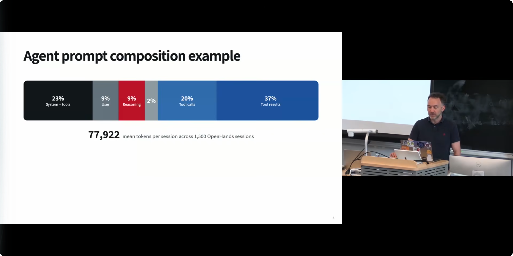
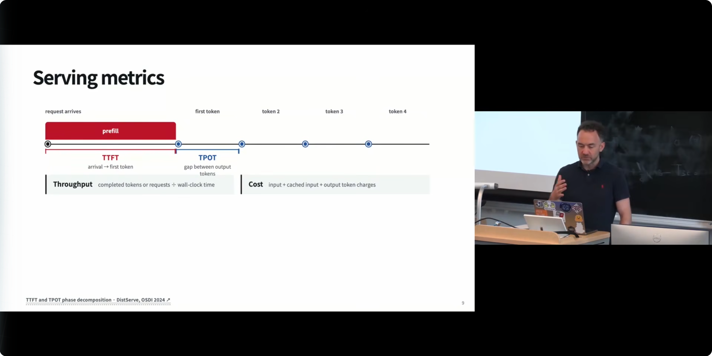
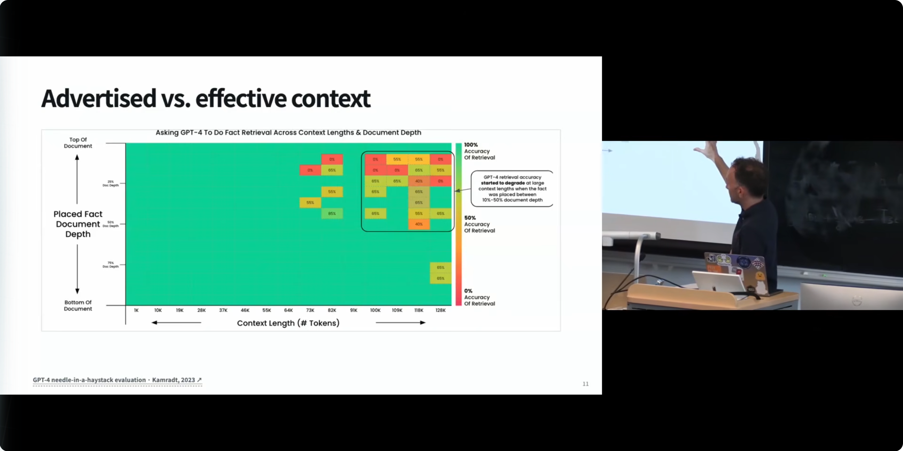
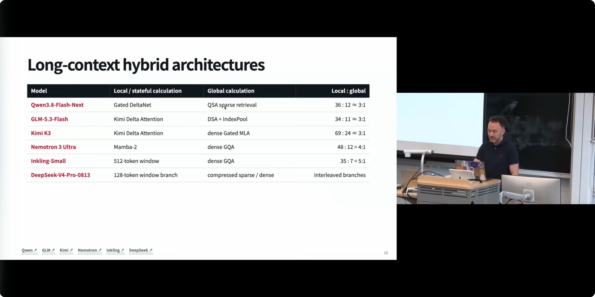
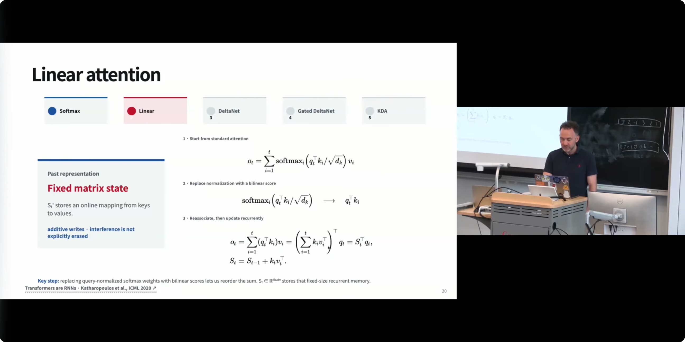
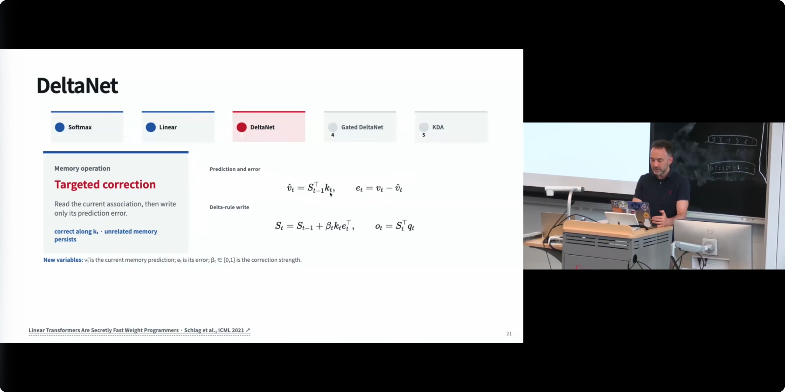
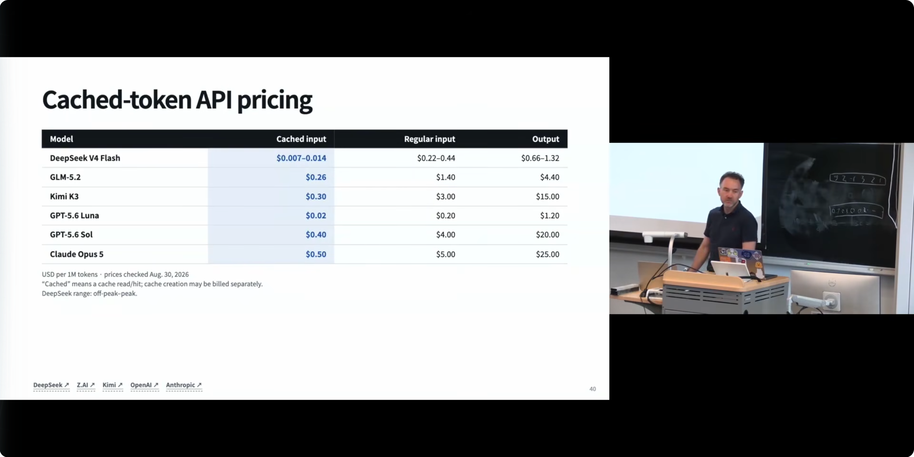
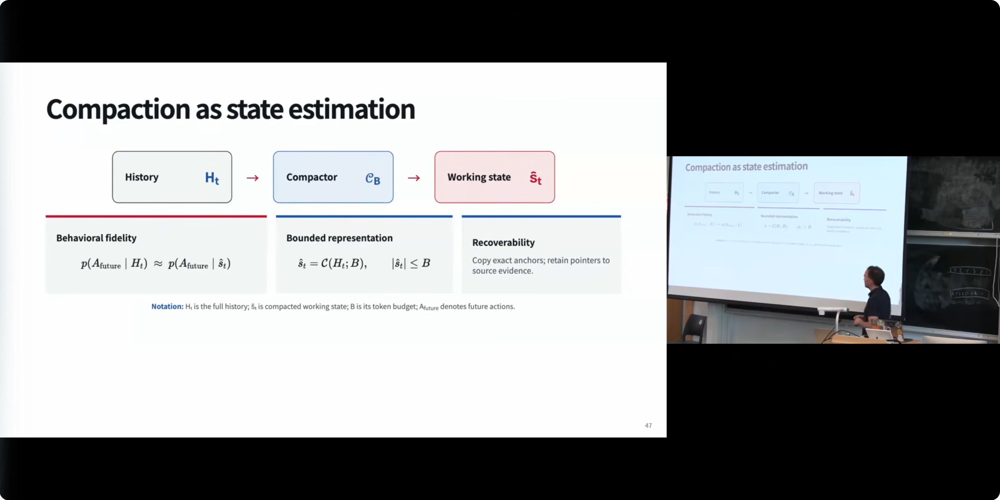

# 智能体的长上下文建模（Long Context Modeling for Agents）

## Metadata

- **Title**: CMU AI Agents 2026: 3. Long Context Modeling for Agents
- **Author**: Graham Neubig（CMU，课程主讲）
- **URL**: https://www.youtube.com/watch?v=AiwCCvFW1uE

## Overview

这是 CMU「AI Agents」课程的第三讲（约 75 分钟），主题是智能体的上下文管理与长上下文建模。Neubig 开宗明义：这一讲的大部分内容其实是通用的 LLM 系统知识，但长上下文对智能体**格外**重要——因为智能体的历史是线性增长的，而每一步都要重新处理全部历史，token 处理量随步数呈**二次方**膨胀。课程沿两条主线展开：**容量（capacity）**——模型能不能装下并有效利用超长上下文（架构、位置编码、训练数据、评估）；**效率（efficiency）**——系统能不能负担得起反复服务超长上下文（prefill/decoding、KV 缓存、缓存命中率、上下文压缩）。亮点包括：OpenHands 编程智能体 1,500 个真实会话的 prompt 构成数据分析、六个最先进开源模型的长上下文混合架构对照表、线性注意力与 DeltaNet 家族的机制级讲解、RoPE/NoPE 与位置外推、PagedAttention 与 RadixAttention 的缓存实现、以及上下文压缩（compaction）的形式化视角和 OpenHands 的真实事故复盘。核心结论：宣称的上下文长度不等于有效长度；缓存命中率决定智能体的成本曲线；而压缩是 bounded 状态估计问题，benchmark 上的好分数不代表实战可靠。

## 按照主题来梳理

### 1. 为什么智能体的上下文会爆炸式增长 [0:07](https://www.youtube.com/watch?v=AiwCCvFW1uE&t=7s)

Neubig 开场说，他本想把这讲命名为"长上下文 LLM 的上下文管理"，因为今天要讲的大部分内容是通用 LLM 知识；但长上下文对智能体至关重要（"super super important"），而且前置的 LLM 课程未必讲得很充分，所以要用一整讲详细展开。他还会带大家过一遍当前最先进开源模型采用的长上下文架构，让读者能看到业界的最佳实践。

关键问题是：**智能体的上下文增长有多快？** 答案是一个简单但深刻的算术：智能体的历史是线性增长的（每一步追加新的动作和观察），但**每一步调用模型都要重新处理全部历史**——因此 token 访问次数随步数呈**二次方**增长。他给出具体数字例子：假设每次调用产生约 5 个 token 的增量，初始系统提示 1 个 token，那么第 1 次调用处理 6 个 token，第 2 次 11 个，第 3 次 16 个，第 4 次 21 个，第 5 次 26 个——一路累加。如果完全 naive 地处理，仅 5 次调用就要累计处理大量 token，而这个过程可以持续很久：他自己就用编程智能体做过连续好几天（multiple days）的会话，几乎整天都在与同一个会话交互——上下文之大可想而知。

这就是这讲的根本动机：**智能体是长上下文问题的放大器**。普通聊天会话轮数有限，而智能体循环天然会把任何上下文窗口撑满，因此容量和效率问题在智能体场景里都会以最尖锐的形式出现。后面所有技术——架构、缓存、压缩——都是在给这条二次方曲线"降压"。

### 2. 智能体 prompt 的真实构成：OpenHands 1,500 会话数据分析 [2:37](https://www.youtube.com/watch?v=AiwCCvFW1uE&t=157s)

为什么智能体 prompt 膨胀得这么快？Neubig 展示了他们对自己开发的编程智能体 **OpenHands** 的 1,500 个真实会话做的数据分析（每个会话只是解决单个任务的较短会话，不是多天连续工作的那种）：**平均每会话消耗 77,922 个 token**。构成如下：

- **23%：系统提示 + 工具描述**（system + tools）。OpenHands 的系统提示大约 15,000–18,000 token——因为"我们对人该怎么干活非常有主见"（very opinionated）；一般编程智能体这部分在 8,000–20,000 token 之间，取决于接入多少工具。
- **9%：用户消息**——初始任务描述和后续追加的指示。
- **9%：推理轨迹（reasoning traces）**——模型"思考"的 token。
- **2%：模型给用户的直接回复**。也就是说，模型花在"想"上的 token 大约是花在"对用户说话"上的 5 倍。
- **20%：工具调用**——写代码、读代码等动作。
- **37%：工具结果**——读文件等操作返回的内容，是最大的一块。

这张构成图的信息量很大：真正"用户意图"只占 9%，而**环境反馈（工具结果）和系统框架（提示+工具）合起来占了 60%**。每一步都包含所有这些成分，累积速度极快——这正是二次方膨胀在真实数据上的样子。

### 3. 两大挑战：容量与效率 [4:29](https://www.youtube.com/watch?v=AiwCCvFW1uE&t=269s)

面对超长上下文，问题一分为二：

- **容量（capacity）**：模型能不能在原理上处理这么多证据（"whether your model is able to handle this large amount of evidence in the first place"）？这涉及架构、位置编码、训练数据，以及如何评估模型是否真的用好了长上下文。训练长上下文模型本身就很难（后文详述）。
- **效率（efficiency）**：系统负担得起吗（"whether the system can afford to serve it"）？Neubig 提醒，如果你只是用 Claude Code 或 Codex 之类的产品，可能觉得理所当然，但这些产品在做"相当惊人的工程壮举"（monumental feats of engineering）——把一个数万亿参数的模型反复地在几秒内服务给海量用户。他提到 Codex 有 2,500 万用户量级："你可以心算一下每秒多少 FLOPs，非常多。"

这个二分法（容量 vs 效率）是整讲的组织结构：架构和训练主要解决容量，推理优化和缓存主要解决效率，而评估贯穿两者。对于智能体开发者，两个维度都不是理论问题——容量不足表现为"智能体忘了你说过的话"，效率不足表现为"账单爆炸"或"响应慢到不可用"。接下来课程就按"推理基础 → 架构 → 训练 → 缓存 → 压缩"的顺序逐层展开。

### 4. 推理服务的基本功：Prefill、Decoding 与服务指标 [5:59](https://www.youtube.com/watch?v=AiwCCvFW1uE&t=359s)

要让长上下文可服务，先理解推理的两个阶段。**Prefill（预填充，也可叫 encoding）**：把所有不需要生成的输入 token 一次性批量算完，为每个位置生成 key 和 value 对。**Decoding（解码）**：逐个生成输出 token，每生成一个就把它对应的 KV 对追加进去——这一步是增量式的，而 prefill 可以整批并行。除此之外，服务系统还要考虑如何调度多个并发请求、如何保存 KV cache 以便复用，避免重复计算。

衡量服务系统的四个指标：

- **TTFT（time to first token，首 token 时间）**：从发出查询到看到第一个输出 token 的等待。日常经验：输入越长，开始出字越慢——这就是 TTFT 在升高。
- **TPOT（time per output token，每输出 token 间隔）**：相邻输出 token 之间的时间。Neubig 展示了 OpenRouter 上的实测：同一个模型（口述为 GLM 5.2），不同服务商的 TPOT 从 63、48 到 24 毫秒不等，差距明显；另一家（他开玩笑说"不想点名 Mistral"）只有每秒 3 个 token，而 Parasail、CoreWeave 能到每秒数百 token。对智能体体验影响巨大。
- **Throughput（吞吐）**：完成的 token 或请求数除以墙上时钟时间，是系统级整体指标。
- **Cost（成本）**。

他还指出一个产品维度的权衡：**交互式智能体**（你在 coding CLI 里与它结对工作）极度在乎 TTFT 和 TPOT；而**后台智能体**（隔夜跑的批任务）几乎不在乎延迟，只在乎吞吐和成本。他自己公司也对外服务编程智能体，推理服务商常问他"你更在乎哪一个"，以便针对性优化系统——吞吐、成本、速度之间存在真实的三方权衡。

### 5. 有效性悬崖：宣称的上下文 ≠ 可用的上下文 [11:04](https://www.youtube.com/watch?v=AiwCCvFW1uE&t=664s)

讲完效率，转向有效性：就算服务系统吃得下一百万 token，**模型未必能有效利用这一百万 token**。经典例证是"大海捞针"评测（needle-in-a-haystack）：往 Paul Graham（Y Combinator 创始人）的一堆文章里塞一句"旧金山吃三明治最好的地方是某处"，然后问模型这句话在哪。随着上下文越拉越长、插入位置变化，较弱的模型在超长上下文上开始出错。课程展示的 GPT-4 评测图（Kamradt, 2023）显示：当事实被插在文档 10%–50% 深度且上下文很长时，检索准确率开始退化。这一类的常用基准还有 **RULER** 和 **HELMET**。

Neubig 随后让学生现身说法："你们长时间用智能体时见过什么失败模式？"学生的回答集中在**遗忘**：忘了之前的上下文；有学生说"我在对话中间明确告诉它不要做某件事，它转头就做了"。Neubig 补充了一个更恶劣的例子（Daniel 在课上讲过的）：用户明确说"不要删除这个"，智能体还是删了——因为它把上下文忘了。在智能体场景这尤其危险，因为用户的指令是增量式给出的，每一条都可能在后续步骤中被遗忘，而智能体的动作是有真实副作用的。

### 6. 长上下文架构总览：从二次方到"封顶" [14:33](https://www.youtube.com/watch?v=AiwCCvFW1uE&t=873s)

标准注意力是全局的：对所有 token 做两两比较，复杂度随序列长度呈二次方。现在最先进模型的上下文长度在 256K 到 100 万 token 之间——"大多数人瞄准 100 万，因为没人想当那个别人都有 100 万、自己只有 256K 的模型"。Neubig 让大家心算：100 万长度的两两比较是 10¹² 次（一万亿次），而每次比较都是大向量乘法，总算力要到 10²⁰ 量级——单个序列就这么多。

解决方案几乎都属于同一类：**给每个时间步的比较次数加一个常数上限**，把 O(n²) 降到 O(n·w)（w 是上限，不一定是窗口）。由此分出两类模型：**局部模型**——比较上限体现在局部窗口内；**全局模型**——上限（如果有）不局限于局部，信息可以穿越整个序列。而今天的主流是**混合模型（hybrid）**：很多层局部计算 + 一层全局计算，交替堆叠。

课程给出了六个最先进开源模型的对照表（各模型主页链接见 slide 页脚）：

| 模型 | 局部/有状态计算 | 全局计算 | 局部:全局 |
|---|---|---|---|
| Qwen3.8-Flash-Next | Gated DeltaNet | QSA 稀疏检索 | 36:12 ≈ 3:1 |
| GLM-5.3-Flash | Kimi Delta Attention | DSA + IndexPool | 34:11 ≈ 3:1 |
| Kimi K3 | Kimi Delta Attention | dense Gated MLA | 69:24 ≈ 3:1 |
| Nemotron 3 Ultra | Mamba-2 | dense GQA | 48:12 = 4:1 |
| Inkling-Small | 512-token 窗口 | dense GQA | 35:7 = 5:1 |
| DeepSeek-V4-Pro-0813 | 128-token 窗口分支 | 压缩稀疏/dense | 交错分支 |

结论：行业标准做法就是"局部机制 + 稀疏或稠密全局注意力"的混合体，局部与全局层数比例集中在 3:1 到 5:1。接下来逐机制讲解，深度控制在"以后查论文时能看懂"的水平。

### 7. 滑动窗口注意力：最简单的局部化 [19:00](https://www.youtube.com/watch?v=AiwCCvFW1uE&t=1140s)

概念上最简单的方案：把序列分块（比如每块 512 token），当前块只注意自己和**固定数量的前几个块**——注意力机制本身不做任何改动，只是把可见范围裁小。

它有个漂亮的性质：第一层里，当前块只能看到前一两个块的信息；但到下一层，那些"前面的块"自身已经携带了更前面的块的信息——于是随着层数加深，**感受野逐层扩大**（gradually expanding window），信息可以间接传播到很远的位置。这种"逐层接力"使滑动窗口成为一种实用的局部机制，在业界被广泛使用。

它的局限也同样明显：信息的传播速度受层数限制——两个相距很远的 token 要建立联系，必须经过多层接力，距离越远信号越稀释。所以在前面那张混合架构表里，纯窗口方案（Inkling-Small）需要搭配稠密全局注意力层来弥补长程能力；这也是为什么"局部 + 全局"的混合设计成为标准答案，而不是任何单一机制的独舞。

从实现角度看，滑动窗口还有一层隐藏红利：它**不需要改动注意力本身的计算**，只是裁掉可见范围，因此所有成熟的注意力 kernel（FlashAttention 等）和分布式并行实现都可以直接复用——对比后面上下文并行一节里"非标操作没有现成 kernel"的窘境，就能理解为什么工程界对窗口方案始终保有一席之地：它是表达力换工程确定性的经典交易。

### 8. 线性注意力与 DeltaNet 家族 [20:08](https://www.youtube.com/watch?v=AiwCCvFW1uE&t=1208s)

如今更流行的是某种**线性注意力（linear attention）**。标准注意力的计算瓶颈在 softmax——取指数再归一化，这个非线性迫使你必须把所有 key-query 乘法展开，无法避免二次复杂度。线性注意力的做法：**去掉 softmax**，只保留 key-query 乘积。

代价是表达力下降：softmax 把一组实数归一化成 0 到 1 之间、总和为 1 的"概率"，这个非线性让模型能**只聚焦少数相关的前文 token**——这正是注意力的卖点。去掉它，等于放弃了"相对比较"能力，只剩 query 和 key 的裸点积。

但换来一个巨大的好处：**结合律（associativity）**。去掉 softmax 后，求和可以重新结合，把"所有历史 key-value 外积的累加"压缩成一个**状态矩阵 S**。这个状态矩阵本质上是一个从 query 映射到 value 的线性函数——注意力本来也是这样一个映射，所以二者功能同构。关键优势：S 可以**增量更新**，每来一个新 token 只需常数时间更新 S（S_t = S_{t-1} + k_t v_tᵀ），整个机制变成一个**循环神经网络（RNN）**，复杂度从 O(n²) 直接降到 O(n)——连窗口 w 都没有了，因为每步只依赖上一步的状态。

**DeltaNet** 在此基础上修复表达力。直觉是：把状态矩阵当作"对 value 的预测器"。给定当前 key k_t，用旧矩阵 S_{t-1} 预测出 v̂_t = S_{t-1}ᵀk_t；真实 value v_t 与预测的差就是**误差 e_t**；然后按 **delta 规则**更新：S_t = S_{t-1} + β_t k_t e_tᵀ——沿 k_t 方向修正矩阵，使得"长得像 k_t 的 query"下次能输出想要的 value。β 类似学习率，防止一步更新过猛。这样的修正是**定向的**（targeted correction）：只沿当前 key 的方向纠偏，不相关的记忆不受影响。

**Gated DeltaNet** 再加一个**衰减项（decay）**：每个时间步把矩阵乘以 α_t 再写入新内容。原因是线性注意力没有机制阻止"很远的上下文"干扰当前预测——很久以前一个奇怪的 key 可能一直在状态里作妖。衰减让远过去的信息逐步打折扣，衰减越强遗忘越快，机制就越"局部"。Gated DeltaNet 正是 Qwen 模型采用的方案。而 GLM 和 Kimi 用了更有表达力的版本 **KDA（Kimi Delta Attention）**：**逐元素衰减**——状态矩阵的每个元素以不同速度衰减，于是一部分上下文可以保留很久，另一部分快速消逝。Mamba 思路类似但数学更复杂，本讲略过（在语言模型系统课里讲过）。

### 9. 稀疏注意力：只看值得看的 [31:15](https://www.youtube.com/watch?v=AiwCCvFW1uE&t=1875s)

另一条路线是**稀疏注意力（sparse attention）**：不去注意全部前文，只检索其中一部分，把"回看"的数量封顶。两个代表做法：

- **固定步长稀疏**：OpenAI 约五年前（转写如此）的稀疏注意力论文，每隔比如 512 个 token 注意一次。复杂度仍是序列长度的二次方，但常数小了 512 倍——"好到足够算得动"。Neubig 点评：这是一种非常便宜的获得全局注意力的方式，写个高效 kernel 就行。
- **内容依赖稀疏（content-dependent）**：用一个非常便宜的方式粗算注意力——比如把 key/query 向量**降维投影**到很小，在低维空间里算注意力分数，选出 top-k，再只对这 k 个位置做完整注意力。DeepSeek 用的就是这类方案。有学生问 top-k 的相似度用什么度量，Neubig 回答：一般不是 cosine 而是点积（可能事先归一化，这个细节他不确定）。

两条路线各有所长：固定步长实现最简单、单遍即可；内容依赖需要两遍扫描（粗筛 + 精算），但因为它"看了内容再决定看谁"，潜在精度更高。两种在业界都被广泛使用——在架构对照表里，Qwen 的 QSA 稀疏检索和 GLM 的 DSA 都属于这一家族的不同变体。

### 10. KV 压缩：GQA、MQA 与 MLA [33:41](https://www.youtube.com/watch?v=AiwCCvFW1uE&t=2021s)

这块解决的是 **KV cache 的内存体积**。标准多头注意力里，每个头有自己的 key 和 value（维度 D，共 H 个头），缓存随头数线性膨胀。两种主流压缩思路：

- **GQA（grouped-query attention，分组查询注意力）**：让多个 query 头共享同一组 key/value——key/value 的头数从 H 减到 H 除以某个 2 的幂（常见缩 4 倍或 8 倍）。注意缓存的是 K 和 V（"是 KV cache，不是 KVQ cache"），所以减少 K/V 头数就直接减少了内存。内存之所以关键：KV cache 越大，单张 GPU 能同时容纳的序列越少，并发服务能力越差。**MQA（multi-query attention）**就是 GQA 的极端情形——全部 query 头共享一组 K/V。
- **MLA（multi-head latent attention，多头潜在注意力）**：不减少头数，而是把每个头的 key/value **降维投影**——每个头变小。与上面稀疏注意力里的 top-k 粗筛技巧神似。DeepSeek 用的就是它。

两者当然可以组合：分组 + 降维同时上。加上前面的局部/稀疏机制，这些架构手段合起来让百万 token 上下文在效率上变得可行。

### 11. 长上下文训练：数据比架构更难 [36:22](https://www.youtube.com/watch?v=AiwCCvFW1uE&t=2182s)

有了架构，还要训练。这件事**很难**，根本原因出人意料：互联网上根本没有多少"连贯的 128K token"。128K 已经超过绝大多数维基百科条目，量级上接近一本书——而网上的书没那么多。

所以标准做法是**分段推进**：先用短序列预训练 → 用更长的文档继续训练（continued training）→ 再做长上下文适配（long adaptation），典型的长度阶梯是 8K → 64K → 256K → 1M。这里有个常见误区：**packed sequences（打包序列）**——把 10 个文档塞进一个长序列——对效率有用，对学长上下文却用处不大：模型不需要、也不应该跨文档做注意力。要真正学会长程依赖，必须有**连贯的**长数据。

连贯长数据从哪来？课程列举了几个来源：书籍等超长文档（稀少但存在）；**代码库**——天然连贯，下载一个大仓库就有海量 token；**同主题多文档语料**——至少保证主题一致性；**专利**——公开数据多且可以互相链接；**智能体轨迹（agent trajectories）**——如今的重要来源，智能体交互一会儿就能产生超长轨迹；以及**合成任务**——很多长上下文评测本身就是合成的，可以照此造训练数据。

一个行业观察：闭源公司（Anthropic、OpenAI、Google）连架构细节都不公布；开源模型公司必须公布架构（否则你跑不起来），于是他们把**数据配比（data mix）和训练策略**当作核心机密。因此公开资料里只有粗略描述：清洗采样文档、仓库文件、issue 与 PR、长文档 QA、科学论文与技术报告，再加一批合成任务。

### 12. 位置编码：RoPE、NoPE 与位置外推 [37:41](https://www.youtube.com/watch?v=AiwCCvFW1uE&t=2261s)

位置编码是长上下文适配的核心技术点。课程快速过了三代的"位置观"：

- **绝对位置编码**：每个位置的 embedding 加一个由 sin/cos 之类的函数算出的位置向量。经典做法，略过。
- **RoPE（rotary position embedding，旋转位置编码）**：目标是让两个 token 之间的注意力**只由它们的相对距离决定**，与绝对位置无关——用旋转和复数的数学实现，相当优雅，被大量模型采用。
- **NoPE（no positional encoding，不用位置编码）**：听起来违反直觉——Transformer 课上老师会说没有位置编码，位置 1 和位置 5 的同一个词会有完全相同的表示（"this is a cat"和"this is not a cat"里的两个 cat 会被同等注意）。但对**自回归**模型这不再成立：**因果掩码（causal masking）**让位置 2 的 cat 只能注意前 1 个 token、位置 5 的 cat 能注意前 4 个——从第一层注意力开始，两个 cat 的表示就已经不同了。所以有论文证明自回归 Transformer 不需要显式位置编码（非自回归、所有 token 互相注意的模型仍然需要）。而且一旦引入 gated delta 这类带衰减的局部偏置，每个 token 天然就"位置各异"，更不需要位置编码了。现实格局大概一半一半：六个模型里前两个用 RoPE（或部分 RoPE），中间用 NoPE，还有的靠 Mamba 的隐式顺序或相对位置编码。

如果用了 RoPE，长上下文适配就要处理**位置外推（position interpolation/extension）**：训练时见过的最大相对距离是 L，直接外推到 S·L，模型从没见过两个距离超过 L 的 token 互相注意，必然出问题；而且自回归掩码等因素也在起作用，不能指望 RoPE 天然外推。典型修法：RoPE 里有个控制每步旋转量的参数 θ，**把 θ 除以长度扩展倍数**，相当于把位置"拉伸"（扩展后位置 5 等价于原来的 5/S）。更精细的方案是 **YaRN**：类比 KDA 的逐元素衰减，YaRN 让一部分维度的位置多拉伸、一部分少拉伸——不按同一频率统一插值，让不同维度分别负责长距离和短距离关系。

### 13. 上下文并行：训练侧的分布式工程 [49:10](https://www.youtube.com/watch?v=AiwCCvFW1uE&t=2950s)

如果自己要训练模型（比如课程项目要玩大模型），还会撞上**上下文并行（context parallelism）**。回顾并行训练的家族：课堂上学生答出了数据并行和模型并行——后者还有多个变种：专家并行（不同 expert 放在不同机器）、张量并行（切开参数）、流水线并行（不同层放在不同设备）。上下文并行则是把**同一条长序列的上下文**切到多台设备上：每台设备计算自己那段的 key/value，算完传给下一台接着算。

它为什么对这门课重要？因为训练智能体要在超长上下文上进行——智能体轨迹动辄几十万 token，超过约 32K 之后上下文并行就开始变得不可或缺。

代价是工程摩擦，Neubig 给了生动的亲身经历：建模团队说"我要 Kimi Delta Attention"，基础设施团队就得说"那我要给 KDA 写一个上下文并行的 kernel，保证能算对、能反向传播"。他自己想对一个较小的 Qwen 模型做上下文并行训练，结果发现**全网都找不到 gated delta net 的上下文并行 kernel**——要么自己实现，要么换方案。好消息是：标准注意力、滑动窗口注意力这类"标准操作"的并行 kernel 都很齐全；麻烦的永远是非标操作。对课程项目的实用建议：选架构时把"有没有现成的分布式实现"也算进成本。

### 14. Prompt/KV 缓存：智能体成本的胜负手 [52:06](https://www.youtube.com/watch?v=AiwCCvFW1uE&t=3126s)

这一节对"不写模型、只用智能体"的人也极其重要。回顾智能体循环：每步的输入 prefill 一次、输出逐 token 解码，算完后的 KV 可以**缓存**下来，下一步只需对新增部分（工具结果 + 新输出）做计算，历史部分的 KV 直接复用。到第 50 步时，缓存部分大约是新输入的 50 倍——省下的计算是数量级的。论文实测图也显示：序列越长，无缓存路径的计算量二次方上涨，有缓存基本线性。

**价格端更直观**：Neubig 从各家官方定价扒了数据（USD/1M token，2026-08-30 核价）——DeepSeek V4 Flash 缓存输入 $0.007–0.014 vs 普通输入 $0.22–0.44 vs 输出 $0.66–1.32；GLM-5.2：$0.26 / $1.40 / $4.40；Kimi K3：$0.30 / $3.00 / $15.00；GPT-5.6 Luna：$0.02 / $0.20 / $1.20；GPT-5.6 Sol：$0.40 / $4.00 / $20.00；Claude Opus 5：$0.50 / $5.00 / $25.00。规律：**缓存命中 token 的价格大约是普通输入的 1/10，而输出大约是输入的 5 倍——输出与缓存输入之间差约 50 倍**。

好的缓存命中率是多少？课堂讨论给出的数字是 80–95%，Neubig 的口径是 **90–95% 算健康，低于这个数多半在哪个环节漏了**。

实现层面，两大开源服务库的奠基性创新都在缓存管理上：**vLLM 的 PagedAttention**——把 GPU 显存切成类似磁盘页的物理块，逻辑上连续的第 0/1/2 块可以放在物理块 7/1/3 里，用索引表映射；这样可以并行生成很多序列，某条结束时整块驱逐，内存管理高效。**SGLang 的 RadixAttention**——用**基数树（radix tree）**索引已缓存的前缀，新请求来了直接查找可复用的前缀。它最初是为聊天机器人设计的（多轮对话前缀复用），如今对智能体更重要——智能体对话更长、更频繁。多机部署时还要做**缓存感知路由（cache-aware routing）**：把请求路由到持有最匹配 KV cache 的机器上。OpenRouter 甚至有按缓存命中率给服务商排名的榜单（Mistral 垫底，Alibaba Cloud、SiliconFlow 等较高——他也说明这不全是服务商水平问题，也可能是工作负载构成不同）。

还有**缓存驱逐（eviction）策略**：服务商不会永久替你保存缓存。课堂提到 Anthropic 以前是 5 分钟 TTL（对话停顿就被驱逐），现在可选 1 小时但要加钱。作为用户有点无奈：**定价不随服务商的路由和驱逐策略好坏而变**——他们被驱逐得太快，买单的是你。有学生问是否有分层缓存（GPU 快缓存 + 磁盘慢缓存），Neubig 坦诚说不知道，但补充说通常会从 GPU 卸载到 CPU（"GPU memory is so precious"），且闭源服务商的内部方案多半比开源更精细——那是他们的竞争力所在。

对 **harness 设计者**的行动清单（"不要无意中打破缓存"，缓存只在**整个前缀完全一致**时有效）：

- **绝对不要每步改系统提示**——那样没有任何前缀能命中。最典型的诱惑是把当前时间日期写进系统提示让智能体知道时间——别这么做；要写就追加到最后一条用户消息或工具结果里。
- 对话中途**动态增删工具是可以的**（工具定义不进前缀敏感区）。
- **按步骤切换模型要极度克制**：这步用强模型、下三步用便宜模型省钱，听起来聪明，但每次切回强模型都要为它重新付 10 倍的全量 prefill——省的可能没有花的多。

### 15. 上下文压缩（Compaction）：bounded 状态估计 [1:06:23](https://www.youtube.com/watch?v=AiwCCvFW1uE&t=3983s)

最后一个大主题是**上下文压缩**。课堂调查："看到 'compacting context' 时感到兴奋的举手？"——无人举手（笑）。因为大家都知道：压缩做得不好，智能体就忘事、跑题，"甚至删掉你的文件系统"。

Neubig 给了一个形式化视角：**压缩即状态估计（compaction as state estimation）**。把完整历史 H_t 交给压缩器 C，产出工作状态 ŝ_t，要同时满足三个条件：**行为保真（behavioral fidelity）**——基于 ŝ_t 的未来动作分布应近似于基于完整历史的未来动作分布（一样、相似、甚至更好）；**有界表示（bounded representation）**——ŝ_t 的大小受 token 预算 B 约束；**可恢复性（recoverability）**——保留精确锚点（anchors）的副本和指向源证据的指针。

**什么内容在压缩后存活？** 常见策略：保留**锚点**——比如会话最开始用户说的话（"智能体忘了开头的话"有时其实是 harness 的设计 bug：好的 harness 会有意保护开头，因为它们更重要）；中间部分编码成摘要放回上下文；**最近的尾巴**（recent tail）通常原样保留。另外，证据通常进入**证据库（evidence store）**：至少 CLI 编程智能体会把完整历史存在磁盘上——只要你知道路径，就算压缩丢了内容，也可以让智能体自己去读历史文件找回来；当然也有更结构化的做法。

**压缩策略的决策点**：触发方式（token 阈值，比如超过 200K 就压；被服务商的硬上限逼出来的被动压缩；或手动触发——很多编程 CLI 有 `/compact` 命令）；保留策略（保护开头 + 保留尾巴，压缩中间老区）；摘要形态（自由文本，或**结构化摘要**——有的 harness 要求用工具调用产出"必须包含这些字段"的摘要；OpenAI 甚至压缩成**加密的、用户不可读**的块——"不想让你偷他们宝贵的压缩算法"）。风险：压缩可以嵌套发生，一次压得好，连压几次就丢得越来越多，智能体逐渐脱轨。

**怎么评估压缩好不好？** 通常用整体 benchmark 对比压缩算法。但 Neubig 讲了一个 OpenHands 的真实事故：他们很早就做了"生产级"压缩算法（当时叫 compression），在 SWE-bench 上作为研究项目打磨了一个月，分数不降、省了大量 token，皆大欢喜。结果一上线就犯低级错误——**每次压缩后都重新发一个 pull request**（它忘了自己发过，同一个功能发了五个 PR）；还会忘掉用户在对话中间给的指令——因为 SWE-bench 是单轮任务，他们的评估从没覆盖多轮用户消息的场景。教训：**除非你的 benchmark 真的能代表所有使用场景，否则必须在真实环境里测试**。

### 16. 总结 [1:14:03](https://www.youtube.com/watch?v=AiwCCvFW1uE&t=4443s)

一句话回顾本讲：**智能体循环的上下文增长极快**（历史线性增长、处理量二次方增长），由此产生推理上的容量与效率双重挑战；**架构**（局部/全局混合）与**缓存**（KV cache 全链路优化）解决效率问题，**训练**（分段阶梯、连贯长数据）与**位置编码**（RoPE/NoPE/外推）解决容量问题，而**压缩**是超出可处理范围之后的最后一道闸门。

下一讲预告：技能与记忆（skills and memory）——把时间尺度进一步拉长，从"一个会话内的上下文"扩展到"你的整个使用历史"，相当于更长尺度上的上下文管理。

课堂问答环节还有一个值得记录的问题：子智能体（sub-agents）算不算一种上下文管理手段？Neubig 的回答是"算，但我们会在后面的课专门讲"——这预告了课程后半段会把多智能体结构也纳入上下文管理的版图：主智能体只保留子智能体的结论而不是过程，本质上也是一种压缩。对自学者来说，这讲到这里形成了一个完整闭环：从问题（二次方膨胀）到机制（架构/训练/缓存）再到兜底（压缩），每一环都有明确的量化指标（77,922 token 构成、90–95% 命中率、200K 触发阈值）可以落地检查。

## 框架 & 心智模型（Framework & Mindset）

### 框架一：容量 × 效率——长上下文问题的二维分解

本讲给出的顶层框架是把"长上下文"这个笼统的痛点拆成两个正交维度。**容量维度**问的是"模型能不能"：架构能不能表达长程依赖（混合局部/全局）、位置编码能不能外推到训练时没见过的长度（RoPE 拉伸 / YaRN 分频）、训练数据里有没有连贯的长文档（分段阶梯训练 8K→1M）、以及评测能否发现"装得下但用不好"（大海捞针、RULER、HELMET）。**效率维度**问的是"系统值不值"：prefill/decoding 各自的成本、TTFT/TPOT/吞吐/成本四指标、KV 缓存的命中率与单价差（缓存命中约为输入价的 1/10）、以及压缩策略的触发与保留规则。

这个分解的实用价值在于**归因**：智能体在长会话里出问题，先判断是哪个维度的故障——"它忘了三个月前的指令"是容量问题（有效上下文不够或压缩丢信息），"每步都要等 20 秒、账单翻倍"是效率问题（缓存没命中或路由没做好）。两个维度的解完全不同，混为一谈只会乱投医。对选型也有直接指导：容量看大海捞针类实测而非宣传数字，效率看缓存定价和命中率而非标价。评估任何一个"百万上下文"的宣称，都可以用这个二维框架问四个问题：装得下吗？用得好吗？算得起吗？快得起来吗？

### 框架二：混合架构设计模式——局部有状态 + 全局检索

从六个最先进开源模型的对照表里可以提炼出一个行业级设计模式：**用廉价的局部机制承担大部分层，用少量全局层打通长距离信息**。局部层的候选构成一个"机制菜单"：滑动窗口（最简单，靠层数接力传播）、线性注意力/DeltaNet 家族（状态矩阵 + delta 规则修正 + 门控衰减，KDA 进一步逐元素衰减）、Mamba（数学更复杂的同类）。全局层的候选是：稀疏检索（固定步长或内容依赖 top-k）、稠密注意力（配合 GQA/MLA 压缩 KV）。局部与全局的层数比例惊人地收敛在 **3:1 到 5:1**。

这个模式的直觉是"分工"：绝大多数 token 依赖是局部的（代码的缩进、句子的语法、刚读的文件），交给 O(1) 或 O(w) 的机制处理；少数关键时刻需要"回想起很远的一个细节"，交给全局层做精确检索。它与计算机体系结构的层次存储（缓存/内存/磁盘）神似：快而小贵的资源只给最需要的访问。对智能体系统设计者的启示是类推的——你也在设计一个"局部工作记忆 + 全局检索通道"的系统：prompt 里的近期历史是局部层，工具结果摘要和证据库是中间层，磁盘上的完整会话历史是全局层。理解了模型架构的混合模式，就理解了 harness 的信息分层为什么也长这样。

### 框架三：KV 缓存经济学——命中率是智能体的成本杠杆

这一讲对不碰模型权重的人最有用的框架是**缓存经济学**。三条价格事实构成基础：缓存命中 token ≈ 普通输入的 1/10 价格；输出 ≈ 输入的 5 倍；因此输出与缓存输入差约 50 倍。智能体循环里 90% 以上的输入是重复前缀（系统提示 + 历史），所以**缓存命中率直接决定成本曲线**——90–95% 命中率是健康线，掉到 80% 以下就要排查哪里在漏。

命中率的敌人分两类：**自己造成的**——每步改系统提示、在前缀里塞时间戳、频繁切换模型导致各家缓存都要重算；**服务商造成的**——驱逐 TTL 太短（5 分钟级别意味着你喝口咖啡回来就全价重来）、路由不感知缓存、缺少 GPU→CPU 的分层卸载。让人无奈的是定价并不区分服务商这些内功的好坏，所以用户只能自己长心。

由此得出一个可操作的评估框架：选服务商时，除了单价还要看 OpenRouter 这类平台上的缓存命中率排名和驱逐策略（5 分钟还是 1 小时，加不加钱）；设计 harness 时，把"这步操作会不会破坏前缀"作为每个功能（动态工具、时间注入、模型路由）的准入口试；运营时，把缓存命中率当作和成功率同等重要的一级监控指标。这个框架把"长上下文很贵"从一句抱怨变成工程变量：成本 = f(命中率)，而命中率是可以设计和度量的。

### 心智模型一：宣称上下文 ≠ 有效上下文

厂商宣传的上下文长度是"装得下"的数字，不是"用得好"的数字。大海捞针评测里 GPT-4 在长上下文特定深度开始丢针，课堂学生汇报的真实体验（智能体忘了对话中段的禁令、删了用户明说不许删的文件）是同一个现象的工业版：模型的有效工作范围比规格表上的数字小，而且在范围边缘是渐进退化而非硬性截断——最危险的恰是"看起来还在工作但已经开始丢信息"的区间。

这条心智要求两层怀疑精神：对模型宣传，用 RULER/HELMET 类长程实测代替上下文窗口数字；对自己的系统，用"用户指令在 N 步后仍然被遵守吗"这类探针代替"我们的上下文窗口有 200K"。更深一层：有效上下文不是模型的固定属性，而是**系统属性**——压缩策略、锚点保护、证据库都在改变"有效"的边界。OpenHands 事故里，benchmark 上的"分数不降"与生产里的"连发五个 PR"之间的鸿沟说明：有效上下文的度量必须覆盖你的真实任务分布（多轮指令、增量约束、副作用动作），否则数字没有意义。采信任何长上下文能力声明之前，先问：这是谁、在什么任务分布上、用什么指标测出来的？

把它落到日常使用上，还有一条很具体的推论：**当你的长会话智能体开始"变笨"时，先怀疑上下文而不是模型**。症状往往是渐进的——回答质量慢慢下滑、开始重复犯你说过的错误、对早期约束阳奉阴违。这时候与其换模型，不如开一个新会话并把关键约束显式重述，或者检查 harness 的压缩策略是不是把重要信息压掉了。把"上下文退化"列为排查清单的第一项，能省下大量误诊为"模型不行"的时间。

### 心智模型二：前缀神圣不可侵犯——缓存感知的 harness 纪律

KV 缓存只在**整个前缀逐 token 一致**时命中。这条物理约束应该内化为 harness 设计的本能：任何想往"前缀"里写东西的需求，先问三个问题——它每步都变吗？它必须放在这么靠前的位置吗？能不能降级到最新一条消息里？时间戳是教科书级反例：写进系统提示则全盘缓存作废，追加到最后一条用户消息则零成本。同样，"按步骤切换模型省钱"在前缀视角下现出原形——切换意味着在多家缓存里反复支付全价 prefill。

这条心智的更一般形态是：**把 prompt 当作有状态的累加结构来设计，而不是每步重建的配置文件**。追加是安全的，插入和修改是昂贵的，重建是灾难性的。它与软件工程里的不可变数据结构（immutable data）思想同构：历史只可追加、不可篡改，变化只发生在末尾。养成这个直觉后，看任何智能体框架的设计文档，你都能立刻找出它"贵"在哪里——凡是会在历史中间动手脚的功能（编辑旧消息、重排上下文、动态改工具描述的位置），都要打个问号。前缀纪律不是抠门，而是在 10 倍价差的现实下，把工程结构的选择权握在自己手里。

这条纪律还可以反向用作诊断工具：如果某个月账单突然翻倍而用量没变，大概率是某个改动破坏了前缀——也许是有人在系统提示里加了日期，也许是工具列表开始按字母序之外的动态顺序排列，也许是接入了会自动改写历史的中间件。把"前缀 diff"纳入代码评审的 checklist（任何触及 prompt 组装逻辑的 PR 都要回答"前缀稳定性受影响吗"），是把这条心智变成团队习惯的最直接方式。

### 心智模型三：压缩是有损的状态估计，benchmark 分数不等于实战可靠

压缩一节值得升华为一条通用心智：**压缩器是一个状态估计器，它的输出必须同时满足行为保真、表示有界、可恢复三个约束**——只优化其中一个（比如只追求短）必然翻车。行为保真是最难验证的：它要求压缩后的动作分布与未压缩一致，而动作空间是无限的，你永远无法穷举验证。

OpenHands 的故事揭示了验证陷阱：在单轮任务的 SWE-bench 上评测一个要服务多轮增量指令的压缩器，等于用假考题复习——忘发过的 PR、忘用户的中途禁令，这些失败模式在 benchmark 里根本不存在。由此得到的工程纪律是：压缩策略的每个设计选择（锚点保什么、尾巴留多长、摘要结构化与否）都要对应一个"忘了会怎样"的最坏场景演练；评测要能复现真实使用中的信息类型分布；嵌套压缩要做专门的退化测试（压三次之后还剩什么）；以及永远留一条后路——把完整历史落盘，让"可恢复性"成为系统属性而不是运气。对人类知识管理这也是一面镜子：任何摘要都是对原始经验的压缩，保留指针（知道去哪找原文）往往比提高摘要质量更可靠——记笔记如此，设计智能体的证据库也如此。

再往前推一步，这条心智其实适用于所有"有损中间层"：检索系统的召回、日志系统的采样、监控系统的降采样，都是同一个三约束问题——保真、有界、可恢复。评估它们时不该只问"压缩率多少、分数掉没掉"，而要问"它丢的东西里，有没有我输不起的那一类"。把丢失样本拿来做失败模式审计，比盯着聚合指标更能预测生产事故。
