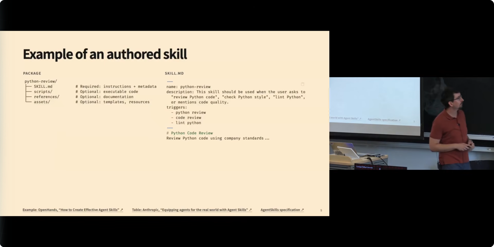
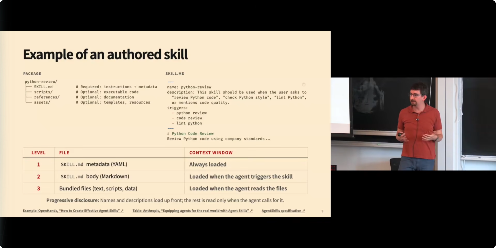
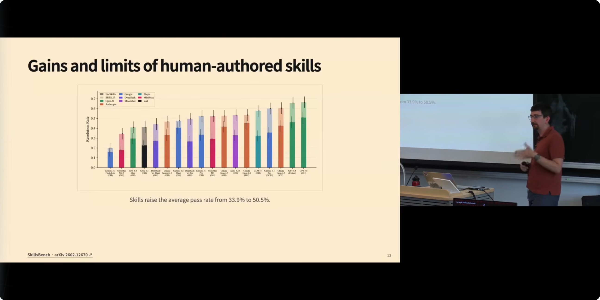
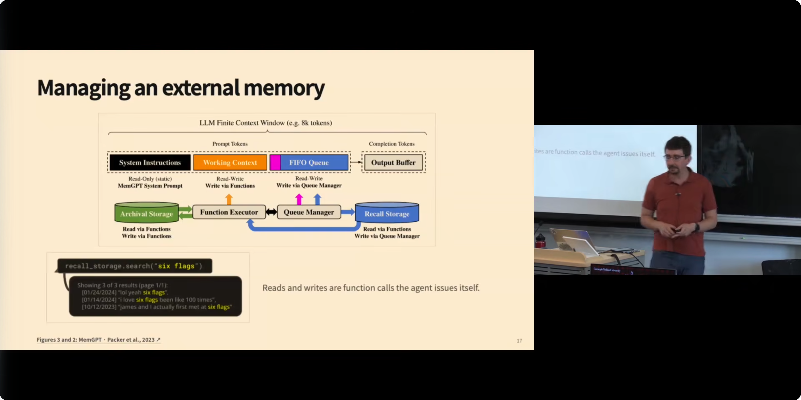
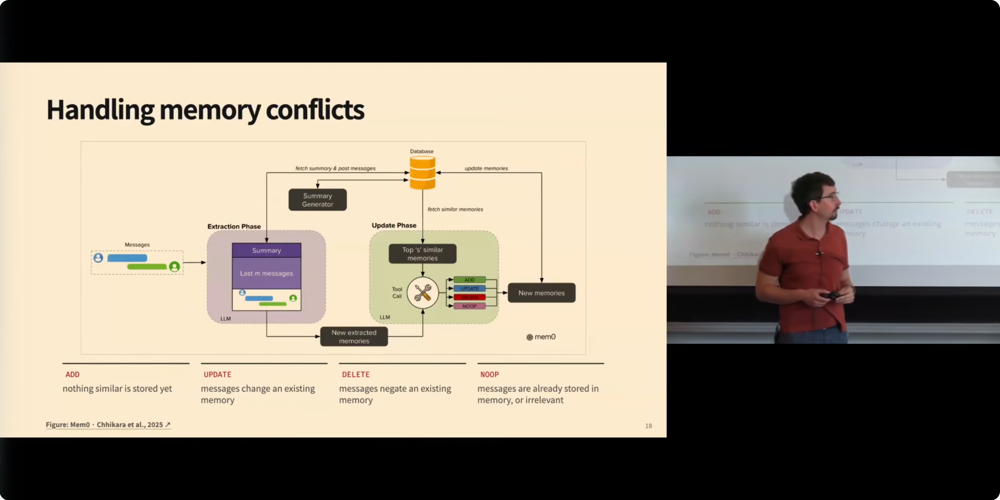
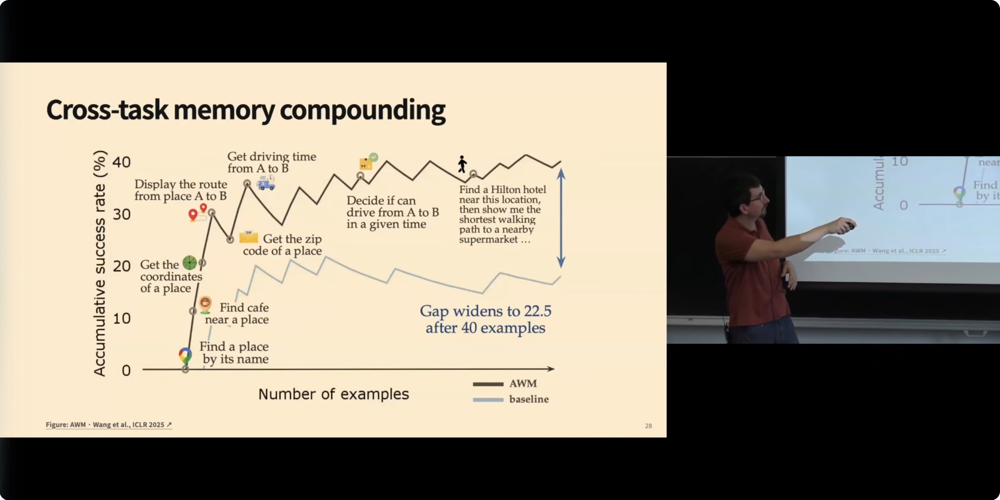
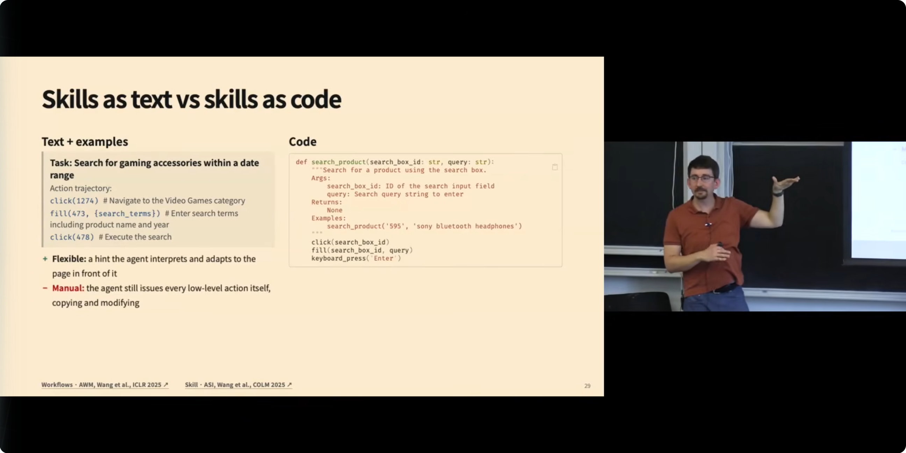
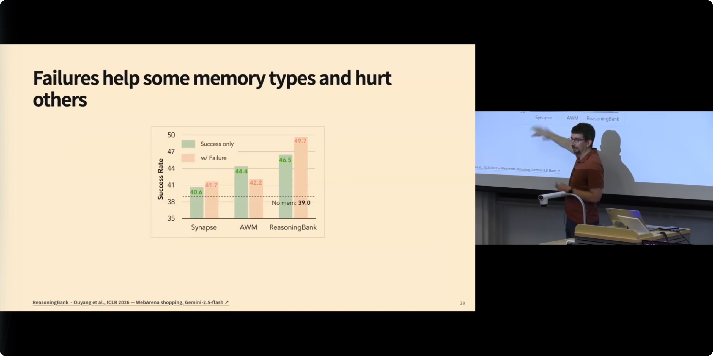
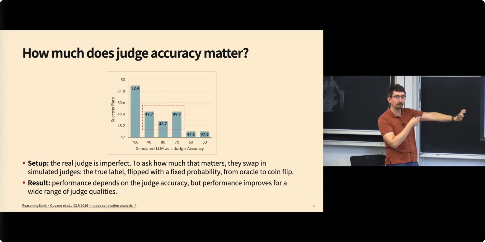

# Memory and Skills for Agents：智能体如何不从零开始

## Metadata

- **Title**: CMU AI Agents 2026 - 4. Memory and Skills for Agents
- **Author**: Daniel Fried（CMU LTI，11-768 AI Agents 课程；视频发布于 Graham Neubig 频道，Graham 也在课上补充发言）
- **URL**: https://www.youtube.com/watch?v=6zigF2a-2Pw

## Overview

上一讲讨论了智能体如何在**单个任务内部**管理上下文窗口、决定保留什么信息；这一讲把视角拉大到**跨任务**：智能体如何把过去的经验存到上下文窗口之外的外部存储里，让未来的任务做得更好。Daniel Fried 围绕两个互补的视角展开：一是**人写的技能（human-authored skills）**，即以 Agent Skills 标准（`skill.md` + YAML 元数据 + scripts/references/assets 目录）沉淀最佳实践，配合"渐进披露（progressive disclosure）"机制按需加载；二是**智能体从经验中自动归纳技能（skill induction）**，即在在线学习设定下，从成功或失败的轨迹中提炼可复用的文本工作流或代码函数，用 judge 模型把关入库，并通过消融实验回答"技能是不是越多越好""judge 要多准""失败经验对哪类记忆有效"等问题。课程最后落到前沿方向：用强化学习直接训练模型做技能归纳。核心结论是：技能系统不是简单的"存得越多越好"，检索质量、裁判质量、表示方式（文本 vs 代码）共同决定了记忆能否真正转化为能力。

## 按照主题来梳理

### 1. 开场与课程定位：从上下文窗口到跨任务记忆 [0:01](https://www.youtube.com/watch?v=6zigF2a-2Pw&t=1s)

Daniel Fried 开场先交代了课程后勤（第一次作业已发布、选课同学有算力额度可用），随即点明本讲与上一讲的衔接关系：上一讲讲的是智能体如何在**任务内部**选择保留哪些上下文，用上下文窗口本身当"任务内记忆"；而本讲的主线是——**智能体如何超越上下文窗口，把信息存到外部存储中，跨任务复用**，这就是技能归纳（skill induction）要解决的问题。

他同时提示了本讲的多视角结构。技能有两张面孔：一张是"人写给智能体的说明书"，把人对任务最佳实践的知识编码成指令；另一张是"智能体自己从经验里长出来的技能"。这两者不是对立的，而是互补的——可以想象一个有人在回路（human-in-the-loop）的系统：智能体从自己的经历中提出候选的最佳实践，人来编辑修改，如此往复；或者反过来，人写的技能由智能体根据实际使用经验不断打磨。Daniel 明确说这部分本讲只会涉及一小部分，但希望大家到课末能看到这些不同视角如何拼成一幅完整的图。这个开场实际上给整堂课定了调：**记忆与技能不是两个分离的话题，而是同一个"让智能体不必每次从零开始"的问题在不同保真度、不同来源上的投影**。对修课学生而言，本讲内容与第一次作业直接相关（作业里就要实现技能机制）；对研究者而言，这堂课的论文地图（MemGPT、Mem0、Reflexion、AWM、ASI、SkillWeaver、PolySkill、Reasoning Bank）基本勾勒出 2023–2026 年智能体记忆研究的主干道。

### 2. 动机：购物网站上反复出现的子结构 [2:00](https://www.youtube.com/watch?v=6zigF2a-2Pw&t=120s)

为什么要跨任务记忆？Daniel 用一个购物网站的 GUI 智能体例子把动机讲透。假设你让智能体执行"把 Sony 耳机加到我的愿望清单"，它会产生一串动作：导航到商店网站、找到搜索框、输入文本、点击搜索，然后找到匹配的商品加入愿望清单。过几天你又让它"查一下无线键盘的价格区间"——如果在同一个网站上，大量动作是**完全复用**的：还是要去商店、找搜索框、用类似方式搜索，只是搜索词不同、搜索后的处理不同。

这里的关键洞察是：**如果"怎么搜索"这件事对智能体来说很难（要试很多次才摸索出来），那么一旦它学会了，就应该能复用这份知识，而不是下次重新摸索**。Daniel 原话强调："a lot of structure recurs"（大量结构是重复出现的），今天这讲就是关于如何表示这种共享结构。随之而来的是一串设计问题，它们贯穿全课：

- **表示问题**：是保留原始动作序列（raw actions），还是抽象成代码函数？代码函数可以当黑盒运行、可以测试、甚至可以层级化地互相调用。
- **归纳问题**：智能体如何判断任务的哪个部分值得留到未来复用？
- **生命周期问题**：记忆库里只增不减吗？遇到冲突信息怎么办？发现更好的做法时要不要编辑旧条目？过时的条目要不要删除？

这个购物网站的例子选得很准：它既是 GUI 智能体的真实场景（后续 GUI 专题讲会展开表示空间和动作空间的细节），又足够日常，让"子结构复用"这件事一目了然。搜索框这个动作块——找框、输入、点击——就是全课反复使用的"技能"最小样本。

### 3. 智能体自我更新的三条路径 [4:36](https://www.youtube.com/watch?v=6zigF2a-2Pw&t=276s)

Daniel 给出一张总览图：让智能体"更新自己"大体有三条路。

**第一条：上下文窗口内更新（上一讲已讲）**。即 ReAct 式的做法——把过去的观察、动作、用户消息、环境反馈留在上下文里，在窗口限制和模型利用能力的约束下选择保留什么，典型技术如 compaction（压缩）。这条路的作用范围是**单个任务内部**。

**第二条：上下文窗口之外的外部存储（本讲主题）**。即便现在的模型有一百万 token 的上下文窗口，让一个智能体连续执行多个任务也迟早会爆掉，何况你本来就想把"上一个任务的经验"带到"下一个任务"。外部存储的形态可以是数据库，也可以是智能体能访问的文件系统。本讲的方法就是围绕"怎么放进去、怎么用、怎么更新"展开。

**第三条：直接改模型权重**。即监督微调或强化学习，后续课程会专门讲。

三条路径各有优劣，Daniel 特别强调了外部制品（external artifacts）的两个独有优势。其一是**可移植性（portable）**：一份"如何在某网站搜索商品"的描述可以被任意多个模型在同一个智能体框架里使用；而权重更新只属于那一个模型，不能迁移。其二是**可检视性（inspectable）**：人可以直接读、直接改一份文本形式的记忆，人与系统之间因此有了一个清晰的接口——智能体可以提议一段技能文本，人审阅后修改，迭代成本很低。这两条优势实际上解释了为什么"外挂记忆"路线在工程界（而不是只在学术界）流行起来：它不要求你拥有模型，也不要求你信任一个不可读的参数矩阵。

### 4. 课堂讨论：手写技能与智能体写技能的真实经验 [7:25](https://www.youtube.com/watch?v=6zigF2a-2Pw&t=445s)

在正式进入技术内容前，Daniel 做了一个现场调查，结果很有信息量：班上**大多数**同学已经在用编程智能体的技能（skills）功能；用技能的人里**大约一半**自己手写技能；而且有**相当多**的人让智能体替自己写过技能。

他随后请大家分享"智能体写技能"的翻车或成功案例，两个回答值得记录：

- **失败模式：过度推断（overinfer）**。有同学发现模型会把技能写得太满——它对"该怎么做"做了过多推断，而当这份技能被交给另一个模型执行时，后者会**逐字照办**，做出远超你本意的动作。这是"说明书过于具体反而有害"的典型。
- **成功模式：面向另一个智能体写说明**。有同学在处理生产环境事故时，给智能体看三四个同类工单的解决过程，让它"给自己写一份其他智能体也能照着做的技能"，效果很好。Daniel 点评说，这本质上是在**模拟另一个智能体的视角**；他个人的经验是，模型在"理论心智（theory of mind）"模拟上天然偏弱——不太会站在"另一个读者会怎么理解这份指令"的角度写东西——但只要你**显式提示它这么做**（theory-of-mind prompting），质量会明显提升。

这段讨论看似闲聊，实则埋下了全课最重要的实践教训之一：**技能是一种"写给读者"的文体，作者（人或模型）必须预判执行者会如何解读**。后面 SkillsBench 的结果会再次印证：模型凭空写技能，质量往往很差。

### 5. 三类可保留的经验：episode / fact / skill [9:19](https://www.youtube.com/watch?v=6zigF2a-2Pw&t=559s)

Daniel 把"值得保留的经验"分成三类，构成一个从高保真到高抽象的光谱。

**第一类：episode（情节）**。即完整的序列——环境给的观察、用户的输入、智能体采取的动作，原封不动地存下来。这是**最大保真度**：环境细节、用户指令的每个细节都在；但也是**最贵**的：占用 token 最多。而且就像监督学习里我们不会记住每个训练样本的全部细节一样，大部分细节对泛化无用，应该抽象掉。

**第二类：facts（事实）**。关于环境或用户的知识片段。早期记忆系统研究大多聚焦于此：用户告诉助手自己的年龄、住址，系统存下来用于改善后续交互。Daniel 直接点破：如果你用过 Anthropic 或 ChatGPT 的记忆功能，它们做的就是这件事——你可以进设置页查看系统存了哪些关于你的事实，那些文本条目就是模型从你的历史交互中提炼出来的。他也指出，这在形态上有点像 compaction：由 LLM 生成、存到外部。

**第三类：skills（技能）**。这是更贴近"智能体"这一身份的类型：**如何完成任务的某个子部分，且抽象掉了该次任务的具体细节**。比如"如何在这个网站搜索商品"，但不绑定"搜索的是 Sony 耳机"这个细节。技能的表示选择很多——纯文本？实际动作序列？代码？——这是本讲后半的核心战场。Daniel 补了一句冷静的话：**技能只有在你会重复做同一个子任务时才有用**。

这三类不是互斥的，而是一个"保留多少原始细节 vs 提炼多少可泛化结构"的权衡轴。全课后面的所有系统（MemGPT 管 facts、轨迹记忆管 episodes、AWM/ASI 管 skills）都可以放回这个光谱上定位。

### 6. 记忆与技能的交集：从经验中归纳技能 [11:44](https://www.youtube.com/watch?v=6zigF2a-2Pw&t=704s)

承接三类经验，Daniel 明确区分了"记忆"和"技能"两个概念，再指出它们的交集地带。

**记忆（memory）**是从智能体交互中保存下来的东西，比如"你之前在这个网站买过什么产品"——它回答的是"发生过什么"。**技能（skill）**是关于"如何在环境中行动"的可复用知识，表示方式多样：可以是"发布应用前必须过一遍的检查清单"这样的文本，可以是动作模板，也可以是代码。技能可以由人编写——组织政策、公司写代码和测试代码的规范，都是典型的人写技能。

真正的交集是**归纳技能（induced skills）**：从智能体过去的经历中提炼出技能并存储，期望未来做得更好。如果智能体过去成功搜索过某个产品——注意 Daniel 在这里谨慎地加了限定"if we think that it was successful"（如果我们认为它成功了，预告了后面 judge 模型的登场）——我们就可以从这段成功经历中抽出一份"长得像技能"的东西来指导未来。

他还顺手对比了两条来源路线的优劣。**人写技能**：出处明确、质量可控，但写作和维护都很花时间。**智能体学技能**：可以全自动化，甚至可以构成闭环——归纳技能、用技能重跑任务、看指标有没有变好；但不可避免地引入噪声，而且当技能被交给另一个智能体使用时，可能有意想不到的后果（呼应第 4 节的 overinfer 案例）。这个"交集"视角是整堂课的枢纽：前半讲人写技能及其标准，后半讲自动归纳，两者最终在 Agent Skills 这类统一格式里汇合。

### 7. 人工编写技能与 Agent Skills 标准 [13:54](https://www.youtube.com/watch?v=6zigF2a-2Pw&t=834s)

进入"人写技能"部分。Daniel 推荐了 OpenHands 的一篇技能使用指南博客，其动机例子非常接地气：你发现自己总是给编程智能体重复同一套指令——代码要用某几个 linter 检查、要写类型标注、docstring 要用特定风格、所有函数要跑 pytest——那与其每次手打，不如把这套指引存成文本文件，让智能体按需取用。**什么时候该写技能？当你要按一个固定规范反复做同一件事的时候**。规范本身固定，但智能体在具体语境中如何解释执行，由它现场决定。

在实现层面，目前的标准叫 **Agent Skills**，其形态极其朴素：**就是一组智能体能读的文件**。一个技能包的结构是：

- **`skill.md`（必需）**：一个 Markdown 文件，开头是 YAML 元数据。元数据必须包含技能的**名称**和一段**简短描述**——这段描述是给语言模型看的"何时该用这个技能"的指引。头部之后是更详细的正文，比如"应该跑哪些 linter、测试该怎么跑"等完整说明。
- **`scripts/`（可选）**：可执行代码。比如一个跑 linter 的 Python 脚本可以放在这里，在 `skill.md` 里描述它的存在。
- **`references/`（可选）**：补充文档。不是每次用技能都需要，但 `skill.md` 里会引用它们，智能体按需加载。
- **`assets/`（可选）**：模板或其他资源。比如涉及 Jinja 模板（口述中发音接近 "Ginga"，实指 Jinja）的场景，需要时让智能体条件性加载。

值得注意的是这个标准的"低技术含量"：没有数据库、没有特殊运行时，就是文件系统里的一个文件夹。这种朴素正是它的力量——任何能读文件的智能体框架都能支持它，技能的创建、评审、版本管理都可以直接复用软件工程的全部既有工具链。

### 8. 渐进披露：三级按需加载机制 [17:34](https://www.youtube.com/watch?v=6zigF2a-2Pw&t=1054s)

一个技能包可能包含大量信息，而模型上下文窗口是稀缺资源，不可能把所有技能的全部内容塞进去。Agent Skills 标准对此的答案是 **渐进披露（progressive disclosure）**：只在需要时，向智能体展示技能的相关部分。它分三级：

- **Level 1：YAML 元数据（名称 + 描述），总是加载**。只要技能对模型可用，这一级就出现在系统提示里。推论很直接：**描述必须写得简洁**，否则技能一多，光元数据就把上下文占满了。
- **Level 2：Markdown 正文，条件加载**。模型根据 Level 1 的描述判断某技能相关时，通过一次工具调用（tool call）读取 `skill.md` 的剩余内容。
- **Level 3：打包的附属文件，按需加载**。scripts、references、assets 里的内容同样通过工具调用读取。这意味着 `skill.md` 正文里必须包含足够的信息，让模型知道"这个技能还有额外的目录值得翻"——否则 Level 3 的资源等于不存在。

Daniel 提醒修课同学：第一次作业就会实现这套机制（不少人已经开始做了）。

渐进披露本质上是一种**注意力预算分配策略**：用最低的常驻成本（每技能一两行元数据）维持一个庞大的技能库的"可发现性"，把昂贵的全文加载推迟到"模型自己判断值得"的时刻。它把"装多少技能"从窗口容量问题转化成了模型的相关性判断问题——这也预告了后面的核心议题：触发灵敏度取决于模型本身。

### 9. 问答精选：技能太多、触发灵敏度、为什么是 Markdown、大规模检索 [19:03](https://www.youtube.com/watch?v=6zigF2a-2Pw&t=1143s)

这一段是密集的学生提问，几乎每个问题都命中技能系统的真实痛点。

**技能数量会不会拖累性能？** 会。即使每条元数据很短，技能一多也会出问题。Daniel 给了具体数字：业界顶尖的 Hermes 智能体（开源、能使用也能归纳技能），其系统提示里技能描述的总长度约 **3,000 token**。而且有论文证据（稍后讲的 SkillsBench）表明：塞入不相关技能会**降低**性能——上下文变长只是表面原因，更深层的是模型会被无关选项**分散注意力**。不过他也给了实用主义的分寸：现实中很少有上千上万个技能的场景，通常是较小规模、按软件任务需要条件性加载。

**触发有多灵敏？** 触发就是模型自发产生的工具调用，因此**完全取决于模型**——取决于模型能否基于上下文和它掌握的描述预判"该用这个技能了"。你的描述写法影响触发率，这正是为什么需要评测。

**`skill.md` 是标准化名字吗？** 是。标准名为 Agent Skills（AgentSkills specification），智能体框架按此约定加载。你可以偏离格式，但最好尽量贴近；反正这些都是给语言模型读的指令，只要你在 `skill.md` 里把自定义结构描述清楚，模型有一定鲁棒性。

**为什么用 Markdown？会不会有更好的格式？** Markdown 是机器可读与人可读之间的平衡点：线性、支持超链接、可嵌图片；但表达动态内容（比如"数据可以这样或那样可视化"）就力不从心，那时更适合在 scripts 里放一个可执行的交互式程序、在 Markdown 里引用它。Graham 在此补充：科学文献里基本就是两类技能——文本技能（写在 Markdown 里）与程序性技能（放在 scripts 里），这个二分覆盖面其实相当广。

**大规模技能库怎么做检索？** 有学生举了"银行改云基础设施、AWS 里有海量组件"的例子。Daniel 确认：研究论文里确实有人从大技能池中检索——或者用文本嵌入检索，或者做领域条件化（"这些技能属于这个网站，跟这个网站交互时就加载它们"）。他推测生产系统也这么做，但手头没有公开参照。

### 10. 实例：Hermes 系统提示与 skill view 工具流程 [24:36](https://www.youtube.com/watch?v=6zigF2a-2Pw&t=1476s)

为了让渐进披露从概念落到代码，Daniel 展示了 Hermes 智能体的真实系统提示结构。它做三件事：先向模型解释"技能是什么"；再告诉模型有一个 **skill view 工具**可以读取技能的完整 Markdown；最后列出所有可用技能的 Level 1 索引（示例中只有 code quality 和 workflow 两个技能，内容就是各自 `skill.md` 的 YAML 元数据原样搬入）。

运行时流程则是一次典型的"观察—决策—工具调用"循环：

1. 系统提示里始终只有技能索引（Level 1）。
2. 用户请求"review 一段 Python 代码"，模型判断相关，发起一次工具调用打开 python review 技能（Level 2）。
3. `skill.md` 全文作为 skill view 工具的执行结果，以一条观察消息（observation）的形式进入上下文窗口。
4. 智能体可能进一步运行 scripts 目录里的脚本，把脚本执行结果同样作为观察纳入窗口。
5. 需要时再用工具调用翻技能包里的其他文件（Level 3）。

这个流程里有一个容易被忽视但重要的设计：**技能的每一级内容都是以"工具调用的返回"身份进入上下文的**，而不是以"系统预置知识"的身份。这意味着技能的使用轨迹天然留在对话历史里——模型什么时候查了哪个技能、查到了什么、随后做了什么，全部可审计。这与第 3 节强调的外部制品"可检视性"一脉相承：技能系统不仅让人能检视技能本身，也让人能检视技能的**使用过程**。对调试"智能体为什么这样做"来说，这是无价的设计副产品。

### 11. SkillsBench：技能到底有没有用？[26:21](https://www.youtube.com/watch?v=6zigF2a-2Pw&t=1581s)

"技能多了是否有害""技能是否在正确的时机被触发"这类问题只能靠评测回答，而这方面的研究还很新。Daniel 介绍了该方向上"非常好的第一步工作"——**SkillsBench**（arXiv:2602.12670），其实验设计值得细看：

- **技能池**：从各种在线来源收集了约 **200 万个技能**。
- **任务集**：请标注者撰写 **400 个**看起来能从技能受益的任务。任务与技能**独立撰写**，然后由任务标注者从技能池中挑选看似适用于该任务的技能，形成一个小的精选技能子集。
- **评测面**：在 **4 个智能体框架 × 约 18 个模型**的组合上跑，比较"有技能 vs 无技能"的通过率（用人工撰写的验证标准判定）。
- **过滤机制**：先在一小批模型上验证"给技能确实能提升这些任务的表现"，确认任务—技能配对有效，再推广到更宽的框架与模型集合。

结果细致而清醒。**平均而言，技能有用**：给定精选技能集，平均通过率从 33.9% 上升到 50.5%（图上表现为多个模型/框架上实心柱对阴影柱的普遍超越）。**但两个负面结论同样重要**：其一，需要更少技能就能解决的任务，从技能中受益更多；需要更多技能的任务受益更少——部分是难度因素，但部分是**模型被更多可用技能分散了注意力**，可以想见技能数量再放大情况会更糟（本讲后面还有更多证据）。其二，**在某些任务、某些模型类型上，技能反而有害**——模型不恰当地使用了技能，以偏离任务本意的方式执行。这直接引出一个工程戒律：**写完技能必须验证它真的让输出变好了**，不能默认"有说明书总比没有强"。

### 12. 技能的来源与"基于真实交互创建技能" [29:36](https://www.youtube.com/watch?v=6zigF2a-2Pw&t=1776s)

技能从哪来？Daniel 列了三个来源：随框架（harness）捆绑分发；人手写后按框架指定方式安装；由智能体自己创建——Hermes 有 skill manage 工具，OpenHands 有 skill creator 命令引导你走完创建流程。

关于第三种来源，Daniel 给出一条强烈建议：**创建技能时务必基于已经发生的真实交互，而不是凭空（a priori）写**。这不只是经验之谈——SkillsBench 论文里有直接证据：让模型只根据任务描述自己造一个技能，**效果很差，甚至让性能变差**。相比之下，人写得更好，因为你知道自己想要什么样的做法；但即便对人，最好的做法仍是"先做一遍再总结"：**真实执行任务的过程中，会暴露出你事先根本想不到的偏好与约束**——只有做过了，你才知道自己原来在意这些。

这条原则与第 4 节的课堂讨论形成闭环：同学分享的"给三个历史工单、让智能体写排障技能"之所以成功，正因为它是**事后归纳**而非**事前杜撰**；而那些翻车案例，多半是模型在没有足够经验支撑时过度推断。把这条原则推广到组织层面也成立：团队的技能库应该是"踩坑史"的蒸馏物，而不是入职第一天拍脑袋写下的理想化流程。后面第 13 节的 OpenHands 案例和第 22 节以后的全部 skill induction 论文，都是这条原则的系统化实现——区别只在于是人来蒸馏，还是模型来蒸馏。

### 13. 案例研究：用 PR 评论采纳率迭代 code review 技能 [30:47](https://www.youtube.com/watch?v=6zigF2a-2Pw&t=1847s)

OpenHands 博客提供了一个"技能上线后如何验证与迭代"的完整案例，场景是 **code review 技能**——智能体按技能对 Pull Request 产出一组评审意见，怎么知道这份技能好不好？

方法设计得很聪明，关键在于找到了一个**真实行为信号**：评审意见产出后，PR 作者会逐条处理这些评论——要么采纳修改，要么忽略。"被采纳"就是评论质量的地面真值。流程如下：

1. 智能体用技能对 PR 产出 review 评论。
2. 人处理 PR 时，对每条评论留下"采纳 / 不采纳"的隐式标注。
3. 用一个**基于模型的 judge** 事后批量判定每条评论是否被人真正采纳，统计采纳率。
4. 在成百上千个 PR 上重复这个过程，积累大量"什么有效、什么无效"的证据。
5. 用一个推理模型（reasoning model）汇总全部证据，发现规律——案例中的真实发现是：**产出无视仓库既有惯例的代码建议很不受欢迎**，人们几乎不会采纳这类改动。
6. 让模型据此提出对 `skill.md` 的修改建议，使系统未来的评审更容易被人采纳。

这个案例的启示超出 code review 本身。它示范了技能工程的一个通用闭环：**找到用户行为的可观测代理指标 → 批量归因 → 用模型做跨样本归纳 → 回写技能文件**。注意整个回路里没有一个环节需要人工撰写规则，但每一步都有"人"的影子——采纳行为来自真人，汇总结论由模型提出但可由人审阅。这正是第 1 节所说"人在回路"的具体形态：技能是人和智能体共同编辑的活文档。

### 14. MemGPT：上下文窗口之外的记忆管理 [32:25](https://www.youtube.com/watch?v=6zigF2a-2Pw&t=1945s)

转入"让模型自动记忆"的部分。Daniel 先讲一篇 2023 年的老论文 **MemGPT**（Packer et al., 2023）——最早系统提出"在语言模型上下文窗口之外管理记忆"的工作之一，而且明显是**受操作系统启发**的：几讲之前课程谈过记忆层级——访问快的小存储（对语言模型就是上下文窗口）配访问慢的大存储（外部事实库）。当年上下文窗口只有约 8,000 token，所以这个思路对普通助手就很有必要；今天窗口大了，但我们想存的东西也大了，因此这个思路对智能体依然成立。

MemGPT 的具体设计：

- **系统指令（System Instructions）**：只读、静态，内含 MemGPT 系统提示本身。
- **工作上下文（Working Context）**：可读可写，从外部记忆取内容、也向外部记忆写内容，读写都由**模型自己发起的工具调用（函数）**控制。
- **FIFO 队列**：滚动存放近期消息，由队列管理器写。
- **Archival Storage（归档存储）**：事实性记忆的长期仓库，经函数读写。
- **Recall Storage（回忆存储）**：系统实际收到过的消息记录，管理方式类似。

Daniel 用一个例子说明它怎么工作：用户提到"Six Flags"（六旗游乐园），系统可以发出 `recall_storage.search("six flags")` 这样的工具调用，从存储里搜出历史交互中关于 Six Flags 的记录（"去年我们聊过六次 Six Flags"之类），放进工作上下文，模型生成回复时就能引用。幻灯片里那句话点出了本质：**"Reads and writes are function calls the agent issues itself"（读写都是智能体自己发起的函数调用）**——记忆管理的主动权从框架手里移交给了模型。

### 15. Mem0：记忆的冲突处理与增删改 [35:06](https://www.youtube.com/watch?v=6zigF2a-2Pw&t=2106s)

只会"追加"的记忆系统是不够的：你告诉系统"我在 X 公司工作"，后来跳槽了，系统必须用最新信息替换旧事实。**Mem0**（Chhikara et al., 2025）解决的就是记忆的**更新与冲突**问题，流程分两个阶段：

- **抽取阶段（Extraction Phase）**：消息进来后，用语言模型从中提取候选记忆——那些"可能值得存储或更新"的事实（输入通常带摘要和最近 m 条消息）。
- **更新阶段（Update Phase）**：对外部数据库做嵌入检索（embedding-based retriever，取 Top-K 相似记忆），再用语言模型逐条比对"新提取的记忆"与"检索到的相似记忆"，裁决为四种操作之一：
  - **ADD**：库存没有相似条目，直接新增；
  - **UPDATE**：新消息改变了既有事实，用新内容替换旧条目（比如换工作）；
  - **DELETE**：新消息**否定**了既有事实——"我在 X 工作"之后说"我被裁员了"，此时应删除而非更新；
  - **NOOP**：新消息与库存重复或无关，忽略。

Daniel 说明细节对智能体场景会有变化，让听众去看论文，但强调核心思想——**记忆系统必须能处理冲突、能更新知识**——非常有用。这套四操作设计其实把记忆库变成了一张需要事务语义的状态表，而裁决者是一个 LLM：这是"用模型管理模型自己的记忆"的又一个实例，也预告了后面 Reasoning Bank 里"judge 质量决定一切"的消融实验——因为这里的每个 UPDATE/DELETE 决策，本质上都是一次模型裁判。

### 16. 与 DeltaNet 的呼应及 unlearning [37:18](https://www.youtube.com/watch?v=6zigF2a-2Pw&t=2238s)

Daniel 向全班提问：之前讲上下文管理那一讲，有没有哪个方法跟"更新/删除记忆"目标相似？有同学答出"hashing（哈希）"，继而有人答出具体论文——**Delta rule / DeltaNet**。

他随即把两条线打通：DeltaNet 所在的线性注意力（linear attention）世界里，键—值—查询（key-value-query）结构中的"值"是向量，普通线性注意力**只能追加**新值；而 Delta rule 的做法等效于"按查询检索到已存的条目，然后**改写**它对应的向量"，这一改动带来了性能提升。Mem0 做的事就是这件事的**文本版类比**：库存的不是向量而是文本事实，但"检索—比对—改写/删除"的逻辑同构。

Daniel 还把这个思想往第三条更新路径（改权重）上延伸：**训练进权重的知识同样需要遗忘机制**。当模型内化了相互冲突的知识时，"忘掉旧的"很有价值——**unlearning（遗忘学习）**就是这个方向上的早期探索。这段呼应虽然简短，却完成了一次重要的概念统一：无论记忆存在上下文里、外部数据库里还是权重里，"追加"都容易，"修改与删除"才是真正的设计难点；三种载体各自发展出了自己的答案（压缩/逐出、Mem0 四操作、unlearning），背后是同一个问题。

### 17. Reflexion：用自然语言反馈改进重试 [38:54](https://www.youtube.com/watch?v=6zigF2a-2Pw&t=2334s)

接下来是两篇为智能体奠基的记忆论文。第一篇 **Reflexion（反思）**——Daniel 称它"简单但极其有效、影响巨大"，并建议凡是做"希望智能体能从过去经验受益"的项目的人都该实现它。

Reflexion 瞄准的设定是：**同一任务的多次尝试**。智能体尝试"在某网站搜索商品"，自称完成后，系统获得关于"这次尝试是否正确"的反馈（可以来自人工检查，也可以来自模型裁判）。得到反馈后让模型再试一次，关键是第二次尝试时给它什么条件。Reflexion 的答案是：**一段自然语言的"复盘"**。

论文中的例子：任务要求回答"某一系列战役"，模型第一次只答了一场战役；系统基于"答案是错的"这一判定，由语言模型生成针对性反馈——"你只给了一场战役，而题目问的是一系列战役"。模型在第二次尝试时以这段反馈为条件，就能修正答案。Daniel 强调这个机制的妙处在于**反馈的载体是自然语言**：不需要改权重、不需要结构化标签，一段"你错在哪、为什么错"的文字就足以引导模型在重试时做对。

他同时点出了泛化方向：Reflexion 是"同一任务上越做越好"，但只要反馈足够一般化（general），它也能帮助智能体在**相似任务**上表现更好——这就从"任务内重试"过渡到了"跨任务经验"，正是后半讲的主题。可以说 Reflexion 提供了技能归纳的原始原型：从经历中提炼出一段指导未来的文字。区别仅在于 Reflexion 的提炼物服务于"下一次重试"，而技能系统要让它服务于"未来所有相关任务"。

### 18. 轨迹记忆：面向智能体的 RAG [40:53](https://www.youtube.com/watch?v=6zigF2a-2Pw&t=2453s)

第二个奠基性思路是**记住完整轨迹（trajectory / episode）**：把过去做过的整段任务历程存起来，用它塑造未来的行为。Daniel 概括了这一类工作的通用范式（幻灯片底部列了若干论文链接）：

1. 准备一组任务轨迹的集合——可以是人类演示，也可以是智能体逐个执行任务时自己积累的；
2. 可选地用 Reflexion 式方法为每条轨迹生成描述性/反馈性文本；
3. 形成一个经验池（pool of experiences）；
4. 新任务到来时，从池中**检索**出与当前任务相关的轨迹（及其生成文本），放进上下文窗口；
5. 模型以这些"过来人的完整经历"为条件执行新任务，通常表现更好。

Daniel 一句话定位：**这本质上是"面向智能体的 RAG"（retrieval-augmented generation，检索增强生成）**，而且相当有效。

问答环节澄清了两个术语要点。**什么是轨迹（trajectory）？** 智能体收到的一整串消息序列：环境与用户的观察、它采取的动作（工具调用）、以及它产生的思维链（chain of thought）——"基本上就是模型上下文窗口里出现过的全部消息序列"。**怎么检索？** 典型做法是把新任务的文本描述用嵌入模型编码，与经验池中各任务的描述做嵌入检索；也可以加领域约束——只在当前域的任务轨迹里检索；还有工作比较处理后的序列集合做匹配。Daniel 强调这是一整**类**方法，具体实例化各不相同（经验怎么建、检索怎么做都有变体），但核心直觉一致：**把过去的成功轨迹当范例展示给智能体，能帮它做得更好**。

### 19. 技能表示的脆弱性：元素 ID 一变就失效 [44:22](https://www.youtube.com/watch?v=6zigF2a-2Pw&t=2662s)

有了记忆与反馈的奠基，终于可以正面讨论技能归纳。Daniel 回到购物网站例子：让智能体"显示某查询的结果"，它产生思维链，然后产生具体操作——点击某个以 ID 标识的元素（搜索框）、输入查询、点击另一个元素（搜索按钮）。这一小段任务块在未来的任务（"查某商品的价格区间"）中会被原样需要。那么，**把这段动作序列原样存为技能，是好的表示吗？**

有学生立刻指出问题所在：如果页面上的元素 ID 变了，技能就失效。Daniel 确认并展开：ID 变动有很多成因——同一个页面但元素重新编号了；可以通过改造动作空间缓解一部分（JY 的 GUI 讲座会讲）；但如果换一个搜索界面不同的网站，这种技能必然崩溃，本讲后面有真实案例。

这段讨论为后半讲的"文本 vs 代码"之争埋下伏笔：**任何把技能钉死在具体环境细节（元素 ID、页面结构）上的表示，无论文本还是代码，都继承了同样的脆弱性**。区别在于柔性——文本技能把动作序列当作"提示"，模型执行时可以现场替换失效的 ID；代码技能把动作序列编译成"程序"，输入参数之外的任何东西变了它都不知道怎么绕开。技能的表示问题因此不是"哪种格式更优雅"的问题，而是**把多少决策留给执行时刻的模型**的问题——这个视角会贯穿剩余的课程。

### 20. 先驱工作：Voyager 与 DreamCoder [46:31](https://www.youtube.com/watch?v=6zigF2a-2Pw&t=2791s)

Daniel 特意致敬了两条为技能归纳奠基的先驱研究线。

**Voyager**：在 Minecraft（我的世界）里控制智能体，用**代码**作为控制方式——代码函数实现"合成某个物品""与僵尸战斗"之类的子任务。把子任务表示成函数有一个深远的好处：**函数可以互相调用**。智能体先学会简单事物的函数，之后就能在更复杂的函数里调用它们，完成复杂度递增的任务。这是"技能库即程序库"的第一次成功演示。

**DreamCoder**：来自程序归纳（program induction）社区的代表作。设定是有一组对象的语法（grammar）和若干"用非常底层的函数构造出的完整对象"样例；系统在其中**搜索反复出现的模式**，把可抽象的模式提炼成函数，然后在新一轮里基于扩充后的函数库继续搜索——每轮迭代都在**压缩**构造这些对象的程序。后续工作把大语言模型、Python 代码与自然语言描述整合进了同一框架。

Daniel 点明这两条线的当代意义：它们的核心思想——**从经验中发现可复用结构、表示为可调用的程序、构建可层级组合的库**——对"用语言模型与世界交互的智能体"同样适用。今天讲的 AWM、ASI、SkillWeaver、PolySkill，本质上都是把 Voyager/DreamCoder 的循环搬进语言模型智能体的设定：底层函数换成了 GUI 动作与工具调用，搜索换成了 LLM 生成，验证换成了执行 + judge。历史脉络的交代也提醒学生：skill induction 不是大模型时代的发明，而是程序合成老树在智能体土壤上的新枝。

### 21. 在线学习设定与技能生命周期 [48:22](https://www.youtube.com/watch?v=6zigF2a-2Pw&t=2902s)

评估"归纳并使用技能"的系统，典型的设定是**在线学习（online learning）**：任务一个接一个到来，其中一些彼此相似；系统在解决任务的过程中**增量式**地积累技能记忆，期望后续任务越做越好。例子里，第一个任务"把 Sony 蓝牙耳机加入愿望清单"触发一个归纳步骤，产出"搜索商品""加入愿望清单"这样的技能入库；下一个任务如果也要搜索商品，就可以复用，表现理应更好。评估问题是：**成功率是否随任务数上升？系统能否解决复杂度递增的任务？**

Daniel 接着给出了贯穿后半讲的分析框架——**技能生命周期的四个环节**，后续论文各攻其中一段：

1. **归纳（学习步）**：任务进来，从中提炼技能；
2. **入库决策**：这个技能该不该存进随时间累积的记忆库（judge 在这里登场）；
3. **使用**：用记忆库中的技能提升当前任务表现（涉及检索与注入上下文的策略）；
4. **简化/整理**：技能太多时要删减——删掉没人用的、把过于具体的泛化、把多条合并（consolidate & merge）。

这个四环节框架是听后半讲的地图：AWM 主攻 1–3（归纳 + judge 入库 + 上下文注入），SkillWeaver 给第 1 步加了"测试与修订"的回路，PolySkill 处理第 3 步的"按站点条件激活"，最后两篇消融论文分别拷问第 2 步（judge 多准才够）和第 3、4 步（库多大合适、如何淘汰）。把每篇论文定位到生命周期的一个环节，就能看到它们不是互相竞争，而是拼图的各块。

### 22. Agent Workflow Memory：judge 把关的文本技能归纳 [51:14](https://www.youtube.com/watch?v=6zigF2a-2Pw&t=3074s)

Daniel 深入讲的第一篇 skill induction 论文是 **Agent Workflow Memory（AWM）**——CMU 自己的工作，由 **Zhiruo Wang**（口述中名字发音接近 "Zora Wong"，此处按论文信息还原；她本学期还会来做客座讲座）主导，Graham 与 Daniel 本人参与，发表于 ICLR 2025。

应用于网页任务的 AWM 流程：智能体执行"告诉我我们商店到目前为止收到了多少条评论"这类查询，产生一串真实的工具调用；然后让语言模型审视这段调用序列，**找出其中可能在未来任务中复用的部分**，输出所谓 **workflow**——一种"文本 + 动作"的技能表示：包含子任务描述（如"搜索某个条目"）和执行该子任务的动作序列。关键的一步是**泛化**：模型被要求把具体动作序列模板化，抽掉"搜索的是哪个词"这类细节，使其适用于别的搜索词。Daniel 提醒：这已经看起来很像代码了，后面会专门比较代码表示（更好之处与更脆弱之处）。

同样重要的是入库门槛：**一个 judge 模型先看轨迹、预测它是否正确，只有被判为成功的轨迹，其归纳出的 workflow 才会进记忆库**——"我们不想记住错误的做法，那会带偏未来"。使用时，记忆库中的 workflow 直接放进模型上下文窗口（可以全量放，也可以只放文本描述，取决于技能数量与模型上下文长度）。

结果图非常有说服力：在地图工具基准上，无记忆的基线智能体（蓝线）收敛在 10% 左右；加入子任务记忆的 AWM（黑线）持续提升，**40 个样例后差距拉大到 22.5 个百分点**，且能逐步完成基线做不到的复杂任务（"找这个位置附近的酒店并给出步行路线"）。横轴上标注的任务文本（从"按名字找地点"到"找附近咖啡馆"再到多跳任务）直观展示了"经验复利"的过程。

### 23. 文本技能 vs 代码技能 [55:25](https://www.youtube.com/watch?v=6zigF2a-2Pw&t=3325s)

AWM 用的是"文本 + 示例动作"的混合表示；下一个问题是：如果直接用**代码**表示同一个技能，会怎样？Daniel 并排展示了同一个 `search_product` 技能的两种写法，并分析了各自的执行语义。

**文本 + 示例（Text + examples）**：任务描述加一段动作轨迹（如 `click(1274)`、`fill(473, {search_terms})` 这样的低层动作），整体作为**提示**留在上下文窗口里。优点（幻灯片标注为 "+ Flexible"）：它是给模型的**线索**，模型在新语境里自己解释、自己适配——搜索词不同？换个词填进去；网站改版、原来的搜索框元素没了？模型可以选正确的元素替代。缺点（标注为 "− Manual"）：**智能体仍要自己逐个产出所有低层动作**，每一步都要观察页面、生成思维链、发出动作，成本一点没省。

**代码（Code）**：技能是一个带 docstring 的 Python 函数（`search_product(search_box_id, query)`），智能体把它当**工具**调用——传对参数、函数正确，就不用自己生成任何低层动作。学生总结缺点一针见血："It's very rigid"（太僵硬）——调用它就必须原样执行那三步，没有偏离的空间。但 Daniel 强调代码也带来一揽子软件工程的红利：**函数可嵌套、可层级组合；可以针对单个函数独立生成测试用例（不必跑完整条轨迹）；可以重构**。

这场对比没有给出"谁更好"的结论，而是给出了**权衡的结构**：文本表示把决策权留在执行时刻（柔性、贵、慢），代码表示把决策权前移固化（刚性、省、快）。后面三节会分别展示这条权衡轴的两端如何被各自突破——代码可以测试修订（第 24 节）、代码在跨站点时碎裂（第 25 节）、而抽象类可以两者兼得（第 26 节）。

### 24. Agent Skill Induction 与 SkillWeaver：把技能变成可测试的代码 [57:41](https://www.youtube.com/watch?v=6zigF2a-2Pw&t=3461s)

Zhiruo Wang 的另一篇论文 **Agent Skill Induction（ASI，全称 inducing programmatic skills，发表于 COLM 2025）**把 AWM 的循环搬到了代码表示上。流程与文本版同构：给定一段工具调用轨迹，利用"语言模型也擅长写代码"这一事实，提示模型生成**抽象出轨迹行为的函数**——论文中的真实例子是模型写出 `search_reviews` 和 `open_marketing_reviews` 两个函数，带 docstring，函数体是低层工具调用；同时让模型把原轨迹**改写**成调用这些新函数的形式。

代码表示最漂亮的优势在这里兑现：**测试即执行**。文本技能只能靠 judge 审视原始轨迹来猜测对错；代码技能可以直接**执行生成的抽象代码**，然后把 judge 应用到执行得到的**最终结果**上。结果对了，是技能本身正确的更强证据；确认后，函数作为工具入库，成为模型可调用的工具库——系统性能随之提升。

**SkillWeaver** 进一步把这个回路闭环成伪代码式的迭代：任务进来 → 提议一组代码技能 → 用这些技能执行任务得到 episode → 奖励模型（reward model）评分 → 成功则入库；**失败则修订后重试**。修订的反馈来源多样且实用：论文中的真实案例是 `identify_pill` 技能——函数签名接收药丸的品牌、颜色等一串参数，但初版函数体**忽略了颜色参数**；用一个代码 linter 就能查出"参数未使用"，再以 Reflexion 式的方式把 linter 反馈作为条件让模型改出新版函数，重新执行验证后入库。奖励模型的反馈同样可以条件化进修订过程。Daniel 总结：即使代码函数本身更僵硬，**可测试性**带来的收益足以在很多场景补偿回来。

### 25. 代码技能的效率收益与跨站点泛化失败 [1:01:14](https://www.youtube.com/watch?v=6zigF2a-2Pw&t=3674s)

代码技能还有第二个大优势：**效率**。因为归纳出的函数变成了工具调用，智能体与环境交互的轮次大幅减少。ASI 论文中的真实例子：任务是"在页面上更新两处地址"，基线智能体要逐个执行低层动作——导航表单、逐字段输入；而归纳出 `navigate_to_address_settings` 和 `update_address_details` 两个函数后，**三步就完成任务**。速度提升的原因 Daniel 讲得很具体：智能体不再需要"重新观察网页 → 生成工具调用 → 再观察新页面 → 再生成"的循环——而观察网页（截图吃大量 token）和每步前的思维链，正是这类 GUI 智能体的主要成本瓶颈（JY 的 GUI 讲座会展开）。受控比较（在一组重复结构较多的任务上）显示：相对无记忆，**文本技能有提升，代码技能提升更多**——不止准确率，交互轮次上的效率收益也很可观。

但硬币的另一面是**泛化的脆弱**。团队测试了技能跨网站迁移：在一个站点上归纳的代码技能套到真实的 Target 购物网站上，直接失败——原技能假设交互元素是一个**下拉菜单**，Target 上却是一组**单选按钮**。要让技能存活，只能让模型在与环境交互中根据反馈**现场改写技能**。这个失败案例把第 19 节的理论担忧变成了实证：代码技能把环境细节编译进了程序，环境一变，程序就是错的；文本技能至少还留着"模型现场解释"的退路。如何既要代码的效率又要文本的柔性？下一节是给代码阵营的答案。

### 26. PolySkill：抽象类 + 站点特化实现 [1:04:20](https://www.youtube.com/watch?v=6zigF2a-2Pw&t=3860s)

代码阵营对"刚性"问题的回答是软件工程的经典武器：**抽象类与实例化**。**PolySkill**（在 ASI 基础上构建）的做法分两层：

1. 模型第一次与某个新网站交互时，先写一个**抽象类**——只定义方法签名、不写实现，比如"搜索商品""加入购物车""结账"这些 stub；
2. 再为当前网站写一个**具体实现**，比如 Amazon 站点特化版本，填入该站点的实际元素与操作；
3. 换到别的网站时，通过元数据或直接让语言模型判断"当前这个具体实现不再适用"，然后**为抽象类写一个新的实例化**。

实验显示这一做法有效。它还附带解决了一个前面反复出现的问题——**技能库的规模化**：可以有大量站点特化的具体技能，但任意时刻只激活与当前站点相关的那个子集。Daniel 的点评很到位："这就是软件工程最佳实践被应用到智能体上"——面向接口编程、依赖倒置，这些教科书原则原封不动地迁移到了技能库设计。

PolySkill 在课程叙事中的位置很关键：它把第 23 节看似无解的"柔性 vs 刚性"权衡拆成了**稳定的抽象层**（跨站点不变的任务结构）和**可替换的实现层**（站点相关的交互细节），从而回答了第 25 节的 Target 失败——不是"代码不行"，而是"只有一个层次的代码不行"。同时它也呼应了第 9 节学生问的"领域条件化检索"：抽象类天然就是技能的索引结构，站点就是检索键。对想在课程项目里做技能系统的学生，这一节几乎就是现成的架构图纸。

### 27. 从失败中学习：Reasoning Bank 与负例的适用范围 [1:06:22](https://www.youtube.com/watch?v=6zigF2a-2Pw&t=3982s)

到这里为止，所有方法都在**从成功中学习**；Google 的 **Reasoning Bank**（Ouyang et al.，ICLR 2026）认真问了"能不能从失败中学习"。论文中的真实失败案例：让智能体搜"蓝牙耳机"，某网站的搜索逻辑是 **OR 而非 AND**——返回了"蓝牙"或"耳机"或"Sony"的 5,000 条结果；智能体在 5,000 条结果里翻页、迷失任务目标，最终失败。

Reasoning Bank 的做法是以 Reflexion 式的方式观察这条失败轨迹，产出**指导未来的文本策略**："应该给更具体的搜索词""应该设置更大的单页显示数量，让模型一次看到更多内容"。框架上与 AWM/ASI 相同，但归纳物从"成功轨迹的抽象"换成了"适用于失败轨迹的文本反馈"——也正是你手写技能时会写的那种注意事项。

消融结果非常干净：在 WebArena shopping 上，**往记忆里加负例，对完整轨迹型记忆（Synapse）和工作流型记忆（AWM）都没有帮助**（甚至略降：Synapse 40.6→41.7 基本持平，AWM 44.4→42.7 下降），**唯独文本策略型记忆（ReasoningBank）从 46.5 显著提升到 49.3**。Daniel 给的解释直觉清晰：文本策略可以**以一般化的方式描述"如何避免失败"**，而轨迹与工作流只能让你"记住并条件化在具体的失败现场上"——后者没有泛化的载体。这也精确刻画了第 5 节光谱上不同保真度的记忆各自擅长什么：越具体的表示，越难承载"教训"这种本质上抽象的东西。

### 28. judge 质量消融：多准的裁判才够用？[1:08:50](https://www.youtube.com/watch?v=6zigF2a-2Pw&t=4130s)

几乎所有记忆系统都在同一点上押了注：**用一个模型当 judge**，看轨迹的最终状态、对照任务目标，判断"这次成功了吗"——这个判断决定哪些经验入库、归纳出什么策略。judge 不完美，那么**judge 的准确率多大程度上决定整个系统的性能？** Reasoning Bank 做了一个漂亮的受控消融：

- **设定**：先用完美 judge（直接用任务成败的真实标签）跑系统；然后以固定概率翻转标签，模拟从 oracle 到抛硬币（准确率 100% → 50%）的各种裁判。
- **结果**：judge 准确率 100% 时成功率 52.4；90% 时 49.7；80% 时 48.7；70% 时 49.7；到 60%、50% 才降到 47.6。性能确实随裁判质量下降，但存在一个**很宽的"甜区"**——judge 准确率在 70–100% 之间时，记忆带来的提升基本保持；直到裁判接近瞎猜，收益才明显缩水。

这个结论对工程实践是好消息：你不需要完美的自动评判器就能从记忆系统中获益，一个"还不错"的 judge 已经够用。但 Daniel 也明确说这里还有未来工作的空间——比如 judge 的错误模式（随机翻转 vs 系统性偏见）可能比对齐到单一准确率数字更值得研究。把这一节和第 15 节放在一起看，会得到一个统一的观察：**从 Mem0 的四路裁决到 AWM 的入库筛选再到 Reasoning Bank 的策略归纳，记忆系统的每一步都由"模型裁判"把关，因此裁判质量是整个架构的第一性约束**。

### 29. 记忆条目数量消融与缓存式淘汰 [1:10:19](https://www.youtube.com/watch?v=6zigF2a-2Pw&t=4219s)

本讲开头有学生问"技能太多是否有害""检索器质量重不重要"，Reasoning Bank 的消融实验直接回应了：**控制从记忆库检索的经验条数，性能确实随可用条目增多而下滑**。Daniel 拆解了两种可能的解释：

- **设定本身的局限**：如果你只让智能体跑过很少的任务，记忆库里根本就没有与当前任务相关的经验，塞更多条目必然全是噪声——"你只能从相似的经历中学到东西"，这是方法在该设定下的根本限制，不是模型的问题。
- **模型本身的局限**：模型可能被上下文窗口里更多无关条目带偏。这个方向**可以通过训练修复**——训练模型不被无关上下文干扰、更擅长甄别真正相关的东西。

应对策略之一是**主动缩小记忆库**，减轻模型筛选负担。Daniel 提到他们自己做过的工作，用的是**缓存式的淘汰策略（caching-type approach）**：统计记忆库中每条目历史上被使用的频率，**长期不用的条目直接丢弃**。效果是两方面的：效率上，上下文窗口不用塞那么多东西；成功率上，如果模型确实会被无关条目分散注意力，那么瘦身后的库反而提高成功率。

这一节与 SkillsBench 的发现（第 11 节）拼成完整的证据链：从 benchmark 层面（技能多了平均收益递减、部分任务受害）到系统层面（检索条数多了性能下滑）再到缓解手段（按使用频率淘汰），"记忆库不是越大越好"已经是多方验证的结论。它与第 21 节生命周期的第 4 环节（简化/合并）呼应：**记忆系统的长期健康靠"会忘"，而不只是"会记"**。

### 30. 用强化学习直接训练技能归纳 [1:12:43](https://www.youtube.com/watch?v=6zigF2a-2Pw&t=4363s)

收尾部分，Daniel 指出前面所有方法共有的"临时性"：都是**提示**语言模型看过去的经历、产出看似有用的技能——模型本身从未被训练过"如何做好技能归纳"。自然的问题是：**能不能直接训练模型做这件事？**

答案是能，而且是非常新的方向（相关论文当年刚在 ACL 出现）。设定就是把评估用的在线学习设定直接搬到训练里：**在序列化的相似任务上做强化学习**——任务一个接一个来，系统像之前一样归纳技能、建记忆库、在后续任务中使用记忆。整个系统相当复杂（多个模型协作、存取检索、记忆注入），但 Daniel 点出 RL 的妙处："强化学习不在乎"——**你可以把 RL 施加在这样复杂、不可微（non-differentiable）的流程上**（后续课程会讲怎么做）。

奖励设计很直白：第二个任务成功了吗？它用没用过去归纳出的技能？就用这个奖励信号训练技能归纳。已有的几篇论文都报告了收益，其中一个有趣的发现是：**加入"奖励技能复用"的奖励项能进一步提升成功率**。由此可以想见更多正则化的奖励设计，比如**惩罚过大的技能库**，防止系统过拟合式地囤积技能。Daniel 认为这里有大量值得探索的未来方向，并以一句总结下课：希望大家理解了技能如何被归纳、如何被人编写，这些会在作业与研究项目中直接用到。

这一节把全课的三条更新路径（第 3 节）完成了闭环：前 29 节都在讲"外部存储"这条路径，最后一节点出了它与"改权重"路径的合流——**用权重更新（RL）去优化外部记忆系统的运作策略**。技能归纳从"提示工程技巧"升级为"可训练的能力"，很可能是这个领域下一阶段的正门。

## 框架 & 心智模型（Framework & Mindset）

### 框架一：经验的三层保真度光谱（Episode / Fact / Skill）

本讲给出的最基础分析工具，是把"智能体可以保留的经验"排成一条**保真度—抽象度光谱**。光谱的一端是 **episode（完整轨迹）**：环境观察、用户输入、动作、思维链原样封存，信息最全、token 最贵、最接近"原始证据"；中间是 **facts（事实）**：从交互中提炼出的关于用户或环境的陈述，体积小、可读性好，是聊天助手记忆功能的主流形态；另一端是 **skills（技能）**：关于"如何完成某类子任务"的可复用知识，抽象掉具体任务细节，是智能体特有的记忆形态。

使用这个框架的方式是：面对任何一个记忆系统论文或设计，先问它"保留物落在光谱的哪一格"，然后就能预判它的强项与软肋。保留物越具体，迁移性越差、但对当下任务的指导越精确；越抽象，泛化越好、但提炼过程引入错误的风险越大。Reasoning Bank 的负例消融（第 27 节）就是这个框架的直接应用：负例只在光谱的抽象端（文本策略）有效，在具体端（轨迹、工作流）无效——因为"教训"本质上是抽象产物。同理，Mem0 的四路更新机制之所以重要，是因为 facts 这一格天然面临"事实会过期"的问题；而 episode 那一格的问题不是过期而是检索成本。设计你自己的记忆系统时，这条光谱就是第一个决策轴：先想清楚你要存的究竟是证据、知识还是能力。

### 框架二：技能生命周期管理（归纳 → 入库 → 使用 → 简化）

Daniel 用"生命周期"把技能系统拆成四个可独立设计、独立评估的环节。**归纳**：从刚完成的轨迹中提炼候选技能——提示模型抽象、模板化掉任务细节，表示上选文本、代码或两者混合。**入库**：不是归纳出来的都存——judge 模型先判断原轨迹是否成功，成功的才入库；代码技能可以更严格，直接执行代码、judge 执行结果。**使用**：技能以系统提示索引、上下文注入或工具的形式供模型调用，涉及检索策略（嵌入检索、领域条件化）和加载策略（渐进披露）。**简化**：库大了要主动瘦身——按使用频率淘汰、把过窄的技能泛化、把重叠的条目合并。

这个框架的实用价值在于**故障定位**。一个技能系统不 work 时，问题几乎可以总是归因到某一环：归纳环——提炼物过度具体或过度推断（overinfer）；入库环——judge 不准导致垃圾进库（但第 28 节的消融告诉你有 70% 以上准确率就有甜区）；使用环——触发不灵、检索不准、技能太多分散注意力（SkillsBench 与条目消融的双重证据）；简化环——只进不出导致库膨胀、上下文臃肿。论文地图也沿此展开：AWM/ASI 主攻归纳与入库，SkillWeaver 强化入库环的测试，PolySkill 优化使用环的条件激活，缓存淘汰工作补简化环。自己搭系统时，不要试图一次做对所有环节，而是先让"归纳—入库—使用"的最小闭环跑通，再按瓶颈逐环加固。

### 框架三：渐进披露作为上下文经济学

Agent Skills 标准的渐进披露机制（第 8 节）看似只是工程细节，实则是一个可迁移的通用框架：**用分级的"揭示成本"管理稀缺上下文**。Level 1（名称 + 一行描述）常驻系统提示，成本极低，功能是"让模型知道存在什么"；Level 2（完整说明）由模型判断相关后花一次工具调用换取，功能是"让模型知道怎么做"；Level 3（脚本、文档、资产）按执行需要再加载，功能是"让模型获得执行资源"。

这个框架背后的经济学原理值得抽象出来：上下文窗口是**固定预算的注意力市场**，每一份常驻内容都在向所有任务收租。渐进披露的本质是把"租金"改成"按次付费"——只为当前任务真正用到的知识付费。它的代价是把"什么相关"的判断权交给了模型，因此触发质量成为系统瓶颈（第 9 节问答），这也解释了为什么描述文本（Level 1 的唯一内容）的写作质量出奇重要：它是模型做"是否付费"决策的唯一依据。这个框架的应用远超技能系统本身：工具描述、记忆检索结果的注入、长文档的分块展示，都是同一个经济学问题。判断一个披露层级设计得好不好，看两条：每一级的"封面信息"是否足以支撑模型做出正确的加载决策；以及每一级的加载成本是否与其使用频率匹配——越常用的越该便宜，越冷僻的越可以昂贵。

### 心智一：让智能体写操作手册之前，先让它干活

全课反复出现、并被 SkillsBench 实验证实的一条实践心智是：**技能应该是经验的蒸馏物，而不是想象的产物**。让模型仅凭任务描述凭空写技能，效果差到"反而拉低性能"；而让它先做几遍任务（或给它看几段真实的历史交互），再归纳技能，质量就好得多——同学在课上分享的"给三个历史排障工单、让智能体写技能"之所以成功，正是这个原理。对人写技能也一样：先亲手做一遍，你会发现自己在意很多事先想不到的细节。

这条心智的深层原因是**偏好与约束的隐性知识只能在执行中显形**。任务的正确做法往往包含大量"说不上来但做错了立刻知道"的成分，先验地书写说明书必然漏掉它们；而轨迹——无论人的还是智能体的——天然携带了这些隐性知识。由此推导出几个可操作的习惯：给智能体配新技能时，先手动带它完整跑一遍流程再让它总结；评审智能体写的技能时，重点检查"超出经验证据的推断"（overinfer 翻车案例的来源）；描述技能用途时显式提示模型"写给另一个不知道背景的读者"（theory-of-mind prompting）。一句话版本：**好技能不是写出来的，是干出来之后提炼出来的。**

### 心智二：judge 与 retriever 是记忆系统的性能天花板

第二个值得内化的心智是：**记忆系统的上限不在记忆本身，而在它的两个外围组件——裁判（judge）与检索器（retriever）**。裁判决定什么经验配进库（AWM 的入库筛选、Reasoning Bank 的策略归因、Mem0 的增删改裁决，全是模型裁判）；检索器决定库里的经验能不能在对的时刻被看到（轨迹记忆的嵌入检索、PolySkill 的站点条件激活、技能触发本身）。Daniel 在课堂上用两组消融为这条心智提供了定量支撑：judge 准确率从 100% 降到 70%，系统性能大致守在甜区内，再往下才崩——说明系统对裁判噪声有韧性，但裁判终究是第一性约束；检索条数增多性能下滑——说明检索精度不足时，"多给"就是"多害"。

把这条心智用在系统设计上，意味着**投资优先级应该倒挂**：新手倾向于打磨记忆的表示与组织，但实证告诉你，先把裁判和检索做扎实收益更大。具体做法包括：给裁判用更强的模型或加验证步骤（代码技能的"执行后再裁判"就是把裁判建立在更硬的地面上）；对裁判结论做抽样人工审计，校准它的实际准确率（对照第 28 节的甜区曲线，你就知道自己在不在安全区）；检索侧优先用领域条件化这类便宜的硬约束，再调嵌入模型。当你发现"记忆没用"时，先怀疑裁判和检索，再怀疑记忆内容本身。

### 心智三：文本与代码表示之间的刚性—柔性权衡

第三个心智模型处理技能表示的核心权衡：**文本技能把决策留给执行时刻，代码技能把决策固化在归纳时刻**。文本 + 示例是"提示"，模型每次执行都要重新解释——因此网站改版、元素 ID 变动时它有机会现场适配（柔性），但每一步低层动作都得重新生成，慢且贵；代码函数是"程序"，调用一次顶过去一串动作，快、省、可测试、可组合（刚性红利），但环境假设一变就静默失败（刚性代价）。

成熟的设计不是选边，而是**管理这个权衡**。PolySkill 给出了代码侧的范式：用抽象类锁住跨站点稳定的任务结构，把站点相关的实现做成可替换层——刚性与柔性各归其位。SkillWeaver 给出流程侧的范式：用 linter 与执行反馈给刚性表示装上"修订回路"，让错误有机会被环境与工具而非仅靠模型直觉发现。Agent Skills 标准则给出了工程侧的底座：一个技能包里 Markdown 正文（柔性说明书）与 scripts 目录（刚性工具）可以共存，由模型按语境选择使用哪一层。Daniel 明确说"如何最好地组合这两种表示"是开放研究问题——所以对实践者的建议是按任务性质分配默认表示：环境稳定、动作序列固定的子任务用代码（赚效率与可测试性）；环境多变、需要现场判断的子任务用文本（保柔性）；然后在两者接口处保持 PolySkill 式的"稳定抽象 + 易替换实现"的分层自觉。
