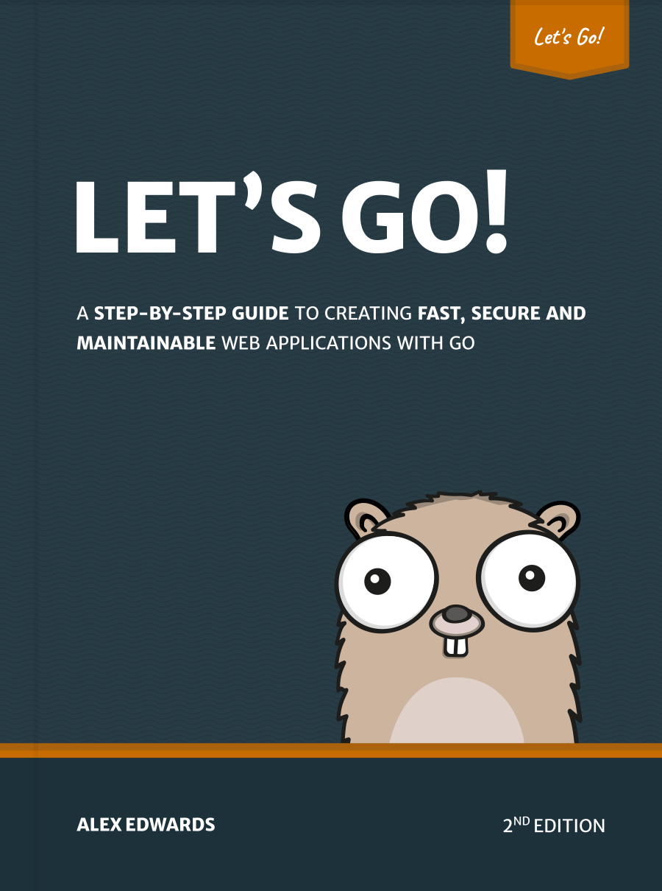

# 前言

Let's Go 逐步教您如何使用出色的编程语言 [Go](https://golang.org/) 创建快速、安全且可维护的 Web 应用程序。

本书背后的理念是帮助您*边做边学*。我们将一起逐步完成 Web 应用程序的构建 — 从构建工作区，到会话管理、验证用户身份、保护服务器安全和测试应用程序。

以这种方式构建完整的 Web 应用程序有几个好处。它有助于将您正在学习的内容融入到上下文中，它演示了代码库的不同部分如何链接在一起，并且它迫使我们解决在现实生活中编写软件时出现的边缘情况和困难。从本质上讲，您将比仅仅阅读 Go 的（优秀）文档或独立博客文章学到更多。

读完本书后，您将了解并有信心使用 Go 构建自己的生产就绪型 Web 应用程序。

尽管您可以从头到尾阅读这本书，但它是专门设计的，因此您可以自己跟进项目构建。

打开你的文本编辑器，祝你编码愉快！

— 亚历克斯
