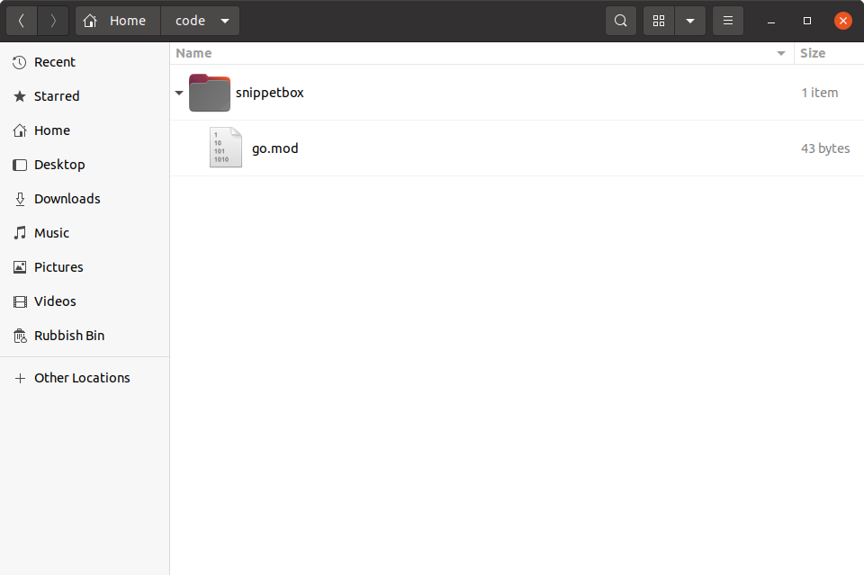

*第 2.1 章。*

## 项目设置和创建模块

在我们编写任何代码之前，您需要在计算机上创建一个 `snippetbox` 目录作为该项目的顶级“主目录”。我们在本书中编写的所有 Go 代码以及其他特定于项目的资产（例如 HTML 模板和 CSS 文件）都将存放在这里。

因此，如果您按照步骤操作，请打开终端并在计算机上的任何位置创建一个名为 `snippetbox` 的新项目目录。我将把我的项目目录定位在 `$HOME/code` 下，但如果您愿意，也可以选择其他位置。

```bash
$ mkdir -p $HOME/code/snippetbox
```

### 创建模块

您需要做的下一件事是为您的项目确定 *模块路径*。

如果您还不熟悉 [Go 模块](https://go.dev/wiki/Modules)，您可以将模块路径视为基本上是项目的规范名称或 *标识符*。

您可以选择[几乎任何字符串](https://golang.org/ref/mod#go-mod-file-ident)作为模块路径，但需要关注的重要一点是*唯一性*。为了避免将来与其他人的项目或标准库发生潜在的导入冲突，您需要选择一个全局唯一且不太可能被其他任何东西使用的模块路径。在 Go 社区中，一个常见的约定是将模块路径基于您拥有的 URL。

就我而言，该项目的一个清晰、简洁且*不太可能被其他任何东西使用*模块路径将是`snippetbox.alexedwards.net`，我将在本书的其余部分中使用它。如果可能的话，您应该将其换成您独有的东西。

一旦决定了唯一的模块路径，接下来需要做的就是将项目目录转换为模块。

确保您位于项目目录的根目录中，然后运行 `go mod init` 命令 - 将您选择的模块路径作为参数传递，如下所示：

```bash
$ cd $HOME/code/snippetbox
$ go mod init snippetbox.alexedwards.net
go: creating new go.mod: module snippetbox.alexedwards.net
```

此时，您的项目目录应该类似于下面的屏幕截图。注意到已创建的 `go.mod` 文件吗？



目前此文件中没有太多内容，如果您在文本编辑器中打开它，它应该如下所示（但最好使用您自己的唯一模块路径）：

*文件：go.mod*

```text
module snippetbox.alexedwards.net

go 1.23.0
```

我们将在本书后面更详细地讨论模块，但现在只要知道当项目根目录中有有效的 `go.mod` 文件时，您的项目 *就是一个模块* 就足够了。将项目设置为模块有很多优点 - 包括更轻松地管理第三方依赖项、[避免供应链攻击](https://go.dev/blog/supply-chain)，并确保将来可以重复构建应用程序。

### 世界你好！

在继续之前，让我们快速检查一下一切设置是否正确。继续在项目目录中创建一个新的 `main.go`，其中包含以下代码：

```bash
$ touch main.go
```

*文件：main.go*

```go
package main

import "fmt"

func main() {
    fmt.Println("Hello world!")
}
```

保存此文件，然后在终端中使用 `go run .` 命令编译并执行当前目录中的代码。一切顺利，您将看到以下输出：

```bash
$ go run .
Hello world!
```

---

### 补充说明

#### 可下载包的模块路径

如果您正在创建一个可供其他人和程序下载和使用的项目，那么您的模块路径最好等于可以下载代码的位置。

例如，如果您的包托管在 `https://github.com/foo/bar`，则该项目的模块路径应为 `github.com/foo/bar`。
