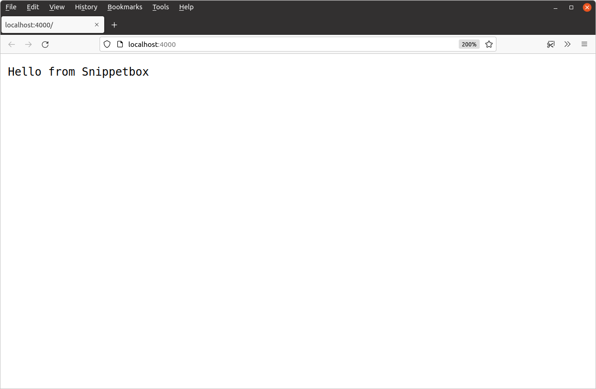

*第 2.2 章。*

## Web 应用程序基础知识

现在一切都已正确设置，让我们对 Web 应用程序进行第一次迭代。我们将从三个绝对要素开始：

- 我们首先需要的是一个 *处理器*。如果您之前使用 MVC 模式构建了 Web 应用程序，您可以将处理器视为有点像控制器。它们负责执行应用程序逻辑并编写 HTTP 响应标头和正文。
- 第二个组件是路由器（或 Go 术语中的 *ServeMux*）。它存储应用程序的 URL 路由模式与相应处理器之间的映射。通常，您的应用程序有一个包含所有路由的ServeMux。
- 我们最后需要的是 *网络服务器*。 Go 的一大优点是您可以建立一个 Web 服务器并侦听传入请求 *作为应用程序本身的一部分*。您不需要 Nginx、Apache 或 Caddy 等外部第三方服务器。

让我们将这些组件放在 `main.go` 文件中以创建一个可用的应用程序。

*文件：main.go*

```go
package main

import (
    "log"
    "net/http"
)

// Define a home handler function which writes a byte slice containing
// "Hello from Snippetbox" as the response body.
func home(w http.ResponseWriter, r *http.Request) {
    w.Write([]byte("Hello from Snippetbox"))
}

func main() {
    // Use the http.NewServeMux() function to initialize a new servemux, then
    // register the home function as the handler for the "/" URL pattern.
    mux := http.NewServeMux()
    mux.HandleFunc("/", home)

    // Print a log message to say that the server is starting.
    log.Print("starting server on :4000")

    // Use the http.ListenAndServe() function to start a new web server. We pass in
    // two parameters: the TCP network address to listen on (in this case ":4000")
    // and the servemux we just created. If http.ListenAndServe() returns an error
    // we use the log.Fatal() function to log the error message and exit. Note
    // that any error returned by http.ListenAndServe() is always non-nil.
    err := http.ListenAndServe(":4000", mux)
    log.Fatal(err)
}
```

> **注意：** `home` 处理函数只是一个带有两个参数的常规 Go 函数。 `http.ResponseWriter` 参数提供了组装 HTTP 响应并将其发送给用户的方法，`*http.Request` 参数是一个指向结构体的指针，该结构体保存有关当前请求的信息（例如 HTTP 方法和正在请求的 URL）。随着本书的进展，我们将更多地讨论这些参数并演示如何使用它们。

当您运行此代码时，它将启动一个 Web 服务器，侦听本地计算机的端口 4000。每次服务器收到新的 HTTP 请求时，它都会将该请求传递给ServeMux，然后ServeMux 将检查 URL 路径并将请求分派给匹配的处理器。

让我们尝试一下。保存您的 `main.go` 文件，然后尝试使用 `go run` 命令从终端运行它。

```bash
$ cd $HOME/code/snippetbox
$ go run .
2024/03/18 11:29:23 starting server on :4000
```

服务器运行时，打开 Web 浏览器并尝试访问 [`http://localhost:4000`](http://localhost:4000/)。如果一切都按计划进行，您应该会看到一个看起来有点像这样的页面：



> **重要提示：** 在我们继续之前，我应该解释一下 Go 的ServeMux 将路由模式 `"/"` 视为包罗万象。因此，目前 *对我们服务器的所有* HTTP 请求都将由 `home` 函数处理，无论其 URL 路径如何。例如，您可以访问不同的 URL 路径，例如 [`http://localhost:4000/foo/bar`](http://localhost:4000/foo/bar)，您将收到完全相同的响应。

如果您返回终端窗口，可以通过按键盘上的 `Ctrl+C` 来停止服务器。

---

### 补充说明

#### 网络地址

您传递给 `http.ListenAndServe()` 的 TCP 网络地址应采用 `"host:port"` 格式。如果您省略主机（就像我们对 `":4000"` 所做的那样），那么服务器将侦听您计算机的所有可用网络接口。通常，如果您的计算机有多个网络接口并且您只想侦听其中一个网络接口，则只需在地址中指定主机。

在其他 Go 项目或文档中，您有时可能会看到使用命名端口（例如 `":http"` 或 `":http-alt"` 而不是数字编写的网络地址。如果您使用命名端口，则 `http.ListenAndServe()` 函数将在启动服务器时尝试从 `/etc/services` 文件中查找相关端口号，如果找不到匹配项，则返回错误。

#### 使用 go 运行

在开发过程中，`go run` 命令是测试代码的便捷方法。它本质上是一种编译代码、在 `/tmp` 目录中创建可执行二进制文件的快捷方式，然后一步运行该二进制文件。

它接受以空格分隔的 `.go` 文件列表、特定包的路径（其中 `.` 字符代表当前目录）或完整模块路径。对于目前我们的应用程序，以下三个命令都是等效的：

```bash
$ go run .
$ go run main.go
$ go run snippetbox.alexedwards.net
```
