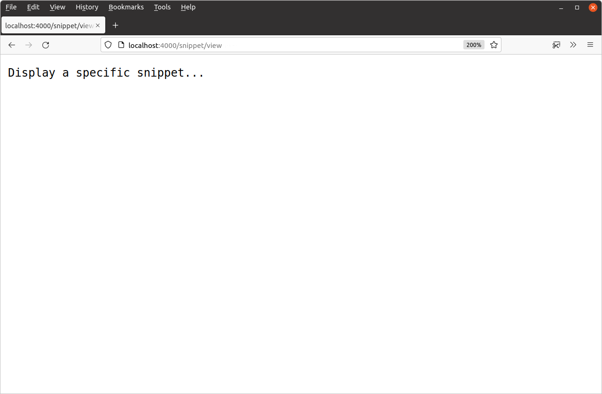
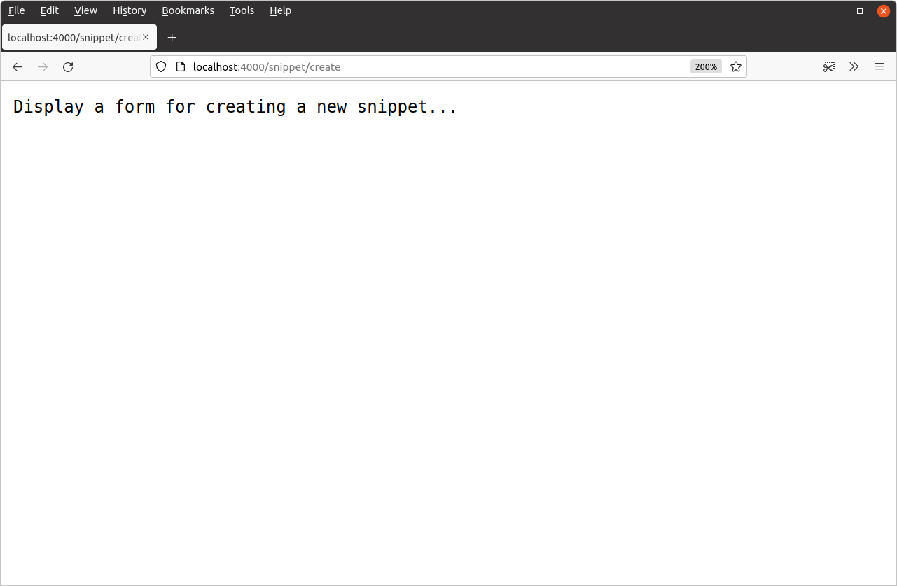
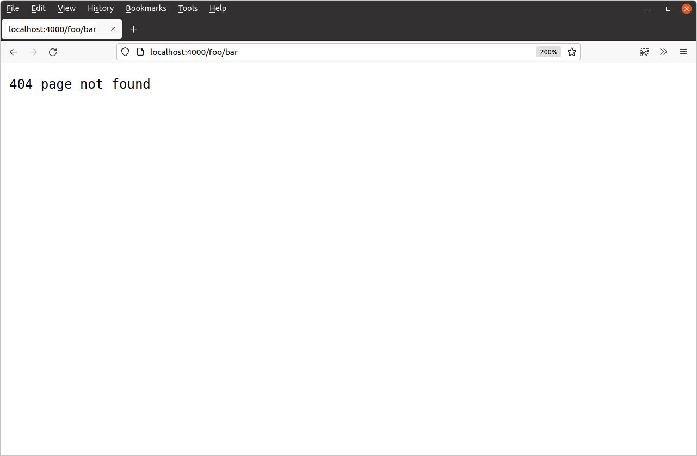

*第 2.3 章。*

## 路由请求

拥有一个只有一条路由的 Web 应用程序并不是很令人兴奋……也不是很有用！让我们添加更多路由，以便应用程序开始形成如下所示：

| 路由模式 | 处理器 | 行动 |
| --- | --- | --- |
| / | home | 显示主页 |
| /snippet/view | snippetView | 显示特定片段 |
| /snippet/create | snippetCreate | 显示用于创建新片段的表单 |

重新打开 `main.go` 文件并按如下方式更新：

*文件：main.go*

```go
package main

import (
    "log"
    "net/http"
)

func home(w http.ResponseWriter, r *http.Request) {
    w.Write([]byte("Hello from Snippetbox"))
}

// Add a snippetView handler function.
func snippetView(w http.ResponseWriter, r *http.Request) {
    w.Write([]byte("Display a specific snippet..."))
}

// Add a snippetCreate handler function.
func snippetCreate(w http.ResponseWriter, r *http.Request) {
    w.Write([]byte("Display a form for creating a new snippet..."))
}

func main() {
    // Register the two new handler functions and corresponding route patterns with
    // the servemux, in exactly the same way that we did before.
    mux := http.NewServeMux()
    mux.HandleFunc("/", home)
    mux.HandleFunc("/snippet/view", snippetView)
    mux.HandleFunc("/snippet/create", snippetCreate)

    log.Print("starting server on :4000")

    err := http.ListenAndServe(":4000", mux)
    log.Fatal(err)
}
```

确保保存这些更改，然后重新启动 Web 应用程序：

```bash
$ cd $HOME/code/snippetbox
$ go run .
2024/03/18 11:29:23 starting server on :4000
```

如果您在网络浏览器中访问以下链接，您现在应该会得到每条路由的相应响应：

- [`http://localhost:4000/snippet/view`](http://localhost:4000/snippet/view)



- [`http://localhost:4000/snippet/create`](http://localhost:4000/snippet/create)



### 路由模式中的尾部斜杠

既然两条新路由已经开通并运行，我们来谈谈一些理论。

重要的是要知道 Go 的ServeMux 有不同的匹配规则，具体取决于路由模式是否以尾部斜杠结尾。

我们的两个新路由模式 - `"/snippet/view"` 和 `"/snippet/create"` - 不以尾部斜杠结尾。当模式没有尾部斜杠时，只有当请求 URL 路径完全匹配该模式时，才会匹配该模式（并调用相应的处理器）。

当路由模式以尾部斜杠结尾时（例如 `"/"` 或 `"/static/"`），它被称为 *子树路径模式*。只要请求 URL 路径的 *start* 与子树路径匹配，子树路径模式就会匹配（并调用相应的处理器）。如果它有助于您的理解，您可以将子树路径想象成有点像它们末尾有一个通配符，例如 `"/**"` 或 `"/static/**"`。

这有助于解释为什么 `"/"` 路由模式就像一个包罗万象的东西。该模式本质上意味着 *匹配一个斜杠，后跟任何内容（或根本不跟任何内容）*。

### 限制子树路径

为了防止子树路径模式的行为就像在末尾有通配符一样，您可以将特殊字符序列 `{$}` 附加到模式的末尾 - 例如 `"/{$}"` 或 `"/static/{$}"`。

因此，如果您有路由模式 `"/{$}"`，它实际上意味着 *匹配一个斜杠，后面不跟任何其他内容*。它只会匹配 URL 路径恰好为 `/` 的请求。

让我们在应用程序中使用它来停止我们的 `home` 处理器充当包罗万象的角色，如下所示：

*文件：main.go*

```go
package main

...

func main() {
    mux := http.NewServeMux()
    mux.HandleFunc("/{$}", home) // Restrict this route to exact matches on / only.
    mux.HandleFunc("/snippet/view", snippetView) 
    mux.HandleFunc("/snippet/create", snippetCreate)

    log.Print("starting server on :4000")

    err := http.ListenAndServe(":4000", mux)
    log.Fatal(err)
}
```

> **注意：** 只允许在子树路径模式（即以尾部斜杠结尾的模式）末尾使用 `{$}`。无论如何，没有尾部斜杠的路由模式需要在整个请求路径上进行匹配，因此在末尾包含 `{$}` 是没有意义的，尝试这样做会导致运行时panic。

完成更改后，重新启动服务器并请求未注册的 URL 路径，例如 [`http://localhost:4000/foo/bar`](http://localhost:4000/foo/bar)。您现在应该得到一个 `404` 响应，看起来有点像这样：



---

### 补充说明

#### 附加的ServeMux功能

还有一些其他的ServeMux功能值得指出：

- 请求 URL 路径会自动清理。如果请求路径包含任何 `.` 或 `..` 元素或重复的斜杠，用户将自动重定向到等效的干净 URL。例如，如果用户向 `/foo/bar/..//baz` 发出请求，他们将自动被发送 `301 Permanent Redirect` 到 `/foo/baz`。
- 如果已注册子树路径，并且收到针对该子树路径 *且不带* 尾部斜杠的请求，则将自动向用户发送 `301 Permanent Redirect` 到添加了斜杠的子树路径。例如，如果您注册了子树路径`/foo/`，则任何对`/foo`的请求都将被重定向到`/foo/`。

#### 主机名匹配

可以在路由模式中包含主机名。当您想要将所有 HTTP 请求重定向到规范 URL，或者您的应用程序充当多个站点或服务的后端时，这会很有用。例如：

```go
mux := http.NewServeMux()
mux.HandleFunc("foo.example.org/", fooHandler)
mux.HandleFunc("bar.example.org/", barHandler)
mux.HandleFunc("/baz", bazHandler)
```

当涉及模式匹配时，将首先检查任何特定于主机的模式，如果存在匹配，则请求将被分派到相应的处理器。仅当 *不* 找到特定于主机的匹配时，才会检查非特定于主机的模式。

#### 默认的服务复用器

如果您已经使用 Go 一段时间，您可能遇到过 [`http.Handle()`](https://pkg.go.dev/net/http/#Handle) 和 [`http.HandleFunc()`](https://pkg.go.dev/net/http/#HandleFunc) 函数。这些允许您注册路由 *而无需* 显式声明一个ServeMux，如下所示：

```go
func main() {
    http.HandleFunc("/", home)
    http.HandleFunc("/snippet/view", snippetView)
    http.HandleFunc("/snippet/create", snippetCreate)

    log.Print("starting server on :4000")
    
    err := http.ListenAndServe(":4000", nil)
    log.Fatal(err)
}
```

在幕后，这些函数使用 *defaultServeMux* 注册它们的路由。这只是我们已经使用过的常规ServeMux，但它由Go自动初始化并存储在[`http.DefaultServeMux`](https://pkg.go.dev/net/http#pkg-variables)全局变量中。

如果将 `nil` 作为第二个参数传递给 `http.ListenAndServe()`，服务器将使用 `http.DefaultServeMux` 进行路由。

虽然这种方法可以使您的代码稍微短一些，但我不推荐它，原因有两个：

- 与声明和使用您自己的本地范围的ServeMux相比，它不那么明确，而且感觉更“神奇”。
- 由于 `http.DefaultServeMux` 是标准库中的全局变量，这意味着项目中的 *任何* Go 代码都可以访问它，并且有可能注册路由。如果项目代码库很大（尤其是由多人共同开发时），就更难保证应用程序的所有路由声明都能在一个中心位置轻松找到。
  这也意味着，应用程序导入的任何*第三方包*都可以通过 `http.DefaultServeMux` 注册路由。如果其中某个第三方包遭到入侵，攻击者可能会利用 `http.DefaultServeMux` 将恶意处理器暴露到 Web 上。只要不使用 `http.DefaultServeMux`，就能轻松规避这一风险。

因此，为了清晰、可维护性和安全性，避免使用 `http.DefaultServeMux` 和相应的辅助函数通常是个好主意。使用您自己的本地范围的ServeMux，就像我们到目前为止在这个项目中所做的那样。
