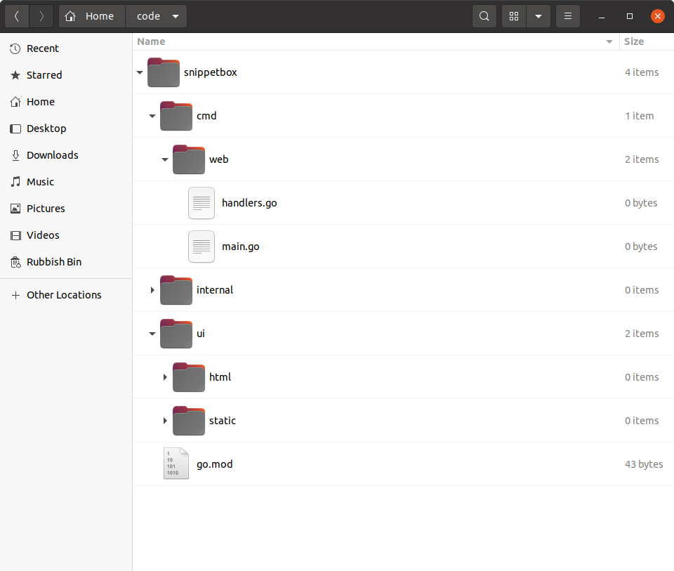

*第 2.7 章。*

## 项目结构和组织

在我们向 `main.go` 文件添加更多代码之前，是思考如何组织和构建该项目的好时机。

重要的是要预先解释一下，在 Go 中构建 Web 应用程序没有单一的正确（甚至推荐）方法。这有好有坏。这意味着您可以自由灵活地组织代码，但在尝试决定最佳结构应该是什么时，也很容易陷入不确定性的困境。

随着您获得 Go 经验，您将了解哪些模式在不同情况下最适合您。但作为一个起点，我能给您的最好建议是*不要让事情变得过于复杂*。仅在明显需要时才努力增加结构和复杂性。

对于这个项目，我们将实现一个遵循[流行且经过测试的](https://go.dev/doc/modules/layout#server-project)方法的大纲结构。这是一个坚实的起点，您应该能够在各种项目中重用通用结构。

如果您按照步骤操作，请确保您位于项目存储库的根目录中并运行以下命令：

```bash
$ cd $HOME/code/snippetbox
$ rm main.go
$ mkdir -p cmd/web internal ui/html ui/static
$ touch cmd/web/main.go
$ touch cmd/web/handlers.go
```

您的项目存储库的结构现在应如下所示：



让我们花点时间讨论一下每个目录的用途。

- `cmd` 目录将包含项目中可执行应用程序的 *应用程序特定的* 代码。目前，我们的项目只有一个可执行应用程序 - Web 应用程序 - 它将位于 `cmd/web` 目录下。
- `internal` 目录将包含项目中使用的辅助 *非应用程序特定的* 代码。我们将使用它来保存潜在的可重用代码，例如项目的验证助手和 SQL 数据库模型。
- `ui` 目录将包含 Web 应用程序使用的 *用户界面资产*。具体来说，`ui/html` 目录将包含 HTML 模板，`ui/static` 目录将包含静态文件（如 CSS 和图像）。

*那么我们为什么要使用这个结构？*

有两大好处：

1. 它明确区分了 Go 和非 Go 资产。我们编写的所有 Go 代码都将专门位于 `cmd` 和 `internal` 目录下，从而使项目根目录可以自由地保存非 Go 资产，例如 UI 文件、makefile 和模块定义（包括我们的 `go.mod` 文件）。
2. 如果您想向项目中添加另一个可执行应用程序，它的扩展性非常好。例如，您可能希望添加 CLI（命令行界面）来自动执行将来的某些管理任务。使用此结构，您可以在 `cmd/cli` 下创建此 CLI 应用程序，并且它将能够导入和重用您在 `internal` 目录下编写的所有代码。

### 重构现有代码

让我们快速将已经编写的代码移植到这个新结构中。

*文件：cmd/web/main.go*

```go
package main

import (
    "log"
    "net/http"
)

func main() {
    mux := http.NewServeMux()
    mux.HandleFunc("GET /{$}", home)
    mux.HandleFunc("GET /snippet/view/{id}", snippetView)
    mux.HandleFunc("GET /snippet/create", snippetCreate)
    mux.HandleFunc("POST /snippet/create", snippetCreatePost)

    log.Print("starting server on :4000")
    
    err := http.ListenAndServe(":4000", mux)
    log.Fatal(err)
}
```

*文件：cmd/web/handlers.go*

```go
package main

import (
    "fmt"
    "net/http"
    "strconv"
)

func home(w http.ResponseWriter, r *http.Request) {
    w.Header().Add("Server", "Go")
    w.Write([]byte("Hello from Snippetbox"))
}

func snippetView(w http.ResponseWriter, r *http.Request) {
    id, err := strconv.Atoi(r.PathValue("id"))
    if err != nil || id < 1 {
        http.NotFound(w, r)
        return
    }

    fmt.Fprintf(w, "Display a specific snippet with ID %d...", id)
}

func snippetCreate(w http.ResponseWriter, r *http.Request) {
    w.Write([]byte("Display a form for creating a new snippet..."))
}

func snippetCreatePost(w http.ResponseWriter, r *http.Request) {
    w.WriteHeader(http.StatusCreated)
    w.Write([]byte("Save a new snippet..."))
}
```

所以现在我们的Web应用程序由`cmd/web`目录下的多个`.go`文件组成。要运行它们，我们可以使用 `go run` 命令，如下所示：

```bash
$ cd $HOME/code/snippetbox
$ go run ./cmd/web
2024/03/18 11:29:23 starting server on :4000
```

---

### 补充说明

#### 内部目录

需要指出的是，目录名称 `internal` 在 Go 中具有特殊的含义和行为：在此目录下的任何包只能通过 *目录* 的父目录内的代码导入。在我们的例子中，这意味着 `internal` 中的任何包只能通过 `snippetbox` 项目目录中的代码导入。

或者，从另一个角度来看，这意味着 `internal` *下的任何包都无法由我们项目* 外部的代码导入。

这很有用，因为它可以防止其他代码库导入和依赖我们的 `internal` 目录中的（可能未版本化和不受支持的）包 - 即使项目代码在 GitHub 等地方公开可用。
