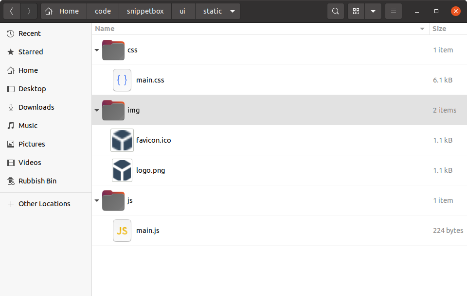
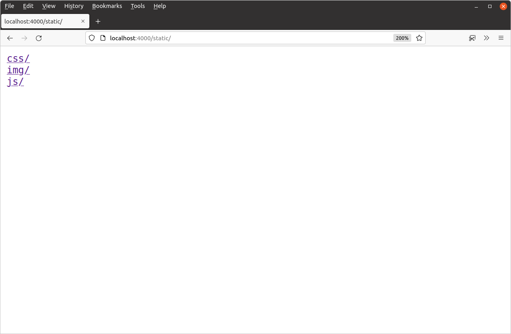
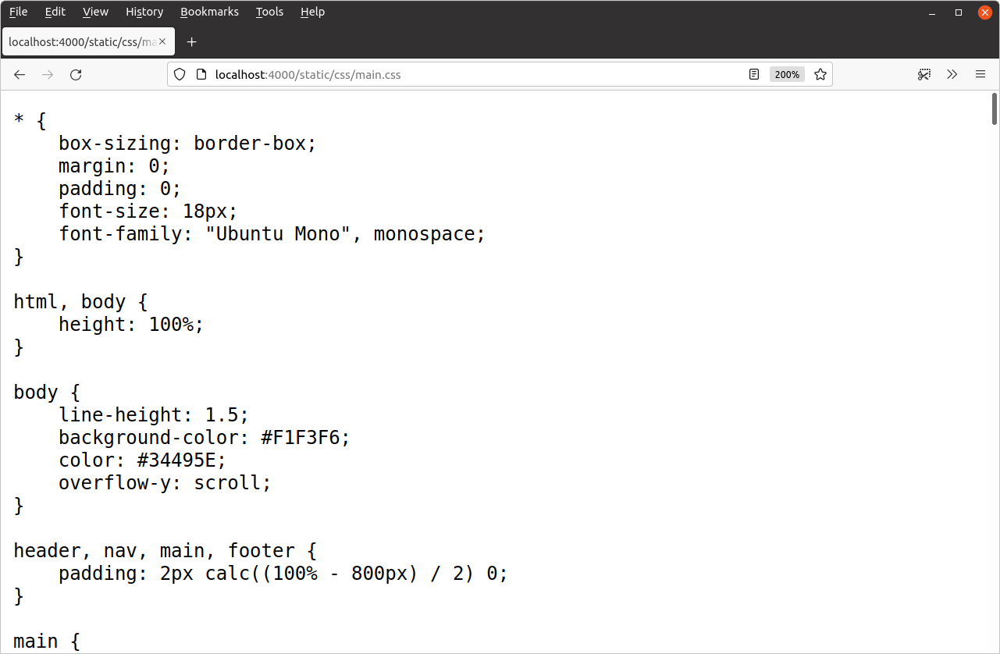
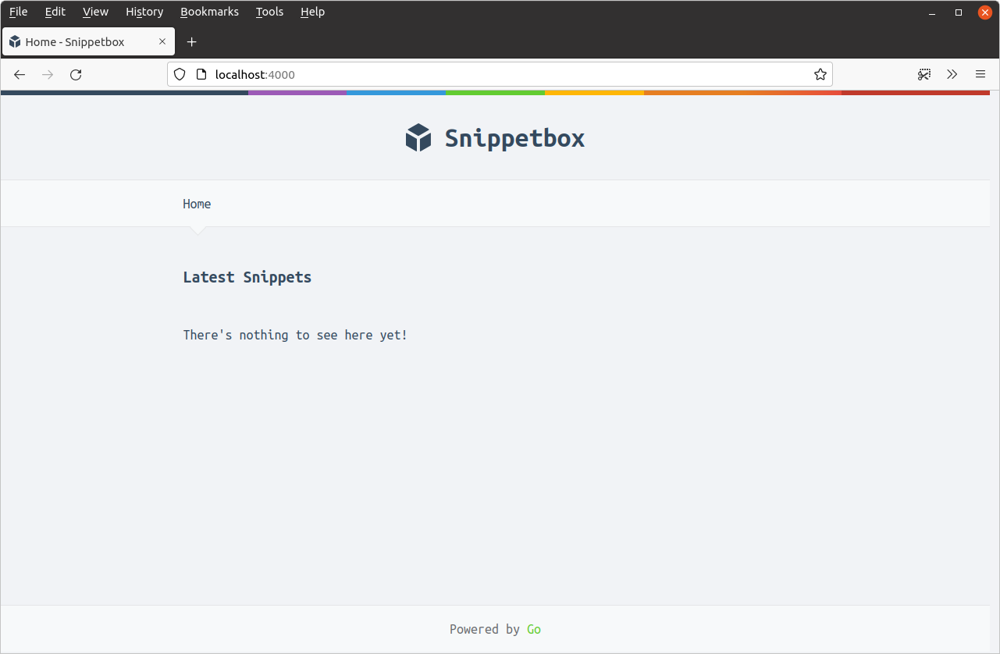

*第 2.9 章。*

## 提供静态文件

现在，让我们通过向项目中添加一些静态 CSS 和图像文件以及少量 JavaScript 来突出显示活动导航项，来改进主页的外观和感觉。

如果您按照步骤进行操作，则可以获取必要的文件并将它们解压到我们之前使用以下命令创建的 `ui/static` 文件夹中：

```bash
$ cd $HOME/code/snippetbox
$ curl https://www.alexedwards.net/static/sb-v2.tar.gz | tar -xvz -C ./ui/static/
```

`ui/static` 目录的内容现在应如下所示：



### http.Fileserver 处理器

Go 的 `net/http` 包附带了一个内置的 [`http.FileServer`](https://pkg.go.dev/net/http/#FileServer) 处理器，您可以使用它通过 HTTP 从特定目录提供文件。让我们向应用程序添加一条新路由，以便使用此方法处理所有以 `"/static/"` 开头的 `GET` 请求，如下所示：

| 路由模式 | 处理器 | 行动 |
| --- | --- | --- |
| GET / | home | 显示主页 |
| GET /snippet/view/{id} | snippetView | 显示特定片段 |
| GET /snippet/create | snippetCreate | 显示用于创建新片段的表单 |
| POST /snippet/create | snippetCreatePost | 保存新片段 |
| GET /static/ | http.FileServer | **提供特定的静态文件** |

> **记住：**模式`"GET /static/"`是一个子树路径模式，所以它的作用有点像末尾有一个通配符。

要创建新的 `http.FileServer` 处理器，我们需要使用 [`http.FileServer()`](https://pkg.go.dev/net/http/#FileServer) 函数，如下所示：

```go
fileServer := http.FileServer(http.Dir("./ui/static/"))
```

当此处理器收到文件请求时，它将从请求 URL 路径中删除前导斜杠，然后在 `./ui/static` 目录中搜索相应的文件以发送给用户。

因此，为了使其正常工作，我们必须在将* 传递给 `http.FileServer` 之前从 URL 路径 *中去除前导 `"/static"`。否则，它将查找不存在的文件，并且用户将收到 `404 page not found` 响应。幸运的是，Go 包含一个专门用于此任务的 [`http.StripPrefix()`](https://pkg.go.dev/net/http/#StripPrefix) 帮助器。

打开 `main.go` 文件并添加以下代码，使文件最终看起来像这样：

*文件：cmd/web/main.go*

```go
package main

import (
    "log"
    "net/http"
)

func main() {
    mux := http.NewServeMux()

    // Create a file server which serves files out of the "./ui/static" directory.
    // Note that the path given to the http.Dir function is relative to the project
    // directory root.
    fileServer := http.FileServer(http.Dir("./ui/static/"))

    // Use the mux.Handle() function to register the file server as the handler for
    // all URL paths that start with "/static/". For matching paths, we strip the
    // "/static" prefix before the request reaches the file server.
    mux.Handle("GET /static/", http.StripPrefix("/static", fileServer))

    // Register the other application routes as normal..
    mux.HandleFunc("GET /{$}", home)
    mux.HandleFunc("GET /snippet/view/{id}", snippetView)
    mux.HandleFunc("GET /snippet/create", snippetCreate)
    mux.HandleFunc("POST /snippet/create", snippetCreatePost)

    log.Print("starting server on :4000")
    
    err := http.ListenAndServe(":4000", mux)
    log.Fatal(err)
}
```

完成后，重新启动应用程序并在浏览器中打开 [`http://localhost:4000/static/`](http://localhost:4000/static/)。您应该看到 `ui/static` 文件夹的可导航目录列表，如下所示：



请随意尝试并浏览目录列表以查看各个文件。例如，如果您导航到 [`http://localhost:4000/static/css/main.css`](http://localhost:4000/static/css/main.css)，您应该会看到 CSS 文件出现在浏览器中，如下所示：



### 使用静态文件

文件服务器正常工作后，我们现在可以更新 `ui/html/base.tmpl` 文件以使用静态文件：

*文件：ui/html/base.tmpl*

```html
{{define "base"}}
<!doctype html>
<html lang='en'>
    <head>
        <meta charset='utf-8'>
        <title>{{template "title" .}} - Snippetbox</title>
         <!-- Link to the CSS stylesheet and favicon -->
        <link rel='stylesheet' href='/static/css/main.css'>
        <link rel='shortcut icon' href='/static/img/favicon.ico' type='image/x-icon'>
        <!-- Also link to some fonts hosted by Google -->
        <link rel='stylesheet' href='https://fonts.googleapis.com/css?family=Ubuntu+Mono:400,700'>
    </head>
    <body>
        <header>
            <h1><a href='/'>Snippetbox</a></h1>
        </header>
        {{template "nav" .}}
        <main>
            {{template "main" .}}
        </main>
        <footer>Powered by <a href='https://golang.org/'>Go</a></footer>
         <!-- And include the JavaScript file -->
        <script src='/static/js/main.js' type='text/javascript'></script>
    </body>
</html>
{{end}}
```

确保保存更改，然后重新启动服务器并访问 [`http://localhost:4000`](http://localhost:4000/)。您的主页现在应该如下所示：



---

### 补充说明

#### 文件服务器的特点和功能

Go 的 `http.FileServer` 处理器有一些非常好的功能值得一提：

- 在搜索文件之前，它通过 [`path.Clean()`](https://pkg.go.dev/path/#Clean) 函数运行所有请求路径来清理所有请求路径。这将从 URL 路径中删除任何 `.` 和 `..` 元素，这有助于阻止目录遍历攻击。如果您将文件服务器与不会自动清理 URL 路径的路由器结合使用，则此功能特别有用。
- 完全支持[范围请求](https://benramsey.com/blog/2008/05/206-partial-content-and-range-requests)。如果应用程序需要提供大文件并支持断点续传，这会非常有用。你可以使用 curl 请求 `logo.png` 文件的第 100—199 字节来观察这一功能，如下所示：
    ```bash
    $ curl -i -H "Range: bytes=100-199" --output - http://localhost:4000/static/img/logo.png
    HTTP/1.1 206 Partial Content
    Accept-Ranges: bytes
    Content-Length: 100
    Content-Range: bytes 100-199/1075
    Content-Type: image/png
    Last-Modified: Wed, 18 Mar 2024 11:29:23 GMT
    Date: Wed, 18 Mar 2024 11:29:23 GMT
    [binary data]
    ```
- 透明支持 `Last-Modified` 和 `If-Modified-Since` 标头。如果自用户上次请求后文件未发生更改，则 `http.FileServer` 将发送 `304 Not Modified` 状态代码而不是文件本身。这有助于减少客户端和服务器的延迟和处理开销。
- `Content-Type` 使用 [`mime.TypeByExtension()`](https://pkg.go.dev/mime/#TypeByExtension) 函数从文件扩展名自动设置。如有必要，您可以使用 [`mime.AddExtensionType()`](https://pkg.go.dev/mime/#AddExtensionType) 函数添加自己的自定义扩展和内容类型。

#### 性能

在本章中，我们设置文件服务器，以便它为硬盘上的 `./ui/static` 目录之外的文件提供服务。

但值得注意的是，一旦应用程序启动并运行，`http.FileServer` 可能不会从磁盘读取这些文件。 [Windows](https://docs.microsoft.com/en-us/windows/desktop/fileio/file-caching) 和 [基于 Unix 的](https://www.tldp.org/LDP/sag/html/buffer-cache.html) 操作系统都将最近使用的文件缓存在 RAM 中，因此（至少对于经常使用的文件），`http.FileServer` 很可能会从 RAM 中提供它们，而不是使 [相对地慢速](https://gist.github.com/jboner/2841832) 往返硬盘。

#### 提供单个文件

有时您可能想从处理器中提供单个文件。为此，有 [`http.ServeFile()`](https://pkg.go.dev/net/http/#ServeFile) 函数，您可以像这样使用它：

```go
func downloadHandler(w http.ResponseWriter, r *http.Request) {
    http.ServeFile(w, r, "./ui/static/file.zip")
}
```

> **警告：** `http.ServeFile()` 不会自动清理文件路径。如果您从不受信任的用户输入构建文件路径，为了避免目录遍历攻击，您 *必须* 在使用输入之前使用 [`filepath.Clean()`](https://pkg.go.dev/path/filepath/#Clean) 对其进行清理。

#### 禁用目录列表

如果您想禁用目录列表，可以采取几种不同的方法。

最简单的方法？将空白的 `index.html` 文件添加到要禁用列表的特定目录。然后将提供该内容而不是目录列表，并且用户将获得没有正文的 `200 OK` 响应。如果您想对 `./ui/static` 下的所有目录执行此操作，可以使用以下命令：

```bash
$ find ./ui/static -type d -exec touch {}/index.html \;
```

一个更复杂（但可以说更好）的解决方案是创建 [`http.FileSystem`](https://pkg.go.dev/net/http/#FileSystem) 的自定义实现，并让它为任何目录返回 `os.ErrNotExist` 错误。完整的解释和示例代码可以在[这篇博文](https://www.alexedwards.net/blog/disable-http-fileserver-directory-listings)中找到。
