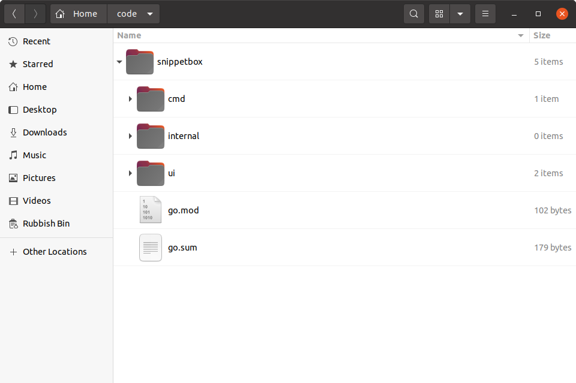

*第 4.3 章。*

## 模块和可重复的构建

现在 MySQL 驱动程序已安装，让我们看一下 `go.mod` 文件（我们在本书开头创建的）。您应该看到一个 `require` 块，其中包含两行，其中包含您下载的软件包的路径和确切版本号：

*文件：go.mod*

```text
module snippetbox.alexedwards.net

go 1.23.0

require (
    filippo.io/edwards25519 v1.1.0 // indirect
    github.com/go-sql-driver/mysql v1.8.1 // indirect
)
```

`go.mod` 中的这些行本质上告诉 Go 命令，当您从项目目录运行 `go run`、`go test` 或 `go build` 等命令时，应该使用哪个版本的包。

这使得在同一台计算机上轻松拥有多个项目，其中使用*同一包的不同版本*。例如，该项目使用 MySQL 驱动程序的 `v1.8.1`，但您的计算机上可以有另一个使用 `v1.5.0` 的代码库，那就没问题了。

> **注意：** `// indirect` 注释表示包不会直接出现在代码库中的任何 `import` 语句中。目前，我们还没有编写任何实际使用 `github.com/go-sql-driver/mysql` 或 `filippo.io/edwards25519` 包的代码，这就是为什么它们都被标记为间接依赖项。我们将在下一章解决这个问题。

您还会看到在项目目录的根目录中创建了一个名为 `go.sum` 的新文件。



此 `go.sum` 文件包含代表所需包内容的加密校验和。如果你打开它，你应该看到类似这样的内容：

*文件：go.sum*

```text
filippo.io/edwards25519 v1.1.0 h1:FNf4tywRC1HmFuKW5xopWpigGjJKiJSV0Cqo0cJWDaA=
filippo.io/edwards25519 v1.1.0/go.mod h1:BxyFTGdWcka3PhytdK4V28tE5sGfRvvvRV7EaN4VDT4=
github.com/go-sql-driver/mysql v1.8.1 h1:LedoTUt/eveggdHS9qUFC1EFSa8bU2+1pZjSRpvNJ1Y=
github.com/go-sql-driver/mysql v1.8.1/go.mod h1:wEBSXgmK//2ZFJyE+qWnIsVGmvmEKlqwuVSjsCm7DZg=
```

`go.sum` 文件并非设计为可供人工编辑，通常您不需要打开它。但它有两个有用的功能：

- 在终端中运行 `go mod verify` 命令，会验证本机已下载软件包的校验和是否与 `go.sum` 中的记录一致，从而确认它们未被篡改。
    ```bash
    $ go mod verify
    all modules verified
    ```
- 如果其他人需要下载项目的所有依赖项（他们可以通过运行 `go mod download` 来完成），如果他们正在下载的包与文件中的校验和之间存在任何不匹配，他们将收到错误。

所以，总而言之：

- 您（或将来的其他人）可以运行 `go mod download` 来下载您的项目所需的所有包的确切版本。
- 您可以运行 `go mod verify` 以确保这些下载的包中的任何内容都没有被意外更改。
- 每当您运行 `go run`、`go test` 或 `go build` 时，将始终使用 `go.mod` 中列出的确切软件包版本。

这些东西结合在一起使得可靠地创建 Go 应用程序的[可重复构建](https://en.wikipedia.org/wiki/Reproducible_builds)变得更加容易。

---

### 补充说明

#### 升级包

下载包并将其添加到您的 `go.mod` 文件后，包和版本就会“修复”。但是，出于多种原因，您可能希望将来升级以使用更新版本的软件包。

要升级到软件包的最新可用 *次要版本或补丁版本*，您只需运行带有 `-u` 标志的 `go get`，如下所示：

```bash
$ go get -u github.com/foo/bar
```

或者，如果您想升级到特定版本，那么您应该运行相同的命令，但使用适当的 `@version` 后缀。例如：

```bash
$ go get -u github.com/foo/bar@v2.0.0
```

#### 删除未使用的包

有时您可能 `go get` 一个包，后来才意识到您不再需要它了。当这种情况发生时，你有两个选择。

您可以运行 `go get` 并用 `@none` 后缀包路径，如下所示：

```bash
$ go get github.com/foo/bar@none
```

或者，如果您已删除代码中对该包的所有引用，则可以运行 `go mod tidy`，这将自动从 `go.mod` 和 `go.sum` 文件中删除所有未使用的包。

```bash
$ go mod tidy
```
