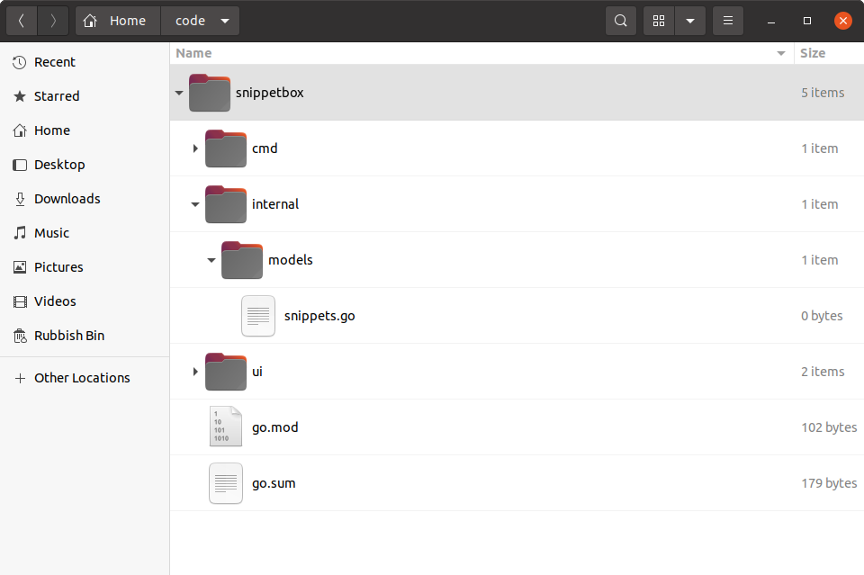

*第 4.5 章。*

## 设计数据库模型

在本章中，我们将为我们的项目勾勒出一个数据库模型。

如果您不喜欢术语 *模型*，您可能需要将其视为 *服务层* 或 *数据访问层*。无论您喜欢如何称呼它，我们的想法都是将使用 MySQL 的代码封装到应用程序其余部分的单独包中。

现在，我们将创建一个骨架数据库模型并让它返回一些虚拟数据。它不会起多大作用，但在我们深入了解 SQL 查询的本质之前，我想解释一下该模式。

听起来还好吗？然后让我们继续创建一个新的 `internal/models` 目录，其中包含 `snippets.go` 文件：

```bash
$ mkdir -p internal/models
$ touch internal/models/snippets.go
```



> **记住：** `internal` 目录用于保存辅助的非应用程序特定代码，这些代码可能会被重用。将来可以被其他应用程序使用的数据库模型（例如 *命令行界面* 应用程序）符合这里的要求。

让我们打开 `internal/models/snippets.go` 文件并添加一个新的 `Snippet` 结构来表示单个片段的数据，以及 `SnippetModel` 类型及其方法来访问和操作数据库中的片段。就像这样：

*文件：internal/models/snippets.go*

```go
package models

import (
    "database/sql"
    "time"
)

// Define a Snippet type to hold the data for an individual snippet. Notice how
// the fields of the struct correspond to the fields in our MySQL snippets
// table?
type Snippet struct {
    ID      int
    Title   string
    Content string
    Created time.Time
    Expires time.Time
}

// Define a SnippetModel type which wraps a sql.DB connection pool.
type SnippetModel struct {
    DB *sql.DB
}

// This will insert a new snippet into the database.
func (m *SnippetModel) Insert(title string, content string, expires int) (int, error) {
    return 0, nil
}

// This will return a specific snippet based on its id.
func (m *SnippetModel) Get(id int) (Snippet, error) {
    return Snippet{}, nil
}

// This will return the 10 most recently created snippets.
func (m *SnippetModel) Latest() ([]Snippet, error) {
    return nil, nil
}
```

### 使用片段模型

要在处理器中使用此模型，我们需要在 `main()` 函数中建立一个新的 `SnippetModel` 结构，然后通过 `application` 结构将其作为依赖项注入 - 就像我们对其他依赖项所做的那样。

方法如下：

*文件：cmd/web/main.go*

```go
package main

import (
    "database/sql"
    "flag"
    "log/slog"
    "net/http"
    "os"

    // Import the models package that we just created. You need to prefix this with
    // whatever module path you set up back in chapter 02.01 (Project Setup and Creating
    // a Module) so that the import statement looks like this:
    // "{your-module-path}/internal/models". If you can't remember what module path you 
    // used, you can find it at the top of the go.mod file.
    "snippetbox.alexedwards.net/internal/models" 

    _ "github.com/go-sql-driver/mysql"
)

// Add a snippets field to the application struct. This will allow us to
// make the SnippetModel object available to our handlers.
type application struct {
    logger   *slog.Logger
    snippets *models.SnippetModel
}

func main() {
    addr := flag.String("addr", ":4000", "HTTP network address")
    dsn := flag.String("dsn", "web:pass@/snippetbox?parseTime=true", "MySQL data source name")
    flag.Parse()

    logger := slog.New(slog.NewTextHandler(os.Stdout, nil))

    db, err := openDB(*dsn)
    if err != nil {
        logger.Error(err.Error())
        os.Exit(1)
    }
    defer db.Close()

    // Initialize a models.SnippetModel instance containing the connection pool
    // and add it to the application dependencies.
    app := &application{
        logger:   logger,
        snippets: &models.SnippetModel{DB: db},
    }

    logger.Info("starting server", "addr", *addr)

    err = http.ListenAndServe(*addr, app.routes())
    logger.Error(err.Error())
    os.Exit(1)
}

...
```

---

### 补充说明

#### 这种结构的好处

如果您退后一步，您可能会看到以这种方式设置我们的项目的一些好处：

- 关注点完全分离。我们的数据库逻辑不会与我们的处理器绑定，这意味着处理器的职责仅限于 HTTP 内容（即验证请求和写入响应）。这将使将来更容易编写紧凑的、有针对性的单元测试。
- 通过创建自定义的 `SnippetModel` 类型并在其上实现方法，我们已经能够使我们的模型成为一个单一的、整齐封装的对象，我们可以轻松地初始化该对象，然后将其作为依赖项传递给我们的处理器。同样，这使得代码更容易维护、可测试。
- 因为模型操作被定义为对象上的方法（在我们的例子中是 `SnippetModel`），所以有机会创建一个 *接口* 并模拟它以进行单元测试。
- *最后*，我们可以完全控制在运行时使用哪个数据库，只需使用`-dsn`命令行标志。
