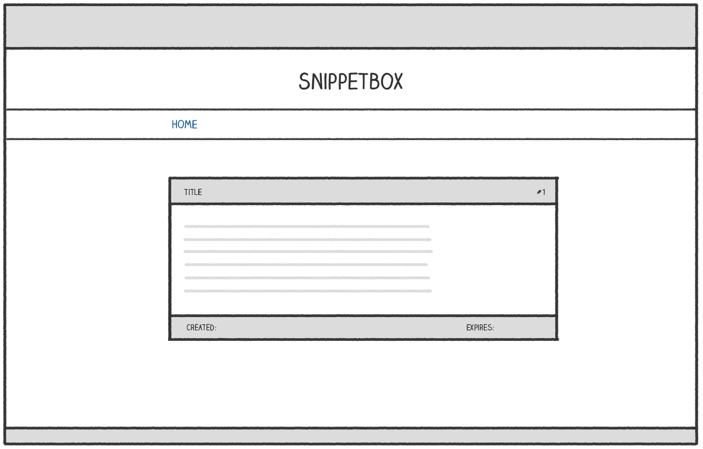
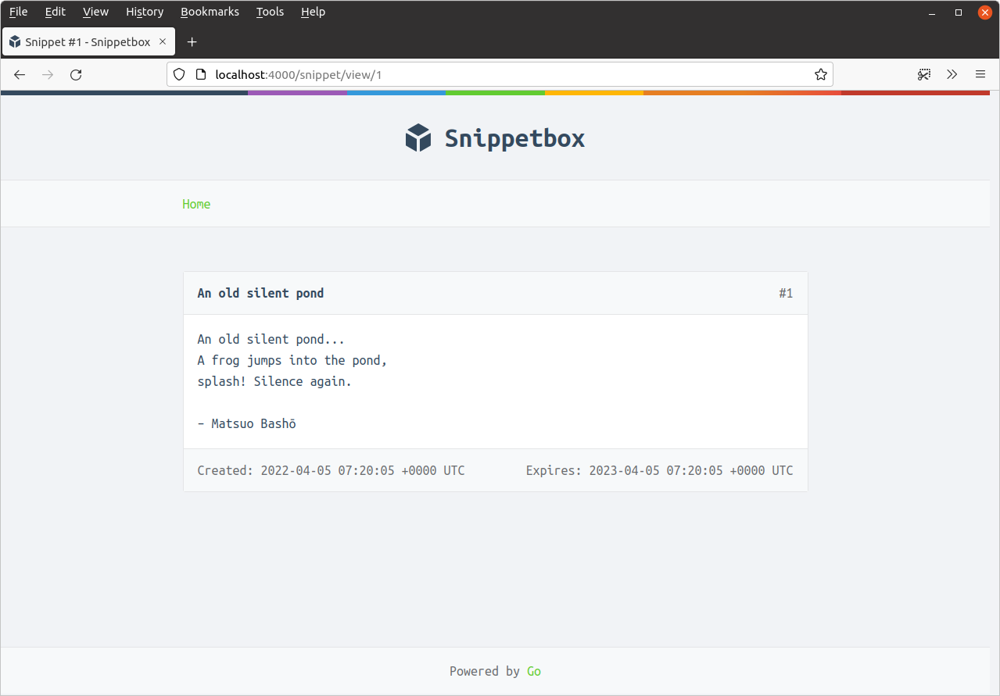

*第 5.1 章。*

## 显示动态数据

目前，我们的 `snippetView` 处理函数从数据库中获取 `models.Snippet` 对象，然后将内容转储到纯文本 HTTP 响应中。

在本章中，我们将对此进行改进，以便数据显示在正确的 HTML 网页中，如下所示：



让我们从 `snippetView` 处理器开始，添加一些代码来渲染新的 `view.tmpl` 模板文件（我们将在一分钟内创建）。希望本书前面的内容对您来说应该很熟悉。

*文件：cmd/web/handlers.go*

```go
package main

import (
    "errors"
    "fmt"
    "html/template" // Uncomment import
    "net/http"
    "strconv"

    "snippetbox.alexedwards.net/internal/models"
)

...

func (app *application) snippetView(w http.ResponseWriter, r *http.Request) {
    id, err := strconv.Atoi(r.PathValue("id"))
    if err != nil || id < 1 {
        http.NotFound(w, r)
        return
    }

    snippet, err := app.snippets.Get(id)
    if err != nil {
        if errors.Is(err, models.ErrNoRecord) {
            http.NotFound(w, r)
        } else {
            app.serverError(w, r, err)
        }
        return
    }

    // Initialize a slice containing the paths to the view.tmpl file,
    // plus the base layout and navigation partial that we made earlier.
    files := []string{
        "./ui/html/base.tmpl",
        "./ui/html/partials/nav.tmpl",
        "./ui/html/pages/view.tmpl",
    }

    // Parse the template files...
    ts, err := template.ParseFiles(files...)
    if err != nil {
        app.serverError(w, r, err)
        return
    }

    // And then execute them. Notice how we are passing in the snippet
    // data (a models.Snippet struct) as the final parameter?
    err = ts.ExecuteTemplate(w, "base", snippet)
    if err != nil {
        app.serverError(w, r, err)
    }
}

...
```

接下来，我们需要创建包含页面 HTML 标记的 `view.tmpl` 文件。但在我们开始之前，我需要解释一些理论……

作为最终参数传递给 `ts.ExecuteTemplate()` 的任何数据在 HTML 模板中均由 `.` 字符表示（称为 *dot*）。

在这种特定情况下，点的基础类型将是 `models.Snippet` 结构。当点的基础类型是结构体时，您可以通过在点后缀字段名称来渲染（或 *yield*）模板中任何导出字段的值。因此，因为我们的 `models.Snippet` 结构有一个 `Title` 字段，所以我们可以通过在模板中写入 `{{.Title}}` 来生成片段标题。

我来演示一下。在 `ui/html/pages/view.tmpl` 处创建一个新文件并添加以下标记：

```bash
$ touch ui/html/pages/view.tmpl
```

*文件：ui/html/pages/view.tmpl*

```html
{{define "title"}}Snippet #{{.ID}}{{end}}

{{define "main"}}
    <div class='snippet'>
        <div class='metadata'>
            <strong>{{.Title}}</strong>
            <span>#{{.ID}}</span>
        </div>
        <pre><code>{{.Content}}</code></pre>
        <div class='metadata'>
            <time>Created: {{.Created}}</time>
            <time>Expires: {{.Expires}}</time>
        </div>
    </div>
{{end}}
```

如果您重新启动应用程序并在浏览器中访问 [`http://localhost:4000/snippet/view/1`](http://localhost:4000/snippet/view/1)，您应该会发现相关片段已从数据库中获取，传递到模板，并且内容已正确呈现。



### 渲染多条数据

需要解释的一件重要事情是，Go 的 `html/template` 包允许您在渲染模板时传入一项（且仅一项）动态数据。但在实际应用程序中，您通常希望在同一页面中显示多条动态数据。

实现此目的的一种轻量级且类型安全的方法是将动态数据包装在一个结构中，该结构就像数据的单个“保存结构”。

让我们创建一个新的 `cmd/web/templates.go` 文件，其中包含 `templateData` 结构来完成此操作。

```bash
$ touch cmd/web/templates.go
```

*文件：cmd/web/templates.go*

```go
package main

import "snippetbox.alexedwards.net/internal/models"

// Define a templateData type to act as the holding structure for
// any dynamic data that we want to pass to our HTML templates.
// At the moment it only contains one field, but we'll add more
// to it as the build progresses.
type templateData struct {
    Snippet models.Snippet
}
```

然后让我们更新 `snippetView` 处理器以在执行模板时使用这个新结构：

*文件：cmd/web/handlers.go*

```go
package main

...

func (app *application) snippetView(w http.ResponseWriter, r *http.Request) {
    id, err := strconv.Atoi(r.PathValue("id"))
    if err != nil || id < 1 {
        http.NotFound(w, r)
        return
    }

    snippet, err := app.snippets.Get(id)
    if err != nil {
        if errors.Is(err, models.ErrNoRecord) {
            http.NotFound(w, r)
        } else {
            app.serverError(w, r, err)
        }
        return
    }

    files := []string{
        "./ui/html/base.tmpl",
        "./ui/html/partials/nav.tmpl",
        "./ui/html/pages/view.tmpl",
    }

    ts, err := template.ParseFiles(files...)
    if err != nil {
        app.serverError(w, r, err)
        return
    }

    // Create an instance of a templateData struct holding the snippet data.
    data := templateData{
        Snippet: snippet,
    }

    // Pass in the templateData struct when executing the template.
    err = ts.ExecuteTemplate(w, "base", data)
    if err != nil {
        app.serverError(w, r, err)
    }
}

...
```

现在，我们的片段数据包含在 `templateData` 结构* 内的 *`models.Snippet` 结构中。为了生成数据，我们需要将适当的字段名称链接在一起，如下所示：

*文件：ui/html/pages/view.tmpl*

```html

{{define "title"}}Snippet #{{.Snippet.ID}}{{end}}

{{define "main"}}
    <div class='snippet'>
        <div class='metadata'>
            <strong>{{.Snippet.Title}}</strong>
            <span>#{{.Snippet.ID}}</span>
        </div>
        <pre><code>{{.Snippet.Content}}</code></pre>
        <div class='metadata'>
            <time>Created: {{.Snippet.Created}}</time>
            <time>Expires: {{.Snippet.Expires}}</time>
        </div>
    </div>
{{end}}
```

请重新启动应用程序并再次访问 [`http://localhost:4000/snippet/view/1`](http://localhost:4000/snippet/view/1)。您应该会看到浏览器中呈现的页面与以前相同。

---

### 补充说明

#### 动态内容转义

`html/template` 包自动转义 `{{ }}` 标签之间产生的任何数据。这种行为对于避免跨站脚本 (XSS) 攻击非常有帮助，这也是您应该使用 `html/template` 包而不是 Go 也提供的更通用的 `text/template` 包的原因。

作为转义的示例，如果您想要生成的动态数据是：

```html
<span>{{"<script>alert('xss attack')</script>"}}</span>
```

它将被无害地呈现为：

```html
<span>&lt;script&gt;alert(&#39;xss attack&#39;)&lt;/script&gt;</span>
```

`html/template` 包也足够智能，可以使转义依赖于上下文。它将根据数据是否在包含 HTML、CSS、Javascript 或 URI 的页面部分中呈现来使用适当的转义序列。

#### 嵌套模板

需要注意的是，当您从另一个模板调用一个模板时，需要显式传递点或 *pipelined* 到被调用的模板。您可以通过将其包含在每个 `{{template}}` 或 `{{block}}` 操作的末尾来实现此目的，如下所示：

```html
{{template "main" .}}
{{block "sidebar" .}}{{end}}
```

作为一般规则，我的建议是养成在使用 `{{template}}` 或 `{{block}}` 操作调用模板时始终使用管道化点的习惯，除非您有充分的理由不这样做。

#### 调用方法

如果您在 `{{ }}` 标签之间生成的类型具有针对它定义的方法，则您可以调用这些方法（只要它们被导出并且它们仅返回单个值 - 或单个值和错误）。

例如，我们的 `.Snippet.Created` 结构体字段具有基础类型 `time.Time`，这意味着您可以通过调用其 [`Weekday()`](https://pkg.go.dev/time/#Time.Unix) 方法来呈现工作日的名称，如下所示：

```html
<span>{{.Snippet.Created.Weekday}}</span>
```

您还可以将参数传递给方法。例如，您可以使用 [`AddDate()`](https://pkg.go.dev/time/#Time.AddDate) 方法将六个月添加到时间中，如下所示：

```html
<span>{{.Snippet.Created.AddDate 0 6 0}}</span>
```

请注意，这与 Go 中调用函数的语法不同 - 参数是 *而不是*，用括号括起来，并用单个空格字符而不是逗号分隔。

#### HTML 注释

最后，`html/template` 包始终删除您在模板中包含的任何 HTML 注释，包括任何 [条件注释](https://en.wikipedia.org/wiki/Conditional_comment)。

这样做的原因是为了在渲染动态内容时帮助避免 XSS 攻击。允许条件注释意味着 Go 并不总是能够预测浏览器将如何解释页面中的标记，因此它不一定能够适当地转义所有内容。为了解决这个问题，Go 只需删除 *所有* HTML 注释。
