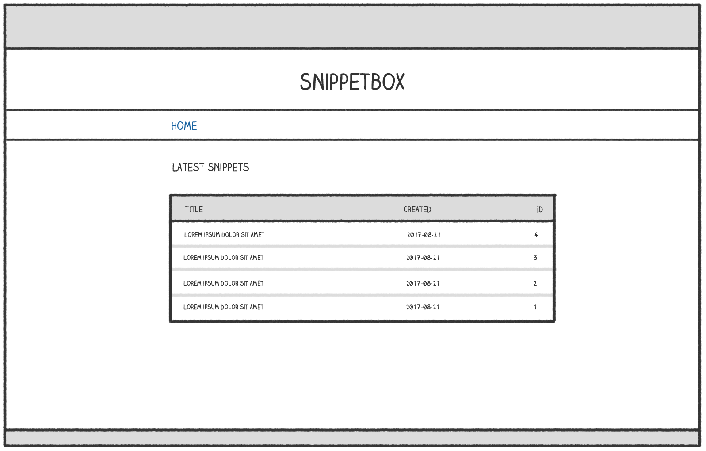
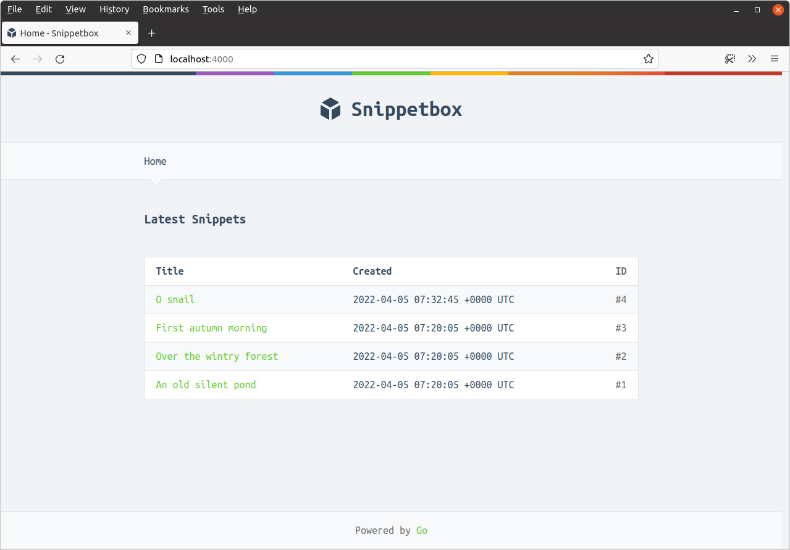

*第 5.2 章。*

## 模板操作与函数

在本节中，我们将了解 Go 提供的模板 *actions* 和 *functions*。

我们已经讨论了一些操作 - `{{define}}`、`{{template}}` 和 `{{block}}` - 但您还可以使用另外三个操作来控制动态数据的显示 - `{{if}}`、`{{with}}` 和 `{{range}}`。

| 行动 | 描述 |
| --- | --- |
| `{{if .Foo}} C1 {{else}} C2 {{end}}` | 如果 `.Foo` 不为空则渲染内容 C1，否则渲染内容 C2。 |
| `{{with .Foo}} C1 {{else}} C2 {{end}}` | 如果 `.Foo` 不为空，则将 dot 设置为 `.Foo` 的值并渲染内容 C1，否则渲染内容 C2。 |
| `{{range .Foo}} C1 {{else}} C2 {{end}}` | 如果 `.Foo` 的长度大于零，则循环遍历每个元素，将 dot 设置为每个元素的值并渲染内容 C1。如果 `.Foo` 的长度为零，则渲染内容 C2。 `.Foo` 的基础类型必须是数组、切片、映射或通道。 |

关于这些行动，有几点需要指出：

- 对于所有三个操作，`{{else}}` 子句是可选的。例如，如果没有要渲染的 `C2` 内容，您可以编写 `{{if .Foo}} C1 {{end}}`。
- *empty* 值为 false、0、任何 nil 指针或接口值以及长度为零的任何数组、切片、映射或字符串。
- 重要的是要了解 `with` 和 `range` 操作会更改点的值。一旦开始使用它们，*点代表的内容可能会有所不同，具体取决于您在模板中的位置以及您正在执行的操作。*

`html/template` 包还提供了一些模板函数，您可以使用它们向模板添加额外的逻辑并控制在运行时呈现的内容。您可以在[此处](https://pkg.go.dev/text/template/#hdr-Functions)找到完整的函数列表，但最重要的是：

| 功能 | 描述 |
| --- | --- |
| `{{eq .Foo .Bar}}` | 如果 `.Foo` 等于 `.Bar`，则结果为 true |
| `{{ne .Foo .Bar}}` | 如果 `.Foo` 不等于 `.Bar`，则结果为 true |
| `{{not .Foo}}` | 产生 `.Foo` 的布尔否定 |
| `{{or .Foo .Bar}}` | 如果 `.Foo` 不为空，则返回 `.Foo`；否则产生 `.Bar` |
| `{{index .Foo i}}` | 产生索引 `i` 处 `.Foo` 的值。 `.Foo` 的基础类型必须是映射、切片或数组，并且 `i` 必须是整数值。 |
| `{{printf "%s-%s" .Foo .Bar}}` | 生成包含 `.Foo` 和 `.Bar` 值的格式化字符串。工作方式与 fmt.Sprintf() 相同。 |
| `{{len .Foo}}` | 产生整数 `.Foo` 的长度。 |
| `{{$bar := len .Foo}}` | 将 `.Foo` 的长度分配给模板变量 `$bar` |

最后一行是声明 *模板变量* 的示例。如果您想要存储函数的结果并在模板中的多个位置使用它，模板变量特别有用。变量名称必须以美元符号为前缀，并且只能包含字母数字字符。

### 使用 with 动作

使用 `{{with}}` 操作的一个好机会是我们在上一章中创建的 `view.tmpl` 文件。继续更新它，如下所示：

*文件：ui/html/pages/view.tmpl*

```html

{{define "title"}}Snippet #{{.Snippet.ID}}{{end}}

{{define "main"}}
    {{with .Snippet}}
    <div class='snippet'>
        <div class='metadata'>
            <strong>{{.Title}}</strong>
            <span>#{{.ID}}</span>
        </div>
        <pre><code>{{.Content}}</code></pre>
        <div class='metadata'>
            <time>Created: {{.Created}}</time>
            <time>Expires: {{.Expires}}</time>
        </div>
    </div>
    {{end}}
{{end}}
```

所以现在，在`{{with .Snippet}}`和对应的`{{end}}`标签之间，dot的值被设置为`.Snippet`。 Dot 本质上成为 `models.Snippet` 结构而不是父 `templateData` 结构。

### 使用 if 和 range 操作

我们还在具体示例中使用 `{{if}}` 和 `{{range}}` 操作，并更新我们的主页以显示最新片段的表格，有点像这样：



首先更新 `templateData` 结构，使其包含一个 `Snippets` 字段来保存片段片段，如下所示：

*文件：cmd/web/templates.go*

```go
package main

import "snippetbox.alexedwards.net/internal/models"

// Include a Snippets field in the templateData struct.
type templateData struct {
    Snippet  models.Snippet
    Snippets []models.Snippet
}
```

然后更新 `home` 处理函数，以便它从我们的数据库模型中获取最新的片段并将它们传递给 `home.tmpl` 模板：

*文件：cmd/web/handlers.go*

```go
package main

...

func (app *application) home(w http.ResponseWriter, r *http.Request) {
    w.Header().Add("Server", "Go")
    
    snippets, err := app.snippets.Latest()
    if err != nil {
        app.serverError(w, r, err)
        return
    }

    files := []string{
        "./ui/html/base.tmpl",
        "./ui/html/partials/nav.tmpl",
        "./ui/html/pages/home.tmpl",
    }

    ts, err := template.ParseFiles(files...)
    if err != nil {
        app.serverError(w, r, err)
        return
    }

    // Create an instance of a templateData struct holding the slice of
    // snippets.
    data := templateData{
        Snippets: snippets,
    }

    // Pass in the templateData struct when executing the template.
    err = ts.ExecuteTemplate(w, "base", data)
    if err != nil {
        app.serverError(w, r, err)
    }
}

...
```

现在，让我们转到 `ui/html/pages/home.tmpl` 文件并更新它，以使用 `{{if}}` 和 `{{range}}` 操作在表格中显示这些片段。具体来说：

- 我们想要使用 `{{if}}` 操作来检查片段切片是否为空。如果它是空的，我们要显示一条 `"There's nothing to see here yet!` 消息。否则，我们想要渲染一个包含片段信息的表。
- 我们希望使用 `{{range}}` 操作来迭代切片中的所有片段，从而在表行中呈现每个片段的内容。

这是标记：

*文件：ui/html/pages/home.tmpl*

```html

{{define "title"}}Home{{end}}

{{define "main"}}
    <h2>Latest Snippets</h2>
    {{if .Snippets}}
     <table>
        <tr>
            <th>Title</th>
            <th>Created</th>
            <th>ID</th>
        </tr>
        {{range .Snippets}}
        <tr>
            <td><a href='/snippet/view/{{.ID}}'>{{.Title}}</a></td>
            <td>{{.Created}}</td>
            <td>#{{.ID}}</td>
        </tr>
        {{end}}
    </table>
    {{else}}
        <p>There's nothing to see here... yet!</p>
    {{end}}
{{end}}
```

确保所有文件均已保存，重新启动应用程序并在网络浏览器中访问 [`http://localhost:4000`](http://localhost:4000/)。如果一切都按计划进行，您应该会看到一个看起来有点像这样的页面：



---

### 补充说明

#### 组合功能

可以在模板标签中组合多个函数，根据需要使用括号 `()` 将函数及其参数括起来。

例如，如果 `Foo` 的长度大于 99，以下标记将渲染内容 `C1`：

```text
{{if (gt (len .Foo) 99)}} C1 {{end}}
```

或者作为另一个示例，如果 `.Foo` 等于 1 *并且* `.Bar` 小于或等于 20，以下标记将渲染内容 `C1`：

```text
{{if (and (eq .Foo 1) (le .Bar 20))}} C1 {{end}}
```

#### 控制循环行为

在 `{{range}}` 操作中，您可以使用 `{{break}}` 命令提前结束循环，并使用 `{{continue}}` 立即开始下一个循环迭代。

```go
{{range .Foo}}
    // Skip this iteration if the .ID value equals 99.
    {{if eq .ID 99}}
        {{continue}}
    {{end}}
    // ...
{{end}}
```

```go
{{range .Foo}}
    // End the loop if the .ID value equals 99.
    {{if eq .ID 99}}
        {{break}}
    {{end}}
    // ...
{{end}}
```
