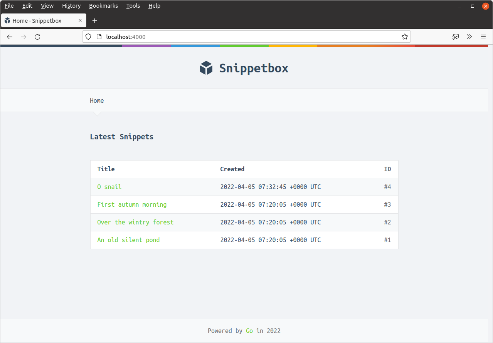

*第 5.5 章。*

## 常用动态数据

在某些 Web 应用程序中，您可能希望将常见的动态数据包含在多个（甚至每个）网页上。例如，您可能希望在所有带有表单的页面中包含当前用户的姓名和个人资料图片，或 CSRF 令牌。

在我们的例子中，让我们从简单的事情开始，假设我们希望在每个页面的页脚中包含当前年份。

为此，我们首先向 `templateData` 结构添加一个新的 `CurrentYear` 字段，如下所示：

*文件：cmd/web/templates.go*

```go
package main

...

// Add a CurrentYear field to the templateData struct.
type templateData struct {
    CurrentYear int
    Snippet     models.Snippet
    Snippets    []models.Snippet
}

...
```

下一步是向我们的应用程序添加一个 `newTemplateData()` 辅助方法，该方法将返回一个使用当前年份初始化的 `templateData` 结构体。

我将演示：

*文件：cmd/web/helpers.go*

```go
package main

import (
    "bytes"
    "fmt"
    "net/http"
    "time" // New import
)

...

// Create an newTemplateData() helper, which returns a templateData struct 
// initialized with the current year. Note that we're not using the *http.Request 
// parameter here at the moment, but we will do later in the book.
func (app *application) newTemplateData(r *http.Request) templateData {
    return templateData{
        CurrentYear: time.Now().Year(),
    }
}

...
```

然后让我们更新 `home` 和 `snippetView` 处理器以使用 `newTemplateData()` 帮助程序，如下所示：

*文件：cmd/web/handlers.go*

```go
package main

...

func (app *application) home(w http.ResponseWriter, r *http.Request) {
    w.Header().Add("Server", "Go")
    
    snippets, err := app.snippets.Latest()
    if err != nil {
        app.serverError(w, r, err)
        return
    }

    // Call the newTemplateData() helper to get a templateData struct containing
    // the 'default' data (which for now is just the current year), and add the
    // snippets slice to it.
    data := app.newTemplateData(r)
    data.Snippets = snippets

    // Pass the data to the render() helper as normal.
    app.render(w, r, http.StatusOK, "home.tmpl", data)
}

func (app *application) snippetView(w http.ResponseWriter, r *http.Request) {
    id, err := strconv.Atoi(r.PathValue("id"))
    if err != nil || id < 1 {
        http.NotFound(w, r)
        return
    }

    snippet, err := app.snippets.Get(id)
    if err != nil {
        if errors.Is(err, models.ErrNoRecord) {
            http.NotFound(w, r)
        } else {
            app.serverError(w, r, err)
        }
        return
    }

    // And do the same thing again here...
    data := app.newTemplateData(r)
    data.Snippet = snippet

    app.render(w, r, http.StatusOK, "view.tmpl", data)
}

...
```

然后我们需要做的最后一件事是更新 `ui/html/base.tmpl` 文件以在页脚中显示年份，如下所示：

*文件：ui/html/base.tmpl*

```html
{{define "base"}}
<!doctype html>
<html lang='en'>
    <head>
        <meta charset='utf-8'>
        <title>{{template "title" .}} - Snippetbox</title>
        <link rel='stylesheet' href='/static/css/main.css'>
        <link rel='shortcut icon' href='/static/img/favicon.ico' type='image/x-icon'>
        <link rel='stylesheet' href='https://fonts.googleapis.com/css?family=Ubuntu+Mono:400,700'>
    </head>
    <body>
        <header>
            <h1><a href='/'>Snippetbox</a></h1>
        </header>
        {{template "nav" .}}
        <main>
            {{template "main" .}}
        </main>
        <footer>
            <!-- Update the footer to include the current year -->
            Powered by <a href='https://golang.org/'>Go</a> in {{.CurrentYear}}
        </footer>
        <script src='/static/js/main.js' type='text/javascript'></script>
    </body>
</html>
{{end}}
```

如果您重新启动应用程序并访问主页 [`http://localhost:4000`](http://localhost:4000/)，您现在应该在页脚中看到当前年份。像这样：


