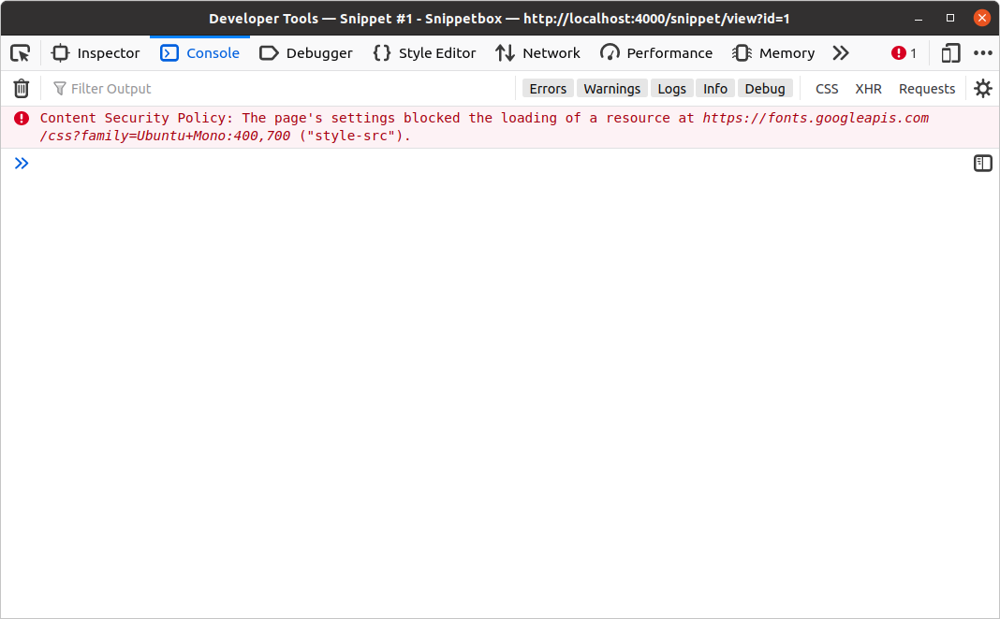

*第 6.2 章。*

## 设置通用标头

让我们使用上一章中学到的模式，并制作一些中间件，自动将 `Server: Go` 标头添加到每个响应中，以及以下 HTTP 安全标头（与 [当前 OWASP 指南](https://owasp.org/www-project-secure-headers) 一致）。

```text
Content-Security-Policy: default-src 'self'; style-src 'self' fonts.googleapis.com; font-src fonts.gstatic.com
Referrer-Policy: origin-when-cross-origin
X-Content-Type-Options: nosniff
X-Frame-Options: deny
X-XSS-Protection: 0
```

如果您不熟悉这些标头，我将快速解释它们的作用。

- `Content-Security-Policy`（通常缩写为 *CSP*）标头用于限制网页资源（例如 JavaScript、图片和字体等）的加载来源。设置严格的 CSP 策略有助于防范多种跨站脚本、点击劫持及其他代码注入攻击。
  CSP 标头及其工作原理是一个很大的主题；如果你此前没有接触过，建议阅读[这篇入门文章](https://developer.mozilla.org/en-US/docs/Web/HTTP/CSP)。在本例中，该标头告诉浏览器：可以从 `fonts.gstatic.com` 加载字体，从 `fonts.googleapis.com` 和 `self`（我们自己的源）加载样式表，而*其他所有内容*只能从 `self` 加载。内联 JavaScript 默认会被阻止。
- `Referrer-Policy` 用于控制当用户离开您的网页时 `Referer` 标头中包含哪些信息。在我们的例子中，我们将值设置为 `origin-when-cross-origin`，这意味着 [同源请求](https://developer.mozilla.org/en-US/docs/Web/Security/Same-origin_policy) 将包含完整的 URL，但对于所有其他请求，诸如 URL 路径和任何查询字符串值之类的信息将被删除。
- `X-Content-Type-Options: nosniff` 指示浏览器 *不* MIME 类型嗅探响应的内容类型，这反过来又有助于防止 [内容嗅探攻击](https://security.stackexchange.com/questions/7506/using-file-extension-and-mime-type-as-output-by-file-i-b-combination-to-dete/7531#7531)。
- `X-Frame-Options: deny` 用于帮助防止不支持 CSP 标头的旧版浏览器中的 [点击劫持](https://developer.mozilla.org/en-US/docs/Web/Security/Types_of_attacks#click-jacking) 攻击。
- `X-XSS-Protection: 0` 用于*禁用*阻止跨站点脚本攻击。以前，将此标头设置为 `X-XSS-Protection: 1; mode=block` 是一种很好的做法，但是当您像我们一样使用 CSP 标头时 [建议](https://owasp.org/www-project-secure-headers/#x-xss-protection) 完全禁用此功能。

好的，让我们回到 Go 代码并开始创建一个新的 `middleware.go` 文件。我们将使用它来保存我们在本书中编写的所有自定义中间件。

```bash
$ touch cmd/web/middleware.go
```

然后打开它并使用我们在上一章中介绍的模式添加一个 `commonHeaders()` 函数：

*文件：cmd/web/middleware.go*

```go
package main

import (
    "net/http"
)

func commonHeaders(next http.Handler) http.Handler {
    return http.HandlerFunc(func(w http.ResponseWriter, r *http.Request) {
        // Note: This is split across multiple lines for readability. You don't 
        // need to do this in your own code.
        w.Header().Set("Content-Security-Policy",
            "default-src 'self'; style-src 'self' fonts.googleapis.com; font-src fonts.gstatic.com")

        w.Header().Set("Referrer-Policy", "origin-when-cross-origin")
        w.Header().Set("X-Content-Type-Options", "nosniff")
        w.Header().Set("X-Frame-Options", "deny")
        w.Header().Set("X-XSS-Protection", "0")

        w.Header().Set("Server", "Go")

        next.ServeHTTP(w, r)
    })
}
```

因为我们希望这个中间件对收到的每个请求起作用，所以我们需要在请求到达我们的ServeMux之前*执行它。我们希望应用程序的控制流程如下所示：

```text
commonHeaders → servemux → application handler
```

为此，我们需要 `commonHeaders` 中间件函数来 *包装我们的ServeMux*。让我们更新 `routes.go` 文件来做到这一点：

*文件：cmd/web/routes.go*

```go
package main

import "net/http"

// Update the signature for the routes() method so that it returns a
// http.Handler instead of *http.ServeMux.
func (app *application) routes() http.Handler {
    mux := http.NewServeMux()

    fileServer := http.FileServer(http.Dir("./ui/static/"))
    mux.Handle("GET /static/", http.StripPrefix("/static", fileServer))
    
    mux.HandleFunc("GET /{$}", app.home)
    mux.HandleFunc("GET /snippet/view/{id}", app.snippetView)
    mux.HandleFunc("GET /snippet/create", app.snippetCreate)
    mux.HandleFunc("POST /snippet/create", app.snippetCreatePost)

    // Pass the servemux as the 'next' parameter to the commonHeaders middleware.
    // Because commonHeaders is just a function, and the function returns a
    // http.Handler we don't need to do anything else.
    return commonHeaders(mux)
}
```

> **重要提示：** 请确保更新 `routes()` 方法的签名，以便它在此处返回 `http.Handler`，否则您将收到编译时错误。

我们还需要快速更新 `home` 处理器代码以删除 `w.Header().Add("Server", "Go")` 行，否则我们最终会在主页的响应中添加该标头两次。

*文件：cmd/web/handlers.go*

```go
package main

...

func (app *application) home(w http.ResponseWriter, r *http.Request) {
    snippets, err := app.snippets.Latest()
    if err != nil {
        app.serverError(w, r, err)
        return
    }

    data := app.newTemplateData(r)
    data.Snippets = snippets

    app.render(w, r, http.StatusOK, "home.tmpl", data)
}

...
```

来尝试一下吧。运行应用程序，然后打开终端窗口并尝试使用curl发出一些请求。您应该看到安全标头现在包含在每个响应中。

```bash
$ curl --head http://localhost:4000/
HTTP/1.1 200 OK
Content-Security-Policy: default-src 'self'; style-src 'self' fonts.googleapis.com; font-src fonts.gstatic.com
Referrer-Policy: origin-when-cross-origin
Server: Go
X-Content-Type-Options: nosniff
X-Frame-Options: deny
X-Xss-Protection: 0
Date: Wed, 18 Mar 2024 11:29:23 GMT
Content-Length: 1700
Content-Type: text/html; charset=utf-8
```

---

### 补充说明

#### 控制流程

重要的是要知道，当链中的最后一个处理器返回时，控制权将以相反的方向传递回链。因此，当我们的代码执行时，控制流程实际上如下所示：

```text
commonHeaders → servemux → application handler → servemux → commonHeaders
```

在任何中间件处理器中，`next.ServeHTTP()`之前的代码将在链的下游执行，而`next.ServeHTTP()`之后的任何代码（或延迟函数中的代码）将在备份的路上执行。

```go
func myMiddleware(next http.Handler) http.Handler {
    return http.HandlerFunc(func(w http.ResponseWriter, r *http.Request) {
        // Any code here will execute on the way down the chain.
        next.ServeHTTP(w, r)
        // Any code here will execute on the way back up the chain.
    })
}
```

#### 提前返回

另一件需要提到的是，如果您在中间件函数 *中调用* 之前调用 `return`，则调用 `next.ServeHTTP()` 之前，链将停止执行，控制将流回上游。

例如，早期返回的一个常见用例是身份验证中间件，它仅允许在通过特定检查时继续执行链。例如：

```go
func myMiddleware(next http.Handler) http.Handler {
    return http.HandlerFunc(func(w http.ResponseWriter, r *http.Request) {
        // If the user isn't authorized, send a 403 Forbidden status and
        // return to stop executing the chain.
        if !isAuthorized(r) {
            w.WriteHeader(http.StatusForbidden)
            return
        }

        // Otherwise, call the next handler in the chain.
        next.ServeHTTP(w, r)
    })
}
```

我们将在本书的后面](10.06-user-authorization.md)中使用这种“提前返回”模式[来限制对应用程序某些部分的访问。

#### 调试 CSP 问题

虽然 CSP 标头很棒并且您绝对应该使用它们，但值得一提的是，我花了很多时间尝试调试问题，但最终意识到关键资源或脚本被我自己的 CSP 规则阻止了🤦。

如果您正在开发一个使用 CSP 标头的项目（例如本项目），我建议您随身携带 Web 浏览器开发工具，并养成在遇到任何意外问题时尽早检查日志的习惯。在 Firefox 中，任何被阻止的资源都将在控制台日志中显示为错误 - 类似于：


