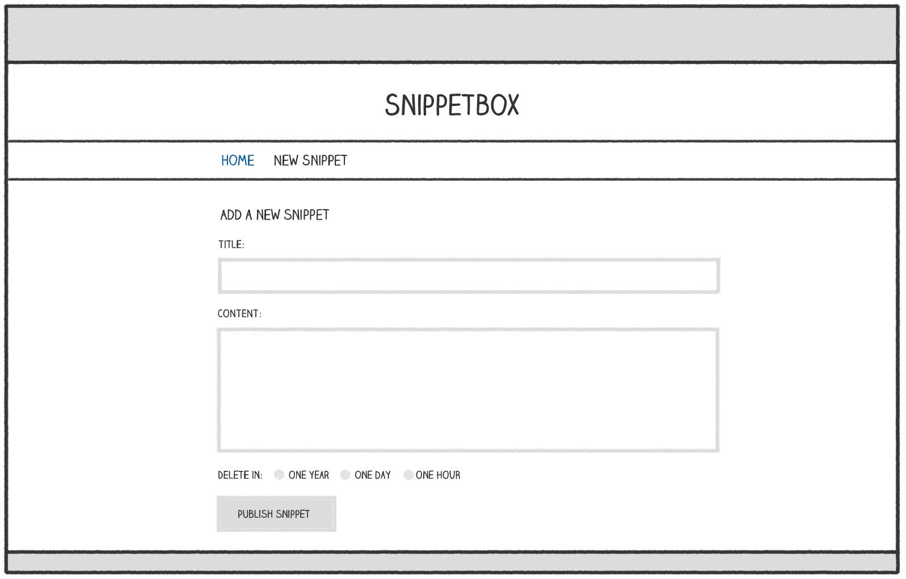

*第 7 章。*

# 表单处理

在本书的这一部分中，我们将重点关注添加用于创建新片段的 HTML 表单。该表单看起来有点像这样：

处理此表单的高级流程将遵循标准 `Post-Redirect-Get` 模式，并且工作方式如下：

1. 当用户向 `/snippet/create` 发出 `GET` 请求时，会显示空白表单。
2. 用户填写表单，并通过 `POST` 向 `/snippet/create` 请求将其提交到服务器。
3. 表单数据将由我们的 `snippetCreatePost` 处理器进行验证。如果存在任何验证失败，表单将重新显示，并突出显示相应的表单字段。如果它通过了我们的验证检查，新代码段的数据将被添加到数据库中，然后我们将用户重定向到 `GET /snippet/view/{id}`。

作为本课程的一部分，您将学到：

- 如何[解析和访问](07.02-parsing-form-data.md)在`POST`请求中发送的表单数据。
- 对表单数据执行常见[验证检查](07.03-validating-form-data.md)的一些技术。
- [用户友好模式](07.04-displaying-errors-and-repopulating-fields.md)，用于警告用户验证失败并使用之前提交的数据重新填充表单字段。
- 如何使用表单处理和验证帮助程序来[保持处理器干净](07.05-creating-validation-helpers.md)。
