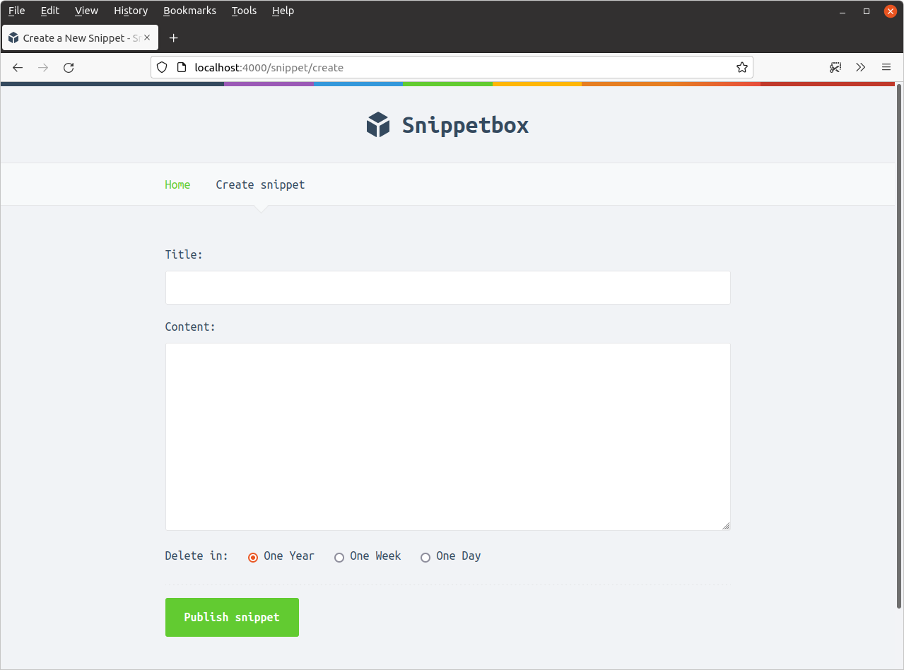

*第 7.1 章。*

## 设置 HTML 表单

让我们首先创建一个新的 `ui/html/pages/create.tmpl` 文件来保存表单的 HTML：

```bash
$ touch ui/html/pages/create.tmpl
```

...然后使用我们在本书前面使用的相同模板模式添加以下标记。

*文件：ui/html/pages/create.tmpl*

```html
{{define "title"}}Create a New Snippet{{end}}

{{define "main"}}
<form action='/snippet/create' method='POST'>
    <div>
        <label>Title:</label>
        <input type='text' name='title'>
    </div>
    <div>
        <label>Content:</label>
        <textarea name='content'></textarea>
    </div>
    <div>
        <label>Delete in:</label>
        <input type='radio' name='expires' value='365' checked> One Year
        <input type='radio' name='expires' value='7'> One Week
        <input type='radio' name='expires' value='1'> One Day
    </div>
    <div>
        <input type='submit' value='Publish snippet'>
    </div>
</form>
{{end}}
```

到目前为止，这并没有什么特别之处。我们的 `main` 模板包含一个标准 HTML 表单，该表单发送三个表单值：`title`、`content` 和 `expires`（代码段过期之前的天数）。唯一需要真正指出的是表单的 `action` 和 `method` 属性 - 我们已经设置了这些属性，以便表单在提交时将 `POST` 数据发送到 URL `/snippet/create`。

现在，让我们向应用程序的导航栏添加一个新的“创建片段”链接，以便单击它会将用户带到这个新表单。

*文件：ui/html/partials/nav.tmpl*

```html
{{define "nav"}}
 <nav>
    <a href='/'>Home</a>
    <!-- Add a link to the new form -->
    <a href='/snippet/create'>Create snippet</a>
</nav>
{{end}}
```

最后，我们需要更新 `snippetCreate` 处理器，以便它呈现我们的新页面，如下所示：

*文件：cmd/web/handlers.go*

```go
package main

...

func (app *application) snippetCreate(w http.ResponseWriter, r *http.Request) {
    data := app.newTemplateData(r)

    app.render(w, r, http.StatusOK, "create.tmpl", data)
}

...
```

此时，您可以启动应用程序并在浏览器中访问 [`http://localhost:4000/snippet/create`](http://localhost:4000/snippet/create)。您应该看到一个如下所示的表单：


