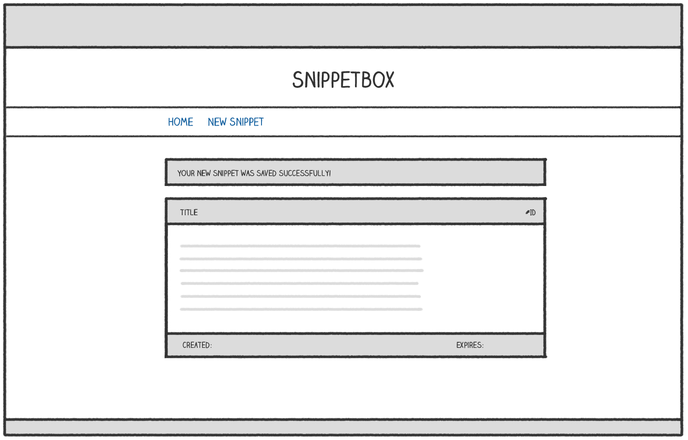

*第 8 章。*

# 有状态 HTTP

改善用户体验的一个不错的做法是显示一条一次性确认消息，用户在*添加新代码段后会看到该消息。就像这样：

像这样的确认消息应该只向用户显示一次（在创建代码片段后立即），并且其他用户不应该看到该消息。如果您已经编程了一段时间，您可能知道这种类型的功能是 *闪烁消息* 或 *toast*。

为了实现这一点，我们需要开始在同一用户的 HTTP 请求之间共享数据（或 *state*）。最常见的方法是为用户实现 *会话*。

在本节中，您将学到：

- [会话管理器](08.01-choosing-a-session-manager.md)可以帮助我们在 Go 中实现会话。
- 如何[使用会话](08.03-working-with-session-data.md)在特定用户的请求之间安全可靠地共享数据。
- 如何根据应用程序的需求[自定义会话行为](08.02-setting-up-the-session-manager.md)（包括超时和 Cookie 设置）。
