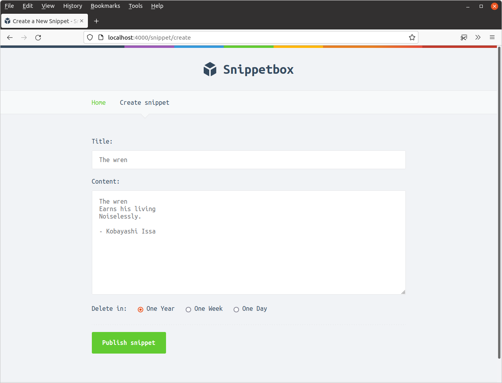
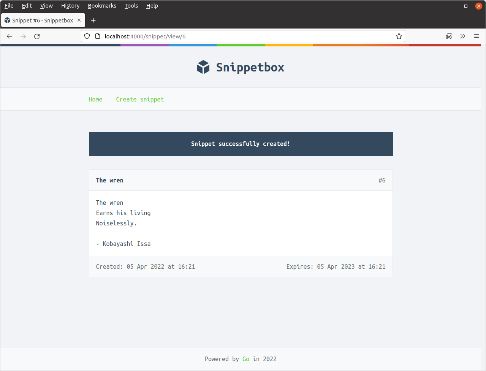
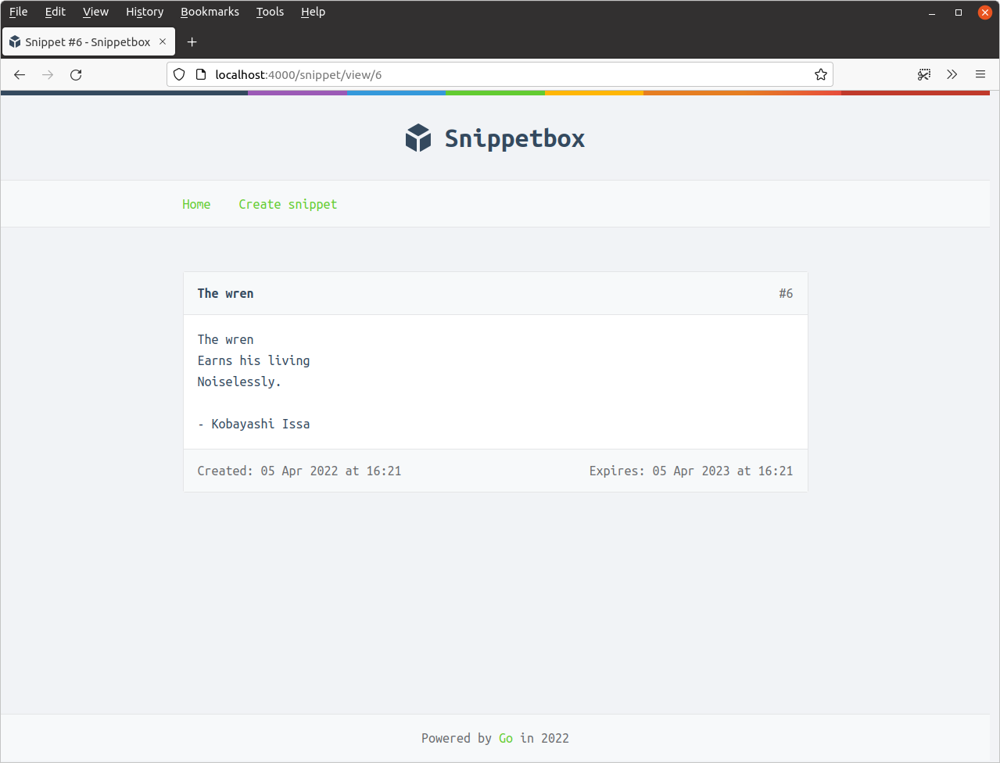
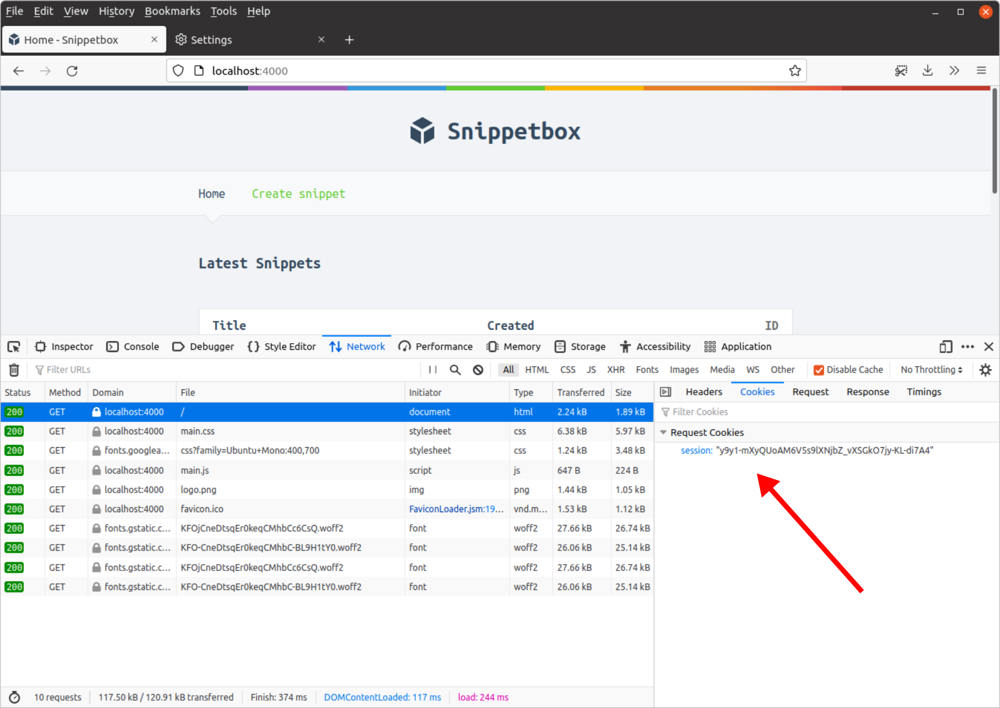

*第 8.3 章。*

## 使用会话数据

在本章中，我们将使用会话功能，并使用它来持久保存我们[之前讨论过的](08.00-stateful-http.md) HTTP 请求之间的确认闪存消息。

我们将从 `cmd/web/handlers.go` 文件开始，更新我们的 `snippetCreatePost` 方法，以便当且仅当代码段成功创建时，才会将 Flash 消息添加到用户的会话数据中。就像这样：

*文件：cmd/web/handlers.go*

```go
package main

...

func (app *application) snippetCreatePost(w http.ResponseWriter, r *http.Request) {
    var form snippetCreateForm

    err := app.decodePostForm(r, &form)
    if err != nil {
        app.clientError(w, http.StatusBadRequest)
        return
    }

    form.CheckField(validator.NotBlank(form.Title), "title", "This field cannot be blank")
    form.CheckField(validator.MaxChars(form.Title, 100), "title", "This field cannot be more than 100 characters long")
    form.CheckField(validator.NotBlank(form.Content), "content", "This field cannot be blank")
    form.CheckField(validator.PermittedValue(form.Expires, 1, 7, 365), "expires", "This field must equal 1, 7 or 365")

    if !form.Valid() {
        data := app.newTemplateData(r)
        data.Form = form
        app.render(w, r, http.StatusUnprocessableEntity, "create.tmpl", data)
        return
    }

    id, err := app.snippets.Insert(form.Title, form.Content, form.Expires)
    if err != nil {
        app.serverError(w, r, err)
        return
    }

    // Use the Put() method to add a string value ("Snippet successfully 
    // created!") and the corresponding key ("flash") to the session data.
    app.sessionManager.Put(r.Context(), "flash", "Snippet successfully created!")

    http.Redirect(w, r, fmt.Sprintf("/snippet/view/%d", id), http.StatusSeeOther)
}
```

这很好也很简单，但有几点需要指出：

- 我们传递给 [`app.sessionManager.Put()`](https://pkg.go.dev/github.com/alexedwards/scs/v2#SessionManager.Put) 的第一个参数是 *当前请求上下文*。我们将在本书后面正确讨论请求上下文是什么以及如何使用它，但现在您可以将其视为在处理器处理请求时会话管理器临时存储信息的地方。
- 第二个参数（在我们的例子中为字符串 `"flash"`）是我们要添加到会话数据的特定消息的 *key*。随后我们也将使用此密钥从会话数据中检索消息。
- 如果当前用户没有现有会话（或者他们的会话已过期），那么会话中间件将自动为他们创建一个新的空会话。

接下来，我们希望 `snippetView` 处理器检索 Flash 消息（如果当前用户的会话中存在该消息）并将其传递给 HTML 模板以供后续显示。

因为我们只想显示一次 Flash 消息，所以我们实际上希望从会话数据中检索 *并删除* 该消息。我们可以使用 [`PopString()`](https://pkg.go.dev/github.com/alexedwards/scs/v2#SessionManager.PopString) 方法同时执行这两个操作。

我将演示：

*文件：cmd/web/handlers.go*

```go
package main

...

func (app *application) snippetView(w http.ResponseWriter, r *http.Request) {
    id, err := strconv.Atoi(r.PathValue("id"))
    if err != nil || id < 1 {
        http.NotFound(w, r)
        return
    }

    snippet, err := app.snippets.Get(id)
    if err != nil {
        if errors.Is(err, models.ErrNoRecord) {
            http.NotFound(w, r)
        } else {
            app.serverError(w, r, err)
        }
        return
    }

    // Use the PopString() method to retrieve the value for the "flash" key.
    // PopString() also deletes the key and value from the session data, so it
    // acts like a one-time fetch. If there is no matching key in the session
    // data this will return the empty string.
    flash := app.sessionManager.PopString(r.Context(), "flash")

    data := app.newTemplateData(r)
    data.Snippet = snippet

    // Pass the flash message to the template.
    data.Flash = flash 

    app.render(w, r, http.StatusOK, "view.tmpl", data)
}

...
```

> **Info:** 如果您只想从会话数据中检索值（并将其保留在那里），您可以改用 `GetString()` 方法。 `scs` 包还提供了检索其他常见数据类型的方法，包括 `GetInt()`、`GetBool()`、`GetBytes()` 和 `GetTime()`。

如果您现在尝试运行该应用程序，编译器将（正确地）抱怨我们的 `templateData` 结构中未定义 `Flash` 字段。继续添加它，如下所示：

*文件：cmd/web/templates.go*

```go
package main

import (
    "html/template"
    "path/filepath"
    "time"

    "snippetbox.alexedwards.net/internal/models"
)

type templateData struct {
    CurrentYear int
    Snippet     models.Snippet
    Snippets    []models.Snippet
    Form        any
    Flash       string // Add a Flash field to the templateData struct.
}

...
```

现在，我们可以更新 `base.tmpl` 文件来显示闪现消息（如果存在）。

*文件：ui/html/base.tmpl*

```html
{{define "base"}}
<!doctype html>
<html lang='en'>
    <head>
        <meta charset='utf-8'>
        <title>{{template "title" .}} - Snippetbox</title>
        <link rel='stylesheet' href='/static/css/main.css'>
        <link rel='shortcut icon' href='/static/img/favicon.ico' type='image/x-icon'>
        <link rel='stylesheet' href='https://fonts.googleapis.com/css?family=Ubuntu+Mono:400,700'>
    </head>
    <body>
        <header>
            <h1><a href='/'>Snippetbox</a></h1>
        </header>
        {{template "nav" .}}
        <main>
            <!-- Display the flash message if one exists -->
            {{with .Flash}}
                <div class='flash'>{{.}}</div>
            {{end}}
            {{template "main" .}}
        </main>
        <footer>
            Powered by <a href='https://golang.org/'>Go</a> in {{.CurrentYear}}
        </footer>
        <script src='/static/js/main.js' type='text/javascript'></script>
    </body>
</html>
{{end}}
```

请记住，仅当 `.Flash` 的值为 [而不是空字符串](05.02-template-actions-and-functions.md) 时，才会执行 `{{with .Flash}}` 块。因此，如果当前用户会话中没有 `"flash"` 键，结果是新标记块将不会显示。

完成后，保存所有文件并重新启动应用程序。尝试添加一个新的片段，如下所示......



重定向后，您应该看到现在显示的 Flash 消息：



如果您尝试刷新页面，您可以确认闪现消息不再显示 - 这是当前用户创建代码片段后立即发送的一次性消息。



### 自动显示闪现消息

我们可以做的一点改进（这将为我们在项目后期节省一些工作）是自动显示 Flash 消息，以便下次呈现 *任何页面时自动包含任何消息*。

我们可以通过我们之前创建的 `newTemplateData()` 辅助方法将任何 Flash 消息添加到模板数据中来完成此操作，如下所示：

*文件：cmd/web/helpers.go*

```go
package main

...

func (app *application) newTemplateData(r *http.Request) templateData {
    return templateData{
        CurrentYear: time.Now().Year(),
        // Add the flash message to the template data, if one exists.
        Flash:       app.sessionManager.PopString(r.Context(), "flash"),
    }
}

...
```

进行此更改意味着我们不再需要在 `snippetView` 处理器中检查闪存消息，并且代码可以恢复为如下所示：

*文件：cmd/web/handlers.go*

```go
package main

...

func (app *application) snippetView(w http.ResponseWriter, r *http.Request) {
    id, err := strconv.Atoi(r.PathValue("id"))
    if err != nil || id < 1 {
        http.NotFound(w, r)
        return
    }

    snippet, err := app.snippets.Get(id)
    if err != nil {
        if errors.Is(err, models.ErrNoRecord) {
            http.NotFound(w, r)
        } else {
            app.serverError(w, r, err)
        }
        return
    }

    data := app.newTemplateData(r)
    data.Snippet = snippet

    app.render(w, r, http.StatusOK, "view.tmpl", data)
}

...
```

请随意尝试再次运行该应用程序并创建另一个片段。您应该会发现闪现消息功能仍然按预期工作。

---

### 补充说明

#### 会话管理的幕后

我想花点时间来解开会话管理背后的一些“魔力”，并解释它在幕后的工作原理。

如果您愿意，可以在 Web 浏览器中打开开发人员工具并查看其中一个页面的 cookie 数据。您应该在请求数据中看到一个名为 `session` 的 cookie，类似于：



这是 *会话 cookie*，它将随着浏览器发出的每个请求发送回 Snippetbox 应用程序。

会话 cookie 包含 *会话令牌* — 有时也称为 *会话 ID*。会话令牌是一个高熵随机字符串，在我的例子中是值 `y9y1-mXyQUoAM6V5s9lXNjbZ_vXSGkO7jy-KL-di7A4` （你的会有所不同）。

需要强调的是，会话令牌只是一个随机字符串。它本身不携带或传达任何*会话数据*（就像我们在本章中设置的闪存消息）。

接下来，您可能想打开 MySQL 终端并对 `sessions` 表运行 `SELECT` 查询，以查找您在浏览器中看到的会话令牌。就像这样：

```bash
mysql> SELECT * FROM sessions WHERE token = 'y9y1-mXyQUoAM6V5s9lXNjbZ_vXSGkO7jy-KL-di7A4';
+---------------------------------------------+--------------------------------------------------------------------------------------------------------------------------------------------------------------------------------------------------------------------------------------------------+----------------------------+
| token                                       | data                                                                                                                                                                                                                                             | expiry                     |
+---------------------------------------------+--------------------------------------------------------------------------------------------------------------------------------------------------------------------------------------------------------------------------------------------------+----------------------------+
| y9y1-mXyQUoAM6V5s9lXNjbZ_vXSGkO7jy-KL-di7A4 | 0x26FF81030102FF820001020108446561646C696E6501FF8400010656616C75657301FF8600000010FF830501010454696D6501FF8400000027FF85040101176D61705B737472696E675D696E74657266616365207B7D01FF8600010C0110000016FF82010F010000000ED9F4496109B650EBFFFF010000 | 2024-03-18 11:29:23.179505 |
+---------------------------------------------+--------------------------------------------------------------------------------------------------------------------------------------------------------------------------------------------------------------------------------------------------+----------------------------+
1 row in set (0.00 sec)
```

这应该返回一条记录。这里的 `data` 值是 *实际上包含用户会话数据*。具体来说，我们看到的是一个 MySQL `BLOB`（二进制大对象），其中包含会话数据的 [gob 编码的](https://pkg.go.dev/encoding/gob) 表示形式。

每次我们对会话数据进行更改时，此 `data` 值都会更新以反映更改。

最后，数据库中的最后一列是 `expiry` 时间，在此之后会话将不再被视为有效。

因此，我们的应用程序中发生的情况是 `LoadAndSave()` 中间件检查每个传入请求的会话 cookie。如果存在会话 cookie，它会从 cookie 中读取会话令牌并从数据库中检索相应的会话数据（同时还会检查会话是否已过期）。然后，它将会话数据添加到 *请求上下文*，以便可以在您的处理器中使用。

您在处理器中对会话数据所做的任何更改都会在请求上下文中更新，然后 `LoadAndSave()` 中间件在返回之前使用对会话数据的任何更改来更新数据库。
