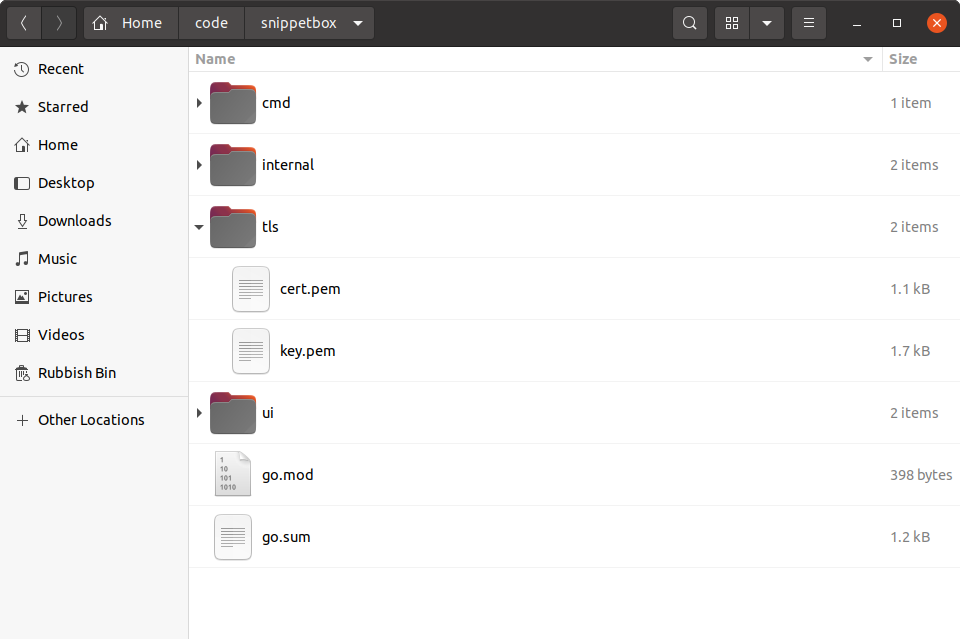

*第 9.3 章。*

## 生成自签名 TLS 证书

让我们将注意力转移到让我们的应用程序使用 HTTPS（而不是纯 HTTP）来处理所有请求和响应。

HTTPS 本质上是通过 TLS (*传输层安全性*) 连接发送的 HTTP。这样做的优点是 HTTPS 流量经过加密和签名，有助于确保传输过程中的隐私性和完整性。

> **注意：**如果您不熟悉这个术语，TLS 本质上是 SSL 的现代版本（*安全套接字层*）。由于安全问题，SSL 现在已被正式弃用，但该名称仍然存在于公众意识中，并且经常与 TLS 互操作使用。为了清晰和准确起见，我们将在本书中始终使用术语 TLS。

在我们的服务器开始使用 HTTPS 之前，我们需要生成 *TLS 证书*。

对于生产服务器，我建议使用 [Let’s Encrypt](https://letsencrypt.org/) 创建 TLS 证书，但出于开发目的，最简单的方法是生成您自己的 *自签名证书*。

自签名证书与普通 TLS 证书相同，只是它不是由受信任的证书颁发机构以加密方式签名的。这意味着您的网络浏览器将在第一次使用时发出警告，但它仍然会正确加密 HTTPS 流量，并且适合开发和测试目的。

方便的是，Go 标准库中的 `crypto/tls` 包包含一个 `generate_cert.go` 工具，我们可以使用它轻松创建自己的自签名证书。

如果您按照步骤进行操作，请首先在项目存储库的根目录中创建一个新的 `tls` 目录来保存证书并更改为该目录：

```bash
$ cd $HOME/code/snippetbox
$ mkdir tls
$ cd tls
```

要运行 `generate_cert.go` 工具，您需要知道计算机上安装 Go 标准库源代码的位置。如果您使用的是 Linux、macOS 或 FreeBSD 并遵循[官方安装说明](https://golang.org/doc/install#install)，则 `generate_cert.go` 文件应位于 `/usr/local/go/src/crypto/tls` 下。

如果您使用的是 macOS 并使用 Homebrew 安装了 Go，则该文件可能位于 `/usr/local/Cellar/go/<version>/libexec/src/crypto/tls/generate_cert.go` 或类似路径。

一旦知道它的位置，您就可以运行 `generate_cert.go` 工具，如下所示：

```bash
$ go run /usr/local/go/src/crypto/tls/generate_cert.go --rsa-bits=2048 --host=localhost
2024/03/18 11:29:23 wrote cert.pem
2024/03/18 11:29:23 wrote key.pem
```

在幕后，这个 `generate_cert.go` 命令分两个阶段工作：

1. 首先，它生成一个 [2048 位](https://www.fastly.com/blog/key-size-for-tls) RSA 密钥对，它是加密安全的 [公钥和私钥](https://en.wikipedia.org/wiki/Public-key_cryptography)。
2. 然后，它将私钥存储在 `key.pem` 文件中，并为包含公钥的主机 `localhost` 生成自签名 TLS 证书，并将其存储在 `cert.pem` 文件中。私钥和证书都是 PEM 编码的，这是大多数 TLS 实现使用的标准格式。

您的项目存储库现在应该如下所示：



就是这样！现在，我们已经获得了可以在开发过程中使用的自签名 TLS 证书（以及相应的私钥）。

---

### 补充说明

#### mkcert 工具

作为 `generate_cert.go` 工具的替代方案，您可能需要考虑使用 [mkcert](https://github.com/FiloSottile/mkcert) 生成 TLS 证书。尽管这需要一些额外的设置，但它的优点是生成的证书是*本地可信的* - 这意味着您可以使用它们进行测试和开发，而无需在 Web 浏览器中收到安全警告。
