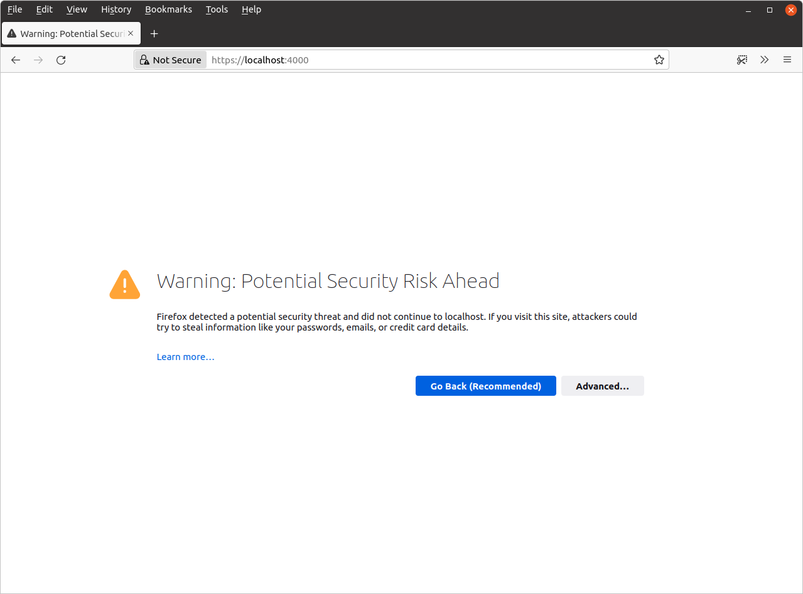
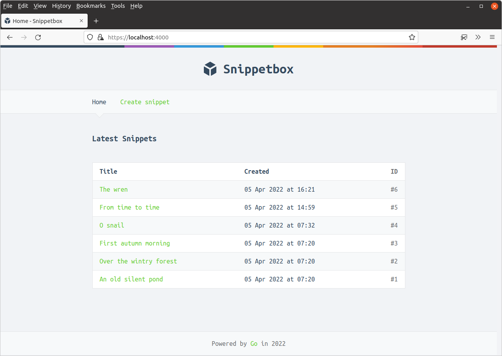
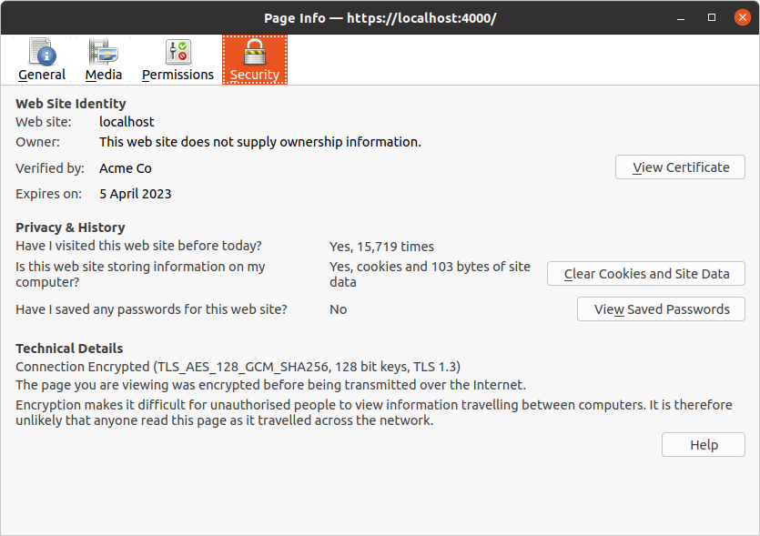
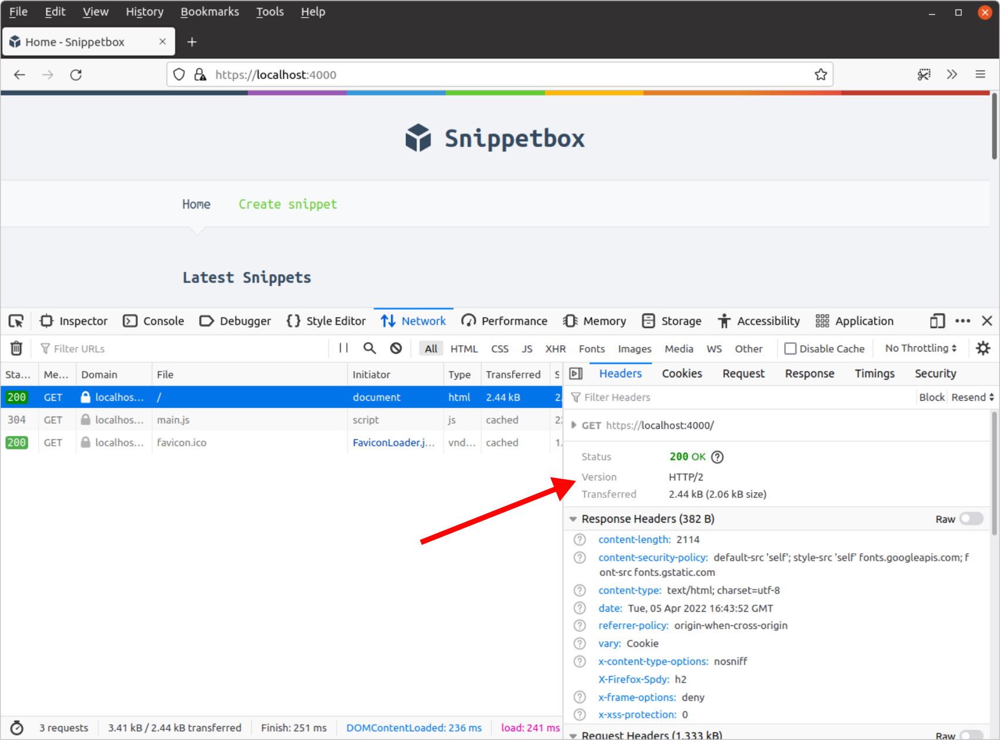

*第 9.4 章。*

## 运行 HTTPS 服务器

现在我们有了自签名 TLS 证书和相应的私钥，启动 HTTPS Web 服务器既可爱又简单 - 我们只需打开 `main.go` 文件并将 `srv.ListenAndServe()` 方法替换为 [`srv.ListenAndServeTLS()`](https://pkg.go.dev/net/http/#Server.ListenAndServeTLS) 即可。

更改您的 `main.go` 文件以匹配以下代码：

*文件：cmd/web/main.go*

```go
package main

...

func main() {
    addr := flag.String("addr", ":4000", "HTTP network address")
    dsn := flag.String("dsn", "web:pass@/snippetbox?parseTime=true", "MySQL data source name")
    flag.Parse()

    logger := slog.New(slog.NewTextHandler(os.Stdout, nil))

    db, err := openDB(*dsn)
    if err != nil {
        logger.Error(err.Error())
        os.Exit(1)
    }
    defer db.Close()

    templateCache, err := newTemplateCache()
    if err != nil {
        logger.Error(err.Error())
        os.Exit(1)
    }

    formDecoder := form.NewDecoder()

    sessionManager := scs.New()
    sessionManager.Store = mysqlstore.New(db)
    sessionManager.Lifetime = 12 * time.Hour
    // Make sure that the Secure attribute is set on our session cookies.
    // Setting this means that the cookie will only be sent by a user's web
    // browser when a HTTPS connection is being used (and won't be sent over an
    // unsecure HTTP connection).
    sessionManager.Cookie.Secure = true

    app := &application{
        logger:         logger,
        snippets:       &models.SnippetModel{DB: db},
        templateCache:  templateCache,
        formDecoder:    formDecoder,
        sessionManager: sessionManager,
    }

    srv := &http.Server{
        Addr:     *addr,
        Handler:  app.routes(),
        ErrorLog: slog.NewLogLogger(logger.Handler(), slog.LevelError),
    }

    logger.Info("starting server", "addr", srv.Addr)
    
    // Use the ListenAndServeTLS() method to start the HTTPS server. We
    // pass in the paths to the TLS certificate and corresponding private key as
    // the two parameters.
    err = srv.ListenAndServeTLS("./tls/cert.pem", "./tls/key.pem")
    logger.Error(err.Error())
    os.Exit(1)
}

...
```

当我们运行此命令时，我们的服务器仍将侦听端口 4000 - 唯一的区别是它现在将使用 HTTPS 而不是 HTTP。

继续并正常运行它：

```bash
$ cd $HOME/code/snippetbox
$ go run ./cmd/web
time=2024-03-18T11:29:23.000+00:00 level=INFO msg="starting server" addr=:4000
```

如果您打开网络浏览器并访问 [https://localhost:4000/](https://localhost:4000/)，您可能会收到浏览器警告，因为 TLS 证书是自签名的，类似于下面的屏幕截图。



- 如果您像我一样使用 Firefox，请单击“高级”，然后单击“接受风险并继续”。
- 如果您使用的是 Chrome 或 Chromium，请单击“高级”，然后单击“继续到本地主机（不安全）”链接。

之后，应用程序主页应该出现（尽管它仍然会在 URL 栏中带有警告）。

在 Firefox 中，它应该看起来有点像这样：



如果您使用的是 Firefox，我建议按 `Ctrl+i` 检查主页的页面信息：



此处的“安全 > 技术详细信息”部分确认我们的连接已加密并且按预期工作。

就我而言，我可以看到正在使用 TLS 版本 1.3，并且我的 HTTPS 连接的 *密码套件* 是 `TLS_AES_128_GCM_SHA256`。我们将在下一章详细讨论密码套件。

> **旁白：** 如果您想知道上面屏幕截图的网站标识部分中的“Acme Co”是谁或是什么，它只是 `generate_cert.go` 工具使用的硬编码占位符名称。

---

### 补充说明

#### HTTP 请求

需要注意的是，我们的 HTTPS 服务器 *仅支持 HTTPS*。如果您尝试向其发出常规 HTTP 请求，服务器将向用户发送 `400 Bad Request` 状态和消息 `"Client sent an HTTP request to an HTTPS server"`。不会记录任何内容。

```bash
$ curl -i http://localhost:4000/
HTTP/1.0 400 Bad Request

Client sent an HTTP request to an HTTPS server.
```

#### HTTP/2 连接

使用 HTTPS 的一大优点是，如果客户端支持，Go 会自动升级连接以使用 HTTP/2。

这很好，因为这意味着最终我们的页面将为用户加载得更快。如果您不熟悉 HTTP/2，您可以在 Brad Fitzpatrick 的 [GoSF 聚会演讲](https://www.youtube.com/watch?v=FARQMJndUn0) 中了解基础知识，并了解它在 Go 中的幕后实现方式。

如果您使用的是最新版本的 Firefox，您应该能够看到这一点。按 `Ctrl+Shift+E` 打开开发人员工具，如果您查看主页的标题，您应该会看到正在使用的协议是 HTTP/2。



#### 证书权限

需要注意的是，用于运行 Go 应用程序的用户必须具有 `cert.pem` 和 `key.pem` 文件的读取权限，否则 `ListenAndServeTLS()` 将返回 `permission denied` 错误。

默认情况下，`generate_cert.go` 工具向 *所有用户* 授予 `cert.pem` 文件的读取权限，但仅向 `key.pem` 文件的 *所有者* 授予读取权限。就我而言，权限如下所示：

```bash
$ cd $HOME/code/snippetbox/tls
$ ls -l
total 8
-rw-rw-r-- 1 alex alex 1090 Mar 18 16:24 cert.pem
-rw------- 1 alex alex 1704 Mar 18 16:24 key.pem
```

一般来说，最好保持私钥的权限尽可能严格，并允许它们只能由所有者或特定组读取。

#### 源头控制

如果您使用版本控制系统（如 Git 或 Mercurial），您可能需要添加忽略规则，以便 `tls` 目录的内容不会意外提交。以 Git 为例：

```bash
$ cd $HOME/code/snippetbox
$ echo 'tls/' >> .gitignore
```
