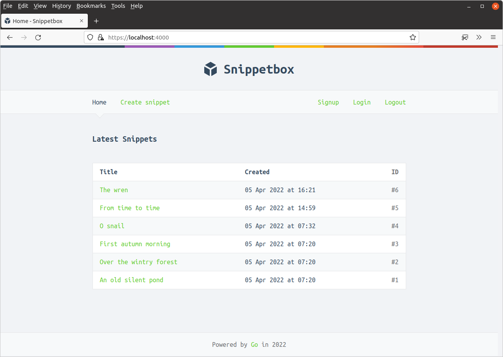
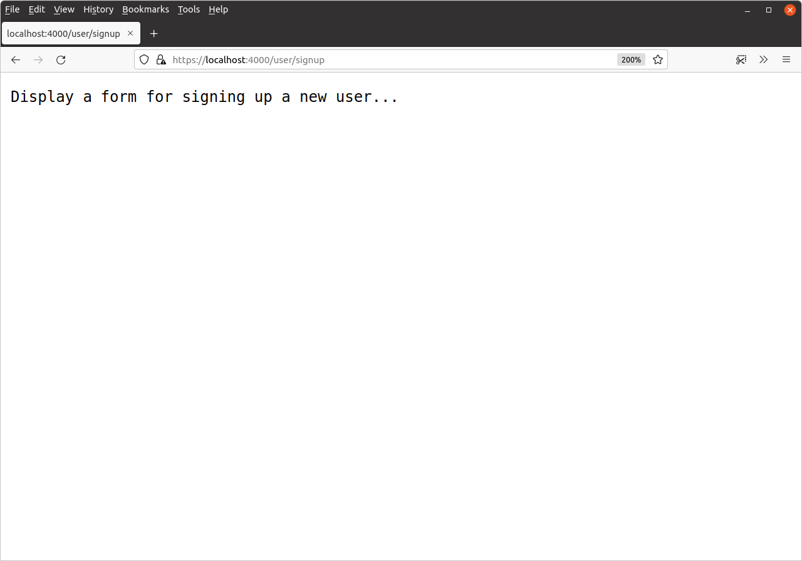

*第 10.1 章。*

## 路由设置

让我们开始本节，向我们的应用程序添加五个新路由，使其看起来像这样：

| 路由模式 | 处理器 | 行动 |
| --- | --- | --- |
| GET /{$} | home | 显示主页 |
| GET /snippet/view/{id} | snippetView | 显示特定片段 |
| GET /snippet/create | snippetCreate | 显示用于创建新片段的表单 |
| POST /snippet/create | snippetCreatePost | 创建一个新片段 |
| GET /user/signup | userSignup | **显示用于注册新用户的表单** |
| POST /user/signup | userSignupPost | **创建新用户** |
| GET /user/login | userLogin | **显示用于登录用户的表单** |
| POST /user/login | userLoginPost | **验证并登录用户** |
| POST /user/logout | userLogoutPost | **注销用户** |
| GET /static/ | http.FileServer | 提供特定的静态文件 |

请注意，新的状态更改处理器 - `userSignupPost`、`userLoginPost` 和 `userLogoutPost` - 均使用 `POST` 请求，而不是 `GET`。

如果您按照步骤操作，请打开 `handlers.go` 文件并为五个新处理函数添加占位符，如下所示：

*文件：cmd/web/handlers.go*

```go
package main

...

func (app *application) userSignup(w http.ResponseWriter, r *http.Request) {
    fmt.Fprintln(w, "Display a form for signing up a new user...")
}

func (app *application) userSignupPost(w http.ResponseWriter, r *http.Request) {
    fmt.Fprintln(w, "Create a new user...")
}

func (app *application) userLogin(w http.ResponseWriter, r *http.Request) {
    fmt.Fprintln(w, "Display a form for logging in a user...")
}

func (app *application) userLoginPost(w http.ResponseWriter, r *http.Request) {
    fmt.Fprintln(w, "Authenticate and login the user...")
}

func (app *application) userLogoutPost(w http.ResponseWriter, r *http.Request) {
    fmt.Fprintln(w, "Logout the user...")
}
```

完成后，我们在 `routes.go` 文件中创建相应的路由：

*文件：cmd/web/routes.go*

```go
package main

...

func (app *application) routes() http.Handler {
    mux := http.NewServeMux()

    fileServer := http.FileServer(http.Dir("./ui/static/"))
    mux.Handle("GET /static/", http.StripPrefix("/static", fileServer))

    dynamic := alice.New(app.sessionManager.LoadAndSave)

    mux.Handle("GET /{$}", dynamic.ThenFunc(app.home))
    mux.Handle("GET /snippet/view/{id}", dynamic.ThenFunc(app.snippetView))
    mux.Handle("GET /snippet/create", dynamic.ThenFunc(app.snippetCreate))
    mux.Handle("POST /snippet/create", dynamic.ThenFunc(app.snippetCreatePost))

    // Add the five new routes, all of which use our 'dynamic' middleware chain.
    mux.Handle("GET /user/signup", dynamic.ThenFunc(app.userSignup))
    mux.Handle("POST /user/signup", dynamic.ThenFunc(app.userSignupPost))
    mux.Handle("GET /user/login", dynamic.ThenFunc(app.userLogin))
    mux.Handle("POST /user/login", dynamic.ThenFunc(app.userLoginPost))
    mux.Handle("POST /user/logout", dynamic.ThenFunc(app.userLogoutPost))

    standard := alice.New(app.recoverPanic, app.logRequest, commonHeaders)
    return standard.Then(mux)
}
```

最后，我们还需要更新 `nav.tmpl` 部分以包含新页面的导航项：

*文件：ui/html/partials/nav.tmpl*

```html
{{define "nav"}}
<nav>
    <div>
        <a href='/'>Home</a>
        <a href='/snippet/create'>Create snippet</a>
    </div>
    <div>
        <a href='/user/signup'>Signup</a>
        <a href='/user/login'>Login</a>
        <form action='/user/logout' method='POST'>
            <button>Logout</button>
        </form>
    </div>
</nav>
{{end}}
```

如果您愿意，您可以在此时运行应用程序，您应该会在导航栏中看到如下新项目：



如果您单击新链接，它们应该使用相关占位符纯文本响应进行响应。例如，如果您单击“注册”链接，您应该会看到类似于以下内容的响应：


