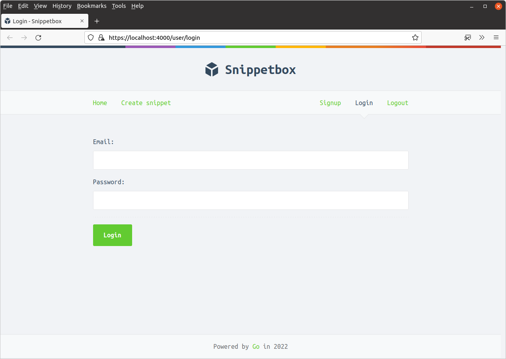
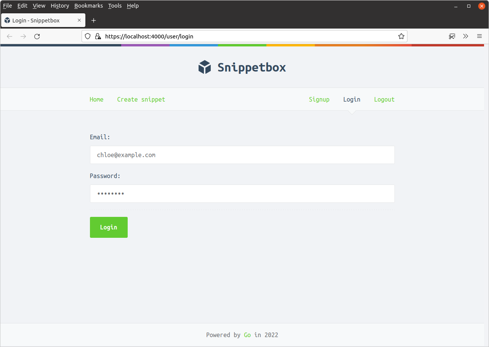
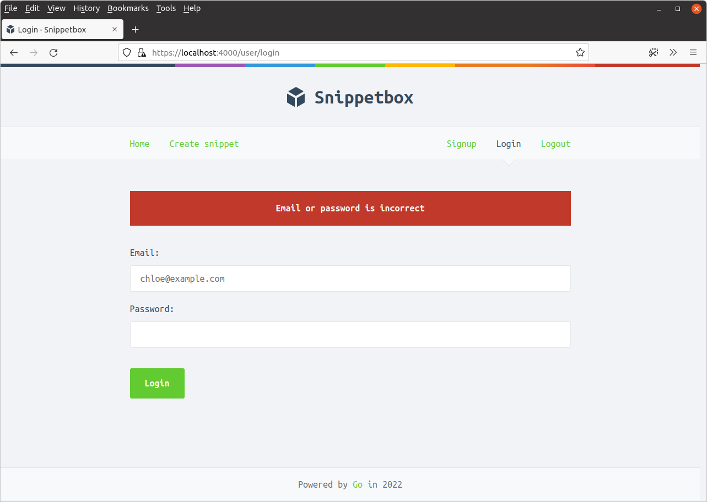
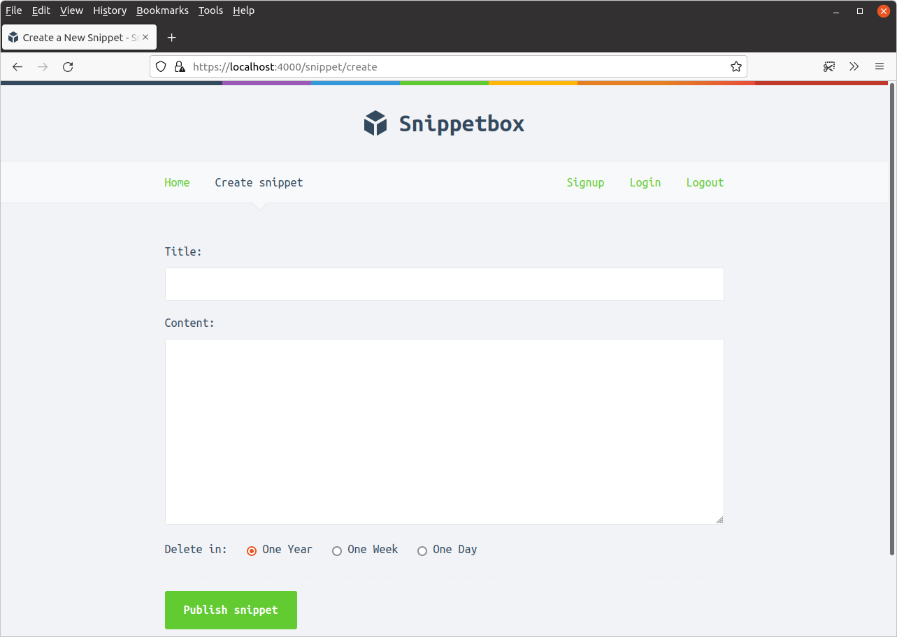

*第 10.4 章。*

## 用户登录

在本章中，我们将重点关注为我们的应用程序创建用户登录页面。

在我们进入这项工作的主要部分之前，让我们快速回顾一下我们之前制作的 `internal/validator` 包，并更新它以支持与一个特定表单字段* 不相关的验证错误 *。

如果用户登录失败，我们将在本章稍后使用此信息向用户显示通用的“*您的电子邮件地址或密码错误”*消息，因为这被认为比明确指示登录失败的原因[更安全](https://cheatsheetseries.owasp.org/cheatsheets/Authentication_Cheat_Sheet.html#authentication-responses)。

请继续更新您的 `internal/validator/validator.go` 文件，如下所示：

*文件：internal/validator/validator.go*

```go
package validator

...

// Add a new NonFieldErrors []string field to the struct, which we will use to 
// hold any validation errors which are not related to a specific form field.
type Validator struct {
    NonFieldErrors []string
    FieldErrors    map[string]string
}

// Update the Valid() method to also check that the NonFieldErrors slice is
// empty.
func (v *Validator) Valid() bool {
    return len(v.FieldErrors) == 0 && len(v.NonFieldErrors) == 0
}

// Create an AddNonFieldError() helper for adding error messages to the new
// NonFieldErrors slice.
func (v *Validator) AddNonFieldError(message string) {
    v.NonFieldErrors = append(v.NonFieldErrors, message)
}

...
```

接下来，我们创建一个新的 `ui/html/pages/login.tmpl` 模板，其中包含登录页面的标记。我们将遵循相同的模式来显示验证错误并重新显示我们用于注册页面的数据。

```bash
$ touch ui/html/pages/login.tmpl
```

*文件：ui/html/pages/login.tmpl*

```html
{{define "title"}}Login{{end}}

{{define "main"}}
<form action='/user/login' method='POST' novalidate>
    <!-- Notice that here we are looping over the NonFieldErrors and displaying
    them, if any exist -->
    {{range .Form.NonFieldErrors}}
        <div class='error'>{{.}}</div>
    {{end}}
    <div>
        <label>Email:</label>
        {{with .Form.FieldErrors.email}}
            <label class='error'>{{.}}</label>
        {{end}}
        <input type='email' name='email' value='{{.Form.Email}}'>
    </div>
    <div>
        <label>Password:</label>
        {{with .Form.FieldErrors.password}}
            <label class='error'>{{.}}</label>
        {{end}}
        <input type='password' name='password'>
    </div>
    <div>
        <input type='submit' value='Login'>
    </div>
</form>
{{end}}
```

然后，让我们前往 `cmd/web/handlers.go` 文件并创建一个新的 `userLoginForm` 结构（用于表示和保存表单数据），并调整我们的 `userLogin` 处理器来呈现登录页面。

就像这样：

*文件：cmd/web/handlers.go*

```go
package main

...

// Create a new userLoginForm struct.
type userLoginForm struct {
    Email               string `form:"email"`
    Password            string `form:"password"`
    validator.Validator `form:"-"`
}

// Update the handler so it displays the login page.
func (app *application) userLogin(w http.ResponseWriter, r *http.Request) {
    data := app.newTemplateData(r)
    data.Form = userLoginForm{}
    app.render(w, r, http.StatusOK, "login.tmpl", data)
}

...
```

如果您运行应用程序并访问 [`https://localhost:4000/user/login`](https://localhost:4000/user/login)，您现在应该看到如下所示的登录页面：



### 验证用户详细信息

接下来是有趣的部分：*我们如何验证用户提交的电子邮件和密码是否正确？*

该验证逻辑的核心部分将发生在我们用户模型的 `UserModel.Authenticate()` 方法中。具体来说，我们需要它来做两件事：

1. 首先，它应该从我们的 MySQL `users` 表中检索与电子邮件地址关联的哈希密码。如果数据库中不存在该电子邮件，我们将返回之前创建的 `ErrInvalidCredentials` 错误。
2. 否则，我们希望将 `users` 表中的哈希密码与用户登录时提供的纯文本密码进行比较。如果它们不匹配，我们希望再次返回 `ErrInvalidCredentials` 错误。但如果它们匹配，我们希望从数据库返回用户的 `id` 值。

我们就这么做吧。继续将以下代码添加到您的 `internal/models/users.go` 文件中：

*文件：internal/models/users.go*

```go
package models

...

func (m *UserModel) Authenticate(email, password string) (int, error) {
    // Retrieve the id and hashed password associated with the given email. If
    // no matching email exists we return the ErrInvalidCredentials error.
    var id int
    var hashedPassword []byte

    stmt := "SELECT id, hashed_password FROM users WHERE email = ?"

    err := m.DB.QueryRow(stmt, email).Scan(&id, &hashedPassword)
    if err != nil {
        if errors.Is(err, sql.ErrNoRows) {
            return 0, ErrInvalidCredentials
        } else {
            return 0, err
        }
    }

    // Check whether the hashed password and plain-text password provided match.
    // If they don't, we return the ErrInvalidCredentials error.
    err = bcrypt.CompareHashAndPassword(hashedPassword, []byte(password))
    if err != nil {
        if errors.Is(err, bcrypt.ErrMismatchedHashAndPassword) {
            return 0, ErrInvalidCredentials
        } else {
            return 0, err
        }
    }

    // Otherwise, the password is correct. Return the user ID.
    return id, nil
}
```

我们的下一步涉及更新 `userLoginPost` 处理器，以便它解析提交的登录表单数据并调用此 `UserModel.Authenticate()` 方法。

如果登录详细信息有效，那么我们希望将用户的 `id` 添加到他们的会话数据中，以便 - 对于将来的请求 - 我们知道他们已成功通过身份验证以及他们是哪个用户。

转到您的 `handlers.go` 文件并按如下方式更新：

*文件：cmd/web/handlers.go*

```go
package main

...

func (app *application) userLoginPost(w http.ResponseWriter, r *http.Request) {
    // Decode the form data into the userLoginForm struct.
    var form userLoginForm

    err := app.decodePostForm(r, &form)
    if err != nil {
        app.clientError(w, http.StatusBadRequest)
        return
    }

    // Do some validation checks on the form. We check that both email and
    // password are provided, and also check the format of the email address as
    // a UX-nicety (in case the user makes a typo).
    form.CheckField(validator.NotBlank(form.Email), "email", "This field cannot be blank")
    form.CheckField(validator.Matches(form.Email, validator.EmailRX), "email", "This field must be a valid email address")
    form.CheckField(validator.NotBlank(form.Password), "password", "This field cannot be blank")

    if !form.Valid() {
        data := app.newTemplateData(r)
        data.Form = form
        app.render(w, r, http.StatusUnprocessableEntity, "login.tmpl", data)
        return
    }

    // Check whether the credentials are valid. If they're not, add a generic
    // non-field error message and re-display the login page.
    id, err := app.users.Authenticate(form.Email, form.Password)
    if err != nil {
        if errors.Is(err, models.ErrInvalidCredentials) {
            form.AddNonFieldError("Email or password is incorrect")

            data := app.newTemplateData(r)
            data.Form = form
            app.render(w, r, http.StatusUnprocessableEntity, "login.tmpl", data)
        } else {
            app.serverError(w, r, err)
        }
        return
    }

    // Use the RenewToken() method on the current session to change the session
    // ID. It's good practice to generate a new session ID when the 
    // authentication state or privilege levels changes for the user (e.g. login
    // and logout operations).
    err = app.sessionManager.RenewToken(r.Context())
    if err != nil {
        app.serverError(w, r, err)
        return
    }

    // Add the ID of the current user to the session, so that they are now
    // 'logged in'.
    app.sessionManager.Put(r.Context(), "authenticatedUserID", id)

    // Redirect the user to the create snippet page.
    http.Redirect(w, r, "/snippet/create", http.StatusSeeOther)
}

...
```

> **注意：** 我们在上面的代码中使用的 [`SessionManager.RenewToken()`](https://pkg.go.dev/github.com/alexedwards/scs/v2#SessionManager.RenewToken) 方法将更改当前用户会话的 ID *，但保留与会话相关的任何数据*。最好在登录前执行此操作，以降低会话固定攻击的风险。有关这方面的更多背景和信息，请参阅 [OWASP 会话管理备忘单](https://github.com/OWASP/CheatSheetSeries/blob/master/cheatsheets/Session_Management_Cheat_Sheet.md#renew-the-session-id-after-any-privilege-level-change)。

好吧，让我们尝试一下！

重新启动应用程序并尝试提交一些无效的用户凭据...



您应该收到一条非字段验证错误消息，如下所示：



但是，当您输入一些正确的凭据（使用您在上一章中创建的用户的电子邮件地址和密码）时，应用程序应该让您登录并将您重定向到创建片段页面，如下所示：




我们在最后两章中已经介绍了很多内容，所以让我们快速回顾一下事情的进展情况。

- 用户现在可以使用 `GET /user/signup` 表单在网站上*注册*。我们将注册用户的详细信息（包括其密码的哈希版本）存储在数据库的 `users` 表中。
- 然后，注册用户可以使用 `GET /user/login` 表单提供其电子邮件地址和密码来*进行身份验证*。如果这些与注册用户的详细信息匹配，我们认为他们已成功通过身份验证，并将相关的 `"authenticatedUserID"` 值添加到其会话数据中。
