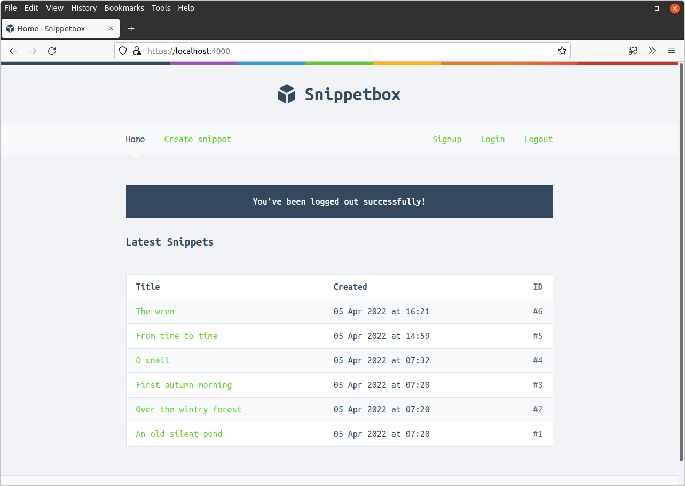

*第 10.5 章。*

## 用户注销

这使我们可以很好地注销用户。与注册和登录相比，实现用户注销非常简单 - 本质上我们需要做的就是从会话中删除 `"authenticatedUserID"` 值。

同时，最好再次更新会话 ID，我们还将在会话数据中添加一条闪存消息，以向用户确认他们已注销。

让我们更新 `userLogoutPost` 处理器来做到这一点。

*文件：cmd/web/handlers.go*

```go
package main

...

func (app *application) userLogoutPost(w http.ResponseWriter, r *http.Request) {
    // Use the RenewToken() method on the current session to change the session
    // ID again.
    err := app.sessionManager.RenewToken(r.Context())
    if err != nil {
        app.serverError(w, r, err)
        return
    }

    // Remove the authenticatedUserID from the session data so that the user is
    // 'logged out'.
    app.sessionManager.Remove(r.Context(), "authenticatedUserID")

    // Add a flash message to the session to confirm to the user that they've been
    // logged out.
    app.sessionManager.Put(r.Context(), "flash", "You've been logged out successfully!")

    // Redirect the user to the application home page.
    http.Redirect(w, r, "/", http.StatusSeeOther)
}
```

保存文件并重新启动应用程序。如果您现在单击导航栏中的“注销”链接，您应该注销并重定向到主页，如下所示：


