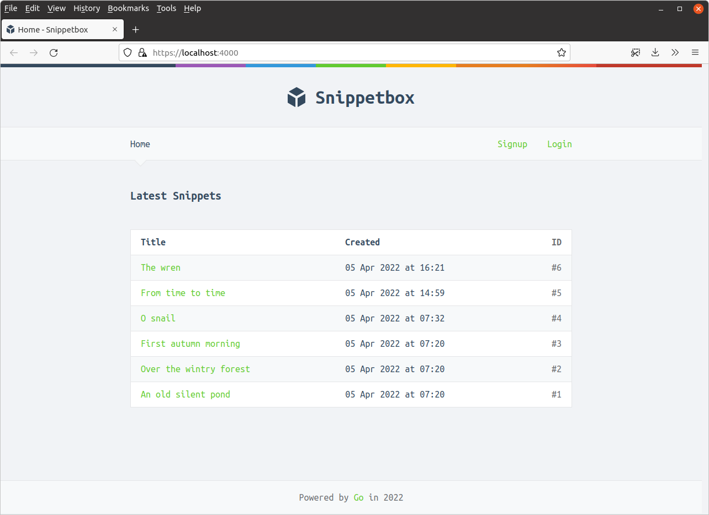
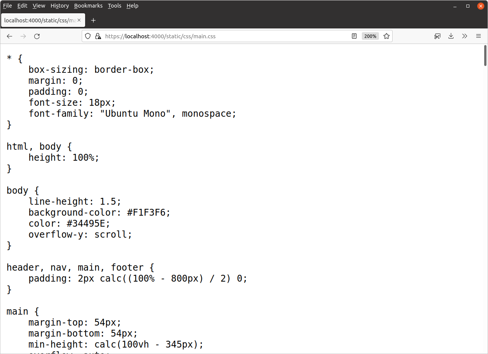

*第 12.1 章。*

## 嵌入静态文件

如果您按照步骤操作，首先要做的就是创建一个新的 `ui/efs.go` 文件：

```bash
$ touch ui/efs.go
```

然后添加以下代码：

*文件：ui/efs.go*

```go
package ui

import (
    "embed"
)

//go:embed "static"
var Files embed.FS
```

这里重要的一行是 `//go:embed "static"`。

这看起来像一条注释，但实际上是一个特殊的*注释指令*。当我们的应用程序被编译时（作为 `go build` 或 `go run` 的一部分），此注释指令指示 Go 将 `ui/static` 文件夹中的文件存储在全局变量 `Files` 引用的 *嵌入式文件系统* 中。

我们需要解释一些关于此的重要细节。

- 注释指令必须放置在 *紧邻* 要存储嵌入文件的变量上方。
- 该指令的格式为 `go:embed "<path>"`。该路径相对于包含该指令的 `.go` 文件，因此 - 在我们的例子中 - `go:embed "static"` 嵌入了我们项目中的目录 `ui/static`。
- 您只能在包级别的全局变量上使用 `go:embed` 指令，而不能在函数或方法中使用。如果您尝试在函数或方法中使用它，您将在编译时收到错误 `"go:embed cannot apply to var inside func"`。
- 路径不能包含 `.` 或 `..` 元素，也不能以 `/` 开头或结尾。这本质上限制您只能嵌入与包含 `go:embed` 指令的 `.go` 文件位于同一目录中的文件或目录。
- 嵌入式文件系统 *始终* 以包含 `go:embed` 指令的目录为根。因此，在上面的示例中，我们的 `Files` 变量包含 [`embed.FS`](https://pkg.go.dev/embed/#FS) 嵌入式文件系统，该文件系统的根目录是我们的 `ui` 目录。

### 使用嵌入的静态文件

现在让我们切换我们的应用程序，以便它从嵌入式文件系统提供静态 CSS、JavaScript 和图像文件，而不是在运行时从磁盘读取它们。

打开您的 `cmd/web/routes.go` 文件并按如下方式更新：

*文件：cmd/web/routes.go*

```go
package main

import (
    "net/http"

    "snippetbox.alexedwards.net/ui" // New import

    "github.com/justinas/alice"
)

func (app *application) routes() http.Handler {
     mux := http.NewServeMux()

    // Use the http.FileServerFS() function to create a HTTP handler which 
    // serves the embedded files in ui.Files. It's important to note that our 
    // static files are contained in the "static" folder of the ui.Files
    // embedded filesystem. So, for example, our CSS stylesheet is located at
    // "static/css/main.css". This means that we no longer need to strip the
    // prefix from the request URL -- any requests that start with /static/ can
    // just be passed directly to the file server and the corresponding static
    // file will be served (so long as it exists).
    mux.Handle("GET /static/", http.FileServerFS(ui.Files))

    dynamic := alice.New(app.sessionManager.LoadAndSave, noSurf, app.authenticate)

    mux.Handle("GET /{$}", dynamic.ThenFunc(app.home))
    mux.Handle("GET /snippet/view/{id}", dynamic.ThenFunc(app.snippetView))
    mux.Handle("GET /user/signup", dynamic.ThenFunc(app.userSignup))
    mux.Handle("POST /user/signup", dynamic.ThenFunc(app.userSignupPost))
    mux.Handle("GET /user/login", dynamic.ThenFunc(app.userLogin))
    mux.Handle("POST /user/login", dynamic.ThenFunc(app.userLoginPost))

    protected := dynamic.Append(app.requireAuthentication)

    mux.Handle("GET /snippet/create", protected.ThenFunc(app.snippetCreate))
    mux.Handle("POST /snippet/create", protected.ThenFunc(app.snippetCreatePost))
    mux.Handle("POST /user/logout", protected.ThenFunc(app.userLogoutPost))

    standard := alice.New(app.recoverPanic, app.logRequest, commonHeaders)
    return standard.Then(mux)
}
```

如果保存这些更改然后重新启动应用程序，您应该会发现一切都正确编译并运行。当您在浏览器中访问 [`https://localhost:4000`](https://localhost:4000/) 时，静态文件应该由嵌入式文件系统提供，并且一切看起来都应该正常。



如果需要，您还可以直接导航到静态文件以检查它们是否仍然可用。例如，访问 [`https://localhost:4000/static/css/main.css`](https://localhost:4000/static/css/main.css) 应显示嵌入式文件系统中网页的 CSS 样式表。



---

### 补充说明

#### 多条路径

在一个嵌入指令中指定多个路径是完全可以的。例如，我们可以单独嵌入 `ui/static/css`、`ui/static/img` 和 `ui/static/js` 目录，如下所示：

```go
//go:embed "static/css" "static/img" "static/js" 
var Files embed.FS
```

> **重要提示：** 嵌入路径模式中的路径分隔符应始终为正斜杠 `/`，即使在 Windows 计算机上也是如此。

#### 嵌入特定文件

我在本章开头提到过这一点，但嵌入路径有可能指向 *特定文件*。嵌入不仅限于目录。

例如，假设我们的 `ui/static/css` 目录包含一些我们不想嵌入的其他资源，例如 [Sass 或 Less](https://www.keycdn.com/blog/sass-vs-less) 文件。在这种情况下，我们可以只嵌入 `ui/static/css/main.css` 文件，如下所示：

```go
//go:embed "static/css/main.css" "static/img" "static/js" 
var Files embed.FS
```

#### 通配符路径

字符 `*` 可以用作嵌入路径中的“通配符”。继续上面的示例，我们可以重写 embed 指令，以便仅嵌入 `ui/static/css` 下的 `.css` 文件：

```go
//go:embed "static/css/*.css" "static/img" "static/js" 
var Files embed.FS
```

与此相关，如果您使用不带任何限定符的通配符路径 `"*"`，如下所示：

```go
//go:embed "*"
var Files embed.FS
```

...然后它将嵌入当前目录中的所有内容，包括包含嵌入指令本身的 `.go` 文件！大多数时候您不希望这样做，因此更常见的是显式嵌入特定的子目录或文件。

#### 所有前缀

最后，如果路径指向目录，则该目录中的所有文件都会递归嵌入 - *除了* 名称以 `.` 或 `_` 字符开头的文件。如果您也想包含这些文件，那么您应该在路径开头使用 `all:` 前缀。

```go
//go:embed "all:static"
var Files embed.FS
```
