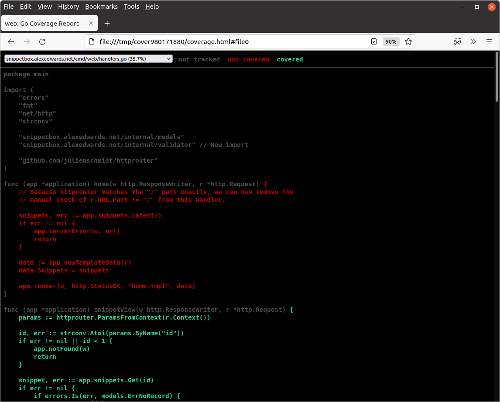
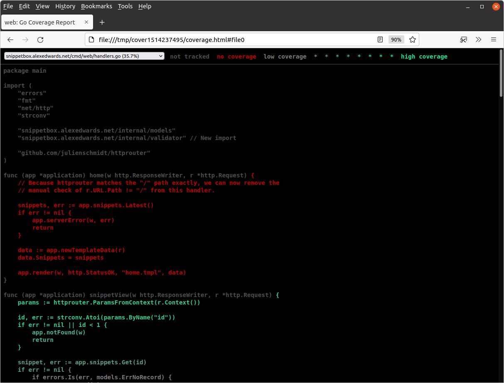

*第 13.8 章。*

## 测试覆盖率分析

`go test` 工具的一个重要功能是它为 *测试覆盖率* 提供的指标和可视化。

继续尝试使用 `-cover` 标志在我们的项目中运行测试，如下所示：

```bash
$ go test -cover ./...
?       snippetbox.alexedwards.net/ui	[no test files]
ok      snippetbox.alexedwards.net/cmd/web	0.013s          coverage: 45.7% of statements
        snippetbox.alexedwards.net/internal/models/mocks    coverage: 0.0% of statements
        snippetbox.alexedwards.net/internal/validator       coverage: 0.0% of statements
        snippetbox.alexedwards.net/internal/assert          coverage: 0.0% of statements
ok      snippetbox.alexedwards.net/internal/models	0.128s  coverage: 11.3% of statements
```

从这里的结果我们可以看到，我们的 `cmd/web` 包中的语句有 46.9% 在我们的测试期间被执行，而对于我们的 `internal/models` 包来说，这个数字是 11.3%。

> **注意：**您的数字可能会略有不同，具体取决于您正在阅读的书籍的确切版本，或者您对代码所做的任何修改。

我们可以通过使用 `-coverprofile` 标志按方法和函数* 获得更详细的测试覆盖率细分，如下所示：

```bash
$ go test -coverprofile=/tmp/profile.out ./...
```

这将正常执行您的测试，如果所有测试都通过，它将向特定位置写入 *覆盖配置文件*。在上面的示例中，我们指示它将配置文件写入 `/tmp/profile.out`。

然后，您可以使用 `go tool cover` 命令查看覆盖率配置文件，如下所示：

```bash
$ go tool cover -func=/tmp/profile.out
snippetbox.alexedwards.net/cmd/web/handlers.go:15:          home                    0.0%
snippetbox.alexedwards.net/cmd/web/handlers.go:31:          snippetView             92.9%
snippetbox.alexedwards.net/cmd/web/handlers.go:62:          snippetCreate           0.0%
snippetbox.alexedwards.net/cmd/web/handlers.go:88:          snippetCreatePost       0.0%
snippetbox.alexedwards.net/cmd/web/handlers.go:131:         userSignup              100.0%
snippetbox.alexedwards.net/cmd/web/handlers.go:137:         userSignupPost          88.5%
snippetbox.alexedwards.net/cmd/web/handlers.go:192:         userLogin               0.0%
snippetbox.alexedwards.net/cmd/web/handlers.go:198:         userLoginPost           0.0%
snippetbox.alexedwards.net/cmd/web/handlers.go:256:         userLogoutPost          0.0%
snippetbox.alexedwards.net/cmd/web/handlers.go:277:         ping                    100.0%
snippetbox.alexedwards.net/cmd/web/helpers.go:17:           serverError             0.0%
snippetbox.alexedwards.net/cmd/web/helpers.go:30:           clientError             100.0%
snippetbox.alexedwards.net/cmd/web/helpers.go:37:           notFound                100.0%
snippetbox.alexedwards.net/cmd/web/helpers.go:41:           render                  58.3%
snippetbox.alexedwards.net/cmd/web/helpers.go:62:           newTemplateData         100.0%
snippetbox.alexedwards.net/cmd/web/helpers.go:73:           decodePostForm          50.0%
snippetbox.alexedwards.net/cmd/web/helpers.go:102:          isAuthenticated         75.0%
snippetbox.alexedwards.net/cmd/web/main.go:35:              main                    0.0%
snippetbox.alexedwards.net/cmd/web/main.go:100:             openDB                  0.0%
snippetbox.alexedwards.net/cmd/web/middleware.go:11:        commonHeaders           100.0%
snippetbox.alexedwards.net/cmd/web/middleware.go:26:        logRequest              100.0%
snippetbox.alexedwards.net/cmd/web/middleware.go:41:        recoverPanic            66.7%
snippetbox.alexedwards.net/cmd/web/middleware.go:61:        requireAuthentication   16.7%
snippetbox.alexedwards.net/cmd/web/middleware.go:83:        noSurf                  100.0%
snippetbox.alexedwards.net/cmd/web/middleware.go:94:        authenticate            38.5%
snippetbox.alexedwards.net/cmd/web/routes.go:12:            routes                  100.0%
snippetbox.alexedwards.net/cmd/web/templates.go:23:         humanDate               100.0%
snippetbox.alexedwards.net/cmd/web/templates.go:40:         newTemplateCache        83.3%
snippetbox.alexedwards.net/internal/models/snippets.go:31:  Insert                  0.0%
snippetbox.alexedwards.net/internal/models/snippets.go:60:  Get                     0.0%
snippetbox.alexedwards.net/internal/models/snippets.go:97:  Latest                  0.0%
snippetbox.alexedwards.net/internal/models/users.go:34:     Insert                  0.0%
snippetbox.alexedwards.net/internal/models/users.go:66:     Authenticate            0.0%
snippetbox.alexedwards.net/internal/models/users.go:98:     Exists                  100.0%
total:                                                      (statements)            38.1%
```

查看覆盖率配置文件的另一种更直观的方法是使用 `-html` 标志而不是 `-func`。

```bash
$ go tool cover -html=/tmp/profile.out
```

这将打开一个浏览器窗口，其中包含代码的可导航且突出显示的表示形式，类似于：



测试期间执行的语句标记为绿色，未执行的语句标记为红色。这使得您可以轻松准确地查看当前测试覆盖了哪些代码（除非您有红绿色盲）。

您可以更进一步，在运行 `go test` 时使用 `-covermode=count` 选项，如下所示：

```bash
$ go test -covermode=count -coverprofile=/tmp/profile.out ./...
$ go tool cover -html=/tmp/profile.out
```

使用 `-covermode=count` 不只是以绿色和红色突出显示语句，而是使覆盖率配置文件记录测试期间每个语句执行的确切 *次数*。

在浏览器中查看时，执行更频繁的语句会以更饱和的绿色阴影显示，类似于：



> **注意：**如果您并行运行一些测试，则应使用 `-covermode=atomic` 标志（而不是 `-covermode=count`）以确保准确计数。
