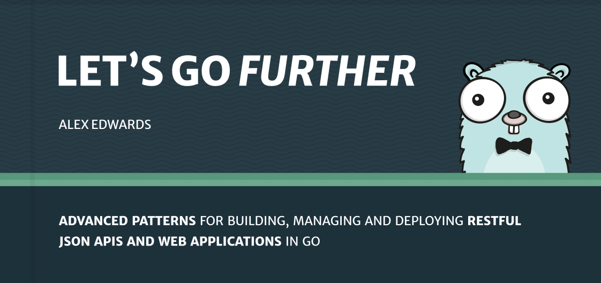

*第14章。*

# 结论

在本书的过程中，我们明确涵盖了许多主题，包括路由、模板、使用数据库、身份验证/授权、使用 HTTPS、使用 Go 的测试包等等。

但也有其他一些更默契的教训。我们用来实现功能的模式——以及我们的项目代码的组织和链接方式——是您应该能够在未来的工作中采用和应用的东西。

重要的是，我还希望这本书传达这样的信息：*你不需要一个框架来在 Go 中构建 Web 应用程序*。 Go 的标准库几乎包含您需要的所有工具……即使对于中等复杂的应用程序也是如此。当您确实需要特定任务的帮助时（例如会话管理、CSRF 缓解或密码散列），您可以使用轻量级且专注的第三方软件包。

此时，如果您已经按照本书进行了编码，我建议您花一些时间来回顾一下您迄今为止编写的代码。当您浏览它时，请确保您清楚地了解代码库的每个部分的作用以及它如何与整个项目相适应。

您可能还想回顾一下本书中您第一次发现难以理解的任何部分。例如，现在您对 Go 更加熟悉了，[`http.Handler` 接口](02.10-the-http-handler-interface.md) 章节可能更容易理解。或者，既然您已经了解了我们的应用程序中如何处理测试，那么我们在[设计数据库模型](04.05-designing-a-database-model.md)一章中做出的决定可能会落实到位。

如果您购买了本书的 *专业包* 版本，那么我强烈建议您完成第 16 章中的指导练习（就在本书的最后，在这个结论之后）。这些练习应该有助于巩固您所学到的知识，并且半独立地完成它们将使您在在自己的项目中再次使用它们之前对本书中的模式和技术进行一些额外的练习。

### 让我们走得更远

如果您想继续了解更多信息，那么您可能需要查看[让我们进一步了解](https://lets-go-further.alexedwards.net/)。它是本书的后续内容，涵盖了用于开发、管理和部署 API 和 Web 应用程序的更高级模式。

它指导您完成 RESTful JSON API 的整个构建和部署，包括以下主题：

- 发送和接收 JSON
- 使用 SQL 迁移
- 管理后台任务
- 执行部分更新并使用乐观锁定
- 基于权限的授权
- 控制 CORS 请求
- 优雅的关闭
- 公开应用程序指标
- 自动化构建和部署步骤

您可以在 [https://lets-go-further.alexedwards.net](https://lets-go-further.alexedwards.net) 上查看本书的样本，并获取更多信息和常见问题解答。

> 作为送给 *Let's Go* 读者的小礼物，您还可以在结帐时使用折扣代码 **FURTHER15** 享受常规标价 **15% 的折扣**。
