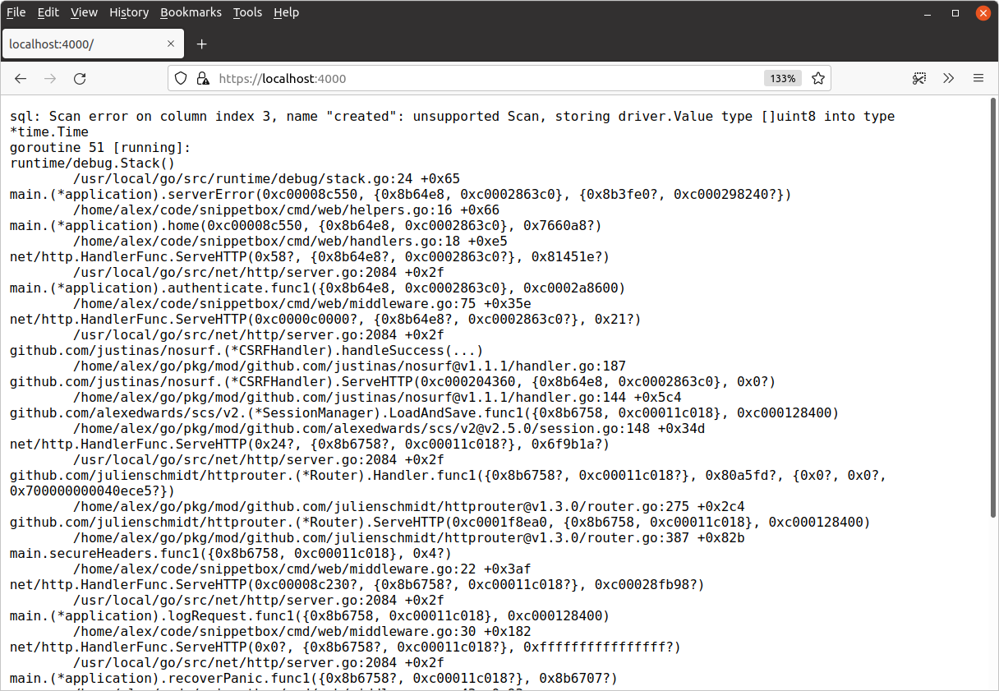

*第 16.2 章。*

## 添加调试模式

如果您使用过其他语言的 Web 框架，例如 Django 或 Laravel，那么您可能熟悉“调试”模式的概念，其中详细的错误在 HTTP 响应中显示给用户，而不是通用的 `"Internal Server Error"` 消息。

本练习的目标是为我们的应用程序设置类似的“调试模式”，可以通过使用 `-debug` 标志来启用该模式，如下所示：

```bash
$ go run ./cmd/web -debug
```

在调试模式下运行时，任何详细的错误和堆栈跟踪都应显示在浏览器中，类似于以下内容：



#### 步骤1

创建一个名为 `debug` 的新命令行标志，默认值为 `false`。然后通过 `application` 结构将此命令行标志中的值提供给处理器。

提示：`flag.Bool()` 函数最适合此任务。

[显示建议的代码](#17.02-suggested-code-for-step-1)

#### 步骤2

转到 `cmd/web/helpers.go` 文件并更新 `serverError()` 帮助程序，以便当且仅当 `debug` 标志已设置时，它才会在 HTTP 响应中呈现详细的错误消息和堆栈跟踪。否则，照常发送一般错误消息。您可以使用 `debug.Stack()` 函数获取堆栈跟踪。

[显示建议的代码](#17.02-suggested-code-for-step-2)

#### 步骤3

尝试一下改变。运行应用程序并使用不带* 参数的 DSN *强制出现运行时错误：

```bash
$ go run ./cmd/web/ -debug -dsn=web:pass@/snippetbox
```

访问 [`https://localhost:4000/`](https://localhost:4000/) 应该会得到如下响应：


*在没有*`-debug`标志的情况下再次运行应用程序应该会产生通用`"Internal Server Error"`消息。

### 建议代码

#### 步骤 1 的建议代码

*文件：cmd/web/main.go*

```go
package main

...

type application struct {
    debug          bool // Add a new debug field.
    logger        *slog.Logger
    snippets       models.SnippetModelInterface
    users          models.UserModelInterface
    templateCache  map[string]*template.Template
    formDecoder    *form.Decoder
    sessionManager *scs.SessionManager
}

func main() {
    addr := flag.String("addr", ":4000", "HTTP network address")
    dsn := flag.String("dsn", "web:pass@/snippetbox?parseTime=true", "MySQL data source name")
    // Create a new debug flag with the default value of false.
    debug := flag.Bool("debug", false, "Enable debug mode")
    flag.Parse()

    logger := slog.New(slog.NewTextHandler(os.Stdout, nil))

    db, err := openDB(*dsn)
    if err != nil {
        logger.Error(err.Error())
        os.Exit(1)
    }
    defer db.Close()

    templateCache, err := newTemplateCache()
    if err != nil {
        logger.Error(err.Error())
        os.Exit(1)
    }

    formDecoder := form.NewDecoder()

    sessionManager := scs.New()
    sessionManager.Store = mysqlstore.New(db)
    sessionManager.Lifetime = 12 * time.Hour
    sessionManager.Cookie.Secure = true

    app := &application{
        debug:          *debug, // Add the debug flag value to the application struct.
        logger:         logger,
        snippets:       &models.SnippetModel{DB: db},
        users:          &models.UserModel{DB: db},
        templateCache:  templateCache,
        formDecoder:    formDecoder,
        sessionManager: sessionManager,
    }

    tlsConfig := &tls.Config{
        CurvePreferences: []tls.CurveID{tls.X25519, tls.CurveP256},
    }

    srv := &http.Server{
        Addr:         *addr,
        Handler:      app.routes(),
        ErrorLog:     slog.NewLogLogger(logger.Handler(), slog.LevelError),
        TLSConfig:    tlsConfig,
        IdleTimeout:  time.Minute,
        ReadTimeout:  5 * time.Second,
        WriteTimeout: 10 * time.Second,
    }

    logger.Info("starting server", "addr", srv.Addr)

    err = srv.ListenAndServeTLS("./tls/cert.pem", "./tls/key.pem")
    logger.Error(err.Error())
    os.Exit(1)
}

...
```

#### 步骤 2 的建议代码

*文件：cmd/web/helpers.go*

```go

...

func (app *application) serverError(w http.ResponseWriter, r *http.Request, err error) {
    var (
        method = r.Method
        uri    = r.URL.RequestURI()
        trace  = string(debug.Stack())
    )

    app.logger.Error(err.Error(), "method", method, "uri", uri)

    if app.debug {
        body := fmt.Sprintf("%s\n%s", err, trace)
        http.Error(w, body, http.StatusInternalServerError)
        return
    }

    http.Error(w, http.StatusText(http.StatusInternalServerError), http.StatusInternalServerError)
}

...
```
