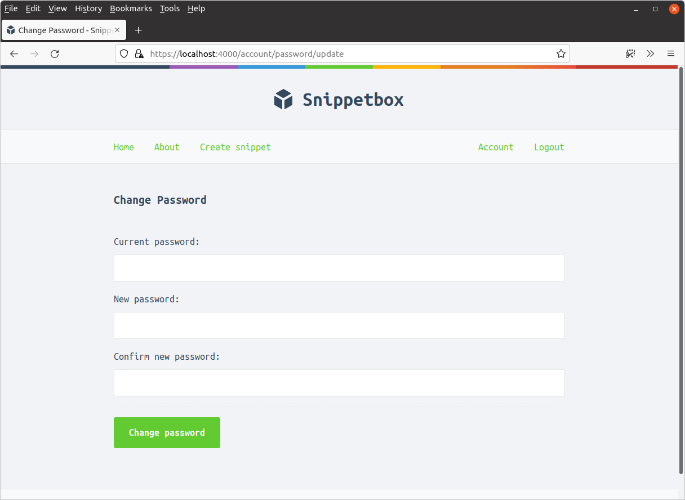
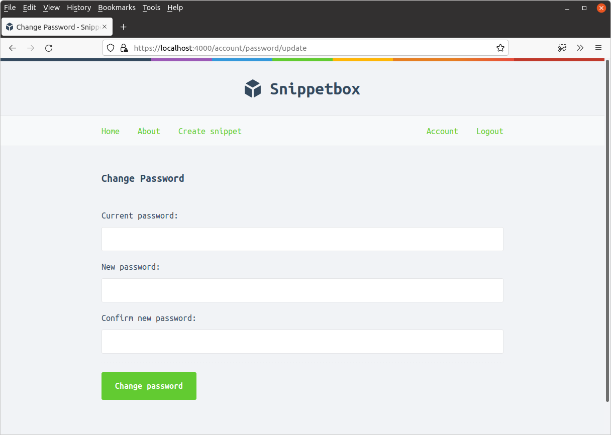
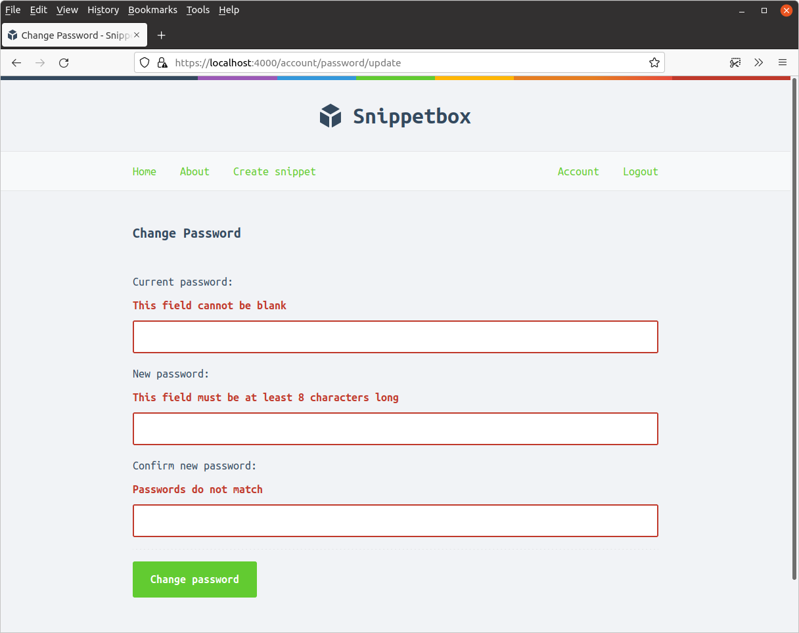
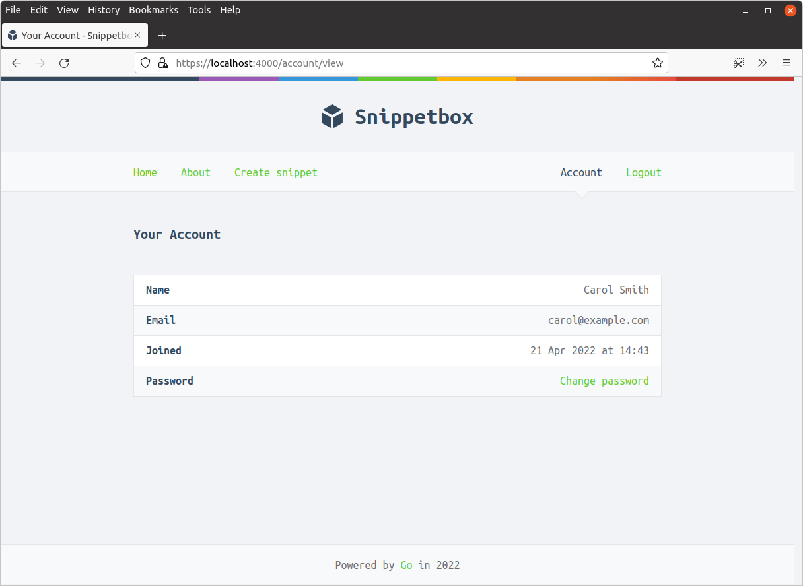

*第 16.6 章。*

## 实施“更改密码”功能

您在本练习中的目标是为经过身份验证的用户添加更改密码的功能，使用类似于以下形式的表单：



在此练习中，您应该确保：

- 询问用户当前的密码，并验证它是否与 `users` 表中的哈希密码匹配（以确认确实是他们发出的请求）。
- 在更新 `users` 表之前对新密码进行哈希处理。

#### 步骤1

创建两个新的路由和处理器：

- `GET /account/password/update` 映射到新的 `accountPasswordUpdate` 处理器。
- `POST /account/password/update` 映射到新的 `accountPasswordUpdatePost` 处理器。

两条路由都应仅限于经过身份验证的用户。

[显示建议的代码](#17.06-suggested-code-for-step-1)

#### 步骤2

创建一个新的 `ui/html/pages/password.tmpl` 文件，其中包含更改密码表单。该表单应：

- 具有三个字段：`currentPassword`、`newPassword` 和 `newPasswordConfirmation`。
- 提交时将 `POST` 表单数据发送至 `/account/password/update`。
- 如果出现验证错误，则显示每个字段的错误。
- 出现验证错误时不重新显示密码。

提示：您可能想使用我们在用户注册表单上所做的工作作为此处的指南。

然后更新 `cmd/web/handlers.go` 文件以包含一个新的 `accountPasswordUpdateForm` 结构，您可以将表单数据解析为该结构，并更新 `accountPasswordUpdate` 处理器以显示此空表单。

当您以经过身份验证的用户身份访问 [`https://localhost:4000/account/password/update`](https://localhost:4000/account/password/update) 时，它应该类似于以下内容：



[显示建议的代码](#17.06-suggested-code-for-step-2)

#### 步骤3

更新 `accountPasswordUpdatePost` 处理器以执行以下表单验证检查，并在发生任何失败时重新显示带有相关错误消息的表单。

- 所有三个字段都是必需的。
- `newPassword` 值的长度必须至少为 8 个字符。
- `newPassword` 和 `newPasswordConfirmation` 值必须匹配。



[显示建议的代码](#17.06-suggested-code-for-step-3)

#### 步骤4

在您的 `internal/models/users.go` 文件中创建一个具有以下签名的新 `UserModel.PasswordUpdate()` 方法：

```go
func (m *UserModel) PasswordUpdate(id int, currentPassword, newPassword string) error
```

在这个方法中：

1. 从数据库中检索具有 `id` 参数指定 ID 的用户的用户详细信息。
2. 检查 `currentPassword` 值是否与用户的哈希密码匹配。如果不匹配，则返回 `ErrInvalidCredentials` 错误。
3. 否则，对 `newPassword` 值进行哈希处理并更新相关用户的 `users` 表中的 `hashed_password` 列。

还要更新 `UserModelInterface` 接口类型以包含您刚刚创建的 `PasswordUpdate()` 方法。

[显示建议的代码](#17.06-suggested-code-for-step-4)

#### 步骤5

更新 `accountPasswordUpdatePost` 处理器，以便如果表单有效，它会调用 `UserModel.PasswordUpdate()` 方法（请记住，用户的 ID 应位于会话数据中）。

如果出现 `models.ErrInvalidCredentials` 错误，请通知用户他们在 `currentPassword` 表单字段中输入了错误的值。否则，向用户会话添加一条闪现消息，表明其密码已成功更改，并将其重定向到其帐户页面。

[显示建议的代码](#17.06-suggested-code-for-step-5)

#### 步骤6

更新帐户以包含更改密码表单的链接，类似于：



[显示建议的代码](#17.06-suggested-code-for-step-6)

#### 步骤7

尝试运行应用程序的测试。您应该会失败，因为 `mocks.UserModel` 类型不再满足 `models.UserModelInterface` 结构中指定的接口。通过向模拟添加适当的 `PasswordUpdate()` 方法来修复此问题并确保测试通过。

[显示建议的代码](#17.06-suggested-code-for-step-7)

### 建议代码

#### 步骤 1 的建议代码

*文件：cmd/web/handlers.go*

```go
package main

...

func (app *application) accountPasswordUpdate(w http.ResponseWriter, r *http.Request) {
    // Some code will go here later...
}

func (app *application) accountPasswordUpdatePost(w http.ResponseWriter, r *http.Request) {
    // Some code will go here later...
}
```

*文件：cmd/web/routes.go*

```go
package main

...

func (app *application) routes() http.Handler {
    mux := http.NewServeMux()

    mux.Handle("GET /static/", http.FileServerFS(ui.Files))

    mux.HandleFunc("GET /ping", ping)

    dynamic := alice.New(app.sessionManager.LoadAndSave, noSurf, app.authenticate)

    mux.Handle("GET /{$}", dynamic.ThenFunc(app.home))
    mux.Handle("GET /about", dynamic.ThenFunc(app.about))
    mux.Handle("GET /snippet/view/{id}", dynamic.ThenFunc(app.snippetView))
    mux.Handle("GET /user/signup", dynamic.ThenFunc(app.userSignup))
    mux.Handle("POST /user/signup", dynamic.ThenFunc(app.userSignupPost))
    mux.Handle("GET /user/login", dynamic.ThenFunc(app.userLogin))
    mux.Handle("POST /user/login", dynamic.ThenFunc(app.userLoginPost))

    protected := dynamic.Append(app.requireAuthentication)

    mux.Handle("GET /snippet/create", protected.ThenFunc(app.snippetCreate))
    mux.Handle("POST /snippet/create", protected.ThenFunc(app.snippetCreatePost))
    mux.Handle("GET /account/view", protected.ThenFunc(app.accountView))
    // Add the two new routes, restricted to authenticated users only.
    mux.Handle("GET /account/password/update", protected.ThenFunc(app.accountPasswordUpdate))
    mux.Handle("POST /account/password/update", protected.ThenFunc(app.accountPasswordUpdatePost))
    mux.Handle("POST /user/logout", protected.ThenFunc(app.userLogoutPost))

    standard := alice.New(app.recoverPanic, app.logRequest, commonHeaders)
    return standard.Then(mux)
}
```

#### 步骤 2 的建议代码

*文件：ui/html/pages/password.tmpl*

```html
{{define "title"}}Change Password{{end}}

{{define "main"}}
<h2>Change Password</h2>
<form action='/account/password/update' method='POST' novalidate>
    <input type='hidden' name='csrf_token' value='{{.CSRFToken}}'>
    <div>
        <label>Current password:</label>
        {{with .Form.FieldErrors.currentPassword}}
            <label class='error'>{{.}}</label>
        {{end}}
        <input type='password' name='currentPassword'>
    </div>
    <div>
        <label>New password:</label>
        {{with .Form.FieldErrors.newPassword}}
            <label class='error'>{{.}}</label>
        {{end}}
        <input type='password' name='newPassword'>
    </div>
    <div>
        <label>Confirm new password:</label>
        {{with .Form.FieldErrors.newPasswordConfirmation}}
            <label class='error'>{{.}}</label>
        {{end}}
        <input type='password' name='newPasswordConfirmation'>
    </div>
    <div>
        <input type='submit' value='Change password'>
    </div>
</form>
{{end}}
```

*文件：cmd/web/handlers.go*

```go
package main

...

type accountPasswordUpdateForm struct {
    CurrentPassword         string `form:"currentPassword"`
    NewPassword             string `form:"newPassword"`
    NewPasswordConfirmation string `form:"newPasswordConfirmation"`
    validator.Validator     `form:"-"`
}

func (app *application) accountPasswordUpdate(w http.ResponseWriter, r *http.Request) {
    data := app.newTemplateData(r)
    data.Form = accountPasswordUpdateForm{}

    app.render(w, r, http.StatusOK, "password.tmpl", data)
}

...
```

#### 步骤 3 的建议代码

*文件：cmd/web/handlers.go*

```go
package main

...

func (app *application) accountPasswordUpdatePost(w http.ResponseWriter, r *http.Request) {
    var form accountPasswordUpdateForm

    err := app.decodePostForm(r, &form)
    if err != nil {
        app.clientError(w, http.StatusBadRequest)
        return
    }

    form.CheckField(validator.NotBlank(form.CurrentPassword), "currentPassword", "This field cannot be blank")
    form.CheckField(validator.NotBlank(form.NewPassword), "newPassword", "This field cannot be blank")
    form.CheckField(validator.MinChars(form.NewPassword, 8), "newPassword", "This field must be at least 8 characters long")
    form.CheckField(validator.NotBlank(form.NewPasswordConfirmation), "newPasswordConfirmation", "This field cannot be blank")
    form.CheckField(form.NewPassword == form.NewPasswordConfirmation, "newPasswordConfirmation", "Passwords do not match")

    if !form.Valid() {
        data := app.newTemplateData(r)
        data.Form = form

        app.render(w, r, http.StatusUnprocessableEntity, "password.tmpl", data)
        return
    }
}
```

#### 步骤 4 的建议代码

*文件：internal/models/users.go*

```go
package models

...

type UserModelInterface interface {
    Insert(name, email, password string) error
    Authenticate(email, password string) (int, error)
    Exists(id int) (bool, error)
    Get(id int) (User, error)
    PasswordUpdate(id int, currentPassword, newPassword string) error
}

...

func (m *UserModel) PasswordUpdate(id int, currentPassword, newPassword string) error {
    var currentHashedPassword []byte

    stmt := "SELECT hashed_password FROM users WHERE id = ?"

    err := m.DB.QueryRow(stmt, id).Scan(&currentHashedPassword)
    if err != nil {
        return err
    }

    err = bcrypt.CompareHashAndPassword(currentHashedPassword, []byte(currentPassword))
    if err != nil {
        if errors.Is(err, bcrypt.ErrMismatchedHashAndPassword) {
            return ErrInvalidCredentials
        } else {
            return err
        }
    }

    newHashedPassword, err := bcrypt.GenerateFromPassword([]byte(newPassword), 12)
    if err != nil {
        return err
    }

    stmt = "UPDATE users SET hashed_password = ? WHERE id = ?"

    _, err = m.DB.Exec(stmt, string(newHashedPassword), id)
    return err
}
```

#### 步骤 5 的建议代码

*文件：cmd/web/handlers.go*

```go
package main

...

func (app *application) accountPasswordUpdatePost(w http.ResponseWriter, r *http.Request) {
    var form accountPasswordUpdateForm

    err := app.decodePostForm(r, &form)
    if err != nil {
        app.clientError(w, http.StatusBadRequest)
        return
    }

    form.CheckField(validator.NotBlank(form.CurrentPassword), "currentPassword", "This field cannot be blank")
    form.CheckField(validator.NotBlank(form.NewPassword), "newPassword", "This field cannot be blank")
    form.CheckField(validator.MinChars(form.NewPassword, 8), "newPassword", "This field must be at least 8 characters long")
    form.CheckField(validator.NotBlank(form.NewPasswordConfirmation), "newPasswordConfirmation", "This field cannot be blank")
    form.CheckField(form.NewPassword == form.NewPasswordConfirmation, "newPasswordConfirmation", "Passwords do not match")

    if !form.Valid() {
        data := app.newTemplateData(r)
        data.Form = form

        app.render(w, r, http.StatusUnprocessableEntity, "password.tmpl", data)
        return
    }

    userID := app.sessionManager.GetInt(r.Context(), "authenticatedUserID")

    err = app.users.PasswordUpdate(userID, form.CurrentPassword, form.NewPassword)
    if err != nil {
        if errors.Is(err, models.ErrInvalidCredentials) {
            form.AddFieldError("currentPassword", "Current password is incorrect")

            data := app.newTemplateData(r)
            data.Form = form

            app.render(w, r, http.StatusUnprocessableEntity, "password.tmpl", data)
        } else {
            app.serverError(w, r, err)
        }
        return
    }

    app.sessionManager.Put(r.Context(), "flash", "Your password has been updated!")

    http.Redirect(w, r, "/account/view", http.StatusSeeOther)
}
```

#### 步骤 6 的建议代码

*文件：ui/html/pages/account.tmpl*

```html
{{define "title"}}Your Account{{end}}

{{define "main"}}
    <h2>Your Account</h2>
    {{with .User}}
     <table>
        <tr>
            <th>Name</th>
            <td>{{.Name}}</td>
        </tr>
        <tr>
            <th>Email</th>
            <td>{{.Email}}</td>
        </tr>
        <tr>
            <th>Joined</th>
            <td>{{humanDate .Created}}</td>
        </tr>
        <tr>
            <!-- Add a link to the change password form -->
            <th>Password</th>
            <td><a href="/account/password/update">Change password</a></td>
        </tr>
    </table>
    {{end }}
{{end}}
```

#### 步骤 7 的建议代码

```bash
$ go test ./...
# snippetbox.alexedwards.net/cmd/web [snippetbox.alexedwards.net/cmd/web.test]
cmd/web/testutils_test.go:48:19: cannot use &mocks.UserModel{} (value of type *mocks.UserModel) as type models.UserModelInterface in struct literal:
        *mocks.UserModel does not implement models.UserModelInterface (missing PasswordUpdate method)
FAIL    snippetbox.alexedwards.net/cmd/web [build failed]
ok      snippetbox.alexedwards.net/internal/models      1.099s
?       snippetbox.alexedwards.net/internal/models/mocks        [no test files]
?       snippetbox.alexedwards.net/internal/validator   [no test files]
?       snippetbox.alexedwards.net/ui   [no test files]
FAIL
```

*文件：internal/models/mock/users.go*

```go
package mocks

...

func (m *UserModel) PasswordUpdate(id int, currentPassword, newPassword string) error {
    if id == 1 {
        if currentPassword != "pa$$word" {
            return models.ErrInvalidCredentials
        }

        return nil
    }

    return models.ErrNoRecord
}
```

```bash
$ go test ./...
ok      snippetbox.alexedwards.net/cmd/web      0.026s
ok      snippetbox.alexedwards.net/internal/models      (cached)
?       snippetbox.alexedwards.net/internal/models/mocks        [no test files]
?       snippetbox.alexedwards.net/internal/validator   [no test files]
?       snippetbox.alexedwards.net/ui   [no test files]
```
