# 《Let's Go》中文版

原著：Alex Edwards

---

<!-- 来源章节：00.00-front-matter.md -->

# 前言


Let's Go 逐步教您如何使用出色的编程语言 [Go](https://golang.org/) 创建快速、安全且可维护的 Web 应用程序。

本书背后的理念是帮助您*边做边学*。我们将一起逐步完成 Web 应用程序的构建 — 从构建工作区，到会话管理、验证用户身份、保护服务器安全和测试应用程序。

以这种方式构建完整的 Web 应用程序有几个好处。它有助于将您正在学习的内容融入到上下文中，它演示了代码库的不同部分如何链接在一起，并且它迫使我们解决在现实生活中编写软件时出现的边缘情况和困难。从本质上讲，您将比仅仅阅读 Go 的（优秀）文档或独立博客文章学到更多。

读完本书后，您将了解并有信心使用 Go 构建自己的生产就绪型 Web 应用程序。

尽管您可以从头到尾阅读这本书，但它是专门设计的，因此您可以自己跟进项目构建。

打开你的文本编辑器，祝你编码愉快！

— 亚历克斯

---

<!-- 来源章节：01.00-introduction.md -->

*第一章。*

# 简介

在本书中，我们将构建一个名为 Snippetbox 的 Web 应用程序，它允许人们粘贴和共享文本片段 - 有点像 [Pastebin](https://pastebin.com/) 或 GitHub 的 [Gists](https://gist.github.com/)。在构建结束时，它看起来有点像这样：

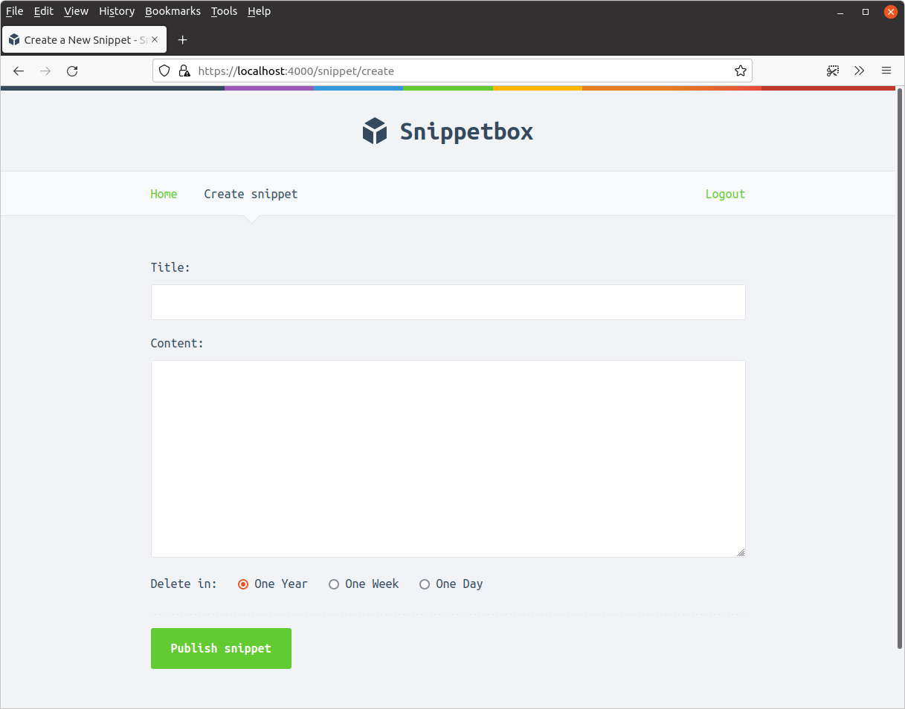

我们的应用程序一开始非常简单，只有一个网页。然后，在每一章中，我们将逐步构建它，直到用户可以通过应用程序保存和查看片段。这将引导我们了解如何构建项目、路由请求、使用数据库、处理表单和安全地显示动态数据等主题。

然后在本书的后面，我们将添加用户帐户，并限制应用程序，以便只有注册用户才能创建代码片段。这将引导我们了解更高级的主题，例如配置 HTTPS 服务器、会话管理、用户身份验证和中间件。

### 惯例

本书中的代码块以银色背景显示，如下例所示。如果代码块特别长，任何不相关的部分都可以用省略号替换。为了便于理解，大多数代码块的顶部都有一个标题栏，指示代码所在文件的名称。如下所示：

*文件：你好.go*

```go
package main

... // Indicates that some existing code has been omitted.

func sayHello() {
    fmt.Println("Hello world!")
}
```

终端（命令行）指令以黑色背景显示，并以美元符号开头。这些命令应该适用于任何基于 Unix 的操作系统，包括 Mac OSX 和 Linux。示例输出在命令下方以银色显示，如下所示：

```bash
$ echo "Hello world!"
Hello world!
```

如果您使用的是 Windows，则应将该命令替换为 DOS 等效命令，或通过正常的 Windows GUI 执行该操作。

请注意，屏幕截图中显示的日期和时间戳以及命令的示例输出仅供说明。它们不一定彼此一致，也不一定按时间顺序贯穿整本书。

本书的某些章节以 *附加信息* 部分结尾。这些部分包含与我们的应用程序构建无关的信息，但了解它们仍然很重要（或者有时只是有趣）。如果您对 Go 非常陌生，您可能想跳过这些部分并稍后再回到它们。

> **提示：**如果您正在构建应用程序，我建议使用本书的 HTML 版本，而不是 PDF 或 EPUB。 HTML 版本适用于所有浏览器，如果您想直接从书中复制和粘贴代码，则可以保留代码块的正确格式。
>
> 使用 HTML 版本时，您还可以使用键盘上的左右箭头键在章节之间导航。

### 关于作者

嘿，我是 Alex Edwards，一位全栈 Web 开发人员和作家。我住在奥地利因斯布鲁克附近。

我已经使用 Go 工作了 10 多年，为自己和商业客户构建生产应用程序，并帮助世界各地的人们提高 Go 技能。

您可以在 [我的博客](https://www.alexedwards.net/blog)（我在其中发布详细教程）上查看我的更多文章，在 [GitHub](https://github.com/alexedwards/) 上查看我的一些开源作品，您还可以在 [Instagram](https://www.instagram.com/ajmedwards/) 和[推特](https://twitter.com/ajmedwards)。

### 版权及免责声明

*Let’s Go：学习使用 Go 构建专业的 Web 应用程序*。版权所有 © 2024 亚历克斯·爱德华兹。

最后更新时间：世界标准时间 2024 年 9 月 25 日 10:28:57。版本 2.23.1。

Go gopher 由 [Renee French](http://reneefrench.blogspot.com/) 设计，并在 Creative Commons 3.0 属性许可下使用。覆盖地鼠改编自 [Egon Elbre](https://github.com/egonelbre/gophers) 的矢量。

*本书中提供的信息仅供一般参考之用。虽然作者和出版商已尽一切努力确保本书中的信息在出版时正确无误，但对于本书中包含的信息、产品、服务或出于任何目的的相关图形的完整性、准确性、可靠性、适用性或可用性，不作任何明示或暗示的陈述或保证。使用此信息的任何风险均由您自行承担。*

---

<!-- 来源章节：01.01-prerequisites.md -->

*第 1.1 章。*

## 前置条件

### 背景知识

本书是为刚接触 Go 的人设计的，但如果您首先对 Go 的语法有一个大致的了解，您可能会发现这本书会更有趣。如果您发现自己在语法上遇到困难，Karl Seguin 的 [Little Book of Go](http://openmymind.net/The-Little-Go-Book/) 是一个很棒的教程，或者如果您想要更具交互性的内容，我建议您阅读 [Go 之旅](https://tour.golang.org/welcome/1)。

我还假设您对 HTML/CSS 和 SQL 有（非常）基本的了解，并且熟悉使用终端（或 Windows 用户的命令行）。如果您之前使用任何其他语言（无论是 Ruby、Python、PHP 还是 C#）构建过 Web 应用程序，那么本书应该非常适合您。

### 去1.23

本书中的信息对于 [Go](https://golang.org/doc/devel/release.html) 最新主要版本（版本 1.23）来说是正确的，如果您想与应用程序构建一起编码，则应该安装它。

如果您已经安装了 Go，您可以使用 `go version` 命令从终端检查版本号。输出应类似于以下内容：

```bash
$ go version
go version go1.23.0 linux/amd64
```

如果您需要升级 Go 版本 - 或从头开始安装 Go - 那么请立即执行此操作。不同操作系统的详细说明可以在这里找到：

- [删除旧版本的 Go](https://golang.org/doc/manage-install#uninstalling)
- [在 Mac OS X 上安装 Go](https://golang.org/doc/install#tarball)
- [在 Windows 上安装 Go](https://golang.org/doc/install#windows)
- [在 Linux 上安装 Go](https://golang.org/doc/install#tarball)

### 其他软件

如果您想完全遵循，还应该确保您的计算机上可以使用其他一些软件。他们是：

- [curl](https://curl.haxx.se/) 工具用于处理来自终端的 HTTP 请求和响应。在 MacOS 和 Linux 计算机上，它应该预先安装或在您的软件存储库中可用。否则，您可以从这里](https://curl.haxx.se/download.html)下载最新版本[。
- 具有良好开发工具的网络浏览器。在本书中，我将使用 [Firefox](https://www.mozilla.org/en-US/firefox/new/)，但 Chromium、Chrome 或 Microsoft Edge 也可以。
- 您最喜欢的文本编辑器😊

---

<!-- 来源章节：02.00-foundations.md -->

*第 2 章*

# 基础

好吧，让我们开始吧！在本书的第一部分中，我们将为我们的项目奠定基础，并解释应用程序构建的其余部分需要了解的主要原则。

您将学习如何：

- [设置一个遵循Go约定的项目目录](02.01-project-setup-and-creating-a-module.md)。
- [启动 Web 服务器](02.02-web-application-basics.md) 并侦听传入的 HTTP 请求。
- [根据请求路径和方法将请求](02.03-routing-requests.md)路由到不同的处理器。
- [在路由模式中使用通配符段](02.04-wildcard-route-patterns.md)。
- 向用户发送不同的 [HTTP 响应、标头和状态代码](02.06-customizing-responses.md)。
- [以合理且可扩展的方式构建您的项目](02.07-project-structure-and-organization.md)。
- [渲染 HTML 页面](02.08-html-templating-and-inheritance.md)并使用模板继承来使您的 HTML 标记不含重复的样板代码。
- [从您的应用程序提供静态文件](02.09-serving-static-files.md)，例如图像、CSS 和 JavaScript。

---

<!-- 来源章节：02.01-project-setup-and-creating-a-module.md -->

*第 2.1 章。*

## 项目设置和创建模块

在我们编写任何代码之前，您需要在计算机上创建一个 `snippetbox` 目录作为该项目的顶级“主目录”。我们在本书中编写的所有 Go 代码以及其他特定于项目的资产（例如 HTML 模板和 CSS 文件）都将存放在这里。

因此，如果您按照步骤操作，请打开终端并在计算机上的任何位置创建一个名为 `snippetbox` 的新项目目录。我将把我的项目目录定位在 `$HOME/code` 下，但如果您愿意，也可以选择其他位置。

```bash
$ mkdir -p $HOME/code/snippetbox
```

### 创建模块

您需要做的下一件事是为您的项目确定 *模块路径*。

如果您还不熟悉 [Go 模块](https://go.dev/wiki/Modules)，您可以将模块路径视为基本上是项目的规范名称或 *标识符*。

您可以选择[几乎任何字符串](https://golang.org/ref/mod#go-mod-file-ident)作为模块路径，但需要关注的重要一点是*唯一性*。为了避免将来与其他人的项目或标准库发生潜在的导入冲突，您需要选择一个全局唯一且不太可能被其他任何东西使用的模块路径。在 Go 社区中，一个常见的约定是将模块路径基于您拥有的 URL。

就我而言，该项目的一个清晰、简洁且*不太可能被其他任何东西使用*模块路径将是`snippetbox.alexedwards.net`，我将在本书的其余部分中使用它。如果可能的话，您应该将其换成您独有的东西。

一旦决定了唯一的模块路径，接下来需要做的就是将项目目录转换为模块。

确保您位于项目目录的根目录中，然后运行 `go mod init` 命令 - 将您选择的模块路径作为参数传递，如下所示：

```bash
$ cd $HOME/code/snippetbox
$ go mod init snippetbox.alexedwards.net
go: creating new go.mod: module snippetbox.alexedwards.net
```

此时，您的项目目录应该类似于下面的屏幕截图。注意到已创建的 `go.mod` 文件吗？


目前此文件中没有太多内容，如果您在文本编辑器中打开它，它应该如下所示（但最好使用您自己的唯一模块路径）：

*文件：go.mod*

```text
module snippetbox.alexedwards.net

go 1.23.0
```

我们将在本书后面更详细地讨论模块，但现在只要知道当项目根目录中有有效的 `go.mod` 文件时，您的项目 *就是一个模块* 就足够了。将项目设置为模块有很多优点 - 包括更轻松地管理第三方依赖项、[避免供应链攻击](https://go.dev/blog/supply-chain)，并确保将来可以重复构建应用程序。

### 世界你好！

在继续之前，让我们快速检查一下一切设置是否正确。继续在项目目录中创建一个新的 `main.go`，其中包含以下代码：

```bash
$ touch main.go
```

*文件：main.go*

```go
package main

import "fmt"

func main() {
    fmt.Println("Hello world!")
}
```

保存此文件，然后在终端中使用 `go run .` 命令编译并执行当前目录中的代码。一切顺利，您将看到以下输出：

```bash
$ go run .
Hello world!
```

---

### 补充说明

#### 可下载包的模块路径

如果您正在创建一个可供其他人和程序下载和使用的项目，那么您的模块路径最好等于可以下载代码的位置。

例如，如果您的包托管在 `https://github.com/foo/bar`，则该项目的模块路径应为 `github.com/foo/bar`。

---

<!-- 来源章节：02.02-web-application-basics.md -->

*第 2.2 章。*

## Web 应用程序基础知识

现在一切都已正确设置，让我们对 Web 应用程序进行第一次迭代。我们将从三个绝对要素开始：

- 我们首先需要的是一个 *处理器*。如果您之前使用 MVC 模式构建了 Web 应用程序，您可以将处理器视为有点像控制器。它们负责执行应用程序逻辑并编写 HTTP 响应标头和正文。
- 第二个组件是路由器（或 Go 术语中的 *ServeMux*）。它存储应用程序的 URL 路由模式与相应处理器之间的映射。通常，您的应用程序有一个包含所有路由的ServeMux。
- 我们最后需要的是 *网络服务器*。 Go 的一大优点是您可以建立一个 Web 服务器并侦听传入请求 *作为应用程序本身的一部分*。您不需要 Nginx、Apache 或 Caddy 等外部第三方服务器。

让我们将这些组件放在 `main.go` 文件中以创建一个可用的应用程序。

*文件：main.go*

```go
package main

import (
    "log"
    "net/http"
)

// Define a home handler function which writes a byte slice containing
// "Hello from Snippetbox" as the response body.
func home(w http.ResponseWriter, r *http.Request) {
    w.Write([]byte("Hello from Snippetbox"))
}

func main() {
    // Use the http.NewServeMux() function to initialize a new servemux, then
    // register the home function as the handler for the "/" URL pattern.
    mux := http.NewServeMux()
    mux.HandleFunc("/", home)

    // Print a log message to say that the server is starting.
    log.Print("starting server on :4000")

    // Use the http.ListenAndServe() function to start a new web server. We pass in
    // two parameters: the TCP network address to listen on (in this case ":4000")
    // and the servemux we just created. If http.ListenAndServe() returns an error
    // we use the log.Fatal() function to log the error message and exit. Note
    // that any error returned by http.ListenAndServe() is always non-nil.
    err := http.ListenAndServe(":4000", mux)
    log.Fatal(err)
}
```

> **注意：** `home` 处理函数只是一个带有两个参数的常规 Go 函数。 `http.ResponseWriter` 参数提供了组装 HTTP 响应并将其发送给用户的方法，`*http.Request` 参数是一个指向结构体的指针，该结构体保存有关当前请求的信息（例如 HTTP 方法和正在请求的 URL）。随着本书的进展，我们将更多地讨论这些参数并演示如何使用它们。

当您运行此代码时，它将启动一个 Web 服务器，侦听本地计算机的端口 4000。每次服务器收到新的 HTTP 请求时，它都会将该请求传递给ServeMux，然后ServeMux 将检查 URL 路径并将请求分派给匹配的处理器。

让我们尝试一下。保存您的 `main.go` 文件，然后尝试使用 `go run` 命令从终端运行它。

```bash
$ cd $HOME/code/snippetbox
$ go run .
2024/03/18 11:29:23 starting server on :4000
```

服务器运行时，打开 Web 浏览器并尝试访问 [`http://localhost:4000`](http://localhost:4000/)。如果一切都按计划进行，您应该会看到一个看起来有点像这样的页面：


> **重要提示：** 在我们继续之前，我应该解释一下 Go 的ServeMux 将路由模式 `"/"` 视为包罗万象。因此，目前 *对我们服务器的所有* HTTP 请求都将由 `home` 函数处理，无论其 URL 路径如何。例如，您可以访问不同的 URL 路径，例如 [`http://localhost:4000/foo/bar`](http://localhost:4000/foo/bar)，您将收到完全相同的响应。

如果您返回终端窗口，可以通过按键盘上的 `Ctrl+C` 来停止服务器。

---

### 补充说明

#### 网络地址

您传递给 `http.ListenAndServe()` 的 TCP 网络地址应采用 `"host:port"` 格式。如果您省略主机（就像我们对 `":4000"` 所做的那样），那么服务器将侦听您计算机的所有可用网络接口。通常，如果您的计算机有多个网络接口并且您只想侦听其中一个网络接口，则只需在地址中指定主机。

在其他 Go 项目或文档中，您有时可能会看到使用命名端口（例如 `":http"` 或 `":http-alt"` 而不是数字编写的网络地址。如果您使用命名端口，则 `http.ListenAndServe()` 函数将在启动服务器时尝试从 `/etc/services` 文件中查找相关端口号，如果找不到匹配项，则返回错误。

#### 使用 go 运行

在开发过程中，`go run` 命令是测试代码的便捷方法。它本质上是一种编译代码、在 `/tmp` 目录中创建可执行二进制文件的快捷方式，然后一步运行该二进制文件。

它接受以空格分隔的 `.go` 文件列表、特定包的路径（其中 `.` 字符代表当前目录）或完整模块路径。对于目前我们的应用程序，以下三个命令都是等效的：

```bash
$ go run .
$ go run main.go
$ go run snippetbox.alexedwards.net
```

---

<!-- 来源章节：02.03-routing-requests.md -->

*第 2.3 章。*

## 路由请求

拥有一个只有一条路由的 Web 应用程序并不是很令人兴奋……也不是很有用！让我们添加更多路由，以便应用程序开始形成如下所示：

| 路由模式 | 处理器 | 行动 |
| --- | --- | --- |
| / | home | 显示主页 |
| /snippet/view | snippetView | 显示特定片段 |
| /snippet/create | snippetCreate | 显示用于创建新片段的表单 |

重新打开 `main.go` 文件并按如下方式更新：

*文件：main.go*

```go
package main

import (
    "log"
    "net/http"
)

func home(w http.ResponseWriter, r *http.Request) {
    w.Write([]byte("Hello from Snippetbox"))
}

// Add a snippetView handler function.
func snippetView(w http.ResponseWriter, r *http.Request) {
    w.Write([]byte("Display a specific snippet..."))
}

// Add a snippetCreate handler function.
func snippetCreate(w http.ResponseWriter, r *http.Request) {
    w.Write([]byte("Display a form for creating a new snippet..."))
}

func main() {
    // Register the two new handler functions and corresponding route patterns with
    // the servemux, in exactly the same way that we did before.
    mux := http.NewServeMux()
    mux.HandleFunc("/", home)
    mux.HandleFunc("/snippet/view", snippetView)
    mux.HandleFunc("/snippet/create", snippetCreate)

    log.Print("starting server on :4000")

    err := http.ListenAndServe(":4000", mux)
    log.Fatal(err)
}
```

确保保存这些更改，然后重新启动 Web 应用程序：

```bash
$ cd $HOME/code/snippetbox
$ go run .
2024/03/18 11:29:23 starting server on :4000
```

如果您在网络浏览器中访问以下链接，您现在应该会得到每条路由的相应响应：

- [`http://localhost:4000/snippet/view`](http://localhost:4000/snippet/view)


- [`http://localhost:4000/snippet/create`](http://localhost:4000/snippet/create)


### 路由模式中的尾部斜杠

既然两条新路由已经开通并运行，我们来谈谈一些理论。

重要的是要知道 Go 的ServeMux 有不同的匹配规则，具体取决于路由模式是否以尾部斜杠结尾。

我们的两个新路由模式 - `"/snippet/view"` 和 `"/snippet/create"` - 不以尾部斜杠结尾。当模式没有尾部斜杠时，只有当请求 URL 路径完全匹配该模式时，才会匹配该模式（并调用相应的处理器）。

当路由模式以尾部斜杠结尾时（例如 `"/"` 或 `"/static/"`），它被称为 *子树路径模式*。只要请求 URL 路径的 *start* 与子树路径匹配，子树路径模式就会匹配（并调用相应的处理器）。如果它有助于您的理解，您可以将子树路径想象成有点像它们末尾有一个通配符，例如 `"/**"` 或 `"/static/**"`。

这有助于解释为什么 `"/"` 路由模式就像一个包罗万象的东西。该模式本质上意味着 *匹配一个斜杠，后跟任何内容（或根本不跟任何内容）*。

### 限制子树路径

为了防止子树路径模式的行为就像在末尾有通配符一样，您可以将特殊字符序列 `{$}` 附加到模式的末尾 - 例如 `"/{$}"` 或 `"/static/{$}"`。

因此，如果您有路由模式 `"/{$}"`，它实际上意味着 *匹配一个斜杠，后面不跟任何其他内容*。它只会匹配 URL 路径恰好为 `/` 的请求。

让我们在应用程序中使用它来停止我们的 `home` 处理器充当包罗万象的角色，如下所示：

*文件：main.go*

```go
package main

...

func main() {
    mux := http.NewServeMux()
    mux.HandleFunc("/{$}", home) // Restrict this route to exact matches on / only.
    mux.HandleFunc("/snippet/view", snippetView) 
    mux.HandleFunc("/snippet/create", snippetCreate)

    log.Print("starting server on :4000")

    err := http.ListenAndServe(":4000", mux)
    log.Fatal(err)
}
```

> **注意：** 只允许在子树路径模式（即以尾部斜杠结尾的模式）末尾使用 `{$}`。无论如何，没有尾部斜杠的路由模式需要在整个请求路径上进行匹配，因此在末尾包含 `{$}` 是没有意义的，尝试这样做会导致运行时panic。

完成更改后，重新启动服务器并请求未注册的 URL 路径，例如 [`http://localhost:4000/foo/bar`](http://localhost:4000/foo/bar)。您现在应该得到一个 `404` 响应，看起来有点像这样：


---

### 补充说明

#### 附加的ServeMux功能

还有一些其他的ServeMux功能值得指出：

- 请求 URL 路径会自动清理。如果请求路径包含任何 `.` 或 `..` 元素或重复的斜杠，用户将自动重定向到等效的干净 URL。例如，如果用户向 `/foo/bar/..//baz` 发出请求，他们将自动被发送 `301 Permanent Redirect` 到 `/foo/baz`。
- 如果已注册子树路径，并且收到针对该子树路径 *且不带* 尾部斜杠的请求，则将自动向用户发送 `301 Permanent Redirect` 到添加了斜杠的子树路径。例如，如果您注册了子树路径`/foo/`，则任何对`/foo`的请求都将被重定向到`/foo/`。

#### 主机名匹配

可以在路由模式中包含主机名。当您想要将所有 HTTP 请求重定向到规范 URL，或者您的应用程序充当多个站点或服务的后端时，这会很有用。例如：

```go
mux := http.NewServeMux()
mux.HandleFunc("foo.example.org/", fooHandler)
mux.HandleFunc("bar.example.org/", barHandler)
mux.HandleFunc("/baz", bazHandler)
```

当涉及模式匹配时，将首先检查任何特定于主机的模式，如果存在匹配，则请求将被分派到相应的处理器。仅当 *不* 找到特定于主机的匹配时，才会检查非特定于主机的模式。

#### 默认的服务复用器

如果您已经使用 Go 一段时间，您可能遇到过 [`http.Handle()`](https://pkg.go.dev/net/http/#Handle) 和 [`http.HandleFunc()`](https://pkg.go.dev/net/http/#HandleFunc) 函数。这些允许您注册路由 *而无需* 显式声明一个ServeMux，如下所示：

```go
func main() {
    http.HandleFunc("/", home)
    http.HandleFunc("/snippet/view", snippetView)
    http.HandleFunc("/snippet/create", snippetCreate)

    log.Print("starting server on :4000")
    
    err := http.ListenAndServe(":4000", nil)
    log.Fatal(err)
}
```

在幕后，这些函数使用 *defaultServeMux* 注册它们的路由。这只是我们已经使用过的常规ServeMux，但它由Go自动初始化并存储在[`http.DefaultServeMux`](https://pkg.go.dev/net/http#pkg-variables)全局变量中。

如果将 `nil` 作为第二个参数传递给 `http.ListenAndServe()`，服务器将使用 `http.DefaultServeMux` 进行路由。

虽然这种方法可以使您的代码稍微短一些，但我不推荐它，原因有两个：

- 与声明和使用您自己的本地范围的ServeMux相比，它不那么明确，而且感觉更“神奇”。
- 由于 `http.DefaultServeMux` 是标准库中的全局变量，这意味着项目中的 *任何* Go 代码都可以访问它，并且有可能注册路由。如果项目代码库很大（尤其是由多人共同开发时），就更难保证应用程序的所有路由声明都能在一个中心位置轻松找到。
  这也意味着，应用程序导入的任何*第三方包*都可以通过 `http.DefaultServeMux` 注册路由。如果其中某个第三方包遭到入侵，攻击者可能会利用 `http.DefaultServeMux` 将恶意处理器暴露到 Web 上。只要不使用 `http.DefaultServeMux`，就能轻松规避这一风险。

因此，为了清晰、可维护性和安全性，避免使用 `http.DefaultServeMux` 和相应的辅助函数通常是个好主意。使用您自己的本地范围的ServeMux，就像我们到目前为止在这个项目中所做的那样。

---

<!-- 来源章节：02.04-wildcard-route-patterns.md -->

*第 2.4 章。*

## 通配符路由模式

还可以定义包含 *通配符段* 的路由模式。您可以使用它们创建更灵活的路由规则，还可以通过请求 URL 将变量传递到您的 Go 应用程序。如果您之前使用其他语言的框架构建过 Web 应用程序，那么您可能会对本章中的概念感到熟悉。

让我们暂时离开我们的应用程序构建来解释它是如何工作的。

路由模式中的通配符段由*标识符*括号内的通配符表示。像这样：

```go
mux.HandleFunc("/products/{category}/item/{itemID}", exampleHandler)
```

在此示例中，路由模式包含两个通配符段。第一个段的标识符为 `category`，第二个段的标识符为 `itemID`。

包含通配符段的路由模式的匹配规则与我们在上一章中看到的相同，附加规则是请求路径可以包含 *any* 通配符段的非空值。因此，例如，以下请求都将与我们上面定义的路由匹配：

```text
/products/hammocks/item/sku123456789
/products/seasonal-plants/item/pdt-1234-wxyz
/products/experimental_foods/item/quantum%20bananas
```

> **重要提示：**定义路由模式时，每个路径段（正斜杠字符之间的位）只能包含一个通配符，并且通配符需要填充整个*路径段。 `"/products/c_{category}"`、`/date/{y}-{m}-{d}` 或 `/{slug}.html` 等模式无效。

在处理器内部，您可以使用通配符段的标识符和 [`r.PathValue()`](https://pkg.go.dev/net/http#Request.PathValue) 方法检索通配符段的相应值。例如：

```go
func exampleHandler(w http.ResponseWriter, r *http.Request) {
    category := r.PathValue("category")
    itemID := r.PathValue("itemID")

    ...
}
```

`r.PathValue()` 方法始终返回 `string` 值，重要的是要记住，这可以是用户在 URL 中包含的 *任何值* — 因此，您应该在使用该值执行任何重要操作之前对其进行验证或健全性检查。

### 在实践中使用通配符段

好的，让我们回到我们的应用程序并更新它以在 `/snippet/view` 路由中包含新的 `{id}` 通配符段，以便我们的路由如下所示：

| 路由模式 | 处理器 | 行动 |
| --- | --- | --- |
| /{$} | home | 显示主页 |
| /snippet/view/{id} | snippetView | **显示特定片段** |
| /snippet/create | snippetCreate | 显示用于创建新片段的表单 |

打开您的 `main.go` 文件，然后进行如下更改：

*文件：main.go*

```go
package main

...

func main() {
    mux := http.NewServeMux()
    mux.HandleFunc("/{$}", home)
    mux.HandleFunc("/snippet/view/{id}", snippetView)  // Add the {id} wildcard segment
    mux.HandleFunc("/snippet/create", snippetCreate)

    log.Print("starting server on :4000")

    err := http.ListenAndServe(":4000", mux)
    log.Fatal(err)
}
```

现在，让我们前往 `snippetView` 处理器并更新它以从请求 URL 路径检索 `id` 值。在本书的后面，我们将使用这个 `id` 值从数据库中选择特定的片段，但现在我们只是将 `id` 作为 HTTP 响应的一部分回显给用户。

由于 `id` 值是不受信任的用户输入，因此我们应该在使用它之前对其进行验证，以确保其合理且合理。出于应用程序的目的，我们想要检查 `id` 值是否包含正整数，我们可以通过尝试使用 [`strconv.Atoi()`](https://pkg.go.dev/strconv/#Atoi) 函数将字符串值转换为整数，然后检查该值是否大于零来实现。

方法如下：

*文件：main.go*

```go
package main

import (
    "fmt" // New import
    "log"
    "net/http"
    "strconv" // New import
)

...

func snippetView(w http.ResponseWriter, r *http.Request) {
    // Extract the value of the id wildcard from the request using r.PathValue()
    // and try to convert it to an integer using the strconv.Atoi() function. If
    // it can't be converted to an integer, or the value is less than 1, we
    // return a 404 page not found response.
    id, err := strconv.Atoi(r.PathValue("id"))
    if err != nil || id < 1 {
        http.NotFound(w, r)
        return
    }

    // Use the fmt.Sprintf() function to interpolate the id value with a
    // message, then write it as the HTTP response.
    msg := fmt.Sprintf("Display a specific snippet with ID %d...", id)
    w.Write([]byte(msg))
}

...
```

保存更改，重新启动应用程序，然后打开浏览器并尝试访问类似 [`http://localhost:4000/snippet/view/123`](http://localhost:4000/snippet/view/123) 的 URL。您应该会看到一个响应，其中包含请求 URL 中回显的 `id` 通配符值，类似于以下内容：

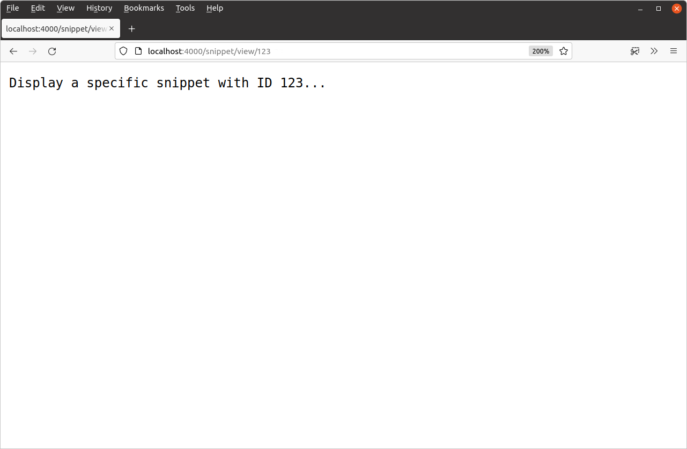

您可能还想尝试访问某些 `id` 通配符值无效或根本没有通配符值的 URL。例如：

- [`http://localhost:4000/snippet/view/`](http://localhost:4000/snippet/view/)
- [`http://localhost:4000/snippet/view/-1`](http://localhost:4000/snippet/view/-1)
- [`http://localhost:4000/snippet/view/foo`](http://localhost:4000/snippet/view/foo)

对于所有这些请求，您应该得到 `404 page not found` 响应。

---

### 补充说明

#### 优先级和冲突

当使用通配符段定义路由模式时，某些模式可能会“重叠”。例如，如果您使用模式 `"/post/edit"` 和 `"/post/{id}"` 定义路由，则它们会重叠，因为具有路径 `/post/edit` 的传入 HTTP 请求与 *both* 模式有效匹配。

当路由模式重叠时，Go 的ServeMux 需要决定哪种模式优先，以便它可以将请求分派到适当的处理器。

此规则非常简洁：*最具体的路由模式获胜*。正式地，如果一个模式仅匹配另一个模式匹配的请求子集，则 Go 将其定义为比另一个模式更具体。

继续上面的示例，路由模式 `"/post/edit"` *only* 与具有确切路径 `/post/edit` 的请求匹配，而模式 `"/post/{id}"` 与具有路径 `/post/edit`、`/post/123`、`/post/abc` 等路径的请求匹配。因此 `"/post/edit"` 是更具体的路由模式，并将优先考虑。

当我们讨论这个主题时，还有一些其他事情值得一提：

- *最具体的模式获胜*规则的一个很好的副作用是，您可以按任何顺序注册模式*，并且它不会改变ServeMux的行为方式*。
- 有一种潜在的边缘情况，即您有两个重叠的路由模式，但没有一个明显比另一个更具体。例如，模式 `"/post/new/{id}"` 和 `"/post/{author}/latest"` 重叠，因为它们都与请求路径 `/post/new/latest` 匹配，但不清楚哪一个应优先。在这种情况下，Go的ServeMux认为模式是*冲突*，并且在初始化路由时会在运行时出现panic。
- 仅仅因为Go的ServeMux支持重叠路由，并不意味着你应该使用它们！重叠的路由模式会增加应用程序中出现错误和意外行为的风险，如果您可以自由地为应用程序设计 URL 结构，那么通常最好的做法是将重叠保持在最低限度或完全避免重叠。

#### 带有通配符的子树路径模式

重要的是要了解，即使您使用通配符段，我们在上一章中描述的路由规则仍然适用。特别是，如果您的路由模式以尾部斜杠结尾并且末尾没有 `{$}`，则它将被视为 *子树路径模式*，并且只需要请求 URL 路径的 *start* 进行匹配。

因此，如果您的路由中有类似 `"/user/{id}/"` 的子树路径模式（请注意尾部斜杠），则此模式将匹配 `/user/1/`、`/user/2/a`、`/user/2/a/b/c` 等请求。

再次强调，如果您不希望出现这种行为，请在末尾添加 `{$}`，例如 `"/user/{id}/{$}"`。

#### 余数通配符

路由模式中的通配符通常仅匹配请求路径的单个非空段。但有一种特殊情况。

如果路由模式以通配符结尾，并且最终通配符标识符以 `...` 结尾，则通配符将匹配请求路径的所有剩余段。

例如，如果您声明类似 `"/post/{path...}"` 的路由模式，它将匹配 `/post/a`、`/post/a/b`、`/post/a/b/c` 等请求 - 非常类似于子树路径模式。但不同之处在于，您可以通过处理器中的 `r.PathValue()` 方法访问整个通配符部分。在此示例中，您可以通过调用 `r.PathValue("path")` 获取 `{path...}` 的通配符值。

---

<!-- 来源章节：02.05-method-based-routing.md -->

*第 2.5 章。*

## 基于方法的路由

接下来，让我们遵循 HTTP 良好实践并限制我们的应用程序，使其仅响应使用适当的 [HTTP 方法](https://developer.mozilla.org/en-US/docs/Web/HTTP/Methods) 的请求。

当我们构建应用程序时，我们的 `home`、`snippetView` 和 `snippetCreate` 处理器将仅检索信息并向用户显示页面，因此这些处理器应限制为执行 `GET` 请求是有意义的。

要将路由限制为特定的 HTTP 方法，您可以在声明路由模式时使用必要的 HTTP 方法作为前缀，如下所示：

*文件：main.go*

```go
package main

...

func main() {
    mux := http.NewServeMux()
    // Prefix the route patterns with the required HTTP method (for now, we will
    // restrict all three routes to acting on GET requests).
    mux.HandleFunc("GET /{$}", home)
    mux.HandleFunc("GET /snippet/view/{id}", snippetView)
    mux.HandleFunc("GET /snippet/create", snippetCreate)

    log.Print("starting server on :4000")

    err := http.ListenAndServe(":4000", mux)
    log.Fatal(err)
}
```

> **注意：** 路由模式中的 HTTP 方法区分大小写，应始终以大写形式编写，后跟至少一个空格字符（空格和制表符都可以）。每个路由模式中只能包含一种 HTTP 方法。

还值得一提的是，当您注册使用 `GET` 方法的路由模式时，它将匹配 `GET` 和 `HEAD` 请求。所有其他方法（例如 `POST`、`PUT` 和 `DELETE`）都需要完全匹配。

让我们使用curl 向我们的应用程序发出一些请求来测试此更改。如果您正在跟进，请首先向 `http://localhost:4000/` 发出常规 `GET` 请求，如下所示：

```bash
$ curl -i localhost:4000/
HTTP/1.1 200 OK
Date: Wed, 18 Mar 2024 11:29:23 GMT
Content-Length: 21
Content-Type: text/plain; charset=utf-8

Hello from Snippetbox
```

这里的反应看起来不错。我们可以看到我们的路由仍然有效，并且我们得到了 `200 OK` 状态和 `Hello from Snippetbox` 响应正文，就像以前一样。

您还可以继续尝试对同一 URL 发出 `HEAD` 请求。您应该看到这也可以正常工作，仅返回 *HTTP 响应标头*，而不返回响应正文。

```bash
$ curl --head localhost:4000/
HTTP/1.1 200 OK
Date: Wed, 18 Mar 2024 11:29:23 GMT
Content-Length: 21
Content-Type: text/plain; charset=utf-8
```

相反，让我们尝试向 `http://localhost:4000/` 发出 `POST` 请求。此路由不支持 `POST` 方法，因此您应该收到类似于以下内容的错误响应：

```bash
$ curl -i -d "" localhost:4000/
HTTP/1.1 405 Method Not Allowed
Allow: GET, HEAD
Content-Type: text/plain; charset=utf-8
X-Content-Type-Options: nosniff
Date: Wed, 18 Mar 2024 11:29:23 GMT
Content-Length: 19

Method Not Allowed*
```

> **注意：**curl `-d` 标志用于声明您想要包含在请求正文中的任何 HTTP `POST` 数据。在上面的命令中，我们使用 `-d ""`，这意味着请求正文将为空，但请求仍将使用 HTTP 方法 `POST` 发送（而不是默认方法 `GET`）。

所以这看起来真的很好。我们可以看到Go的ServeMux已经自动为我们发送了一个`405 Method Not Allowed`响应，其中包括一个`Allow`标头，其中列出了**支持的请求URL的HTTP方法。

### 添加仅 POST 路由和处理器

我们还向代码库添加一个新的 `snippetCreatePost` 处理器，稍后我们将使用它在数据库中创建和保存新的代码片段。由于创建和保存代码片段是一个非幂等操作，会更改服务器的状态，因此我们希望确保此处理器仅作用于 `POST` 请求。

总而言之，我们希望第四个处理器和路由如下所示：

| 路由模式 | 处理器 | 行动 |
| --- | --- | --- |
| GET /{$} | home | 显示主页 |
| GET /snippet/view/{id} | snippetView | 显示特定片段 |
| GET /snippet/create | snippetCreate | 显示用于创建新片段的表单 |
| POST /snippet/create | snippetCreatePost | **保存新代码段** |

让我们继续将必要的代码添加到我们的 `main.go` 文件中，如下所示：

*文件：main.go*

```go
package main

...

// Add a snippetCreatePost handler function.
func snippetCreatePost(w http.ResponseWriter, r *http.Request) {
    w.Write([]byte("Save a new snippet..."))
}

func main() {
    mux := http.NewServeMux()
    mux.HandleFunc("GET /{$}", home)
    mux.HandleFunc("GET /snippet/view/{id}", snippetView)
    mux.HandleFunc("GET /snippet/create", snippetCreate)
    // Create the new route, which is restricted to POST requests only.
    mux.HandleFunc("POST /snippet/create", snippetCreatePost)
    
    log.Print("starting server on :4000")

    err := http.ListenAndServe(":4000", mux)
    log.Fatal(err)
}
```

请注意，声明两个（或多个）具有不同 HTTP 方法但具有相同模式的单独路由是完全可以的，就像我们在这里使用 `"GET /snippet/create"` 和 `"POST /snippet/create"` 所做的那样。

如果您重新启动应用程序并尝试使用 URL 路径 `/snippet/create` 发出一些请求，您现在应该会看到不同的响应，具体取决于您使用的请求方法。

```bash
$ curl -i localhost:4000/snippet/create
HTTP/1.1 200 OK
Date: Wed, 18 Mar 2024 11:29:23 GMT
Content-Length: 50
Content-Type: text/plain; charset=utf-8

Display a form for creating a new snippet...

$ curl -i -d "" localhost:4000/snippet/create
HTTP/1.1 200 OK
Date: Wed, 18 Mar 2024 11:29:23 GMT
Content-Length: 21
Content-Type: text/plain; charset=utf-8

Save a new snippet...

$ curl -i -X DELETE localhost:4000/snippet/create
HTTP/1.1 405 Method Not Allowed
Allow: GET, HEAD, POST
Content-Type: text/plain; charset=utf-8
X-Content-Type-Options: nosniff
Date: Wed, 18 Mar 2024 11:29:23 GMT
Content-Length: 19

Method Not Allowed
```

---

### 补充说明

#### 方法优先级

如果您的路由模式因 HTTP 方法而重叠，则 *最具体的模式获胜* 规则也适用。

请务必注意，不包含方法的路由模式（例如 `"/article/{id}"`）会将传入的 HTTP 请求与 *任何方法* 相匹配。相反，像 `"POST /article/{id}"` 这样的路由将仅匹配具有方法 `POST` 的请求。因此，如果您在应用程序中声明重叠的路由 `"/article/{id}"` 和 `"POST /article/{id}"`，则 `"POST /article/{id}"` 路由优先。

#### 处理器命名

我还想强调，在 Go 中命名处理器的方式没有正确或错误之分。

在这个项目中，我们将遵循一个约定，即在处理 `POST` 请求的任何处理器的名称后添加“Post”一词。就像这样：

| 路由模式 | 处理器 | 行动 |
| --- | --- | --- |
| GET /snippet/create | snippetCreate | 显示用于创建新片段的表单 |
| POST /snippet/create | snippetCreatePost | 创建一个新片段 |

但在你自己的工作中，没有必要遵循这种模式。例如，您可以在处理器名称前加上“get”和“post”一词，如下所示：

| 路由模式 | 处理器 | 行动 |
| --- | --- | --- |
| GET /snippet/create | getSnippetCreate | 显示用于创建新片段的表单 |
| POST /snippet/create | postSnippetCreate | 创建一个新片段 |

或者甚至给处理器提供完全不同的名称。例如：

| 路由模式 | 处理器 | 行动 |
| --- | --- | --- |
| GET /snippet/create | newSnippetForm | 显示用于创建新片段的表单 |
| POST /snippet/create | createSnippet | 创建一个新片段 |

基本上，您可以在 Go 中自由地为您的处理器选择适合您并适合您的大脑的命名约定。

#### 第三方路由器

我们在过去两章中使用的通配符和基于方法的路由功能对于 Go 来说相对较新——它只是在 Go 1.22 中成为标准库的一部分。虽然这是对该语言的一个非常受欢迎的补充和一个很大的改进，但您可能会发现，有时标准库路由功能仍然无法提供您需要的一切。

例如，当前不支持以下内容：

- 向用户发送自定义 `404 Not Found` 和 `405 Method Not Allowed` 响应（尽管有一个 [公开提案](https://github.com/golang/go/issues/65648) 与此相关）。
- 在路由模式或通配符中使用正则表达式。
- 在单个路由声明中匹配多个 HTTP 方法。
- 自动支持 `OPTIONS` 请求。
- 根据异常情况（例如 HTTP 请求标头）将请求路由到处理器。

如果您的应用程序需要这些功能，则需要使用第三方路由器包。我推荐的有 [httprouter](https://github.com/julienschmidt/httprouter)、[chi](https://github.com/go-chi/chi)、[flow](https://github.com/alexedwards/flow) 和 [gorilla/mux](https://github.com/gorilla/mux)，你可以找到它们的比较和有关使用哪一个的指导，请参见 [这篇博文](https://www.alexedwards.net/blog/which-go-router-should-i-use)。

---

<!-- 来源章节：02.06-customizing-responses.md -->

*第 2.6 章。*

## 定制响应

默认情况下，处理器发送的每个响应都具有 [HTTP 状态代码](https://developer.mozilla.org/en-US/docs/Web/HTTP/Status) `200 OK`（向用户指示其请求已成功收到并处理），以及三个自动 *系统生成的* 标头：一个 `Date` 标头和 `Content-Length`和响应正文的 `Content-Type`。例如：

```bash
$ curl -i localhost:4000/
HTTP/1.1 200 OK
Date: Wed, 18 Mar 2024 11:29:23 GMT
Content-Length: 21
Content-Type: text/plain; charset=utf-8

Hello from Snippetbox
```

在本章中，我们将深入研究如何自定义处理器发送的响应标头，并研究向用户发送纯文本响应的其他几种方法。

### HTTP 状态代码

首先，让我们更新 `snippetCreatePost` 处理器，以便它发送 [`201 Created`](https://developer.mozilla.org/en-US/docs/Web/HTTP/Status/201) 状态代码而不是 `200 OK`。为此，您可以在处理器中使用 `w.WriteHeader()` 方法，如下所示：

*文件：main.go*

```go
package main

...

func snippetCreatePost(w http.ResponseWriter, r *http.Request) {
    // Use the w.WriteHeader() method to send a 201 status code.
    w.WriteHeader(201)

    // Then w.Write() method to write the response body as normal.
    w.Write([]byte("Save a new snippet..."))
}

...
```

（是的，这有点愚蠢，因为处理器实际上还没有创建任何东西！但它很好地说明了设置自定义状态代码的模式。）

尽管这一变化看起来很简单，但我需要解释一些细微差别：

- 每个响应只能调用一次`w.WriteHeader()`，并且状态码写入后就无法更改。如果您尝试第二次调用 `w.WriteHeader()` Go 将记录一条警告消息。
- 如果您不显式调用 `w.WriteHeader()`，则第一次调用 `w.Write()` 将自动向用户发送 `200` 状态代码。因此，如果您想发送非 200 状态代码，则必须在* 调用 `w.Write()` 之前调用 `w.WriteHeader()` *。

重新启动服务器，然后使用curl再次向`http://localhost:4000/snippet/create`发出`POST`请求。您应该看到 HTTP 响应现在具有类似于以下内容的 `201 Created` 状态代码：

```bash
$ curl -i -d "" http://localhost:4000/snippet/create
HTTP/1.1 201 Created
Date: Wed, 18 Mar 2024 11:29:23 GMT
Content-Length: 21
Content-Type: text/plain; charset=utf-8

Save a new snippet...
```

### 状态码常量

`net/http`包为HTTP状态码](https://pkg.go.dev/net/http#pkg-constants)提供了[常量，我们可以使用它来代替自己编写状态码数字。使用这些常量是一种很好的做法，因为它有助于防止由于拼写错误而导致的错误，并且还可以帮助使您的代码更加清晰和自我记录 - 特别是在处理不常用的状态代码时。

让我们更新 `snippetCreatePost` 处理器以使用常量 `http.StatusCreated` 而不是整数 `201`，如下所示：

*文件：main.go*

```go
package main

...

func snippetCreatePost(w http.ResponseWriter, r *http.Request) {
    w.WriteHeader(http.StatusCreated)

    w.Write([]byte("Save a new snippet..."))
}

...
```

### 自定义标头

您还可以通过更改 *响应标头映射* 自定义发送给用户的 HTTP 标头。您想要做的最常见的事情可能是在地图中包含一个附加标头，您可以使用 `w.Header().Add()` 方法来完成此操作。

为了演示这一点，我们将 `Server: Go` 标头添加到 `home` 处理器发送的响应中。如果您正在遵循，请继续更新处理器代码，如下所示：

*文件：main.go*

```go
package main

...

func home(w http.ResponseWriter, r *http.Request) {
    // Use the Header().Add() method to add a 'Server: Go' header to the
    // response header map. The first parameter is the header name, and
    // the second parameter is the header value.
    w.Header().Add("Server", "Go")

    w.Write([]byte("Hello from Snippetbox"))
}

...
```

> **重要提示：**在*调用`w.WriteHeader()`或`w.Write()`之前，您必须确保响应标头映射包含您想要的所有标头*。调用 `w.WriteHeader()` 或 `w.Write()` 后对响应标头映射所做的任何更改都不会影响用户收到的标头。

让我们通过使用curl 向`http://localhost:4000/` 发出另一个请求来尝试一下。这次您应该看到响应现在包含一个新的 `Server: Go` 标头，如下所示：

```bash
$ curl -i http://localhost:4000
HTTP/1.1 200 OK
Server: Go
Date: Wed, 18 Mar 2024 11:29:23 GMT
Content-Length: 21
Content-Type: text/plain; charset=utf-8

Hello from Snippetbox
```

### 编写响应体

到目前为止，在本书中我们一直在使用 `w.Write()` 向用户发送特定的 HTTP 响应正文。虽然这是发送响应的最简单、最基本的方法，但实际上，更常见的做法是将您的 `http.ResponseWriter` 值传递给 *另一个为您写入响应的函数*。

事实上，您可以使用很多函数来编写响应！

要理解的关键是… *因为处理器中的 `http.ResponseWriter` 值有一个 `Write()` 方法，它满足 [`io.Writer`](https://pkg.go.dev/io#Writer) 接口*。

如果您是 Go 新手，那么 [接口](https://www.alexedwards.net/blog/interfaces-explained) 的概念可能会有点令人困惑，我现在不想太纠结它。但在实际层面上，这意味着您看到 `io.Writer` 参数的任何函数都可以传入 `http.ResponseWriter` 值，并且正在写入的任何内容随后都将作为 HTTP 响应的正文发送。

这意味着您也可以使用 [`io.WriteString()`](https://pkg.go.dev/io#WriteString) 和 [`fmt.Fprint*()`](https://pkg.go.dev/fmt#Fprint) 系列标准库函数（所有这些函数都接受 `io.Writer` 参数）来编写纯文本响应正文。

```go
// Instead of this...
w.Write([]byte("Hello world"))

// You can do this...
io.WriteString(w, "Hello world")
fmt.Fprint(w, "Hello world")
```

让我们利用这一点，并更新 `snippetView` 处理器中的代码以使用 `fmt.Fprintf()` 函数。这将允许我们在响应正文消息 *中插入通配符 `id` 值，并* 在一行中写入响应，如下所示：

*文件：main.go*

```go
package main

...

func snippetView(w http.ResponseWriter, r *http.Request) {
    id, err := strconv.Atoi(r.PathValue("id"))
    if err != nil || id < 1 {
        http.NotFound(w, r)
        return
    }

    fmt.Fprintf(w, "Display a specific snippet with ID %d...", id)
}

...
```

---

### 补充说明

#### 内容嗅探

为了自动设置 `Content-Type` 标头，请使用 [`http.DetectContentType()`](https://pkg.go.dev/net/http/#DetectContentType) 函数去 *content sniffs* 响应正文。如果此函数无法猜测内容类型，Go 将回退到设置标头 `Content-Type: application/octet-stream`。

`http.DetectContentType()` 函数通常工作得很好，但 Web 开发人员的一个常见问题是它无法区分 JSON 和纯文本。因此，默认情况下，JSON 响应将使用 `Content-Type: text/plain; charset=utf-8` 标头发送。您可以通过在处理器中手动设置正确的标头来防止这种情况发生，如下所示：

```go
w.Header().Set("Content-Type", "application/json")
w.Write([]byte(`{"name":"Alex"}`))
```

#### 操作标题图

在本章中，我们使用 `w.Header().Add()` 将新标头添加到响应标头映射中。但也可以使用 `Set()`、`Del()`、`Get()` 和 `Values()` 方法来操作和读取标头映射。

```go
// Set a new cache-control header. If an existing "Cache-Control" header exists
// it will be overwritten.
w.Header().Set("Cache-Control", "public, max-age=31536000")

// In contrast, the Add() method appends a new "Cache-Control" header and can
// be called multiple times.
w.Header().Add("Cache-Control", "public")
w.Header().Add("Cache-Control", "max-age=31536000")

// Delete all values for the "Cache-Control" header.
w.Header().Del("Cache-Control")

// Retrieve the first value for the "Cache-Control" header.
w.Header().Get("Cache-Control")

// Retrieve a slice of all values for the "Cache-Control" header.
w.Header().Values("Cache-Control")
```

#### 标头规范化

当您在标头映射上使用 `Set()`、`Add()`、`Del()`、`Get()` 和 `Values()` 方法时，标头名称将始终使用 [`textproto.CanonicalMIMEHeaderKey()`](https://pkg.go.dev/net/textproto/#CanonicalMIMEHeaderKey) 函数进行规范化。这会将第一个字母和连字符后面的任何字母转换为大写，并将其余字母转换为小写。这具有实际意义，即调用这些方法时，标头名称为 *不区分大小写*。

如果需要避免这种规范化行为，可以直接编辑底层标头映射。它在幕后具有 `map[string][]string` 类型。例如：

```go
w.Header()["X-XSS-Protection"] = []string{"1; mode=block"}
```

> **注意：**如果正在使用 HTTP/2 连接，Go 将*始终*在编写响应时自动将标头名称和值转换为小写，根据[HTTP/2 规范](https://tools.ietf.org/html/rfc7540#section-8.1.2)。

---

<!-- 来源章节：02.07-project-structure-and-organization.md -->

*第 2.7 章。*

## 项目结构和组织

在我们向 `main.go` 文件添加更多代码之前，是思考如何组织和构建该项目的好时机。

重要的是要预先解释一下，在 Go 中构建 Web 应用程序没有单一的正确（甚至推荐）方法。这有好有坏。这意味着您可以自由灵活地组织代码，但在尝试决定最佳结构应该是什么时，也很容易陷入不确定性的困境。

随着您获得 Go 经验，您将了解哪些模式在不同情况下最适合您。但作为一个起点，我能给您的最好建议是*不要让事情变得过于复杂*。仅在明显需要时才努力增加结构和复杂性。

对于这个项目，我们将实现一个遵循[流行且经过测试的](https://go.dev/doc/modules/layout#server-project)方法的大纲结构。这是一个坚实的起点，您应该能够在各种项目中重用通用结构。

如果您按照步骤操作，请确保您位于项目存储库的根目录中并运行以下命令：

```bash
$ cd $HOME/code/snippetbox
$ rm main.go
$ mkdir -p cmd/web internal ui/html ui/static
$ touch cmd/web/main.go
$ touch cmd/web/handlers.go
```

您的项目存储库的结构现在应如下所示：


让我们花点时间讨论一下每个目录的用途。

- `cmd` 目录将包含项目中可执行应用程序的 *应用程序特定的* 代码。目前，我们的项目只有一个可执行应用程序 - Web 应用程序 - 它将位于 `cmd/web` 目录下。
- `internal` 目录将包含项目中使用的辅助 *非应用程序特定的* 代码。我们将使用它来保存潜在的可重用代码，例如项目的验证助手和 SQL 数据库模型。
- `ui` 目录将包含 Web 应用程序使用的 *用户界面资产*。具体来说，`ui/html` 目录将包含 HTML 模板，`ui/static` 目录将包含静态文件（如 CSS 和图像）。

*那么我们为什么要使用这个结构？*

有两大好处：

1. 它明确区分了 Go 和非 Go 资产。我们编写的所有 Go 代码都将专门位于 `cmd` 和 `internal` 目录下，从而使项目根目录可以自由地保存非 Go 资产，例如 UI 文件、makefile 和模块定义（包括我们的 `go.mod` 文件）。
2. 如果您想向项目中添加另一个可执行应用程序，它的扩展性非常好。例如，您可能希望添加 CLI（命令行界面）来自动执行将来的某些管理任务。使用此结构，您可以在 `cmd/cli` 下创建此 CLI 应用程序，并且它将能够导入和重用您在 `internal` 目录下编写的所有代码。

### 重构现有代码

让我们快速将已经编写的代码移植到这个新结构中。

*文件：cmd/web/main.go*

```go
package main

import (
    "log"
    "net/http"
)

func main() {
    mux := http.NewServeMux()
    mux.HandleFunc("GET /{$}", home)
    mux.HandleFunc("GET /snippet/view/{id}", snippetView)
    mux.HandleFunc("GET /snippet/create", snippetCreate)
    mux.HandleFunc("POST /snippet/create", snippetCreatePost)

    log.Print("starting server on :4000")
    
    err := http.ListenAndServe(":4000", mux)
    log.Fatal(err)
}
```

*文件：cmd/web/handlers.go*

```go
package main

import (
    "fmt"
    "net/http"
    "strconv"
)

func home(w http.ResponseWriter, r *http.Request) {
    w.Header().Add("Server", "Go")
    w.Write([]byte("Hello from Snippetbox"))
}

func snippetView(w http.ResponseWriter, r *http.Request) {
    id, err := strconv.Atoi(r.PathValue("id"))
    if err != nil || id < 1 {
        http.NotFound(w, r)
        return
    }

    fmt.Fprintf(w, "Display a specific snippet with ID %d...", id)
}

func snippetCreate(w http.ResponseWriter, r *http.Request) {
    w.Write([]byte("Display a form for creating a new snippet..."))
}

func snippetCreatePost(w http.ResponseWriter, r *http.Request) {
    w.WriteHeader(http.StatusCreated)
    w.Write([]byte("Save a new snippet..."))
}
```

所以现在我们的Web应用程序由`cmd/web`目录下的多个`.go`文件组成。要运行它们，我们可以使用 `go run` 命令，如下所示：

```bash
$ cd $HOME/code/snippetbox
$ go run ./cmd/web
2024/03/18 11:29:23 starting server on :4000
```

---

### 补充说明

#### 内部目录

需要指出的是，目录名称 `internal` 在 Go 中具有特殊的含义和行为：在此目录下的任何包只能通过 *目录* 的父目录内的代码导入。在我们的例子中，这意味着 `internal` 中的任何包只能通过 `snippetbox` 项目目录中的代码导入。

或者，从另一个角度来看，这意味着 `internal` *下的任何包都无法由我们项目* 外部的代码导入。

这很有用，因为它可以防止其他代码库导入和依赖我们的 `internal` 目录中的（可能未版本化和不受支持的）包 - 即使项目代码在 GitHub 等地方公开可用。

---

<!-- 来源章节：02.08-html-templating-and-inheritance.md -->

*第 2.8 章。*

## HTML 模板和继承

让我们为项目注入一些活力，并为我们的 Snippetbox Web 应用程序开发一个合适的主页。在接下来的几章中，我们将努力创建一个如下所示的页面：


首先，我们在 `ui/html/pages/home.tmpl` 处创建一个 *模板文件* 以包含主页的 HTML 内容。就像这样：

```bash
$ mkdir ui/html/pages
$ touch ui/html/pages/home.tmpl
```

并添加以下 HTML 标记：

*文件：ui/html/pages/home.tmpl*

```html
<!doctype html>
<html lang='en'>
    <head>
        <meta charset='utf-8'>
        <title>Home - Snippetbox</title>
    </head>
    <body>
        <header>
            <h1><a href='/'>Snippetbox</a></h1>
        </header>
        <main>
            <h2>Latest Snippets</h2>
            <p>There's nothing to see here yet!</p>
        </main>
        <footer>Powered by <a href='https://golang.org/'>Go</a></footer>
    </body>
</html>
```

> **注意：** `.tmpl` 扩展在此不传达任何特殊含义或行为。我之所以选择这个扩展，是因为当您浏览文件列表时，这是一种很好的方式来清楚地表明该文件包含 Go 模板。但是，如果您愿意，您可以使用扩展名 `.html` 代替（这可能使您的文本编辑器将文件识别为 HTML，以便语法突出显示或自动完成），或者您甚至可以使用“双重扩展名”，例如 `.tmpl.html`。选择权在你，但我们将坚持在本书中使用 `.tmpl` 作为我们的模板。

现在我们已经创建了一个包含主页 HTML 标记的模板文件，下一个问题是 *我们如何让我们的 `home` 处理器来呈现它？*

为此，我们需要使用 Go 的 [`html/template`](https://pkg.go.dev/html/template/) 包，它提供了一系列用于安全解析和渲染 HTML 模板的函数。我们可以使用此包中的函数来*解析*模板文件，然后*执行*模板。

我来演示一下。打开`cmd/web/handlers.go`文件并添加以下代码：

*文件：cmd/web/handlers.go*

```go
package main

import (
    "fmt"
    "html/template" // New import
    "log"           // New import
    "net/http"
    "strconv"
)

func home(w http.ResponseWriter, r *http.Request) {
    w.Header().Add("Server", "Go")

    // Use the template.ParseFiles() function to read the template file into a
    // template set. If there's an error, we log the detailed error message, use
    // the http.Error() function to send an Internal Server Error response to the
    // user, and then return from the handler so no subsequent code is executed.
    ts, err := template.ParseFiles("./ui/html/pages/home.tmpl")
    if err != nil {
        log.Print(err.Error())
        http.Error(w, "Internal Server Error", http.StatusInternalServerError)
        return
    }

    // Then we use the Execute() method on the template set to write the
    // template content as the response body. The last parameter to Execute()
    // represents any dynamic data that we want to pass in, which for now we'll
    // leave as nil.
    err = ts.Execute(w, nil)
    if err != nil {
        log.Print(err.Error())
        http.Error(w, "Internal Server Error", http.StatusInternalServerError)
    }
}

...
```

这段代码有几个重要的事情需要指出：

- 您传递给 `template.ParseFiles()` 函数的文件路径必须是相对于当前工作目录的路径，或者是绝对路径。在上面的代码中，我创建了相对于项目目录根目录的路径。
- 如果 `template.ParseFiles()` 或 `ts.Execute()` 函数返回错误，我们会记录详细的错误消息，然后使用 [`http.Error()`](https://pkg.go.dev/net/http#Error) 函数向用户发送响应。 `http.Error()` 是一个轻量级帮助函数，它向用户发送纯文本错误消息和特定的 HTTP 状态代码（在我们的代码中，我们发送消息 `"Internal Server Error"` 和状态代码 `500`，由常量 `http.StatusInternalServerError` 表示）。实际上，这意味着如果出现错误，用户将在浏览器中看到消息 `Internal Server Error`，但详细的错误消息将记录在应用程序日志消息中。

因此，话虽如此，请确保您位于项目目录的根目录中并重新启动应用程序：

```bash
$ cd $HOME/code/snippetbox
$ go run ./cmd/web
2024/03/18 11:29:23 starting server on :4000
```

然后在网络浏览器中打开 [`http://localhost:4000`](http://localhost:4000/)。您应该会发现 HTML 主页的效果很好。


### 模板组成

当我们向 Web 应用程序添加更多页面时，我们希望在每个页面上包含一些共享的样板 HTML 标记，例如 `<head>` HTML 元素内的标头、导航和元数据。

为了防止重复并节省键入，最好创建一个包含此共享内容的 *base*（或 *master*）模板，然后我们可以使用各个页面的页面特定标记来 *compose* 模板。

继续创建一个新的 `ui/html/base.tmpl` 文件...

```bash
$ touch ui/html/base.tmpl
```

并添加以下标记（我们希望出现在每个页面中）：

*文件：ui/html/base.tmpl*

```html
{{define "base"}}
<!doctype html>
<html lang='en'>
    <head>
        <meta charset='utf-8'>
        <title>{{template "title" .}} - Snippetbox</title>
    </head>
    <body>
        <header>
            <h1><a href='/'>Snippetbox</a></h1>
        </header>
        <main>
            {{template "main" .}}
        </main>
        <footer>Powered by <a href='https://golang.org/'>Go</a></footer>
    </body>
</html>
{{end}}
```

如果您以前使用过其他语言的模板，希望这感觉很熟悉。它本质上只是常规 HTML，带有一些额外的 *actions* 在双花括号中。

我们使用 `{{define "base"}}...{{end}}` 操作作为包装器来定义一个不同的 *命名模板*，称为 `base`，其中包含我们希望在每个页面上显示的内容。

在此内部，我们使用 `{{template "title" .}}` 和 `{{template "main" .}}` 操作来表示我们想要在 HTML 中的特定位置 *调用* 其他命名模板（称为 `title` 和 `main`）。

> **注意：** 如果您想知道，`{{template "title" .}}` 操作末尾的点表示您想要传递给调用的模板的任何动态数据。我们将在本书后面详细讨论这一点。

现在让我们回到 `ui/html/pages/home.tmpl` 文件并更新它以定义 `title` 和 `main` 命名模板，其中包含主页的特定内容。

*文件：ui/html/pages/home.tmpl*

```html
{{define "title"}}Home{{end}}

{{define "main"}}
    <h2>Latest Snippets</h2>
    <p>There's nothing to see here yet!</p>
{{end}}
```

完成后，下一步是更新 `home` 处理器中的代码，以便它解析 *both* 模板文件，如下所示：

*文件：cmd/web/handlers.go*

```go
package main

...

func home(w http.ResponseWriter, r *http.Request) {
    w.Header().Add("Server", "Go")

    // Initialize a slice containing the paths to the two files. It's important
    // to note that the file containing our base template must be the *first*
    // file in the slice.
    files := []string{
        "./ui/html/base.tmpl",
        "./ui/html/pages/home.tmpl",
    }

    // Use the template.ParseFiles() function to read the files and store the
    // templates in a template set. Notice that we use ... to pass the contents 
    // of the files slice as variadic arguments.
    ts, err := template.ParseFiles(files...)
    if err != nil {
        log.Print(err.Error())
        http.Error(w, "Internal Server Error", http.StatusInternalServerError)
        return
    }

    // Use the ExecuteTemplate() method to write the content of the "base" 
    // template as the response body.
    err = ts.ExecuteTemplate(w, "base", nil)
    if err != nil {
        log.Print(err.Error())
        http.Error(w, "Internal Server Error", http.StatusInternalServerError)
    }
}

...
```

现在，我们的模板集不再直接包含 HTML，而是包含 3 个命名模板 — `base`、`title` 和 `main`。我们使用 `ExecuteTemplate()` 方法告诉 Go 我们特别想使用 `base` 模板的内容进行响应（这又调用我们的 `title` 和 `main` 模板）。

请随意重新启动服务器并尝试一下。您应该发现它呈现与以前相同的输出（尽管操作所在的 HTML 源代码中会有一些额外的空格）。

### 嵌入部分

对于某些应用程序，您可能希望将 HTML 的某些部分分解为 *partials*，以便可以在不同的页面或布局中重复使用。为了说明这一点，让我们创建一个包含 Web 应用程序主导航栏的部分。

创建一个新的 `ui/html/partials/nav.tmpl` 文件，其中包含名为 `"nav"` 的命名模板，如下所示：

```bash
$ mkdir ui/html/partials
$ touch ui/html/partials/nav.tmpl
```

*文件：ui/html/partials/nav.tmpl*

```html
{{define "nav"}}
 <nav>
    <a href='/'>Home</a>
</nav>
{{end}}
```

然后更新 `base` 模板，以便它使用 `{{template "nav" .}}` 操作调用导航部分：

*文件：ui/html/base.tmpl*

```html
{{define "base"}}
<!doctype html>
<html lang='en'>
    <head>
        <meta charset='utf-8'>
        <title>{{template "title" .}} - Snippetbox</title>
    </head>
    <body>
        <header>
            <h1><a href='/'>Snippetbox</a></h1>
        </header>
        <!-- Invoke the navigation template -->
        {{template "nav" .}}
        <main>
            {{template "main" .}}
        </main>
        <footer>Powered by <a href='https://golang.org/'>Go</a></footer>
    </body>
</html>
{{end}}
```

最后，我们需要更新 `home` 处理器以在解析模板文件时包含新的 `ui/html/partials/nav.tmpl` 文件：

*文件：cmd/web/handlers.go*

```go
package main

...

func home(w http.ResponseWriter, r *http.Request) {
    w.Header().Add("Server", "Go")

    // Include the navigation partial in the template files.
    files := []string{
        "./ui/html/base.tmpl",
        "./ui/html/partials/nav.tmpl",
        "./ui/html/pages/home.tmpl",
    }

    ts, err := template.ParseFiles(files...)
    if err != nil {
        log.Print(err.Error())
        http.Error(w, "Internal Server Error", http.StatusInternalServerError)
        return
    }

    err = ts.ExecuteTemplate(w, "base", nil)
    if err != nil {
        log.Print(err.Error())
        http.Error(w, "Internal Server Error", http.StatusInternalServerError)
    }
}

...
```

重新启动服务器后，`base` 模板现在应该调用 `nav` 模板，并且您的主页应如下所示：


---

### 补充说明

#### 块动作

在上面的代码中，我们使用 `{{template}}` 操作从一个模板调用另一个模板。但是 Go 还提供了一个 `{{block}}...{{end}}` 操作，您可以使用它来代替。这与 `{{template}}` 操作类似，不同之处在于，如果当前模板集* 中不存在被调用的模板 *，它允许您指定一些默认内容。

在 Web 应用程序的上下文中，当您想要提供一些默认内容（例如侧边栏）时，如果需要，各个页面可以根据具体情况覆盖这些默认内容，这非常有用。

从语法上讲，你可以这样使用它：

```html
{{define "base"}}
    <h1>An example template</h1>
    {{block "sidebar" .}}
        <p>My default sidebar content</p>
    {{end}}
{{end}}
```

但是，如果您愿意，您不需要*需要*在`{{block}}`和`{{end}}`操作之间包含任何默认内容。在这种情况下，调用的模板就像是“可选的”。如果模板存在于模板集中，则将渲染该模板。但如果没有，则不会显示任何内容。

---

<!-- 来源章节：02.09-serving-static-files.md -->

*第 2.9 章。*

## 提供静态文件

现在，让我们通过向项目中添加一些静态 CSS 和图像文件以及少量 JavaScript 来突出显示活动导航项，来改进主页的外观和感觉。

如果您按照步骤进行操作，则可以获取必要的文件并将它们解压到我们之前使用以下命令创建的 `ui/static` 文件夹中：

```bash
$ cd $HOME/code/snippetbox
$ curl https://www.alexedwards.net/static/sb-v2.tar.gz | tar -xvz -C ./ui/static/
```

`ui/static` 目录的内容现在应如下所示：


### http.Fileserver 处理器

Go 的 `net/http` 包附带了一个内置的 [`http.FileServer`](https://pkg.go.dev/net/http/#FileServer) 处理器，您可以使用它通过 HTTP 从特定目录提供文件。让我们向应用程序添加一条新路由，以便使用此方法处理所有以 `"/static/"` 开头的 `GET` 请求，如下所示：

| 路由模式 | 处理器 | 行动 |
| --- | --- | --- |
| GET / | home | 显示主页 |
| GET /snippet/view/{id} | snippetView | 显示特定片段 |
| GET /snippet/create | snippetCreate | 显示用于创建新片段的表单 |
| POST /snippet/create | snippetCreatePost | 保存新片段 |
| GET /static/ | http.FileServer | **提供特定的静态文件** |

> **记住：**模式`"GET /static/"`是一个子树路径模式，所以它的作用有点像末尾有一个通配符。

要创建新的 `http.FileServer` 处理器，我们需要使用 [`http.FileServer()`](https://pkg.go.dev/net/http/#FileServer) 函数，如下所示：

```go
fileServer := http.FileServer(http.Dir("./ui/static/"))
```

当此处理器收到文件请求时，它将从请求 URL 路径中删除前导斜杠，然后在 `./ui/static` 目录中搜索相应的文件以发送给用户。

因此，为了使其正常工作，我们必须在将* 传递给 `http.FileServer` 之前从 URL 路径 *中去除前导 `"/static"`。否则，它将查找不存在的文件，并且用户将收到 `404 page not found` 响应。幸运的是，Go 包含一个专门用于此任务的 [`http.StripPrefix()`](https://pkg.go.dev/net/http/#StripPrefix) 帮助器。

打开 `main.go` 文件并添加以下代码，使文件最终看起来像这样：

*文件：cmd/web/main.go*

```go
package main

import (
    "log"
    "net/http"
)

func main() {
    mux := http.NewServeMux()

    // Create a file server which serves files out of the "./ui/static" directory.
    // Note that the path given to the http.Dir function is relative to the project
    // directory root.
    fileServer := http.FileServer(http.Dir("./ui/static/"))

    // Use the mux.Handle() function to register the file server as the handler for
    // all URL paths that start with "/static/". For matching paths, we strip the
    // "/static" prefix before the request reaches the file server.
    mux.Handle("GET /static/", http.StripPrefix("/static", fileServer))

    // Register the other application routes as normal..
    mux.HandleFunc("GET /{$}", home)
    mux.HandleFunc("GET /snippet/view/{id}", snippetView)
    mux.HandleFunc("GET /snippet/create", snippetCreate)
    mux.HandleFunc("POST /snippet/create", snippetCreatePost)

    log.Print("starting server on :4000")
    
    err := http.ListenAndServe(":4000", mux)
    log.Fatal(err)
}
```

完成后，重新启动应用程序并在浏览器中打开 [`http://localhost:4000/static/`](http://localhost:4000/static/)。您应该看到 `ui/static` 文件夹的可导航目录列表，如下所示：


请随意尝试并浏览目录列表以查看各个文件。例如，如果您导航到 [`http://localhost:4000/static/css/main.css`](http://localhost:4000/static/css/main.css)，您应该会看到 CSS 文件出现在浏览器中，如下所示：


### 使用静态文件

文件服务器正常工作后，我们现在可以更新 `ui/html/base.tmpl` 文件以使用静态文件：

*文件：ui/html/base.tmpl*

```html
{{define "base"}}
<!doctype html>
<html lang='en'>
    <head>
        <meta charset='utf-8'>
        <title>{{template "title" .}} - Snippetbox</title>
         <!-- Link to the CSS stylesheet and favicon -->
        <link rel='stylesheet' href='/static/css/main.css'>
        <link rel='shortcut icon' href='/static/img/favicon.ico' type='image/x-icon'>
        <!-- Also link to some fonts hosted by Google -->
        <link rel='stylesheet' href='https://fonts.googleapis.com/css?family=Ubuntu+Mono:400,700'>
    </head>
    <body>
        <header>
            <h1><a href='/'>Snippetbox</a></h1>
        </header>
        {{template "nav" .}}
        <main>
            {{template "main" .}}
        </main>
        <footer>Powered by <a href='https://golang.org/'>Go</a></footer>
         <!-- And include the JavaScript file -->
        <script src='/static/js/main.js' type='text/javascript'></script>
    </body>
</html>
{{end}}
```

确保保存更改，然后重新启动服务器并访问 [`http://localhost:4000`](http://localhost:4000/)。您的主页现在应该如下所示：


---

### 补充说明

#### 文件服务器的特点和功能

Go 的 `http.FileServer` 处理器有一些非常好的功能值得一提：

- 在搜索文件之前，它通过 [`path.Clean()`](https://pkg.go.dev/path/#Clean) 函数运行所有请求路径来清理所有请求路径。这将从 URL 路径中删除任何 `.` 和 `..` 元素，这有助于阻止目录遍历攻击。如果您将文件服务器与不会自动清理 URL 路径的路由器结合使用，则此功能特别有用。
- 完全支持[范围请求](https://benramsey.com/blog/2008/05/206-partial-content-and-range-requests)。如果应用程序需要提供大文件并支持断点续传，这会非常有用。你可以使用 curl 请求 `logo.png` 文件的第 100—199 字节来观察这一功能，如下所示：
    ```bash
    $ curl -i -H "Range: bytes=100-199" --output - http://localhost:4000/static/img/logo.png
    HTTP/1.1 206 Partial Content
    Accept-Ranges: bytes
    Content-Length: 100
    Content-Range: bytes 100-199/1075
    Content-Type: image/png
    Last-Modified: Wed, 18 Mar 2024 11:29:23 GMT
    Date: Wed, 18 Mar 2024 11:29:23 GMT
    [binary data]
    ```
- 透明支持 `Last-Modified` 和 `If-Modified-Since` 标头。如果自用户上次请求后文件未发生更改，则 `http.FileServer` 将发送 `304 Not Modified` 状态代码而不是文件本身。这有助于减少客户端和服务器的延迟和处理开销。
- `Content-Type` 使用 [`mime.TypeByExtension()`](https://pkg.go.dev/mime/#TypeByExtension) 函数从文件扩展名自动设置。如有必要，您可以使用 [`mime.AddExtensionType()`](https://pkg.go.dev/mime/#AddExtensionType) 函数添加自己的自定义扩展和内容类型。

#### 性能

在本章中，我们设置文件服务器，以便它为硬盘上的 `./ui/static` 目录之外的文件提供服务。

但值得注意的是，一旦应用程序启动并运行，`http.FileServer` 可能不会从磁盘读取这些文件。 [Windows](https://docs.microsoft.com/en-us/windows/desktop/fileio/file-caching) 和 [基于 Unix 的](https://www.tldp.org/LDP/sag/html/buffer-cache.html) 操作系统都将最近使用的文件缓存在 RAM 中，因此（至少对于经常使用的文件），`http.FileServer` 很可能会从 RAM 中提供它们，而不是使 [相对地慢速](https://gist.github.com/jboner/2841832) 往返硬盘。

#### 提供单个文件

有时您可能想从处理器中提供单个文件。为此，有 [`http.ServeFile()`](https://pkg.go.dev/net/http/#ServeFile) 函数，您可以像这样使用它：

```go
func downloadHandler(w http.ResponseWriter, r *http.Request) {
    http.ServeFile(w, r, "./ui/static/file.zip")
}
```

> **警告：** `http.ServeFile()` 不会自动清理文件路径。如果您从不受信任的用户输入构建文件路径，为了避免目录遍历攻击，您 *必须* 在使用输入之前使用 [`filepath.Clean()`](https://pkg.go.dev/path/filepath/#Clean) 对其进行清理。

#### 禁用目录列表

如果您想禁用目录列表，可以采取几种不同的方法。

最简单的方法？将空白的 `index.html` 文件添加到要禁用列表的特定目录。然后将提供该内容而不是目录列表，并且用户将获得没有正文的 `200 OK` 响应。如果您想对 `./ui/static` 下的所有目录执行此操作，可以使用以下命令：

```bash
$ find ./ui/static -type d -exec touch {}/index.html \;
```

一个更复杂（但可以说更好）的解决方案是创建 [`http.FileSystem`](https://pkg.go.dev/net/http/#FileSystem) 的自定义实现，并让它为任何目录返回 `os.ErrNotExist` 错误。完整的解释和示例代码可以在[这篇博文](https://www.alexedwards.net/blog/disable-http-fileserver-directory-listings)中找到。

---

<!-- 来源章节：02.10-the-http-handler-interface.md -->

*第 2.10 章。*

## http.Handler 接口

在我们进一步讨论之前，我们应该先介绍一些理论。这有点复杂，所以如果你觉得本章很难，请不要担心。继续构建应用程序，并在您更熟悉 Go 后再回到它。

在前面的章节中，我使用了术语 *handler*，但没有解释它的真正含义。严格来说，我们所说的处理器是*一个满足[`http.Handler`](https://pkg.go.dev/net/http/#Handler)接口*的对象：

```go
type Handler interface {
    ServeHTTP(ResponseWriter, *Request)
}
```

简单来说，这基本上意味着要成为处理器，对象 *必须* 具有具有确切签名的 `ServeHTTP()` 方法：

```go
ServeHTTP(http.ResponseWriter, *http.Request)
```

因此，处理器最简单的形式可能如下所示：

```go
type home struct {}

func (h *home) ServeHTTP(w http.ResponseWriter, r *http.Request) {
    w.Write([]byte("This is my home page"))
}
```

这里我们有一个对象（在本例中它是一个空的 `home` 结构，但它同样可以是一个字符串或函数或其他任何东西），并且我们已经实现了一个带有签名 `ServeHTTP(http.ResponseWriter, *http.Request)` 的方法。这就是我们创建处理器所需的全部内容。

然后，您可以使用 `Handle` 方法将其注册到ServeMux，如下所示：

```go
mux := http.NewServeMux()
mux.Handle("/", &home{})
```

当此ServeMux收到 `"/"` 的 HTTP 请求时，它将调用 `home` 结构的 `ServeHTTP()` 方法 - 该方法又写入 HTTP 响应。

### 处理函数

现在，创建一个对象以便我们可以在其上实现 `ServeHTTP()` 方法，这是冗长且有点令人困惑的。这就是为什么在实践中将处理器编写为普通函数更为常见（就像我们在本书中到目前为止所做的那样）。例如：

```go
func home(w http.ResponseWriter, r *http.Request) {
    w.Write([]byte("This is my home page"))
}
```

但这个`home`函数只是一个普通函数；它没有 `ServeHTTP()` 方法。因此，它本身 *不是* 处理器。

相反，我们可以使用 [`http.HandlerFunc()`](https://pkg.go.dev/net/http/#HandlerFunc) 适配器将 *将其转换为处理器，如下所示：

```go
mux := http.NewServeMux()
mux.Handle("/", http.HandlerFunc(home))
```

`http.HandlerFunc()` 适配器的工作原理是自动向 `home` 函数添加 `ServeHTTP()` 方法。执行时，此 `ServeHTTP()` 方法只需 *调用原始 `home` 函数* 内部的代码。这是一种强制普通函数满足 `http.Handler` 接口的迂回但便捷的方法。

到目前为止，在整个项目中，我们一直在使用 `HandleFunc()` 方法向ServeMux 注册我们的处理函数。这只是一些语法糖，它将函数转换为处理器并一步注册它，而不必手动完成。上面的示例的功能与此等效：

```go
mux := http.NewServeMux()
mux.HandleFunc("/", home)
```

### 链接处理器

眼尖的您可能在这个项目一开始就注意到了一些有趣的事情。 [`http.ListenAndServe()`](https://pkg.go.dev/net/http/#ListenAndServe) 函数采用 `http.Handler` 对象作为第二个参数：

```go
func ListenAndServe(addr string, handler Handler) error
```

…但我们一直在传递一个ServeMux。

我们能够做到这一点是因为ServeMux还有一个[`ServeHTTP()`](https://pkg.go.dev/net/http/#ServeMux.ServeHTTP)方法，这意味着它也满足`http.Handler`接口。

对我来说，它简化了将ServeMux视为一种*特殊类型的处理器*，它本身不提供响应，而是将请求传递给第二个处理器。这并不像乍听起来那样是一个飞跃。将处理器链接在一起是 Go 中非常常见的习惯用法，我们稍后将在本项目中做很多事情。

事实上，具体发生的事情是这样的：当我们的服务器收到一个新的 HTTP 请求时，它会调用ServeMux的 `ServeHTTP()` 方法。这会根据请求方法和 URL 路径查找相关处理器，然后调用该处理器的 `ServeHTTP()` 方法。您可以将 Go Web 应用程序视为 *一系列 `ServeHTTP()` 方法被依次调用*。

### 请求同时处理

还有一件非常重要的事情需要指出：*所有传入的 HTTP 请求都在它们自己的 goroutine* 中提供服务。对于繁忙的服务器，这意味着处理器中的代码或由处理器调用的代码很可能会同时运行。虽然这有助于使 Go 变得非常快，但缺点是在从处理器访问共享资源时，您需要注意（并防止）[竞争条件](https://www.alexedwards.net/blog/understanding-mutexes)。

---

<!-- 来源章节：03.00-configuration-and-error-handling.md -->

*第 3 章。*

# 配置和错误处理

在本书的这一部分中，我们将做一些整理工作。我们不会向我们的应用程序添加太多新功能，而是专注于使其更易于开发和管理的改进。

您将学习如何：

- 使用[命令行标志](03.01-managing-configuration-settings.md)在运行时以简单且惯用的方式传递应用程序的配置设置。
- 创建一个[自定义记录器](03.02-structured-logging.md)用于编写结构化和分级的日志条目，并在整个应用程序中使用它。
- 以可扩展、类型安全且不会妨碍编写测试的方式使 [依赖项](03.03-dependency-injection.md) 可供处理器使用。
- [集中错误处理](03.04-centralized-error-handling.md)，这样你在编写代码时就不需要重复自己。

---

<!-- 来源章节：03.01-managing-configuration-settings.md -->

*第 3.1 章。*

## 管理配置设置

我们的网络应用程序的 `main.go` 文件当前包含一些硬编码的配置设置：

- 服务器侦听的网络地址（当前为 `":4000"`）
- 静态文件目录的文件路径（当前为 `"./ui/static"`）

对这些进行硬编码并不理想。我们的配置设置和代码之间没有分离，并且我们无法在运行时更改设置（如果您需要针对开发、测试和生产环境的不同设置，这一点很重要）。

在本章中，我们将开始改进这一点，首先使我们的服务器的网络地址在运行时可配置。

### 命令行标志

在 Go 中，管理配置设置的常见且惯用的方法是在启动应用程序时使用 *命令行标志*。例如：

```bash
$ go run ./cmd/web -addr=":80"
```

在应用程序中接受和解析命令行标志的最简单方法是使用如下代码行：

```go
addr := flag.String("addr", ":4000", "HTTP network address")
```

这本质上定义了一个名为 `addr` 的新命令行标志，默认值为 `":4000"` 以及一些解释该标志控制内容的简短帮助文本。标志的值将在运行时存储在 `addr` 变量中。

让我们在应用程序中使用它，并将硬编码的网络地址替换为命令行标志：

*文件：cmd/web/main.go*

```go
package main

import (
    "flag" // New import
    "log"
    "net/http"
)

func main() {
    // Define a new command-line flag with the name 'addr', a default value of ":4000"
    // and some short help text explaining what the flag controls. The value of the
    // flag will be stored in the addr variable at runtime.
    addr := flag.String("addr", ":4000", "HTTP network address")

    // Importantly, we use the flag.Parse() function to parse the command-line flag.
    // This reads in the command-line flag value and assigns it to the addr
    // variable. You need to call this *before* you use the addr variable
    // otherwise it will always contain the default value of ":4000". If any errors are
    // encountered during parsing the application will be terminated.
    flag.Parse()

    mux := http.NewServeMux()

    fileServer := http.FileServer(http.Dir("./ui/static/"))
    mux.Handle("GET /static/", http.StripPrefix("/static", fileServer))
    
    mux.HandleFunc("GET /{$}", home)
    mux.HandleFunc("GET /snippet/view/{id}", snippetView)
    mux.HandleFunc("GET /snippet/create", snippetCreate)
    mux.HandleFunc("POST /snippet/create", snippetCreatePost)

    // The value returned from the flag.String() function is a pointer to the flag
    // value, not the value itself. So in this code, that means the addr variable 
    // is actually a pointer, and we need to dereference it (i.e. prefix it with
    // the * symbol) before using it. Note that we're using the log.Printf() 
    // function to interpolate the address with the log message.
    log.Printf("starting server on %s", *addr)

    // And we pass the dereferenced addr pointer to http.ListenAndServe() too.
    err := http.ListenAndServe(*addr, mux)
    log.Fatal(err)
}
```

保存此文件并在启动应用程序时尝试使用 `-addr` 标志。您应该发现服务器现在侦听您指定的任何地址，如下所示：

```bash
$ go run ./cmd/web -addr=":9999"
2024/03/18 11:29:23 starting server on :9999
```

> **注意：** 端口 0-1023 受到限制，（通常）只能由具有 root 权限的服务使用。如果您尝试使用这些端口之一，您应该在启动时收到 `bind: permission denied` 错误消息。

### 默认值

命令行标志是完全可选的。例如，如果您在没有 `-addr` 标志的情况下运行应用程序，服务器将回退到侦听地址 `":4000"`（这是我们指定的默认值）。

```bash
$ go run ./cmd/web
2024/03/18 11:29:23 starting server on :4000
```

没有关于使用什么作为命令行标志的默认值的规则。我喜欢使用对我的开发环境有意义的默认值，因为它可以节省我在构建应用程序时的时间和打字。但是YMMV。您可能更喜欢为生产环境设置默认值的更安全方法。

### 类型转换

在上面的代码中，我们使用 `flag.String()` 函数来定义命令行标志。这样做的好处是可以将用户在运行时提供的任何值转换为 `string` 类型。如果值 *无法* 转换为 `string`，则应用程序将打印一条错误消息并退出。

Go 还有一系列其他函数，包括 [`flag.Int()`](https://pkg.go.dev/flag/#Int)、[`flag.Bool()`](https://pkg.go.dev/flag/#Bool)、[`flag.Float64()`](https://pkg.go.dev/flag/#Float64) 和[`flag.Duration()`](https://pkg.go.dev/flag#Duration) 用于定义标志。它们的工作方式与 `flag.String()` 完全相同，只是它们自动将命令行标志值转换为适当的类型。

### 自动帮助

另一个很棒的功能是您可以使用 `-help` 标志列出应用程序的所有可用命令行标志及其随附的帮助文本。尝试一下：

```bash
$ go run ./cmd/web -help
Usage of /tmp/go-build3672328037/b001/exe/web:
  -addr string
        HTTP network address (default ":4000")
```

所以，总而言之，这看起来非常好。我们引入了一种在运行时管理应用程序配置设置的惯用方法，并且由于 `-help` 标志，我们还在应用程序及其操作配置之间提供了明确且记录在案的接口。

---

### 补充说明

#### 环境变量

如果您以前构建并部署过 Web 应用程序，那么您可能会想 *环境变量怎么样？在那里存储配置设置肯定是[好的做法](http://12factor.net/config)吗？*

如果需要，您*可以*将配置设置存储在环境变量中，并使用[`os.Getenv()`](https://pkg.go.dev/os/#Getenv)函数直接从应用程序访问它们，如下所示：

```go
addr := os.Getenv("SNIPPETBOX_ADDR")
```

但与使用命令行标志相比，这有一些缺点。您无法指定默认设置（如果环境变量不存在，则 `os.Getenv()` 的返回值为空字符串），您无法获得使用命令行标志执行的 `-help` 功能，并且 `os.Getenv()` 的返回值是 *始终* 一个字符串 — 您不会像您一样获得自动类型转换与 `flag.Int()`、`flag.Bool()` 和其他命令行标志函数。

相反，您可以通过在启动应用程序时将环境变量作为命令行标志传递来获得两全其美的效果。例如：

```bash
$ export SNIPPETBOX_ADDR=":9999"
$ go run ./cmd/web -addr=$SNIPPETBOX_ADDR
2024/03/18 11:29:23 starting server on :9999
```

#### 布尔标志

对于使用 `flag.Bool()` 定义的标志，启动应用程序时省略值与写入 `-flag=true` 相同。以下两个命令是等效的：

```bash
$ go run ./example -flag=true
$ go run ./example -flag
```

如果要将布尔标志值设置为 false，则必须显式使用 `-flag=false`。

#### 预先存在的变量

可以使用 [`flag.StringVar()`](https://pkg.go.dev/flag/#FlagSet.StringVar)、[`flag.IntVar()`](https://pkg.go.dev/flag/#FlagSet.IntVar) 将命令行标志值解析到预先存在的变量的内存地址中， [`flag.BoolVar()`](https://pkg.go.dev/flag/#FlagSet.BoolVar)，以及其他类型的类似函数。

如果您想将所有配置设置存储在单个结构中，这些函数特别有用。举个粗略的例子：

```go
type config struct {
    addr      string
    staticDir string
}

...

var cfg config

flag.StringVar(&cfg.addr, "addr", ":4000", "HTTP network address")
flag.StringVar(&cfg.staticDir, "static-dir", "./ui/static", "Path to static assets")

flag.Parse()
```

---

<!-- 来源章节：03.02-structured-logging.md -->

*第 3.2 章。*

## 结构化日志记录

目前，我们使用 [`log.Printf()`](https://pkg.go.dev/log/#Printf) 和 [`log.Fatal()`](https://pkg.go.dev/log/#Fatal) 函数从代码中输出日志条目。一个很好的例子是我们在服务器启动之前打印的 *“正在启动服务器...”* 日志条目：

```go
log.Printf("starting server on %s", *addr)
```

`log.Printf()` 和 `log.Fatal()` 函数都使用 Go 的 [`log`](https://pkg.go.dev/log) 包中的 *标准记录器* 输出日志条目，默认情况下，该包在消息前面加上本地日期和时间，并写入标准错误流（应显示在终端窗口中）。

```bash
$ go run ./cmd/web/
2024/03/18 11:29:23 starting server on :4000
```

对于许多应用程序来说，使用标准记录器*足够好*，并且不需要做任何更复杂的事情。

但对于进行大量日志记录的应用程序，您可能希望使日志条目更易于过滤和使用。例如，您可能想要区分日志条目（如信息条目和错误条目）的不同 *严重性*，或者强制日志条目采用一致的结构，以便外部程序或服务轻松解析它们。

为了支持这一点，Go 标准库包含 [`log/slog`](https://pkg.go.dev/log/slog) 包，它允许您创建自定义的 *结构化记录器*，以设置的格式输出日志条目。每个日志条目包含以下内容：

- 毫秒精度的时间戳。
- 日志条目的严重性级别（`Debug`、`Info`、`Warn` 或 `Error`）。
- 日志消息（任意 `string` 值）。
- （可选）包含附加信息的任意数量的键值对（称为 *属性*）。

### 创建结构化记录器

当您第一次看到使用 `log/slog` 包创建结构化记录器的代码时，可能会有点困惑。

要理解的关键是，所有结构化记录器都有一个与之关联的 *结构化日志记录处理器*（不要与 HTTP 处理器混淆），实际上是这个处理器控制日志条目的格式以及写入位置。

创建记录器的代码如下所示：

```go
loggerHandler := slog.NewTextHandler(os.Stdout, &slog.HandlerOptions{...})
logger := slog.New(loggerHandler)
```

在第一行代码中，我们首先使用 [`slog.NewTextHandler()`](https://pkg.go.dev/log/slog#NewTextHandler) 函数来创建结构化日志记录处理器。该函数接受两个参数：

- 第一个参数是日志条目的写入目的地。在上面的示例中，我们将其设置为 `os.Stdout`，这意味着它将把日志条目写入标准输出流。
- 第二个参数是指向 [`slog.HandlerOptions`](https://pkg.go.dev/log/slog#HandlerOptions) struct 的指针，您可以使用它来自定义处理器的行为。我们将在本章末尾介绍一些可用的自定义。如果您对默认值感到满意并且不想更改任何内容，则可以传递 `nil` 作为第二个参数。

然后在第二行代码中，我们通过将处理器传递给 [`slog.New()`](https://pkg.go.dev/log/slog#New) 函数来实际创建结构化记录器。

在实践中，更常见的是在一行代码中完成所有这些操作：

```go
logger := slog.New(slog.NewTextHandler(os.Stdout, &slog.HandlerOptions{...}))
```

### 使用结构化记录器

创建结构化记录器后，您可以通过调用记录器上的 `Debug()`、`Info()`、`Warn()` 或 `Error()` 方法来写入特定严重性级别的日志条目。例如，以下代码行：

```go
logger.Info("request received")
```

将产生如下所示的日志条目：

```bash
time=2024-03-18T11:29:23.000+00:00 level=INFO msg="request received"
```

`Debug()`、`Info()`、`Warn()` 或 `Error()` 方法是 *可变参数方法*，它们接受任意数量的附加属性（键值对）。就像这样：

```go
logger.Info("request received", "method", "GET", "path", "/")
```

在此示例中，我们向日志条目添加了两个额外属性：键 `"method"` 和值 `"GET"`，以及键 `"path"` 和值 `"/"`。属性键必须始终是字符串，但值可以是任何类型。在此示例中，日志条目将如下所示：

```bash
time=2024-03-18T11:29:23.000+00:00 level=INFO msg="request received" method=GET path=/
```

> **注意：** 如果您的属性键、值或日志消息包含 `"` 或 `=` 字符或任何空格，则它们将在日志输出中用双引号引起来。我们可以在上面的示例中看到这种行为，其中日志消息 `msg="request received"` 被引用。

### 将结构化日志记录添加到我们的应用程序中

好的，让我们继续更新 `main.go` 文件以使用结构化记录器而不是 Go 的标准记录器。就像这样：

*文件：cmd/web/main.go*

```go
package main

import (
    "flag"
    "log/slog" // New import
    "net/http"
    "os" // New import
)

func main() {
    addr := flag.String("addr", ":4000", "HTTP network address")
    flag.Parse()

    // Use the slog.New() function to initialize a new structured logger, which
    // writes to the standard out stream and uses the default settings.
    logger := slog.New(slog.NewTextHandler(os.Stdout, nil))

    mux := http.NewServeMux()

    fileServer := http.FileServer(http.Dir("./ui/static/"))
    mux.Handle("GET /static/", http.StripPrefix("/static", fileServer))

    mux.HandleFunc("GET /{$}", home)
    mux.HandleFunc("GET /snippet/view/{id}", snippetView)
    mux.HandleFunc("GET /snippet/create", snippetCreate)
    mux.HandleFunc("POST /snippet/create", snippetCreatePost)

    // Use the Info() method to log the starting server message at Info severity
    // (along with the listen address as an attribute).
    logger.Info("starting server", "addr", *addr)

    err := http.ListenAndServe(*addr, mux)
    // And we also use the Error() method to log any error message returned by
    // http.ListenAndServe() at Error severity (with no additional attributes),
    // and then call os.Exit(1) to terminate the application with exit code 1.
    logger.Error(err.Error())
    os.Exit(1)
}
```

> **重要提示：** 没有相当于 `log.Fatal()` 函数的结构化日志记录可用于处理 `http.ListenAndServe()` 返回的错误。相反，我们能得到的最接近的结果是在 `Error` 严重级别记录一条消息，然后手动调用 `os.Exit(1)` 以使用 [退出代码 1](https://tldp.org/LDP/abs/html/exitcodes.html) 终止应用程序，就像我们在上面的代码中一样。

好吧……让我们试试这个！

继续运行应用程序，然后打开 *另一个* 终端窗口并尝试再次运行它。这应该会生成错误，因为我们的服务器想要侦听的网络地址 (`":4000"`) 已在使用中。

第二个终端中的日志输出应如下所示：

```bash
$ go run ./cmd/web
time=2024-03-18T11:29:23.000+00:00 level=INFO msg="starting server" addr=:4000
time=2024-03-18T11:29:23.000+00:00 level=ERROR msg="listen tcp :4000: bind: address already in use"
exit status 1
```

这看起来不错。我们可以看到两个日志条目包含不同的信息，但总体格式相同。

第一个日志条目具有严重性 `level=INFO` 和消息 `msg="starting server"`，以及附加 `addr=:4000` 属性。相比之下，我们看到第二条日志条目的严重性为`level=ERROR`，`msg`值包含错误消息的内容，并且没有其他属性。

---

### 补充说明

#### 更安全的属性

假设您不小心编写了一些代码，忘记包含属性的键或值。例如：

```go
logger.Info("starting server", "addr") // Oops, the value for "addr" is missing
```

发生这种情况时，日志条目仍将被写入，但属性将具有键 `!BADKEY`，如下所示：

```bash
time=2024-03-18T11:29:23.000+00:00 level=INFO msg="starting server" !BADKEY=addr
```

为了避免这种情况发生并在编译时捕获任何问题，您可以使用 [`slog.Any()`](https://pkg.go.dev/log/slog#Any) 函数来创建属性对：

```go
logger.Info("starting server", slog.Any("addr", ":4000"))
```

或者，您可以更进一步，通过使用 `slog.String()`、`slog.Int()`、`slog.Bool()`、`slog.Time()` 和 `slog.Duration()` 函数来创建具有特定类型值的属性，从而引入一些额外的类型安全性。

```go
logger.Info("starting server", slog.String("addr", ":4000"))
```

是否要使用这些功能取决于您。 `log/slog` 包对于 Go 来说相对较新（在 Go 1.21 中引入），并且还没有太多关于使用它的既定最佳实践或约定。但权衡很简单……使用 `slog.String()` 等函数来创建属性更加冗长，但从某种意义上来说更安全，因为它降低了应用程序中出现错误的风险。

#### JSON 格式的日志

我们在本章中使用的 `slog.NewTextHandler()` 函数创建一个写入纯文本日志条目的处理器。但可以创建一个处理器，将日志条目写入 *JSON 对象*，而不是使用 [`slog.NewJSONHandler()`](https://pkg.go.dev/log/slog#NewJSONHandler) 函数。就像这样：

```go
logger := slog.New(slog.NewJSONHandler(os.Stdout, nil))
```

使用 JSON 处理器时，日志输出将类似于以下内容：

```bash
{"time":"2024-03-18T11:29:23.00000000+00:00","level":"INFO","msg":"starting server","addr":":4000"}
{"time":"2024-03-18T11:29:23.00000000+00:00","level":"ERROR","msg":"listen tcp :4000: bind: address already in use"}
```

#### 最低日志级别

正如我们多次提到的，`log/slog` 包支持四个严重级别：`Debug`、`Info`、`Warn` 和 `Error` *，顺序为*。 `Debug` 是最不严重的级别，`Error` 是最严重的级别。

默认情况下，结构化记录器的最低日志级别为 `Info`。这意味着任何严重性 *小于* 小于 `Info` 的日志条目（即 `Debug` 级别条目）将被默默丢弃。

如果需要，您可以使用 `slog.HandlerOptions` 结构来覆盖它并将最低级别设置为 `Debug` （或任何其他级别）：

```go
logger := slog.New(slog.NewTextHandler(os.Stdout, &slog.HandlerOptions{
    Level: slog.LevelDebug,
}))
```

#### 来电者位置

您还可以自定义处理器，使其在日志条目中包含调用源代码的文件名和行号，如下所示：

```go
logger := slog.New(slog.NewTextHandler(os.Stdout, &slog.HandlerOptions{
    AddSource: true,
}))
```

日志条目将与此类似，调用者位置记录在 `source` 键下：

```bash
time=2024-03-18T11:29:23.000+00:00 level=INFO source=/home/alex/code/snippetbox/cmd/web/main.go:32 msg="starting server" addr=:4000
```

#### 解耦日志记录

在本章中，我们设置了结构化记录器以将条目写入 `os.Stdout` — 标准输出流。

将日志条目写入 `os.Stdout` 的最大好处是您的应用程序和日志记录是解耦的。您的应用程序本身不关心日志的路由或存储，这可以让您更轻松地根据环境以不同的方式管理日志。

在开发过程中，很容易查看日志输出，因为标准输出流显示在终端中。

在暂存或生产环境中，您可以将流重定向到最终目的地以进行查看和存档。该目标可以是磁盘文件，也可以是 Splunk 等日志记录服务。无论哪种方式，日志的最终目的地都可以由您的执行环境独立于应用程序进行管理。

例如，我们可以在启动应用程序时将标准输出流重定向到磁盘上的文件，如下所示：

```bash
$ go run ./cmd/web >>/tmp/web.log
```

> **注意：**使用双箭头`>>`将附加到现有文件，而不是在启动应用程序时截断它。

#### 并发日志记录

`slog.New()` 创建的自定义记录器是并发安全的。您可以共享单个记录器并在多个 goroutine 和 HTTP 处理器中使用它，而无需担心竞争条件。

也就是说，如果您有 *多个* 结构化记录器写入同一目标，那么您需要小心并确保目标的底层 `Write()` 方法对于并发使用也是安全的。

---

<!-- 来源章节：03.03-dependency-injection.md -->

*第 3.3 章。*

## 依赖注入

如果您打开 `handlers.go` 文件，您会注意到 `home` 处理函数仍在使用 Go 的标准记录器（而不是我们现在想要使用的结构化记录器）写入错误消息。

```go
func home(w http.ResponseWriter, r *http.Request) {
    ...

    ts, err := template.ParseFiles(files...)
    if err != nil {
        log.Print(err.Error()) // This isn't using our new structured logger.
        http.Error(w, "Internal Server Error", http.StatusInternalServerError)
        return
    }

    err = ts.ExecuteTemplate(w, "base", nil)
    if err != nil {
        log.Print(err.Error()) // This isn't using our new structured logger.
        http.Error(w, "Internal Server Error", http.StatusInternalServerError)
    }
}
```

这就提出了一个很好的问题：*我们如何使新的结构化记录器可用于 `main()` 中的 `home` 函数？*

这个问题进一步概括了。大多数 Web 应用程序都具有其处理器需要访问的多个依赖项，例如数据库连接池、集中式错误处理器和模板缓存。我们真正想要回答的是：*我们如何使任何依赖项可供我们的处理器使用？*

有[几种不同的方法](https://www.alexedwards.net/blog/organising-database-access)来做到这一点，最简单的是将依赖项放在全局变量中。但总的来说，将 *将依赖项* 注入到处理器中是一种很好的做法。与使用全局变量相比，它使您的代码更明确、更不容易出错并且更容易进行单元测试。

对于所有处理器都在同一个包中的应用程序（例如我们的应用程序），注入依赖项的一种巧妙方法是将它们放入自定义的 `application` 结构中，然后将处理器函数定义为针对 `application` 的方法。

我来演示一下。

首先打开 `main.go` 文件并创建一个新的 `application` 结构，如下所示：

*文件：cmd/web/main.go*

```go
package main

import (
    "flag"
    "log/slog"
    "net/http"
    "os"
)

// Define an application struct to hold the application-wide dependencies for the
// web application. For now we'll only include the structured logger, but we'll
// add more to this as the build progresses.
type application struct {
    logger *slog.Logger
}

func main() {
    ...
}
```

然后在 `handlers.go` 文件中，我们要更新处理函数，以便它们成为针对 `application` 结构* 的 *方法，并使用它包含的结构化记录器。

*文件：cmd/web/handlers.go*

```go
package main

import (
    "fmt"
    "html/template"
    "net/http"
    "strconv"
)

// Change the signature of the home handler so it is defined as a method against
// *application.
func (app *application) home(w http.ResponseWriter, r *http.Request) {
    w.Header().Add("Server", "Go")

    files := []string{
        "./ui/html/base.tmpl",
        "./ui/html/partials/nav.tmpl",
        "./ui/html/pages/home.tmpl",
    }

    ts, err := template.ParseFiles(files...)
    if err != nil {
        // Because the home handler is now a method against the application
        // struct it can access its fields, including the structured logger. We'll 
        // use this to create a log entry at Error level containing the error
        // message, also including the request method and URI as attributes to 
        // assist with debugging.
        app.logger.Error(err.Error(), "method", r.Method, "uri", r.URL.RequestURI())
        http.Error(w, "Internal Server Error", http.StatusInternalServerError)
        return
    }

    err = ts.ExecuteTemplate(w, "base", nil)
    if err != nil {
        // And we also need to update the code here to use the structured logger
        // too.
        app.logger.Error(err.Error(), "method", r.Method, "uri", r.URL.RequestURI())
        http.Error(w, "Internal Server Error", http.StatusInternalServerError)
    }
}

// Change the signature of the snippetView handler so it is defined as a method
// against *application.
func (app *application) snippetView(w http.ResponseWriter, r *http.Request) {
    id, err := strconv.Atoi(r.PathValue("id"))
    if err != nil || id < 1 {
        http.NotFound(w, r)
        return
    }

    fmt.Fprintf(w, "Display a specific snippet with ID %d...", id)
}

// Change the signature of the snippetCreate handler so it is defined as a method
// against *application.
func (app *application) snippetCreate(w http.ResponseWriter, r *http.Request) {
    w.Write([]byte("Display a form for creating a new snippet..."))
}

// Change the signature of the snippetCreatePost handler so it is defined as a method
// against *application.
func (app *application) snippetCreatePost(w http.ResponseWriter, r *http.Request) {
    w.WriteHeader(http.StatusCreated)
    w.Write([]byte("Save a new snippet..."))
}
```

最后让我们将 `main.go` 文件中的内容连接在一起：

*文件：cmd/web/main.go*

```go
package main

import (
    "flag"
    "log/slog"
    "net/http"
    "os"
)

type application struct {
    logger *slog.Logger
}

func main() {
    addr := flag.String("addr", ":4000", "HTTP network address")
    flag.Parse()

    logger := slog.New(slog.NewTextHandler(os.Stdout, nil))

    // Initialize a new instance of our application struct, containing the
    // dependencies (for now, just the structured logger).
    app := &application{
        logger: logger,
    }

    mux := http.NewServeMux()

    fileServer := http.FileServer(http.Dir("./ui/static/"))
    mux.Handle("GET /static/", http.StripPrefix("/static", fileServer))
    
    // Swap the route declarations to use the application struct's methods as the
    // handler functions.
    mux.HandleFunc("GET /{$}", app.home)
    mux.HandleFunc("GET /snippet/view/{id}", app.snippetView)
    mux.HandleFunc("GET /snippet/create", app.snippetCreate)
    mux.HandleFunc("POST /snippet/create", app.snippetCreatePost)
    

    logger.Info("starting server", "addr", *addr)
    
    err := http.ListenAndServe(*addr, mux)
    logger.Error(err.Error())
    os.Exit(1)
}
```

我知道这种方法可能感觉有点复杂和令人费解，特别是当替代方案是简单地将 `logger` 设为全局变量时。但请跟我一起。随着应用程序的增长，我们的处理器开始需要更多的依赖项，这种模式将开始显示其价值。

### 添加故意错误

让我们通过快速向我们的应用程序添加一个故意的错误来尝试一下。

打开终端并将 `ui/html/pages/home.tmpl` 重命名为 `ui/html/pages/home.bak`。当我们运行应用程序并对主页发出请求时，现在应该会导致错误，因为 `ui/html/pages/home.tmpl` 文件不再存在。

继续进行更改：

```bash
$ cd $HOME/code/snippetbox
$ mv ui/html/pages/home.tmpl ui/html/pages/home.bak
```

然后运行应用程序并向 [`http://localhost:4000`](http://localhost:4000/) 发出请求。您应该在浏览器中收到 `Internal Server Error` HTTP 响应，并在终端中的 `Error` 级别看到相应的日志条目，类似于以下内容：

```bash
$ go run ./cmd/web
time=2024-03-18T11:29:23.000+00:00 level=INFO msg="starting server" addr=:4000
time=2024-03-18T11:29:23.000+00:00 level=ERROR msg="open ./ui/html/pages/home.tmpl: no such file or directory" method=GET uri=/
```

这很好地证明了我们的结构化 `logger` 现在作为依赖项传递到我们的 `home` 处理器，并且正在按预期工作。

暂时保留故意错误；在下一章中我们将再次需要它。

---

### 补充说明

#### 依赖注入的闭包

如果您的处理器分布在多个包中，我们用来注入依赖项的模式将不起作用。在这种情况下，另一种方法是创建一个独立的 `config` 包，该包导出 `Application` 结构，并让处理器函数关闭它以形成 *closure*。非常粗略地：

```go
// package config

type Application struct {
    Logger *slog.Logger
}
```

```go
// package foo

func ExampleHandler(app *config.Application) http.HandlerFunc {
    return func(w http.ResponseWriter, r *http.Request) {
        ...
        ts, err := template.ParseFiles(files...)
        if err != nil {
            app.Logger.Error(err.Error(), "method", r.Method, "uri", r.URL.RequestURI())
            http.Error(w, "Internal Server Error", http.StatusInternalServerError)
            return
        }
        ...
    }
}
```

```go
// package main

func main() {
    app := &config.Application{
        Logger: slog.New(slog.NewTextHandler(os.Stdout, nil)),
    }
    ...
    mux.Handle("/", foo.ExampleHandler(app))
    ...
}
```

您可以在 [this Gist](https://gist.github.com/alexedwards/5cd712192b4831058b21) 中找到有关如何使用闭包模式的完整且更具体的示例。

---

<!-- 来源章节：03.04-centralized-error-handling.md -->

*第 3.4 章。*

## 集中错误处理

让我们通过将一些错误处理代码移至辅助方法中来整理我们的应用程序。这将有助于[分离我们的关注点](https://deviq.com/separation-of-concerns/)并阻止我们在构建过程中重复代码。

继续在 `cmd/web` 目录下添加一个新的 `helpers.go` 文件：

```bash
$ touch cmd/web/helpers.go
```

并添加以下代码：

*文件：cmd/web/helpers.go*

```go
package main

import (
    "net/http"
)

// The serverError helper writes a log entry at Error level (including the request
// method and URI as attributes), then sends a generic 500 Internal Server Error
// response to the user.
func (app *application) serverError(w http.ResponseWriter, r *http.Request, err error) {
    var (
        method = r.Method
        uri    = r.URL.RequestURI()
    )

    app.logger.Error(err.Error(), "method", method, "uri", uri)
    http.Error(w, http.StatusText(http.StatusInternalServerError), http.StatusInternalServerError)
}

// The clientError helper sends a specific status code and corresponding description
// to the user. We'll use this later in the book to send responses like 400 "Bad
// Request" when there's a problem with the request that the user sent.
func (app *application) clientError(w http.ResponseWriter, status int) {
    http.Error(w, http.StatusText(status), status)
}
```

在此代码中，我们还引入了另一项新功能：[`http.StatusText()`](https://pkg.go.dev/net/http/#StatusText) 函数。这将返回给定 HTTP 状态代码的人类友好文本表示形式 - 例如 `http.StatusText(400)` 将返回字符串 `"Bad Request"`，`http.StatusText(500)` 将返回字符串 `"Internal Server Error"`。

现在已经完成了，返回 `handlers.go` 文件并更新它以使用新的 `serverError()` 帮助器：

*文件：cmd/web/handlers.go*

```go
package main

import (
    "fmt"
    "html/template"
    "net/http"
    "strconv"
)

func (app *application) home(w http.ResponseWriter, r *http.Request) {
    w.Header().Add("Server", "Go")
    
    files := []string{
        "./ui/html/base.tmpl",
        "./ui/html/partials/nav.tmpl",
        "./ui/html/pages/home.tmpl",
    }

    ts, err := template.ParseFiles(files...)
    if err != nil {
        app.serverError(w, r, err) // Use the serverError() helper.
        return
    }

    err = ts.ExecuteTemplate(w, "base", nil)
    if err != nil {
        app.serverError(w, r, err) // Use the serverError() helper.
    }
}

...
```

更新后，重新启动您的应用程序并在浏览器中向 [`http://localhost:4000`](http://localhost:4000/) 发出请求。

同样，这应该会导致引发我们的（故意）错误，并且您应该在终端中看到相应的日志条目，包括请求方法和 URI 作为属性。

```bash
$ go run ./cmd/web
time=2024-03-18T11:29:23.000+00:00 level=INFO msg="starting server" addr=:4000
time=2024-03-18T11:29:23.000+00:00 level=ERROR msg="open ./ui/html/pages/home.tmpl: no such file or directory" method=GET uri=/
```

### 恢复故意错误

此时我们不再需要故意的错误，所以继续修复它，如下所示：

```bash
$ mv ui/html/pages/home.bak ui/html/pages/home.tmpl
```

---

### 补充说明

#### 堆栈跟踪

您可以使用 [`debug.Stack()`](https://pkg.go.dev/runtime/debug/#Stack) 函数获取 *堆栈跟踪*，概述 *当前 goroutine* 应用程序的执行路径。将此作为属性包含在日志条目中有助于调试错误。

如果需要，您可以更新 `serverError()` 方法，以便它在日志条目中包含堆栈跟踪，如下所示：

```go
package main

import (
    "net/http"
    "runtime/debug"
)

func (app *application) serverError(w http.ResponseWriter, r *http.Request, err error) {
    var (
        method = r.Method
        uri    = r.URL.RequestURI()
        // Use debug.Stack() to get the stack trace. This returns a byte slice, which
        // we need to convert to a string so that it's readable in the log entry.
        trace  = string(debug.Stack())
    )

    // Include the trace in the log entry.
    app.logger.Error(err.Error(), "method", method, "uri", uri, "trace", trace)

    http.Error(w, http.StatusText(http.StatusInternalServerError), http.StatusInternalServerError)
}
```

日志条目输出将如下所示（添加换行符以提高可读性）：

```bash
time=2024-03-18T11:29:23.000+00:00 level=ERROR msg="open ./ui/html/pages/home.tmpl:
   no such file or directory" method=GET uri=/ trace="goroutine 6 [running]:\nruntime/
   debug.Stack()\n\t/usr/local/go/src/runtime/debug/stack.go:24 +0x5e\nmain.(*applicat
   ion).serverError(0xc00006c048, {0x8221b0, 0xc0000f40e0}, 0x3?, {0x820600, 0xc0000ab
   5c0})\n\t/home/alex/code/snippetbox/cmd/web/helpers.go:14 +0x74\nmain.(*application
   ).home(0x10?, {0x8221b0?, 0xc0000f40e0}, 0xc0000fe000)\n\t/home/alex/code/snippetbo
   x/cmd/web/handlers.go:24 +0x16a\nnet/http.HandlerFunc.ServeHTTP(0x4459e0?, {0x8221b
   0?, 0xc0000f40e0?}, 0x6cc57a?)\n\t/usr/local/go/src/net/http/server.go:2136 +0x29\n
   net/http.(*ServeMux).ServeHTTP(0xa7fde0?, {0x8221b0, 0xc0000f40e0}, 0xc0000fe000)\n
   \t/usr/local/go/src/net/http/server.go:2514 +0x142\nnet/http.serverHandler.ServeHTT
   P({0xc0000aaf00?}, {0x8221b0?, 0xc0000f40e0?}, 0x6?)\n\t/usr/local/go/src/net/http/
   server.go:2938 +0x8e\nnet/http.(*conn).serve(0xc0000c0120, {0x8229e0, 0xc0000aae10})
   \n\t/usr/local/go/src/net/http/server.go:2009 +0x5f4\ncreated by net/http.(*Server).
   Serve in goroutine 1\n\t/usr/local/go/src/net/http/server.go:3086 +0x5cb\n"
```

---

<!-- 来源章节：03.05-isolating-the-application-routes.md -->

*第 3.5 章。*

## 隔离应用路径

当我们重构代码时，还有一个值得做的改变。

我们的 `main()` 函数开始变得有点拥挤，因此为了保持清晰和集中，我想将应用程序的路由声明移动到独立的 `routes.go` 文件中，如下所示：

```bash
$ touch cmd/web/routes.go
```

*文件：cmd/web/routes.go*

```go
package main

import "net/http"

// The routes() method returns a servemux containing our application routes.
func (app *application) routes() *http.ServeMux {
    mux := http.NewServeMux()

    fileServer := http.FileServer(http.Dir("./ui/static/"))
    mux.Handle("GET /static/", http.StripPrefix("/static", fileServer))

    mux.HandleFunc("GET /{$}", app.home)
    mux.HandleFunc("GET /snippet/view/{id}", app.snippetView)
    mux.HandleFunc("GET /snippet/create", app.snippetCreate)
    mux.HandleFunc("POST /snippet/create", app.snippetCreatePost)

    return mux
}
```

然后我们可以更新 `main.go` 文件来使用它：

*文件：cmd/web/main.go*

```go
package main

...

func main() {
    addr := flag.String("addr", ":4000", "HTTP network address")
    flag.Parse()

    logger := slog.New(slog.NewTextHandler(os.Stdout, nil))

    app := &application{
        logger: logger,
    }

    logger.Info("starting server", "addr", *addr)
    
    // Call the new app.routes() method to get the servemux containing our routes,
    // and pass that to http.ListenAndServe().
    err := http.ListenAndServe(*addr, app.routes())
    logger.Error(err.Error())
    os.Exit(1)
}
```

这相当整洁。我们的应用程序的路由现在被隔离并封装在 `app.routes()` 方法中，并且我们的 `main()` 函数的职责仅限于：

- 解析应用程序的运行时配置设置；
- 建立处理器的依赖关系；和
- 运行 HTTP 服务器。

---

<!-- 来源章节：04.00-database-driven-responses.md -->

*第 4 章。*

# 数据库驱动的响应

为了让我们的 Snippetbox Web 应用程序变得真正有用，我们需要在某个地方存储（或 *persist*）用户输入的数据，并能够在运行时动态查询此数据存储。

我们*可以*为我们的应用程序使用许多不同的数据存储——每种数据存储都有不同的优缺点——但我们将选择流行的关系数据库[MySQL](https://www.mysql.com/)。

> **注意：**本书本节中的所有通用代码模式也适用于其他数据库，例如 PostgreSQL 或 SQLite。如果您正在跟进并且更愿意使用替代数据库，您可以，但我建议您现在使用 MySQL 来了解一切如何工作，然后在读完本书后交换数据库作为练习。

在本节中，您将学习如何：

- [安装数据库驱动程序](04.02-installing-a-database-driver.md)以充当MySQL和Go应用程序之间的“中间人”。
- [从您的 Web 应用程序连接到 MySQL](04.04-creating-a-database-connection-pool.md)（具体来说，您将学习如何建立可重用连接池）。
- 创建一个[独立`models`包](04.05-designing-a-database-model.md)，以便您的数据库逻辑可重用并与您的Web应用程序解耦。
- 使用 Go 的 `database/sql` 包中的适当函数来执行不同类型的 SQL 语句，以及如何避免可能导致服务器资源耗尽的常见错误。
- [通过正确使用占位符参数来防止 SQL 注入](04.06-executing-sql-statements.md)攻击。
- 使用 [transactions](04.09-transactions-and-other-details.md)，以便您可以在一个原子操作中执行多个 SQL 语句。

---

<!-- 来源章节：04.01-setting-up-mysql.md -->

*第 4.1 章。*

## 设置 MySQL

如果您按照步骤操作，此时您需要在计算机上安装 MySQL。 MySQL 官方文档包含适用于所有类型操作系统的全面[安装说明](https://dev.mysql.com/doc/refman/8.0/en/installing.html)，但如果您使用的是 Mac OS，您应该能够使用以下命令安装它：

```bash
$ brew install mysql
```

或者，如果您使用支持 `apt` 的 Linux 发行版（例如 Debian 和 Ubuntu），您可以使用以下命令安装它：

```bash
$ sudo apt install mysql-server
```

当您安装 MySQL 时，可能会要求您为 `root` 用户设置密码。如果您愿意，请记住在心里记下这一点；您在下一步中将需要它。

### 搭建数据库脚手架

安装 MySQL 后，您应该能够以 `root` 用户身份从终端连接到它。执行此操作的命令将根据您安装的 MySQL 版本而有所不同。对于 MySQL 5.7 及更高版本，您应该能够通过键入以下内容进行连接：

```bash
$ sudo mysql
mysql>
```

但如果这不起作用，请尝试以下命令，输入您在安装过程中设置的密码。

```bash
$ mysql -u root -p
Enter password:
mysql>
```

连接后，我们要做的第一件事就是在MySQL中建立一个*数据库*来存储我们项目的所有数据。将以下命令复制并粘贴到 mysql 提示符中，以使用 UTF8 编码创建新的 `snippetbox` 数据库。

```sql
-- Create a new UTF-8 `snippetbox` database.
CREATE DATABASE snippetbox CHARACTER SET utf8mb4 COLLATE utf8mb4_unicode_ci;

-- Switch to using the `snippetbox` database.
USE snippetbox;
```

然后复制并粘贴以下 SQL 语句以创建一个新的 `snippets` 表来保存我们应用程序的文本片段：

```sql
-- Create a `snippets` table.
CREATE TABLE snippets (
    id INTEGER NOT NULL PRIMARY KEY AUTO_INCREMENT,
    title VARCHAR(100) NOT NULL,
    content TEXT NOT NULL,
    created DATETIME NOT NULL,
    expires DATETIME NOT NULL
);

-- Add an index on the created column.
CREATE INDEX idx_snippets_created ON snippets(created);
```

该表中的每条记录都有一个整数 `id` 字段，该字段将充当文本片段的唯一标识符。它还将包含一个短文本 `title`，并且片段内容本身将存储在 `content` 字段中。我们还将保留一些有关片段为 `created` 和 `expires` 的时间的元数据。

我们还向 `snippets` 表添加一些占位符条目（我们将在接下来的几章中使用）。我将使用一些短俳句作为文本片段的内容，但它们包含什么并不重要。

```sql
-- Add some dummy records (which we'll use in the next couple of chapters).
INSERT INTO snippets (title, content, created, expires) VALUES (
    'An old silent pond',
    'An old silent pond...\nA frog jumps into the pond,\nsplash! Silence again.\n\n– Matsuo Bashō',
    UTC_TIMESTAMP(),
    DATE_ADD(UTC_TIMESTAMP(), INTERVAL 365 DAY)
);

INSERT INTO snippets (title, content, created, expires) VALUES (
    'Over the wintry forest',
    'Over the wintry\nforest, winds howl in rage\nwith no leaves to blow.\n\n– Natsume Soseki',
    UTC_TIMESTAMP(),
    DATE_ADD(UTC_TIMESTAMP(), INTERVAL 365 DAY)
);

INSERT INTO snippets (title, content, created, expires) VALUES (
    'First autumn morning',
    'First autumn morning\nthe mirror I stare into\nshows my father''s face.\n\n– Murakami Kijo',
    UTC_TIMESTAMP(),
    DATE_ADD(UTC_TIMESTAMP(), INTERVAL 7 DAY)
);
```

### 创建新用户

从安全角度来看，从 Web 应用程序以 `root` 用户身份连接到 MySQL 并不是一个好主意。相反，最好创建一个对数据库具有受限权限的数据库用户。

因此，当您仍然连接到 MySQL 提示符时，运行以下命令来创建一个新的 `web` 用户，仅对数据库具有 `SELECT`、`INSERT`、`UPDATE` 和 `DELETE` 权限。

```sql
CREATE USER 'web'@'localhost';
GRANT SELECT, INSERT, UPDATE, DELETE ON snippetbox.* TO 'web'@'localhost';
-- Important: Make sure to swap 'pass' with a password of your own choosing.
ALTER USER 'web'@'localhost' IDENTIFIED BY 'pass';
```

完成后，输入 `exit` 离开 MySQL 提示符。

### 测试新用户

您现在应该能够使用以下命令以 `web` 用户身份连接到 `snippetbox` 数据库。出现提示时输入您刚刚设置的密码。

```bash
$ mysql -D snippetbox -u web -p
Enter password:
mysql>
```

如果权限正常工作，您应该会发现您能够在数据库上正确执行 `SELECT` 和 `INSERT` 操作，但其他命令（例如 `DROP TABLE` 和 `GRANT` 将失败。

```bash
mysql> SELECT id, title, expires FROM snippets;
+----+------------------------+---------------------+
| id | title                  | expires             |
+----+------------------------+---------------------+
|  1 | An old silent pond     | 2025-03-18 10:00:26 |
|  2 | Over the wintry forest | 2025-03-18 10:00:26 |
|  3 | First autumn morning   | 2024-03-25 10:00:26 |
+----+------------------------+---------------------+
3 rows in set (0.00 sec)

mysql> DROP TABLE snippets;
ERROR 1142 (42000): DROP command denied to user 'web'@'localhost' for table 'snippets'
```

---

<!-- 来源章节：04.02-installing-a-database-driver.md -->

*第 4.2 章。*

## 安装数据库驱动程序

要从 Go Web 应用程序使用 MySQL，我们需要安装 *数据库驱动程序*。它本质上充当中间人，在 Go 和 MySQL 数据库本身之间转换命令。

您可以在 Go wiki 上找到完整的 [可用驱动程序列表](https://go.dev/wiki/SQLDrivers)，但对于我们的应用程序，我们将使用流行的 [`go-sql-driver/mysql`](https://github.com/go-sql-driver/mysql) 驱动程序。

要下载它，请转到您的项目目录并运行 `go get` 命令，如下所示：

```bash
$ cd $HOME/code/snippetbox
$ go get github.com/go-sql-driver/mysql@v1
go: added filippo.io/edwards25519 v1.1.0
go: added github.com/go-sql-driver/mysql v1.8.1
```

> **注意：** `go get` 命令将递归下载包具有的所有依赖项。在本例中，`github.com/go-sql-driver/mysql` 包本身使用 `filippo.io/edwards25519` 包，因此也将下载该包。

请注意，我们在包路径后添加了 `@v1`，以表明我们要下载 `github.com/go-sql-driver/mysql` *的 [最新可用版本](https://github.com/go-sql-driver/mysql/releases)，主要版本号为 1*。

在撰写本文时，最新版本是 `v1.8.1`，但您下载的版本可能是 `v1.8.2`、`v1.9.0` 或类似版本 - 没关系。由于 `go-sql-driver/mysql` 包使用 [语义版本控制](https://semver.org/) 进行发布，任何 `v1.x.x` 版本都应该与本书中的其余代码兼容。

顺便说一句，如果您想下载最新版本，无论版本号如何，您可以简单地省略 `@version` 后缀，如下所示：

```bash
$ go get github.com/go-sql-driver/mysql
```

或者，如果您想下载某个包的特定版本，您可以使用完整版本号。例如：

```bash
$ go get github.com/go-sql-driver/mysql@v1.0.3
```

---

<!-- 来源章节：04.03-modules-and-reproducible-builds.md -->

*第 4.3 章。*

## 模块和可重复的构建

现在 MySQL 驱动程序已安装，让我们看一下 `go.mod` 文件（我们在本书开头创建的）。您应该看到一个 `require` 块，其中包含两行，其中包含您下载的软件包的路径和确切版本号：

*文件：go.mod*

```text
module snippetbox.alexedwards.net

go 1.23.0

require (
    filippo.io/edwards25519 v1.1.0 // indirect
    github.com/go-sql-driver/mysql v1.8.1 // indirect
)
```

`go.mod` 中的这些行本质上告诉 Go 命令，当您从项目目录运行 `go run`、`go test` 或 `go build` 等命令时，应该使用哪个版本的包。

这使得在同一台计算机上轻松拥有多个项目，其中使用*同一包的不同版本*。例如，该项目使用 MySQL 驱动程序的 `v1.8.1`，但您的计算机上可以有另一个使用 `v1.5.0` 的代码库，那就没问题了。

> **注意：** `// indirect` 注释表示包不会直接出现在代码库中的任何 `import` 语句中。目前，我们还没有编写任何实际使用 `github.com/go-sql-driver/mysql` 或 `filippo.io/edwards25519` 包的代码，这就是为什么它们都被标记为间接依赖项。我们将在下一章解决这个问题。

您还会看到在项目目录的根目录中创建了一个名为 `go.sum` 的新文件。


此 `go.sum` 文件包含代表所需包内容的加密校验和。如果你打开它，你应该看到类似这样的内容：

*文件：go.sum*

```text
filippo.io/edwards25519 v1.1.0 h1:FNf4tywRC1HmFuKW5xopWpigGjJKiJSV0Cqo0cJWDaA=
filippo.io/edwards25519 v1.1.0/go.mod h1:BxyFTGdWcka3PhytdK4V28tE5sGfRvvvRV7EaN4VDT4=
github.com/go-sql-driver/mysql v1.8.1 h1:LedoTUt/eveggdHS9qUFC1EFSa8bU2+1pZjSRpvNJ1Y=
github.com/go-sql-driver/mysql v1.8.1/go.mod h1:wEBSXgmK//2ZFJyE+qWnIsVGmvmEKlqwuVSjsCm7DZg=
```

`go.sum` 文件并非设计为可供人工编辑，通常您不需要打开它。但它有两个有用的功能：

- 在终端中运行 `go mod verify` 命令，会验证本机已下载软件包的校验和是否与 `go.sum` 中的记录一致，从而确认它们未被篡改。
    ```bash
    $ go mod verify
    all modules verified
    ```
- 如果其他人需要下载项目的所有依赖项（他们可以通过运行 `go mod download` 来完成），如果他们正在下载的包与文件中的校验和之间存在任何不匹配，他们将收到错误。

所以，总而言之：

- 您（或将来的其他人）可以运行 `go mod download` 来下载您的项目所需的所有包的确切版本。
- 您可以运行 `go mod verify` 以确保这些下载的包中的任何内容都没有被意外更改。
- 每当您运行 `go run`、`go test` 或 `go build` 时，将始终使用 `go.mod` 中列出的确切软件包版本。

这些东西结合在一起使得可靠地创建 Go 应用程序的[可重复构建](https://en.wikipedia.org/wiki/Reproducible_builds)变得更加容易。

---

### 补充说明

#### 升级包

下载包并将其添加到您的 `go.mod` 文件后，包和版本就会“修复”。但是，出于多种原因，您可能希望将来升级以使用更新版本的软件包。

要升级到软件包的最新可用 *次要版本或补丁版本*，您只需运行带有 `-u` 标志的 `go get`，如下所示：

```bash
$ go get -u github.com/foo/bar
```

或者，如果您想升级到特定版本，那么您应该运行相同的命令，但使用适当的 `@version` 后缀。例如：

```bash
$ go get -u github.com/foo/bar@v2.0.0
```

#### 删除未使用的包

有时您可能 `go get` 一个包，后来才意识到您不再需要它了。当这种情况发生时，你有两个选择。

您可以运行 `go get` 并用 `@none` 后缀包路径，如下所示：

```bash
$ go get github.com/foo/bar@none
```

或者，如果您已删除代码中对该包的所有引用，则可以运行 `go mod tidy`，这将自动从 `go.mod` 和 `go.sum` 文件中删除所有未使用的包。

```bash
$ go mod tidy
```

---

<!-- 来源章节：04.04-creating-a-database-connection-pool.md -->

*第 4.4 章。*

## 创建数据库连接池

现在 MySQL 数据库已全部设置完毕，并且我们已经安装了驱动程序，下一步自然是从我们的 Web 应用程序连接到数据库。

为此，我们需要 Go 的 [`sql.Open()`](https://pkg.go.dev/database/sql/#Open) 函数，您可以使用如下所示的函数：

```go
// The sql.Open() function initializes a new sql.DB object, which is essentially a
// pool of database connections.
db, err := sql.Open("mysql", "web:pass@/snippetbox?parseTime=true")
if err != nil {
    ...
}
```

这段代码有几点需要解释和强调：

- `sql.Open()` 的第一个参数是 *驱动程序名称*，第二个参数是 *数据源名称*（有时也称为 *连接字符串* 或*DSN*) 描述如何连接到数据库。
- 数据源名称的格式取决于您使用的数据库和驱动程序。通常，您可以在特定驱动程序的文档中找到信息和示例。对于我们使用的驱动程序，您可以在[此处](https://github.com/go-sql-driver/mysql#dsn-data-source-name)找到该文档。
- 上面 DSN 的 `parseTime=true` 部分是 *驱动程序特定的* 参数，它指示我们的驱动程序将 SQL `TIME` 和 `DATE` 字段转换为 Go `time.Time` 对象。
- `sql.Open()` 函数返回一个 [`sql.DB`](https://pkg.go.dev/database/sql/#DB) 对象。这不是数据库连接 — 它是许多连接的 *池*。这是一个需要理解的重要区别。 Go 根据需要管理该池中的连接，通过驱动程序自动打开和关闭与数据库的连接。
- 连接池对于并发访问是安全的，因此您可以从 Web 应用程序处理器安全地使用它。
- 连接池旨在长期存在。在 Web 应用程序中，通常会在 `main()` 函数中初始化连接池，然后将池传递给处理器。您不应该在短暂的 HTTP 处理器本身中调用 `sql.Open()` — 这会浪费内存和网络资源。

### 在我们的网络应用程序中使用它

让我们看看如何在实践中使用`sql.Open()`。打开您的 `main.go` 文件并添加以下代码：

*文件：cmd/web/main.go*

```go
package main

import (
    "database/sql" // New import
    "flag"
    "log/slog"
    "net/http"
    "os"

    _ "github.com/go-sql-driver/mysql" // New import
)

...

func main() {
    addr := flag.String("addr", ":4000", "HTTP network address")
    // Define a new command-line flag for the MySQL DSN string.
    dsn := flag.String("dsn", "web:pass@/snippetbox?parseTime=true", "MySQL data source name")
    flag.Parse()

    logger := slog.New(slog.NewTextHandler(os.Stdout, nil))

    // To keep the main() function tidy I've put the code for creating a connection
    // pool into the separate openDB() function below. We pass openDB() the DSN
    // from the command-line flag.
    db, err := openDB(*dsn)
    if err != nil {
        logger.Error(err.Error())
        os.Exit(1)
    }

    // We also defer a call to db.Close(), so that the connection pool is closed
    // before the main() function exits.
    defer db.Close()

    app := &application{
        logger: logger,
    }

    logger.Info("starting server", "addr", *addr)

    // Because the err variable is now already declared in the code above, we need
    // to use the assignment operator = here, instead of the := 'declare and assign'
    // operator.
    err = http.ListenAndServe(*addr, app.routes())
    logger.Error(err.Error())
    os.Exit(1)
}

// The openDB() function wraps sql.Open() and returns a sql.DB connection pool
// for a given DSN.
func openDB(dsn string) (*sql.DB, error) {
    db, err := sql.Open("mysql", dsn)
    if err != nil {
        return nil, err
    }

    err = db.Ping()
    if err != nil {
        db.Close()
        return nil, err
    }

    return db, nil
}
```

这段代码有一些有趣的地方：

- 请注意我们的驱动程序的导入路径如何带有下划线前缀？这是因为我们的 `main.go` 文件实际上并未使用 `mysql` 包中的任何内容。因此，如果我们尝试正常导入它，Go 编译器将引发错误。但是，我们需要运行驱动程序的 `init()` 函数，以便它可以将自身注册到 `database/sql` 包中。解决这个问题的技巧是将包名称别名为空白标识符，就像我们在这里一样。这是大多数 Go 的 SQL 驱动程序的标准做法。
- `sql.Open()` 函数实际上并不创建任何连接，它所做的只是初始化池以供将来使用。与数据库的实际连接是在第一次需要时延迟建立的。因此，为了验证一切设置是否正确，我们需要使用 [`db.Ping()`](https://pkg.go.dev/database/sql/#DB.Ping) 方法来创建连接并检查是否有任何错误。如果出现错误，我们调用[`db.Close()`](https://pkg.go.dev/database/sql/#DB.Close)关闭连接池并返回错误。
- 回到`main()`函数，此时对`defer db.Close()`的调用有点多余。我们的应用程序仅由信号中断（即 `Ctrl+C`）或 `os.Exit(1)` 终止。在这两种情况下，程序都会立即退出，并且延迟函数永远不会运行。但确保始终关闭连接池是一个值得养成的好习惯，如果您向应用程序添加正常关闭功能，这在将来可能会有所帮助。

### 测试连接

确保文件已保存，然后尝试运行该应用程序。如果一切都按计划进行，则应该建立连接池，并且 `db.Ping()` 方法应该能够创建连接而不会出现任何错误。一切顺利，您应该看到正常的 *starting server* 日志消息，如下所示：

```bash
$ go run ./cmd/web
time=2024-03-18T11:29:23.000+00:00 level=INFO msg="starting server" addr=:4000
```

如果应用程序无法启动并且您收到如下所示的 `"Access denied..."` 错误消息，则问题可能出在您的 DSN 上。仔细检查用户名和密码是否正确，您的数据库用户是否具有正确的权限，以及您的 MySQL 实例是否使用标准设置。

```bash
$ go run ./cmd/web
time=2024-03-18T11:29:23.000+00:00 level=ERROR msg="Error 1045 (28000): Access denied for user 'web'@'localhost' (using password: YES)"
exit status 1
```

### 整理 go.mod 文件

现在我们的代码实际上正在导入 `github.com/go-sql-driver/mysql` 驱动程序，您可以运行 `go mod tidy` 命令来整理您的 `go.mod` 文件并删除任何不必要的 `// indirect` 注释。

```bash
$ go mod tidy
```

完成此操作后，您的 `go.mod` 文件现在应如下所示 - `github.com/go-sql-driver/mysql` 列为直接依赖项，而 `filippo.io/edwards25519` 继续作为间接依赖项。

*文件：go.mod*

```text
module snippetbox.alexedwards.net

go 1.23.0

require github.com/go-sql-driver/mysql v1.8.1

require filippo.io/edwards25519 v1.1.0 // indirect
```

---

<!-- 来源章节：04.05-designing-a-database-model.md -->

*第 4.5 章。*

## 设计数据库模型

在本章中，我们将为我们的项目勾勒出一个数据库模型。

如果您不喜欢术语 *模型*，您可能需要将其视为 *服务层* 或 *数据访问层*。无论您喜欢如何称呼它，我们的想法都是将使用 MySQL 的代码封装到应用程序其余部分的单独包中。

现在，我们将创建一个骨架数据库模型并让它返回一些虚拟数据。它不会起多大作用，但在我们深入了解 SQL 查询的本质之前，我想解释一下该模式。

听起来还好吗？然后让我们继续创建一个新的 `internal/models` 目录，其中包含 `snippets.go` 文件：

```bash
$ mkdir -p internal/models
$ touch internal/models/snippets.go
```


> **记住：** `internal` 目录用于保存辅助的非应用程序特定代码，这些代码可能会被重用。将来可以被其他应用程序使用的数据库模型（例如 *命令行界面* 应用程序）符合这里的要求。

让我们打开 `internal/models/snippets.go` 文件并添加一个新的 `Snippet` 结构来表示单个片段的数据，以及 `SnippetModel` 类型及其方法来访问和操作数据库中的片段。就像这样：

*文件：internal/models/snippets.go*

```go
package models

import (
    "database/sql"
    "time"
)

// Define a Snippet type to hold the data for an individual snippet. Notice how
// the fields of the struct correspond to the fields in our MySQL snippets
// table?
type Snippet struct {
    ID      int
    Title   string
    Content string
    Created time.Time
    Expires time.Time
}

// Define a SnippetModel type which wraps a sql.DB connection pool.
type SnippetModel struct {
    DB *sql.DB
}

// This will insert a new snippet into the database.
func (m *SnippetModel) Insert(title string, content string, expires int) (int, error) {
    return 0, nil
}

// This will return a specific snippet based on its id.
func (m *SnippetModel) Get(id int) (Snippet, error) {
    return Snippet{}, nil
}

// This will return the 10 most recently created snippets.
func (m *SnippetModel) Latest() ([]Snippet, error) {
    return nil, nil
}
```

### 使用片段模型

要在处理器中使用此模型，我们需要在 `main()` 函数中建立一个新的 `SnippetModel` 结构，然后通过 `application` 结构将其作为依赖项注入 - 就像我们对其他依赖项所做的那样。

方法如下：

*文件：cmd/web/main.go*

```go
package main

import (
    "database/sql"
    "flag"
    "log/slog"
    "net/http"
    "os"

    // Import the models package that we just created. You need to prefix this with
    // whatever module path you set up back in chapter 02.01 (Project Setup and Creating
    // a Module) so that the import statement looks like this:
    // "{your-module-path}/internal/models". If you can't remember what module path you 
    // used, you can find it at the top of the go.mod file.
    "snippetbox.alexedwards.net/internal/models" 

    _ "github.com/go-sql-driver/mysql"
)

// Add a snippets field to the application struct. This will allow us to
// make the SnippetModel object available to our handlers.
type application struct {
    logger   *slog.Logger
    snippets *models.SnippetModel
}

func main() {
    addr := flag.String("addr", ":4000", "HTTP network address")
    dsn := flag.String("dsn", "web:pass@/snippetbox?parseTime=true", "MySQL data source name")
    flag.Parse()

    logger := slog.New(slog.NewTextHandler(os.Stdout, nil))

    db, err := openDB(*dsn)
    if err != nil {
        logger.Error(err.Error())
        os.Exit(1)
    }
    defer db.Close()

    // Initialize a models.SnippetModel instance containing the connection pool
    // and add it to the application dependencies.
    app := &application{
        logger:   logger,
        snippets: &models.SnippetModel{DB: db},
    }

    logger.Info("starting server", "addr", *addr)

    err = http.ListenAndServe(*addr, app.routes())
    logger.Error(err.Error())
    os.Exit(1)
}

...
```

---

### 补充说明

#### 这种结构的好处

如果您退后一步，您可能会看到以这种方式设置我们的项目的一些好处：

- 关注点完全分离。我们的数据库逻辑不会与我们的处理器绑定，这意味着处理器的职责仅限于 HTTP 内容（即验证请求和写入响应）。这将使将来更容易编写紧凑的、有针对性的单元测试。
- 通过创建自定义的 `SnippetModel` 类型并在其上实现方法，我们已经能够使我们的模型成为一个单一的、整齐封装的对象，我们可以轻松地初始化该对象，然后将其作为依赖项传递给我们的处理器。同样，这使得代码更容易维护、可测试。
- 因为模型操作被定义为对象上的方法（在我们的例子中是 `SnippetModel`），所以有机会创建一个 *接口* 并模拟它以进行单元测试。
- *最后*，我们可以完全控制在运行时使用哪个数据库，只需使用`-dsn`命令行标志。

---

<!-- 来源章节：04.06-executing-sql-statements.md -->

*第 4.6 章。*

## 执行SQL语句

现在让我们更新我们刚刚创建的 `SnippetModel.Insert()` 方法，以便它在 `snippets` 表中创建一条新记录，然后为新记录返回整数 `id`。

为此，我们需要在数据库上执行以下 SQL 查询：

```sql
INSERT INTO snippets (title, content, created, expires)
VALUES(?, ?, UTC_TIMESTAMP(), DATE_ADD(UTC_TIMESTAMP(), INTERVAL ? DAY))
```

请注意，在此查询中，我们如何使用 `?` 字符来指示我们要插入数据库中的数据的 *占位符参数* ？由于我们将使用的数据最终将是来自表单的不受信任的用户输入，因此最好使用占位符参数而不是在 SQL 查询中插入数据。

### 执行查询

Go 提供了三种不同的方法来执行数据库查询：

- [`DB.Query()`](https://pkg.go.dev/database/sql/#DB.Query) 用于返回多行的 `SELECT` 查询。
- [`DB.QueryRow()`](https://pkg.go.dev/database/sql/#DB.QueryRow) 用于返回单行的 `SELECT` 查询。
- [`DB.Exec()`](https://pkg.go.dev/database/sql/#DB.Exec) 用于不返回行的语句（例如 `INSERT` 和 `DELETE`）。

因此，在我们的例子中，最适合这项工作的工具是 `DB.Exec()`。让我们深入了解如何在我们的 `SnippetModel.Insert()` 方法中使用它。我们稍后会讨论细节。

打开您的 `internal/models/snippets.go` 文件并更新它，如下所示：

*文件：internal/models/snippets.go*

```go
package models

...

type SnippetModel struct {
    DB *sql.DB
}

func (m *SnippetModel) Insert(title string, content string, expires int) (int, error) {
    // Write the SQL statement we want to execute. I've split it over two lines
    // for readability (which is why it's surrounded with backquotes instead
    // of normal double quotes).
    stmt := `INSERT INTO snippets (title, content, created, expires)
    VALUES(?, ?, UTC_TIMESTAMP(), DATE_ADD(UTC_TIMESTAMP(), INTERVAL ? DAY))`

    // Use the Exec() method on the embedded connection pool to execute the
    // statement. The first parameter is the SQL statement, followed by the
    // values for the placeholder parameters: title, content and expiry in
    // that order. This method returns a sql.Result type, which contains some
    // basic information about what happened when the statement was executed.
    result, err := m.DB.Exec(stmt, title, content, expires)
    if err != nil {
        return 0, err
    }

    // Use the LastInsertId() method on the result to get the ID of our
    // newly inserted record in the snippets table.
    id, err := result.LastInsertId()
    if err != nil {
        return 0, err
    }

    // The ID returned has the type int64, so we convert it to an int type
    // before returning.
    return int(id), nil
}

...
```

让我们快速讨论一下 `DB.Exec()` 返回的 [`sql.Result`](https://pkg.go.dev/database/sql/#Result) 类型。这提供了两种方法：

- `LastInsertId()` — 返回数据库响应命令生成的整数（`int64`）。通常，这将来自插入新行时的“自动增量”列，这正是我们案例中发生的情况。
- `RowsAffected()` — 返回受语句影响的行数（作为 `int64`）。

> **重要提示：** 并非所有驱动程序和数据库都支持 `LastInsertId()` 和 `RowsAffected()` 方法。例如，PostgreSQL [不支持](https://github.com/lib/pq/issues/24)。因此，如果您计划使用这些方法，首先检查特定驱动程序的文档非常重要。

另外，如果不需要的话，忽略 `sql.Result` 返回值是完全可以接受的（也是常见的）。就像这样：

```go
_, err := m.DB.Exec("INSERT INTO ...", ...)
```

### 在我们的处理器中使用模型

让我们回到更具体的事情，并演示如何从我们的处理器调用这个新代码。打开 `cmd/web/handlers.go` 文件并更新 `snippetCreatePost` 处理器，如下所示：

*文件：cmd/web/handlers.go*

```go
package main

...

func (app *application) snippetCreatePost(w http.ResponseWriter, r *http.Request) {
    // Create some variables holding dummy data. We'll remove these later on
    // during the build.
    title := "O snail"
    content := "O snail\nClimb Mount Fuji,\nBut slowly, slowly!\n\n– Kobayashi Issa"
    expires := 7

    // Pass the data to the SnippetModel.Insert() method, receiving the
    // ID of the new record back.
    id, err := app.snippets.Insert(title, content, expires)
    if err != nil {
        app.serverError(w, r, err)
        return
    }

    // Redirect the user to the relevant page for the snippet.
    http.Redirect(w, r, fmt.Sprintf("/snippet/view/%d", id), http.StatusSeeOther)
}
```

启动应用程序，然后打开第二个终端窗口并使用curl发出`POST /snippet/create`请求，如下所示（请注意，`-L`标志指示curl自动遵循重定向）：

```bash
$ curl -iL -d "" http://localhost:4000/snippet/create
HTTP/1.1 303 See Other
Location: /snippet/view/4
Date: Wed, 18 Mar 2024 11:29:23 GMT
Content-Length: 0

HTTP/1.1 200 OK
Date: Wed, 18 Mar 2024 11:29:23 GMT
Content-Length: 39
Content-Type: text/plain; charset=utf-8

Display a specific snippet with ID 4...
```

所以这工作得很好。我们刚刚发送了一个 HTTP 请求，该请求触发了我们的 `snippetCreatePost` 处理器，该处理器又调用了我们的 `SnippetModel.Insert()` 方法。这会在数据库中插入一条新记录并返回该新记录的 ID。然后，我们的处理器发出重定向到另一个 URL 并插入 ID。

请随意查看 MySQL 数据库的 `snippets` 表。您应该会看到 ID 为 `4` 的新记录，类似于以下内容：

```bash
mysql> SELECT id, title, expires FROM snippets;
+----+------------------------+---------------------+
| id | title                  | expires             |
+----+------------------------+---------------------+
|  1 | An old silent pond     | 2025-03-18 10:00:26 |
|  2 | Over the wintry forest | 2025-03-18 10:00:26 |
|  3 | First autumn morning   | 2024-03-25 10:00:26 |
|  4 | O snail                | 2024-03-25 10:13:04 |
+----+------------------------+---------------------+
4 rows in set (0.00 sec)
```

---

### 补充说明

#### 占位符参数

在上面的代码中，我们使用占位符参数构建了 SQL 语句，其中 `?` 充当我们要插入的数据的占位符。

使用占位符参数来构造查询（而不是字符串插值）的原因是为了帮助避免来自任何不受信任的用户提供的输入的 SQL 注入攻击。

在幕后，`DB.Exec()` 方法分三个步骤进行：

1. 它使用提供的 SQL 语句在数据库上创建一个新的 [准备语句](https://en.wikipedia.org/wiki/Prepared_statement)。数据库解析并编译该语句，然后将其存储以供执行。
2. 在第二个单独的步骤中，`DB.Exec()` 将参数值传递到数据库。然后数据库使用这些参数执行准备好的语句。由于参数是稍后传输的，因此在语句编译后，数据库将它们视为纯数据。他们无法更改语句的 *意图*。只要原始语句不是源自不受信任的数据，就不会发生注入。
3. 然后，它关闭（或*解除分配*）数据库上的准备好的语句。

占位符参数语法因数据库而异。 MySQL、SQL Server 和 SQLite 使用 `?` 表示法，但 PostgreSQL 使用 `$N` 表示法。例如，如果您使用 PostgreSQL，则可以编写：

```go
_, err := m.DB.Exec("INSERT INTO ... VALUES ($1, $2, $3)", ...)
```

---

<!-- 来源章节：04.07-single-record-sql-queries.md -->

*第 4.7 章。*

## 单记录 SQL 查询

执行 `SELECT` 语句以从数据库检索单个记录的模式稍微复杂一些。让我们解释一下如何通过更新我们的 `SnippetModel.Get()` 方法来做到这一点，以便它根据其 ID 返回单个特定片段。

为此，我们需要在数据库上运行以下 SQL 查询：

```sql
SELECT id, title, content, created, expires FROM snippets
WHERE expires > UTC_TIMESTAMP() AND id = ?
```

因为我们的 `snippets` 表使用 `id` 列作为其主键，所以此查询将仅返回一个数据库行（或根本不返回）。该查询还包括对过期时间的检查，以便我们不会返回任何已过期的片段。

还请注意，我们再次对 `id` 值使用占位符参数？

打开`internal/models/snippets.go`文件并添加以下代码：

*文件：internal/models/snippets.go*

```go
package models

import (
    "database/sql"
    "errors" // New import
    "time" 
)

...

func (m *SnippetModel) Get(id int) (Snippet, error) {
    // Write the SQL statement we want to execute. Again, I've split it over two
    // lines for readability.
    stmt := `SELECT id, title, content, created, expires FROM snippets
    WHERE expires > UTC_TIMESTAMP() AND id = ?`

    // Use the QueryRow() method on the connection pool to execute our
    // SQL statement, passing in the untrusted id variable as the value for the
    // placeholder parameter. This returns a pointer to a sql.Row object which
    // holds the result from the database.
    row := m.DB.QueryRow(stmt, id)

    // Initialize a new zeroed Snippet struct.
    var s Snippet

    // Use row.Scan() to copy the values from each field in sql.Row to the
    // corresponding field in the Snippet struct. Notice that the arguments
    // to row.Scan are *pointers* to the place you want to copy the data into,
    // and the number of arguments must be exactly the same as the number of
    // columns returned by your statement.
    err := row.Scan(&s.ID, &s.Title, &s.Content, &s.Created, &s.Expires)
    if err != nil {
        // If the query returns no rows, then row.Scan() will return a
        // sql.ErrNoRows error. We use the errors.Is() function check for that
        // error specifically, and return our own ErrNoRecord error
        // instead (we'll create this in a moment).
        if errors.Is(err, sql.ErrNoRows) {
            return Snippet{}, ErrNoRecord
        } else {
            return Snippet{}, err
        }
    }

    // If everything went OK, then return the filled Snippet struct.
    return s, nil
}

...
```

在 `rows.Scan()` 的幕后，您的驱动程序会自动将 SQL 数据库的原始输出转换为所需的本机 Go 类型。只要您了解在 SQL 和 Go 之间映射的类型，这些转换通常应该可以正常工作。通常：

- `CHAR`、`VARCHAR` 和 `TEXT` 映射到 `string`。
- `BOOLEAN` 映射到 `bool`。
- `INT` 映射到 `int`； `BIGINT` 映射到 `int64`。
- `DECIMAL` 和 `NUMERIC` 映射到 `float`。
- `TIME`、`DATE` 和 `TIMESTAMP` 映射到 `time.Time`。

> **注意：** MySQL 驱动程序的一个怪癖是我们需要在 DSN 中使用 `parseTime=true` 参数来强制它将 `TIME` 和 `DATE` 字段转换为 `time.Time`。否则，它将返回这些作为 `[]byte` 对象。这是它提供的众多 [驱动程序特定参数](https://github.com/go-sql-driver/mysql#parameters) 之一。

如果您此时尝试运行该应用程序，您应该会收到一个编译时错误，指出 `ErrNoRecord` 值未定义：

```bash
$ go run ./cmd/web/
# snippetbox.alexedwards.net/internal/models
internal/models/snippets.go:82:25: undefined: ErrNoRecord
```

现在让我们在新的 `internal/models/errors.go` 文件中创建它。就像这样：

```bash
$ touch internal/models/errors.go
```

*文件：internal/models/errors.go*

```go
package models

import (
    "errors"
)

var ErrNoRecord = errors.New("models: no matching record found")
```

顺便说一句，您可能想知道为什么我们从 `SnippetModel.Get()` 方法返回 `ErrNoRecord` 错误，而不是直接返回 `sql.ErrNoRows`。原因是为了帮助完全封装模型，以便我们的处理器不关心底层数据存储或依赖于数据存储特定的错误（如 `sql.ErrNoRows`）其行为。

### 在我们的处理器中使用模型

好吧，让我们将 `SnippetModel.Get()` 方法付诸实践。

打开 `cmd/web/handlers.go` 文件并更新 `snippetView` 处理器，以便它返回特定记录的数据作为 HTTP 响应：

*文件：cmd/web/handlers.go*

```go
package main

import (
    "errors" // New import
    "fmt"
    "html/template"
    "net/http"
    "strconv"

    "snippetbox.alexedwards.net/internal/models" // New import
)

...

func (app *application) snippetView(w http.ResponseWriter, r *http.Request) {
    id, err := strconv.Atoi(r.PathValue("id"))
    if err != nil || id < 1 {
        http.NotFound(w, r)
        return
    }

    // Use the SnippetModel's Get() method to retrieve the data for a
    // specific record based on its ID. If no matching record is found,
    // return a 404 Not Found response.
    snippet, err := app.snippets.Get(id)
    if err != nil {
        if errors.Is(err, models.ErrNoRecord) {
            http.NotFound(w, r)
        } else {
            app.serverError(w, r, err)
        }
        return
    }

    // Write the snippet data as a plain-text HTTP response body.
    fmt.Fprintf(w, "%+v", snippet)
}

...
```

让我们尝试一下。重新启动应用程序，然后打开网络浏览器并访问 [`http://localhost:4000/snippet/view/1`](http://localhost:4000/snippet/view/1)。您应该看到类似于以下内容的 HTTP 响应：

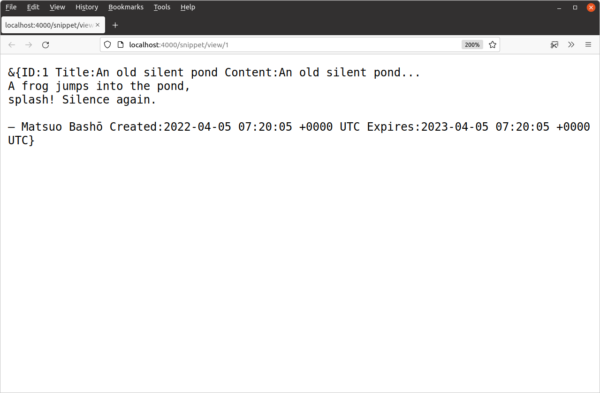

您可能还想尝试对其他已过期或尚不存在的代码片段（例如 `99` 的 `id` 值）发出一些请求，以验证它们是否返回 `404 page not found` 响应：

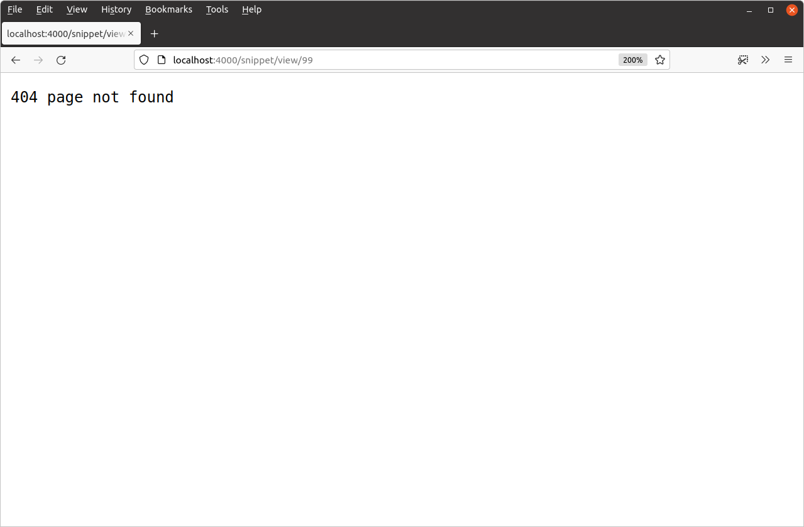

---

### 补充说明

#### 检查特定错误

在本章中，我们多次使用 [`errors.Is()`](https://tip.golang.org/pkg/errors/#Is) 函数来检查错误是否与特定值匹配。像这样：

```go
if errors.Is(err, models.ErrNoRecord) {
    http.NotFound(w, r)
} else {
    app.serverError(w, r, err)
}
```

在 Go 的非常旧的版本（1.13 之前）中，比较错误的惯用方法是使用相等运算符 `==`，如下所示：

```go
if err == models.ErrNoRecord {
    http.NotFound(w, r)
} else {
    app.serverError(w, r, err)
}
```

但是，虽然此代码仍然可以编译，但使用 `errors.Is()` 函数更安全且最佳实践。

这是因为 Go 1.13 引入了通过[*包装错误来向错误添加附加信息的功能*](https://go.dev/blog/go1.13-errors#wrapping-errors-with-w)。如果错误恰好被包装，则会创建一个全新的错误值 - 这反过来意味着无法使用常规 `==` 相等运算符检查原始底层错误的值。

`errors.Is()` 函数的工作原理是在检查匹配之前根据需要 *展开* 错误。

还有另一个函数 [`errors.As()`](https://tip.golang.org/pkg/errors/#As)，您可以使用它来检查（可能已包装的）错误是否具有特定的 *类型*。我们稍后将在本书中使用它。

#### 单记录查询简写

我故意让 `SnippetModel.Get()` 中的代码稍微冗长，以帮助澄清和强调代码幕后发生的事情。

实际上，您可以利用 `DB.QueryRow()` 中的错误被推迟到调用 `Scan()` 的事实来稍微缩短代码。它在功能上没有区别，但如果你想要的话，完全可以将代码重写为如下所示：

```go
func (m *SnippetModel) Get(id int) (Snippet, error) {
    var s Snippet
    
    err := m.DB.QueryRow("SELECT ...", id).Scan(&s.ID, &s.Title, &s.Content, &s.Created, &s.Expires)
    if err != nil {
        if errors.Is(err, sql.ErrNoRows) {
            return Snippet{}, ErrNoRecord
        } else {
             return Snippet{}, err
        }
    }

    return s, nil
}
```

---

<!-- 来源章节：04.08-multiple-record-sql-queries.md -->

*第 4.8 章。*

## 多记录 SQL 查询

最后让我们看看执行返回多行的 SQL 语句的模式。我将通过使用以下 SQL 查询更新 `SnippetModel.Latest()` 方法以返回十个 *最近创建的片段*（只要它们尚未过期）来演示这一点：

```sql
SELECT id, title, content, created, expires FROM snippets
WHERE expires > UTC_TIMESTAMP() ORDER BY id DESC LIMIT 10
```

打开 `internal/models/snippets.go` 文件并添加以下代码：

*文件：internal/models/snippets.go*

```go
package models

...

func (m *SnippetModel) Latest() ([]Snippet, error) {
    // Write the SQL statement we want to execute.
    stmt := `SELECT id, title, content, created, expires FROM snippets
    WHERE expires > UTC_TIMESTAMP() ORDER BY id DESC LIMIT 10`

    // Use the Query() method on the connection pool to execute our
    // SQL statement. This returns a sql.Rows resultset containing the result of
    // our query.
    rows, err := m.DB.Query(stmt)
    if err != nil {
        return nil, err
    }

    // We defer rows.Close() to ensure the sql.Rows resultset is
    // always properly closed before the Latest() method returns. This defer
    // statement should come *after* you check for an error from the Query()
    // method. Otherwise, if Query() returns an error, you'll get a panic
    // trying to close a nil resultset.
    defer rows.Close()

    // Initialize an empty slice to hold the Snippet structs.
    var snippets []Snippet

    // Use rows.Next to iterate through the rows in the resultset. This
    // prepares the first (and then each subsequent) row to be acted on by the
    // rows.Scan() method. If iteration over all the rows completes then the
    // resultset automatically closes itself and frees-up the underlying
    // database connection.
    for rows.Next() {
        // Create a new zeroed Snippet struct.
        var s Snippet
        // Use rows.Scan() to copy the values from each field in the row to the
        // new Snippet object that we created. Again, the arguments to row.Scan()
        // must be pointers to the place you want to copy the data into, and the
        // number of arguments must be exactly the same as the number of
        // columns returned by your statement.
        err = rows.Scan(&s.ID, &s.Title, &s.Content, &s.Created, &s.Expires)
        if err != nil {
            return nil, err
        }
        // Append it to the slice of snippets.
        snippets = append(snippets, s)
    }

    // When the rows.Next() loop has finished we call rows.Err() to retrieve any
    // error that was encountered during the iteration. It's important to
    // call this - don't assume that a successful iteration was completed
    // over the whole resultset.
    if err = rows.Err(); err != nil {
        return nil, err
    }

    // If everything went OK then return the Snippets slice.
    return snippets, nil
}
```

> **重要提示：** 在上面的代码中使用 `defer rows.Close()` 关闭结果集至关重要。只要结果集打开，它就会保持底层数据库连接打开……因此，如果此方法出现问题并且结果集未关闭，则可能会迅速导致池中的所有连接被用完。

### 在我们的处理器中使用模型

返回到 `cmd/web/handlers.go` 文件并更新 `home` 处理器以使用 `SnippetModel.Latest()` 方法，将代码片段内容转储到 HTTP 响应。现在只需注释掉与模板渲染相关的代码，如下所示：

*文件：cmd/web/handlers.go*

```go
package main

import (
    "errors"
    "fmt"
    // "html/template"
    "net/http"
    "strconv"

    "snippetbox.alexedwards.net/internal/models"
)

func (app *application) home(w http.ResponseWriter, r *http.Request) {
    w.Header().Add("Server", "Go")
    
    snippets, err := app.snippets.Latest()
    if err != nil {
        app.serverError(w, r, err)
        return
    }

    for _, snippet := range snippets {
        fmt.Fprintf(w, "%+v\n", snippet)
    }

    // files := []string{
    //     "./ui/html/base.tmpl",
    //     "./ui/html/partials/nav.tmpl",
    //     "./ui/html/pages/home.tmpl",
    // }

    // ts, err := template.ParseFiles(files...)
    // if err != nil {
    //     app.serverError(w, r, err)
    //     return
    // }

    // err = ts.ExecuteTemplate(w, "base", nil)
    // if err != nil {
    //     app.serverError(w, r, err)
    // }
}

...
```

如果您现在运行应用程序并在浏览器中访问 [`http://localhost:4000`](http://localhost:4000/)，您应该会得到类似于以下内容的响应：


---

<!-- 来源章节：04.09-transactions-and-other-details.md -->

*第 4.9 章。*

## 事务及其他细节

### 数据库/sql包

您可能已经开始意识到，`database/sql` 包本质上在您的 Go 应用程序和 SQL 数据库世界之间提供了一个标准接口。

只要您使用 `database/sql` 包，您编写的 Go 代码通常是可移植的，并且可以与任何类型的 SQL 数据库一起使用 - 无论是 MySQL、PostgreSQL、SQLite 还是其他数据库。这意味着您的应用程序与当前使用的数据库的耦合并不那么紧密，理论上您可以在将来交换数据库，而无需重新编写所有代码（特定于驱动程序的怪癖和 SQL 实现除外）。

需要注意的是，虽然 `database/sql` 通常在提供使用 SQL 数据库的标准接口方面做得很好，但 ** 不同驱动程序和数据库的操作方式存在一些特性。在开始使用新驱动程序之前，最好先阅读新驱动程序的文档，以了解任何怪癖和边缘情况。

### 冗长

如果您使用过 Ruby、Python 或 PHP，查询 SQL 数据库的代码可能会感觉有点冗长，特别是如果您习惯于处理抽象层或 ORM。

但冗长的好处是我们的代码并不神奇；我们可以准确地理解和控制正在发生的事情。经过一段时间，您会发现进行 SQL 查询的模式变得熟悉，您可以从以前的工作中复制粘贴，或者使用 GitHub copilot 等开发人员工具为您编写代码的初稿。

如果冗长的内容确实让您感到厌烦，您可能需要考虑尝试 [`jmoiron/sqlx`](https://github.com/jmoiron/sqlx) 包。它设计精良，并提供了一些很好的扩展，使 SQL 查询的处理更快、更容易。您可能需要考虑的另一个更新的选项是 [`blockloop/scan`](https://github.com/blockloop/scan) 包。

### 管理空值

Go 做得不太好的一件事是管理数据库记录中的 `NULL` 值。

假设 `snippets` 表中的 `title` 列在特定行中包含 `NULL` 值。如果我们查询该行，那么 `rows.Scan()` 将返回以下错误，因为它无法将 `NULL` 转换为字符串：

```bash
sql: Scan error on column index 1: unsupported Scan, storing driver.Value type
&lt;nil&gt; into type *string
```

粗略地说，解决此问题的方法是将扫描的字段从 `string` 类型更改为 `sql.NullString` 类型。有关工作示例，请参阅[此要点](https://gist.github.com/alexedwards/dc3145c8e2e6d2fd6cd9)。

但是，通常来说，最简单的方法就是完全避免使用 `NULL` 值。像我们在本书中所做的那样，对所有数据库列设置 `NOT NULL` 约束，并根据需要设置合理的 `DEFAULT` 值。

### 处理事务

重要的是要认识到，对 `Exec()`、`Query()` 和 `QueryRow()` 的调用可以使用 *来自 `sql.DB` 池* 的任何连接。即使您在代码中对 `Exec()` 进行了两次紧邻的调用，也不能保证它们将使用相同的数据库连接。

有时这是不可接受的。例如，如果您使用 MySQL 的 `LOCK TABLES` 命令锁定表，则必须在完全相同的连接上调用 `UNLOCK TABLES` 以避免死锁。

为了保证使用相同的连接，您可以将多个语句包装在 *事务* 中。这是基本模式：

```go
type ExampleModel struct {
    DB *sql.DB
}

func (m *ExampleModel) ExampleTransaction() error {
    // Calling the Begin() method on the connection pool creates a new sql.Tx
    // object, which represents the in-progress database transaction.
    tx, err := m.DB.Begin()
    if err != nil {
        return err
    }

    // Defer a call to tx.Rollback() to ensure it is always called before the 
    // function returns. If the transaction succeeds it will be already be 
    // committed by the time tx.Rollback() is called, making tx.Rollback() a 
    // no-op. Otherwise, in the event of an error, tx.Rollback() will rollback 
    // the changes before the function returns.
    defer tx.Rollback()

    // Call Exec() on the transaction, passing in your statement and any
    // parameters. It's important to notice that tx.Exec() is called on the
    // transaction object just created, NOT the connection pool. Although we're
    // using tx.Exec() here you can also use tx.Query() and tx.QueryRow() in
    // exactly the same way.
    _, err = tx.Exec("INSERT INTO ...")
    if err != nil {
        return err
    }

    // Carry out another transaction in exactly the same way.
    _, err = tx.Exec("UPDATE ...")
    if err != nil {
        return err
    }

    // If there are no errors, the statements in the transaction can be committed
    // to the database with the tx.Commit() method. 
    err = tx.Commit()
    return err
}
```

> **重要提示：**在函数返回之前，您必须*始终*调用`Rollback()`或`Commit()`。如果不这样做，连接将保持打开状态，并且不会返回到连接池。这可能会导致达到最大连接限制/耗尽资源。避免这种情况的最简单方法是使用 `defer tx.Rollback()` 就像上面的例子一样。

如果您想将多个 SQL 语句作为 *单个原子操作* 执行，那么事务也非常有用。只要您在出现任何错误时使用 [`tx.Rollback()`](https://pkg.go.dev/database/sql/#Tx.Rollback) 方法，事务即可确保：

- *所有*语句均成功执行；或
- *没有执行*语句，数据库保持不变。

### 准备好的报表

正如我之前提到的，`Exec()`、`Query()` 和 `QueryRow()` 方法都在幕后使用准备好的语句来帮助防止 SQL 注入攻击。他们在数据库连接上设置了准备好的语句，使用提供的参数运行它，然后关闭准备好的语句。

这可能感觉相当低效，因为我们每次都在创建和重新创建相同的准备好的语句。

理论上，更好的方法可能是使用 [`DB.Prepare()`](https://pkg.go.dev/database/sql/#DB.Prepare) 方法一次创建我们自己的准备好的语句，然后重复使用它。对于复杂的 SQL 语句（例如具有多个 JOINS 的 SQL 语句）尤其如此，*和* 经常重复（例如，批量插入数万条记录）。在这些情况下，重新准备语句的成本可能会对运行时间产生显着影响。

以下是在 Web 应用程序中使用您自己准备好的语句的基本模式：

```go

// We need somewhere to store the prepared statement for the lifetime of our
// web application. A neat way is to embed it in the model alongside the 
// connection pool.
type ExampleModel struct {
    DB         *sql.DB
    InsertStmt *sql.Stmt
}

// Create a constructor for the model, in which we set up the prepared
// statement.
func NewExampleModel(db *sql.DB) (*ExampleModel, error) {
    // Use the Prepare method to create a new prepared statement for the
    // current connection pool. This returns a sql.Stmt object which represents
    // the prepared statement.
    insertStmt, err := db.Prepare("INSERT INTO ...")
    if err != nil {
        return nil, err
    }

    // Store it in our ExampleModel struct, alongside the connection pool.
    return &ExampleModel{DB: db, InsertStmt: insertStmt}, nil
}

// Any methods implemented against the ExampleModel struct will have access to
// the prepared statement.
func (m *ExampleModel) Insert(args...) error {
    // We then need to call Exec directly against the prepared statement, rather
    // than against the connection pool. Prepared statements also support the
    // Query and QueryRow methods.
    _, err := m.InsertStmt.Exec(args...)

    return err
}

// In the web application's main function we will need to initialize a new
// ExampleModel struct using the constructor function.
func main() {
    db, err := sql.Open(...)
    if err != nil {
        logger.Error(err.Error())
        os.Exit(1)
    }
    defer db.Close()

    // Use the constructor function to create a new ExampleModel struct.
    exampleModel, err := NewExampleModel(db)
    if err != nil {
        logger.Error(err.Error())
        os.Exit(1)
    }

    // Defer a call to Close() on the prepared statement to ensure that it is
    // properly closed before our main function terminates.
    defer exampleModel.InsertStmt.Close()
}
```

但有一些事情需要警惕。

*数据库连接*上存在准备好的语句。因此，由于 Go 使用 *许多数据库连接* 池，因此实际发生的情况是，第一次使用准备好的语句（即 `sql.Stmt` 对象）时，它会在特定的数据库连接上创建。然后，`sql.Stmt` 对象会记住使用了池中的哪个连接。下次，`sql.Stmt` 对象将再次尝试使用相同的数据库连接。如果该连接已关闭或正在使用（即不空闲），则该语句将在另一个连接上重新准备。

在重负载下，可能会在多个连接上创建大量准备好的语句。这可能会导致语句准备和重新准备的频率超出您的预期，甚至会遇到服务器端语句数量的限制（在 MySQL 中，默认最大值为 16,382 个准备好的语句）。

代码也比不使用准备好的语句更复杂。

因此，需要在性能和复杂性之间进行权衡。与任何事情一样，您应该衡量实现自己准备的语句的实际性能优势，以确定它是否值得这样做。对于大多数情况，我建议使用常规的 `Query()`、`QueryRow()` 和 `Exec()` 方法（无需自己准备语句）是一个合理的起点。

---

<!-- 来源章节：05.00-dynamic-html-templates.md -->

*第 5 章。*

# 动态 HTML 模板

在本书的这一部分中，我们将集中精力在一些适当的 HTML 页面中显示 MySQL 数据库中的动态数据。

您将学习如何：

- [以简单、可扩展且类型安全的方式将动态数据](05.01-displaying-dynamic-data.md)传递到您的 HTML 模板。
- 使用Go的`html/template`包中的各种[动作和函数](05.02-template-actions-and-functions.md)来控制动态数据的显示。
- 创建 [模板缓存](05.03-caching-templates.md)，以便每个 HTTP 请求都不会从磁盘读取并解析您的模板。
- 在运行时优雅地处理[模板渲染错误](05.04-catching-runtime-errors.md)。
- 实现一种模式，将[通用动态数据](05.05-common-dynamic-data.md)传递到您的网页，而无需重复代码。
- 创建您自己的[自定义函数](05.06-custom-template-functions.md)以格式化和显示 HTML 模板中的数据。

---

<!-- 来源章节：05.01-displaying-dynamic-data.md -->

*第 5.1 章。*

## 显示动态数据

目前，我们的 `snippetView` 处理函数从数据库中获取 `models.Snippet` 对象，然后将内容转储到纯文本 HTTP 响应中。

在本章中，我们将对此进行改进，以便数据显示在正确的 HTML 网页中，如下所示：


让我们从 `snippetView` 处理器开始，添加一些代码来渲染新的 `view.tmpl` 模板文件（我们将在一分钟内创建）。希望本书前面的内容对您来说应该很熟悉。

*文件：cmd/web/handlers.go*

```go
package main

import (
    "errors"
    "fmt"
    "html/template" // Uncomment import
    "net/http"
    "strconv"

    "snippetbox.alexedwards.net/internal/models"
)

...

func (app *application) snippetView(w http.ResponseWriter, r *http.Request) {
    id, err := strconv.Atoi(r.PathValue("id"))
    if err != nil || id < 1 {
        http.NotFound(w, r)
        return
    }

    snippet, err := app.snippets.Get(id)
    if err != nil {
        if errors.Is(err, models.ErrNoRecord) {
            http.NotFound(w, r)
        } else {
            app.serverError(w, r, err)
        }
        return
    }

    // Initialize a slice containing the paths to the view.tmpl file,
    // plus the base layout and navigation partial that we made earlier.
    files := []string{
        "./ui/html/base.tmpl",
        "./ui/html/partials/nav.tmpl",
        "./ui/html/pages/view.tmpl",
    }

    // Parse the template files...
    ts, err := template.ParseFiles(files...)
    if err != nil {
        app.serverError(w, r, err)
        return
    }

    // And then execute them. Notice how we are passing in the snippet
    // data (a models.Snippet struct) as the final parameter?
    err = ts.ExecuteTemplate(w, "base", snippet)
    if err != nil {
        app.serverError(w, r, err)
    }
}

...
```

接下来，我们需要创建包含页面 HTML 标记的 `view.tmpl` 文件。但在我们开始之前，我需要解释一些理论……

作为最终参数传递给 `ts.ExecuteTemplate()` 的任何数据在 HTML 模板中均由 `.` 字符表示（称为 *dot*）。

在这种特定情况下，点的基础类型将是 `models.Snippet` 结构。当点的基础类型是结构体时，您可以通过在点后缀字段名称来渲染（或 *yield*）模板中任何导出字段的值。因此，因为我们的 `models.Snippet` 结构有一个 `Title` 字段，所以我们可以通过在模板中写入 `{{.Title}}` 来生成片段标题。

我来演示一下。在 `ui/html/pages/view.tmpl` 处创建一个新文件并添加以下标记：

```bash
$ touch ui/html/pages/view.tmpl
```

*文件：ui/html/pages/view.tmpl*

```html
{{define "title"}}Snippet #{{.ID}}{{end}}

{{define "main"}}
    <div class='snippet'>
        <div class='metadata'>
            <strong>{{.Title}}</strong>
            <span>#{{.ID}}</span>
        </div>
        <pre><code>{{.Content}}</code></pre>
        <div class='metadata'>
            <time>Created: {{.Created}}</time>
            <time>Expires: {{.Expires}}</time>
        </div>
    </div>
{{end}}
```

如果您重新启动应用程序并在浏览器中访问 [`http://localhost:4000/snippet/view/1`](http://localhost:4000/snippet/view/1)，您应该会发现相关片段已从数据库中获取，传递到模板，并且内容已正确呈现。


### 渲染多条数据

需要解释的一件重要事情是，Go 的 `html/template` 包允许您在渲染模板时传入一项（且仅一项）动态数据。但在实际应用程序中，您通常希望在同一页面中显示多条动态数据。

实现此目的的一种轻量级且类型安全的方法是将动态数据包装在一个结构中，该结构就像数据的单个“保存结构”。

让我们创建一个新的 `cmd/web/templates.go` 文件，其中包含 `templateData` 结构来完成此操作。

```bash
$ touch cmd/web/templates.go
```

*文件：cmd/web/templates.go*

```go
package main

import "snippetbox.alexedwards.net/internal/models"

// Define a templateData type to act as the holding structure for
// any dynamic data that we want to pass to our HTML templates.
// At the moment it only contains one field, but we'll add more
// to it as the build progresses.
type templateData struct {
    Snippet models.Snippet
}
```

然后让我们更新 `snippetView` 处理器以在执行模板时使用这个新结构：

*文件：cmd/web/handlers.go*

```go
package main

...

func (app *application) snippetView(w http.ResponseWriter, r *http.Request) {
    id, err := strconv.Atoi(r.PathValue("id"))
    if err != nil || id < 1 {
        http.NotFound(w, r)
        return
    }

    snippet, err := app.snippets.Get(id)
    if err != nil {
        if errors.Is(err, models.ErrNoRecord) {
            http.NotFound(w, r)
        } else {
            app.serverError(w, r, err)
        }
        return
    }

    files := []string{
        "./ui/html/base.tmpl",
        "./ui/html/partials/nav.tmpl",
        "./ui/html/pages/view.tmpl",
    }

    ts, err := template.ParseFiles(files...)
    if err != nil {
        app.serverError(w, r, err)
        return
    }

    // Create an instance of a templateData struct holding the snippet data.
    data := templateData{
        Snippet: snippet,
    }

    // Pass in the templateData struct when executing the template.
    err = ts.ExecuteTemplate(w, "base", data)
    if err != nil {
        app.serverError(w, r, err)
    }
}

...
```

现在，我们的片段数据包含在 `templateData` 结构* 内的 *`models.Snippet` 结构中。为了生成数据，我们需要将适当的字段名称链接在一起，如下所示：

*文件：ui/html/pages/view.tmpl*

```html

{{define "title"}}Snippet #{{.Snippet.ID}}{{end}}

{{define "main"}}
    <div class='snippet'>
        <div class='metadata'>
            <strong>{{.Snippet.Title}}</strong>
            <span>#{{.Snippet.ID}}</span>
        </div>
        <pre><code>{{.Snippet.Content}}</code></pre>
        <div class='metadata'>
            <time>Created: {{.Snippet.Created}}</time>
            <time>Expires: {{.Snippet.Expires}}</time>
        </div>
    </div>
{{end}}
```

请重新启动应用程序并再次访问 [`http://localhost:4000/snippet/view/1`](http://localhost:4000/snippet/view/1)。您应该会看到浏览器中呈现的页面与以前相同。

---

### 补充说明

#### 动态内容转义

`html/template` 包自动转义 `{{ }}` 标签之间产生的任何数据。这种行为对于避免跨站脚本 (XSS) 攻击非常有帮助，这也是您应该使用 `html/template` 包而不是 Go 也提供的更通用的 `text/template` 包的原因。

作为转义的示例，如果您想要生成的动态数据是：

```html
<span>{{"<script>alert('xss attack')</script>"}}</span>
```

它将被无害地呈现为：

```html
<span>&lt;script&gt;alert(&#39;xss attack&#39;)&lt;/script&gt;</span>
```

`html/template` 包也足够智能，可以使转义依赖于上下文。它将根据数据是否在包含 HTML、CSS、Javascript 或 URI 的页面部分中呈现来使用适当的转义序列。

#### 嵌套模板

需要注意的是，当您从另一个模板调用一个模板时，需要显式传递点或 *pipelined* 到被调用的模板。您可以通过将其包含在每个 `{{template}}` 或 `{{block}}` 操作的末尾来实现此目的，如下所示：

```html
{{template "main" .}}
{{block "sidebar" .}}{{end}}
```

作为一般规则，我的建议是养成在使用 `{{template}}` 或 `{{block}}` 操作调用模板时始终使用管道化点的习惯，除非您有充分的理由不这样做。

#### 调用方法

如果您在 `{{ }}` 标签之间生成的类型具有针对它定义的方法，则您可以调用这些方法（只要它们被导出并且它们仅返回单个值 - 或单个值和错误）。

例如，我们的 `.Snippet.Created` 结构体字段具有基础类型 `time.Time`，这意味着您可以通过调用其 [`Weekday()`](https://pkg.go.dev/time/#Time.Unix) 方法来呈现工作日的名称，如下所示：

```html
<span>{{.Snippet.Created.Weekday}}</span>
```

您还可以将参数传递给方法。例如，您可以使用 [`AddDate()`](https://pkg.go.dev/time/#Time.AddDate) 方法将六个月添加到时间中，如下所示：

```html
<span>{{.Snippet.Created.AddDate 0 6 0}}</span>
```

请注意，这与 Go 中调用函数的语法不同 - 参数是 *而不是*，用括号括起来，并用单个空格字符而不是逗号分隔。

#### HTML 注释

最后，`html/template` 包始终删除您在模板中包含的任何 HTML 注释，包括任何 [条件注释](https://en.wikipedia.org/wiki/Conditional_comment)。

这样做的原因是为了在渲染动态内容时帮助避免 XSS 攻击。允许条件注释意味着 Go 并不总是能够预测浏览器将如何解释页面中的标记，因此它不一定能够适当地转义所有内容。为了解决这个问题，Go 只需删除 *所有* HTML 注释。

---

<!-- 来源章节：05.02-template-actions-and-functions.md -->

*第 5.2 章。*

## 模板操作与函数

在本节中，我们将了解 Go 提供的模板 *actions* 和 *functions*。

我们已经讨论了一些操作 - `{{define}}`、`{{template}}` 和 `{{block}}` - 但您还可以使用另外三个操作来控制动态数据的显示 - `{{if}}`、`{{with}}` 和 `{{range}}`。

| 行动 | 描述 |
| --- | --- |
| `{{if .Foo}} C1 {{else}} C2 {{end}}` | 如果 `.Foo` 不为空则渲染内容 C1，否则渲染内容 C2。 |
| `{{with .Foo}} C1 {{else}} C2 {{end}}` | 如果 `.Foo` 不为空，则将 dot 设置为 `.Foo` 的值并渲染内容 C1，否则渲染内容 C2。 |
| `{{range .Foo}} C1 {{else}} C2 {{end}}` | 如果 `.Foo` 的长度大于零，则循环遍历每个元素，将 dot 设置为每个元素的值并渲染内容 C1。如果 `.Foo` 的长度为零，则渲染内容 C2。 `.Foo` 的基础类型必须是数组、切片、映射或通道。 |

关于这些行动，有几点需要指出：

- 对于所有三个操作，`{{else}}` 子句是可选的。例如，如果没有要渲染的 `C2` 内容，您可以编写 `{{if .Foo}} C1 {{end}}`。
- *empty* 值为 false、0、任何 nil 指针或接口值以及长度为零的任何数组、切片、映射或字符串。
- 重要的是要了解 `with` 和 `range` 操作会更改点的值。一旦开始使用它们，*点代表的内容可能会有所不同，具体取决于您在模板中的位置以及您正在执行的操作。*

`html/template` 包还提供了一些模板函数，您可以使用它们向模板添加额外的逻辑并控制在运行时呈现的内容。您可以在[此处](https://pkg.go.dev/text/template/#hdr-Functions)找到完整的函数列表，但最重要的是：

| 功能 | 描述 |
| --- | --- |
| `{{eq .Foo .Bar}}` | 如果 `.Foo` 等于 `.Bar`，则结果为 true |
| `{{ne .Foo .Bar}}` | 如果 `.Foo` 不等于 `.Bar`，则结果为 true |
| `{{not .Foo}}` | 产生 `.Foo` 的布尔否定 |
| `{{or .Foo .Bar}}` | 如果 `.Foo` 不为空，则返回 `.Foo`；否则产生 `.Bar` |
| `{{index .Foo i}}` | 产生索引 `i` 处 `.Foo` 的值。 `.Foo` 的基础类型必须是映射、切片或数组，并且 `i` 必须是整数值。 |
| `{{printf "%s-%s" .Foo .Bar}}` | 生成包含 `.Foo` 和 `.Bar` 值的格式化字符串。工作方式与 fmt.Sprintf() 相同。 |
| `{{len .Foo}}` | 产生整数 `.Foo` 的长度。 |
| `{{$bar := len .Foo}}` | 将 `.Foo` 的长度分配给模板变量 `$bar` |

最后一行是声明 *模板变量* 的示例。如果您想要存储函数的结果并在模板中的多个位置使用它，模板变量特别有用。变量名称必须以美元符号为前缀，并且只能包含字母数字字符。

### 使用 with 动作

使用 `{{with}}` 操作的一个好机会是我们在上一章中创建的 `view.tmpl` 文件。继续更新它，如下所示：

*文件：ui/html/pages/view.tmpl*

```html

{{define "title"}}Snippet #{{.Snippet.ID}}{{end}}

{{define "main"}}
    {{with .Snippet}}
    <div class='snippet'>
        <div class='metadata'>
            <strong>{{.Title}}</strong>
            <span>#{{.ID}}</span>
        </div>
        <pre><code>{{.Content}}</code></pre>
        <div class='metadata'>
            <time>Created: {{.Created}}</time>
            <time>Expires: {{.Expires}}</time>
        </div>
    </div>
    {{end}}
{{end}}
```

所以现在，在`{{with .Snippet}}`和对应的`{{end}}`标签之间，dot的值被设置为`.Snippet`。 Dot 本质上成为 `models.Snippet` 结构而不是父 `templateData` 结构。

### 使用 if 和 range 操作

我们还在具体示例中使用 `{{if}}` 和 `{{range}}` 操作，并更新我们的主页以显示最新片段的表格，有点像这样：


首先更新 `templateData` 结构，使其包含一个 `Snippets` 字段来保存片段片段，如下所示：

*文件：cmd/web/templates.go*

```go
package main

import "snippetbox.alexedwards.net/internal/models"

// Include a Snippets field in the templateData struct.
type templateData struct {
    Snippet  models.Snippet
    Snippets []models.Snippet
}
```

然后更新 `home` 处理函数，以便它从我们的数据库模型中获取最新的片段并将它们传递给 `home.tmpl` 模板：

*文件：cmd/web/handlers.go*

```go
package main

...

func (app *application) home(w http.ResponseWriter, r *http.Request) {
    w.Header().Add("Server", "Go")
    
    snippets, err := app.snippets.Latest()
    if err != nil {
        app.serverError(w, r, err)
        return
    }

    files := []string{
        "./ui/html/base.tmpl",
        "./ui/html/partials/nav.tmpl",
        "./ui/html/pages/home.tmpl",
    }

    ts, err := template.ParseFiles(files...)
    if err != nil {
        app.serverError(w, r, err)
        return
    }

    // Create an instance of a templateData struct holding the slice of
    // snippets.
    data := templateData{
        Snippets: snippets,
    }

    // Pass in the templateData struct when executing the template.
    err = ts.ExecuteTemplate(w, "base", data)
    if err != nil {
        app.serverError(w, r, err)
    }
}

...
```

现在，让我们转到 `ui/html/pages/home.tmpl` 文件并更新它，以使用 `{{if}}` 和 `{{range}}` 操作在表格中显示这些片段。具体来说：

- 我们想要使用 `{{if}}` 操作来检查片段切片是否为空。如果它是空的，我们要显示一条 `"There's nothing to see here yet!` 消息。否则，我们想要渲染一个包含片段信息的表。
- 我们希望使用 `{{range}}` 操作来迭代切片中的所有片段，从而在表行中呈现每个片段的内容。

这是标记：

*文件：ui/html/pages/home.tmpl*

```html

{{define "title"}}Home{{end}}

{{define "main"}}
    <h2>Latest Snippets</h2>
    {{if .Snippets}}
     <table>
        <tr>
            <th>Title</th>
            <th>Created</th>
            <th>ID</th>
        </tr>
        {{range .Snippets}}
        <tr>
            <td><a href='/snippet/view/{{.ID}}'>{{.Title}}</a></td>
            <td>{{.Created}}</td>
            <td>#{{.ID}}</td>
        </tr>
        {{end}}
    </table>
    {{else}}
        <p>There's nothing to see here... yet!</p>
    {{end}}
{{end}}
```

确保所有文件均已保存，重新启动应用程序并在网络浏览器中访问 [`http://localhost:4000`](http://localhost:4000/)。如果一切都按计划进行，您应该会看到一个看起来有点像这样的页面：


---

### 补充说明

#### 组合功能

可以在模板标签中组合多个函数，根据需要使用括号 `()` 将函数及其参数括起来。

例如，如果 `Foo` 的长度大于 99，以下标记将渲染内容 `C1`：

```text
{{if (gt (len .Foo) 99)}} C1 {{end}}
```

或者作为另一个示例，如果 `.Foo` 等于 1 *并且* `.Bar` 小于或等于 20，以下标记将渲染内容 `C1`：

```text
{{if (and (eq .Foo 1) (le .Bar 20))}} C1 {{end}}
```

#### 控制循环行为

在 `{{range}}` 操作中，您可以使用 `{{break}}` 命令提前结束循环，并使用 `{{continue}}` 立即开始下一个循环迭代。

```go
{{range .Foo}}
    // Skip this iteration if the .ID value equals 99.
    {{if eq .ID 99}}
        {{continue}}
    {{end}}
    // ...
{{end}}
```

```go
{{range .Foo}}
    // End the loop if the .ID value equals 99.
    {{if eq .ID 99}}
        {{break}}
    {{end}}
    // ...
{{end}}
```

---

<!-- 来源章节：05.03-caching-templates.md -->

*第 5.3 章。*

## 缓存模板

在向 HTML 模板添加更多功能之前，是对代码库进行一些优化的好时机。目前主要有两个问题：

1. 每次我们渲染网页时，我们的应用程序都会使用 `template.ParseFiles()` 函数读取并解析相关的模板文件。我们可以通过在启动应用程序时解析一次文件并将解析后的模板存储在内存中的*缓存*中来避免这种重复的工作。
2. `home` 和 `snippetView` 处理器中存在重复的代码，我们可以通过创建辅助函数来减少这种重复。

让我们首先解决第一点，并创建一个类型为 `map[string]*template.Template` 的内存映射来缓存解析的模板。打开您的 `cmd/web/templates.go` 文件并添加以下代码：

*文件：cmd/web/templates.go*

```go
package main

import (
    "html/template" // New import
    "path/filepath" // New import

    "snippetbox.alexedwards.net/internal/models"
)

...

func newTemplateCache() (map[string]*template.Template, error) {
    // Initialize a new map to act as the cache.
    cache := map[string]*template.Template{}

    // Use the filepath.Glob() function to get a slice of all filepaths that
    // match the pattern "./ui/html/pages/*.tmpl". This will essentially gives
    // us a slice of all the filepaths for our application 'page' templates
    // like: [ui/html/pages/home.tmpl ui/html/pages/view.tmpl]
    pages, err := filepath.Glob("./ui/html/pages/*.tmpl")
    if err != nil {
        return nil, err
    }

    // Loop through the page filepaths one-by-one.
    for _, page := range pages {
        // Extract the file name (like 'home.tmpl') from the full filepath
        // and assign it to the name variable.
        name := filepath.Base(page)

        // Create a slice containing the filepaths for our base template, any
        // partials and the page.
        files := []string{
            "./ui/html/base.tmpl",
            "./ui/html/partials/nav.tmpl",
            page,
        }

        // Parse the files into a template set.
        ts, err := template.ParseFiles(files...)
        if err != nil {
            return nil, err
        }

        // Add the template set to the map, using the name of the page
        // (like 'home.tmpl') as the key.
        cache[name] = ts
    }

    // Return the map.
    return cache, nil
}
```

下一步是在 `main()` 函数中初始化此缓存，并通过 `application` 结构将其作为依赖项提供给我们的处理器，如下所示：

*文件：cmd/web/main.go*

```go
package main

import (
    "database/sql"
    "flag"
    "html/template" // New import
    "log/slog"
    "net/http"
    "os"

    "snippetbox.alexedwards.net/internal/models"

    _ "github.com/go-sql-driver/mysql"
)

// Add a templateCache field to the application struct.
type application struct {
    logger        *slog.Logger
    snippets      *models.SnippetModel
    templateCache map[string]*template.Template
}

func main() {
    addr := flag.String("addr", ":4000", "HTTP network address")
    dsn := flag.String("dsn", "web:pass@/snippetbox?parseTime=true", "MySQL data source name")
    flag.Parse()

    logger := slog.New(slog.NewTextHandler(os.Stdout, nil))

    db, err := openDB(*dsn)
    if err != nil {
        logger.Error(err.Error())
        os.Exit(1)
    }
    defer db.Close()

    // Initialize a new template cache...
    templateCache, err := newTemplateCache()
    if err != nil {
        logger.Error(err.Error())
        os.Exit(1)
    }

    // And add it to the application dependencies.
    app := &application{
        logger:        logger,
        snippets:      &models.SnippetModel{DB: db},
        templateCache: templateCache,
    }

    logger.Info("starting server", "addr", *addr)

    err = http.ListenAndServe(*addr, app.routes())
    logger.Error(err.Error())
    os.Exit(1)
}

...
```

因此，此时，我们已经为每个页面设置了相关模板集的内存缓存，并且我们的处理器可以通过 `application` 结构访问此缓存。

现在让我们解决重复代码的第二个问题，并创建一个辅助方法，以便我们可以轻松地从缓存中渲染模板。

打开您的 `cmd/web/helpers.go` 文件并添加以下 `render()` 方法：

*文件：cmd/web/helpers.go*

```go
package main

import (
    "fmt" // New import
    "net/http"
)

...

func (app *application) render(w http.ResponseWriter, r *http.Request, status int, page string, data templateData) {
    // Retrieve the appropriate template set from the cache based on the page
    // name (like 'home.tmpl'). If no entry exists in the cache with the
    // provided name, then create a new error and call the serverError() helper
    // method that we made earlier and return.
    ts, ok := app.templateCache[page]
    if !ok {
        err := fmt.Errorf("the template %s does not exist", page)
        app.serverError(w, r, err)
        return
    }

    // Write out the provided HTTP status code ('200 OK', '400 Bad Request' etc).
    w.WriteHeader(status)

    // Execute the template set and write the response body. Again, if there
    // is any error we call the serverError() helper.
    err := ts.ExecuteTemplate(w, "base", data)
    if err != nil {
        app.serverError(w, r, err)
    }
}
```

完成后，我们现在可以看到这些更改的回报，并且可以极大地简化处理器中的代码：

*文件：cmd/web/handlers.go*

```go
package main

import (
    "errors"
    "fmt"
    "net/http"
    "strconv"

    "snippetbox.alexedwards.net/internal/models"
)

func (app *application) home(w http.ResponseWriter, r *http.Request) {
    w.Header().Add("Server", "Go")
    
    snippets, err := app.snippets.Latest()
    if err != nil {
        app.serverError(w, r, err)
        return
    }

    // Use the new render helper.
    app.render(w, r, http.StatusOK, "home.tmpl", templateData{
        Snippets: snippets,
    })
}

func (app *application) snippetView(w http.ResponseWriter, r *http.Request) {
    id, err := strconv.Atoi(r.PathValue("id"))
    if err != nil || id < 1 {
        http.NotFound(w, r)
        return
    }

    snippet, err := app.snippets.Get(id)
    if err != nil {
        if errors.Is(err, models.ErrNoRecord) {
            http.NotFound(w, r)
        } else {
            app.serverError(w, r, err)
        }
        return
    }

    // Use the new render helper.
    app.render(w, r, http.StatusOK, "view.tmpl", templateData{
        Snippet: snippet,
    })
}

...
```

如果您重新启动应用程序并尝试再次访问 [`http://localhost:4000`](http://localhost:4000/) 和 [`http://localhost:4000/snippet/view/1`](http://localhost:4000/snippet/view/1)，您应该会看到页面的呈现方式与以前完全相同。


### 自动解析部分

在继续之前，让我们让 `newTemplateCache()` 函数更加灵活，以便它自动解析 *`ui/html/partials` 文件夹* 中的所有模板 — 而不仅仅是我们的 `nav.tmpl` 文件。

如果我们想在将来添加额外的部分，这将节省我们的时间、打字和潜在的错误。

*文件：cmd/web/templates.go*

```go
package main

...

func newTemplateCache() (map[string]*template.Template, error) {
    cache := map[string]*template.Template{}

    pages, err := filepath.Glob("./ui/html/pages/*.tmpl")
    if err != nil {
        return nil, err
    }

    for _, page := range pages {
        name := filepath.Base(page)

        // Parse the base template file into a template set.
        ts, err := template.ParseFiles("./ui/html/base.tmpl")
        if err != nil {
            return nil, err
        }

        // Call ParseGlob() *on this template set* to add any partials.
        ts, err = ts.ParseGlob("./ui/html/partials/*.tmpl")
        if err != nil {
            return nil, err
        }

        // Call ParseFiles() *on this template set* to add the  page template.
        ts, err = ts.ParseFiles(page)
        if err != nil {
            return nil, err
        }

        // Add the template set to the map as normal...
        cache[name] = ts
    }

    return cache, nil
}
```

---

<!-- 来源章节：05.04-catching-runtime-errors.md -->

*第 5.4 章。*

## 捕获运行时错误

一旦我们开始向 HTML 模板添加动态行为，就有遇到运行时错误的风险。

让我们向 `view.tmpl` 模板添加一个故意错误，看看会发生什么：

*文件：ui/html/pages/view.tmpl*

```html
{{define "title"}}Snippet #{{.Snippet.ID}}{{end}}

{{define "main"}}
    {{with .Snippet}}
    <div class='snippet'>
        <div class='metadata'>
            <strong>{{.Title}}</strong>
            <span>#{{.ID}}</span>
        </div>
        {{len nil}} <!-- Deliberate error -->
        <pre><code>{{.Content}}</code></pre>
        <div class='metadata'>
            <time>Created: {{.Created}}</time>
            <time>Expires: {{.Expires}}</time>
        </div>
    </div>
    {{end}}
{{end}}
```

在上面的标记中，我们添加了行 `{{len  nil}}`，该行应该在运行时生成错误，因为在 Go 中，值 `nil` 没有长度。

现在尝试运行该应用程序。你会发现一切仍然编译正常：

```bash
$ go run ./cmd/web
time=2024-03-18T11:29:23.000+00:00 level=INFO msg="starting server" addr=:4000
```

但是，如果您使用curl向[`http://localhost:4000/snippet/view/1`](http://localhost:4000/snippet/view/1)发出请求，您将得到类似于这样的响应。

```bash
$ curl -i http://localhost:4000/snippet/view/1
HTTP/1.1 200 OK
Date: Wed, 18 Mar 2024 11:29:23 GMT
Content-Length: 734
Content-Type: text/html; charset=utf-8

<!doctype html>
<html lang='en'>
    <head>
        <meta charset='utf-8'>
        <title>Snippet #1 - Snippetbox</title>
        <link rel='stylesheet' href='/static/css/main.css'>
        <link rel='shortcut icon' href='/static/img/favicon.ico' type='image/x-icon'>
        <link rel='stylesheet' href='https://fonts.googleapis.com/css?family=Ubuntu+Mono:400,700'>
    </head>
    <body>
        <header>
            <h1><a href='/'>Snippetbox</a></h1>
        </header>
        
 <nav>
    <a href='/'>Home</a>
</nav>

        <main>
            
    
    <div class='snippet'>
        <div class='metadata'>
            <strong>An old silent pond</strong>
            <span>#1</span>
        </div>
        Internal Server Error
```

这很糟糕。我们的应用程序引发了错误，但用户错误地收到了 `200 OK` 响应。更糟糕的是，他们收到了半完整的 HTML 页面。

为了解决这个问题，我们需要使模板呈现一个两阶段的过程。首先，我们应该通过将模板写入缓冲区来进行“试验”渲染。如果失败，我们可以用错误消息响应用户。但如果它有效，我们就可以将缓冲区的内容写入我们的 `http.ResponseWriter`。

让我们更新 `render()` 帮助器以使用这种方法：

*文件：cmd/web/helpers.go*

```go
package main

import (
    "bytes" // New import
    "fmt"
    "net/http"
)

...

func (app *application) render(w http.ResponseWriter, r *http.Request, status int, page string, data templateData) {
    ts, ok := app.templateCache[page]
    if !ok {
        err := fmt.Errorf("the template %s does not exist", page)
        app.serverError(w, r, err)
        return
    }

    // Initialize a new buffer.
    buf := new(bytes.Buffer)

    // Write the template to the buffer, instead of straight to the
    // http.ResponseWriter. If there's an error, call our serverError() helper
    // and then return.
    err := ts.ExecuteTemplate(buf, "base", data)
    if err != nil {
        app.serverError(w, r, err)
        return
    }

    // If the template is written to the buffer without any errors, we are safe
    // to go ahead and write the HTTP status code to http.ResponseWriter.
    w.WriteHeader(status)

    // Write the contents of the buffer to the http.ResponseWriter. Note: this
    // is another time where we pass our http.ResponseWriter to a function that
    // takes an io.Writer.
    buf.WriteTo(w)
}
```

重新启动应用程序并尝试再次发出相同的请求。您现在应该收到正确的错误消息和 `500 Internal Server Error` 响应。

```bash
$ curl -i http://localhost:4000/snippet/view/1
HTTP/1.1 500 Internal Server Error
Content-Type: text/plain; charset=utf-8
X-Content-Type-Options: nosniff
Date: Wed, 18 Mar 2024 11:29:23 GMT
Content-Length: 22

Internal Server Error
```

很棒的东西。看起来好多了。

在我们继续下一章之前，请返回 `view.tmpl` 文件并删除故意错误：

*文件：ui/html/pages/view.tmpl*

```html
{{define "title"}}Snippet #{{.Snippet.ID}}{{end}}

{{define "main"}}
    {{with .Snippet}}
    <div class='snippet'>
        <div class='metadata'>
            <strong>{{.Title}}</strong>
            <span>#{{.ID}}</span>
        </div>
        <pre><code>{{.Content}}</code></pre>
        <div class='metadata'>
            <time>Created: {{.Created}}</time>
            <time>Expires: {{.Expires}}</time>
        </div>
    </div>
    {{end}}
{{end}}
```

---

<!-- 来源章节：05.05-common-dynamic-data.md -->

*第 5.5 章。*

## 常用动态数据

在某些 Web 应用程序中，您可能希望将常见的动态数据包含在多个（甚至每个）网页上。例如，您可能希望在所有带有表单的页面中包含当前用户的姓名和个人资料图片，或 CSRF 令牌。

在我们的例子中，让我们从简单的事情开始，假设我们希望在每个页面的页脚中包含当前年份。

为此，我们首先向 `templateData` 结构添加一个新的 `CurrentYear` 字段，如下所示：

*文件：cmd/web/templates.go*

```go
package main

...

// Add a CurrentYear field to the templateData struct.
type templateData struct {
    CurrentYear int
    Snippet     models.Snippet
    Snippets    []models.Snippet
}

...
```

下一步是向我们的应用程序添加一个 `newTemplateData()` 辅助方法，该方法将返回一个使用当前年份初始化的 `templateData` 结构体。

我将演示：

*文件：cmd/web/helpers.go*

```go
package main

import (
    "bytes"
    "fmt"
    "net/http"
    "time" // New import
)

...

// Create an newTemplateData() helper, which returns a templateData struct 
// initialized with the current year. Note that we're not using the *http.Request 
// parameter here at the moment, but we will do later in the book.
func (app *application) newTemplateData(r *http.Request) templateData {
    return templateData{
        CurrentYear: time.Now().Year(),
    }
}

...
```

然后让我们更新 `home` 和 `snippetView` 处理器以使用 `newTemplateData()` 帮助程序，如下所示：

*文件：cmd/web/handlers.go*

```go
package main

...

func (app *application) home(w http.ResponseWriter, r *http.Request) {
    w.Header().Add("Server", "Go")
    
    snippets, err := app.snippets.Latest()
    if err != nil {
        app.serverError(w, r, err)
        return
    }

    // Call the newTemplateData() helper to get a templateData struct containing
    // the 'default' data (which for now is just the current year), and add the
    // snippets slice to it.
    data := app.newTemplateData(r)
    data.Snippets = snippets

    // Pass the data to the render() helper as normal.
    app.render(w, r, http.StatusOK, "home.tmpl", data)
}

func (app *application) snippetView(w http.ResponseWriter, r *http.Request) {
    id, err := strconv.Atoi(r.PathValue("id"))
    if err != nil || id < 1 {
        http.NotFound(w, r)
        return
    }

    snippet, err := app.snippets.Get(id)
    if err != nil {
        if errors.Is(err, models.ErrNoRecord) {
            http.NotFound(w, r)
        } else {
            app.serverError(w, r, err)
        }
        return
    }

    // And do the same thing again here...
    data := app.newTemplateData(r)
    data.Snippet = snippet

    app.render(w, r, http.StatusOK, "view.tmpl", data)
}

...
```

然后我们需要做的最后一件事是更新 `ui/html/base.tmpl` 文件以在页脚中显示年份，如下所示：

*文件：ui/html/base.tmpl*

```html
{{define "base"}}
<!doctype html>
<html lang='en'>
    <head>
        <meta charset='utf-8'>
        <title>{{template "title" .}} - Snippetbox</title>
        <link rel='stylesheet' href='/static/css/main.css'>
        <link rel='shortcut icon' href='/static/img/favicon.ico' type='image/x-icon'>
        <link rel='stylesheet' href='https://fonts.googleapis.com/css?family=Ubuntu+Mono:400,700'>
    </head>
    <body>
        <header>
            <h1><a href='/'>Snippetbox</a></h1>
        </header>
        {{template "nav" .}}
        <main>
            {{template "main" .}}
        </main>
        <footer>
            <!-- Update the footer to include the current year -->
            Powered by <a href='https://golang.org/'>Go</a> in {{.CurrentYear}}
        </footer>
        <script src='/static/js/main.js' type='text/javascript'></script>
    </body>
</html>
{{end}}
```

如果您重新启动应用程序并访问主页 [`http://localhost:4000`](http://localhost:4000/)，您现在应该在页脚中看到当前年份。像这样：


---

<!-- 来源章节：05.06-custom-template-functions.md -->

*第 5.6 章。*

## 自定义模板函数

在本节关于模板和动态数据的最后一部分中，我想解释如何创建您自己的自定义函数以在 Go 模板中使用。

为了说明这一点，让我们创建一个自定义的 `humanDate()` 函数，它以 `1 Jan 2024 at 10:47` 或 `18 Mar 2024 at 15:04` 等良好的“人性化”格式输出日期时间，而不是像我们当前那样以 `YYYY-MM-DD HH:MM:SS +0000 UTC` 的默认格式输出日期。

执行此操作有两个主要步骤：

1. 我们需要创建一个包含自定义 `humanDate()` 函数的 [`template.FuncMap`](https://pkg.go.dev/text/template/#FuncMap) 对象。
2. 在解析模板之前，我们需要使用 [`template.Funcs()`](https://pkg.go.dev/html/template/#Template.Funcs) 方法来注册它。

继续将以下代码添加到您的 `templates.go` 文件中：

*文件：cmd/web/templates.go*

```go
package main

import (
    "html/template"
    "path/filepath"
    "time" // New import

    "snippetbox.alexedwards.net/internal/models"
)

...

// Create a humanDate function which returns a nicely formatted string
// representation of a time.Time object.
func humanDate(t time.Time) string {
    return t.Format("02 Jan 2006 at 15:04")
}

// Initialize a template.FuncMap object and store it in a global variable. This is
// essentially a string-keyed map which acts as a lookup between the names of our
// custom template functions and the functions themselves.
var functions = template.FuncMap{
    "humanDate": humanDate,
}

func newTemplateCache() (map[string]*template.Template, error) {
    cache := map[string]*template.Template{}

    pages, err := filepath.Glob("./ui/html/pages/*.tmpl")
    if err != nil {
        return nil, err
    }

    for _, page := range pages {
        name := filepath.Base(page)

        // The template.FuncMap must be registered with the template set before you
        // call the ParseFiles() method. This means we have to use template.New() to
        // create an empty template set, use the Funcs() method to register the
        // template.FuncMap, and then parse the file as normal.
        ts, err := template.New(name).Funcs(functions).ParseFiles("./ui/html/base.tmpl")
        if err != nil {
            return nil, err
        }

        ts, err = ts.ParseGlob("./ui/html/partials/*.tmpl")
        if err != nil {
            return nil, err
        }

        ts, err = ts.ParseFiles(page)
        if err != nil {
            return nil, err
        }

        cache[name] = ts
    }

    return cache, nil
}
```

在继续之前，我应该解释一下：自定义模板函数（例如我们的 `humanDate()` 函数）可以接受所需数量的参数，但它们 *必须* 仅返回一个值。唯一的例外是如果您想返回错误作为第二个值，在这种情况下也可以。

现在我们可以像内置模板函数一样使用我们的 `humanDate()` 函数：

*文件：ui/html/pages/home.tmpl*

```html

{{define "title"}}Home{{end}}

{{define "main"}}
    <h2>Latest Snippets</h2>
    {{if .Snippets}}
     <table>
        <tr>
            <th>Title</th>
            <th>Created</th>
            <th>ID</th>
        </tr>
        {{range .Snippets}}
        <tr>
            <td><a href='/snippet/view/{{.ID}}'>{{.Title}}</a></td>
            <!-- Use the new template function here -->
            <td>{{humanDate .Created}}</td>
            <td>#{{.ID}}</td>
        </tr>
        {{end}}
    </table>
    {{else}}
        <p>There's nothing to see here... yet!</p>
    {{end}}
{{end}}
```

*文件：ui/html/pages/view.tmpl*

```html

{{define "title"}}Snippet #{{.Snippet.ID}}{{end}}

{{define "main"}}
    {{with .Snippet}}
    <div class='snippet'>
        <div class='metadata'>
            <strong>{{.Title}}</strong>
            <span>#{{.ID}}</span>
        </div>
        <pre><code>{{.Content}}</code></pre>
        <div class='metadata'>
            <!-- Use the new template function here -->
            <time>Created: {{humanDate .Created}}</time>
            <time>Expires: {{humanDate .Expires}}</time>
        </div>
    </div>
    {{end}}
{{end}}
```

完成后，重新启动应用程序。如果您在浏览器中访问 [`http://localhost:4000`](http://localhost:4000/) 和 [`http://localhost:4000/snippet/view/1`](http://localhost:4000/snippet/view/1)，您应该会看到正在使用的新的、格式良好的日期。

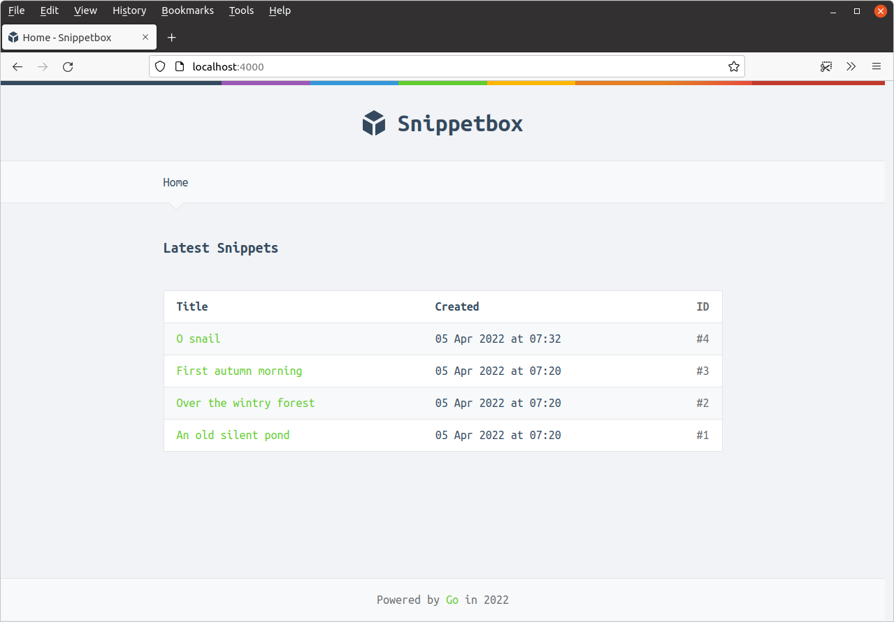

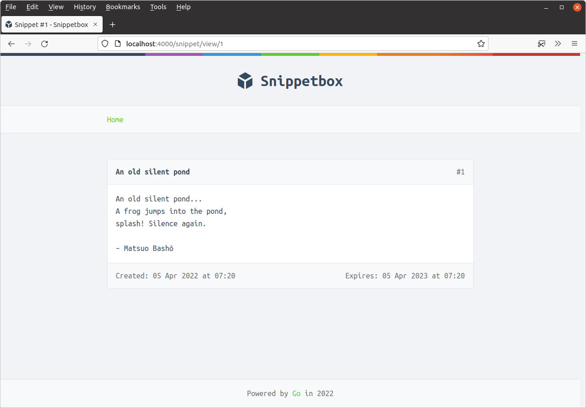

---

### 补充说明

#### 流水线

在上面的代码中，我们这样调用自定义模板函数：

```html
<time>Created: {{humanDate .Created}}</time>
```

另一种方法是使用 `|` 字符将 *pipeline* 值传递给函数。这有点像 Unix 终端中从一个命令到另一个命令的管道输出。我们可以将上面的内容重写为：

```html
<time>Created: {{.Created | humanDate}}</time>
```

管道的一个很好的功能是，您可以创建任意长的模板函数链，这些模板函数使用一个函数的输出作为下一个函数的输入。例如，我们可以将 `humanDate` 函数的输出通过管道传输到内置的 `printf` 函数，如下所示：

```html
<time>{{.Created | humanDate | printf "Created: %s"}}</time>
```

---

<!-- 来源章节：06.00-middleware.md -->

*第 6 章。*

# 中间件

当您构建 Web 应用程序时，您可能希望将一些共享功能用于许多（甚至所有）HTTP 请求。例如，您可能希望在将请求传递给处理器之前记录每个请求、压缩每个响应或检查缓存。

组织此共享功能的常见方法是将其设置为 *中间件*。这本质上是一些独立的代码，在正常的应用程序处理器之前或之后独立地对请求进行操作。

在本书的这一部分中，您将学到：

- [构建和使用自定义中间件](06.01-how-middleware-works.md)的惯用模式，与`net/http`和许多第三方软件包兼容。
- 如何创建中间件，在每个 HTTP 响应上 [设置通用 HTTP 标头](06.02-setting-common-headers.md)。
- 如何创建[记录应用程序收到的请求](06.03-request-logging.md)的中间件。
- 如何创建[恢复panic](06.04-panic-recovery.md)的中间件，以便您的应用程序可以优雅地处理它们。
- 如何创建和使用可组合的[中间件链](06.05-composable-middleware-chains.md)来帮助管理和组织您的中间件。

---

<!-- 来源章节：06.01-how-middleware-works.md -->

*第 6.1 章。*

## 中间件如何工作

[在本书的前面](02.10-the-http-handler-interface.md)我说过一些我想在本章中扩展的内容：

> “你可以将 Go Web 应用程序视为一系列被依次调用的 `ServeHTTP()` 方法。”

目前，在我们的应用程序中，当我们的服务器收到新的 HTTP 请求时，它会调用ServeMux的 `ServeHTTP()` 方法。这会根据请求方法和 URL 路径查找相关处理器，然后调用该处理器的 `ServeHTTP()` 方法。

中间件的基本思想是在这个链中插入另一个处理器。中间件处理器执行一些逻辑，例如记录请求，然后调用链中 *next* 处理器的 `ServeHTTP()` 方法。

事实上，我们实际上已经在应用程序中使用了一些中间件——[提供静态文件](02.09-serving-static-files.md)中的`http.StripPrefix()`函数，它在将请求传递到文件服务器之前从请求的URL路径中删除特定的前缀。

### 图案

创建自己的中间件的标准模式如下所示：

```go
func myMiddleware(next http.Handler) http.Handler {
    fn := func(w http.ResponseWriter, r *http.Request) {
        // TODO: Execute our middleware logic here...
        next.ServeHTTP(w, r)
    }

    return http.HandlerFunc(fn)
}
```

代码本身非常简洁，但其中有很多内容需要您理解。

- `myMiddleware()` 函数本质上是 `next` 处理器的包装器，我们将其作为参数传递给它。
- 它建立一个函数 `fn`，该函数 *关闭* 处理器以形成闭包。当 `fn` 运行时，它会执行我们的中间件逻辑，然后通过调用 `next` 处理器的 `ServeHTTP()` 方法将控制权转移到它。
- 不管你对闭包做什么，它总是能够访问它创建的范围的本地变量——在这种情况下，这意味着 `fn` 将始终能够访问 `next` 变量。
- 在代码的最后一行中，我们将此闭包转换为 `http.Handler` 并使用 `http.HandlerFunc()` 适配器返回它。

如果这感觉令人困惑，您可以更简单地考虑它： `myMiddleware()` 是一个接受链中下一个处理器作为参数的函数。它 *返回一个处理器*，该处理器执行一些逻辑，然后调用下一个处理器。

### 简化中间件

对此模式的一个调整是在 `myMiddleware()` 中间件中使用匿名函数，如下所示：

```go
func myMiddleware(next http.Handler) http.Handler {
    return http.HandlerFunc(func(w http.ResponseWriter, r *http.Request) {
        // TODO: Execute our middleware logic here...
        next.ServeHTTP(w, r)
    })
}
```

这种模式在野外非常常见，如果您正在阅读其他应用程序或第三方软件包的源代码，您可能会最常看到这种模式。

### 定位中间件

重要的是要解释一下，中间件在处理器链中的位置将影响应用程序的行为。

如果您将中间件放置在链中的ServeMux之前，那么它将对您的应用程序收到的每个请求进行操作。

```text
myMiddleware → servemux → application handler
```

一个很好的例子就是记录请求的中间件，因为这通常是您想要对 *all* 请求执行的操作。

或者，您可以通过包装特定的应用程序处理器将中间件定位在链中的ServeMux之后。这将导致您的中间件仅针对特定路由执行。

```text
servemux → myMiddleware → application handler
```

一个例子是授权中间件，您可能只想在特定的路由上运行。

随着本书的进展，我们将演示如何在实践中完成这两件事。

---

<!-- 来源章节：06.02-setting-common-headers.md -->

*第 6.2 章。*

## 设置通用标头

让我们使用上一章中学到的模式，并制作一些中间件，自动将 `Server: Go` 标头添加到每个响应中，以及以下 HTTP 安全标头（与 [当前 OWASP 指南](https://owasp.org/www-project-secure-headers) 一致）。

```text
Content-Security-Policy: default-src 'self'; style-src 'self' fonts.googleapis.com; font-src fonts.gstatic.com
Referrer-Policy: origin-when-cross-origin
X-Content-Type-Options: nosniff
X-Frame-Options: deny
X-XSS-Protection: 0
```

如果您不熟悉这些标头，我将快速解释它们的作用。

- `Content-Security-Policy`（通常缩写为 *CSP*）标头用于限制网页资源（例如 JavaScript、图片和字体等）的加载来源。设置严格的 CSP 策略有助于防范多种跨站脚本、点击劫持及其他代码注入攻击。
  CSP 标头及其工作原理是一个很大的主题；如果你此前没有接触过，建议阅读[这篇入门文章](https://developer.mozilla.org/en-US/docs/Web/HTTP/CSP)。在本例中，该标头告诉浏览器：可以从 `fonts.gstatic.com` 加载字体，从 `fonts.googleapis.com` 和 `self`（我们自己的源）加载样式表，而*其他所有内容*只能从 `self` 加载。内联 JavaScript 默认会被阻止。
- `Referrer-Policy` 用于控制当用户离开您的网页时 `Referer` 标头中包含哪些信息。在我们的例子中，我们将值设置为 `origin-when-cross-origin`，这意味着 [同源请求](https://developer.mozilla.org/en-US/docs/Web/Security/Same-origin_policy) 将包含完整的 URL，但对于所有其他请求，诸如 URL 路径和任何查询字符串值之类的信息将被删除。
- `X-Content-Type-Options: nosniff` 指示浏览器 *不* MIME 类型嗅探响应的内容类型，这反过来又有助于防止 [内容嗅探攻击](https://security.stackexchange.com/questions/7506/using-file-extension-and-mime-type-as-output-by-file-i-b-combination-to-dete/7531#7531)。
- `X-Frame-Options: deny` 用于帮助防止不支持 CSP 标头的旧版浏览器中的 [点击劫持](https://developer.mozilla.org/en-US/docs/Web/Security/Types_of_attacks#click-jacking) 攻击。
- `X-XSS-Protection: 0` 用于*禁用*阻止跨站点脚本攻击。以前，将此标头设置为 `X-XSS-Protection: 1; mode=block` 是一种很好的做法，但是当您像我们一样使用 CSP 标头时 [建议](https://owasp.org/www-project-secure-headers/#x-xss-protection) 完全禁用此功能。

好的，让我们回到 Go 代码并开始创建一个新的 `middleware.go` 文件。我们将使用它来保存我们在本书中编写的所有自定义中间件。

```bash
$ touch cmd/web/middleware.go
```

然后打开它并使用我们在上一章中介绍的模式添加一个 `commonHeaders()` 函数：

*文件：cmd/web/middleware.go*

```go
package main

import (
    "net/http"
)

func commonHeaders(next http.Handler) http.Handler {
    return http.HandlerFunc(func(w http.ResponseWriter, r *http.Request) {
        // Note: This is split across multiple lines for readability. You don't 
        // need to do this in your own code.
        w.Header().Set("Content-Security-Policy",
            "default-src 'self'; style-src 'self' fonts.googleapis.com; font-src fonts.gstatic.com")

        w.Header().Set("Referrer-Policy", "origin-when-cross-origin")
        w.Header().Set("X-Content-Type-Options", "nosniff")
        w.Header().Set("X-Frame-Options", "deny")
        w.Header().Set("X-XSS-Protection", "0")

        w.Header().Set("Server", "Go")

        next.ServeHTTP(w, r)
    })
}
```

因为我们希望这个中间件对收到的每个请求起作用，所以我们需要在请求到达我们的ServeMux之前*执行它。我们希望应用程序的控制流程如下所示：

```text
commonHeaders → servemux → application handler
```

为此，我们需要 `commonHeaders` 中间件函数来 *包装我们的ServeMux*。让我们更新 `routes.go` 文件来做到这一点：

*文件：cmd/web/routes.go*

```go
package main

import "net/http"

// Update the signature for the routes() method so that it returns a
// http.Handler instead of *http.ServeMux.
func (app *application) routes() http.Handler {
    mux := http.NewServeMux()

    fileServer := http.FileServer(http.Dir("./ui/static/"))
    mux.Handle("GET /static/", http.StripPrefix("/static", fileServer))
    
    mux.HandleFunc("GET /{$}", app.home)
    mux.HandleFunc("GET /snippet/view/{id}", app.snippetView)
    mux.HandleFunc("GET /snippet/create", app.snippetCreate)
    mux.HandleFunc("POST /snippet/create", app.snippetCreatePost)

    // Pass the servemux as the 'next' parameter to the commonHeaders middleware.
    // Because commonHeaders is just a function, and the function returns a
    // http.Handler we don't need to do anything else.
    return commonHeaders(mux)
}
```

> **重要提示：** 请确保更新 `routes()` 方法的签名，以便它在此处返回 `http.Handler`，否则您将收到编译时错误。

我们还需要快速更新 `home` 处理器代码以删除 `w.Header().Add("Server", "Go")` 行，否则我们最终会在主页的响应中添加该标头两次。

*文件：cmd/web/handlers.go*

```go
package main

...

func (app *application) home(w http.ResponseWriter, r *http.Request) {
    snippets, err := app.snippets.Latest()
    if err != nil {
        app.serverError(w, r, err)
        return
    }

    data := app.newTemplateData(r)
    data.Snippets = snippets

    app.render(w, r, http.StatusOK, "home.tmpl", data)
}

...
```

来尝试一下吧。运行应用程序，然后打开终端窗口并尝试使用curl发出一些请求。您应该看到安全标头现在包含在每个响应中。

```bash
$ curl --head http://localhost:4000/
HTTP/1.1 200 OK
Content-Security-Policy: default-src 'self'; style-src 'self' fonts.googleapis.com; font-src fonts.gstatic.com
Referrer-Policy: origin-when-cross-origin
Server: Go
X-Content-Type-Options: nosniff
X-Frame-Options: deny
X-Xss-Protection: 0
Date: Wed, 18 Mar 2024 11:29:23 GMT
Content-Length: 1700
Content-Type: text/html; charset=utf-8
```

---

### 补充说明

#### 控制流程

重要的是要知道，当链中的最后一个处理器返回时，控制权将以相反的方向传递回链。因此，当我们的代码执行时，控制流程实际上如下所示：

```text
commonHeaders → servemux → application handler → servemux → commonHeaders
```

在任何中间件处理器中，`next.ServeHTTP()`之前的代码将在链的下游执行，而`next.ServeHTTP()`之后的任何代码（或延迟函数中的代码）将在备份的路上执行。

```go
func myMiddleware(next http.Handler) http.Handler {
    return http.HandlerFunc(func(w http.ResponseWriter, r *http.Request) {
        // Any code here will execute on the way down the chain.
        next.ServeHTTP(w, r)
        // Any code here will execute on the way back up the chain.
    })
}
```

#### 提前返回

另一件需要提到的是，如果您在中间件函数 *中调用* 之前调用 `return`，则调用 `next.ServeHTTP()` 之前，链将停止执行，控制将流回上游。

例如，早期返回的一个常见用例是身份验证中间件，它仅允许在通过特定检查时继续执行链。例如：

```go
func myMiddleware(next http.Handler) http.Handler {
    return http.HandlerFunc(func(w http.ResponseWriter, r *http.Request) {
        // If the user isn't authorized, send a 403 Forbidden status and
        // return to stop executing the chain.
        if !isAuthorized(r) {
            w.WriteHeader(http.StatusForbidden)
            return
        }

        // Otherwise, call the next handler in the chain.
        next.ServeHTTP(w, r)
    })
}
```

我们将在本书的后面](10.06-user-authorization.md)中使用这种“提前返回”模式[来限制对应用程序某些部分的访问。

#### 调试 CSP 问题

虽然 CSP 标头很棒并且您绝对应该使用它们，但值得一提的是，我花了很多时间尝试调试问题，但最终意识到关键资源或脚本被我自己的 CSP 规则阻止了🤦。

如果您正在开发一个使用 CSP 标头的项目（例如本项目），我建议您随身携带 Web 浏览器开发工具，并养成在遇到任何意外问题时尽早检查日志的习惯。在 Firefox 中，任何被阻止的资源都将在控制台日志中显示为错误 - 类似于：


---

<!-- 来源章节：06.03-request-logging.md -->

*第 6.3 章。*

## 请求日志记录

让我们以同样的方式继续，向 *log HTTP 请求* 添加一些中间件。具体来说，我们将使用之前创建的结构化记录器来记录用户的 IP 地址以及请求的方法、URI 和 HTTP 版本。

打开 `middleware.go` 文件并使用标准中间件模式创建 `logRequest()` 方法，如下所示：

*文件：cmd/web/middleware.go*

```go
package main

...

func (app *application) logRequest(next http.Handler) http.Handler {
    return http.HandlerFunc(func(w http.ResponseWriter, r *http.Request) {
        var (
            ip     = r.RemoteAddr
            proto  = r.Proto
            method = r.Method
            uri    = r.URL.RequestURI()
        )

        app.logger.Info("received request", "ip", ip, "proto", proto, "method", method, "uri", uri)

        next.ServeHTTP(w, r)
    })
}
```

请注意，这次我们将中间件实现为 `application` 上的方法？

这是完全正确的做法。我们的中间件方法具有与以前相同的签名，但由于它是针对 `application` 的方法，因此 *还* 可以访问处理器依赖项，包括结构化记录器。

现在让我们更新 `routes.go` 文件，以便首先执行 `logRequest` 中间件，并针对所有请求，以便控制流（从左到右读取）如下所示：

```text
logRequest ↔ commonHeaders ↔ servemux ↔ application handler
```

*文件：cmd/web/routes.go*

```go
package main

import "net/http"

func (app *application) routes() http.Handler {
    mux := http.NewServeMux()

    fileServer := http.FileServer(http.Dir("./ui/static/"))
    mux.Handle("GET /static/", http.StripPrefix("/static", fileServer))

    mux.HandleFunc("GET /{$}", app.home)
    mux.HandleFunc("GET /snippet/view/{id}", app.snippetView)
    mux.HandleFunc("GET /snippet/create", app.snippetCreate)
    mux.HandleFunc("POST /snippet/create", app.snippetCreatePost)

    // Wrap the existing chain with the logRequest middleware.
    return app.logRequest(commonHeaders(mux))
}
```

好吧……我们来试试吧！

重新启动您的应用程序，浏览一下，然后检查您的终端窗口。您应该看到日志输出，看起来有点像这样：

```bash
$ go run ./cmd/web
time=2024-03-18T11:29:23.000+00:00 level=INFO msg="starting server" addr=:4000
time=2024-03-18T11:29:23.000+00:00 level=INFO msg="received request" ip=127.0.0.1:56536 proto=HTTP/1.1 method=GET uri=/
time=2024-03-18T11:29:23.000+00:00 level=INFO msg="received request" ip=127.0.0.1:56536 proto=HTTP/1.1 method=GET uri=/static/css/main.css
time=2024-03-18T11:29:23.000+00:00 level=INFO msg="received request" ip=127.0.0.1:56546 proto=HTTP/1.1 method=GET uri=/static/js/main.js
time=2024-03-18T11:29:23.000+00:00 level=INFO msg="received request" ip=127.0.0.1:56536 proto=HTTP/1.1 method=GET uri=/static/img/logo.png
time=2024-03-18T11:29:23.000+00:00 level=INFO msg="received request" ip=127.0.0.1:56536 proto=HTTP/1.1 method=GET uri=/static/img/favicon.ico
time=2024-03-18T11:29:23.000+00:00 level=INFO msg="received request" ip=127.0.0.1:56536 proto=HTTP/1.1 method=GET uri="/snippet/view/2"
```

> **注意：** 根据您的浏览器缓存静态文件的方式，您可能需要进行硬刷新（或打开新的隐身/隐私浏览选项卡）才能查看对静态文件的任何请求。

---

<!-- 来源章节：06.04-panic-recovery.md -->

*第 6.4 章。*

## panic 恢复

在一个简单的 Go 应用程序中，[当你的代码发生混乱时](https://pkg.go.dev/builtin/#panic)将导致应用程序立即终止。

但我们的 Web 应用程序有点复杂。 Go 的 HTTP 服务器假设任何panic的影响都与服务于活动 HTTP 请求的 goroutine 隔离（[记住](02.10-the-http-handler-interface.md)，每个请求都在它自己的 goroutine 中处理）。

具体来说，在发生panic之后，我们的服务器将在服务器错误日志中记录堆栈跟踪（我们将在本书的后面](09.02-the-server-error-log.md)中讨论[），展开受影响的 goroutine 的堆栈（沿途调用任何延迟函数）并关闭底层 HTTP 连接。但它不会终止应用程序，所以重要的是，处理器 *中的任何panic都不会* 导致服务器瘫痪。

*但是如果我们的处理器之一确实发生紧急情况，用户会看到什么？*

让我们看一下，并在我们的 `home` 处理器中引入一个故意的panic。

*文件：cmd/web/handlers.go*

```go
package main

...

func (app *application) home(w http.ResponseWriter, r *http.Request) {
    panic("oops! something went wrong") // Deliberate panic

    snippets, err := app.snippets.Latest()
    if err != nil {
        app.serverError(w, r, err)
        return
    }

    data := app.newTemplateData(r)
    data.Snippets = snippets

    app.render(w, r, http.StatusOK, "home.tmpl", data)
}

...
```

重新启动您的应用程序...

```bash
$ go run ./cmd/web
time=2024-03-18T11:29:23.000+00:00 level=INFO msg="starting server" addr=:4000
```

…并从第二个终端窗口发出对主页的 HTTP 请求：

```bash
$ curl -i http://localhost:4000
curl: (52) Empty reply from server
```

不幸的是，由于 Go 在panic之后关闭了底层 HTTP 连接，我们得到的只是一个空响应。

这对于用户来说并不是一个很好的体验。向他们发送带有 `500 Internal Server Error` 状态的正确 HTTP 响应会更合适、更有意义。

一个巧妙的方法是创建一些中间件，*恢复*panic并调用我们的`app.serverError()`辅助方法。为此，我们可以利用这样一个事实：当发生panic后堆栈被展开时，总是会调用延迟函数。

打开您的 `middleware.go` 文件并添加以下代码：

*文件：cmd/web/middleware.go*

```go
package main

import (
    "fmt" // New import
    "net/http"
)

...

func (app *application) recoverPanic(next http.Handler) http.Handler {
    return http.HandlerFunc(func(w http.ResponseWriter, r *http.Request) {
        // Create a deferred function (which will always be run in the event
        // of a panic as Go unwinds the stack).
        defer func() {
            // Use the builtin recover function to check if there has been a
            // panic or not. If there has...
            if err := recover(); err != nil {
                // Set a "Connection: close" header on the response.
                w.Header().Set("Connection", "close")
                // Call the app.serverError helper method to return a 500
                // Internal Server response.
                app.serverError(w, r, fmt.Errorf("%s", err))
            }
        }()

        next.ServeHTTP(w, r)
    })
}
```

有两个细节值得解释：

- 在响应中设置 `Connection: Close` 标头可作为触发器，使 Go 的 HTTP 服务器在发送响应后自动关闭当前连接。它还通知用户连接 *将关闭*。注意：如果使用的协议是 HTTP/2，Go 将自动[自动](https://go-review.googlesource.com/c/net/+/121415/)从响应中剥离 `Connection: Close` 标头（因此它没有格式错误）并发送 `GOAWAY` 帧。
- 内置 `recover()` 函数返回的值具有类型 `any`，其基础类型可以是 `string`、`error` 或其他类型 - 无论传递给 `panic()` 的参数是什么。在我们的例子中，它是字符串 `"oops! something went wrong"`。在上面的代码中，我们使用 `fmt.Errorf()` 函数将其规范化为 `error`，以创建一个新的 `error` 对象，其中包含 `any` 值的默认文本表示形式，然后将此 `error` 传递给 `app.serverError()` 辅助方法。

现在让我们在 `routes.go` 文件中使用它，这样它就是我们链中要执行的 *第一个* 事物（这样它就可以覆盖所有后续中间件和处理器中的panic）。

*文件：cmd/web/routes.go*

```go
package main

import "net/http"

func (app *application) routes() http.Handler {
    mux := http.NewServeMux()

    fileServer := http.FileServer(http.Dir("./ui/static/"))
    mux.Handle("GET /static/", http.StripPrefix("/static", fileServer))

    mux.HandleFunc("GET /{$}", app.home)
    mux.HandleFunc("GET /snippet/view/{id}", app.snippetView)
    mux.HandleFunc("GET /snippet/create", app.snippetCreate)
    mux.HandleFunc("POST /snippet/create", app.snippetCreatePost)

    // Wrap the existing chain with the recoverPanic middleware.
    return app.recoverPanic(app.logRequest(commonHeaders(mux)))
}
```

如果您重新启动应用程序并立即请求主页，您应该会在panic之后看到一个格式良好的 `500 Internal Server Error` 响应，包括我们讨论过的 `Connection: close` 标头。

```bash
$ go run ./cmd/web
time=2024-03-18T11:29:23.000+00:00 level=INFO msg="starting server" addr=:4000
```

```bash
$ curl -i http://localhost:4000
HTTP/1.1 500 Internal Server Error
Connection: close
Content-Security-Policy: default-src 'self'; style-src 'self' fonts.googleapis.com; font-src fonts.gstatic.com
Content-Type: text/plain; charset=utf-8
Referrer-Policy: origin-when-cross-origin
Server: Go
X-Content-Type-Options: nosniff
X-Frame-Options: deny
X-Xss-Protection: 0
Date: Wed, 18 Mar 2024 11:29:23 GMT
Content-Length: 22

Internal Server Error
```

在我们继续之前，请返回到您的 `home` 处理器并从代码中删除故意的panic。

*文件：cmd/web/handlers.go*

```go
package main

...

func (app *application) home(w http.ResponseWriter, r *http.Request) {
    snippets, err := app.snippets.Latest()
    if err != nil {
        app.serverError(w, r, err)
        return
    }

    data := app.newTemplateData(r)
    data.Snippets = snippets

    app.render(w, r, http.StatusOK, "home.tmpl", data)
}

...
```

---

### 补充说明

#### 后台 goroutine 中的panic恢复

重要的是要认识到，我们的中间件只能恢复在执行 `recoverPanic()` 中间件* 的 *相同 goroutine 中发生的panic。

例如，如果你有一个处理器，它启动另一个 goroutine（例如，进行一些后台处理），那么第二个 goroutine 中发生的任何panic都不会被恢复——不能通过 `recoverPanic()` 中间件恢复……也不能通过 Go HTTP 服务器内置的panic恢复来恢复。它们将导致您的应用程序退出并关闭服务器。

因此，如果您在 Web 应用程序中启动额外的 goroutine，并且有可能发生panic，那么您必须确保从这些应用程序中恢复任何panic。例如：

```go
func (app *application) myHandler(w http.ResponseWriter, r *http.Request) {
    ...

    // Spin up a new goroutine to do some background processing.
    go func() {
        defer func() {
            if err := recover(); err != nil {
                app.logger.Error(fmt.Sprint(err))
            }
        }()

        doSomeBackgroundProcessing()
    }()

    w.Write([]byte("OK"))
}
```

---

<!-- 来源章节：06.05-composable-middleware-chains.md -->

*第 6.5 章。*

## 可组合的中间件链

在本章中，我想介绍 [`justinas/alice`](https://github.com/justinas/alice) 包来帮助我们管理中间件/处理器链。

您不需要*需要*来使用这个包，但我推荐它的原因是因为它可以轻松创建可组合的、可重用的中间件链——随着您的应用程序的增长和您的路由变得更加复杂，这可能是一个真正的帮助。包本身也小而轻，代码清晰，写得很好。

为了在一个示例中演示其功能，它允许您从此重写处理器链：

```go
return myMiddleware1(myMiddleware2(myMiddleware3(myHandler)))
```

进入这个，一看就比较清晰一点：

```go
return alice.New(myMiddleware1, myMiddleware2, myMiddleware3).Then(myHandler)
```

但真正的力量在于，您可以使用它来创建可以分配给变量、附加和重用的中间件链。例如：

```go
myChain := alice.New(myMiddlewareOne, myMiddlewareTwo)
myOtherChain := myChain.Append(myMiddleware3)
return myOtherChain.Then(myHandler)
```

如果您按照步骤操作，请使用 `go get` 安装 `justinas/alice` 软件包：

```bash
$ go get github.com/justinas/alice@v1
go: downloading github.com/justinas/alice v1.2.0
```

如果您打开项目的 `go.mod` 文件，您应该会看到一个新的相应的 `require` 语句，如下所示：

*文件：go.mod*

```text
module snippetbox.alexedwards.net

go 1.23.0

require github.com/go-sql-driver/mysql v1.8.1

require (
    filippo.io/edwards25519 v1.1.0 // indirect
    github.com/justinas/alice v1.2.0 // indirect
)
```

同样，这目前被列为间接依赖项，因为我们实际上尚未在代码中导入和使用它。

现在让我们继续执行此操作，更新我们的 `routes.go` 文件以使用 `justinas/alice` 包，如下所示：

*文件：cmd/web/routes.go*

```go
package main

import (
    "net/http"

    "github.com/justinas/alice" // New import
)

func (app *application) routes() http.Handler {
    mux := http.NewServeMux()

    fileServer := http.FileServer(http.Dir("./ui/static/"))
    mux.Handle("GET /static/", http.StripPrefix("/static", fileServer))
   
    mux.HandleFunc("GET /{$}", app.home)
    mux.HandleFunc("GET /snippet/view/{id}", app.snippetView)
    mux.HandleFunc("GET /snippet/create", app.snippetCreate)
    mux.HandleFunc("POST /snippet/create", app.snippetCreatePost)

    // Create a middleware chain containing our 'standard' middleware
    // which will be used for every request our application receives.
    standard := alice.New(app.recoverPanic, app.logRequest, commonHeaders)

    // Return the 'standard' middleware chain followed by the servemux.
    return standard.Then(mux)
}
```

如果您愿意，请随时重新启动应用程序。您应该发现一切都正确编译，并且应用程序继续以与以前相同的方式工作。您还可以再次运行 `go mod tidy` 以从 `go.mod` 文件中删除 `// indirect` 注释。

---

<!-- 来源章节：07.00-processing-forms.md -->

*第 7 章。*

# 表单处理

在本书的这一部分中，我们将重点关注添加用于创建新片段的 HTML 表单。该表单看起来有点像这样：


处理此表单的高级流程将遵循标准 `Post-Redirect-Get` 模式，并且工作方式如下：

1. 当用户向 `/snippet/create` 发出 `GET` 请求时，会显示空白表单。
2. 用户填写表单，并通过 `POST` 向 `/snippet/create` 请求将其提交到服务器。
3. 表单数据将由我们的 `snippetCreatePost` 处理器进行验证。如果存在任何验证失败，表单将重新显示，并突出显示相应的表单字段。如果它通过了我们的验证检查，新代码段的数据将被添加到数据库中，然后我们将用户重定向到 `GET /snippet/view/{id}`。

作为本课程的一部分，您将学到：

- 如何[解析和访问](07.02-parsing-form-data.md)在`POST`请求中发送的表单数据。
- 对表单数据执行常见[验证检查](07.03-validating-form-data.md)的一些技术。
- [用户友好模式](07.04-displaying-errors-and-repopulating-fields.md)，用于警告用户验证失败并使用之前提交的数据重新填充表单字段。
- 如何使用表单处理和验证帮助程序来[保持处理器干净](07.05-creating-validation-helpers.md)。

---

<!-- 来源章节：07.01-setting-up-an-html-form.md -->

*第 7.1 章。*

## 设置 HTML 表单

让我们首先创建一个新的 `ui/html/pages/create.tmpl` 文件来保存表单的 HTML：

```bash
$ touch ui/html/pages/create.tmpl
```

...然后使用我们在本书前面使用的相同模板模式添加以下标记。

*文件：ui/html/pages/create.tmpl*

```html
{{define "title"}}Create a New Snippet{{end}}

{{define "main"}}
<form action='/snippet/create' method='POST'>
    <div>
        <label>Title:</label>
        <input type='text' name='title'>
    </div>
    <div>
        <label>Content:</label>
        <textarea name='content'></textarea>
    </div>
    <div>
        <label>Delete in:</label>
        <input type='radio' name='expires' value='365' checked> One Year
        <input type='radio' name='expires' value='7'> One Week
        <input type='radio' name='expires' value='1'> One Day
    </div>
    <div>
        <input type='submit' value='Publish snippet'>
    </div>
</form>
{{end}}
```

到目前为止，这并没有什么特别之处。我们的 `main` 模板包含一个标准 HTML 表单，该表单发送三个表单值：`title`、`content` 和 `expires`（代码段过期之前的天数）。唯一需要真正指出的是表单的 `action` 和 `method` 属性 - 我们已经设置了这些属性，以便表单在提交时将 `POST` 数据发送到 URL `/snippet/create`。

现在，让我们向应用程序的导航栏添加一个新的“创建片段”链接，以便单击它会将用户带到这个新表单。

*文件：ui/html/partials/nav.tmpl*

```html
{{define "nav"}}
 <nav>
    <a href='/'>Home</a>
    <!-- Add a link to the new form -->
    <a href='/snippet/create'>Create snippet</a>
</nav>
{{end}}
```

最后，我们需要更新 `snippetCreate` 处理器，以便它呈现我们的新页面，如下所示：

*文件：cmd/web/handlers.go*

```go
package main

...

func (app *application) snippetCreate(w http.ResponseWriter, r *http.Request) {
    data := app.newTemplateData(r)

    app.render(w, r, http.StatusOK, "create.tmpl", data)
}

...
```

此时，您可以启动应用程序并在浏览器中访问 [`http://localhost:4000/snippet/create`](http://localhost:4000/snippet/create)。您应该看到一个如下所示的表单：


---

<!-- 来源章节：07.02-parsing-form-data.md -->

*第 7.2 章。*

## 解析表单数据

感谢我们之前在 [foundations](02.05-method-based-routing.md) 部分所做的工作，任何 `POST /snippets/create` 请求都已被分派到我们的 `snippetCreatePost` 处理器。我们现在将更新此处理器以在提交时处理和使用表单数据。

在高层次上，我们可以将其分为两个不同的步骤。

1. 首先，我们需要使用 [`r.ParseForm()`](https://pkg.go.dev/net/http/#Request.ParseForm) 方法来解析请求正文。这会检查请求正文的格式是否正确，然后将表单数据存储在请求的 [`r.PostForm`](https://pkg.go.dev/net/http/#Request) 映射中。如果解析主体时遇到任何错误（例如没有主体，或者主体太大而无法处理），那么它将返回错误。 `r.ParseForm()` 方法也是幂等的；它可以安全地对同一请求多次调用，而不会产生任何副作用。
2. 然后我们可以使用 `r.PostForm.Get()` 方法获取 `r.PostForm` 中包含的表单数据。例如，我们可以使用 `r.PostForm.Get("title")` 检索 `title` 字段的值。如果表单中没有匹配的字段名称，这将返回空字符串 `""`。

打开您的 `cmd/web/handlers.go` 文件并更新它以包含以下代码：

*文件：cmd/web/handlers.go*

```go
package main

...

func (app *application) snippetCreatePost(w http.ResponseWriter, r *http.Request) {
    // First we call r.ParseForm() which adds any data in POST request bodies
    // to the r.PostForm map. This also works in the same way for PUT and PATCH
    // requests. If there are any errors, we use our app.ClientError() helper to 
    // send a 400 Bad Request response to the user.
    err := r.ParseForm()
    if err != nil {
        app.clientError(w, http.StatusBadRequest)
        return
    }

    // Use the r.PostForm.Get() method to retrieve the title and content
    // from the r.PostForm map.
    title := r.PostForm.Get("title")
    content := r.PostForm.Get("content")

    // The r.PostForm.Get() method always returns the form data as a *string*.
    // However, we're expecting our expires value to be a number, and want to
    // represent it in our Go code as an integer. So we need to manually convert
    // the form data to an integer using strconv.Atoi(), and we send a 400 Bad
    // Request response if the conversion fails.
    expires, err := strconv.Atoi(r.PostForm.Get("expires"))
    if err != nil {
        app.clientError(w, http.StatusBadRequest)
        return
    }

    id, err := app.snippets.Insert(title, content, expires)
    if err != nil {
        app.serverError(w, r, err)
        return
    }

    http.Redirect(w, r, fmt.Sprintf("/snippet/view/%d", id), http.StatusSeeOther)
}
```

好吧，让我们尝试一下！重新启动应用程序并尝试使用片段的标题和内容填写表单，有点像这样：

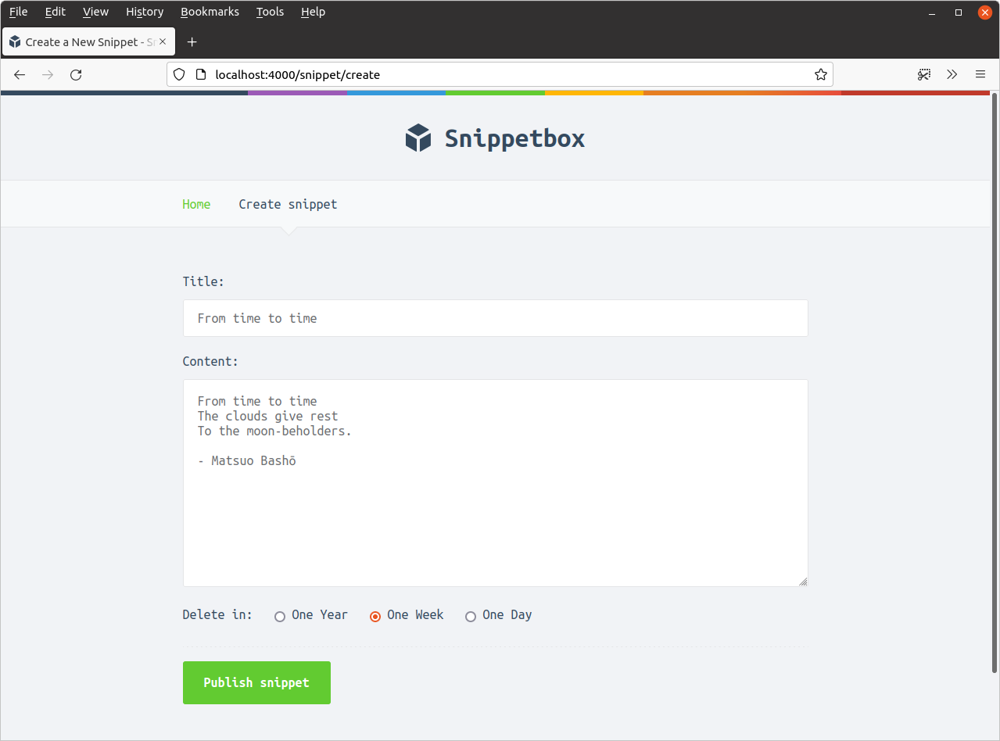

然后提交表单。如果一切正常，您应该被重定向到显示新代码片段的页面，如下所示：

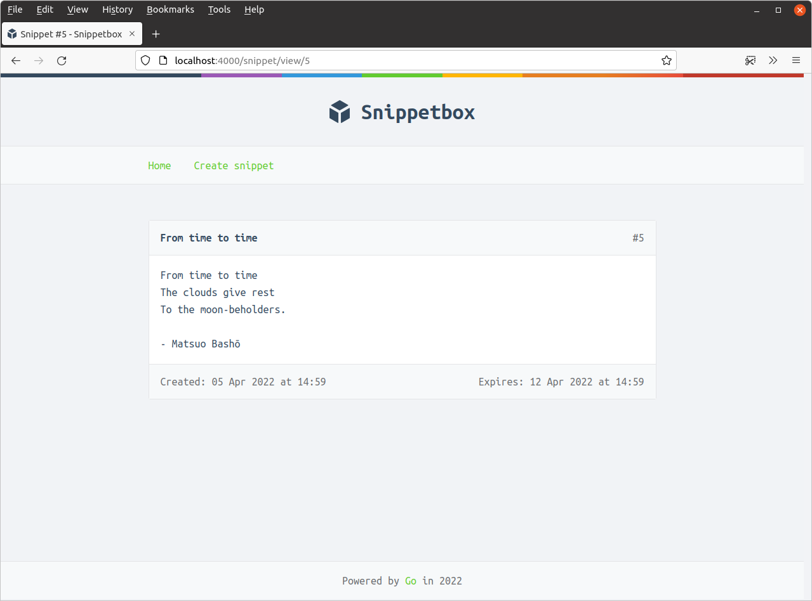

---

### 补充说明

#### PostFormValue 方法

`net/http` 包还提供了 [`r.PostFormValue()`](https://pkg.go.dev/net/http/#Request.PostFormValue) 方法，该方法本质上是一个快捷函数，它为您调用 `r.ParseForm()`，然后从 `r.PostForm` 中获取适当的字段值。

我建议避免使用此快捷方式，因为它*默默地忽略`r.ParseForm()`返回的任何错误*。如果您使用它，则意味着解析步骤可能会遇到错误并导致用户失败，但没有反馈机制让他们（或您）知道该问题。

#### 多值字段

严格来说，我们在本章中使用的 `r.PostForm.Get()` 方法仅返回特定表单字段的 *first* 值。这意味着您不能将其与可能发送多个值的表单字段（例如一组复选框）一起使用。

```html
<input type="checkbox" name="items" value="foo"> Foo
<input type="checkbox" name="items" value="bar"> Bar
<input type="checkbox" name="items" value="baz"> Baz
```

在这种情况下，您需要直接使用 `r.PostForm` 地图。 `r.PostForm` 映射的基础类型是 [`url.Values`](https://pkg.go.dev/net/url/#Values)，它又具有基础类型 `map[string][]string`。因此，对于具有多个值的字段，您可以循环底层映射来访问它们，如下所示：

```go
for i, item := range r.PostForm["items"] {
    fmt.Fprintf(w, "%d: Item %s\n", i, item)
}
```

#### 限制表单大小

默认情况下，使用 `POST` 方法提交的表单的数据大小限制为 10MB。例外情况是，如果您的表单具有 `enctype="multipart/form-data"` 属性并且正在发送多部分数据，在这种情况下没有默认限制。

如果要更改 10MB 限制，可以使用 [`http.MaxBytesReader()`](https://pkg.go.dev/net/http/#MaxBytesReader) 函数，如下所示：

```go
// Limit the request body size to 4096 bytes
r.Body = http.MaxBytesReader(w, r.Body, 4096)

err := r.ParseForm()
if err != nil {
    http.Error(w, "Bad Request", http.StatusBadRequest)
    return
}
```

使用此代码，在 `r.ParseForm()` 期间将仅读取请求正文的前 4096 个字节。尝试读取超出此限制将导致 `MaxBytesReader` 返回错误，该错误随后将由 `r.ParseForm()` 显示。

此外，如果达到限制，`MaxBytesReader` 会在 `http.ResponseWriter` 上设置一个标志，指示服务器关闭底层 TCP 连接。

#### 查询字符串参数

如果您的表单使用 HTTP 方法 `GET` 而不是 `POST` 提交数据，则表单数据将作为 URL *查询字符串参数* 包含在内。例如，如果您有一个如下所示的 HTML 表单：

```html
<form action='/foo/bar' method='GET'>
    <input type='text' name='title'>
    <input type='text' name='content'>
    
    <input type='submit' value='Submit'>
</form>
```

提交表单后，它将发送一个 `GET` 请求，其 URL 如下所示：`/foo/bar?title=value&content=value`。

您可以通过 `r.URL.Query().Get()` 方法检索处理器中查询字符串参数的值。这将始终返回参数的字符串值，如果不存在匹配的参数，则返回空字符串 `""`。例如：

```go
func exampleHandler(w http.ResponseWriter, r *http.Request) {
    title := r.URL.Query().Get("title")
    content := r.URL.Query().Get("content")

    ...
}
```

#### r.Form 地图

访问查询字符串参数的另一种方法是通过 `r.Form` 映射。这与我们在本章中使用的 `r.PostForm` 映射类似，不同之处在于它包含来自任何 `POST` 请求正文 **和** 任何查询字符串参数的表单数据。

假设您的处理器中有一些代码如下所示：

```go
err := r.ParseForm()
if err != nil {
    http.Error(w, "Bad Request", http.StatusBadRequest)
    return
}

title := r.Form.Get("title")
```

在此代码中，行 `r.Form.Get("title")` 将从 `POST` 请求正文 *或* 从名称为 `title` 的查询字符串参数返回 `title` 值。如果发生冲突，请求正文值将优先于查询字符串参数。

如果您希望应用程序不知道数据值如何传递给它，那么使用 `r.Form` 会非常有帮助。但在这种情况之外，`r.Form` 不会提供任何好处，并且通过 `r.PostForm` 从 `POST` 请求正文中读取数据或通过 `r.URL.Query().Get()` 从查询字符串参数中读取数据会更清晰、更明确。

---

<!-- 来源章节：07.03-validating-form-data.md -->

*第 7.3 章。*

## 验证表单数据

现在我们的代码存在一个明显的问题：我们没有以任何方式验证表单中的（不受信任的）用户输入。我们应该这样做以确保表单数据存在、类型正确并且符合我们拥有的任何业务规则。

具体来说，对于此表单，我们希望：

- 检查 `title` 和 `content` 字段不为空。
- 检查 `title` 字段的长度是否超过 100 个字符。
- 检查 `expires` 值是否与我们允许的值之一完全匹配（`1`、`7` 或 `365` 天）。

使用 Go 的 [`strings`](https://pkg.go.dev/strings/) 和 [`unicode/utf8`](https://pkg.go.dev/unicode/utf8/) 包中的一些 `if` 语句和各种函数来实现所有这些检查都相当简单。

打开您的 `handlers.go` 文件并更新 `snippetCreatePost` 处理器以包含适当的验证规则，如下所示：

*文件：cmd/web/handlers.go*

```go
package main

import (
    "errors"
    "fmt"
    "net/http"
    "strconv"
    "strings"      // New import
    "unicode/utf8" // New import

    "snippetbox.alexedwards.net/internal/models"
)

...

func (app *application) snippetCreatePost(w http.ResponseWriter, r *http.Request) {
    err := r.ParseForm()
    if err != nil {
        app.clientError(w, http.StatusBadRequest)
        return
    }

    title := r.PostForm.Get("title")
    content := r.PostForm.Get("content")

    expires, err := strconv.Atoi(r.PostForm.Get("expires"))
    if err != nil {
        app.clientError(w, http.StatusBadRequest)
        return
    }

    // Initialize a map to hold any validation errors for the form fields.
    fieldErrors := make(map[string]string)

    // Check that the title value is not blank and is not more than 100
    // characters long. If it fails either of those checks, add a message to the
    // errors map using the field name as the key.
    if strings.TrimSpace(title) == "" {
        fieldErrors["title"] = "This field cannot be blank"
    } else if utf8.RuneCountInString(title) > 100 {
        fieldErrors["title"] = "This field cannot be more than 100 characters long"
    }

    // Check that the Content value isn't blank.
    if strings.TrimSpace(content) == "" {
        fieldErrors["content"] = "This field cannot be blank"
    }

    // Check the expires value matches one of the permitted values (1, 7 or
    // 365).
    if expires != 1 && expires != 7 && expires != 365 {
        fieldErrors["expires"] = "This field must equal 1, 7 or 365"
    }

    // If there are any errors, dump them in a plain text HTTP response and
    // return from the handler.
    if len(fieldErrors) > 0 {
        fmt.Fprint(w, fieldErrors)
        return
    }

    id, err := app.snippets.Insert(title, content, expires)
    if err != nil {
        app.serverError(w, r, err)
        return
    }

    http.Redirect(w, r, fmt.Sprintf("/snippet/view/%d", id), http.StatusSeeOther)
}
```

> **注意：**当我们检查 `title` 字段的长度时，我们使用的是 [`utf8.RuneCountInString()`](https://pkg.go.dev/unicode/utf8/#RuneCountInString) 函数 - 而不是 Go 的 `len()` 函数。这将计算标题中 *Unicode 代码点* 的数量，而不是字节数。为了说明差异，字符串 `"Zoë"` 包含 3 个 Unicode 代码点，但由于变音的 `ë` 字符而包含 4 个字节。

好吧，让我们尝试一下！重新启动应用程序并尝试提交带有太长片段标题和空白内容字段的表单，有点像这样......

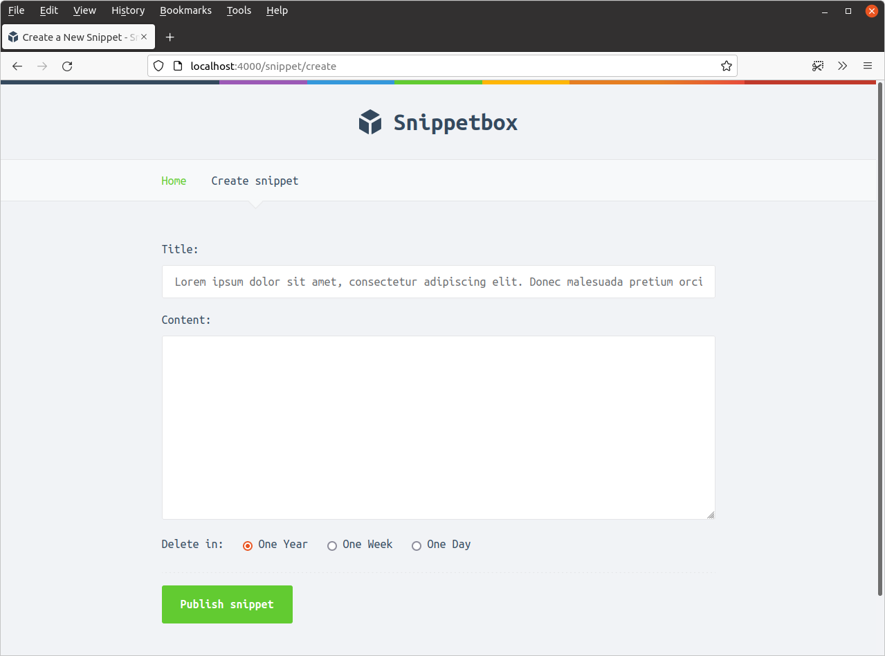

您应该会看到相应验证失败消息的转储，如下所示：

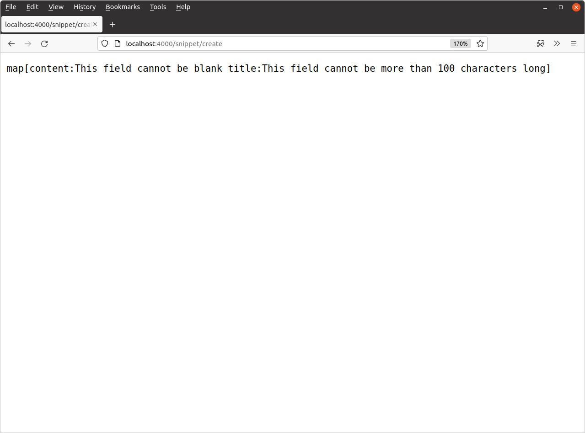

> **提示：**您可以在[这篇博文](https://www.alexedwards.net/blog/validation-snippets-for-go)中找到一堆用于处理和验证不同类型输入的代码模式。

---

<!-- 来源章节：07.04-displaying-errors-and-repopulating-fields.md -->

*第 7.4 章。*

## 显示错误并重新填充字段

现在 `snippetCreatePost` 处理器正在验证数据，下一阶段是妥善管理这些验证错误。

如果存在任何验证错误，我们希望重新显示 HTML 表单，突出显示验证失败的字段并自动重新填充之前提交的任何数据（以便用户不需要再次输入）。

为此，我们首先向 `templateData` 结构添加一个新的 `Form` 字段：

*文件：cmd/web/templates.go*

```go
package main

import (
    "html/template"
    "path/filepath"
    "time"

    "snippetbox.alexedwards.net/internal/models"
)

// Add a Form field with the type "any".
type templateData struct {
    CurrentYear int
    Snippet     models.Snippet
    Snippets    []models.Snippet
    Form        any
}

...
```

当我们重新显示表单时，我们将使用此 `Form` 字段将验证错误和之前提交的数据传递回模板。

接下来，让我们回到 `cmd/web/handlers.go` 文件并定义一个新的 `snippetCreateForm` 结构来保存表单数据和任何验证错误，并更新我们的 `snippetCreatePost` 处理器以使用它。

就像这样：

*文件：cmd/web/handlers.go*

```go
package main

...

// Define a snippetCreateForm struct to represent the form data and validation
// errors for the form fields. Note that all the struct fields are deliberately
// exported (i.e. start with a capital letter). This is because struct fields
// must be exported in order to be read by the html/template package when
// rendering the template.
type snippetCreateForm struct {
    Title       string
    Content     string
    Expires     int
    FieldErrors map[string]string
}

func (app *application) snippetCreatePost(w http.ResponseWriter, r *http.Request) {
    err := r.ParseForm()
    if err != nil {
        app.clientError(w, http.StatusBadRequest)
        return
    }

    // Get the expires value from the form as normal.
    expires, err := strconv.Atoi(r.PostForm.Get("expires"))
    if err != nil {
        app.clientError(w, http.StatusBadRequest)
        return
    }

    // Create an instance of the snippetCreateForm struct containing the values
    // from the form and an empty map for any validation errors.
    form := snippetCreateForm{
        Title:       r.PostForm.Get("title"),
        Content:     r.PostForm.Get("content"),
        Expires:     expires,
        FieldErrors: map[string]string{},
    }

    // Update the validation checks so that they operate on the snippetCreateForm
    // instance.
    if strings.TrimSpace(form.Title) == "" {
        form.FieldErrors["title"] = "This field cannot be blank"
    } else if utf8.RuneCountInString(form.Title) > 100 {
        form.FieldErrors["title"] = "This field cannot be more than 100 characters long"
    }

    if strings.TrimSpace(form.Content) == "" {
        form.FieldErrors["content"] = "This field cannot be blank"
    }

    if form.Expires != 1 && form.Expires != 7 && form.Expires != 365 {
        form.FieldErrors["expires"] = "This field must equal 1, 7 or 365"
    }

    // If there are any validation errors, then re-display the create.tmpl template,
    // passing in the snippetCreateForm instance as dynamic data in the Form 
    // field. Note that we use the HTTP status code 422 Unprocessable Entity 
    // when sending the response to indicate that there was a validation error.
    if len(form.FieldErrors) > 0 {
        data := app.newTemplateData(r)
        data.Form = form
        app.render(w, r, http.StatusUnprocessableEntity, "create.tmpl", data)
        return
    }

    // We also need to update this line to pass the data from the
    // snippetCreateForm instance to our Insert() method.
    id, err := app.snippets.Insert(form.Title, form.Content, form.Expires)
    if err != nil {
        app.serverError(w, r, err)
        return
    }

    http.Redirect(w, r, fmt.Sprintf("/snippet/view/%d", id), http.StatusSeeOther)
}
```

好的，现在当出现任何验证错误时，我们将重新显示 `create.tmpl` 模板，通过模板数据的 `Form` 字段在 `snippetCreateForm` 结构中传入先前的数据和验证错误。

如果您愿意，此时您应该能够运行该应用程序，并且代码应该可以顺利编译。

### 更新 HTML 模板

我们需要做的下一件事是更新我们的 `create.tmpl` 模板以显示验证错误并重新填充以前的任何数据。

重新填充表单数据非常简单 - 我们应该能够使用 `{{.Form.Title}}` 和 `{{.Form.Content}}` 等标签在模板中呈现它，就像我们在本书前面显示片段数据一样。

对于验证错误，我们的 `FieldErrors` 字段的基础类型是 `map[string]string`，它使用表单字段名称作为键。对于映射，可以通过简单地链接键名称来访问给定键的值。因此，例如，要呈现 `title` 字段的验证错误，我们可以在模板中使用标签 `{{.Form.FieldErrors.title}}`。

> **注意：** 与结构字段不同，映射键名称 ** 必须大写才能从模板访问它们。

考虑到这一点，让我们更新 `create.tmpl` 文件以重新填充数据并显示每个字段的错误消息（如果存在）。

*文件：ui/html/pages/create.tmpl*

```html
{{define "title"}}Create a New Snippet{{end}}

{{define "main"}}
<form action='/snippet/create' method='POST'>
    <div>
        <label>Title:</label>
        <!-- Use the `with` action to render the value of .Form.FieldErrors.title
        if it is not empty. -->
        {{with .Form.FieldErrors.title}}
            <label class='error'>{{.}}</label>
        {{end}}
        <!-- Re-populate the title data by setting the `value` attribute. -->
        <input type='text' name='title' value='{{.Form.Title}}'>
    </div>
    <div>
        <label>Content:</label>
        <!-- Likewise render the value of .Form.FieldErrors.content if it is not
        empty. -->
        {{with .Form.FieldErrors.content}}
            <label class='error'>{{.}}</label>
        {{end}}
        <!-- Re-populate the content data as the inner HTML of the textarea. -->
        <textarea name='content'>{{.Form.Content}}</textarea>
    </div>
    <div>
        <label>Delete in:</label>
        <!-- And render the value of .Form.FieldErrors.expires if it is not empty. -->
        {{with .Form.FieldErrors.expires}}
            <label class='error'>{{.}}</label>
        {{end}}
        <!-- Here we use the `if` action to check if the value of the re-populated
        expires field equals 365. If it does, then we render the `checked`
        attribute so that the radio input is re-selected. -->
        <input type='radio' name='expires' value='365' {{if (eq .Form.Expires 365)}}checked{{end}}> One Year
        <!-- And we do the same for the other possible values too... -->
        <input type='radio' name='expires' value='7' {{if (eq .Form.Expires 7)}}checked{{end}}> One Week
        <input type='radio' name='expires' value='1' {{if (eq .Form.Expires 1)}}checked{{end}}> One Day
    </div>
    <div>
        <input type='submit' value='Publish snippet'>
    </div>
</form>
{{end}}
```

希望这个标记和我们对 Go 模板操作的使用大体上是清楚的——它只是使用了我们在本书前面已经[看到并讨论过](05.02-template-actions-and-functions.md)的技术。

我们需要做最后一件事。如果我们现在尝试运行该应用程序，当我们第一次访问 [`http://localhost:4000/snippet/create`](http://localhost:4000/snippet/create) 处的表单时，我们会得到一个 `500 Internal Server Error`。这是因为我们的 `snippetCreate` 处理器当前没有为 `templateData.Form` 字段设置值，这意味着当 Go 尝试评估像 `{{with .Form.FieldErrors.title}}` 这样的模板标签时，会导致错误，因为 `Form` 是 `nil`。

让我们通过更新 `snippetCreate` 处理器来解决这个问题，以便它初始化一个新的 `snippetCreateForm` 实例并将其传递给模板，如下所示：

*文件：cmd/web/handlers.go*

```go
package main

...

func (app *application) snippetCreate(w http.ResponseWriter, r *http.Request) {
    data := app.newTemplateData(r)

    // Initialize a new snippetCreateForm instance and pass it to the template.
    // Notice how this is also a great opportunity to set any default or
    // 'initial' values for the form --- here we set the initial value for the 
    // snippet expiry to 365 days.
    data.Form = snippetCreateForm{
        Expires: 365,
    }

    app.render(w, r, http.StatusOK, "create.tmpl", data)
}

...
```

现在已完成，请重新启动应用程序并在浏览器中访问 [`http://localhost:4000/snippet/create`](http://localhost:4000/snippet/create)。您应该发现页面正确呈现，没有任何错误。

然后尝试添加一些内容并更改默认到期时间，但 *将标题字段留空*，如下所示：

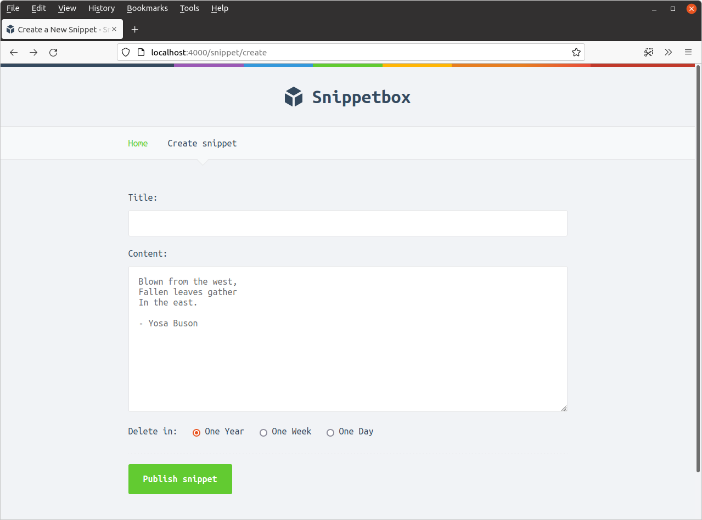

提交后，您现在应该会看到重新显示的表单，其中包含正确重新填充的代码段内容和到期选项，以及标题字段旁边的“此字段不能为空”错误消息：

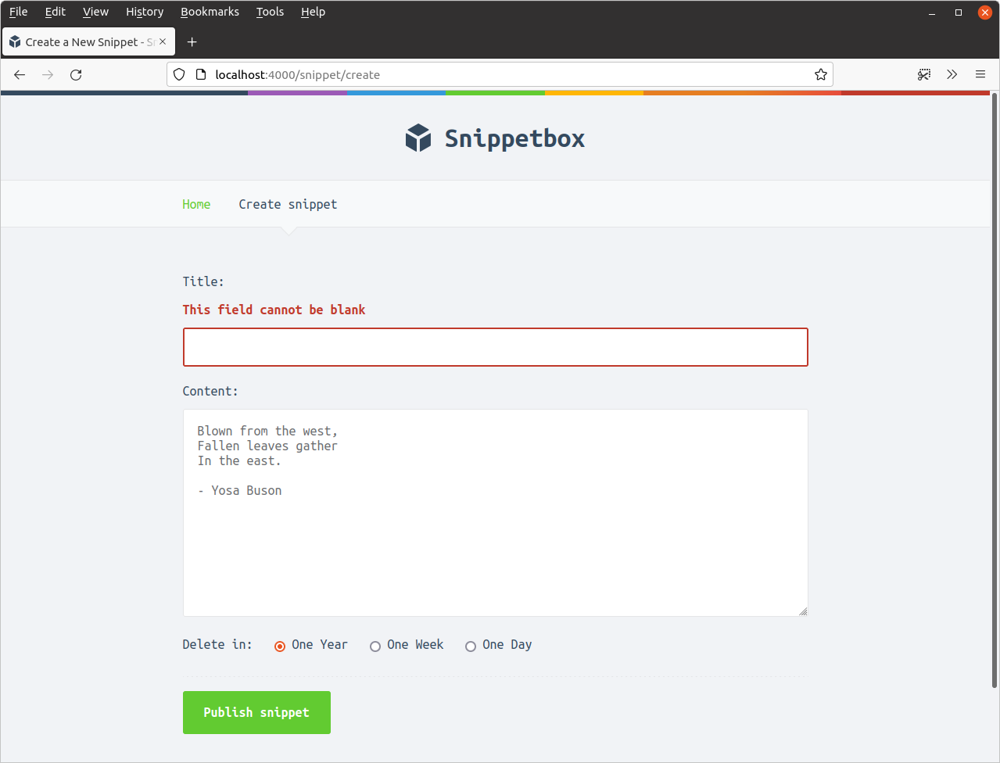

在我们继续之前，请随意花一些时间尝试一下表单和验证规则，直到您确信一切都按您的预期运行。

---

### 补充说明

#### 安静的路由

如果您有 Ruby-on-Rails、Laravel 或类似技术的背景，您可能想知道为什么我们没有将我们的路由和处理器构建得更加“RESTful”，如下所示：

| 路由模式 | 处理器 | 行动 |
| --- | --- | --- |
| GET /snippets | snippetIndex | 显示主页 |
| GET /snippets/{id} | snippetView | 显示特定片段 |
| GET /snippets/create | snippetCreate | 显示用于创建新片段的表单 |
| POST /snippets | snippetCreatePost | 保存新片段 |

有几个原因。

第一个原因是路由重叠 — 对 `/snippets/create` 的 HTTP 请求可能与 `GET /snippets/{id}` 和 `GET /snippets/create` 路由匹配。在我们的应用程序中，片段 ID 值始终是数字，因此这两条路由之间永远不会存在“真正”重叠 - 但想象一下，如果我们的片段 ID 值是用户生成的，或者是随机的 6 字符字符串，希望您能看到潜在的问题。一般来说，重叠的路由可能是应用程序中错误和意外行为的根源，如果可以的话，最好避免它们，如果不能的话，请小心谨慎地使用它们。

第二个原因是 `/snippets/create` 上显示的 HTML 表单在提交时需要发布到 `/snippets`。这意味着当我们重新渲染 HTML 表单以显示任何验证错误时，用户浏览器中的 URL 也将更改为 `/snippets`。不管你是否认为这是一个问题，YMMV - 大多数用户不会查看 URL，但我认为这在用户体验方面有点笨拙和令人困惑……特别是如果 `GET` 对 `/snippets` 的请求通常会呈现其他内容（例如所有片段的列表）。

---

<!-- 来源章节：07.05-creating-validation-helpers.md -->

*第 7.5 章。*

## 创建验证助手

好的，现在我们的应用程序正在根据我们的业务规则验证表单数据并优雅地处理任何验证错误。这很棒，但是需要做很多工作才能到达那里。

虽然我们采取的一次性方法很好，但如果您的应用程序有*许多形式*，那么您最终可能会在代码和验证规则中出现大量重复。更不用说，编写验证表单的代码并不是最令人兴奋的消磨时间的方式。

因此，为了帮助我们在该项目的其余部分进行验证，我们将创建自己的小 `internal/validator` 包来抽象其中的一些行为并减少处理器中的样板代码。我们实际上根本不会改变应用程序对用户的工作方式；这实际上只是我们代码库的重构。

### 添加验证器包

如果您正在编码，请继续在您的计算机上创建以下目录和文件：

```bash
$ mkdir internal/validator
$ touch internal/validator/validator.go
```

然后在这个新的 `internal/validator/validator.go` 文件中添加以下代码：

*文件：internal/validator/validator.go*

```go
package validator

import (
    "slices"
    "strings"
    "unicode/utf8"
)

// Define a new Validator struct which contains a map of validation error messages 
// for our form fields.
type Validator struct {
    FieldErrors map[string]string
}

// Valid() returns true if the FieldErrors map doesn't contain any entries.
func (v *Validator) Valid() bool {
    return len(v.FieldErrors) == 0
}

// AddFieldError() adds an error message to the FieldErrors map (so long as no
// entry already exists for the given key).
func (v *Validator) AddFieldError(key, message string) {
    // Note: We need to initialize the map first, if it isn't already
    // initialized.
    if v.FieldErrors == nil {
        v.FieldErrors = make(map[string]string)
    }

    if _, exists := v.FieldErrors[key]; !exists {
        v.FieldErrors[key] = message
    }
}

// CheckField() adds an error message to the FieldErrors map only if a
// validation check is not 'ok'.
func (v *Validator) CheckField(ok bool, key, message string) {
    if !ok {
        v.AddFieldError(key, message)
    }
}

// NotBlank() returns true if a value is not an empty string.
func NotBlank(value string) bool {
    return strings.TrimSpace(value) != ""
}

// MaxChars() returns true if a value contains no more than n characters.
func MaxChars(value string, n int) bool {
    return utf8.RuneCountInString(value) <= n
}

// PermittedValue() returns true if a value is in a list of specific permitted
// values.
func PermittedValue[T comparable](value T, permittedValues ...T) bool {
    return slices.Contains(permittedValues, value)
}
```

总结一下：

在上面的代码中，我们定义了一个 `Validator` 结构类型，其中包含错误消息的映射。 `Validator` 类型提供了一个 `CheckField()` 方法，用于有条件地将错误添加到映射中，以及一个 `Valid()` 方法，用于返回错误映射是否为空。我们还添加了 `NotBlank()` 、 `MaxChars()` 和 `PermittedValue()` 函数来帮助我们执行一些特定的验证检查

> **注意：** `PermittedValue()` 函数是一个 *通用函数*，它可以处理不同类型的值。我们将在本章末尾更详细地讨论泛型。

从概念上讲，这个 `Validator` 类型非常基本，但这并不是一件坏事。正如我们将在本书中看到的那样，它在实践中非常强大，并且为我们提供了对验证检查及其执行方式的很大灵活性和控制力。

### 使用助手

好吧，让我们开始使用 `Validator` 类型！

我们将返回到我们的 `cmd/web/handlers.go` 文件并将其更新为 *在我们的 `snippetCreateForm` 结构中嵌入* 一个 `Validator` 结构，然后使用它对表单数据执行必要的验证检查。

> **提示：**如果您不熟悉 Go 中结构嵌入的概念，Eli Bendersky 就该主题写了一篇 [很好的介绍](https://eli.thegreenplace.net/2020/embedding-in-go-part-1-structs-in-structs/)，我建议您在继续之前快速阅读它。

就像这样：

*文件：cmd/web/handlers.go*

```go
package main

import (
    "errors"
    "fmt"
    "net/http"
    "strconv"

    "snippetbox.alexedwards.net/internal/models"
    "snippetbox.alexedwards.net/internal/validator" // New import
)

...

// Remove the explicit FieldErrors struct field and instead embed the Validator
// struct. Embedding this means that our snippetCreateForm "inherits" all the
// fields and methods of our Validator struct (including the FieldErrors field).
type snippetCreateForm struct {
    Title               string 
    Content             string 
    Expires             int    
    validator.Validator
}

func (app *application) snippetCreatePost(w http.ResponseWriter, r *http.Request) {
    err := r.ParseForm()
    if err != nil {
        app.clientError(w, http.StatusBadRequest)
        return
    }

    expires, err := strconv.Atoi(r.PostForm.Get("expires"))
    if err != nil {
        app.clientError(w, http.StatusBadRequest)
        return
    }

    form := snippetCreateForm{
        Title:   r.PostForm.Get("title"),
        Content: r.PostForm.Get("content"),
        Expires: expires,
        // Remove the FieldErrors assignment from here.
    }

    // Because the Validator struct is embedded by the snippetCreateForm struct,
    // we can call CheckField() directly on it to execute our validation checks.
    // CheckField() will add the provided key and error message to the
    // FieldErrors map if the check does not evaluate to true. For example, in
    // the first line here we "check that the form.Title field is not blank". In
    // the second, we "check that the form.Title field has a maximum character
    // length of 100" and so on.
    form.CheckField(validator.NotBlank(form.Title), "title", "This field cannot be blank")
    form.CheckField(validator.MaxChars(form.Title, 100), "title", "This field cannot be more than 100 characters long")
    form.CheckField(validator.NotBlank(form.Content), "content", "This field cannot be blank")
    form.CheckField(validator.PermittedValue(form.Expires, 1, 7, 365), "expires", "This field must equal 1, 7 or 365")

    // Use the Valid() method to see if any of the checks failed. If they did,
    // then re-render the template passing in the form in the same way as
    // before.
    if !form.Valid() {
        data := app.newTemplateData(r)
        data.Form = form
        app.render(w, r, http.StatusUnprocessableEntity, "create.tmpl", data)
        return
    }

    id, err := app.snippets.Insert(form.Title, form.Content, form.Expires)
    if err != nil {
        app.serverError(w, r, err)
        return
    }

    http.Redirect(w, r, fmt.Sprintf("/snippet/view/%d", id), http.StatusSeeOther)
}
```

所以这一切的发展非常好。

我们现在有了一个 `internal/validator` 包，其中包含可以在我们的应用程序中重用的验证规则和逻辑，并且将来可以轻松扩展以包含其他规则。表单数据和错误都整齐地封装在单个 `snippetCreateForm` 结构中 - 我们可以轻松地将其传递到模板 - 并且用于显示错误消息和在模板中重新填充数据的语法简单且一致。

如果您愿意，请立即重新运行该应用程序。一切顺利，您应该发现表单和验证规则工作正常，并且与以前的方式完全相同。

---

### 补充说明

#### 泛型

Go 1.18 是第一个支持 *generics* 的语言版本 - 也称为 *参数多态性* 的技术名称。广泛而言，泛型允许您编写适用于*不同具体类型*的代码。

例如，在旧版本的 Go 中，如果您想计算特定值在 `[]string` 切片和 `[]int` 切片中出现的次数，则需要编写两个单独的函数 - 一个函数用于 `[]string` 类型，另一个函数用于 `[]int` 类型。有点像这样：

```go
// Count how many times the value v appears in the slice s.
func countString(v string, s []string) int {
    count := 0
    for _, vs := range s {
        if v == vs {
            count++
        }
    }
    return count
}

func countInt(v int, s []int) int {
    count := 0
    for _, vs := range s {
        if v == vs {
            count++
        }
    }
    return count
}
```

现在，使用泛型，可以编写单个 `count()` 函数，该函数适用于 `[]string`、`[]int` 或 [类似类型](https://pkg.go.dev/builtin#comparable) 的任何其他切片。代码如下所示：

```go
func count[T comparable](v T, s []T) int {
    count := 0
    for _, vs := range s {
        if v == vs {
            count++
        }
    }
    return count
}
```

如果您不熟悉 Go 中泛型代码的语法，有很多有用的信息可以解释泛型如何工作并引导您完成编写泛型代码的语法。

为了加快速度，我强烈建议阅读 [官方 Go 泛型教程](https://go.dev/doc/tutorial/generics)，并观看 [此视频](https://www.youtube.com/watch?v=Pa_e9EeCdy8) 的前 15 分钟，以帮助巩固您所学的知识。

我不想在这里重复相同的信息，而是想简要讨论一个不太常见（但同样重要！）的主题：*when* 使用泛型。

至少现在，您应该明智且谨慎地使用泛型**。

我知道这可能听起来有点无聊，但泛型是一种相对较新的语言功能，并且围绕编写泛型代码的最佳实践仍在建立中。如果您在团队中工作，或者公开编写代码，那么还值得记住的是，并非所有其他 Go 开发人员都一定熟悉通用代码的工作原理。

您不需要*需要*来使用泛型，不这样做也没关系。

但即使有这些警告，编写通用代码在某些情况下仍然非常有用。一般来说，您可能需要考虑：

- 如果您发现自己为不同的数据类型编写重复的样板代码。这方面的例子可能是切片、映射或通道上的常见操作，或者是用于对不同数据类型执行验证检查或测试断言的帮助程序。
- 当您编写代码并发现自己正在使用 `any`（空 `interface{}`）类型时。例如，当您创建需要对不同类型进行操作的数据结构（如队列、缓存或链表）时。

相反，您可能不想使用泛型：

- 如果它使您的代码更难理解或不太清晰。
- 如果您需要使用的所有类型都有一组通用的方法 - 在这种情况下，最好定义并使用普通的 `interface` 类型。
- 只是*因为你可以*。相反，最好默认编写非通用代码，并在以后*仅在实际需要时切换到通用版本*。

---

<!-- 来源章节：07.06-automatic-form-parsing.md -->

*第 7.6 章。*

## 自动表单解析

我们可以通过使用 [`go-playground/form`](https://github.com/go-playground/form) 或 [`gorilla/schema`](https://github.com/gorilla/schema) 等第三方包来进一步简化我们的 `snippetCreatePost` 处理器，自动将表单数据解码为 `snippetCreateForm` 结构。使用自动解码器是 *完全* 可选的，但它可以帮助您节省时间和打字 — 特别是如果您的应用程序有很多表单，或者您需要处理非常大的表单。

在本章中，我们将了解如何使用 `go-playground/form` 包。如果您按照步骤操作，请继续安装它，如下所示：

```bash
$ go get github.com/go-playground/form/v4@v4
go get: added github.com/go-playground/form/v4 v4.2.1
```

### 使用表单解码器

为了使其正常工作，我们需要做的第一件事是在 `main.go` 文件中初始化一个新的 [`*form.Decoder`](https://pkg.go.dev/github.com/go-playground/form?utm_source=godoc#Decoder) 实例，并将其作为依赖项提供给我们的处理器。像这样：

*文件：cmd/web/main.go*

```go
package main

import (
    "database/sql"
    "flag"
    "html/template"
    "log/slog"
    "net/http"
    "os"

    "snippetbox.alexedwards.net/internal/models"

    "github.com/go-playground/form/v4" // New import
    _ "github.com/go-sql-driver/mysql"
)

// Add a formDecoder field to hold a pointer to a form.Decoder instance.
type application struct {
    logger        *slog.Logger
    snippets      *models.SnippetModel
    templateCache map[string]*template.Template
    formDecoder   *form.Decoder
}

func main() {
    addr := flag.String("addr", ":4000", "HTTP network address")
    dsn := flag.String("dsn", "web:pass@/snippetbox?parseTime=true", "MySQL data source name")
    flag.Parse()

    logger := slog.New(slog.NewTextHandler(os.Stdout, nil))

    db, err := openDB(*dsn)
    if err != nil {
        logger.Error(err.Error())
        os.Exit(1)
    }
    defer db.Close()

    templateCache, err := newTemplateCache()
    if err != nil {
        logger.Error(err.Error())
        os.Exit(1)
    }

    // Initialize a decoder instance...
    formDecoder := form.NewDecoder()

    // And add it to the application dependencies.
    app := &application{
        logger:        logger,
        snippets:      &models.SnippetModel{DB: db},
        templateCache: templateCache,
        formDecoder:   formDecoder,
    }

    logger.Info("starting server", "addr", *addr)

    err = http.ListenAndServe(*addr, app.routes())
    logger.Error(err.Error())
    os.Exit(1)
}

...
```

接下来让我们转到 `cmd/web/handlers.go` 文件并更新它以使用这个新的解码器，如下所示：

*文件：cmd/web/handlers.go*

```go
package main

...

// Update our snippetCreateForm struct to include struct tags which tell the
// decoder how to map HTML form values into the different struct fields. So, for
// example, here we're telling the decoder to store the value from the HTML form
// input with the name "title" in the Title field. The struct tag `form:"-"` 
// tells the decoder to completely ignore a field during decoding.
type snippetCreateForm struct {
    Title               string `form:"title"`
    Content             string `form:"content"`
    Expires             int    `form:"expires"`
    validator.Validator `form:"-"`
}

func (app *application) snippetCreatePost(w http.ResponseWriter, r *http.Request) {
    err := r.ParseForm()
    if err != nil {
        app.clientError(w, http.StatusBadRequest)
        return
    }

    // Declare a new empty instance of the snippetCreateForm struct.
    var form snippetCreateForm

    // Call the Decode() method of the form decoder, passing in the current
    // request and *a pointer* to our snippetCreateForm struct. This will
    // essentially fill our struct with the relevant values from the HTML form.
    // If there is a problem, we return a 400 Bad Request response to the client.
    err = app.formDecoder.Decode(&form, r.PostForm)
    if err != nil {
        app.clientError(w, http.StatusBadRequest)
        return
    }

    // Then validate and use the data as normal...
    form.CheckField(validator.NotBlank(form.Title), "title", "This field cannot be blank")
    form.CheckField(validator.MaxChars(form.Title, 100), "title", "This field cannot be more than 100 characters long")
    form.CheckField(validator.NotBlank(form.Content), "content", "This field cannot be blank")
    form.CheckField(validator.PermittedValue(form.Expires, 1, 7, 365), "expires", "This field must equal 1, 7 or 365")

    if !form.Valid() {
        data := app.newTemplateData(r)
        data.Form = form
        app.render(w, r, http.StatusUnprocessableEntity, "create.tmpl", data)
        return
    }

    id, err := app.snippets.Insert(form.Title, form.Content, form.Expires)
    if err != nil {
        app.serverError(w, r, err)
        return
    }

    http.Redirect(w, r, fmt.Sprintf("/snippet/view/%d", id), http.StatusSeeOther)
}
```

希望您能看到这种模式的好处。我们可以使用简单的结构标签来定义 HTML 表单和“目标”结构字段之间的映射，并且将表单数据解压到目标现在只需要我们编写几行代码 - 无论表单有多大。

重要的是，类型转换也是自动处理的。我们可以看到，在上面的代码中，`expires`值自动映射到`int`数据类型。

所以这真的很好。但有一个问题。

当我们调用 `app.formDecoder.Decode()` 时，它需要一个 *非零指针* 作为目标解码目的地。如果我们尝试传入 *不是* 非零指针的内容，则 `Decode()` 将返回 [`form.InvalidDecoderError`](https://pkg.go.dev/github.com/go-playground/form/v4#InvalidDecoderError) 错误。

如果发生这种情况，则这是我们的应用程序代码的严重问题（而不是由于输入错误而导致的客户端错误）。因此，我们需要专门检查此错误并将其作为特殊情况进行管理，而不是仅仅返回 `400 Bad Request` 响应。

### 创建一个decodePostForm帮助器

为了帮助实现这一点，让我们创建一个新的 `decodePostForm()` 帮助器，它执行三件事：

- 对当前请求调用 `r.ParseForm()`。
- 调用 `app.formDecoder.Decode()` 将 HTML 表单数据解压到目标位置。
- 检查 `form.InvalidDecoderError` 错误并在看到它时触发panic。

如果您按照步骤操作，请继续将其添加到您的 `cmd/web/helpers.go` 文件中，如下所示：

*文件：cmd/web/helpers.go*

```go
package main

import (
    "bytes"
    "errors" // New import
    "fmt"
    "net/http"
    "time"

    "github.com/go-playground/form/v4" // New import
)

...

// Create a new decodePostForm() helper method. The second parameter here, dst,
// is the target destination that we want to decode the form data into.
func (app *application) decodePostForm(r *http.Request, dst any) error {
    // Call ParseForm() on the request, in the same way that we did in our
    // snippetCreatePost handler.
    err := r.ParseForm()
    if err != nil {
        return err
    }

    // Call Decode() on our decoder instance, passing the target destination as
    // the first parameter.
    err = app.formDecoder.Decode(dst, r.PostForm)
    if err != nil {
        // If we try to use an invalid target destination, the Decode() method
        // will return an error with the type *form.InvalidDecoderError.We use 
        // errors.As() to check for this and raise a panic rather than returning
        // the error.
        var invalidDecoderError *form.InvalidDecoderError
        
        if errors.As(err, &invalidDecoderError) {
            panic(err)
        }

        // For all other errors, we return them as normal.
        return err
    }

    return nil
}
```

完成后，我们可以对 `snippeCreatePost` 处理器进行最终的简化。继续更新它以使用 `decodePostForm()` 帮助程序并删除 `r.ParseForm()` 调用，以便代码如下所示：

*文件：cmd/web/handlers.go*

```go
package main

...

func (app *application) snippetCreatePost(w http.ResponseWriter, r *http.Request) {
    var form snippetCreateForm

    err := app.decodePostForm(r, &form)
    if err != nil {
        app.clientError(w, http.StatusBadRequest)
        return
    }

    form.CheckField(validator.NotBlank(form.Title), "title", "This field cannot be blank")
    form.CheckField(validator.MaxChars(form.Title, 100), "title", "This field cannot be more than 100 characters long")
    form.CheckField(validator.NotBlank(form.Content), "content", "This field cannot be blank")
    form.CheckField(validator.PermittedValue(form.Expires, 1, 7, 365), "expires", "This field must equal 1, 7 or 365")

    if !form.Valid() {
        data := app.newTemplateData(r)
        data.Form = form
        app.render(w, r, http.StatusUnprocessableEntity, "create.tmpl", data)
        return
    }

    id, err := app.snippets.Insert(form.Title, form.Content, form.Expires)
    if err != nil {
        app.serverError(w, r, err)
        return
    }

    http.Redirect(w, r, fmt.Sprintf("/snippet/view/%d", id), http.StatusSeeOther)
}
```

看起来真的很好。

我们的处理器代码现在漂亮而简洁，但在其行为和正在执行的操作方面仍然非常清晰。我们有一个用于表单处理和验证的通用模式，我们可以轻松地在项目中的其他表单上重复使用它，例如我们将很快构建的用户注册和登录表单。

---

<!-- 来源章节：08.00-stateful-http.md -->

*第 8 章。*

# 有状态 HTTP

改善用户体验的一个不错的做法是显示一条一次性确认消息，用户在*添加新代码段后会看到该消息。就像这样：


像这样的确认消息应该只向用户显示一次（在创建代码片段后立即），并且其他用户不应该看到该消息。如果您已经编程了一段时间，您可能知道这种类型的功能是 *闪烁消息* 或 *toast*。

为了实现这一点，我们需要开始在同一用户的 HTTP 请求之间共享数据（或 *state*）。最常见的方法是为用户实现 *会话*。

在本节中，您将学到：

- [会话管理器](08.01-choosing-a-session-manager.md)可以帮助我们在 Go 中实现会话。
- 如何[使用会话](08.03-working-with-session-data.md)在特定用户的请求之间安全可靠地共享数据。
- 如何根据应用程序的需求[自定义会话行为](08.02-setting-up-the-session-manager.md)（包括超时和 Cookie 设置）。

---

<!-- 来源章节：08.01-choosing-a-session-manager.md -->

*第 8.1 章。*

## 选择会话管理器

在使用会话时，存在很多 [安全考虑因素](https://cheatsheetseries.owasp.org/cheatsheets/Session_Management_Cheat_Sheet.html)，并且正确的实施并非易事。除非您确实需要推出自己的实现，否则最好在此处使用现有的、经过良好测试的第三方包。

我建议使用 [`gorilla/sessions`](https://github.com/gorilla/sessions) 或 [`alexedwards/scs`](https://github.com/alexedwards/scs)，具体取决于您的项目需求。

- `gorilla/sessions` 是 Go 生态中最成熟、最知名的会话管理包。它的 API 简洁易用，并允许你把会话数据存储在客户端（经过签名和加密的 Cookie 中）或服务器端（MySQL、PostgreSQL、Redis 等数据库中）。
  但有一点很重要：它没有提供更新会话 ID 的机制。如果使用服务器端会话存储，这一机制对于降低[会话固定攻击相关风险](https://cheatsheetseries.owasp.org/cheatsheets/Session_Management_Cheat_Sheet.html#renew-the-session-id-after-any-privilege-level-change)是必需的。
- `alexedwards/scs` 允许您仅在服务器端存储会话数据。它支持通过中间件自动加载和保存会话数据，具有用于类型安全数据操作的良好界面，并且 *允许更新会话 ID。与`gorilla/sessions`一样，它也支持多种数据库（包括MySQL、PostgreSQL和Redis）。

总之，如果您想将客户端会话数据存储在 cookie 中，那么 `gorilla/sessions` 是一个不错的选择，但由于能够更新会话 ID，`alexedwards/scs` 通常是更好的选择。

对于这个项目，我们已经设置了 MySQL 数据库，因此我们将选择使用 `alexedwards/scs` 并将会话数据服务器端存储在 MySQL 中。

如果您按照步骤操作，请确保您位于项目目录中并安装必要的软件包，如下所示：

```bash
$ go get github.com/alexedwards/scs/v2@v2
go: downloading github.com/alexedwards/scs/v2 v2.8.0
go get: added github.com/alexedwards/scs/v2 v2.8.0

$ go get github.com/alexedwards/scs/mysqlstore@latest
go: downloading github.com/alexedwards/scs/mysqlstore v0.0.0-20240316133359-d7ab9d9831ec
go get: added github.com/alexedwards/scs/mysqlstore v0.0.0-20240316133359-d7ab9d9831ec
```

---

<!-- 来源章节：08.02-setting-up-the-session-manager.md -->

*第 8.2 章。*

## 设置会话管理器

在本章中，我将介绍设置和使用 `alexedwards/scs` 包的基础知识，但如果您要在生产应用程序中使用它，我建议您阅读 [文档](https://github.com/alexedwards/scs) 和 [API 参考](https://pkg.go.dev/github.com/alexedwards/scs/v2) 来熟悉全部功能。

我们需要做的第一件事是在 MySQL 数据库中创建一个 `sessions` 表来保存用户的会话数据。首先以 `root` 用户身份从终端窗口连接到 MySQL，并执行以下 SQL 语句来设置 `sessions` 表：

```sql
USE snippetbox;

CREATE TABLE sessions (
    token CHAR(43) PRIMARY KEY,
    data BLOB NOT NULL,
    expiry TIMESTAMP(6) NOT NULL
);

CREATE INDEX sessions_expiry_idx ON sessions (expiry);
```

在此表中：

- `token` 字段将包含每个会话的唯一、随机生成的标识符。
- `data` 字段将包含您想要在 HTTP 请求之间共享的实际会话数据。它以 `BLOB`（二进制大对象）类型存储为 *二进制数据*。
- `expiry` 字段将包含会话的到期时间。 `scs` 包会自动从 `sessions` 表中删除过期的会话，以使其不会变得太大。

我们需要做的下一件事是在我们的 `main.go` 文件中建立一个 *会话管理器* 并通过 `application` 结构将其提供给我们的处理器。会话管理器保存会话的配置设置，还提供一些中间件和帮助方法来处理会话数据的加载和保存。

打开您的 `main.go` 文件并按如下方式更新：

*文件：cmd/web/main.go*

```go
package main

import (
    "database/sql"
    "flag"
    "html/template"
    "log/slog"
    "net/http"
    "os"
    "time" // New import

    "snippetbox.alexedwards.net/internal/models"

    "github.com/alexedwards/scs/mysqlstore" // New import
    "github.com/alexedwards/scs/v2"         // New import
    "github.com/go-playground/form/v4"
    _ "github.com/go-sql-driver/mysql"
)

// Add a new sessionManager field to the application struct.
type application struct {
    logger        *slog.Logger
    snippets       *models.SnippetModel
    templateCache  map[string]*template.Template
    formDecoder    *form.Decoder
    sessionManager *scs.SessionManager
}

func main() {
    addr := flag.String("addr", ":4000", "HTTP network address")
    dsn := flag.String("dsn", "web:pass@/snippetbox?parseTime=true", "MySQL data source name")
    flag.Parse()

    logger := slog.New(slog.NewTextHandler(os.Stdout, nil))

    db, err := openDB(*dsn)
    if err != nil {
        logger.Error(err.Error())
        os.Exit(1)
    }
    defer db.Close()

    templateCache, err := newTemplateCache()
    if err != nil {
        logger.Error(err.Error())
        os.Exit(1)
    }

    formDecoder := form.NewDecoder()

    // Use the scs.New() function to initialize a new session manager. Then we
    // configure it to use our MySQL database as the session store, and set a
    // lifetime of 12 hours (so that sessions automatically expire 12 hours
    // after first being created).
    sessionManager := scs.New()
    sessionManager.Store = mysqlstore.New(db)
    sessionManager.Lifetime = 12 * time.Hour

    // And add the session manager to our application dependencies.
    app := &application{
        logger:         logger,
        snippets:       &models.SnippetModel{DB: db},
        templateCache:  templateCache,
        formDecoder:    formDecoder,
        sessionManager: sessionManager,
    }

    logger.Info("starting server", "addr", *addr)

    err = http.ListenAndServe(*addr, app.routes())
    logger.Error(err.Error())
    os.Exit(1)
}

...
```

> **注意：** `scs.New()` 函数返回一个指向 [`SessionManager`](https://pkg.go.dev/github.com/alexedwards/scs/v2#SessionManager) 结构的指针，该结构保存会话的配置设置。在上面的代码中，我们设置了该结构体的 `Store` 和 `Lifetime` 字段，但是还有一系列 [其他字段](https://pkg.go.dev/github.com/alexedwards/scs/v2#SessionManager) 您可以并且应该根据应用程序的需求进行配置。

为了使会话正常工作，我们还需要使用 [`SessionManager.LoadAndSave()`](https://pkg.go.dev/github.com/alexedwards/scs/v2#SessionManager.LoadAndSave) 方法提供的中间件来包装我们的应用程序路由。该中间件会自动加载并保存每个 HTTP 请求和响应的会话数据。

需要注意的是，我们不需要这个中间件来作用于*所有*我们的应用程序路由。具体来说，我们在 `GET /static/` 路由上不需要它，因为它所做的只是提供静态文件，不需要任何有状态行为。

因此，因此，将会话中间件添加到我们现有的 `standard` 中间件链中是没有意义的。

相反，让我们创建一个新的 `dynamic` 中间件链，其中包含仅适合我们的动态应用程序路由的中间件。

打开 `routes.go` 文件并更新它，如下所示：

*文件：cmd/web/routes.go*

```go
package main

import (
    "net/http"

    "github.com/justinas/alice"
)

func (app *application) routes() http.Handler {
    mux := http.NewServeMux()

    // Leave the static files route unchanged.
    fileServer := http.FileServer(http.Dir("./ui/static/"))
    mux.Handle("GET /static/", http.StripPrefix("/static", fileServer))

    // Create a new middleware chain containing the middleware specific to our
    // dynamic application routes. For now, this chain will only contain the
    // LoadAndSave session middleware but we'll add more to it later.
    dynamic := alice.New(app.sessionManager.LoadAndSave)

    // Update these routes to use the new dynamic middleware chain followed by
    // the appropriate handler function. Note that because the alice ThenFunc()
    // method returns a http.Handler (rather than a http.HandlerFunc) we also
    // need to switch to registering the route using the mux.Handle() method.
    mux.Handle("GET /{$}", dynamic.ThenFunc(app.home))
    mux.Handle("GET /snippet/view/{id}", dynamic.ThenFunc(app.snippetView))
    mux.Handle("GET /snippet/create", dynamic.ThenFunc(app.snippetCreate))
    mux.Handle("POST /snippet/create", dynamic.ThenFunc(app.snippetCreatePost))

    standard := alice.New(app.recoverPanic, app.logRequest, commonHeaders)
    return standard.Then(mux)
}
```

如果您现在运行该应用程序，您应该会发现它编译一切正常，并且您的应用程序路由继续正常工作。

---

### 补充说明

#### 不使用爱丽丝

如果您不使用 `justinas/alice` 包来帮助管理中间件链，那么您需要使用 `http.HandlerFunc()` 适配器将 `app.home` 等处理函数转换为 `http.Handler`，然后用会话中间件包装它。像这样：

```go
mux := http.NewServeMux()
mux.Handle("GET /{$}", app.sessionManager.LoadAndSave(http.HandlerFunc(app.home)))
mux.Handle("GET /snippet/view/:id", app.sessionManager.LoadAndSave(http.HandlerFunc(app.snippetView)))
// ... etc
```

---

<!-- 来源章节：08.03-working-with-session-data.md -->

*第 8.3 章。*

## 使用会话数据

在本章中，我们将使用会话功能，并使用它来持久保存我们[之前讨论过的](08.00-stateful-http.md) HTTP 请求之间的确认闪存消息。

我们将从 `cmd/web/handlers.go` 文件开始，更新我们的 `snippetCreatePost` 方法，以便当且仅当代码段成功创建时，才会将 Flash 消息添加到用户的会话数据中。就像这样：

*文件：cmd/web/handlers.go*

```go
package main

...

func (app *application) snippetCreatePost(w http.ResponseWriter, r *http.Request) {
    var form snippetCreateForm

    err := app.decodePostForm(r, &form)
    if err != nil {
        app.clientError(w, http.StatusBadRequest)
        return
    }

    form.CheckField(validator.NotBlank(form.Title), "title", "This field cannot be blank")
    form.CheckField(validator.MaxChars(form.Title, 100), "title", "This field cannot be more than 100 characters long")
    form.CheckField(validator.NotBlank(form.Content), "content", "This field cannot be blank")
    form.CheckField(validator.PermittedValue(form.Expires, 1, 7, 365), "expires", "This field must equal 1, 7 or 365")

    if !form.Valid() {
        data := app.newTemplateData(r)
        data.Form = form
        app.render(w, r, http.StatusUnprocessableEntity, "create.tmpl", data)
        return
    }

    id, err := app.snippets.Insert(form.Title, form.Content, form.Expires)
    if err != nil {
        app.serverError(w, r, err)
        return
    }

    // Use the Put() method to add a string value ("Snippet successfully 
    // created!") and the corresponding key ("flash") to the session data.
    app.sessionManager.Put(r.Context(), "flash", "Snippet successfully created!")

    http.Redirect(w, r, fmt.Sprintf("/snippet/view/%d", id), http.StatusSeeOther)
}
```

这很好也很简单，但有几点需要指出：

- 我们传递给 [`app.sessionManager.Put()`](https://pkg.go.dev/github.com/alexedwards/scs/v2#SessionManager.Put) 的第一个参数是 *当前请求上下文*。我们将在本书后面正确讨论请求上下文是什么以及如何使用它，但现在您可以将其视为在处理器处理请求时会话管理器临时存储信息的地方。
- 第二个参数（在我们的例子中为字符串 `"flash"`）是我们要添加到会话数据的特定消息的 *key*。随后我们也将使用此密钥从会话数据中检索消息。
- 如果当前用户没有现有会话（或者他们的会话已过期），那么会话中间件将自动为他们创建一个新的空会话。

接下来，我们希望 `snippetView` 处理器检索 Flash 消息（如果当前用户的会话中存在该消息）并将其传递给 HTML 模板以供后续显示。

因为我们只想显示一次 Flash 消息，所以我们实际上希望从会话数据中检索 *并删除* 该消息。我们可以使用 [`PopString()`](https://pkg.go.dev/github.com/alexedwards/scs/v2#SessionManager.PopString) 方法同时执行这两个操作。

我将演示：

*文件：cmd/web/handlers.go*

```go
package main

...

func (app *application) snippetView(w http.ResponseWriter, r *http.Request) {
    id, err := strconv.Atoi(r.PathValue("id"))
    if err != nil || id < 1 {
        http.NotFound(w, r)
        return
    }

    snippet, err := app.snippets.Get(id)
    if err != nil {
        if errors.Is(err, models.ErrNoRecord) {
            http.NotFound(w, r)
        } else {
            app.serverError(w, r, err)
        }
        return
    }

    // Use the PopString() method to retrieve the value for the "flash" key.
    // PopString() also deletes the key and value from the session data, so it
    // acts like a one-time fetch. If there is no matching key in the session
    // data this will return the empty string.
    flash := app.sessionManager.PopString(r.Context(), "flash")

    data := app.newTemplateData(r)
    data.Snippet = snippet

    // Pass the flash message to the template.
    data.Flash = flash 

    app.render(w, r, http.StatusOK, "view.tmpl", data)
}

...
```

> **Info:** 如果您只想从会话数据中检索值（并将其保留在那里），您可以改用 `GetString()` 方法。 `scs` 包还提供了检索其他常见数据类型的方法，包括 `GetInt()`、`GetBool()`、`GetBytes()` 和 `GetTime()`。

如果您现在尝试运行该应用程序，编译器将（正确地）抱怨我们的 `templateData` 结构中未定义 `Flash` 字段。继续添加它，如下所示：

*文件：cmd/web/templates.go*

```go
package main

import (
    "html/template"
    "path/filepath"
    "time"

    "snippetbox.alexedwards.net/internal/models"
)

type templateData struct {
    CurrentYear int
    Snippet     models.Snippet
    Snippets    []models.Snippet
    Form        any
    Flash       string // Add a Flash field to the templateData struct.
}

...
```

现在，我们可以更新 `base.tmpl` 文件来显示闪现消息（如果存在）。

*文件：ui/html/base.tmpl*

```html
{{define "base"}}
<!doctype html>
<html lang='en'>
    <head>
        <meta charset='utf-8'>
        <title>{{template "title" .}} - Snippetbox</title>
        <link rel='stylesheet' href='/static/css/main.css'>
        <link rel='shortcut icon' href='/static/img/favicon.ico' type='image/x-icon'>
        <link rel='stylesheet' href='https://fonts.googleapis.com/css?family=Ubuntu+Mono:400,700'>
    </head>
    <body>
        <header>
            <h1><a href='/'>Snippetbox</a></h1>
        </header>
        {{template "nav" .}}
        <main>
            <!-- Display the flash message if one exists -->
            {{with .Flash}}
                <div class='flash'>{{.}}</div>
            {{end}}
            {{template "main" .}}
        </main>
        <footer>
            Powered by <a href='https://golang.org/'>Go</a> in {{.CurrentYear}}
        </footer>
        <script src='/static/js/main.js' type='text/javascript'></script>
    </body>
</html>
{{end}}
```

请记住，仅当 `.Flash` 的值为 [而不是空字符串](05.02-template-actions-and-functions.md) 时，才会执行 `{{with .Flash}}` 块。因此，如果当前用户会话中没有 `"flash"` 键，结果是新标记块将不会显示。

完成后，保存所有文件并重新启动应用程序。尝试添加一个新的片段，如下所示......


重定向后，您应该看到现在显示的 Flash 消息：


如果您尝试刷新页面，您可以确认闪现消息不再显示 - 这是当前用户创建代码片段后立即发送的一次性消息。


### 自动显示闪现消息

我们可以做的一点改进（这将为我们在项目后期节省一些工作）是自动显示 Flash 消息，以便下次呈现 *任何页面时自动包含任何消息*。

我们可以通过我们之前创建的 `newTemplateData()` 辅助方法将任何 Flash 消息添加到模板数据中来完成此操作，如下所示：

*文件：cmd/web/helpers.go*

```go
package main

...

func (app *application) newTemplateData(r *http.Request) templateData {
    return templateData{
        CurrentYear: time.Now().Year(),
        // Add the flash message to the template data, if one exists.
        Flash:       app.sessionManager.PopString(r.Context(), "flash"),
    }
}

...
```

进行此更改意味着我们不再需要在 `snippetView` 处理器中检查闪存消息，并且代码可以恢复为如下所示：

*文件：cmd/web/handlers.go*

```go
package main

...

func (app *application) snippetView(w http.ResponseWriter, r *http.Request) {
    id, err := strconv.Atoi(r.PathValue("id"))
    if err != nil || id < 1 {
        http.NotFound(w, r)
        return
    }

    snippet, err := app.snippets.Get(id)
    if err != nil {
        if errors.Is(err, models.ErrNoRecord) {
            http.NotFound(w, r)
        } else {
            app.serverError(w, r, err)
        }
        return
    }

    data := app.newTemplateData(r)
    data.Snippet = snippet

    app.render(w, r, http.StatusOK, "view.tmpl", data)
}

...
```

请随意尝试再次运行该应用程序并创建另一个片段。您应该会发现闪现消息功能仍然按预期工作。

---

### 补充说明

#### 会话管理的幕后

我想花点时间来解开会话管理背后的一些“魔力”，并解释它在幕后的工作原理。

如果您愿意，可以在 Web 浏览器中打开开发人员工具并查看其中一个页面的 cookie 数据。您应该在请求数据中看到一个名为 `session` 的 cookie，类似于：


这是 *会话 cookie*，它将随着浏览器发出的每个请求发送回 Snippetbox 应用程序。

会话 cookie 包含 *会话令牌* — 有时也称为 *会话 ID*。会话令牌是一个高熵随机字符串，在我的例子中是值 `y9y1-mXyQUoAM6V5s9lXNjbZ_vXSGkO7jy-KL-di7A4` （你的会有所不同）。

需要强调的是，会话令牌只是一个随机字符串。它本身不携带或传达任何*会话数据*（就像我们在本章中设置的闪存消息）。

接下来，您可能想打开 MySQL 终端并对 `sessions` 表运行 `SELECT` 查询，以查找您在浏览器中看到的会话令牌。就像这样：

```bash
mysql> SELECT * FROM sessions WHERE token = 'y9y1-mXyQUoAM6V5s9lXNjbZ_vXSGkO7jy-KL-di7A4';
+---------------------------------------------+--------------------------------------------------------------------------------------------------------------------------------------------------------------------------------------------------------------------------------------------------+----------------------------+
| token                                       | data                                                                                                                                                                                                                                             | expiry                     |
+---------------------------------------------+--------------------------------------------------------------------------------------------------------------------------------------------------------------------------------------------------------------------------------------------------+----------------------------+
| y9y1-mXyQUoAM6V5s9lXNjbZ_vXSGkO7jy-KL-di7A4 | 0x26FF81030102FF820001020108446561646C696E6501FF8400010656616C75657301FF8600000010FF830501010454696D6501FF8400000027FF85040101176D61705B737472696E675D696E74657266616365207B7D01FF8600010C0110000016FF82010F010000000ED9F4496109B650EBFFFF010000 | 2024-03-18 11:29:23.179505 |
+---------------------------------------------+--------------------------------------------------------------------------------------------------------------------------------------------------------------------------------------------------------------------------------------------------+----------------------------+
1 row in set (0.00 sec)
```

这应该返回一条记录。这里的 `data` 值是 *实际上包含用户会话数据*。具体来说，我们看到的是一个 MySQL `BLOB`（二进制大对象），其中包含会话数据的 [gob 编码的](https://pkg.go.dev/encoding/gob) 表示形式。

每次我们对会话数据进行更改时，此 `data` 值都会更新以反映更改。

最后，数据库中的最后一列是 `expiry` 时间，在此之后会话将不再被视为有效。

因此，我们的应用程序中发生的情况是 `LoadAndSave()` 中间件检查每个传入请求的会话 cookie。如果存在会话 cookie，它会从 cookie 中读取会话令牌并从数据库中检索相应的会话数据（同时还会检查会话是否已过期）。然后，它将会话数据添加到 *请求上下文*，以便可以在您的处理器中使用。

您在处理器中对会话数据所做的任何更改都会在请求上下文中更新，然后 `LoadAndSave()` 中间件在返回之前使用对会话数据的任何更改来更新数据库。

---

<!-- 来源章节：09.00-server-and-security-improvements.md -->

*第9章。*

# 服务器和安全性改进

在本书的这一部分中，我们将重点关注对应用程序的 HTTP 服务器的改进。你将学到：

- 如何使用[`http.Server`类型](09.01-the-http-server-struct.md)自定义服务器设置。
- [服务器错误日志](09.02-the-server-error-log.md)是什么，以及如何配置它以使用结构化记录器。
- 如何仅使用 Go 快速轻松地[创建自签名 TLS 证书](09.03-generating-a-self-signed-tls-certificate.md)。
- 设置应用程序的基础知识，以便所有请求和响应都[通过 HTTPS](09.04-running-a-https-server.md) 安全地提供服务。
- [对默认 TLS 设置进行一些明智的调整](09.05-configuring-https-settings.md)，以帮助确保用户信息安全和我们的服务器快速运行。
- 如何[设置连接超时](09.06-connection-timeouts.md)以减轻慢速客户端攻击的影响。

---

<!-- 来源章节：09.01-the-http-server-struct.md -->

*第 9.1 章。*

## http.Server 结构

到目前为止，在本书中我们一直在使用 `http.ListenAndServe()` 快捷函数来启动我们的服务器。

尽管 `http.ListenAndServe()` 在简短的示例和教程中非常有用，但在实际应用程序中，更常见的是手动创建和使用 [`http.Server`](https://pkg.go.dev/net/http#Server) 结构体。这样做为定制服务器的行为提供了机会，这正是我们在本书的这一部分中要做的。

因此，为此做好准备，让我们快速更新 `main.go` 文件以停止使用 `http.ListenAndServe()` 快捷方式，并手动创建和使用 `http.Server` 结构体。

*文件：cmd/web/main.go*

```go
package main

...

func main() {
    addr := flag.String("addr", ":4000", "HTTP network address")
    dsn := flag.String("dsn", "web:pass@/snippetbox?parseTime=true", "MySQL data source name")
    flag.Parse()

    logger := slog.New(slog.NewTextHandler(os.Stdout, nil))

    db, err := openDB(*dsn)
    if err != nil {
        logger.Error(err.Error())
        os.Exit(1)
    }
    defer db.Close()

    templateCache, err := newTemplateCache()
    if err != nil {
        logger.Error(err.Error())
        os.Exit(1)
    }

    formDecoder := form.NewDecoder()

    sessionManager := scs.New()
    sessionManager.Store = mysqlstore.New(db)
    sessionManager.Lifetime = 12 * time.Hour

    app := &application{
        logger:         logger,
        snippets:       &models.SnippetModel{DB: db},
        templateCache:  templateCache,
        formDecoder:    formDecoder,
        sessionManager: sessionManager,
    }

    // Initialize a new http.Server struct. We set the Addr and Handler fields so
    // that the server uses the same network address and routes as before.
    srv := &http.Server{
        Addr:    *addr,
        Handler: app.routes(),
    }

    logger.Info("starting server", "addr", srv.Addr)

    // Call the ListenAndServe() method on our new http.Server struct to start 
    // the server.
    err = srv.ListenAndServe()
    logger.Error(err.Error())
    os.Exit(1)
}

...
```

这是一个小变化，不会影响我们的应用程序行为（目前！），但它为我们接下来的工作做好了很好的准备。

---

<!-- 来源章节：09.02-the-server-error-log.md -->

*第 9.2 章。*

## 服务器错误日志

重要的是要注意，Go 的 `http.Server` 可能会编写自己的日志条目，这些条目与未恢复的panic或接受或写入 HTTP 连接的问题有关。

默认情况下，它使用标准记录器写入这些条目 - 这意味着它们将被写入标准错误流（而不是像我们其他日志条目那样的标准输出），并且它们的格式与我们其他良好的结构化日志条目不同。

为了演示这一点，让我们向应用程序添加一个故意的错误，并在我们的响应中设置一个具有无效值的 `Content-Length` 标头。继续更新 `render()` 助手，如下所示：

*文件：cmd/web/helpers.go*

```go
package main

...

func (app *application) render(w http.ResponseWriter, r *http.Request, status int, page string, data templateData) {
    ts, ok := app.templateCache[page]
    if !ok {
        err := fmt.Errorf("the template %s does not exist", page)
        app.serverError(w, r, err)
        return
    }

    buf := new(bytes.Buffer)

    err := ts.ExecuteTemplate(buf, "base", data)
    if err != nil {
        app.serverError(w, r, err)
        return
    }
    
    // Deliberate error: set a Content-Length header with an invalid (non-integer) 
    // value.
    w.Header().Set("Content-Length", "this isn't an integer!")

    w.WriteHeader(status)

    buf.WriteTo(w)
}

...
```

然后运行应用程序，向 [`http://localhost:4000`](http://localhost:4000/) 发出请求，并检查应用程序日志。您应该看到它看起来与此类似：

```bash
$ go run ./cmd/web/
time=2024-03-18T11:29:23.000+00:00 level=INFO msg="starting server" addr=:4000
time=2024-03-18T11:29:23.000+00:00 level=INFO msg="received request" ip=127.0.0.1:60824 proto=HTTP/1.1 method=GET uri=/
2024/03/18 11:29:23 http: invalid Content-Length of "this isn't an integer!"
time=2024-03-18T11:29:23.000+00:00 level=INFO msg="received request" ip=127.0.0.1:60824 proto=HTTP/1.1 method=GET uri=/static/css/main.css
time=2024-03-18T11:29:23.000+00:00 level=INFO msg="received request" ip=127.0.0.1:60830 proto=HTTP/1.1 method=GET uri=/static/img/logo.png
```

我们可以看到这里的第三个日志条目通知我们`Content-Length`问题，其格式与其他日志条目非常不同。这不太好，特别是如果您想过滤日志以查找错误，或使用外部服务来监视它们并向您发送警报。

不幸的是，无法配置 `http.Server` 来直接使用我们新的结构化记录器。相反，我们必须将结构化记录器 *handler* 转换为 `*log.Logger`，它以特定的固定级别写入日志条目，然后将其注册到 `http.Server`。我们可以使用 [`slog.NewLogLogger()`](https://pkg.go.dev/log/slog@master#NewLogLogger) 函数进行此转换，如下所示：

*文件：cmd/web/main.go*

```go
package main

...

func main() {
    addr := flag.String("addr", ":4000", "HTTP network address")
    dsn := flag.String("dsn", "web:pass@/snippetbox?parseTime=true", "MySQL data source name")
    flag.Parse()

    logger := slog.New(slog.NewTextHandler(os.Stdout, nil))

    ...

    srv := &http.Server{
        Addr:     *addr,
        Handler:  app.routes(),
        // Create a *log.Logger from our structured logger handler, which writes
        // log entries at Error level, and assign it to the ErrorLog field. If 
        // you would prefer to log the server errors at Warn level instead, you
        // could pass slog.LevelWarn as the final parameter.
        ErrorLog: slog.NewLogLogger(logger.Handler(), slog.LevelError),
    }

    logger.Info("starting server", "addr", srv.Addr)

    err = srv.ListenAndServe()
    logger.Error(err.Error())
    os.Exit(1)
}

...
```

完成此操作后，`http.Server` 自动写入的任何日志消息现在都将使用我们的结构化记录器在 `Error` 级别写入。如果您重新启动应用程序并向 [`http://localhost:4000`](http://localhost:4000/) 发出另一个请求，您应该看到日志条目现在如下所示：

```bash
$ go run ./cmd/web/
time=2024-03-18T11:29:23.000+00:00 level=INFO msg="starting server" addr=:4000
time=2024-03-18T11:29:23.000+00:00 level=INFO msg="received request" ip=127.0.0.1:40854 proto=HTTP/1.1 method=GET uri=/
time=2024-03-18T11:29:23.000+00:00 level=ERROR msg="http: invalid Content-Length of \"this isn't an integer!\""
```

在我们继续之前，请返回到您的 `cmd/web/helpers.go` 文件并从 `render()` 方法中删除故意错误：

*文件：cmd/web/helpers.go*

```go
package main

...

func (app *application) render(w http.ResponseWriter, r *http.Request, status int, page string, data templateData) {
    ts, ok := app.templateCache[page]
    if !ok {
        err := fmt.Errorf("the template %s does not exist", page)
        app.serverError(w, r, err)
        return
    }

    buf := new(bytes.Buffer)

    err := ts.ExecuteTemplate(buf, "base", data)
    if err != nil {
        app.serverError(w, r, err)
        return
    }
    
    w.WriteHeader(status)

    buf.WriteTo(w)
}

...
```

---

<!-- 来源章节：09.03-generating-a-self-signed-tls-certificate.md -->

*第 9.3 章。*

## 生成自签名 TLS 证书

让我们将注意力转移到让我们的应用程序使用 HTTPS（而不是纯 HTTP）来处理所有请求和响应。

HTTPS 本质上是通过 TLS (*传输层安全性*) 连接发送的 HTTP。这样做的优点是 HTTPS 流量经过加密和签名，有助于确保传输过程中的隐私性和完整性。

> **注意：**如果您不熟悉这个术语，TLS 本质上是 SSL 的现代版本（*安全套接字层*）。由于安全问题，SSL 现在已被正式弃用，但该名称仍然存在于公众意识中，并且经常与 TLS 互操作使用。为了清晰和准确起见，我们将在本书中始终使用术语 TLS。

在我们的服务器开始使用 HTTPS 之前，我们需要生成 *TLS 证书*。

对于生产服务器，我建议使用 [Let’s Encrypt](https://letsencrypt.org/) 创建 TLS 证书，但出于开发目的，最简单的方法是生成您自己的 *自签名证书*。

自签名证书与普通 TLS 证书相同，只是它不是由受信任的证书颁发机构以加密方式签名的。这意味着您的网络浏览器将在第一次使用时发出警告，但它仍然会正确加密 HTTPS 流量，并且适合开发和测试目的。

方便的是，Go 标准库中的 `crypto/tls` 包包含一个 `generate_cert.go` 工具，我们可以使用它轻松创建自己的自签名证书。

如果您按照步骤进行操作，请首先在项目存储库的根目录中创建一个新的 `tls` 目录来保存证书并更改为该目录：

```bash
$ cd $HOME/code/snippetbox
$ mkdir tls
$ cd tls
```

要运行 `generate_cert.go` 工具，您需要知道计算机上安装 Go 标准库源代码的位置。如果您使用的是 Linux、macOS 或 FreeBSD 并遵循[官方安装说明](https://golang.org/doc/install#install)，则 `generate_cert.go` 文件应位于 `/usr/local/go/src/crypto/tls` 下。

如果您使用的是 macOS 并使用 Homebrew 安装了 Go，则该文件可能位于 `/usr/local/Cellar/go/<version>/libexec/src/crypto/tls/generate_cert.go` 或类似路径。

一旦知道它的位置，您就可以运行 `generate_cert.go` 工具，如下所示：

```bash
$ go run /usr/local/go/src/crypto/tls/generate_cert.go --rsa-bits=2048 --host=localhost
2024/03/18 11:29:23 wrote cert.pem
2024/03/18 11:29:23 wrote key.pem
```

在幕后，这个 `generate_cert.go` 命令分两个阶段工作：

1. 首先，它生成一个 [2048 位](https://www.fastly.com/blog/key-size-for-tls) RSA 密钥对，它是加密安全的 [公钥和私钥](https://en.wikipedia.org/wiki/Public-key_cryptography)。
2. 然后，它将私钥存储在 `key.pem` 文件中，并为包含公钥的主机 `localhost` 生成自签名 TLS 证书，并将其存储在 `cert.pem` 文件中。私钥和证书都是 PEM 编码的，这是大多数 TLS 实现使用的标准格式。

您的项目存储库现在应该如下所示：


就是这样！现在，我们已经获得了可以在开发过程中使用的自签名 TLS 证书（以及相应的私钥）。

---

### 补充说明

#### mkcert 工具

作为 `generate_cert.go` 工具的替代方案，您可能需要考虑使用 [mkcert](https://github.com/FiloSottile/mkcert) 生成 TLS 证书。尽管这需要一些额外的设置，但它的优点是生成的证书是*本地可信的* - 这意味着您可以使用它们进行测试和开发，而无需在 Web 浏览器中收到安全警告。

---

<!-- 来源章节：09.04-running-a-https-server.md -->

*第 9.4 章。*

## 运行 HTTPS 服务器

现在我们有了自签名 TLS 证书和相应的私钥，启动 HTTPS Web 服务器既可爱又简单 - 我们只需打开 `main.go` 文件并将 `srv.ListenAndServe()` 方法替换为 [`srv.ListenAndServeTLS()`](https://pkg.go.dev/net/http/#Server.ListenAndServeTLS) 即可。

更改您的 `main.go` 文件以匹配以下代码：

*文件：cmd/web/main.go*

```go
package main

...

func main() {
    addr := flag.String("addr", ":4000", "HTTP network address")
    dsn := flag.String("dsn", "web:pass@/snippetbox?parseTime=true", "MySQL data source name")
    flag.Parse()

    logger := slog.New(slog.NewTextHandler(os.Stdout, nil))

    db, err := openDB(*dsn)
    if err != nil {
        logger.Error(err.Error())
        os.Exit(1)
    }
    defer db.Close()

    templateCache, err := newTemplateCache()
    if err != nil {
        logger.Error(err.Error())
        os.Exit(1)
    }

    formDecoder := form.NewDecoder()

    sessionManager := scs.New()
    sessionManager.Store = mysqlstore.New(db)
    sessionManager.Lifetime = 12 * time.Hour
    // Make sure that the Secure attribute is set on our session cookies.
    // Setting this means that the cookie will only be sent by a user's web
    // browser when a HTTPS connection is being used (and won't be sent over an
    // unsecure HTTP connection).
    sessionManager.Cookie.Secure = true

    app := &application{
        logger:         logger,
        snippets:       &models.SnippetModel{DB: db},
        templateCache:  templateCache,
        formDecoder:    formDecoder,
        sessionManager: sessionManager,
    }

    srv := &http.Server{
        Addr:     *addr,
        Handler:  app.routes(),
        ErrorLog: slog.NewLogLogger(logger.Handler(), slog.LevelError),
    }

    logger.Info("starting server", "addr", srv.Addr)
    
    // Use the ListenAndServeTLS() method to start the HTTPS server. We
    // pass in the paths to the TLS certificate and corresponding private key as
    // the two parameters.
    err = srv.ListenAndServeTLS("./tls/cert.pem", "./tls/key.pem")
    logger.Error(err.Error())
    os.Exit(1)
}

...
```

当我们运行此命令时，我们的服务器仍将侦听端口 4000 - 唯一的区别是它现在将使用 HTTPS 而不是 HTTP。

继续并正常运行它：

```bash
$ cd $HOME/code/snippetbox
$ go run ./cmd/web
time=2024-03-18T11:29:23.000+00:00 level=INFO msg="starting server" addr=:4000
```

如果您打开网络浏览器并访问 [https://localhost:4000/](https://localhost:4000/)，您可能会收到浏览器警告，因为 TLS 证书是自签名的，类似于下面的屏幕截图。


- 如果您像我一样使用 Firefox，请单击“高级”，然后单击“接受风险并继续”。
- 如果您使用的是 Chrome 或 Chromium，请单击“高级”，然后单击“继续到本地主机（不安全）”链接。

之后，应用程序主页应该出现（尽管它仍然会在 URL 栏中带有警告）。

在 Firefox 中，它应该看起来有点像这样：


如果您使用的是 Firefox，我建议按 `Ctrl+i` 检查主页的页面信息：


此处的“安全 > 技术详细信息”部分确认我们的连接已加密并且按预期工作。

就我而言，我可以看到正在使用 TLS 版本 1.3，并且我的 HTTPS 连接的 *密码套件* 是 `TLS_AES_128_GCM_SHA256`。我们将在下一章详细讨论密码套件。

> **旁白：** 如果您想知道上面屏幕截图的网站标识部分中的“Acme Co”是谁或是什么，它只是 `generate_cert.go` 工具使用的硬编码占位符名称。

---

### 补充说明

#### HTTP 请求

需要注意的是，我们的 HTTPS 服务器 *仅支持 HTTPS*。如果您尝试向其发出常规 HTTP 请求，服务器将向用户发送 `400 Bad Request` 状态和消息 `"Client sent an HTTP request to an HTTPS server"`。不会记录任何内容。

```bash
$ curl -i http://localhost:4000/
HTTP/1.0 400 Bad Request

Client sent an HTTP request to an HTTPS server.
```

#### HTTP/2 连接

使用 HTTPS 的一大优点是，如果客户端支持，Go 会自动升级连接以使用 HTTP/2。

这很好，因为这意味着最终我们的页面将为用户加载得更快。如果您不熟悉 HTTP/2，您可以在 Brad Fitzpatrick 的 [GoSF 聚会演讲](https://www.youtube.com/watch?v=FARQMJndUn0) 中了解基础知识，并了解它在 Go 中的幕后实现方式。

如果您使用的是最新版本的 Firefox，您应该能够看到这一点。按 `Ctrl+Shift+E` 打开开发人员工具，如果您查看主页的标题，您应该会看到正在使用的协议是 HTTP/2。


#### 证书权限

需要注意的是，用于运行 Go 应用程序的用户必须具有 `cert.pem` 和 `key.pem` 文件的读取权限，否则 `ListenAndServeTLS()` 将返回 `permission denied` 错误。

默认情况下，`generate_cert.go` 工具向 *所有用户* 授予 `cert.pem` 文件的读取权限，但仅向 `key.pem` 文件的 *所有者* 授予读取权限。就我而言，权限如下所示：

```bash
$ cd $HOME/code/snippetbox/tls
$ ls -l
total 8
-rw-rw-r-- 1 alex alex 1090 Mar 18 16:24 cert.pem
-rw------- 1 alex alex 1704 Mar 18 16:24 key.pem
```

一般来说，最好保持私钥的权限尽可能严格，并允许它们只能由所有者或特定组读取。

#### 源头控制

如果您使用版本控制系统（如 Git 或 Mercurial），您可能需要添加忽略规则，以便 `tls` 目录的内容不会意外提交。以 Git 为例：

```bash
$ cd $HOME/code/snippetbox
$ echo 'tls/' >> .gitignore
```

---

<!-- 来源章节：09.05-configuring-https-settings.md -->

*第 9.5 章。*

## 配置 HTTPS 设置

Go 的 HTTPS 服务器有良好的默认设置，但可以优化和自定义服务器的行为方式。

一项更改几乎总是一个好主意，即限制 TLS 握手期间可能使用的 *椭圆曲线*。 Go 支持一些椭圆曲线，但从 Go 1.23 开始，只有 `tls.CurveP256` 和 `tls.X25519` 有汇编实现。其他的都是 CPU 密集型的，因此忽略它们有助于确保我们的服务器在重负载下保持性能。

为了进行此调整，我们可以创建一个包含非默认 TLS 设置的 [`tls.Config`](https://pkg.go.dev/crypto/tls#Config) 结构，并在启动服务器之前将其添加到我们的 `http.Server` 结构中。

我将演示：

*文件：cmd/web/main.go*

```go
package main

import (
    "crypto/tls" // New import
    "database/sql"
    "flag"
    "html/template"
    "log/slog"
    "net/http"
    "os"
    "time"

    "snippetbox.alexedwards.net/internal/models"

    "github.com/alexedwards/scs/mysqlstore"
    "github.com/alexedwards/scs/v2"
    "github.com/go-playground/form/v4"
    _ "github.com/go-sql-driver/mysql"
)

...

func main() {
    ...

    app := &application{
        logger:         logger,
        snippets:       &models.SnippetModel{DB: db},
        templateCache:  templateCache,
        formDecoder:    formDecoder,
        sessionManager: sessionManager,
    }

    // Initialize a tls.Config struct to hold the non-default TLS settings we
    // want the server to use. In this case the only thing that we're changing
    // is the curve preferences value, so that only elliptic curves with
    // assembly implementations are used.
    tlsConfig := &tls.Config{
        CurvePreferences: []tls.CurveID{tls.X25519, tls.CurveP256},
    }

    // Set the server's TLSConfig field to use the tlsConfig variable we just
    // created.
    srv := &http.Server{
        Addr:      *addr,
        Handler:   app.routes(),
        ErrorLog:  slog.NewLogLogger(logger.Handler(), slog.LevelError),
        TLSConfig: tlsConfig,
    }

    logger.Info("starting server", "addr", srv.Addr)

    err = srv.ListenAndServeTLS("./tls/cert.pem", "./tls/key.pem")
    logger.Error(err.Error())
    os.Exit(1)
}

...
```

---

### 补充说明

#### TLS 版本

默认情况下，Go 的 HTTPS 服务器配置为支持 TLS 1.2 和 1.3。您可以使用 `tls.Config.MinVersion` 和 `MaxVersion` 字段以及 [包中的 [TLS 版本常量](https://pkg.go.dev/crypto/tls/#pkg-constants) 进行自定义并更改最小和最大 TLS 版本。

例如，如果您希望服务器仅支持 TLS 版本 1.0 到 1.2，则可以使用如下配置：

```go
tlsConfig := &tls.Config{
    MinVersion: tls.VersionTLS10,
    MaxVersion: tls.VersionTLS12,
}
```

#### 密码套件

Go 支持的密码套件也在 `crypto/tls` [包常量](https://pkg.go.dev/crypto/tls/#pkg-constants) 中定义。

然而，其中一些密码套件（特别是不支持完美前向保密的密码套件，或使用 RC4、3DES 或 CBC_SHA256 的密码套件）被认为是较弱的，并且默认情况下不会被 Go 的 HTTPS 服务器使用。从 Go 1.23 开始，Go 的 HTTPS 服务器默认使用的密码套件是：

```text
TLS_AES_128_GCM_SHA256                          // TLS 1.3 connections only
TLS_AES_256_GCM_SHA384                          // TLS 1.3 connections only
TLS_CHACHA20_POLY1305_SHA256                    // TLS 1.3 connections only

TLS_ECDHE_ECDSA_WITH_AES_128_GCM_SHA256         // TLS 1.2 connections only
TLS_ECDHE_ECDSA_WITH_AES_256_GCM_SHA384         // TLS 1.2 connections only
TLS_ECDHE_RSA_WITH_AES_128_GCM_SHA256           // TLS 1.2 connections only
TLS_ECDHE_RSA_WITH_AES_256_GCM_SHA384           // TLS 1.2 connections only
TLS_ECDHE_RSA_WITH_CHACHA20_POLY1305_SHA256     // TLS 1.2 connections only
TLS_ECDHE_ECDSA_WITH_CHACHA20_POLY1305_SHA256   // TLS 1.2 connections only

TLS_ECDHE_ECDSA_WITH_AES_128_CBC_SHA            // TLS 1.0, 1.1 and 1.2 connections
TLS_ECDHE_ECDSA_WITH_AES_256_CBC_SHA            // TLS 1.0, 1.1 and 1.2 connections
TLS_ECDHE_RSA_WITH_AES_128_CBC_SHA              // TLS 1.0, 1.1 and 1.2 connections
TLS_ECDHE_RSA_WITH_AES_256_CBC_SHA              // TLS 1.0, 1.1 and 1.2 connections
```

> **重要提示：** [出于客户端兼容性原因](https://github.com/golang/go/issues/13385)，此默认列表包含一些易受 [Lucky Thirteen](https://en.wikipedia.org/wiki/Lucky_Thirteen_attack) 定时攻击的 CBC 密码。这些 [的 Go 实现已修补](https://go-review.googlesource.com/c/go/+/18130) 以提供一些（但不是全部）针对潜在攻击的缓解措施。

如果您想更改 Go 的 HTTPS 服务器使用的密码套件 - 通过包含默认情况下不使用的弱密码套件，或删除默认使用的某些密码 - 您可以通过 `tls.Config.CipherSuites` 字段来完成此操作。

例如，如果您想使用默认密码列表，但 *省略 CBC 密码*，您可以像这样配置您的 `tls.Config`：

```go
tlsConfig := &tls.Config{
    CipherSuites: []uint16{
        tls.TLS_AES_128_GCM_SHA256,
        tls.TLS_AES_256_GCM_SHA384,
        tls.TLS_CHACHA20_POLY1305_SHA256,
        tls.TLS_ECDHE_ECDSA_WITH_AES_128_GCM_SHA256,
        tls.TLS_ECDHE_ECDSA_WITH_AES_256_GCM_SHA384,
        tls.TLS_ECDHE_RSA_WITH_AES_128_GCM_SHA256,
        tls.TLS_ECDHE_RSA_WITH_AES_256_GCM_SHA384,
        tls.TLS_ECDHE_RSA_WITH_CHACHA20_POLY1305_SHA256,
        tls.TLS_ECDHE_ECDSA_WITH_CHACHA20_POLY1305_SHA256,
    },
}
```

Go 会根据密码安全性、性能和客户端/服务器硬件支持自动选择*这些密码套件中实际在运行时使用的*。

同样重要（并且有趣）的是要注意，如果协商 TLS 1.3 连接，则 `tls.Config.CipherSuites` 将被忽略。原因是 Go 支持 TLS 1.3 连接的所有密码套件都被认为是*安全*，因此提供配置它们的机制没有多大意义。

基本上，使用 `tls.Config.CipherSuites` 设置支持的密码套件的自定义列表只会影响 TLS 1.0-1.2 连接。因此，在上面的示例中，实际上没有必要包含 TLS 1.3 特定密码，可以简化为：

```go
tlsConfig := &tls.Config{
    CipherSuites: []uint16{
        tls.TLS_ECDHE_ECDSA_WITH_AES_128_GCM_SHA256,
        tls.TLS_ECDHE_ECDSA_WITH_AES_256_GCM_SHA384,
        tls.TLS_ECDHE_RSA_WITH_AES_128_GCM_SHA256,
        tls.TLS_ECDHE_RSA_WITH_AES_256_GCM_SHA384,
        tls.TLS_ECDHE_RSA_WITH_CHACHA20_POLY1305_SHA256,
        tls.TLS_ECDHE_ECDSA_WITH_CHACHA20_POLY1305_SHA256,
    },
}
```

> **重要提示：**限制支持的密码套件可能意味着使用某些旧版浏览器的用户将无法使用您的网站。在安全性和向后兼容性之间需要取得平衡，您的正确决定将取决于您的用户群通常使用的技术。 Mozilla 针对现代、中级和旧版浏览器的[推荐配置](https://wiki.mozilla.org/Security/Server_Side_TLS)可能会帮助您在此做出决定。

---

<!-- 来源章节：09.06-connection-timeouts.md -->

*第 9.6 章。*

## 连接超时

让我们花点时间通过添加一些超时设置来提高服务器的弹性，如下所示：

*文件：cmd/web/main.go*

```go
package main

...

func main() {
    ...
    
    tlsConfig := &tls.Config{
        CurvePreferences: []tls.CurveID{tls.X25519, tls.CurveP256},
    }

    srv := &http.Server{
        Addr:      *addr,
        Handler:   app.routes(),
        ErrorLog:  slog.NewLogLogger(logger.Handler(), slog.LevelError),
        TLSConfig: tlsConfig,
        // Add Idle, Read and Write timeouts to the server.
        IdleTimeout:  time.Minute,
        ReadTimeout:  5 * time.Second,
        WriteTimeout: 10 * time.Second,
    }

    logger.Info("starting server", "addr", srv.Addr)

    err = srv.ListenAndServeTLS("./tls/cert.pem", "./tls/key.pem")
    logger.Error(err.Error())
    os.Exit(1)
}

...
```

所有这三个超时 — `IdleTimeout`、`ReadTimeout` 和 `WriteTimeout` — 都是服务器范围的设置，作用于底层连接并适用于所有请求，无论其处理器或 URL 是什么。

### 空闲超时设置

默认情况下，Go 在所有接受的连接上启用 [keep-alives](https://en.wikipedia.org/wiki/HTTP_persistent_connection)。这有助于减少延迟（尤其是 HTTPS 连接），因为客户端可以为多个请求重复使用同一连接，而无需重复 TLS 握手。

默认情况下，保持活动连接将在几分钟后自动关闭（确切时间[取决于您的操作系统](https://github.com/golang/go/issues/23459#issuecomment-374777402)）。这有助于清除用户意外消失的连接 - 例如由于客户端断电。

无法*增加*此默认值（除非您推出自己的`net.Listener`），但您可以通过`IdleTimeout`设置*减少*它。在我们的例子中，我们将 `IdleTimeout` 设置为 1 分钟，这意味着所有保持活动的连接将在 1 分钟不活动后自动关闭。

### 读取超时设置

在我们的代码中，我们还将 `ReadTimeout` 设置为 5 秒。这意味着，如果在首次接受请求后 5 秒仍在读取请求标头或正文，则 Go 将关闭底层连接。由于这是连接的“硬”关闭，因此用户将不会收到任何 HTTP(S) 响应。

设置较短的 `ReadTimeout` 周期有助于降低慢速客户端攻击的风险 — 例如 [Slowloris](https://en.wikipedia.org/wiki/Slowloris_(computer_security)) — 否则可能会通过发送部分、不完整的 HTTP(S) 请求来无限期地保持连接打开。

> **重要提示：**如果您设置了 `ReadTimeout` 但未设置 `IdleTimeout`，则 `IdleTimeout` 将默认使用与 `ReadTimeout` 相同的设置。例如，如果将 `ReadTimeout` 设置为 3 秒，则会产生副作用，即所有保持活动的连接也将在 3 秒不活动后关闭。一般来说，我的建议是避免任何歧义，并始终为您的服务器设置明确的 `IdleTimeout` 值。

### 写入超时设置

如果我们的服务器在给定时间段（在我们的代码中为 10 秒）后尝试写入连接，则 `WriteTimeout` 设置将关闭底层连接。但根据所使用的协议，其行为略有不同。

- 对于HTTP连接，如果在*读取请求头*完成后10秒以上才向连接写入某些数据，Go将关闭底层连接而不是写入数据。
- 对于 HTTPS 连接，如果在请求被*首次接受*之后超过 10 秒才向连接写入某些数据，Go 将关闭底层连接而不是写入数据。这意味着，如果您使用 HTTPS（像我们一样），则明智的做法是将 `WriteTimeout` 设置为大于 `ReadTimeout` 的值。

重要的是要记住，处理器所做的写入会被缓冲，并在处理器返回时作为一个写入连接。因此，`WriteTimeout`的思路一般是*不是*防止处理器长时间运行，而是防止处理器返回的数据写入时间过长。

---

### 补充说明

#### ReadHeaderTimeout 设置

`http.Server` 还提供了 `ReadHeaderTimeout` 设置，我们尚未在应用程序中使用。其工作方式与 `ReadTimeout` 类似，不同之处在于它仅适用于 HTTP(S) 标头的读取。因此，如果将 `ReadHeaderTimeout` 设置为 3 秒，则在接受请求 3 秒后仍在读取请求标头时，连接将被关闭。但是，3 秒后仍然可以读取请求正文，而无需关闭连接。

如果您想要对读取请求标头应用服务器范围的限制，但想要在读取请求正文时在不同的路由上实现不同的超时（可能使用 [`http.TimeoutHandler()`](https://pkg.go.dev/net/http/#TimeoutHandler) 中间件，这可能很有用。

对于我们的 Snippetbox Web 应用程序，我们没有任何保证每个路由读取超时的操作 - 读取所有路由的请求标头和正文应该在 5 秒内轻松完成，因此我们将坚持使用 `ReadTimeout`。

#### MaxHeaderBytes 设置

`http.Server` 包含一个 `MaxHeaderBytes` 字段，您可以使用该字段来控制服务器在解析请求标头时读取的最大字节数。默认情况下，Go 允许的最大标头长度为 1MB。

例如，如果您想将最大标头长度限制为 0.5MB，您可以这样写：

```go
srv := &http.Server{
    Addr:           *addr,
    MaxHeaderBytes: 524288,
    ...
}
```

如果超出 `MaxHeaderBytes`，则会自动向用户发送 `431 Request Header Fields Too Large` 响应。

这里有一个问题需要指出：Go *always* 会在您设置的数字上添加 [额外 4096 字节](https://github.com/golang/go/blob/4b36e129f865f802eb87f7aa2b25e3297c5d8cfd/src/net/http/server.go#L871) 的净空。如果您需要 `MaxHeaderBytes` 是一个精确或非常小的数字，您需要将其考虑在内。

---

<!-- 来源章节：10.00-user-authentication.md -->

*第10章。*

# 用户认证

在本书的这一部分中，我们将向我们的应用程序添加一些用户身份验证功能，以便只有注册、登录的用户才能创建新的代码片段。未登录的用户仍然可以查看代码片段，并且还可以注册帐户。

工作流程将如下所示：

1. 用户将通过访问 `/user/signup` 上的表单并输入姓名、电子邮件地址和密码进行注册。我们将这些信息存储在一个新的 `users` 数据库表中（我们稍后将创建该表）。
2. 用户将通过访问 `/user/login` 中的表单并输入其电子邮件地址和密码来登录。
3. 然后，我们将检查数据库，查看他们输入的电子邮件和密码是否与 `users` 表中的用户之一匹配。如果存在匹配，则用户已*成功通过身份验证*，我们使用密钥`"authenticatedUserID"`将用户的相关`id`值添加到其会话数据中。
4. 当我们收到任何后续请求时，我们可以检查用户的会话数据中的 `"authenticatedUserID"` 值。如果存在，我们就知道用户已经成功登录。我们可以继续检查它，直到会话过期，此时用户需要再次登录。如果会话中没有 `"authenticatedUserID"`，我们就知道用户尚未登录。

在很多方面，本节中的很多内容只是以不同的方式将我们已经学到的东西组合在一起。因此，这是对您的理解力的一个很好的试金石，并提醒您一些关键概念。

你将学到：

- 如何为用户实现基本的[注册](10.03-user-signup-and-password-encryption.md)、[登录](10.04-user-login.md)和[注销](10.05-user-logout.md)功能。
- 在数据库中加密和[存储用户密码](10.03-user-signup-and-password-encryption.md)的安全方法。
- 使用中间件和会话[验证用户是否登录](10.06-user-authorization.md)的可靠而直接的方法。
- 如何[防止跨站请求伪造](10.07-csrf-protection.md) (CSRF) 攻击。

---

<!-- 来源章节：10.01-routes-setup.md -->

*第 10.1 章。*

## 路由设置

让我们开始本节，向我们的应用程序添加五个新路由，使其看起来像这样：

| 路由模式 | 处理器 | 行动 |
| --- | --- | --- |
| GET /{$} | home | 显示主页 |
| GET /snippet/view/{id} | snippetView | 显示特定片段 |
| GET /snippet/create | snippetCreate | 显示用于创建新片段的表单 |
| POST /snippet/create | snippetCreatePost | 创建一个新片段 |
| GET /user/signup | userSignup | **显示用于注册新用户的表单** |
| POST /user/signup | userSignupPost | **创建新用户** |
| GET /user/login | userLogin | **显示用于登录用户的表单** |
| POST /user/login | userLoginPost | **验证并登录用户** |
| POST /user/logout | userLogoutPost | **注销用户** |
| GET /static/ | http.FileServer | 提供特定的静态文件 |

请注意，新的状态更改处理器 - `userSignupPost`、`userLoginPost` 和 `userLogoutPost` - 均使用 `POST` 请求，而不是 `GET`。

如果您按照步骤操作，请打开 `handlers.go` 文件并为五个新处理函数添加占位符，如下所示：

*文件：cmd/web/handlers.go*

```go
package main

...

func (app *application) userSignup(w http.ResponseWriter, r *http.Request) {
    fmt.Fprintln(w, "Display a form for signing up a new user...")
}

func (app *application) userSignupPost(w http.ResponseWriter, r *http.Request) {
    fmt.Fprintln(w, "Create a new user...")
}

func (app *application) userLogin(w http.ResponseWriter, r *http.Request) {
    fmt.Fprintln(w, "Display a form for logging in a user...")
}

func (app *application) userLoginPost(w http.ResponseWriter, r *http.Request) {
    fmt.Fprintln(w, "Authenticate and login the user...")
}

func (app *application) userLogoutPost(w http.ResponseWriter, r *http.Request) {
    fmt.Fprintln(w, "Logout the user...")
}
```

完成后，我们在 `routes.go` 文件中创建相应的路由：

*文件：cmd/web/routes.go*

```go
package main

...

func (app *application) routes() http.Handler {
    mux := http.NewServeMux()

    fileServer := http.FileServer(http.Dir("./ui/static/"))
    mux.Handle("GET /static/", http.StripPrefix("/static", fileServer))

    dynamic := alice.New(app.sessionManager.LoadAndSave)

    mux.Handle("GET /{$}", dynamic.ThenFunc(app.home))
    mux.Handle("GET /snippet/view/{id}", dynamic.ThenFunc(app.snippetView))
    mux.Handle("GET /snippet/create", dynamic.ThenFunc(app.snippetCreate))
    mux.Handle("POST /snippet/create", dynamic.ThenFunc(app.snippetCreatePost))

    // Add the five new routes, all of which use our 'dynamic' middleware chain.
    mux.Handle("GET /user/signup", dynamic.ThenFunc(app.userSignup))
    mux.Handle("POST /user/signup", dynamic.ThenFunc(app.userSignupPost))
    mux.Handle("GET /user/login", dynamic.ThenFunc(app.userLogin))
    mux.Handle("POST /user/login", dynamic.ThenFunc(app.userLoginPost))
    mux.Handle("POST /user/logout", dynamic.ThenFunc(app.userLogoutPost))

    standard := alice.New(app.recoverPanic, app.logRequest, commonHeaders)
    return standard.Then(mux)
}
```

最后，我们还需要更新 `nav.tmpl` 部分以包含新页面的导航项：

*文件：ui/html/partials/nav.tmpl*

```html
{{define "nav"}}
<nav>
    <div>
        <a href='/'>Home</a>
        <a href='/snippet/create'>Create snippet</a>
    </div>
    <div>
        <a href='/user/signup'>Signup</a>
        <a href='/user/login'>Login</a>
        <form action='/user/logout' method='POST'>
            <button>Logout</button>
        </form>
    </div>
</nav>
{{end}}
```

如果您愿意，您可以在此时运行应用程序，您应该会在导航栏中看到如下新项目：


如果您单击新链接，它们应该使用相关占位符纯文本响应进行响应。例如，如果您单击“注册”链接，您应该会看到类似于以下内容的响应：


---

<!-- 来源章节：10.02-creating-a-users-model.md -->

*第 10.2 章。*

## 创建用户模型

现在路由已经设置完毕，我们需要创建一个新的 `users` 数据库表和一个数据库模型来访问它。

首先以 `root` 用户身份从终端窗口连接到 MySQL，并执行以下 SQL 语句来设置 `users` 表：

```sql
USE snippetbox;

CREATE TABLE users (
    id INTEGER NOT NULL PRIMARY KEY AUTO_INCREMENT,
    name VARCHAR(255) NOT NULL,
    email VARCHAR(255) NOT NULL,
    hashed_password CHAR(60) NOT NULL,
    created DATETIME NOT NULL
);

ALTER TABLE users ADD CONSTRAINT users_uc_email UNIQUE (email);
```

关于这张表，有几点值得指出：

- `id` 字段是一个自动递增整数字段，也是表的主键。这意味着用户 ID 值保证是唯一的正整数（1、2、3…等）。
- `hashed_password`字段的类型是`CHAR(60)`。这是因为我们将在数据库中存储用户密码的 bcrypt 哈希值（而不是密码本身），并且哈希值的长度始终恰好是 60 个字符。
- 我们还在 `email` 列上添加了 `UNIQUE` 约束并将其命名为 `users_uc_email`。此限制确保我们最终不会出现两个具有相同电子邮件地址的用户。如果我们尝试在此表中插入一条包含重复电子邮件的记录，MySQL 将抛出 [`ERROR 1062: ER_DUP_ENTRY`](https://dev.mysql.com/doc/mysql-errors/8.0/en/server-error-reference.html#error_er_dup_entry) 错误。

### 在 Go 中构建模型

接下来让我们设置一个模型，以便我们可以轻松使用新的 `users` 表。我们将遵循本书前面使用的相同模式来对 `snippets` 表的访问进行建模，因此希望这应该让人感到熟悉和简单。

首先，打开您之前创建的 `internal/models/errors.go` 文件并定义几个新的错误类型：

*文件：internal/models/errors.go*

```go
package models

import (
    "errors"
)

var (
    ErrNoRecord = errors.New("models: no matching record found")

    // Add a new ErrInvalidCredentials error. We'll use this later if a user
    // tries to login with an incorrect email address or password.
    ErrInvalidCredentials = errors.New("models: invalid credentials")

    // Add a new ErrDuplicateEmail error. We'll use this later if a user
    // tries to signup with an email address that's already in use.
    ErrDuplicateEmail = errors.New("models: duplicate email")
)
```

然后在`internal/models/users.go`处创建一个新文件：

```bash
$ touch internal/models/users.go
```

…并定义一个新的 `User` 结构（用于保存特定用户的数据）和 `UserModel` 结构（带有一些用于与数据库交互的占位符方法）。就像这样：

*文件：internal/models/users.go*

```go
package models

import (
    "database/sql"
    "time"
)

// Define a new User struct. Notice how the field names and types align
// with the columns in the database "users" table?
type User struct {
    ID             int
    Name           string
    Email          string
    HashedPassword []byte
    Created        time.Time
}

// Define a new UserModel struct which wraps a database connection pool.
type UserModel struct {
    DB *sql.DB
}

// We'll use the Insert method to add a new record to the "users" table.
func (m *UserModel) Insert(name, email, password string) error {
    return nil
}

// We'll use the Authenticate method to verify whether a user exists with
// the provided email address and password. This will return the relevant
// user ID if they do.
func (m *UserModel) Authenticate(email, password string) (int, error) {
    return 0, nil
}

// We'll use the Exists method to check if a user exists with a specific ID.
func (m *UserModel) Exists(id int) (bool, error) {
    return false, nil
}
```

最后阶段是向我们的 `application` 结构添加一个新字段，以便我们可以使该模型可供我们的处理器使用。按如下方式更新 `main.go` 文件：

*文件：cmd/web/main.go*

```go
package main

...

// Add a new users field to the application struct.
type application struct {
    logger        *slog.Logger
    snippets       *models.SnippetModel
    users          *models.UserModel
    templateCache  map[string]*template.Template
    formDecoder    *form.Decoder
    sessionManager *scs.SessionManager
}

func main() {
    
    ...

    // Initialize a models.UserModel instance and add it to the application
    // dependencies.
    app := &application{
        logger:         logger,
        snippets:       &models.SnippetModel{DB: db},
        users:          &models.UserModel{DB: db},
        templateCache:  templateCache,
        formDecoder:    formDecoder,
        sessionManager: sessionManager,
    }

    tlsConfig := &tls.Config{
        CurvePreferences: []tls.CurveID{tls.X25519, tls.CurveP256},
    }

    srv := &http.Server{
        Addr:         *addr,
        Handler:      app.routes(),
        ErrorLog:     slog.NewLogLogger(logger.Handler(), slog.LevelError),
        TLSConfig:    tlsConfig,
        IdleTimeout:  time.Minute,
        ReadTimeout:  5 * time.Second,
        WriteTimeout: 10 * time.Second,
    }

    logger.Info("starting server", "addr", srv.Addr)

    err = srv.ListenAndServeTLS("./tls/cert.pem", "./tls/key.pem")
    logger.Error(err.Error())
    os.Exit(1)
}

...
```

确保所有文件均已保存，然后继续尝试运行该应用程序。在此阶段，您应该发现它可以正确编译，没有任何问题。

---

<!-- 来源章节：10.03-user-signup-and-password-encryption.md -->

*第 10.3 章。*

## 用户注册和密码加密

在我们可以将任何用户登录到 Snippetbox 应用程序之前，我们需要一种方法让他们注册帐户。我们将在本章中介绍如何做到这一点。

继续创建一个新的 `ui/html/pages/signup.tmpl` 文件，其中包含注册表单的以下标记。

```bash
$ touch ui/html/pages/signup.tmpl
```

*文件：ui/html/pages/signup.tmpl*

```html
{{define "title"}}Signup{{end}}

{{define "main"}}
<form action='/user/signup' method='POST' novalidate>
    <div>
        <label>Name:</label>
        {{with .Form.FieldErrors.name}}
            <label class='error'>{{.}}</label>
        {{end}}
        <input type='text' name='name' value='{{.Form.Name}}'>
    </div>
    <div>
        <label>Email:</label>
        {{with .Form.FieldErrors.email}}
            <label class='error'>{{.}}</label>
        {{end}}
        <input type='email' name='email' value='{{.Form.Email}}'>
    </div>
    <div>
        <label>Password:</label>
        {{with .Form.FieldErrors.password}}
            <label class='error'>{{.}}</label>
        {{end}}
        <input type='password' name='password'>
    </div>
    <div>
        <input type='submit' value='Signup'>
    </div>
</form>
{{end}}
```

希望到目前为止这应该感觉很熟悉。对于注册表单，我们使用与本书前面使用的[相同的表单结构](07.04-displaying-errors-and-repopulating-fields.md)，包含三个字段：`name`、`email`和`password`（使用相关的HTML5输入类型）。

> **重要提示：**请注意，如果表单验证失败，我们不会重新显示密码。这是因为我们不希望浏览器（或其他中介）缓存用户输入的纯文本密码存在[任何风险](https://ux.stackexchange.com/questions/20418/when-form-submission-fails-password-field-gets-blanked-why-is-that-the-case)。

然后我们更新 `cmd/web/handlers.go` 文件以包含一个新的 `userSignupForm` 结构（它将表示并保存表单数据），并将其连接到 `userSignup` 处理器。

就像这样：

*文件：cmd/web/handlers.go*

```go
package main

...

// Create a new userSignupForm struct.
type userSignupForm struct {
    Name                string `form:"name"`
    Email               string `form:"email"`
    Password            string `form:"password"`
    validator.Validator `form:"-"`
}

// Update the handler so it displays the signup page.
func (app *application) userSignup(w http.ResponseWriter, r *http.Request) {
    data := app.newTemplateData(r)
    data.Form = userSignupForm{}
    app.render(w, r, http.StatusOK, "signup.tmpl", data)
}

...
```

如果您运行应用程序并访问 [`https://localhost:4000/user/signup`](https://localhost:4000/user/signup)，您现在应该看到如下所示的页面：

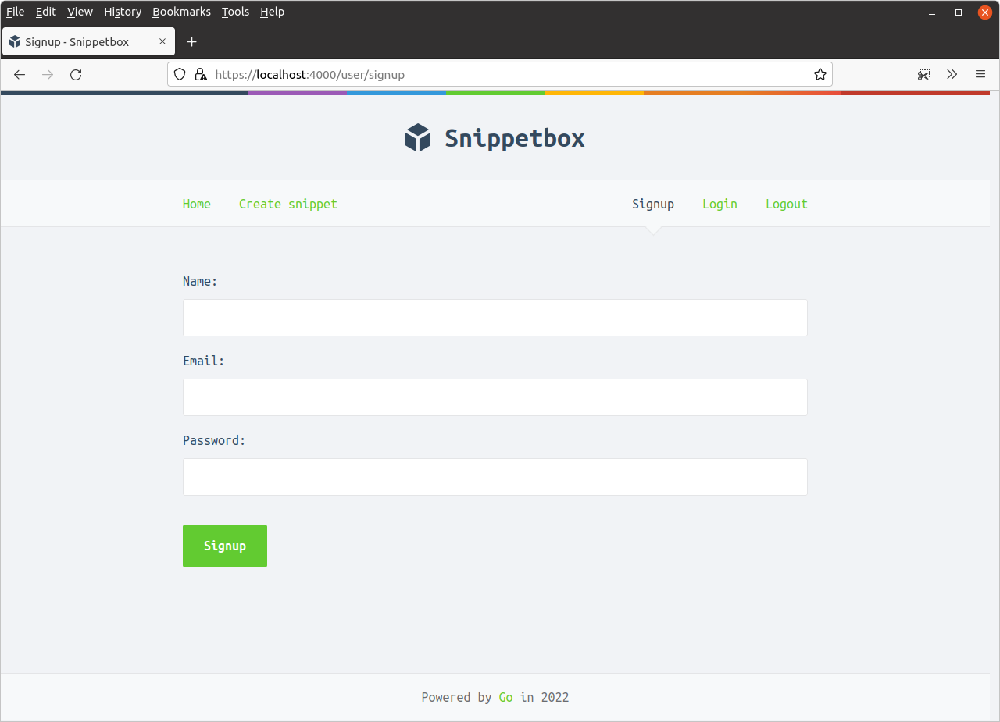

### 验证用户输入

提交此表单后，数据最终将被发布到我们之前创建的 `userSignupPost` 处理器。

该处理器的第一个任务是验证数据，以确保在将数据插入数据库之前它是健全且合理的。具体来说，我们要做四件事：

1. 检查所提供的姓名、电子邮件地址和密码是否为空。
2. 健全性检查电子邮件地址的格式。
3. 确保密码长度至少为 8 个字符。
4. 确保该电子邮件地址尚未被使用。

我们可以通过返回 `internal/validator/validator.go` 文件并创建两个辅助新方法 - `MinChars()` 和 `Matches()` 以及用于检查电子邮件地址完整性的正则表达式来覆盖前三个检查。

像这样：

*文件：internal/validator/validator.go*

```go
package validator

import (
    "regexp" // New import
    "slices"
    "strings"
    "unicode/utf8"
)

// Use the regexp.MustCompile() function to parse a regular expression pattern
// for sanity checking the format of an email address. This returns a pointer to 
// a 'compiled' regexp.Regexp type, or panics in the event of an error. Parsing 
// this pattern once at startup and storing the compiled *regexp.Regexp in a 
// variable is more performant than re-parsing the pattern each time we need it.
var EmailRX = regexp.MustCompile("^[a-zA-Z0-9.!#$%&'*+/=?^_`{|}~-]+@[a-zA-Z0-9](?:[a-zA-Z0-9-]{0,61}[a-zA-Z0-9])?(?:\\.[a-zA-Z0-9](?:[a-zA-Z0-9-]{0,61}[a-zA-Z0-9])?)*$")

...

// MinChars() returns true if a value contains at least n characters.
func MinChars(value string, n int) bool {
    return utf8.RuneCountInString(value) >= n
}

// Matches() returns true if a value matches a provided compiled regular 
// expression pattern.
func Matches(value string, rx *regexp.Regexp) bool {
    return rx.MatchString(value)
}
```

我想快速提一下关于 `EmailRX` 正则表达式模式的一些事情：

- 我们使用的是 W3C 和 Web 超文本应用技术工作组目前推荐的电子邮件地址验证模式。有关该模式的更多信息，请参阅[这里](https://html.spec.whatwg.org/multipage/input.html#valid-e-mail-address)。如果你正在阅读 PDF 版，或设备屏幕较窄而无法看到完整的一行，下面将它拆成多行显示：
  在代码中，这个正则表达式模式必须完整地写在同一行，且不能包含空白字符。如果你更喜欢用其他模式对电子邮件地址做基本合理性检查，也可以自行替换。
    ```text
    "^[a-zA-Z0-9.!#$%&'*+/=?^_`{|}~-]+@[a-zA-Z0-9](?:[a-zA-Z0-9-]{0,61}[a-zA-Z0-9])?
    (?:\\.[a-zA-Z0-9](?:[a-zA-Z0-9-]{0,61}[a-zA-Z0-9])?)*$"
    ```
- 由于 `EmailRX` 正则表达式模式被编写为解释的字符串文字，因此我们需要在正则表达式中使用 `\\` 对 *双转义* [特殊字符](https://www.regular-expressions.info/characters.html) 使其正常工作（我们不能使用原始字符串文字，因为该模式包含反引号字符）。如果您不熟悉字符串文字形式之间的差异，那么 Go 规范的 [这一部分](https://golang.org/ref/spec#String_literals) 值得一读。

但无论如何，我离题了。让我们回到手头的任务。

转到您的 `handlers.go` 文件并添加一些代码来处理表单并运行验证检查，如下所示：

*文件：cmd/web/handlers.go*

```go
package main

...

func (app *application) userSignupPost(w http.ResponseWriter, r *http.Request) {
    // Declare an zero-valued instance of our userSignupForm struct.
    var form userSignupForm

    // Parse the form data into the userSignupForm struct.
    err := app.decodePostForm(r, &form)
    if err != nil {
        app.clientError(w, http.StatusBadRequest)
        return
    }

    // Validate the form contents using our helper functions.
    form.CheckField(validator.NotBlank(form.Name), "name", "This field cannot be blank")
    form.CheckField(validator.NotBlank(form.Email), "email", "This field cannot be blank")
    form.CheckField(validator.Matches(form.Email, validator.EmailRX), "email", "This field must be a valid email address")
    form.CheckField(validator.NotBlank(form.Password), "password", "This field cannot be blank")
    form.CheckField(validator.MinChars(form.Password, 8), "password", "This field must be at least 8 characters long")

    // If there are any errors, redisplay the signup form along with a 422
    // status code.
    if !form.Valid() {
        data := app.newTemplateData(r)
        data.Form = form
        app.render(w, r, http.StatusUnprocessableEntity, "signup.tmpl", data)
        return
    }

    // Otherwise send the placeholder response (for now!).
    fmt.Fprintln(w, "Create a new user...")
}

...
```

现在尝试运行应用程序并将一些无效数据放入注册表单中，如下所示：

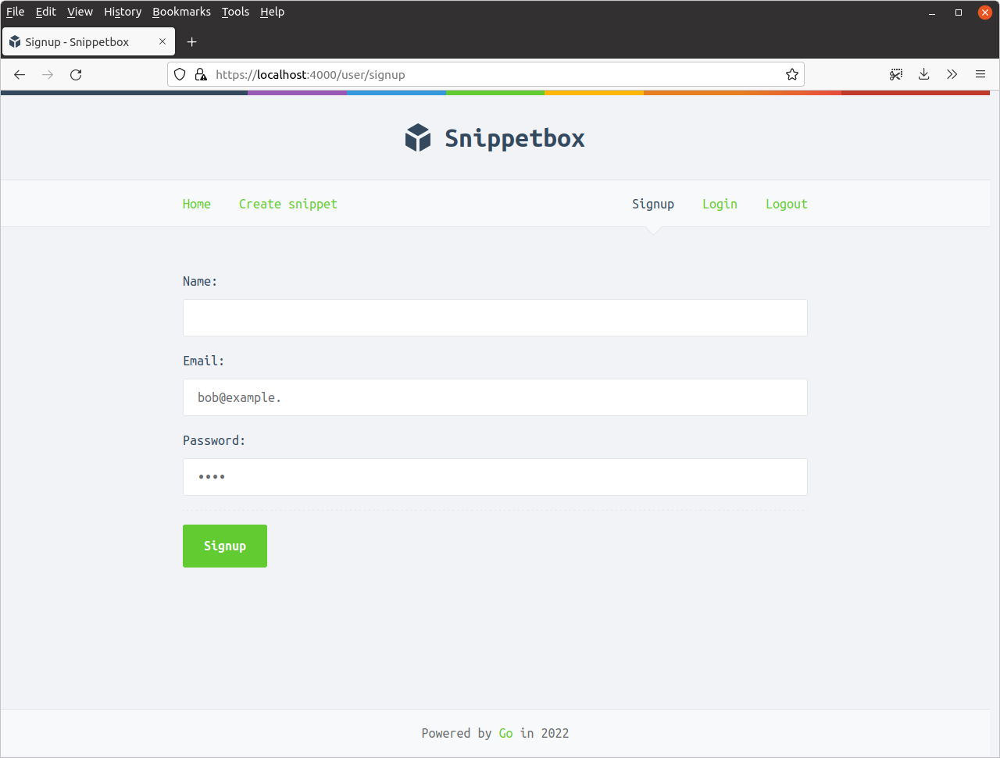

如果您尝试提交它，您应该会看到返回相应的验证失败，如下所示：

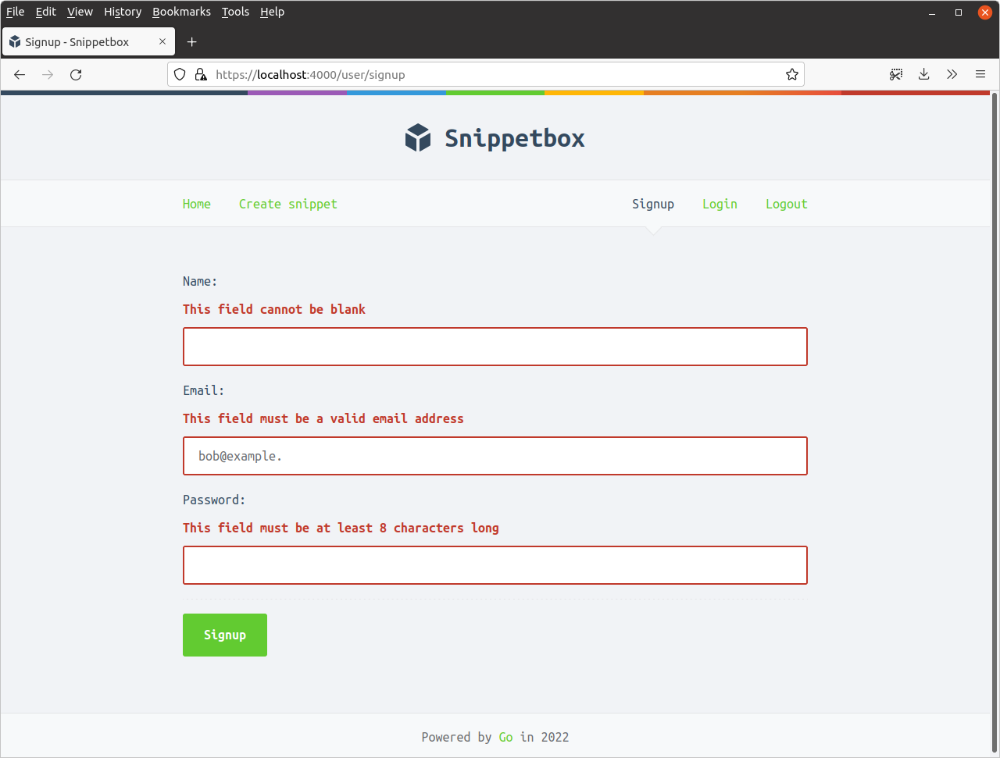

现在剩下的就是第四次验证检查：*确保电子邮件地址尚未被使用*。这处理起来有点棘手。

因为我们对 `users` 表的 `email` 字段有 `UNIQUE` 约束，所以已经保证我们的数据库中不会出现两个具有相同电子邮件地址的用户。所以从业务逻辑和数据完整性的角度来看我们已经没问题了。但问题仍然是我们如何向用户传达任何已在使用的*电子邮件*问题。我们将在本章末尾解决这个问题。

### bcrypt简介

如果您的数据库曾经被攻击者破坏，那么它不包含用户密码的纯文本版本就非常重要。

存储密码的单向哈希值是一种很好的做法（嗯，很重要，确实如此），该密码是通过计算成本高昂的密钥派生函数（例如 Argon2、scrypt 或 bcrypt）派生的。 Go 在 [`golang.org/x/crypto`](https://pkg.go.dev/golang.org/x/crypto) 包中实现了所有 3 种算法。

然而，bcrypt 实现的一个优点是它包含专门为散列和检查密码而设计的辅助函数，这就是我们将在这里使用的。

如果您按照步骤操作，请继续下载最新版本的 [`golang.org/x/crypto/bcrypt`](https://godoc.org/golang.org/x/crypto/bcrypt) 软件包：

```bash
$ go get golang.org/x/crypto/bcrypt@latest
go: downloading golang.org/x/crypto v0.26.0
go get: added golang.org/x/crypto v0.26.0
```

我们将在本书中使用两个函数。第一个是 [`bcrypt.GenerateFromPassword()`](https://godoc.org/golang.org/x/crypto/bcrypt#GenerateFromPassword) 函数，它允许我们创建给定纯文本密码的哈希值，如下所示：

```go
hash, err := bcrypt.GenerateFromPassword([]byte("my plain text password"), 12)
```

该函数将返回一个 60 个字符长的哈希值，看起来有点像这样：

```text
$2a$12$NuTjWXm3KKntReFwyBVHyuf/to.HEwTy.eS206TNfkGfr6HzGJSWG
```

我们传递给 `bcrypt.GenerateFromPassword()` 的第二个参数表示 *cost*，它由 4 到 31 之间的整数表示。上面的示例使用的成本为 12，这意味着将使用 4096 (2^12) bcrypt 迭代来生成密码哈希。

成本越高，攻击者破解哈希值的成本就越高（这是一件好事）。但较高的成本也意味着我们的应用程序需要在用户注册时做更多的工作来创建密码哈希，这意味着应用程序使用的资源会增加，并且最终用户的延迟也会增加。因此，选择合适的成本值是一种平衡行为。 12 的成本是合理的最小值，但如果可能的话，您应该进行负载测试，并且如果您可以将成本设置得更高而不会对用户体验产生不利影响，那么您应该这样做。

另一方面，我们可以使用 [`bcrypt.CompareHashAndPassword()`](https://godoc.org/golang.org/x/crypto/bcrypt#CompareHashAndPassword) 函数检查纯文本密码是否与特定哈希匹配，如下所示：

```go
hash := []byte("$2a$12$NuTjWXm3KKntReFwyBVHyuf/to.HEwTy.eS206TNfkGfr6GzGJSWG")
err := bcrypt.CompareHashAndPassword(hash, []byte("my plain text password"))
```

如果纯文本密码与特定哈希匹配，`bcrypt.CompareHashAndPassword()` 函数将返回 `nil`，如果不匹配，则返回错误。

### 存储用户详细信息

我们构建的下一阶段是更新 `UserModel.Insert()` 方法，以便它在 `users` 表中创建一条新记录，其中包含经过验证的姓名、电子邮件和哈希密码。

这会很有趣，原因有两个：首先，我们想要存储密码的 bcrypt 哈希值（而不是密码本身），其次，我们还需要管理由于重复电子邮件违反我们添加到表中的 `UNIQUE` 约束而导致的潜在错误。

MySQL 返回的所有错误都有一个特定的代码，我们可以用它来分类导致错误的原因（MySQL 错误代码和描述的完整列表可以[在这里找到](https://dev.mysql.com/doc/mysql-errors/8.0/en/)）。如果电子邮件重复，则使用的错误代码将为 `1062 (ER_DUP_ENTRY)`。

打开 `internal/models/users.go` 文件并更新它以包含以下代码：

*文件：internal/models/users.go*

```go
package models

import (
    "database/sql"
    "errors"  // New import
    "strings" // New import
    "time"

    "github.com/go-sql-driver/mysql" // New import
    "golang.org/x/crypto/bcrypt"     // New import
)

...

type UserModel struct {
    DB *sql.DB
}

func (m *UserModel) Insert(name, email, password string) error {
    // Create a bcrypt hash of the plain-text password.
    hashedPassword, err := bcrypt.GenerateFromPassword([]byte(password), 12)
    if err != nil {
        return err
    }

    stmt := `INSERT INTO users (name, email, hashed_password, created)
    VALUES(?, ?, ?, UTC_TIMESTAMP())`

    // Use the Exec() method to insert the user details and hashed password
    // into the users table.
    _, err = m.DB.Exec(stmt, name, email, string(hashedPassword))
    if err != nil {
        // If this returns an error, we use the errors.As() function to check
        // whether the error has the type *mysql.MySQLError. If it does, the
        // error will be assigned to the mySQLError variable. We can then check
        // whether or not the error relates to our users_uc_email key by
        // checking if the error code equals 1062 and the contents of the error 
        // message string. If it does, we return an ErrDuplicateEmail error.
        var mySQLError *mysql.MySQLError
        if errors.As(err, &mySQLError) {
            if mySQLError.Number == 1062 && strings.Contains(mySQLError.Message, "users_uc_email") {
                return ErrDuplicateEmail
            }
        }
        return err
    }

    return nil
}

...
```

然后我们可以通过更新 `userSignup` 处理器来完成这一切，如下所示：

*文件：cmd/web/handlers.go*

```go
package main

...

func (app *application) userSignupPost(w http.ResponseWriter, r *http.Request) {
    var form userSignupForm

    err := app.decodePostForm(r, &form)
    if err != nil {
        app.clientError(w, http.StatusBadRequest)
        return
    }

    form.CheckField(validator.NotBlank(form.Name), "name", "This field cannot be blank")
    form.CheckField(validator.NotBlank(form.Email), "email", "This field cannot be blank")
    form.CheckField(validator.Matches(form.Email, validator.EmailRX), "email", "This field must be a valid email address")
    form.CheckField(validator.NotBlank(form.Password), "password", "This field cannot be blank")
    form.CheckField(validator.MinChars(form.Password, 8), "password", "This field must be at least 8 characters long")

    if !form.Valid() {
        data := app.newTemplateData(r)
        data.Form = form
        app.render(w, r, http.StatusUnprocessableEntity, "signup.tmpl", data)
        return
    }

    // Try to create a new user record in the database. If the email already
    // exists then add an error message to the form and re-display it.
    err = app.users.Insert(form.Name, form.Email, form.Password)
    if err != nil {
        if errors.Is(err, models.ErrDuplicateEmail) {
            form.AddFieldError("email", "Email address is already in use")

            data := app.newTemplateData(r)
            data.Form = form
            app.render(w, r, http.StatusUnprocessableEntity, "signup.tmpl", data)
        } else {
            app.serverError(w, r, err)
        }

        return
    }

    // Otherwise add a confirmation flash message to the session confirming that
    // their signup worked.
    app.sessionManager.Put(r.Context(), "flash", "Your signup was successful. Please log in.")

    // And redirect the user to the login page.
    http.Redirect(w, r, "/user/login", http.StatusSeeOther)
}

...
```

保存文件，重新启动应用程序并尝试注册帐户。请务必记住您使用的电子邮件地址和密码……您将在下一章中需要它们！

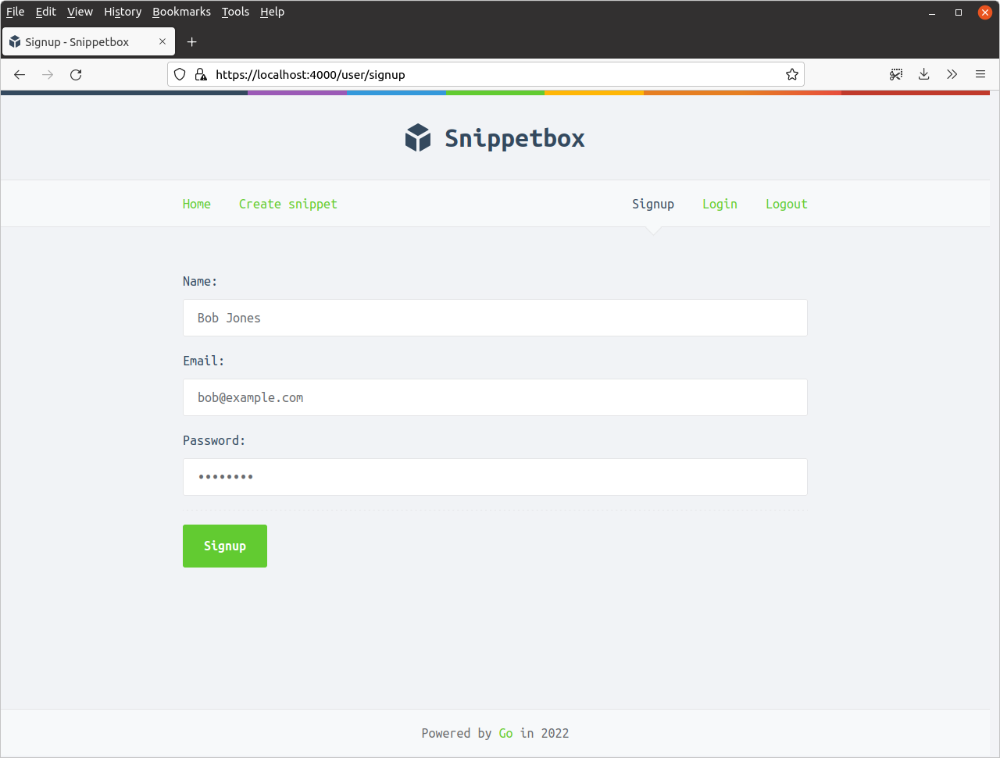

如果一切正常，您应该会发现您的浏览器在提交表单后将您重定向到 `https://localhost:4000/user/login`。


此时值得打开 MySQL 数据库并查看 `users` 表的内容。您应该会看到一条新记录，其中包含您刚刚用于注册的详细信息以及密码的 bcrypt 哈希值。

```bash
mysql> SELECT * FROM users;
+----+-----------+-----------------+--------------------------------------------------------------+---------------------+
| id | name      | email           | hashed_password                                              | created             |
+----+-----------+-----------------+--------------------------------------------------------------+---------------------+
|  1 | Bob Jones | bob@example.com | $2a$12$mNXQrOwVWp/TqAzCCyDoyegtpV40EXwrzVLnbFpHPpWdvnmIoZ.Q. | 2024-03-18 11:29:23 |
+----+-----------+-----------------+--------------------------------------------------------------+---------------------+
1 row in set (0.01 sec)
```

如果您愿意，请尝试返回注册表单并添加具有相同电子邮件地址的另一个帐户。您应该会收到如下所示的验证失败信息：

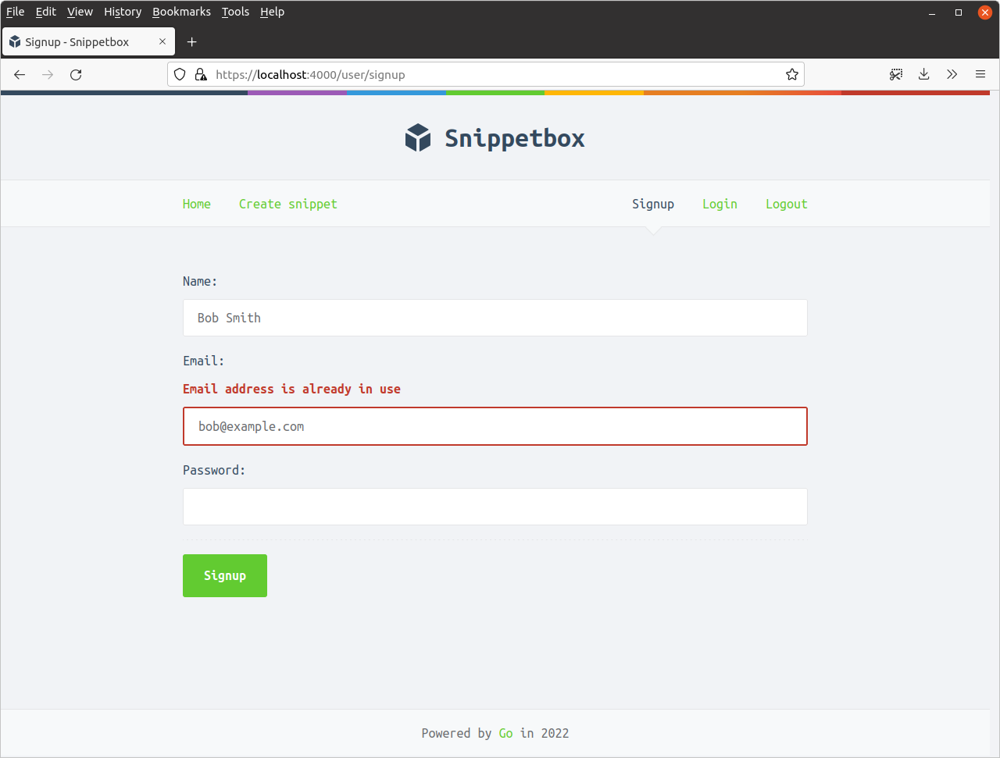

---

### 补充说明

#### 使用数据库 bcrypt 实现

一些数据库提供内置函数，您可以使用它们进行密码哈希和验证，而不是像我们在上面的代码中那样在 Go 中实现自己的函数。

但避免使用它们可能是个好主意，原因有两个：

- 由于字符串比较时间不是恒定的，它们往往容易受到 [侧信道定时攻击](https://en.wikipedia.org/wiki/Timing_attack)，至少在 [PostgreSQL](https://www.postgresql.org/docs/9.0/pgcrypto.html#AEN129954) 和 [MySQL](https://security.stackexchange.com/a/83675/210340) 中如此。
- 除非您非常小心，否则将纯文本密码发送到数据库可能会导致密码意外记录在数据库日志之一中。密码意外记录在日志中的几个备受瞩目的示例是 2018 年的 [GitHub](https://www.bleepingcomputer.com/news/security/github-accidentally-recorded-some-plaintext-passwords-in-its-internal-logs/) 和 [Twitter](https://www.bleepingcomputer.com/news/security/twitter-admits-recording-plaintext-passwords-in-internal-logs-just-like-github/) 事件。

#### 检查电子邮件重复项的替代方法

我知道我们的 `UserModel.Insert()` 方法中的代码不是很漂亮，并且检查 MySQL 返回的错误感觉有点不稳定。如果 MySQL 的未来版本更改了错误号怎么办？或者他们的错误消息的格式？

另一种（但也不完美）选项是向我们的模型添加 `UserModel.EmailTaken()` 方法，该方法检查具有特定电子邮件的用户是否已存在。我们可以在尝试插入新记录之前调用此 *，并根据需要向表单添加验证错误消息。

但是，这会给我们的应用程序引入 *竞争条件*。如果两个用户尝试同时在 *上使用同一电子邮件地址* 进行注册，则两次提交都将通过验证检查，但最终只有一个 `INSERT` 进入 MySQL 数据库会成功。另一个将违反我们的 `UNIQUE` 约束，用户最终将收到 `500 Internal Server Error` 响应。

这种特定竞争条件的结果相当良性，[一些人](https://stackoverflow.com/questions/25702813/how-to-avoid-race-condition-with-unique-checks-in-django)会建议您不要担心它。但是，批判性地思考你的应用程序逻辑并编写避免竞争条件的代码是一个好习惯，并且如果有可行的替代方案（就像本例一样），最好避免在代码库中使用已知的竞争条件。

---

<!-- 来源章节：10.04-user-login.md -->

*第 10.4 章。*

## 用户登录

在本章中，我们将重点关注为我们的应用程序创建用户登录页面。

在我们进入这项工作的主要部分之前，让我们快速回顾一下我们之前制作的 `internal/validator` 包，并更新它以支持与一个特定表单字段* 不相关的验证错误 *。

如果用户登录失败，我们将在本章稍后使用此信息向用户显示通用的“*您的电子邮件地址或密码错误”*消息，因为这被认为比明确指示登录失败的原因[更安全](https://cheatsheetseries.owasp.org/cheatsheets/Authentication_Cheat_Sheet.html#authentication-responses)。

请继续更新您的 `internal/validator/validator.go` 文件，如下所示：

*文件：internal/validator/validator.go*

```go
package validator

...

// Add a new NonFieldErrors []string field to the struct, which we will use to 
// hold any validation errors which are not related to a specific form field.
type Validator struct {
    NonFieldErrors []string
    FieldErrors    map[string]string
}

// Update the Valid() method to also check that the NonFieldErrors slice is
// empty.
func (v *Validator) Valid() bool {
    return len(v.FieldErrors) == 0 && len(v.NonFieldErrors) == 0
}

// Create an AddNonFieldError() helper for adding error messages to the new
// NonFieldErrors slice.
func (v *Validator) AddNonFieldError(message string) {
    v.NonFieldErrors = append(v.NonFieldErrors, message)
}

...
```

接下来，我们创建一个新的 `ui/html/pages/login.tmpl` 模板，其中包含登录页面的标记。我们将遵循相同的模式来显示验证错误并重新显示我们用于注册页面的数据。

```bash
$ touch ui/html/pages/login.tmpl
```

*文件：ui/html/pages/login.tmpl*

```html
{{define "title"}}Login{{end}}

{{define "main"}}
<form action='/user/login' method='POST' novalidate>
    <!-- Notice that here we are looping over the NonFieldErrors and displaying
    them, if any exist -->
    {{range .Form.NonFieldErrors}}
        <div class='error'>{{.}}</div>
    {{end}}
    <div>
        <label>Email:</label>
        {{with .Form.FieldErrors.email}}
            <label class='error'>{{.}}</label>
        {{end}}
        <input type='email' name='email' value='{{.Form.Email}}'>
    </div>
    <div>
        <label>Password:</label>
        {{with .Form.FieldErrors.password}}
            <label class='error'>{{.}}</label>
        {{end}}
        <input type='password' name='password'>
    </div>
    <div>
        <input type='submit' value='Login'>
    </div>
</form>
{{end}}
```

然后，让我们前往 `cmd/web/handlers.go` 文件并创建一个新的 `userLoginForm` 结构（用于表示和保存表单数据），并调整我们的 `userLogin` 处理器来呈现登录页面。

就像这样：

*文件：cmd/web/handlers.go*

```go
package main

...

// Create a new userLoginForm struct.
type userLoginForm struct {
    Email               string `form:"email"`
    Password            string `form:"password"`
    validator.Validator `form:"-"`
}

// Update the handler so it displays the login page.
func (app *application) userLogin(w http.ResponseWriter, r *http.Request) {
    data := app.newTemplateData(r)
    data.Form = userLoginForm{}
    app.render(w, r, http.StatusOK, "login.tmpl", data)
}

...
```

如果您运行应用程序并访问 [`https://localhost:4000/user/login`](https://localhost:4000/user/login)，您现在应该看到如下所示的登录页面：


### 验证用户详细信息

接下来是有趣的部分：*我们如何验证用户提交的电子邮件和密码是否正确？*

该验证逻辑的核心部分将发生在我们用户模型的 `UserModel.Authenticate()` 方法中。具体来说，我们需要它来做两件事：

1. 首先，它应该从我们的 MySQL `users` 表中检索与电子邮件地址关联的哈希密码。如果数据库中不存在该电子邮件，我们将返回之前创建的 `ErrInvalidCredentials` 错误。
2. 否则，我们希望将 `users` 表中的哈希密码与用户登录时提供的纯文本密码进行比较。如果它们不匹配，我们希望再次返回 `ErrInvalidCredentials` 错误。但如果它们匹配，我们希望从数据库返回用户的 `id` 值。

我们就这么做吧。继续将以下代码添加到您的 `internal/models/users.go` 文件中：

*文件：internal/models/users.go*

```go
package models

...

func (m *UserModel) Authenticate(email, password string) (int, error) {
    // Retrieve the id and hashed password associated with the given email. If
    // no matching email exists we return the ErrInvalidCredentials error.
    var id int
    var hashedPassword []byte

    stmt := "SELECT id, hashed_password FROM users WHERE email = ?"

    err := m.DB.QueryRow(stmt, email).Scan(&id, &hashedPassword)
    if err != nil {
        if errors.Is(err, sql.ErrNoRows) {
            return 0, ErrInvalidCredentials
        } else {
            return 0, err
        }
    }

    // Check whether the hashed password and plain-text password provided match.
    // If they don't, we return the ErrInvalidCredentials error.
    err = bcrypt.CompareHashAndPassword(hashedPassword, []byte(password))
    if err != nil {
        if errors.Is(err, bcrypt.ErrMismatchedHashAndPassword) {
            return 0, ErrInvalidCredentials
        } else {
            return 0, err
        }
    }

    // Otherwise, the password is correct. Return the user ID.
    return id, nil
}
```

我们的下一步涉及更新 `userLoginPost` 处理器，以便它解析提交的登录表单数据并调用此 `UserModel.Authenticate()` 方法。

如果登录详细信息有效，那么我们希望将用户的 `id` 添加到他们的会话数据中，以便 - 对于将来的请求 - 我们知道他们已成功通过身份验证以及他们是哪个用户。

转到您的 `handlers.go` 文件并按如下方式更新：

*文件：cmd/web/handlers.go*

```go
package main

...

func (app *application) userLoginPost(w http.ResponseWriter, r *http.Request) {
    // Decode the form data into the userLoginForm struct.
    var form userLoginForm

    err := app.decodePostForm(r, &form)
    if err != nil {
        app.clientError(w, http.StatusBadRequest)
        return
    }

    // Do some validation checks on the form. We check that both email and
    // password are provided, and also check the format of the email address as
    // a UX-nicety (in case the user makes a typo).
    form.CheckField(validator.NotBlank(form.Email), "email", "This field cannot be blank")
    form.CheckField(validator.Matches(form.Email, validator.EmailRX), "email", "This field must be a valid email address")
    form.CheckField(validator.NotBlank(form.Password), "password", "This field cannot be blank")

    if !form.Valid() {
        data := app.newTemplateData(r)
        data.Form = form
        app.render(w, r, http.StatusUnprocessableEntity, "login.tmpl", data)
        return
    }

    // Check whether the credentials are valid. If they're not, add a generic
    // non-field error message and re-display the login page.
    id, err := app.users.Authenticate(form.Email, form.Password)
    if err != nil {
        if errors.Is(err, models.ErrInvalidCredentials) {
            form.AddNonFieldError("Email or password is incorrect")

            data := app.newTemplateData(r)
            data.Form = form
            app.render(w, r, http.StatusUnprocessableEntity, "login.tmpl", data)
        } else {
            app.serverError(w, r, err)
        }
        return
    }

    // Use the RenewToken() method on the current session to change the session
    // ID. It's good practice to generate a new session ID when the 
    // authentication state or privilege levels changes for the user (e.g. login
    // and logout operations).
    err = app.sessionManager.RenewToken(r.Context())
    if err != nil {
        app.serverError(w, r, err)
        return
    }

    // Add the ID of the current user to the session, so that they are now
    // 'logged in'.
    app.sessionManager.Put(r.Context(), "authenticatedUserID", id)

    // Redirect the user to the create snippet page.
    http.Redirect(w, r, "/snippet/create", http.StatusSeeOther)
}

...
```

> **注意：** 我们在上面的代码中使用的 [`SessionManager.RenewToken()`](https://pkg.go.dev/github.com/alexedwards/scs/v2#SessionManager.RenewToken) 方法将更改当前用户会话的 ID *，但保留与会话相关的任何数据*。最好在登录前执行此操作，以降低会话固定攻击的风险。有关这方面的更多背景和信息，请参阅 [OWASP 会话管理备忘单](https://github.com/OWASP/CheatSheetSeries/blob/master/cheatsheets/Session_Management_Cheat_Sheet.md#renew-the-session-id-after-any-privilege-level-change)。

好吧，让我们尝试一下！

重新启动应用程序并尝试提交一些无效的用户凭据...


您应该收到一条非字段验证错误消息，如下所示：


但是，当您输入一些正确的凭据（使用您在上一章中创建的用户的电子邮件地址和密码）时，应用程序应该让您登录并将您重定向到创建片段页面，如下所示：


我们在最后两章中已经介绍了很多内容，所以让我们快速回顾一下事情的进展情况。

- 用户现在可以使用 `GET /user/signup` 表单在网站上*注册*。我们将注册用户的详细信息（包括其密码的哈希版本）存储在数据库的 `users` 表中。
- 然后，注册用户可以使用 `GET /user/login` 表单提供其电子邮件地址和密码来*进行身份验证*。如果这些与注册用户的详细信息匹配，我们认为他们已成功通过身份验证，并将相关的 `"authenticatedUserID"` 值添加到其会话数据中。

---

<!-- 来源章节：10.05-user-logout.md -->

*第 10.5 章。*

## 用户注销

这使我们可以很好地注销用户。与注册和登录相比，实现用户注销非常简单 - 本质上我们需要做的就是从会话中删除 `"authenticatedUserID"` 值。

同时，最好再次更新会话 ID，我们还将在会话数据中添加一条闪存消息，以向用户确认他们已注销。

让我们更新 `userLogoutPost` 处理器来做到这一点。

*文件：cmd/web/handlers.go*

```go
package main

...

func (app *application) userLogoutPost(w http.ResponseWriter, r *http.Request) {
    // Use the RenewToken() method on the current session to change the session
    // ID again.
    err := app.sessionManager.RenewToken(r.Context())
    if err != nil {
        app.serverError(w, r, err)
        return
    }

    // Remove the authenticatedUserID from the session data so that the user is
    // 'logged out'.
    app.sessionManager.Remove(r.Context(), "authenticatedUserID")

    // Add a flash message to the session to confirm to the user that they've been
    // logged out.
    app.sessionManager.Put(r.Context(), "flash", "You've been logged out successfully!")

    // Redirect the user to the application home page.
    http.Redirect(w, r, "/", http.StatusSeeOther)
}
```

保存文件并重新启动应用程序。如果您现在单击导航栏中的“注销”链接，您应该注销并重定向到主页，如下所示：


---

<!-- 来源章节：10.06-user-authorization.md -->

*第 10.6 章。*

## 用户授权

能够对应用程序的用户进行身份验证固然很好，但现在我们需要利用这些信息做一些有用的事情。在本章中，我们将介绍一些 *授权* 检查，以便：

1. 只有经过身份验证（即登录）的用户才能创建新的代码片段；和
2. 导航栏的内容根据用户是否经过身份验证（登录）而变化。具体来说：
    - 经过身份验证的用户应该看到“主页”、“创建片段”和“注销”的链接。
    - 未经身份验证的用户应该会看到“主页”、“注册”和“登录”的链接。

正如我在上一章中简要提到的，我们可以通过检查会话数据中是否存在 `"authenticatedUserID"` 值来检查请求是否由经过身份验证的用户发出。

那么让我们从这个开始吧。打开 `cmd/web/helpers.go` 文件并添加 `isAuthenticated()` 辅助函数以返回身份验证状态，如下所示：

*文件：cmd/web/helpers.go*

```go
package main

...

// Return true if the current request is from an authenticated user, otherwise
// return false.
func (app *application) isAuthenticated(r *http.Request) bool {
    return app.sessionManager.Exists(r.Context(), "authenticatedUserID")
}
```

这很整洁。现在，我们只需调用此 `isAuthenticated()` 帮助程序即可检查请求是否来自经过身份验证（登录）的用户。

下一步是找到一种方法将此信息传递到我们的 HTML 模板，以便我们可以适当地切换导航栏的内容。

这有两个部分。首先，我们需要向 `templateData` 结构添加一个新的 `IsAuthenticated` 字段：

*文件：cmd/web/templates.go*

```go
package main

import (
    "html/template"
    "path/filepath"
    "time"

    "snippetbox.alexedwards.net/internal/models"
)

type templateData struct {
    CurrentYear     int
    Snippet         models.Snippet
    Snippets        []models.Snippet
    Form            any
    Flash           string
    IsAuthenticated bool // Add an IsAuthenticated field to the templateData struct.
}

...
```

第二步是更新我们的 `newTemplateData()` 帮助器，以便每次渲染模板时此信息都会自动添加到 `templateData` 结构中。就像这样：

*文件：cmd/web/helpers.go*

```go
package main

...

func (app *application) newTemplateData(r *http.Request) templateData {
    return templateData{
        CurrentYear:     time.Now().Year(),
        Flash:           app.sessionManager.PopString(r.Context(), "flash"),
        // Add the authentication status to the template data.
        IsAuthenticated: app.isAuthenticated(r),
    }
}

...
```

完成后，我们可以更新 `ui/html/partials/nav.tmpl` 文件以使用 `{{if .IsAuthenticated}}` 操作切换导航链接，如下所示：

*文件：ui/html/partials/nav.tmpl*

```html
{{define "nav"}}
<nav>
    <div>
        <a href='/'>Home</a>
        <!-- Toggle the link based on authentication status -->
        {{if .IsAuthenticated}}
            <a href='/snippet/create'>Create snippet</a>
        {{end}}
    </div>
    <div>
        <!-- Toggle the links based on authentication status -->
        {{if .IsAuthenticated}}
            <form action='/user/logout' method='POST'>
                <button>Logout</button>
            </form>
        {{else}}
            <a href='/user/signup'>Signup</a>
            <a href='/user/login'>Login</a>
        {{end}}
    </div>
</nav>
{{end}}
```

保存所有文件并立即尝试运行该应用程序。如果您当前尚未登录，您的应用程序主页应如下所示：

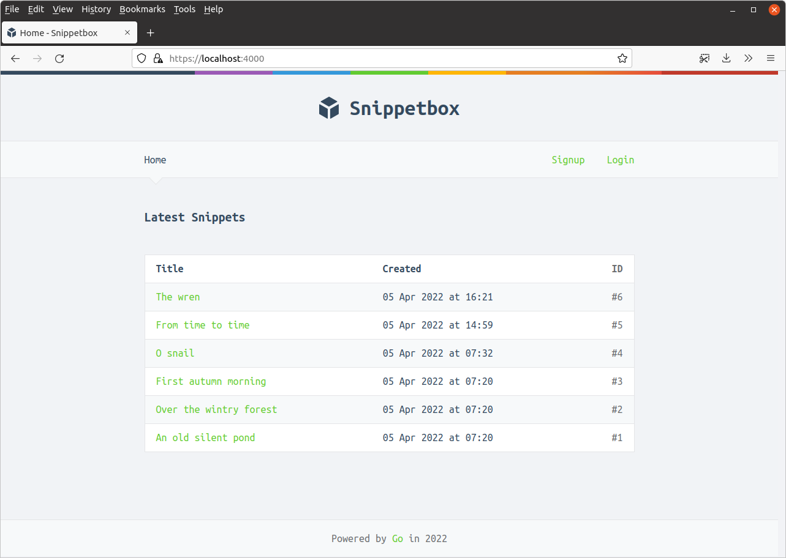

否则，如果您已登录，您的主页应如下所示：

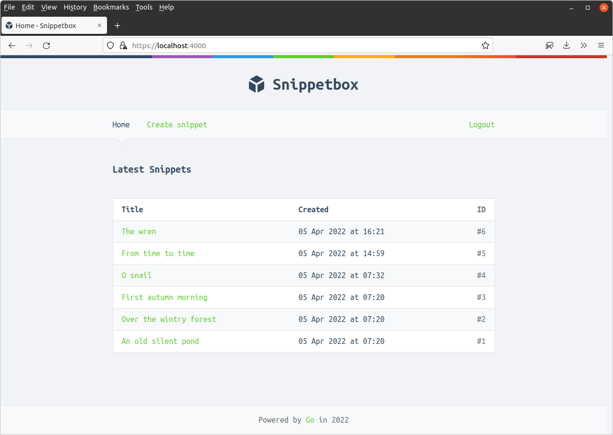

请随意尝试一下，并尝试登录和退出，直到您确信导航栏已按照您的预期进行更改。

### 限制访问

目前，我们为任何未登录的用户隐藏“创建片段”导航链接。但未经身份验证的用户仍然可以通过直接访问 [`https://localhost:4000/snippet/create`](https://localhost:4000/snippet/create) 页面来创建新片段。

让我们解决这个问题，这样，如果未经身份验证的用户尝试访问 URL 路径为 `/snippet/create` 的任何路由，他们就会被重定向到 `/user/login`。

最简单的方法是通过一些中间件。打开 `cmd/web/middleware.go` 文件并创建一个新的 `requireAuthentication()` 中间件函数，遵循我们在本书前面使用的 [相同的模式](06.01-how-middleware-works.md)：

*文件：cmd/web/middleware.go*

```go
package main

...

func (app *application) requireAuthentication(next http.Handler) http.Handler {
    return http.HandlerFunc(func(w http.ResponseWriter, r *http.Request) {
        // If the user is not authenticated, redirect them to the login page and
        // return from the middleware chain so that no subsequent handlers in
        // the chain are executed.
        if !app.isAuthenticated(r) {
            http.Redirect(w, r, "/user/login", http.StatusSeeOther)
            return
        }

        // Otherwise set the "Cache-Control: no-store" header so that pages
        // require authentication are not stored in the users browser cache (or
        // other intermediary cache).
        w.Header().Add("Cache-Control", "no-store")

        // And call the next handler in the chain.
        next.ServeHTTP(w, r)
    })
}
```

我们现在可以将此中间件添加到我们的 `cmd/web/routes.go` 文件中以保护特定路由。

在我们的例子中，我们要保护 `GET /snippet/create` 和 `POST /snippet/create` 路由。如果用户未登录，则注销用户没有多大意义，因此在 `POST /user/logout` 路由上使用它也是有意义的。

为了帮助解决这个问题，让我们将我们的申请路由重新排列成两个“组”。

第一组将包含我们的“不受保护”路由并使用我们现有的 `dynamic` 中间件链。第二组将包含我们的“受保护”路由，并将使用新的 `protected` 中间件链 — 由 `dynamic` 中间件链 *加上* 我们新的 `requireAuthentication()` 中间件组成。

像这样：

*文件：cmd/web/routes.go*

```go
package main

...

func (app *application) routes() http.Handler {
    mux := http.NewServeMux()

    fileServer := http.FileServer(http.Dir("./ui/static/"))
    mux.Handle("GET /static/", http.StripPrefix("/static", fileServer))

    // Unprotected application routes using the "dynamic" middleware chain.
    dynamic := alice.New(app.sessionManager.LoadAndSave)

    mux.Handle("GET /{$}", dynamic.ThenFunc(app.home))
    mux.Handle("GET /snippet/view/{id}", dynamic.ThenFunc(app.snippetView))
    mux.Handle("GET /user/signup", dynamic.ThenFunc(app.userSignup))
    mux.Handle("POST /user/signup", dynamic.ThenFunc(app.userSignupPost))
    mux.Handle("GET /user/login", dynamic.ThenFunc(app.userLogin))
    mux.Handle("POST /user/login", dynamic.ThenFunc(app.userLoginPost))

    // Protected (authenticated-only) application routes, using a new "protected"
    // middleware chain which includes the requireAuthentication middleware.
    protected := dynamic.Append(app.requireAuthentication)

    mux.Handle("GET /snippet/create", protected.ThenFunc(app.snippetCreate))
    mux.Handle("POST /snippet/create", protected.ThenFunc(app.snippetCreatePost))
    mux.Handle("POST /user/logout", protected.ThenFunc(app.userLogoutPost))

    standard := alice.New(app.recoverPanic, app.logRequest, commonHeaders)
    return standard.Then(mux)
}
```

保存文件，重新启动应用程序并确保您已注销。

然后尝试直接在浏览器中访问 [`https://localhost:4000/snippet/create`](https://localhost:4000/snippet/create)。您应该发现您立即被重定向到登录表单。

如果您愿意，您还可以使用curl 确认未经身份验证的用户也被重定向到`POST /snippet/create` 路由：

```bash
$ curl -ki -d "" https://localhost:4000/snippet/create
HTTP/2 303 
content-security-policy: default-src 'self'; style-src 'self' fonts.googleapis.com; font-src fonts.gstatic.com
location: /user/login
referrer-policy: origin-when-cross-origin
server: Go
vary: Cookie
x-content-type-options: nosniff
x-frame-options: deny
x-xss-protection: 0
content-length: 0
date: Wed, 18 Mar 2024 11:29:23 GMT
```

---

### 补充说明

#### 不使用爱丽丝

如果您不使用 `justinas/alice` 包来管理中间件，那没关系 - 您可以像这样手动包装处理器：

```go
mux.Handle("POST /snippet/create", app.sessionManager.LoadAndSave(app.requireAuthentication(http.HandlerFunc(app.snippetCreate))))
```

---

<!-- 来源章节：10.07-csrf-protection.md -->

*第 10.7 章。*

## 跨站请求伪造保护

在本章中，我们将了解如何保护我们的应用程序免受[跨站点请求伪造](https://cheatsheetseries.owasp.org/cheatsheets/Cross-Site_Request_Forgery_Prevention_Cheat_Sheet.html)（CSRF）攻击。

如果您不熟悉 CSRF 的原理，这是一种恶意第三方网站向您的网站发送状态更改 HTTP 请求的攻击。关于基本 CSRF 攻击的详细解释可以在[这里找到](http://www.gnucitizen.org/blog/csrf-demystified/)。

在我们的应用中，主要风险是：

- 用户登录我们的应用程序。我们的会话 cookie 设置为持续 12 小时，因此即使他们离开应用程序，他们也将保持登录状态。
- 然后，用户访问另一个网站，其中包含一些恶意代码，这些代码向我们的 `POST /snippet/create` 端点发送跨站点请求，以将新代码段添加到我们的数据库中。我们应用程序的用户会话 cookie 将随此请求一起发送。
- 由于请求包含会话 cookie，因此我们的应用程序会将请求解释为来自登录用户，并将使用该用户的权限处理该请求。由于用户完全不知道，因此新的代码片段将添加到我们的数据库中。

除了上述“传统”CSRF 攻击（使用登录用户的权限处理请求）之外，您的应用程序还可能面临 [登录和注销](https://stackoverflow.com/questions/6412813/do-login-forms-need-tokens-against-csrf-attacks) CSRF 攻击的风险。

### 同站点 cookies

我们可以采取的防止 CSRF 攻击的一种缓解措施是确保在我们的会话 cookie 上正确设置 [`SameSite`](https://cheatsheetseries.owasp.org/cheatsheets/Cross-Site_Request_Forgery_Prevention_Cheat_Sheet.html#samesite-cookie-attribute) 属性。

默认情况下，我们使用的 `alexedwards/scs` 包始终在会话 cookie 上设置 `SameSite=Lax`。这意味着，对于使用 HTTP 方法 `POST`、`PUT` 或 `DELETE` 的任何跨站点请求，用户浏览器不会*发送会话 cookie *。

只要我们的应用程序对任何状态更改的 HTTP 请求使用 `POST` 方法（就像我们的 *login*、*signup*、*logout* 和*创建片段*表单提交），这意味着如果这些请求来自其他网站，则不会发送会话 cookie，从而防止 CSRF 攻击。

然而，`SameSite` 属性仍然相对较新，并且仅得到全球 [96% 的浏览器](https://caniuse.com/#feat=same-site-cookie-attribute) 的完全支持。因此，尽管我们可以（并且应该）将其用作防御措施，但我们不能为所有用户依赖它。

### 基于令牌的缓解措施

为了减轻所有用户的 CSRF 风险，我们还需要实现某种形式的 [令牌检查](https://cheatsheetseries.owasp.org/cheatsheets/Cross-Site_Request_Forgery_Prevention_Cheat_Sheet.html#token-based-mitigation)。就像会话管理和密码散列一样，当涉及到这一点时，您可能会犯很多错误......因此，使用经过尝试和测试的第三方包而不是滚动自己的实现可能是最安全的。

在 Go Web 应用程序中阻止 CSRF 攻击的两个最流行的软件包是 [`gorilla/csrf`](https://github.com/gorilla/csrf) 和 [`justinas/nosurf`](https://github.com/justinas/nosurf)。它们都做大致相同的事情，使用 [双重提交 cookie](https://cheatsheetseries.owasp.org/cheatsheets/Cross-Site_Request_Forgery_Prevention_Cheat_Sheet.html#double-submit-cookie) 模式来防止攻击。在此模式中，会生成随机 *CSRF 令牌*，并在 *CSRF cookie* 中发送给用户。然后，将此 CSRF 令牌添加到每个可能容易受到 CSRF 攻击的 HTML 表单中的隐藏字段。提交表单时，两个包都会使用一些中间件来检查隐藏字段值和 cookie 值是否匹配。

在这两个包中，我们将选择在本书中使用 `justinas/nosurf`。我更喜欢它主要是因为它是独立的并且没有任何额外的依赖项。如果您按照步骤进行操作，则可以安装最新版本，如下所示：

```bash
$ go get github.com/justinas/nosurf@v1
go: downloading github.com/justinas/nosurf v1.1.1
go get: added github.com/justinas/nosurf v1.1.1
```

### 使用 nosurf 包

要使用 `justinas/nosurf`，请打开 `cmd/web/middleware.go` 文件并创建一个新的 `noSurf()` 中间件函数，如下所示：

*文件：cmd/web/middleware.go*

```go
package main

import (
    "fmt"
    "net/http"

    "github.com/justinas/nosurf" // New import
)

...

// Create a NoSurf middleware function which uses a customized CSRF cookie with
// the Secure, Path and HttpOnly attributes set.
func noSurf(next http.Handler) http.Handler {
    csrfHandler := nosurf.New(next)
    csrfHandler.SetBaseCookie(http.Cookie{
        HttpOnly: true,
        Path:     "/",
        Secure:   true,
    })

    return csrfHandler
}
```

我们需要防止 CSRF 攻击的表单之一是注销表单，它包含在我们的 `nav.tmpl` 部分中，并且可能出现在我们应用程序的任何页面上。因此，因此，我们需要在应用程序路由的 *所有* 上使用 `noSurf()` 中间件（`GET /static/` 除外）。

因此，让我们更新 `cmd/web/routes.go` 文件，将此 `noSurf()` 中间件添加到我们之前创建的 `dynamic` 中间件链中：

*文件：cmd/web/routes.go*

```go
package main

...

func (app *application) routes() http.Handler {
     mux := http.NewServeMux()

    fileServer := http.FileServer(http.Dir("./ui/static/"))
    mux.Handle("GET /static/", http.StripPrefix("/static", fileServer))

    // Use the nosurf middleware on all our 'dynamic' routes.
    dynamic := alice.New(app.sessionManager.LoadAndSave, noSurf)

    mux.Handle("GET /{$}", dynamic.ThenFunc(app.home))
    mux.Handle("GET /snippet/view/{id}", dynamic.ThenFunc(app.snippetView))
    mux.Handle("GET /user/signup", dynamic.ThenFunc(app.userSignup))
    mux.Handle("POST /user/signup", dynamic.ThenFunc(app.userSignupPost))
    mux.Handle("GET /user/login", dynamic.ThenFunc(app.userLogin))
    mux.Handle("POST /user/login", dynamic.ThenFunc(app.userLoginPost))

    protected := dynamic.Append(app.requireAuthentication)

    mux.Handle("GET /snippet/create", protected.ThenFunc(app.snippetCreate))
    mux.Handle("POST /snippet/create", protected.ThenFunc(app.snippetCreatePost))
    mux.Handle("POST /user/logout", protected.ThenFunc(app.userLogoutPost))

    standard := alice.New(app.recoverPanic, app.logRequest, commonHeaders)
    return standard.Then(mux)
}
```

此时，您可能想启动应用程序并尝试提交其中一份表单。当您这样做时，请求应该被 `noSurf()` 中间件拦截，并且您应该收到 `400 Bad Request` 响应。


为了使表单提交工作，我们需要使用 [`nosurf.Token()`](https://pkg.go.dev/github.com/justinas/nosurf?utm_source=godoc#Token) 函数来获取 CSRF 令牌并将其添加到每个表单中的隐藏 `csrf_token` 字段中。因此，下一步是向我们的 `templateData` 结构添加一个新的 `CSRFToken` 字段：

*文件：cmd/web/templates.go*

```go
package main

import (
    "html/template"
    "path/filepath"
    "time"

    "snippetbox.alexedwards.net/internal/models"
)

type templateData struct {
    CurrentYear     int
    Snippet         models.Snippet
    Snippets        []models.Snippet
    Form            any
    Flash           string
    IsAuthenticated bool
    CSRFToken       string // Add a CSRFToken field.
}

...
```

而且由于注销表单可能会出现在每个页面上，因此通过我们的 `newTemplateData()` 帮助程序自动将 CSRF 令牌添加到模板数据是有意义的。这意味着每次渲染页面时，它都可用于我们的模板。

请继续更新 `cmd/web/helpers.go` 文件，如下所示：

*文件：cmd/web/helpers.go*

```go
package main

import (
    "bytes"
    "errors"
    "fmt"
    "net/http"
    "time"

    "github.com/go-playground/form/v4"
    "github.com/justinas/nosurf" // New import
)

...

func (app *application) newTemplateData(r *http.Request) templateData {
    return templateData{
        CurrentYear:     time.Now().Year(),
        Flash:           app.sessionManager.PopString(r.Context(), "flash"),
        IsAuthenticated: app.isAuthenticated(r),
        CSRFToken:       nosurf.Token(r), // Add the CSRF token.
    }
}

...
```

最后，我们需要更新应用程序中的所有表单，以将此 CSRF 令牌包含在隐藏字段中。

就像这样：

*文件：ui/html/pages/create.tmpl*

```html
{{define "title"}}Create a New Snippet{{end}}

{{define "main"}}
<form action='/snippet/create' method='POST'>
    <!-- Include the CSRF token -->
    <input type='hidden' name='csrf_token' value='{{.CSRFToken}}'>
    <div>
        <label>Title:</label>
        {{with .Form.FieldErrors.title}}
            <label class='error'>{{.}}</label>
        {{end}}
        <input type='text' name='title' value='{{.Form.Title}}'>
    </div>
    <div>
        <label>Content:</label>
        {{with .Form.FieldErrors.content}}
            <label class='error'>{{.}}</label>
        {{end}}
        <textarea name='content'>{{.Form.Content}}</textarea>
    </div>
    <div>
        <label>Delete in:</label>
        {{with .Form.FieldErrors.expires}}
            <label class='error'>{{.}}</label>
        {{end}}
        <input type='radio' name='expires' value='365' {{if (eq .Form.Expires 365)}}checked{{end}}> One Year
        <input type='radio' name='expires' value='7' {{if (eq .Form.Expires 7)}}checked{{end}}> One Week
        <input type='radio' name='expires' value='1' {{if (eq .Form.Expires 1)}}checked{{end}}> One Day
    </div>
    <div>
        <input type='submit' value='Publish snippet'>
    </div>
</form>
{{end}}
```

*文件：ui/html/pages/login.tmpl*

```html
{{define "title"}}Login{{end}}

{{define "main"}}
<form action='/user/login' method='POST' novalidate>
    <!-- Include the CSRF token -->
    <input type='hidden' name='csrf_token' value='{{.CSRFToken}}'>
    {{range .Form.NonFieldErrors}}
        <div class='error'>{{.}}</div>
    {{end}}
    <div>
        <label>Email:</label>
        {{with .Form.FieldErrors.email}}
            <label class='error'>{{.}}</label>
        {{end}}
        <input type='email' name='email' value='{{.Form.Email}}'>
    </div>
    <div>
        <label>Password:</label>
        {{with .Form.FieldErrors.password}}
            <label class='error'>{{.}}</label>
        {{end}}
        <input type='password' name='password'>
    </div>
    <div>
        <input type='submit' value='Login'>
    </div>
</form>
{{end}}
```

*文件：ui/html/pages/signup.tmpl*

```html
{{define "title"}}Signup{{end}}

{{define "main"}}
<form action='/user/signup' method='POST' novalidate>
    <!-- Include the CSRF token -->
    <input type='hidden' name='csrf_token' value='{{.CSRFToken}}'>
    <div>
        <label>Name:</label>
        {{with .Form.FieldErrors.name}}
            <label class='error'>{{.}}</label>
        {{end}}
        <input type='text' name='name' value='{{.Form.Name}}'>
    </div>
    <div>
        <label>Email:</label>
        {{with .Form.FieldErrors.email}}
            <label class='error'>{{.}}</label>
        {{end}}
        <input type='email' name='email' value='{{.Form.Email}}'>
    </div>
    <div>
        <label>Password:</label>
        {{with .Form.FieldErrors.password}}
            <label class='error'>{{.}}</label>
        {{end}}
        <input type='password' name='password'>
    </div>
    <div>
        <input type='submit' value='Signup'>
    </div>
</form>
{{end}}
```

*文件：ui/html/partials/nav.tmpl*

```html
{{define "nav"}}
<nav>
    <div>
        <a href='/'>Home</a>
         {{if .IsAuthenticated}}
            <a href='/snippet/create'>Create snippet</a>
        {{end}}
    </div>
    <div>
        {{if .IsAuthenticated}}
            <form action='/user/logout' method='POST'>
                <!-- Include the CSRF token -->
                <input type='hidden' name='csrf_token' value='{{.CSRFToken}}'>
                <button>Logout</button>
            </form>
        {{else}}
            <a href='/user/signup'>Signup</a>
            <a href='/user/login'>Login</a>
        {{end}}
    </div>
</nav>
{{end}}
```

继续并再次运行应用程序，然后*查看其中一个表单的源代码*。您应该看到它现在在隐藏字段中包含了一个 CSRF 令牌，如下所示。

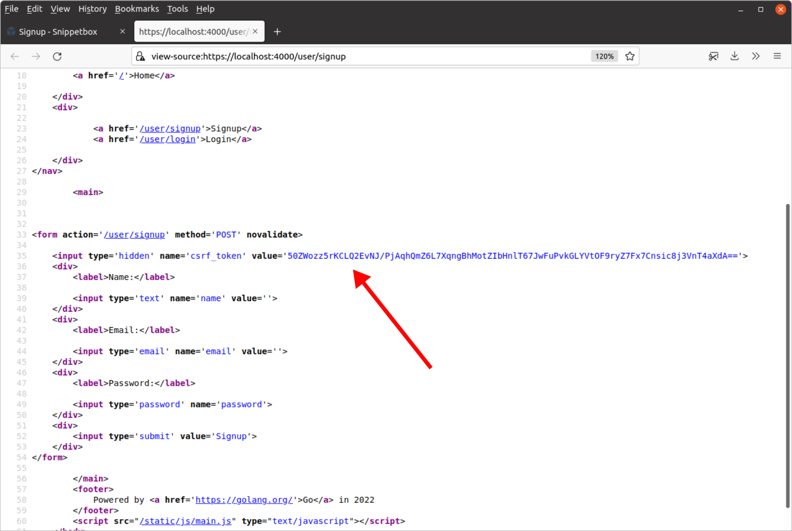

如果您尝试提交表单，它现在应该可以再次正常工作。

---

### 补充说明

#### SameSite“严格”设置

如果需要，您可以更改会话 cookie 以使用 `SameSite=Strict` 设置而不是（默认）`SameSite=Lax`。像这样：

```go
sessionManager := scs.New()
sessionManager.Cookie.SameSite = http.SameSiteStrictMode
```

但重要的是要注意，使用 `SameSite=Strict` 将阻止用户浏览器为 *所有* 跨站点使用发送会话 cookie — 包括使用 `GET` 和 `HEAD` 等 HTTP 方法的 [安全](https://datatracker.ietf.org/doc/html/rfc7231#section-4.2.1) 请求。

虽然这听起来可能更安全（确实如此！），但缺点是当用户从另一个网站单击指向您的应用程序的链接时，不会发送会话 cookie。反过来，这意味着您的应用程序最初会将用户视为“未登录”，即使他们有一个包含其 `"authenticatedUserID"` 值的活动会话。

因此，如果您的应用程序可能有其他网站链接到它（或在电子邮件或私人消息服务中共享到它的链接），那么 `SameSite=Lax` 通常是更合适的设置。

#### SameSite cookie 和 TLS 1.3

在本章前面我说过，我们不能仅仅依靠 `SameSite` cookie 属性来防止 CSRF 攻击，因为并非所有浏览器都完全支持它。

但此](https://security.stackexchange.com/a/249636)规则有一个[例外，因为不存在支持 TLS 1.3 的浏览器 *，并且 <u>不</u> 支持 `SameSite` cookies*。

换句话说，如果您将 TLS 1.3 设置为服务器 TLS 配置中支持的最低版本，则所有能够使用您的应用程序的浏览器都将支持 `SameSite` cookie。

```go
tlsConfig := &tls.Config{
    MinVersion: tls.VersionTLS13,
}
```

只要您只允许对应用程序发出 HTTPS 请求并强制执行 TLS 1.3 作为最低 TLS 版本，您就不需要针对 CSRF 攻击采取任何额外的缓解措施（例如使用 `justinas/nosurf` 包）。只要确保您始终：

- 在会话 cookie 上设置 `SameSite=Lax` 或 `SameSite=Strict`；和
- 对于任何状态更改请求，请使用 `POST`、`PUT` 或 `DELETE` HTTP 方法。

---

<!-- 来源章节：11.00-using-request-context.md -->

*第11章。*

# 使用请求上下文

目前，我们验证用户身份的逻辑包括简单地检查其会话数据中是否存在 `"authenticatedUserID"` 值，如下所示：

```go
func (app *application) isAuthenticated(r *http.Request) bool {
    return app.sessionManager.Exists(r.Context(), "authenticatedUserID")
}
```

我们可以通过查询 `users` 数据库表来确保 `"authenticatedUserID"` 值是真实、有效的值（即自上次登录以来我们没有删除用户的帐户），从而使此检查更加可靠。

但是进行这个额外的数据库检查有一个小问题。

我们的 `isAuthenticated()` 帮助器可能在每个请求周期中被多次调用。目前我们使用它两次——一次在 `requireAuthentication()` 中间件中，另一次在 `newTemplateData()` 帮助程序中。因此，如果我们直接从 `isAuthenticated()` 帮助程序查询数据库，我们最终会在每个请求期间对数据库进行重复的往返。这不是很有效。

更好的方法是在某些中间件中执行此检查，以确定当前请求是否来自经过身份验证的用户，然后将该信息传递给链中的所有后续处理器。

那么我们该怎么做呢？输入 *请求上下文*。

在本节中，您将学到：

- [请求上下文是什么](11.01-how-request-context-works.md)，如何使用它，以及何时适合使用它。
- 如何[在实践中使用请求上下文](11.02-request-context-for-authentication-authorization.md)在处理器之间传递有关当前用户的信息。

---

<!-- 来源章节：11.01-how-request-context-works.md -->

*第 11.1 章。*

## 请求上下文如何工作

我们的中间件和处理器处理的每个 `http.Request` 中都嵌入了一个 [`context.Context`](https://pkg.go.dev/context/#Context) 对象，我们可以用它来在请求的生命周期内存储信息。

正如我已经暗示的，在 Web 应用程序中，一个常见的用例是在中间件和其他处理器之间传递信息。

在我们的例子中，我们想用它来检查用户是否在某些中间件中经过了身份验证，如果是，则将此信息提供给我们所有其他中间件和处理器。

让我们从一些理论开始，解释使用请求上下文的语法。然后，在下一章中，我们将再次更加具体，并演示如何在我们的应用程序中实际使用它。

### 请求上下文语法

将信息添加到请求上下文的基本代码如下所示：

```go
// Where r is a *http.Request...
ctx := r.Context()
ctx = context.WithValue(ctx, "isAuthenticated", true)
r = r.WithContext(ctx)
```

让我们逐行分析一下。

- 首先，我们使用 `r.Context()` 方法从请求中检索 *现有* 上下文，并将其分配给 `ctx` 变量。
- 然后我们使用 `context.WithValue()` 方法创建现有上下文的 *新副本*，其中包含键 `"isAuthenticated"` 和值 `true`。
- 最后，我们使用 `r.WithContext()` 方法创建包含新上下文的请求的 *副本*。

> **重要提示：**请注意，我们实际上并不直接更新请求的上下文。我们正在做的是*创建`http.Request`对象的新副本*，其中包含我们的新上下文。

我还应该指出，为了清楚起见，我使该代码片段比需要的更冗长一些。更典型的写法是这样的：

```go
ctx = context.WithValue(r.Context(), "isAuthenticated", true)
r = r.WithContext(ctx)
```

这就是将数据添加到请求上下文的方式。但如果再找回来呢？

需要解释的重要一点是，在幕后，请求上下文值以 `any` 类型存储。这意味着，从上下文中检索它们之后，您需要在使用它们之前将它们断言为其原始类型。

要检索值，我们需要使用 `r.Context().Value()` 方法，如下所示：

```go
isAuthenticated, ok := r.Context().Value("isAuthenticated").(bool)
if !ok {
    return errors.New("could not convert value to bool")
}
```

### 避免按键碰撞

在上面的代码示例中，我使用字符串 `"isAuthenticated"` 作为从请求上下文存储和检索数据的键。但不建议这样做，因为存在应用程序使用的其他第三方包也希望使用键 `"isAuthenticated"` 存储数据的风险 - 这会导致命名冲突。

为了避免这种情况，最好创建您自己的自定义类型，并将其用作上下文键。扩展我们的示例代码，最好这样做：

```go
// Declare a custom "contextKey" type for your context keys.
type contextKey string

// Create a constant with the type contextKey that we can use.
const isAuthenticatedContextKey = contextKey("isAuthenticated")

...

// Set the value in the request context, using our isAuthenticatedContextKey 
// constant as the key.
ctx := r.Context()
ctx = context.WithValue(ctx, isAuthenticatedContextKey, true)
r = r.WithContext(ctx)

...

// Retrieve the value from the request context using our constant as the key.
isAuthenticated, ok := r.Context().Value(isAuthenticatedContextKey).(bool)
if !ok {
    return errors.New("could not convert value to bool")
}
```

---

<!-- 来源章节：11.02-request-context-for-authentication-authorization.md -->

*第 11.2 章。*

## 请求身份验证/授权上下文

因此，在完成这些解释后，让我们开始在应用程序中使用请求上下文功能。

我们首先返回 `internal/models/users.go` 文件并充实 `UserModel.Exists()` 方法，以便如果具有特定 ID 的用户存在于我们的 `users` 表中，则返回 `true`，否则返回 `false`。就像这样：

*文件：internal/models/users.go*

```go
package models

...

func (m *UserModel) Exists(id int) (bool, error) {
    var exists bool

    stmt := "SELECT EXISTS(SELECT true FROM users WHERE id = ?)"

    err := m.DB.QueryRow(stmt, id).Scan(&exists)
    return exists, err
}
```

然后我们创建一个新的 `cmd/web/context.go` 文件。在此文件中，我们将定义一个自定义 `contextKey` 类型和一个 `isAuthenticatedContextKey` 变量，以便我们拥有一个唯一的密钥，可用于存储和检索请求上下文中的身份验证状态（没有命名冲突的风险）。

```bash
$ touch cmd/web/context.go
```

*文件：cmd/web/context.go*

```go
package main

type contextKey string

const isAuthenticatedContextKey = contextKey("isAuthenticated")
```

现在是令人兴奋的部分。让我们创建一个新的 `authenticate()` 中间件方法，其中：

1. 从会话数据中检索用户的 ID。
2. 使用 `UserModel.Exists()` 方法检查数据库以查看 ID 是否对应于有效用户。
3. 更新请求上下文以包含具有值 `true` 的 `isAuthenticatedContextKey` 键。

代码如下：

*文件：cmd/web/middleware.go*

```go
package main

import (
    "context" // New import
    "fmt"
    "net/http"

    "github.com/justinas/nosurf"
)

...

func (app *application) authenticate(next http.Handler) http.Handler {
    return http.HandlerFunc(func(w http.ResponseWriter, r *http.Request) {
        // Retrieve the authenticatedUserID value from the session using the
        // GetInt() method. This will return the zero value for an int (0) if no
        // "authenticatedUserID" value is in the session -- in which case we
        // call the next handler in the chain as normal and return.
        id := app.sessionManager.GetInt(r.Context(), "authenticatedUserID")
        if id == 0 {
            next.ServeHTTP(w, r)
            return
        }

        // Otherwise, we check to see if a user with that ID exists in our
        // database.
        exists, err := app.users.Exists(id)
        if err != nil {
            app.serverError(w, r, err)
            return
        }

        // If a matching user is found, we know that the request is
        // coming from an authenticated user who exists in our database. We
        // create a new copy of the request (with an isAuthenticatedContextKey
        // value of true in the request context) and assign it to r.
        if exists {
            ctx := context.WithValue(r.Context(), isAuthenticatedContextKey, true)
            r = r.WithContext(ctx)
        }

        // Call the next handler in the chain.
        next.ServeHTTP(w, r)
    })
}
```

这里要强调的重要一点是以下区别：

- 当我们*没有*拥有有效的经过身份验证的用户时，我们将原始且未更改的`*http.Request`传递给链中的下一个处理器。
- 当我们 *do* 拥有有效的经过身份验证的用户时，我们将使用存储在请求上下文中的 `isAuthenticatedContextKey` 键和 `true` 值创建请求的副本。然后，我们将 `*http.Request` 的副本传递给链中的下一个处理器。

好吧，让我们更新 `cmd/web/routes.go` 文件以将 `authenticate()` 中间件包含在我们的 `dynamic` 中间件链中：

*文件：cmd/web/routes.go*

```go
package main

...

func (app *application) routes() http.Handler {
     mux := http.NewServeMux()

    fileServer := http.FileServer(http.Dir("./ui/static/"))
    mux.Handle("GET /static/", http.StripPrefix("/static", fileServer))

     // Add the authenticate() middleware to the chain.
    dynamic := alice.New(app.sessionManager.LoadAndSave, noSurf, app.authenticate)

    mux.Handle("GET /{$}", dynamic.ThenFunc(app.home))
    mux.Handle("GET /snippet/view/{id}", dynamic.ThenFunc(app.snippetView))
    mux.Handle("GET /user/signup", dynamic.ThenFunc(app.userSignup))
    mux.Handle("POST /user/signup", dynamic.ThenFunc(app.userSignupPost))
    mux.Handle("GET /user/login", dynamic.ThenFunc(app.userLogin))
    mux.Handle("POST /user/login", dynamic.ThenFunc(app.userLoginPost))

    protected := dynamic.Append(app.requireAuthentication)

    mux.Handle("GET /snippet/create", protected.ThenFunc(app.snippetCreate))
    mux.Handle("POST /snippet/create", protected.ThenFunc(app.snippetCreatePost))
    mux.Handle("POST /user/logout", protected.ThenFunc(app.userLogoutPost))

    standard := alice.New(app.recoverPanic, app.logRequest, commonHeaders)
    return standard.Then(mux)
}
```

我们需要做的最后一件事是更新我们的 `isAuthenticated()` 帮助程序，这样它现在不再检查会话数据，而是检查请求上下文以确定用户是否经过身份验证。

我们可以这样做：

*文件：cmd/web/helpers.go*

```go
package main

...

func (app *application) isAuthenticated(r *http.Request) bool {
    isAuthenticated, ok := r.Context().Value(isAuthenticatedContextKey).(bool)
    if !ok {
        return false
    }

    return isAuthenticated
}
```

这里需要指出的是，如果请求上下文中不存在带有 `isAuthenticatedContextKey` 键的值，或者底层值不是 `bool`，则此类型断言将失败。在这种情况下，我们采取“安全”回退并返回 false（即我们假设用户未经过身份验证）。

如果您愿意，请尝试再次运行该应用程序。它应该正确编译，如果您以某个用户身份登录并浏览应用程序，那么它应该像以前一样工作。

然后，如果需要，打开 MySQL 并从数据库中删除您登录的用户的记录。例如：

```bash
mysql> USE snippetbox;
mysql> DELETE FROM users WHERE email = 'bob@example.com';
```

当您返回浏览器并刷新页面时，应用程序现在足够智能，可以识别用户已被删除，并且您会发现自己被视为未经身份验证（注销）的用户。

---

### 补充说明

#### 滥用请求上下文

需要强调的是，请求上下文只能用于存储与特定请求的生命周期相关的信息。 `context.Context` 的 Go 文档警告：

> 仅对传输进程和 API 的请求范围数据使用上下文值。

这意味着您不应该使用它来将请求* 生命周期之外存在的 *依赖项（例如记录器、模板缓存和数据库连接池）传递给中间件和处理器。

出于类型安全和代码清晰度的原因，最好让这些依赖项显式地可供处理器使用，方法是使处理器方法针对 `application` 结构（就像我们在本书中那样）或将它们传递到闭包中（例如在 [this Gist](https://gist.github.com/alexedwards/5cd712192b4831058b21) 中）。

---

<!-- 来源章节：12.00-file-embedding.md -->

*第12章。*

# 文件嵌入

Go 标准库包含一个 [`embed`](https://pkg.go.dev/embed/) 包，这使得 *将外部文件嵌入到 Go 程序本身中*成为可能。

使用 `embed` 包提供了创建独立的 Go 程序的机会，并且拥有运行 *所需的一切，作为已编译的二进制可执行文件* 的一部分。反过来，这使得部署或分发 Web 应用程序变得更加容易。

在本书的这一部分中，我们将更新我们的应用程序，以便它嵌入 `ui` 目录中的文件 - 从静态 CSS、JavaScript 和图像文件开始，然后转到 HTML 模板。

让我们直接开始并解释如何使用它。

---

<!-- 来源章节：12.01-embedding-static-files.md -->

*第 12.1 章。*

## 嵌入静态文件

如果您按照步骤操作，首先要做的就是创建一个新的 `ui/efs.go` 文件：

```bash
$ touch ui/efs.go
```

然后添加以下代码：

*文件：ui/efs.go*

```go
package ui

import (
    "embed"
)

//go:embed "static"
var Files embed.FS
```

这里重要的一行是 `//go:embed "static"`。

这看起来像一条注释，但实际上是一个特殊的*注释指令*。当我们的应用程序被编译时（作为 `go build` 或 `go run` 的一部分），此注释指令指示 Go 将 `ui/static` 文件夹中的文件存储在全局变量 `Files` 引用的 *嵌入式文件系统* 中。

我们需要解释一些关于此的重要细节。

- 注释指令必须放置在 *紧邻* 要存储嵌入文件的变量上方。
- 该指令的格式为 `go:embed "<path>"`。该路径相对于包含该指令的 `.go` 文件，因此 - 在我们的例子中 - `go:embed "static"` 嵌入了我们项目中的目录 `ui/static`。
- 您只能在包级别的全局变量上使用 `go:embed` 指令，而不能在函数或方法中使用。如果您尝试在函数或方法中使用它，您将在编译时收到错误 `"go:embed cannot apply to var inside func"`。
- 路径不能包含 `.` 或 `..` 元素，也不能以 `/` 开头或结尾。这本质上限制您只能嵌入与包含 `go:embed` 指令的 `.go` 文件位于同一目录中的文件或目录。
- 嵌入式文件系统 *始终* 以包含 `go:embed` 指令的目录为根。因此，在上面的示例中，我们的 `Files` 变量包含 [`embed.FS`](https://pkg.go.dev/embed/#FS) 嵌入式文件系统，该文件系统的根目录是我们的 `ui` 目录。

### 使用嵌入的静态文件

现在让我们切换我们的应用程序，以便它从嵌入式文件系统提供静态 CSS、JavaScript 和图像文件，而不是在运行时从磁盘读取它们。

打开您的 `cmd/web/routes.go` 文件并按如下方式更新：

*文件：cmd/web/routes.go*

```go
package main

import (
    "net/http"

    "snippetbox.alexedwards.net/ui" // New import

    "github.com/justinas/alice"
)

func (app *application) routes() http.Handler {
     mux := http.NewServeMux()

    // Use the http.FileServerFS() function to create a HTTP handler which 
    // serves the embedded files in ui.Files. It's important to note that our 
    // static files are contained in the "static" folder of the ui.Files
    // embedded filesystem. So, for example, our CSS stylesheet is located at
    // "static/css/main.css". This means that we no longer need to strip the
    // prefix from the request URL -- any requests that start with /static/ can
    // just be passed directly to the file server and the corresponding static
    // file will be served (so long as it exists).
    mux.Handle("GET /static/", http.FileServerFS(ui.Files))

    dynamic := alice.New(app.sessionManager.LoadAndSave, noSurf, app.authenticate)

    mux.Handle("GET /{$}", dynamic.ThenFunc(app.home))
    mux.Handle("GET /snippet/view/{id}", dynamic.ThenFunc(app.snippetView))
    mux.Handle("GET /user/signup", dynamic.ThenFunc(app.userSignup))
    mux.Handle("POST /user/signup", dynamic.ThenFunc(app.userSignupPost))
    mux.Handle("GET /user/login", dynamic.ThenFunc(app.userLogin))
    mux.Handle("POST /user/login", dynamic.ThenFunc(app.userLoginPost))

    protected := dynamic.Append(app.requireAuthentication)

    mux.Handle("GET /snippet/create", protected.ThenFunc(app.snippetCreate))
    mux.Handle("POST /snippet/create", protected.ThenFunc(app.snippetCreatePost))
    mux.Handle("POST /user/logout", protected.ThenFunc(app.userLogoutPost))

    standard := alice.New(app.recoverPanic, app.logRequest, commonHeaders)
    return standard.Then(mux)
}
```

如果保存这些更改然后重新启动应用程序，您应该会发现一切都正确编译并运行。当您在浏览器中访问 [`https://localhost:4000`](https://localhost:4000/) 时，静态文件应该由嵌入式文件系统提供，并且一切看起来都应该正常。


如果需要，您还可以直接导航到静态文件以检查它们是否仍然可用。例如，访问 [`https://localhost:4000/static/css/main.css`](https://localhost:4000/static/css/main.css) 应显示嵌入式文件系统中网页的 CSS 样式表。


---

### 补充说明

#### 多条路径

在一个嵌入指令中指定多个路径是完全可以的。例如，我们可以单独嵌入 `ui/static/css`、`ui/static/img` 和 `ui/static/js` 目录，如下所示：

```go
//go:embed "static/css" "static/img" "static/js" 
var Files embed.FS
```

> **重要提示：** 嵌入路径模式中的路径分隔符应始终为正斜杠 `/`，即使在 Windows 计算机上也是如此。

#### 嵌入特定文件

我在本章开头提到过这一点，但嵌入路径有可能指向 *特定文件*。嵌入不仅限于目录。

例如，假设我们的 `ui/static/css` 目录包含一些我们不想嵌入的其他资源，例如 [Sass 或 Less](https://www.keycdn.com/blog/sass-vs-less) 文件。在这种情况下，我们可以只嵌入 `ui/static/css/main.css` 文件，如下所示：

```go
//go:embed "static/css/main.css" "static/img" "static/js" 
var Files embed.FS
```

#### 通配符路径

字符 `*` 可以用作嵌入路径中的“通配符”。继续上面的示例，我们可以重写 embed 指令，以便仅嵌入 `ui/static/css` 下的 `.css` 文件：

```go
//go:embed "static/css/*.css" "static/img" "static/js" 
var Files embed.FS
```

与此相关，如果您使用不带任何限定符的通配符路径 `"*"`，如下所示：

```go
//go:embed "*"
var Files embed.FS
```

...然后它将嵌入当前目录中的所有内容，包括包含嵌入指令本身的 `.go` 文件！大多数时候您不希望这样做，因此更常见的是显式嵌入特定的子目录或文件。

#### 所有前缀

最后，如果路径指向目录，则该目录中的所有文件都会递归嵌入 - *除了* 名称以 `.` 或 `_` 字符开头的文件。如果您也想包含这些文件，那么您应该在路径开头使用 `all:` 前缀。

```go
//go:embed "all:static"
var Files embed.FS
```

---

<!-- 来源章节：12.02-embedding-html-templates.md -->

*第 12.2 章。*

## 嵌入 HTML 模板

接下来，我们更新应用程序，以便模板缓存使用嵌入的 HTML 模板文件，而不是在运行时从硬盘读取它们。

返回 `ui/efs.go` 文件，并更新它，以便 `ui.Files` 也嵌入 `ui/html` 目录（其中包含我们的模板）的内容。就像这样：

*文件：ui/efs.go*

```go
package ui

import (
    "embed"
)

//go:embed "html" "static" 
var Files embed.FS
```

然后我们需要更新`cmd/web/templates.go`中的`newTemplateCache()`函数，以便它从`ui.Files`读取模板。为此，我们需要利用 Go 处理嵌入式文件系统的一些特殊功能：

- [`fs.Glob()`](https://pkg.go.dev/io/fs#Glob) 函数返回与 glob 模式匹配的文件路径切片。它实际上与我们在本书前面使用的 `filepath.Glob()` 函数相同，只是它适用于嵌入式文件系统。
- [`Template.ParseFS()`](https://pkg.go.dev/html/template#Template.ParseFS) 方法可用于将 HTML 模板从嵌入式文件系统解析为模板集。这实际上替代了我们之前使用的 **、`Template.ParseFiles()` 和 `Template.ParseGlob()` 方法。 `Template.ParseFiles()` 也是一个 *可变函数*，它允许您在一次调用 `ParseFiles()` 中解析多个模板。

让我们在 `cmd/web/templates.go` 文件中使用它们：

*文件：cmd/web/templates.go*

```go
package main

import (
    "html/template"
    "io/fs" // New import
    "path/filepath"
    "time"

    "snippetbox.alexedwards.net/internal/models"
    "snippetbox.alexedwards.net/ui" // New import
)

...

func newTemplateCache() (map[string]*template.Template, error) {
    cache := map[string]*template.Template{}

    // Use fs.Glob() to get a slice of all filepaths in the ui.Files embedded
    // filesystem which match the pattern 'html/pages/*.tmpl'. This essentially
    // gives us a slice of all the 'page' templates for the application, just
    // like before.
    pages, err := fs.Glob(ui.Files, "html/pages/*.tmpl")
    if err != nil {
        return nil, err
    }

    for _, page := range pages {
        name := filepath.Base(page)

        // Create a slice containing the filepath patterns for the templates we
        // want to parse.
        patterns := []string{
            "html/base.tmpl",
            "html/partials/*.tmpl",
            page,
        }

        // Use ParseFS() instead of ParseFiles() to parse the template files 
        // from the ui.Files embedded filesystem.
        ts, err := template.New(name).Funcs(functions).ParseFS(ui.Files, patterns...)
        if err != nil {
            return nil, err
        }

        cache[name] = ts
    }

    return cache, nil
}
```

现在这一切都完成了，当我们的应用程序构建成二进制文件时，它将包含运行所需的所有 UI 文件。

您可以通过在 `/tmp` 目录中构建可执行二进制文件、复制 TLS 证书并运行该二进制文件来快速尝试此操作。就像这样：

```bash
$ go build -o /tmp/web ./cmd/web/
$ cp -r ./tls /tmp/
$ cd /tmp/
$ ./web 
time=2024-03-18T11:29:23.000+00:00 level=INFO msg="starting server" addr=:4000
```

同样，您应该能够在浏览器中访问 [`https://localhost:4000`](https://localhost:4000/)，并且一切都应该正常工作 - 尽管二进制文件所在的位置无法访问磁盘上的原始 UI 文件。


> **注意：**如果您想了解如何构建二进制文件和部署应用程序，[让我们进一步了解](https://lets-go-further.alexedwards.net/)中提供了更多信息和详细说明。

---

<!-- 来源章节：13.00-testing.md -->

*第13章。*

# 测试

所以我们终于来到了测试的话题。

就像构造和组织应用程序代码一样，在 Go 中没有单一的“正确”方法来构造和组织测试。但**有一些您可以遵循的约定、模式和良好实践。

在本节中，我们将为应用程序中的选定代码添加测试，目的是演示创建测试的通用语法并说明可以在各种应用程序中重用的一些模式。

你将学到：

- 如何在 Go 中创建和运行表驱动的 [单元测试和子测试](13.01-unit-testing-and-sub-tests.md)。
- 如何单元[测试您的 HTTP 处理器](13.02-testing-http-handlers-and-middleware.md) 和中间件。
- 如何对 Web 应用程序路由、中间件和处理器执行[“端到端”测试](13.03-end-to-end-testing.md)。
- 如何[创建数据库模型的模拟](13.05-mocking-dependencies.md)并在单元测试中使用它们。
- 用于测试受 CSRF 保护的 [HTML 表单提交](13.06-testing-html-forms.md) 的模式。
- 如何使用MySQL的测试实例来执行[集成测试](13.07-integration-testing.md)。
- 如何轻松计算和分析测试的[代码覆盖率](13.08-profiling-test-coverage.md)。

---

<!-- 来源章节：13.01-unit-testing-and-sub-tests.md -->

*第 13.1 章。*

## 单元测试和子测试

在本章中，我们将创建一个单元测试，以确保我们的 `humanDate()` 函数（我们在 [自定义模板函数](05.06-custom-template-functions.md) 章节中创建）以我们想要的确切格式输出 `time.Time` 值。

如果您不记得了，`humanDate()` 函数如下所示：

*文件：cmd/web/templates.go*

```go
package main

...

func humanDate(t time.Time) string {
    return t.Format("02 Jan 2006 at 15:04")
}

...
```

我想首先测试它的原因是因为它是一个简单的函数。我们可以探索编写测试的基本语法和模式，而不会过于陷入*我们正在测试的功能*。

### 创建单元测试

让我们直接开始并为此函数创建一个 *单元测试*。

在 Go 中，标准做法是在 `*_test.go` 文件中编写测试，这些文件直接与您正在测试的代码一起存在。因此，在这种情况下，我们要做的第一件事是创建一个新的 `cmd/web/templates_test.go` 文件来保存测试：

```bash
$ touch cmd/web/templates_test.go
```

然后我们可以为 `humanDate` 函数创建一个新的单元测试，如下所示：

*文件：cmd/web/templates_test.go*

```go
package main

import (
    "testing"
    "time"
)

func TestHumanDate(t *testing.T) {
    // Initialize a new time.Time object and pass it to the humanDate function.
    tm := time.Date(2024, 3, 17, 10, 15, 0, 0, time.UTC)
    hd := humanDate(tm)

    // Check that the output from the humanDate function is in the format we
    // expect. If it isn't what we expect, use the t.Errorf() function to
    // indicate that the test has failed and log the expected and actual
    // values.
    if hd != "17 Mar 2024 at 10:15" {
        t.Errorf("got %q; want %q", hd, "17 Mar 2024 at 10:15")
    }
}
```

这种模式是您在 Go 中编写的几乎所有测试中都会使用的基本模式。重要的事情是：

- 测试只是常规的 Go 代码，它调用 `humanDate()` 函数并检查结果是否符合我们的预期。
- 您的单元测试包含在带有签名 `func(*testing.T)` 的普通 Go 函数中。
- 要成为有效的单元测试，此函数的名称 *必须* 以单词 `Test` 开头。通常，后面跟着您正在测试的函数、方法或类型的名称，以帮助一目了然 *正在测试的内容*。
- 您可以使用 [`t.Errorf()`](https://pkg.go.dev/testing/#T.Errorf) 函数将测试标记为 *失败* 并记录有关失败的描述性消息。需要注意的是，调用 `t.Errorf()` *不会停止执行测试* — 在调用它之后，Go 将继续正常执行任何剩余的测试代码。

让我们试试这个。保存文件，然后使用 `go test` 命令运行 `cmd/web` 包中的所有测试，如下所示：

```bash
$ go test ./cmd/web
ok      snippetbox.alexedwards.net/cmd/web    0.005s
```

所以，这是个好东西。此输出中的 `ok` 表示包中的所有测试（目前只有我们的 `TestHumanDate()` 测试）通过，没有任何问题。

如果您想了解更多详细信息，可以使用 `-v` 标志来获取 *verbose* 输出来准确查看正在运行的测试：

```bash
$ go test -v ./cmd/web
=== RUN   TestHumanDate
--- PASS: TestHumanDate (0.00s)
PASS
ok      snippetbox.alexedwards.net/cmd/web    0.007s
```

### 表驱动测试

现在让我们扩展 `TestHumanDate()` 函数以涵盖一些额外的 *测试用例*。具体来说，我们将对其进行更新以检查：

1. 如果 `humanDate()` 的输入是 [零时间](https://pkg.go.dev/time/#Time.IsZero)，则返回空字符串 `""`。
2. `humanDate()` 函数的输出始终使用 UTC 时区。

在 Go 中，运行多个测试用例的惯用方法是使用 *表驱动测试*。

本质上，表驱动测试背后的想法是创建一个包含输入和预期输出的测试用例“表”，然后循环这些测试用例，在 *子测试* 中运行每个测试用例。您可以通过多种方法进行设置，但常见的方法是在匿名结构片段中定义测试用例。

我将演示：

*文件：cmd/web/templates_test.go*

```go
package main

import (
    "testing"
    "time"
)

func TestHumanDate(t *testing.T) {
    // Create a slice of anonymous structs containing the test case name,
    // input to our humanDate() function (the tm field), and expected output
    // (the want field).
    tests := []struct {
        name string
        tm   time.Time
        want string
    }{
        {
            name: "UTC",
            tm:   time.Date(2024, 3, 17, 10, 15, 0, 0, time.UTC),
            want: "17 Mar 2024 at 10:15",
        },
        {
            name: "Empty",
            tm:   time.Time{},
            want: "",
        },
        {
            name: "CET",
            tm:   time.Date(2024, 3, 17, 10, 15, 0, 0, time.FixedZone("CET", 1*60*60)),
            want: "17 Mar 2024 at 09:15",
        },
    }

    // Loop over the test cases.
    for _, tt := range tests {
        // Use the t.Run() function to run a sub-test for each test case. The
        // first parameter to this is the name of the test (which is used to
        // identify the sub-test in any log output) and the second parameter is
        // and anonymous function containing the actual test for each case.
        t.Run(tt.name, func(t *testing.T) {
            hd := humanDate(tt.tm)

            if hd != tt.want {
                t.Errorf("got %q; want %q", hd, tt.want)
            }
        })
    }
}
```

> **注意：**在第三个测试用例中，我们使用 CET（中欧时间）作为时区，比 UTC 早一小时。因此，我们希望 `humanDate()`（应该采用 UTC 格式）的输出为 `17 Mar 2024 at 09:15`，而不是 `17 Mar 2024 at 10:15`。

好的，让我们运行一下，看看会发生什么：

```bash
$ go test -v ./cmd/web
=== RUN   TestHumanDate
=== RUN   TestHumanDate/UTC
=== RUN   TestHumanDate/Empty
    templates_test.go:44: got "01 Jan 0001 at 00:00"; want ""
=== RUN   TestHumanDate/CET
    templates_test.go:44: got "17 Mar 2024 at 10:15"; want "17 Mar 2024 at 09:15"
--- FAIL: TestHumanDate (0.00s)
    --- PASS: TestHumanDate/UTC (0.00s)
    --- FAIL: TestHumanDate/Empty (0.00s)
    --- FAIL: TestHumanDate/CET (0.00s)
FAIL
FAIL    snippetbox.alexedwards.net/cmd/web      0.003s
FAIL
```

所以在这里我们可以看到每个子测试的单独输出。正如您可能已经猜到的，我们的第一个测试用例通过了，但 `Empty` 和 `CET` 测试都失败了。请注意，对于失败的测试用例，我们如何在输出中获取相关的失败消息以及文​​件名和行号？

让我们回到 `humanDate()` 函数并更新它以解决这两个问题：

*文件：cmd/web/templates.go*

```go
package main

...

func humanDate(t time.Time) string {
    // Return the empty string if time has the zero value.
    if t.IsZero() {
        return ""
    }

    // Convert the time to UTC before formatting it.
    return t.UTC().Format("02 Jan 2006 at 15:04")
}

...
```

当您重新运行测试时，一切都应该通过了。

```bash
$ go test -v ./cmd/web
=== RUN   TestHumanDate
=== RUN   TestHumanDate/UTC
=== RUN   TestHumanDate/Empty
=== RUN   TestHumanDate/CET
--- PASS: TestHumanDate (0.00s)
    --- PASS: TestHumanDate/UTC (0.00s)
    --- PASS: TestHumanDate/Empty (0.00s)
    --- PASS: TestHumanDate/CET (0.00s)
PASS
ok      snippetbox.alexedwards.net/cmd/web      0.003s
```

### 测试断言的助手

正如我在本书前面简要提到的，在接下来的几章中，我们将编写大量 *测试断言*，它们是此模式的变体：

```go
if actualValue != expectedValue {
    t.Errorf("got %v; want %v", actualValue, expectedValue)
}
```

让我们快速将此代码抽象为辅助函数。

如果您按照步骤操作，请继续创建一个新的 `internal/assert` 包：

```bash
$ mkdir internal/assert
$ touch internal/assert/assert.go
```

然后添加以下代码：

*文件：内部/assert/assert.go*

```go
package assert

import (
    "testing"
)

func Equal[T comparable](t *testing.T, actual, expected T) {
    t.Helper()

    if actual != expected {
        t.Errorf("got: %v; want: %v", actual, expected)
    }
}
```

请注意 `Equal()` 是如何成为 *通用函数* 的？这意味着无论 `actual` 和 `expected` 值的类型是什么，我们都可以使用它。只要 `actual` 和 `expected` 都具有 *same* 类型，并且可以使用 `!=` 运算符进行比较（例如，它们都是 `string` 值，或都是 `int` 值），当我们调用时，我们的测试代码应该编译并正常工作`Equal()`。

> **注意：** 我们在上面的代码中使用的 [`t.Helper()`](https://pkg.go.dev/testing#T.Helper) 函数向 Go 测试运行器表明我们的 `Equal()` 函数是一个测试助手。这意味着当从我们的 `Equal()` 函数调用 `t.Errorf()` 时，Go 测试运行程序将在输出中报告调用* 我们的 `Equal()` 函数的代码 *的文件名和行号。

有了这个，我们就可以简化我们的 `TestHumanDate()` 测试，如下所示：

*文件：cmd/web/templates_test.go*

```go
package main

import (
    "testing"
    "time"

    "snippetbox.alexedwards.net/internal/assert" // New import
)

func TestHumanDate(t *testing.T) {
    tests := []struct {
        name string
        tm   time.Time
        want string
    }{
        {
            name: "UTC",
            tm:   time.Date(2024, 3, 17, 10, 15, 0, 0, time.UTC),
            want: "17 Mar 2024 at 10:15",
        },
        {
            name: "Empty",
            tm:   time.Time{},
            want: "",
        },
        {
            name: "CET",
            tm:   time.Date(2024, 3, 17, 10, 15, 0, 0, time.FixedZone("CET", 1*60*60)),
            want: "17 Mar 2024 at 09:15",
        },
    }

    for _, tt := range tests {
        t.Run(tt.name, func(t *testing.T) {
            hd := humanDate(tt.tm)

            // Use the new assert.Equal() helper to compare the expected and 
            // actual values.
            assert.Equal(t, hd, tt.want)
        })
    }
}
```

---

### 补充说明

#### 没有测试用例表的子测试

需要指出的是，您不需要将子测试与表驱动测试结合使用（就像我们在本章中所做的那样）。通过在测试函数中连续调用 `t.Run()` 来执行子测试是完全有效的，类似于：

```go
func TestExample(t *testing.T) {
    t.Run("Example sub-test 1", func(t *testing.T) {
        // Do a test.
    })

    t.Run("Example sub-test 2", func(t *testing.T) {
        // Do another test.
    })

    t.Run("Example sub-test 3", func(t *testing.T) {
        // And another...
    })
}
```

---

<!-- 来源章节：13.02-testing-http-handlers-and-middleware.md -->

*第 13.2 章。*

## 测试 HTTP 处理器和中间件

让我们继续讨论一些用于对 HTTP 处理器进行单元测试的特定技术。

到目前为止，我们为这个项目编写的所有处理器测试起来都有点复杂，为了介绍一些东西，我更愿意从更简单的东西开始。

因此，如果您按照步骤操作，请转到 `handlers.go` 文件并创建一个新的 `ping` 处理函数，该函数返回 `200 OK` 状态代码和 `"OK"` 响应正文。这是您可能想要实现的处理器类型，用于服务器的状态检查或正常运行时间监控。

*文件：cmd/web/handlers.go*

```go
package main

...

func ping(w http.ResponseWriter, r *http.Request) {
    w.Write([]byte("OK"))
}
```

在本章中，我们将创建一个新的 `TestPing` 单元测试，其中：

- 检查 `ping` 处理器写入的响应状态代码是否为 `200`。
- 检查 `ping` 处理器写入的响应正文是否为 `"OK"`。

### 记录回应

Go 在 [`net/http/httptest`](https://pkg.go.dev/net/http/httptest) 包中提供了一堆有用的工具，用于帮助测试 HTTP 处理器。

这些工具之一是 [`httptest.ResponseRecorder`](https://pkg.go.dev/net/http/httptest/#ResponseRecorder) 类型。这本质上是 `http.ResponseWriter` 的实现，它记录响应状态代码、标头和正文，而不是实际将它们写入 HTTP 连接。

因此，对处理器进行单元测试的一种简单方法是创建一个新的 `httptest.ResponseRecorder`，将其传递给处理器函数，然后在处理器返回后再次检查它。

让我们尝试这样做来测试 `ping` 处理器函数。

首先，遵循 Go 约定并创建一个新的 `handlers_test.go` 文件来保存测试......

```bash
$ touch cmd/web/handlers_test.go
```

然后添加以下代码：

*文件：cmd/web/handlers_test.go*

```go
package main

import (
    "bytes"
    "io"
    "net/http"
    "net/http/httptest"
    "testing"

    "snippetbox.alexedwards.net/internal/assert"
)

func TestPing(t *testing.T) {
    // Initialize a new httptest.ResponseRecorder.
    rr := httptest.NewRecorder()

    // Initialize a new dummy http.Request.
    r, err := http.NewRequest(http.MethodGet, "/", nil)
    if err != nil {
        t.Fatal(err)
    }

    // Call the ping handler function, passing in the
    // httptest.ResponseRecorder and http.Request.
    ping(rr, r)

    // Call the Result() method on the http.ResponseRecorder to get the
    // http.Response generated by the ping handler.
    rs := rr.Result()

    // Check that the status code written by the ping handler was 200.
    assert.Equal(t, rs.StatusCode, http.StatusOK)
   
    // And we can check that the response body written by the ping handler
    // equals "OK".
    defer rs.Body.Close()
    body, err := io.ReadAll(rs.Body)
    if err != nil {
        t.Fatal(err)
    }
    body = bytes.TrimSpace(body)

    assert.Equal(t, string(body), "OK")
}
```

> **注意：** 在上面的代码中，我们在几个地方使用了 [`t.Fatal()`](https://pkg.go.dev/testing/#T.Fatal) 函数来处理测试代码中出现意外错误的情况。调用时，`t.Fatal()` 会将测试标记为失败，记录错误，然后完全停止执行 *当前测试*（或子测试）。
>
> 通常，在继续当前测试没有意义的情况下，您应该调用 `t.Fatal()` - 例如设置步骤期间发生错误，或者 Go 标准库函数出现意外错误意味着您无法继续测试。

好的，保存文件，然后尝试在设置了详细标志的情况下再次运行 `go test`。就像这样：

```bash
$ go test -v ./cmd/web/
=== RUN   TestPing
--- PASS: TestPing (0.00s)
=== RUN   TestHumanDate
=== RUN   TestHumanDate/UTC
=== RUN   TestHumanDate/Empty
=== RUN   TestHumanDate/CET
--- PASS: TestHumanDate (0.00s)
    --- PASS: TestHumanDate/UTC (0.00s)
    --- PASS: TestHumanDate/Empty (0.00s)
    --- PASS: TestHumanDate/CET (0.00s)
PASS
ok      snippetbox.alexedwards.net/cmd/web      0.003s
```

所以这看起来不错。我们可以看到我们的新 `TestPing` 测试正在运行并通过，没有任何问题。

### 测试中间件

还可以使用相同的通用模式来对中间件进行单元测试。

我们将通过为本书前面](06.02-setting-common-headers.md)中[制作的`commonHeaders()`中间件创建一个新的`TestCommonHeaders`测试来演示这一点。作为此测试的一部分，我们要检查：

- `commonHeaders()` 中间件设置 HTTP 响应上的所有预期标头。
- `commonHeaders()` 中间件正确调用链中的下一个处理器。

首先，您需要创建一个 `cmd/web/middleware_test.go` 文件来保存测试：

```bash
$ touch cmd/web/middleware_test.go
```

然后添加以下代码：

*文件：cmd/web/middleware_test.go*

```go
package main

import (
    "bytes"
    "io"
    "net/http"
    "net/http/httptest"
    "testing"

    "snippetbox.alexedwards.net/internal/assert"
)

func TestCommonHeaders(t *testing.T) {
    // Initialize a new httptest.ResponseRecorder and dummy http.Request.
    rr := httptest.NewRecorder()

    r, err := http.NewRequest(http.MethodGet, "/", nil)
    if err != nil {
        t.Fatal(err)
    }

    // Create a mock HTTP handler that we can pass to our commonHeaders
    // middleware, which writes a 200 status code and an "OK" response body.
    next := http.HandlerFunc(func(w http.ResponseWriter, r *http.Request) {
        w.Write([]byte("OK"))
    })

    // Pass the mock HTTP handler to our commonHeaders middleware. Because
    // commonHeaders *returns* a http.Handler we can call its ServeHTTP()
    // method, passing in the http.ResponseRecorder and dummy http.Request to
    // execute it.
    commonHeaders(next).ServeHTTP(rr, r)

    // Call the Result() method on the http.ResponseRecorder to get the results
    // of the test.
    rs := rr.Result()

    // Check that the middleware has correctly set the Content-Security-Policy
    // header on the response.
    expectedValue := "default-src 'self'; style-src 'self' fonts.googleapis.com; font-src fonts.gstatic.com"
    assert.Equal(t, rs.Header.Get("Content-Security-Policy"), expectedValue)

    // Check that the middleware has correctly set the Referrer-Policy
    // header on the response.
    expectedValue = "origin-when-cross-origin"
    assert.Equal(t, rs.Header.Get("Referrer-Policy"), expectedValue)

    // Check that the middleware has correctly set the X-Content-Type-Options
    // header on the response.
    expectedValue = "nosniff"
    assert.Equal(t, rs.Header.Get("X-Content-Type-Options"), expectedValue)

    // Check that the middleware has correctly set the X-Frame-Options header
    // on the response.
    expectedValue = "deny"
    assert.Equal(t, rs.Header.Get("X-Frame-Options"), expectedValue)

    // Check that the middleware has correctly set the X-XSS-Protection header
    // on the response
    expectedValue = "0"
    assert.Equal(t, rs.Header.Get("X-XSS-Protection"), expectedValue)

    // Check that the middleware has correctly set the Server header on the 
    // response.
    expectedValue = "Go"
    assert.Equal(t, rs.Header.Get("Server"), expectedValue)

    // Check that the middleware has correctly called the next handler in line
    // and the response status code and body are as expected.
    assert.Equal(t, rs.StatusCode, http.StatusOK)

    defer rs.Body.Close()
    body, err := io.ReadAll(rs.Body)
    if err != nil {
        t.Fatal(err)
    }
    body = bytes.TrimSpace(body)
    
    assert.Equal(t, string(body), "OK")
}
```

如果您现在运行测试，您应该会看到 `TestCommonHeaders` 测试通过，没有任何问题。

```bash
$ go test -v ./cmd/web/
=== RUN   TestPing
--- PASS: TestPing (0.00s)
=== RUN   TestCommonHeaders
--- PASS: TestCommonHeaders (0.00s)
=== RUN   TestHumanDate
=== RUN   TestHumanDate/UTC
=== RUN   TestHumanDate/Empty
=== RUN   TestHumanDate/CET
--- PASS: TestHumanDate (0.00s)
    --- PASS: TestHumanDate/UTC (0.00s)
    --- PASS: TestHumanDate/Empty (0.00s)
    --- PASS: TestHumanDate/CET (0.00s)
PASS
ok      snippetbox.alexedwards.net/cmd/web      0.003s
```

因此，总而言之，对 HTTP 处理器和中间件进行单元测试的一种快速简便的方法是使用 `httptest.ResponseRecorder` 类型简单地调用它们。然后，您可以检查记录的响应的状态代码、标头和响应正文，以确保它们按预期工作。

---

<!-- 来源章节：13.03-end-to-end-testing.md -->

*第 13.3 章。*

## 端到端测试

在上一章中，我们讨论了如何单独对 HTTP 处理器进行单元测试的一般模式。

但是，大多数时候，您的 HTTP 处理器并不是*实际单独使用的*。因此，在本章中，我们将解释如何在包含路由、中间件和处理器的 Web 应用程序上运行 *端到端测试*。在大多数情况下，与单独的单元测试相比，端到端测试应该让您更有信心应用程序正常工作。

为了说明这一点，我们将调整 `TestPing` 函数，以便它对我们的代码运行端到端测试。具体来说，我们希望测试确保对应用程序的 `GET /ping` 请求调用 `ping` 处理函数并生成 `200 OK` 状态代码和 `"OK"` 响应正文。

本质上，我们想要测试我们的应用程序是否有这样的路由：

| 路由模式 | 处理器 | 行动 |
| --- | --- | --- |
| … | … | …… |
| GET /ping | ping | 返回 200 OK 响应 |

### 使用 httptest.Server

端到端测试我们的应用程序的关键是 [`httptest.NewTLSServer()`](https://pkg.go.dev/net/http/httptest/#NewTLSServer) 函数，它会启动一个 [`httptest.Server`](https://pkg.go.dev/net/http/httptest/#Server) 实例，我们可以向该实例发出 HTTPS 请求。

整个模式有点太复杂，无法预先解释，因此最好先通过编写代码进行演示，然后我们再讨论细节。

考虑到这一点，返回 `handlers_test.go` 文件并更新 `TestPing` 测试，使其如下所示：

*文件：cmd/web/handlers_test.go*

```go
package main

import (
    "bytes"
    "io"
    "log/slog" // New import
    "net/http"
    "net/http/httptest"
    "testing"

    "snippetbox.alexedwards.net/internal/assert"
)

func TestPing(t *testing.T) {
    // Create a new instance of our application struct. For now, this just
    // contains a structured logger (which discards anything written to it).
    app := &application{
        logger: slog.New(slog.NewTextHandler(io.Discard, nil)),
    }

    // We then use the httptest.NewTLSServer() function to create a new test
    // server, passing in the value returned by our app.routes() method as the
    // handler for the server. This starts up a HTTPS server which listens on a
    // randomly-chosen port of your local machine for the duration of the test.
    // Notice that we defer a call to ts.Close() so that the server is shutdown
    // when the test finishes.
    ts := httptest.NewTLSServer(app.routes())
    defer ts.Close()

    // The network address that the test server is listening on is contained in
    // the ts.URL field. We can  use this along with the ts.Client().Get() method
    // to make a GET /ping request against the test server. This returns a
    // http.Response struct containing the response.
    rs, err := ts.Client().Get(ts.URL + "/ping")
    if err != nil {
        t.Fatal(err)
    }

    // We can then check the value of the response status code and body using
    // the same pattern as before.
    assert.Equal(t, rs.StatusCode, http.StatusOK)

    defer rs.Body.Close()
    body, err := io.ReadAll(rs.Body)
    if err != nil {
        t.Fatal(err)
    }
    body = bytes.TrimSpace(body)

    assert.Equal(t, string(body), "OK")
}
```

关于这段代码，有一些事情需要指出和讨论。

- 调用 `httptest.NewTLSServer()` 初始化测试服务器时，需要传入一个 `http.Handler` 参数；每当测试服务器收到 HTTPS 请求时，都会调用这个处理器。在本例中，我们传入了 `app.routes()` 方法的返回值，这意味着对测试服务器的请求会使用*真实应用中的全部路由、中间件和处理器*。
  这正是我们在[本书前面](03.05-isolating-the-application-routes.md)把应用程序的所有路由集中到 `app.routes()` 方法中所带来的一大好处。
- 如果您正在测试 HTTP（而非 HTTPS）服务器，则应使用 [`httptest.NewServer()`](https://pkg.go.dev/net/http/httptest/#NewServer) 函数来创建测试服务器。
- [`ts.Client()`](https://pkg.go.dev/net/http/httptest/#Server.Client) 方法返回 *测试服务器客户端* — 其类型为 [`http.Client`](https://pkg.go.dev/net/http/#Client) — 我们应该始终使用此客户端向测试服务器发送请求。可以配置客户端来调整其行为，我们将在本章末尾解释如何做到这一点。
- 您可能想知道为什么我们设置了 `application` 结构体的 `logger` 字段，但没有设置其他字段。原因是 `logRequest` 和 `recoverPanic` 中间件需要记录器，我们的应用程序在每个路由上都使用它们。尝试在不设置这两个依赖项的情况下运行此测试将导致panic。

不管怎样，让我们尝试一下新的测试：

```bash
$ go test ./cmd/web/
--- FAIL: TestPing (0.00s)
    handlers_test.go:41: got 404; want 200
    handlers_test.go:51: got: Not Found; want: OK
FAIL
FAIL    snippetbox.alexedwards.net/cmd/web      0.007s
FAIL
```

如果你继续这样做，那么此时你应该会失败。

从测试输出中我们可以看到，`GET /ping` 请求的响应具有 `404` 状态代码，而不是我们预期的 `200`。那是因为我们实际上还没有向路由器注册 `GET /ping` 路由。

现在让我们解决这个问题：

*文件：cmd/web/routes.go*

```go
package main

...

func (app *application) routes() http.Handler {
    mux := http.NewServeMux()

    mux.Handle("GET /static/", http.FileServerFS(ui.Files))

    // Add a new GET /ping route.
    mux.HandleFunc("GET /ping", ping)

    dynamic := alice.New(app.sessionManager.LoadAndSave, noSurf, app.authenticate)

    mux.Handle("GET /{$}", dynamic.ThenFunc(app.home))
    mux.Handle("GET /snippet/view/{id}", dynamic.ThenFunc(app.snippetView))
    mux.Handle("GET /user/signup", dynamic.ThenFunc(app.userSignup))
    mux.Handle("POST /user/signup", dynamic.ThenFunc(app.userSignupPost))
    mux.Handle("GET /user/login", dynamic.ThenFunc(app.userLogin))
    mux.Handle("POST /user/login", dynamic.ThenFunc(app.userLoginPost))

    protected := dynamic.Append(app.requireAuthentication)

    mux.Handle("GET /snippet/create", protected.ThenFunc(app.snippetCreate))
    mux.Handle("POST /snippet/create", protected.ThenFunc(app.snippetCreatePost))
    mux.Handle("POST /user/logout", protected.ThenFunc(app.userLogoutPost))

    standard := alice.New(app.recoverPanic, app.logRequest, commonHeaders)
    return standard.Then(mux)
}
```

如果您再次运行测试，现在一切都应该通过。

```bash
$ go test ./cmd/web/
ok      snippetbox.alexedwards.net/cmd/web    0.008s
```

### 使用测试助手

我们的 `TestPing` 测试现在运行良好。但是，有一个很好的机会将其中一些代码分解为辅助函数，当我们向项目添加更多端到端测试时，我们可以重用这些函数。

关于在哪里放置测试辅助方法没有硬性规定。如果助手仅在特定的 `*_test.go` 文件中使用，那么将其与测试一起内联包含在该文件中可能是有意义的。另一方面，如果您要在跨多个包的测试中使用帮助程序，那么您可能需要将其放入名为 `internal/testutils` （或类似）的可重用包中，该包可以由您的测试文件导入。

在我们的例子中，助手将用于测试整个 `cmd/web` 包中的代码，但不会用于其他地方，因此将它们放在新的 `cmd/web/testutils_test.go` 文件中似乎是合理的。

如果您正在跟进，请立即创建这个......

```bash
$ touch cmd/web/testutils_test.go
```

然后添加以下代码：

*文件：cmd/web/testutils_test.go*

```go
package main

import (
    "bytes"
    "io"
    "log/slog"
    "net/http"
    "net/http/httptest"
    "testing"
)

// Create a newTestApplication helper which returns an instance of our
// application struct containing mocked dependencies.
func newTestApplication(t *testing.T) *application {
    return &application{
        logger: slog.New(slog.NewTextHandler(io.Discard, nil)),
    }
}

// Define a custom testServer type which embeds a httptest.Server instance.
type testServer struct {
    *httptest.Server
}

// Create a newTestServer helper which initalizes and returns a new instance
// of our custom testServer type.
func newTestServer(t *testing.T, h http.Handler) *testServer {
    ts := httptest.NewTLSServer(h)
    return &testServer{ts}
}

// Implement a get() method on our custom testServer type. This makes a GET
// request to a given url path using the test server client, and returns the 
// response status code, headers and body.
func (ts *testServer) get(t *testing.T, urlPath string) (int, http.Header, string) {
    rs, err := ts.Client().Get(ts.URL + urlPath)
    if err != nil {
        t.Fatal(err)
    }

    defer rs.Body.Close()
    body, err := io.ReadAll(rs.Body)
    if err != nil {
        t.Fatal(err)
    }
    body = bytes.TrimSpace(body)

    return rs.StatusCode, rs.Header, string(body)
}
```

本质上，这只是我们在本章中编写的代码的概括，用于启动测试服务器并向其发出 `GET` 请求。

让我们回到我们的 `TestPing` 处理器并让这些新的助手开始工作：

*文件：cmd/web/handlers_test.go*

```go
package main

import (
    "net/http"
    "testing"

    "snippetbox.alexedwards.net/internal/assert"
)

func TestPing(t *testing.T) {
    app := newTestApplication(t)

    ts := newTestServer(t, app.routes())
    defer ts.Close()

    code, _, body := ts.get(t, "/ping")

    assert.Equal(t, code, http.StatusOK)
    assert.Equal(t, body, "OK")
}
```

而且，如果您再次运行测试，一切仍然应该通过。

```bash
$ go test ./cmd/web/
ok      snippetbox.alexedwards.net/cmd/web    0.013s
```

现在情况进展顺利。我们有一个简洁的模式来启动测试服务器并向其发出请求，在端到端测试中包含我们的路由、中间件和处理器。我们还将一些代码分解为帮助程序，这将使将来的测试编写得更快、更容易。

### Cookie 和重定向

到目前为止，在本章中，我们一直在使用默认的 *测试服务器客户端* 设置。但我想要进行一些更改，以便它更适合测试我们的 Web 应用程序。具体来说：

- 我们希望客户端自动存储在 HTTPS 响应中发送的任何 cookie，以便我们可以将它们（如果适用）包含在返回测试服务器的任何后续请求中。当我们需要跨多个请求支持 cookie 以测试我们的反 CSRF 措施时，这将在本书后面派上用场。
- 我们不希望客户端自动遵循重定向。相反，我们希望它返回服务器发送的第一个 HTTPS 响应，以便我们可以测试该特定请求的响应 **。

要进行这些更改，让我们返回到刚刚创建的 `testutils_test.go` 文件并更新 `newTestServer()` 函数，如下所示：

*文件：cmd/web/testutils_test.go*

```go
package main

import (
    "bytes"
    "io"
    "log/slog"
    "net/http"
    "net/http/cookiejar" // New import
    "net/http/httptest"
    "testing"
)

...

func newTestServer(t *testing.T, h http.Handler) *testServer {
    // Initialize the test server as normal.
    ts := httptest.NewTLSServer(h)

    // Initialize a new cookie jar.
    jar, err := cookiejar.New(nil)
    if err != nil {
        t.Fatal(err)
    }

    // Add the cookie jar to the test server client. Any response cookies will
    // now be stored and sent with subsequent requests when using this client.
    ts.Client().Jar = jar

    // Disable redirect-following for the test server client by setting a custom
    // CheckRedirect function. This function will be called whenever a 3xx
    // response is received by the client, and by always returning a
    // http.ErrUseLastResponse error it forces the client to immediately return
    // the received response.
    ts.Client().CheckRedirect = func(req *http.Request, via []*http.Request) error {
        return http.ErrUseLastResponse
    }

    return &testServer{ts}
}

...
```

---

<!-- 来源章节：13.04-customizing-how-tests-run.md -->

*第 13.4 章。*

## 自定义测试的运行方式

在我们继续向应用程序添加更多测试之前，我想稍微休息一下，讨论一些可用于自定义测试运行方式的有用标志和选项。

### 控制运行哪些测试

到目前为止，在本书中，我们一直在特定的包（`cmd/web`包）中运行测试，如下所示：

```bash
$ go test ./cmd/web
```

但也可以使用 `./...` 通配符模式在当前项目中运行 *all* 测试。在我们的例子中，我们可以使用它来运行项目中的所有测试，如下所示：

```bash
$ go test ./...
ok      snippetbox.alexedwards.net/cmd/web      0.007s
?       snippetbox.alexedwards.net/internal/models      [no test files]
?       snippetbox.alexedwards.net/internal/validator   [no test files]
?       snippetbox.alexedwards.net/ui   [no test files]
```

或者朝另一个方向发展，可以仅使用 `-run` 标志来运行特定测试。这允许您指定正则表达式 - 并且仅运行名称与正则表达式匹配的测试。

例如，我们可以选择仅运行 `TestPing` 测试，如下所示：

```bash
$ go test -v -run="^TestPing$" ./cmd/web/
=== RUN   TestPing
--- PASS: TestPing (0.00s)
PASS
ok      snippetbox.alexedwards.net/cmd/web      0.008s
```

您甚至可以使用 `-run` 标志将测试限制为使用格式 `{test regexp}/{sub-test regexp}` 的某些特定子测试。例如，要运行 `TestHumanDate` 测试的 `UTC` 子测试，我们可以这样做：

```bash
$ go test -v -run="^TestHumanDate$/^UTC$" ./cmd/web
=== RUN   TestHumanDate
=== RUN   TestHumanDate/UTC
--- PASS: TestHumanDate (0.00s)
    --- PASS: TestHumanDate/UTC (0.00s)
PASS
ok      snippetbox.alexedwards.net/cmd/web    0.003s
```

相反，您可以使用 `-skip` 标志来阻止特定测试的运行。就像我们刚刚看到的 `-run` 标志一样，这允许您指定正则表达式，并且任何名称与正则表达式 *匹配的测试都不会* 运行。例如，要跳过 `TestHumanDate` 测试：

```bash
$ go test -v -skip="^TestHumanDate$" ./cmd/web/
=== RUN   TestPing
--- PASS: TestPing (0.00s)
=== RUN   TestCommonHeaders
--- PASS: TestCommonHeaders (0.00s)
PASS
ok      snippetbox.alexedwards.net/cmd/web      0.006s
```

### 测试缓存

您现在可能已经注意到，如果您运行完全相同的测试两次（不对您正在测试的包进行任何更改），则会显示测试结果的 *cached* 版本（由包名称旁边的 `(cached)` 注释指示）。

```bash
$ go test ./cmd/web
ok      snippetbox.alexedwards.net/cmd/web      (cached)
```

在大多数情况下，测试结果的缓存确实非常有用（特别是对于大型代码库），因为它有助于减少总测试运行时间。但是如果您想强制测试完全运行（并避免缓存），您可以使用 `-count=1` 标志：

```bash
$ go test -count=1 ./cmd/web 
```

> **注意：** `count` 标志用于告诉 `go test` *您要执行每个测试多少次*。它是一个*不可缓存的*标志，这意味着任何时候您使用它`go test`都不会将测试结果读取或写入缓存。因此，使用 `count=1` 是避免缓存而不影响测试运行方式的一个技巧。

或者，您可以使用 `go clean` 命令清除所有测试的缓存结果：

```bash
$ go clean -testcache   
```

### 快速失败

正如我在几章前简要提到的，当您使用 `t.Errorf()` 函数将测试标记为失败时，它不会导致 `go test` 立即退出。所有其他测试（和子测试）将在失败后继续运行。

如果您希望在第一次失败后立即终止测试，可以使用 `-failfast` 标志：

```bash
$ go test -failfast ./cmd/web
```

请务必注意，`-failfast` 标志仅停止出现故障的包中的测试 **。如果您在多个包中运行测试（例如使用 `go test ./...`），则其他包 [中的测试将继续运行](https://github.com/golang/go/issues/33038)。

### 并行测试

默认情况下，`go test` 命令以串行方式一个接一个地执行所有测试。当您的测试数量很少（就像我们一样）并且运行时非常快时，这绝对没问题。

但是，如果您有数百或数千个测试，则总运行时间可能会开始增加一些更有意义的东西。在这种情况下，您可以通过并行运行测试来节省一些时间。

您可以通过在测试开始时调用 `t.Parallel()` 函数来指示测试可以与其他测试同时运行。例如：

```go
func TestPing(t *testing.T) {
    t.Parallel()

    ...
}
```

这里需要注意的是：

- 使用 `t.Parallel()` 标记的测试将与 *并行运行，并且仅与* 并行运行 - 其他并行测试。
- 默认情况下，同时运行的测试数量上限是 [GOMAXPROCS](https://pkg.go.dev/runtime/#pkg-constants) 的当前值。你可以通过 `-parallel` 标志指定一个值来覆盖它。例如：
    ```bash
    $ go test -parallel=4 ./...
    ```
- 并非所有测试都适合并行运行。例如，如果您有一个集成测试，要求数据库表处于特定的已知状态，那么您不希望将其与操作同一数据库表的其他测试并行运行。

### 启用竞争检测器

`go test` 命令包含一个 `-race` 标志，该标志在运行测试时启用 Go 的 [竞态检测器](https://golang.org/doc/articles/race_detector.html)。

如果您正在测试的代码利用并发性，或者您正在并行运行测试，那么启用此功能可能是一个好主意，有助于标记应用程序中存在的竞争条件。你可以像这样使用它：

```bash
$ go test -race ./cmd/web/
```

您应该意识到，竞争检测器的实用性是有限的……它只是一个在测试期间在运行时识别出数据竞争时标记数据竞争的工具。它不会对您的代码库进行静态分析，并且清晰的运行并不能*确保*您的代码不存在竞争条件。

启用竞争检测器还会增加测试的总体运行时间。因此，如果您作为 TDD 工作流程的一部分非常频繁地运行测试，您可能更愿意仅在预提交测试运行期间使用 `-race` 标志。

---

<!-- 来源章节：13.05-mocking-dependencies.md -->

*第 13.5 章。*

## 模拟依赖关系

现在我们已经解释了一些测试 Web 应用程序的通用模式，在本章中我们将更加认真地为我们的 `GET /snippet/view/{id}` 路由编写一些测试。

但首先，我们来谈谈依赖关系。

在整个项目中，我们通过 `application` 结构将依赖项注入到我们的处理器中，当前如下所示：

```go
type application struct {
    logger        *slog.Logger
    snippets       *models.SnippetModel
    users          *models.UserModel
    templateCache  map[string]*template.Template
    formDecoder    *form.Decoder
    sessionManager *scs.SessionManager
}
```

测试时，*模拟*这些依赖项有时是有意义的，而不是使用*完全*与生产应用程序中相同的依赖项。

例如，在上一章中，我们 *模拟了* `logger` 依赖项，其中记录器将消息写入 `io.Discard`，而不是像我们在生产应用程序中那样写入 `os.Stdout` 和流：

```go
func newTestApplication(t *testing.T) *application {
    return &application{
        logger: slog.New(slog.NewTextHandler(io.Discard, nil)),
    }
}
```

模拟这个并写入 `io.Discard` 的原因是为了避免在运行 `go test -v` （启用详细模式）时用不必要的日志消息堵塞我们的测试输出。

> **注意：**根据您的背景和编程经验，您可能不会将此记录器视为*模拟*。您可以将其称为 *fake*、*stub* 或完全其他名称。但名称并不重要——不同的人[称它们为不同的东西](https://en.wikipedia.org/wiki/Mock_object#Mocks,_fakes,_and_stubs)。重要的是，我们使用 *公开与生产对象* 相同的接口来进行测试。

对我们来说模拟有意义的另外两个依赖项是 `models.SnippetModel` 和 `models.UserModel` 数据库模型。通过创建这些模拟，我们可以测试处理器的行为 *，而无需* 设置 MySQL 数据库的整个测试实例。

### 模拟数据库模型

如果您按照步骤进行操作，请创建一个新的 `internal/models/mocks` 包，其中包含 `snippets.go` 和 `user.go` 文件来保存数据库模型模拟，如下所示：

```bash
$ mkdir internal/models/mocks
$ touch internal/models/mocks/snippets.go
$ touch internal/models/mocks/users.go
```

让我们首先创建 `models.SnippetModel` 的模拟。为此，我们将创建一个简单的结构，它实现与我们的生产 `models.SnippetModel` 相同的方法，但让这些方法返回一些固定的虚拟数据。

*文件：internal/models/mocks/snippets.go*

```go
package mocks

import (
    "time"

    "snippetbox.alexedwards.net/internal/models"
)

var mockSnippet = models.Snippet{
    ID:      1,
    Title:   "An old silent pond",
    Content: "An old silent pond...",
    Created: time.Now(),
    Expires: time.Now(),
}

type SnippetModel struct{}

func (m *SnippetModel) Insert(title string, content string, expires int) (int, error) {
    return 2, nil
}

func (m *SnippetModel) Get(id int) (models.Snippet, error) {
    switch id {
    case 1:
        return mockSnippet, nil
    default:
        return models.Snippet{}, models.ErrNoRecord
    }
}

func (m *SnippetModel) Latest() ([]models.Snippet, error) {
    return []models.Snippet{mockSnippet}, nil
}
```

让我们对 `models.UserModel` 做同样的事情，如下所示：

*文件：internal/models/mocks/users.go*

```go
package mocks

import (
    "snippetbox.alexedwards.net/internal/models"
)

type UserModel struct{}

func (m *UserModel) Insert(name, email, password string) error {
    switch email {
    case "dupe@example.com":
        return models.ErrDuplicateEmail
    default:
        return nil
    }
}

func (m *UserModel) Authenticate(email, password string) (int, error) {
    if email == "alice@example.com" && password == "pa$$word" {
        return 1, nil
    }

    return 0, models.ErrInvalidCredentials
}

func (m *UserModel) Exists(id int) (bool, error) {
    switch id {
    case 1:
        return true, nil
    default:
        return false, nil
    }
}
```

### 初始化模拟

对于构建的下一步，让我们回到 `testutils_test.go` 文件并更新 `newTestApplication()` 函数，以便它创建一个 `application` 结构体，其中包含测试所需的所有依赖项。

*文件：cmd/web/testutils_test.go*

```go
package main

import (
    "bytes"
    "io"
    "log/slog"
    "net/http"
    "net/http/cookiejar"
    "net/http/httptest"
    "testing"
    "time" // New import

    "snippetbox.alexedwards.net/internal/models/mocks" // New import

    "github.com/alexedwards/scs/v2"    // New import
    "github.com/go-playground/form/v4" // New import
)

func newTestApplication(t *testing.T) *application {
    // Create an instance of the template cache.
    templateCache, err := newTemplateCache()
    if err != nil {
        t.Fatal(err)
    }

    // And a form decoder.
    formDecoder := form.NewDecoder()

    // And a session manager instance. Note that we use the same settings as
    // production, except that we *don't* set a Store for the session manager.
    // If no store is set, the SCS package will default to using a transient
    // in-memory store, which is ideal for testing purposes.
    sessionManager := scs.New()
    sessionManager.Lifetime = 12 * time.Hour
    sessionManager.Cookie.Secure = true

    return &application{
        logger:         slog.New(slog.NewTextHandler(io.Discard, nil)),
        snippets:       &mocks.SnippetModel{}, // Use the mock.
        users:          &mocks.UserModel{},    // Use the mock.
        templateCache:  templateCache,
        formDecoder:    formDecoder,
        sessionManager: sessionManager,
    }
}

...
```

如果您现在继续尝试运行测试，它将无法编译并出现以下错误：

```bash
$ go test ./cmd/web
# snippetbox.alexedwards.net/cmd/web [snippetbox.alexedwards.net/cmd/web.test]
cmd/web/testutils_test.go:40:19: cannot use &mocks.SnippetModel{} (value of type *mocks.SnippetModel) as type *models.SnippetModel in struct literal
cmd/web/testutils_test.go:41:19: cannot use &mocks.UserModel{} (value of type *mocks.UserModel) as type *models.UserModel in struct literal
FAIL    snippetbox.alexedwards.net/cmd/web [build failed]
FAIL
```

发生这种情况是因为我们的 `application` 结构体需要指向 `models.SnippetModel` 和 `models.UserModel` 实例的指针，但我们尝试使用指向 `mocks.SnippetModel` 和 `mocks.UserModel` 实例的指针。

惯用的解决方法是更改我们的 `application` 结构，以便它使用 *接口*，我们的模拟和生产数据库模型都满足该接口。

> **提示：**如果您不熟悉 Go 中的 *接口* 的概念，那么我建议您阅读[这篇博文](https://www.alexedwards.net/blog/interfaces-explained)中的介绍。

为此，让我们回到 `internal/models/snippets.go` 文件并创建一个新的 `SnippetModelInterface` 接口类型，*描述我们实际的 `SnippetModel` 结构具有* 的方法。

*文件：internal/models/snippets.go*

```go
package models

import (
    "database/sql"
    "errors"
    "time"
)

type SnippetModelInterface interface {
    Insert(title string, content string, expires int) (int, error)
    Get(id int) (Snippet, error)
    Latest() ([]Snippet, error)
}

...
```

我们也对 `UserModel` 结构体做同样的事情：

*文件：internal/models/users.go*

```go
package models

import (
    "database/sql"
    "errors"
    "strings"
    "time"

    "github.com/go-sql-driver/mysql"
    "golang.org/x/crypto/bcrypt"
)

type UserModelInterface interface {
    Insert(name, email, password string) error
    Authenticate(email, password string) (int, error)
    Exists(id int) (bool, error)
}

...
```

现在我们已经定义了这些接口类型，让我们更新 `application` 结构以使用它们而不是具体的 `SnippetModel` 和 `UserModel` 类型。就像这样：

*文件：cmd/web/main.go*

```go
package main

import (
    "crypto/tls"
    "database/sql"
    "flag"
    "html/template"
    "log/slog"
    "net/http"
    "os"
    "time"

    "snippetbox.alexedwards.net/internal/models"

    "github.com/alexedwards/scs/mysqlstore"
    "github.com/alexedwards/scs/v2"
    "github.com/go-playground/form/v4"
    _ "github.com/go-sql-driver/mysql"
)

type application struct {
    logger        *slog.Logger
    snippets       models.SnippetModelInterface // Use our new interface type.
    users          models.UserModelInterface    // Use our new interface type.
    templateCache  map[string]*template.Template
    formDecoder    *form.Decoder
    sessionManager *scs.SessionManager
}

...
```

如果您现在尝试再次运行测试，一切都应该正常工作。

```bash
$ go test ./cmd/web/
ok      snippetbox.alexedwards.net/cmd/web      0.008s
```

让我们花点时间停下来反思一下我们刚刚所做的事情。

我们更新了 `application` 结构体，不再具有具体类型 `*models.SnippetModel` 和 `*models.UserModel` 的 `snippets` 和 `users` 字段，而是 *接口*。

只要类型具有满足接口所需的方法，我们就可以在 `application` 结构中使用它们。我们的“真实”数据库模型（如 `models.SnippetModel`）和模拟数据库模型（如 `mocks.SnippetModel`）都满足接口，因此我们现在可以互换使用它们。

### 测试 snippetView 处理器

现在一切都设置完毕，让我们开始为使用这些模拟依赖项的 `snippetView` 处理器编写端到端测试。

作为此测试的一部分，我们的 `snippetView` 处理器中的代码将调用 `mock.SnippetModel.Get()` 方法。只是提醒您，此模拟模型方法返回 `models.ErrNoRecord` *除非* 代码段 ID 为 `1` — 当它将返回以下模拟代码段时：

```go
var mockSnippet = models.Snippet{
    ID:      1,
    Title:   "An old silent pond",
    Content: "An old silent pond...",
    Created: time.Now(),
    Expires: time.Now(),
}
```

具体来说，我们想测试一下：

1. 对于请求 `GET /snippet/view/1`，我们收到 `200 OK` 响应，其中相关模拟片段 *包含在* HTML 响应正文中。
2. 对于 `GET /snippet/view/*` 的所有其他请求，我们应该收到 `404 Not Found` 响应。

对于这里的第一部分，我们要检查请求正文 *是否包含* 一些特定内容，而不是完全等于它。让我们快速向 `assert` 包添加一个新的 `StringContains()` 函数来帮助解决这个问题：

*文件：内部/assert/assert.go*

```go
package assert

import (
    "strings" // New import
    "testing"
)

...

func StringContains(t *testing.T, actual, expectedSubstring string) {
    t.Helper()

    if !strings.Contains(actual, expectedSubstring) {
        t.Errorf("got: %q; expected to contain: %q", actual, expectedSubstring)
    }
}
```

然后打开 `cmd/web/handlers_test.go` 文件并创建一个新的 `TestSnippetView` 测试，如下所示：

*文件：cmd/web/handlers_test.go*

```go
package main

...

func TestSnippetView(t *testing.T) {
    // Create a new instance of our application struct which uses the mocked
    // dependencies.
    app := newTestApplication(t)

    // Establish a new test server for running end-to-end tests.
    ts := newTestServer(t, app.routes())
    defer ts.Close()

    // Set up some table-driven tests to check the responses sent by our
    // application for different URLs.
    tests := []struct {
        name     string
        urlPath  string
        wantCode int
        wantBody string
    }{
        {
            name:     "Valid ID",
            urlPath:  "/snippet/view/1",
            wantCode: http.StatusOK,
            wantBody: "An old silent pond...",
        },
        {
            name:     "Non-existent ID",
            urlPath:  "/snippet/view/2",
            wantCode: http.StatusNotFound,
        },
        {
            name:     "Negative ID",
            urlPath:  "/snippet/view/-1",
            wantCode: http.StatusNotFound,
        },
        {
            name:     "Decimal ID",
            urlPath:  "/snippet/view/1.23",
            wantCode: http.StatusNotFound,
        },
        {
            name:     "String ID",
            urlPath:  "/snippet/view/foo",
            wantCode: http.StatusNotFound,
        },
        {
            name:     "Empty ID",
            urlPath:  "/snippet/view/",
            wantCode: http.StatusNotFound,
        },
    }

    for _, tt := range tests {
        t.Run(tt.name, func(t *testing.T) {
            code, _, body := ts.get(t, tt.urlPath)

            assert.Equal(t, code, tt.wantCode)

            if tt.wantBody != "" {
                assert.StringContains(t, body, tt.wantBody)
            }
        })
    }
}
```

如果您在启用 `-v` 标志的情况下再次运行测试，您现在应该在输出中看到新的、通过的 `TestSnippetView` 子测试：

```bash
$ go test -v ./cmd/web/
=== RUN   TestPing
--- PASS: TestPing (0.00s)
=== RUN   TestSnippetView
=== RUN   TestSnippetView/Valid_ID
=== RUN   TestSnippetView/Non-existent_ID
=== RUN   TestSnippetView/Negative_ID
=== RUN   TestSnippetView/Decimal_ID
=== RUN   TestSnippetView/String_ID
=== RUN   TestSnippetView/Empty_ID
--- PASS: TestSnippetView (0.01s)
    --- PASS: TestSnippetView/Valid_ID (0.00s)
    --- PASS: TestSnippetView/Non-existent_ID (0.00s)
    --- PASS: TestSnippetView/Negative_ID (0.00s)
    --- PASS: TestSnippetView/Decimal_ID (0.00s)
    --- PASS: TestSnippetView/String_ID (0.00s)
    --- PASS: TestSnippetView/Empty_ID (0.00s)
=== RUN   TestCommonHeaders
--- PASS: TestCommonHeaders (0.00s)
=== RUN   TestHumanDate
=== RUN   TestHumanDate/UTC
=== RUN   TestHumanDate/Empty
=== RUN   TestHumanDate/CET
--- PASS: TestHumanDate (0.00s)
    --- PASS: TestHumanDate/UTC (0.00s)
    --- PASS: TestHumanDate/Empty (0.00s)
    --- PASS: TestHumanDate/CET (0.00s)
PASS
ok      snippetbox.alexedwards.net/cmd/web      0.015s
```

顺便说一句，请注意子测试的名称是如何规范化的？ Go 在测试输出中自动用下划线替换子测试名称中的任何空格（并且任何不可打印的字符也将被转义）。

---

<!-- 来源章节：13.06-testing-html-forms.md -->

*第 13.6 章。*

## 测试 HTML 表单

在本章中，我们将为 `POST /user/signup` 路由添加端到端测试，该测试由我们的 `userSignupPost` 处理器处理。

我们的应用程序执行的反 CSRF 检查使测试此路由变得更加复杂。我们向 `POST /user/signup` 发出的任何请求都将始终收到 `400 Bad Request` 响应 *，除非* 请求包含有效的 CSRF 令牌和 cookie。为了解决这个问题，我们需要模拟现实生活中用户的工作流程作为测试的一部分，如下所示：

1. 发出 `GET /user/signup` 请求。这将返回一个响应，其中响应标头中包含 CSRF cookie，响应正文中包含注册页面的 CSRF 令牌。
2. 从 HTML 响应正文中提取 CSRF 令牌。
3. 使用我们在步骤 1 中使用的相同 `http.Client` 发出 `POST /user/signup` 请求（因此它会自动通过 `POST` 请求传递 CSRF cookie），并将 CSRF 令牌与我们要测试的其他 `POST` 数据一起包含在内。

首先，我们向 `cmd/web/testutils_test.go` 文件添加一个新的辅助函数，用于从 HTML 响应正文中提取 CSRF 令牌（如果存在）：

*文件：cmd/web/testutils_test.go*

```go
package main

import (
    "bytes"
    "html" // New import
    "io"
    "log/slog"
    "net/http"
    "net/http/cookiejar"
    "net/http/httptest"
    "regexp" // New import
    "testing"
    "time"

    "snippetbox.alexedwards.net/internal/models/mocks"

    "github.com/alexedwards/scs/v2"
    "github.com/go-playground/form/v4"
)

// Define a regular expression which captures the CSRF token value from the
// HTML for our user signup page.
var csrfTokenRX = regexp.MustCompile(`<input type='hidden' name='csrf_token' value='(.+)'>`)

func extractCSRFToken(t *testing.T, body string) string {
    // Use the FindStringSubmatch method to extract the token from the HTML body.
    // Note that this returns an array with the entire matched pattern in the
    // first position, and the values of any captured data in the subsequent
    // positions.
    matches := csrfTokenRX.FindStringSubmatch(body)
    if len(matches) < 2 {
        t.Fatal("no csrf token found in body")
    }

    return html.UnescapeString(matches[1])
}

...
```

> **注意：** 您可能想知道为什么我们在返回 CSRF 令牌之前使用 [`html.UnescapeString()`](https://pkg.go.dev/html#UnescapeString) 函数。原因是 Go 的 `html/template` 包自动转义所有动态渲染的数据……包括我们的 CSRF 令牌。由于 CSRF 令牌是 base64 编码的字符串，因此它可能包含 `+` 字符，并且该字符将转义为 `&#43;`。因此，从 HTML 中提取令牌后，我们需要通过 `html.UnescapeString()` 运行它以获取原始令牌值。

现在一切就绪，让我们回到 `cmd/web/handlers_test.go` 文件并创建一个新的 `TestUserSignup` 测试。

首先，我们将使其执行 `GET /user/signup` 请求，然后从 HTML 响应正文中提取并打印出 CSRF 令牌。就像这样：

*文件：cmd/web/handlers_test.go*

```go
package main

...

func TestUserSignup(t *testing.T) {
    // Create the application struct containing our mocked dependencies and set
    // up the test server for running an end-to-end test.
    app := newTestApplication(t)
    ts := newTestServer(t, app.routes())
    defer ts.Close()

    // Make a GET /user/signup request and then extract the CSRF token from the
    // response body.
    _, _, body := ts.get(t, "/user/signup")
    csrfToken := extractCSRFToken(t, body)

    // Log the CSRF token value in our test output using the t.Logf() function. 
    // The t.Logf() function works in the same way as fmt.Printf(), but writes 
    // the provided message to the test output.
    t.Logf("CSRF token is: %q", csrfToken)
}
```

重要的是，您必须使用 `-v` 标志运行测试（以启用详细输出）才能查看 `t.Logf()` 函数的任何输出。

让我们现在就开始吧：

```bash
$ go test -v -run="TestUserSignup" ./cmd/web/
=== RUN   TestUserSignup
    handlers_test.go:81: CSRF token is: "C92tcpQpL1n6aIUaF8XAonwy+YjcVnyaAaOvfkdl6vJqoNSbgaTtdBRC61pFMoGP2ojV+sZ1d0SUikah3mfREQ=="
--- PASS: TestUserSignup (0.01s)
PASS
ok      snippetbox.alexedwards.net/cmd/web      0.010s
```

好的，看起来确实有效。测试运行没有任何问题，并打印出我们从响应正文 HTML 中提取的 CSRF 令牌。

> **注意：**如果您随后立即第二次运行此测试，而不更改 `cmd/web` 包中的任何内容，您将在测试输出中获得相同的 CSRF 令牌 *，因为测试结果已被缓存*。

### 测试帖子请求

现在，让我们回到 `cmd/web/testutils_test.go` 文件，并在 `testServer` 类型上创建一个新的 `postForm()` 方法，我们可以使用该方法将 `POST` 请求发送到我们的测试服务器，并在请求正文中包含特定的表单数据。

继续添加以下代码（它遵循我们在本书前面的 `get()` 方法中使用的相同通用模式）：

*文件：cmd/web/testutils_test.go*

```go
package main

import (
    "bytes"
    "html"
    "io"
    "log/slog"
    "net/http"
    "net/http/cookiejar"
    "net/http/httptest"
    "net/url" // New import
    "regexp"
    "testing"
    "time"

    "snippetbox.alexedwards.net/internal/models/mocks"

    "github.com/alexedwards/scs/v2"
    "github.com/go-playground/form/v4"
)

...

// Create a postForm method for sending POST requests to the test server. The
// final parameter to this method is a url.Values object which can contain any
// form data that you want to send in the request body.
func (ts *testServer) postForm(t *testing.T, urlPath string, form url.Values) (int, http.Header, string) {
    rs, err := ts.Client().PostForm(ts.URL+urlPath, form)
    if err != nil {
        t.Fatal(err)
    }

    // Read the response body from the test server.
    defer rs.Body.Close()
    body, err := io.ReadAll(rs.Body)
    if err != nil {
        t.Fatal(err)
    }
    body = bytes.TrimSpace(body)

    // Return the response status, headers and body.
    return rs.StatusCode, rs.Header, string(body)
}
```

现在，我们终于准备好添加一些表驱动的子测试来测试应用程序的 `POST /user/signup` 路由的行为。具体来说，我们想测试：

- 有效注册会产生 `303 See Other` 响应。
- 没有有效 CSRF 令牌的表单提交会导致 `400 Bad Request` 响应。
- 无效的表单提交会导致 `422 Unprocessable Entity` 响应，并重新显示注册表单。这应该发生在以下情况：
    - 姓名、电子邮件或密码字段为空。
    - 该电子邮件的格式无效。
    - 密码长度少于 8 个字符。
    - 该电子邮件地址已被使用。

继续更新 `TestUserSignup` 函数来执行这些测试，如下所示：

*文件：cmd/web/handlers_test.go*

```go
package main

import (
    "net/http"
    "net/url" // New import
    "testing"

    "snippetbox.alexedwards.net/internal/assert"
)

...

func TestUserSignup(t *testing.T) {
    app := newTestApplication(t)
    ts := newTestServer(t, app.routes())
    defer ts.Close()

    _, _, body := ts.get(t, "/user/signup")
    validCSRFToken := extractCSRFToken(t, body)

    const (
        validName     = "Bob"
        validPassword = "validPa$$word"
        validEmail    = "bob@example.com"
        formTag       = "<form action='/user/signup' method='POST' novalidate>"
    )

    tests := []struct {
        name         string
        userName     string
        userEmail    string
        userPassword string
        csrfToken    string
        wantCode     int
        wantFormTag  string
    }{
        {
            name:         "Valid submission",
            userName:     validName,
            userEmail:    validEmail,
            userPassword: validPassword,
            csrfToken:    validCSRFToken,
            wantCode:     http.StatusSeeOther,
        },
        {
            name:         "Invalid CSRF Token",
            userName:     validName,
            userEmail:    validEmail,
            userPassword: validPassword,
            csrfToken:    "wrongToken",
            wantCode:     http.StatusBadRequest,
        },
        {
            name:         "Empty name",
            userName:     "",
            userEmail:    validEmail,
            userPassword: validPassword,
            csrfToken:    validCSRFToken,
            wantCode:     http.StatusUnprocessableEntity,
            wantFormTag:  formTag,
        },
        {
            name:         "Empty email",
            userName:     validName,
            userEmail:    "",
            userPassword: validPassword,
            csrfToken:    validCSRFToken,
            wantCode:     http.StatusUnprocessableEntity,
            wantFormTag:  formTag,
        },
        {
            name:         "Empty password",
            userName:     validName,
            userEmail:    validEmail,
            userPassword: "",
            csrfToken:    validCSRFToken,
            wantCode:     http.StatusUnprocessableEntity,
            wantFormTag:  formTag,
        },
        {
            name:         "Invalid email",
            userName:     validName,
            userEmail:    "bob@example.",
            userPassword: validPassword,
            csrfToken:    validCSRFToken,
            wantCode:     http.StatusUnprocessableEntity,
            wantFormTag:  formTag,
        },
        {
            name:         "Short password",
            userName:     validName,
            userEmail:    validEmail,
            userPassword: "pa$$",
            csrfToken:    validCSRFToken,
            wantCode:     http.StatusUnprocessableEntity,
            wantFormTag:  formTag,
        },
        {
            name:         "Duplicate email",
            userName:     validName,
            userEmail:    "dupe@example.com",
            userPassword: validPassword,
            csrfToken:    validCSRFToken,
            wantCode:     http.StatusUnprocessableEntity,
            wantFormTag:  formTag,
        },
    }

    for _, tt := range tests {
        t.Run(tt.name, func(t *testing.T) {
            form := url.Values{}
            form.Add("name", tt.userName)
            form.Add("email", tt.userEmail)
            form.Add("password", tt.userPassword)
            form.Add("csrf_token", tt.csrfToken)

            code, _, body := ts.postForm(t, "/user/signup", form)

            assert.Equal(t, code, tt.wantCode)

            if tt.wantFormTag != "" {
                assert.StringContains(t, body, tt.wantFormTag)
            }
        })
    }
}
```

如果运行测试，您应该看到所有子测试都运行并成功通过 - 类似于：

```bash
$ go test -v -run="TestUserSignup" ./cmd/web/
=== RUN   TestUserSignup
=== RUN   TestUserSignup/Valid_submission
=== RUN   TestUserSignup/Invalid_CSRF_Token
=== RUN   TestUserSignup/Empty_name
=== RUN   TestUserSignup/Empty_email
=== RUN   TestUserSignup/Empty_password
=== RUN   TestUserSignup/Invalid_email
=== RUN   TestUserSignup/Short_password
=== RUN   TestUserSignup/Long_password
=== RUN   TestUserSignup/Duplicate_email
--- PASS: TestUserSignup (0.01s)
    --- PASS: TestUserSignup/Valid_submission (0.00s)
    --- PASS: TestUserSignup/Invalid_CSRF_Token (0.00s)
    --- PASS: TestUserSignup/Empty_name (0.00s)
    --- PASS: TestUserSignup/Empty_email (0.00s)
    --- PASS: TestUserSignup/Empty_password (0.00s)
    --- PASS: TestUserSignup/Invalid_email (0.00s)
    --- PASS: TestUserSignup/Short_password (0.00s)
    --- PASS: TestUserSignup/Long_password (0.00s)
    --- PASS: TestUserSignup/Duplicate_email (0.00s)
PASS
ok      snippetbox.alexedwards.net/cmd/web      0.016s
```

---

<!-- 来源章节：13.07-integration-testing.md -->

*第 13.7 章。*

## 集成测试

使用模拟依赖项运行端到端测试是一件好事，但如果我们还验证真正的 MySQL 数据库模型是否按预期工作，我们可以进一步提高对应用程序的信心。

为此，我们可以针对 MySQL 数据库的测试版本运行 *集成测试*，该版本 *模仿我们的生产数据库*，但仅用于测试目的。

作为演示，在本章中，我们将设置一个集成测试，以确保我们的 `models.UserModel.Exists()` 方法正常工作。

### 测试数据库设置和拆卸

第一步是创建 MySQL 数据库的测试版本。

如果您按照步骤操作，请以 `root` 用户身份从终端窗口连接到 MySQL，并执行以下 SQL 语句来创建新的 `test_snippetbox` 数据库和 `test_web` 用户：

```sql
CREATE DATABASE test_snippetbox CHARACTER SET utf8mb4 COLLATE utf8mb4_unicode_ci;
```

```sql
CREATE USER 'test_web'@'localhost';
GRANT CREATE, DROP, ALTER, INDEX, SELECT, INSERT, UPDATE, DELETE ON test_snippetbox.* TO 'test_web'@'localhost';
ALTER USER 'test_web'@'localhost' IDENTIFIED BY 'pass';
```

完成后，让我们编写两个 SQL 脚本：

1. *设置脚本*用于创建数据库表（以便它们模仿我们的生产数据库）并插入一组我们可以在测试中使用的已知测试数据。
2. *拆卸脚本*删除数据库表和数据。

我们的想法是，我们将在每个集成测试的开始和结束时调用这些脚本，以便每次都完全重置测试数据库。这有助于确保我们在一次测试期间所做的任何更改都不会“泄漏”并影响另一次测试的结果。

让我们继续在新的 `internal/models/testdata` 目录中创建这些脚本，如下所示：

```bash
$ mkdir internal/models/testdata
$ touch internal/models/testdata/setup.sql
$ touch internal/models/testdata/teardown.sql
```

*文件：internal/models/testdata/setup.sql*

```sql
CREATE TABLE snippets (
    id INTEGER NOT NULL PRIMARY KEY AUTO_INCREMENT,
    title VARCHAR(100) NOT NULL,
    content TEXT NOT NULL,
    created DATETIME NOT NULL,
    expires DATETIME NOT NULL
);

CREATE INDEX idx_snippets_created ON snippets(created);

CREATE TABLE users (
    id INTEGER NOT NULL PRIMARY KEY AUTO_INCREMENT,
    name VARCHAR(255) NOT NULL,
    email VARCHAR(255) NOT NULL,
    hashed_password CHAR(60) NOT NULL,
    created DATETIME NOT NULL
);

ALTER TABLE users ADD CONSTRAINT users_uc_email UNIQUE (email);

INSERT INTO users (name, email, hashed_password, created) VALUES (
    'Alice Jones',
    'alice@example.com',
    '$2a$12$NuTjWXm3KKntReFwyBVHyuf/to.HEwTy.eS206TNfkGfr6HzGJSWG',
    '2022-01-01 09:18:24'
);
```

*文件：internal/models/testdata/teardown.sql*

```sql
DROP TABLE users;

DROP TABLE snippets;
```

> **注意：** Go 工具会忽略任何名为 `testdata` 的目录，因此在编译应用程序时这些脚本将被忽略。另外，它还会忽略名称以 `_` 或 `.` 字符开头的任何目录或文件。

好吧，现在我们已经有了脚本，让我们创建一个新文件来保存一些用于集成测试的辅助函数：

```bash
$ touch internal/models/testutils_test.go
```

在此文件中，我们创建一个 `newTestDB()` 辅助函数，其中：

- 为测试数据库创建一个新的`*sql.DB`连接池；
- 执行`setup.sql`脚本创建数据库表和虚拟数据；
- 注册一个“cleanup”函数，该函数执行 `teardown.sql` 脚本并关闭连接池。

*文件：internal/models/testutils_test.go*

```go
package models

import (
    "database/sql"
    "os"
    "testing"
)

func newTestDB(t *testing.T) *sql.DB {
    // Establish a sql.DB connection pool for our test database. Because our
    // setup and teardown scripts contains multiple SQL statements, we need
    // to use the "multiStatements=true" parameter in our DSN. This instructs
    // our MySQL database driver to support executing multiple SQL statements
    // in one db.Exec() call.
    db, err := sql.Open("mysql", "test_web:pass@/test_snippetbox?parseTime=true&multiStatements=true")
    if err != nil {
        t.Fatal(err)
    }

    // Read the setup SQL script from the file and execute the statements, closing
    // the connection pool and calling t.Fatal() in the event of an error.
    script, err := os.ReadFile("./testdata/setup.sql")
    if err != nil {
        db.Close()
        t.Fatal(err)
    }
    _, err = db.Exec(string(script))
    if err != nil {
        db.Close()
        t.Fatal(err)
    }

    // Use t.Cleanup() to register a function *which will automatically be
    // called by Go when the current test (or sub-test) which calls newTestDB() 
    // has finished*. In this function we read and execute the teardown script, 
    // and close the database connection pool.
    t.Cleanup(func() {
        defer db.Close()

        script, err := os.ReadFile("./testdata/teardown.sql")
        if err != nil {
            t.Fatal(err)
        }
        _, err = db.Exec(string(script))
        if err != nil {
            t.Fatal(err)
        }
    })

    // Return the database connection pool.
    return db
}
```

这里需要注意的重要一点是：

*每当我们在测试（或子测试）中调用此 `newTestDB()` 函数时，它都会针对测试数据库运行安装脚本。当测试或子测试完成时，将自动执行清理函数并运行拆卸脚本。*

### 测试 UserModel.Exists 方法

现在准备工作已经完成，我们准备好为 `models.UserModel.Exists()` 方法实际编写集成测试。

我们知道我们的 `setup.sql` 脚本创建了一个 `users` 表，其中包含一条记录（应具有用户 ID `1` 和电子邮件地址 `alice@example.com`）。所以我们想测试一下：

- 调用 `models.UserModel.Exists(1)` 返回 `true` 布尔值和 `nil` 错误值。
- 使用任何其他用户 ID 调用 `models.UserModel.Exists()` 将返回 `false` 布尔值和 `nil` 错误值。

首先，我们进入 `internal/assert` 包并创建一个新的 `NilError()` 断言，我们将用它来检查错误值是否为 `nil`。就像这样：

*文件：内部/assert/assert.go*

```go
package assert

...

func NilError(t *testing.T, actual error) {
    t.Helper()

    if actual != nil {
        t.Errorf("got: %v; expected: nil", actual)
    }
}
```

然后，让我们遵循 Go 约定，为我们的测试创建一个新的 `users_test.go` 文件，直接与正在测试的代码一起：

```bash
$ touch internal/models/users_test.go
```

并添加包含以下代码的 `TestUserModelExists` 测试：

*文件：internal/models/users_test.go*

```go
package models

import (
    "testing"

    "snippetbox.alexedwards.net/internal/assert"
)

func TestUserModelExists(t *testing.T) {
    // Set up a suite of table-driven tests and expected results.
    tests := []struct {
        name   string
        userID int
        want   bool
    }{
        {
            name:   "Valid ID",
            userID: 1,
            want:   true,
        },
        {
            name:   "Zero ID",
            userID: 0,
            want:   false,
        },
        {
            name:   "Non-existent ID",
            userID: 2,
            want:   false,
        },
    }

    for _, tt := range tests {
        t.Run(tt.name, func(t *testing.T) {
            // Call the newTestDB() helper function to get a connection pool to
            // our test database. Calling this here -- inside t.Run() -- means
            // that fresh database tables and data will be set up and torn down
            // for each sub-test.
            db := newTestDB(t)

            // Create a new instance of the UserModel.
            m := UserModel{db}

            // Call the UserModel.Exists() method and check that the return
            // value and error match the expected values for the sub-test.
            exists, err := m.Exists(tt.userID)

            assert.Equal(t, exists, tt.want)
            assert.NilError(t, err)
        })
    }
}
```

如果您运行此测试，那么一切都应该通过，没有任何问题。

```bash
$ go test -v ./internal/models
=== RUN   TestUserModelExists
=== RUN   TestUserModelExists/Valid_ID
=== RUN   TestUserModelExists/Zero_ID
=== RUN   TestUserModelExists/Non-existent_ID
--- PASS: TestUserModelExists (1.02s)
    --- PASS: TestUserModelExists/Valid_ID (0.33s)
    --- PASS: TestUserModelExists/Zero_ID (0.29s)
    --- PASS: TestUserModelExists/Non-existent_ID (0.40s)
PASS
ok      snippetbox.alexedwards.net/internal/models      1.023s
```

这里的测试输出中的最后一行值得一提。此测试的总运行时间（在我的例子中为 1.023 秒）比我们之前的测试要长得多 - 所有这些测试都需要几毫秒才能运行。运行时间的大幅增加主要是由于我们在测试过程中需要进行大量的数据库操作。

虽然 1 秒是完全可以接受的单独等待此测试的时间，但如果您正在针对数据库运行数百个不同的集成测试，您可能最终会例行公事地等待几分钟（而不是几秒钟）才能完成测试。

### 跳过长时间运行的测试

当您的测试需要很长时间时，您可能会决定在某些情况下跳过特定的长时间运行的测试。例如，您可能决定仅在提交更改之前运行集成测试，而不是在开发期间更频繁地运行。

跳过长时间运行测试的常见且惯用的方法是使用 [`testing.Short()`](https://pkg.go.dev/testing/#Short) 函数检查 `go test` 命令中是否存在 `-short` 标志，然后调用 [`t.Skip()`](https://pkg.go.dev/testing#T.Skip) 方法如果该标志存在，则跳过测试。

让我们快速更新 `TestUserModelExists` 来执行此操作 *，然后再运行实际测试*，如下所示：

*文件：internal/models/users_test.go*

```go
package models

import (
    "testing"

    "snippetbox.alexedwards.net/internal/assert"
)

func TestUserModelExists(t *testing.T) {
    // Skip the test if the "-short" flag is provided when running the test.
    if testing.Short() {
        t.Skip("models: skipping integration test")
    }

    ...
}
```

然后您可以尝试在启用 `-short` 标志的情况下运行项目的所有测试。输出应类似于以下内容：

```bash
$ go test -v -short ./...
=== RUN   TestPing
--- PASS: TestPing (0.00s)
=== RUN   TestSnippetView
=== RUN   TestSnippetView/Valid_ID
=== RUN   TestSnippetView/Non-existent_ID
=== RUN   TestSnippetView/Negative_ID
=== RUN   TestSnippetView/Decimal_ID
=== RUN   TestSnippetView/String_ID
=== RUN   TestSnippetView/Empty_ID
--- PASS: TestSnippetView (0.01s)
    --- PASS: TestSnippetView/Valid_ID (0.00s)
    --- PASS: TestSnippetView/Non-existent_ID (0.00s)
    --- PASS: TestSnippetView/Negative_ID (0.00s)
    --- PASS: TestSnippetView/Decimal_ID (0.00s)
    --- PASS: TestSnippetView/String_ID (0.00s)
    --- PASS: TestSnippetView/Empty_ID (0.00s)
=== RUN   TestUserSignup
=== RUN   TestUserSignup/Valid_submission
=== RUN   TestUserSignup/Invalid_CSRF_Token
=== RUN   TestUserSignup/Empty_name
=== RUN   TestUserSignup/Empty_email
=== RUN   TestUserSignup/Empty_password
=== RUN   TestUserSignup/Invalid_email
=== RUN   TestUserSignup/Short_password
=== RUN   TestUserSignup/Long_password
=== RUN   TestUserSignup/Duplicate_email
--- PASS: TestUserSignup (0.01s)
    --- PASS: TestUserSignup/Valid_submission (0.00s)
    --- PASS: TestUserSignup/Invalid_CSRF_Token (0.00s)
    --- PASS: TestUserSignup/Empty_name (0.00s)
    --- PASS: TestUserSignup/Empty_email (0.00s)
    --- PASS: TestUserSignup/Empty_password (0.00s)
    --- PASS: TestUserSignup/Invalid_email (0.00s)
    --- PASS: TestUserSignup/Short_password (0.00s)
    --- PASS: TestUserSignup/Long_password (0.00s)
    --- PASS: TestUserSignup/Duplicate_email (0.00s)
=== RUN   TestCommonHeaders
--- PASS: TestCommonHeaders (0.00s)
=== RUN   TestHumanDate
=== RUN   TestHumanDate/UTC
=== RUN   TestHumanDate/Empty
=== RUN   TestHumanDate/CET
--- PASS: TestHumanDate (0.00s)
    --- PASS: TestHumanDate/UTC (0.00s)
    --- PASS: TestHumanDate/Empty (0.00s)
    --- PASS: TestHumanDate/CET (0.00s)
PASS
ok      snippetbox.alexedwards.net/cmd/web      0.023s
=== RUN   TestUserModelExists
    users_test.go:10: models: skipping integration test
--- SKIP: TestUserModelExists (0.00s)
PASS
ok      snippetbox.alexedwards.net/internal/models      0.003s
?       snippetbox.alexedwards.net/internal/models/mocks        [no test files]
?       snippetbox.alexedwards.net/internal/validator   [no test files]
?       snippetbox.alexedwards.net/ui   [no test files]
```

注意到上面输出中的 `SKIP` 注释吗？这证实 Go 在这次运行期间跳过了我们的 `TestUserModelExists` 测试。

如果您愿意，可以在不使用 `-short` 标志的情况下再次运行此命令，您应该会看到 `TestUserModelExists` 测试正常执行。

---

<!-- 来源章节：13.08-profiling-test-coverage.md -->

*第 13.8 章。*

## 测试覆盖率分析

`go test` 工具的一个重要功能是它为 *测试覆盖率* 提供的指标和可视化。

继续尝试使用 `-cover` 标志在我们的项目中运行测试，如下所示：

```bash
$ go test -cover ./...
?       snippetbox.alexedwards.net/ui	[no test files]
ok      snippetbox.alexedwards.net/cmd/web	0.013s          coverage: 45.7% of statements
        snippetbox.alexedwards.net/internal/models/mocks    coverage: 0.0% of statements
        snippetbox.alexedwards.net/internal/validator       coverage: 0.0% of statements
        snippetbox.alexedwards.net/internal/assert          coverage: 0.0% of statements
ok      snippetbox.alexedwards.net/internal/models	0.128s  coverage: 11.3% of statements
```

从这里的结果我们可以看到，我们的 `cmd/web` 包中的语句有 46.9% 在我们的测试期间被执行，而对于我们的 `internal/models` 包来说，这个数字是 11.3%。

> **注意：**您的数字可能会略有不同，具体取决于您正在阅读的书籍的确切版本，或者您对代码所做的任何修改。

我们可以通过使用 `-coverprofile` 标志按方法和函数* 获得更详细的测试覆盖率细分，如下所示：

```bash
$ go test -coverprofile=/tmp/profile.out ./...
```

这将正常执行您的测试，如果所有测试都通过，它将向特定位置写入 *覆盖配置文件*。在上面的示例中，我们指示它将配置文件写入 `/tmp/profile.out`。

然后，您可以使用 `go tool cover` 命令查看覆盖率配置文件，如下所示：

```bash
$ go tool cover -func=/tmp/profile.out
snippetbox.alexedwards.net/cmd/web/handlers.go:15:          home                    0.0%
snippetbox.alexedwards.net/cmd/web/handlers.go:31:          snippetView             92.9%
snippetbox.alexedwards.net/cmd/web/handlers.go:62:          snippetCreate           0.0%
snippetbox.alexedwards.net/cmd/web/handlers.go:88:          snippetCreatePost       0.0%
snippetbox.alexedwards.net/cmd/web/handlers.go:131:         userSignup              100.0%
snippetbox.alexedwards.net/cmd/web/handlers.go:137:         userSignupPost          88.5%
snippetbox.alexedwards.net/cmd/web/handlers.go:192:         userLogin               0.0%
snippetbox.alexedwards.net/cmd/web/handlers.go:198:         userLoginPost           0.0%
snippetbox.alexedwards.net/cmd/web/handlers.go:256:         userLogoutPost          0.0%
snippetbox.alexedwards.net/cmd/web/handlers.go:277:         ping                    100.0%
snippetbox.alexedwards.net/cmd/web/helpers.go:17:           serverError             0.0%
snippetbox.alexedwards.net/cmd/web/helpers.go:30:           clientError             100.0%
snippetbox.alexedwards.net/cmd/web/helpers.go:37:           notFound                100.0%
snippetbox.alexedwards.net/cmd/web/helpers.go:41:           render                  58.3%
snippetbox.alexedwards.net/cmd/web/helpers.go:62:           newTemplateData         100.0%
snippetbox.alexedwards.net/cmd/web/helpers.go:73:           decodePostForm          50.0%
snippetbox.alexedwards.net/cmd/web/helpers.go:102:          isAuthenticated         75.0%
snippetbox.alexedwards.net/cmd/web/main.go:35:              main                    0.0%
snippetbox.alexedwards.net/cmd/web/main.go:100:             openDB                  0.0%
snippetbox.alexedwards.net/cmd/web/middleware.go:11:        commonHeaders           100.0%
snippetbox.alexedwards.net/cmd/web/middleware.go:26:        logRequest              100.0%
snippetbox.alexedwards.net/cmd/web/middleware.go:41:        recoverPanic            66.7%
snippetbox.alexedwards.net/cmd/web/middleware.go:61:        requireAuthentication   16.7%
snippetbox.alexedwards.net/cmd/web/middleware.go:83:        noSurf                  100.0%
snippetbox.alexedwards.net/cmd/web/middleware.go:94:        authenticate            38.5%
snippetbox.alexedwards.net/cmd/web/routes.go:12:            routes                  100.0%
snippetbox.alexedwards.net/cmd/web/templates.go:23:         humanDate               100.0%
snippetbox.alexedwards.net/cmd/web/templates.go:40:         newTemplateCache        83.3%
snippetbox.alexedwards.net/internal/models/snippets.go:31:  Insert                  0.0%
snippetbox.alexedwards.net/internal/models/snippets.go:60:  Get                     0.0%
snippetbox.alexedwards.net/internal/models/snippets.go:97:  Latest                  0.0%
snippetbox.alexedwards.net/internal/models/users.go:34:     Insert                  0.0%
snippetbox.alexedwards.net/internal/models/users.go:66:     Authenticate            0.0%
snippetbox.alexedwards.net/internal/models/users.go:98:     Exists                  100.0%
total:                                                      (statements)            38.1%
```

查看覆盖率配置文件的另一种更直观的方法是使用 `-html` 标志而不是 `-func`。

```bash
$ go tool cover -html=/tmp/profile.out
```

这将打开一个浏览器窗口，其中包含代码的可导航且突出显示的表示形式，类似于：


测试期间执行的语句标记为绿色，未执行的语句标记为红色。这使得您可以轻松准确地查看当前测试覆盖了哪些代码（除非您有红绿色盲）。

您可以更进一步，在运行 `go test` 时使用 `-covermode=count` 选项，如下所示：

```bash
$ go test -covermode=count -coverprofile=/tmp/profile.out ./...
$ go tool cover -html=/tmp/profile.out
```

使用 `-covermode=count` 不只是以绿色和红色突出显示语句，而是使覆盖率配置文件记录测试期间每个语句执行的确切 *次数*。

在浏览器中查看时，执行更频繁的语句会以更饱和的绿色阴影显示，类似于：


> **注意：**如果您并行运行一些测试，则应使用 `-covermode=atomic` 标志（而不是 `-covermode=count`）以确保准确计数。

---

<!-- 来源章节：14.00-conclusion.md -->

*第14章。*

# 结论

在本书的过程中，我们明确涵盖了许多主题，包括路由、模板、使用数据库、身份验证/授权、使用 HTTPS、使用 Go 的测试包等等。

但也有其他一些更默契的教训。我们用来实现功能的模式——以及我们的项目代码的组织和链接方式——是您应该能够在未来的工作中采用和应用的东西。

重要的是，我还希望这本书传达这样的信息：*你不需要一个框架来在 Go 中构建 Web 应用程序*。 Go 的标准库几乎包含您需要的所有工具……即使对于中等复杂的应用程序也是如此。当您确实需要特定任务的帮助时（例如会话管理、CSRF 缓解或密码散列），您可以使用轻量级且专注的第三方软件包。

此时，如果您已经按照本书进行了编码，我建议您花一些时间来回顾一下您迄今为止编写的代码。当您浏览它时，请确保您清楚地了解代码库的每个部分的作用以及它如何与整个项目相适应。

您可能还想回顾一下本书中您第一次发现难以理解的任何部分。例如，现在您对 Go 更加熟悉了，[`http.Handler` 接口](02.10-the-http-handler-interface.md) 章节可能更容易理解。或者，既然您已经了解了我们的应用程序中如何处理测试，那么我们在[设计数据库模型](04.05-designing-a-database-model.md)一章中做出的决定可能会落实到位。

如果您购买了本书的 *专业包* 版本，那么我强烈建议您完成第 16 章中的指导练习（就在本书的最后，在这个结论之后）。这些练习应该有助于巩固您所学到的知识，并且半独立地完成它们将使您在在自己的项目中再次使用它们之前对本书中的模式和技术进行一些额外的练习。

### 让我们走得更远


如果您想继续了解更多信息，那么您可能需要查看[让我们进一步了解](https://lets-go-further.alexedwards.net/)。它是本书的后续内容，涵盖了用于开发、管理和部署 API 和 Web 应用程序的更高级模式。

它指导您完成 RESTful JSON API 的整个构建和部署，包括以下主题：

- 发送和接收 JSON
- 使用 SQL 迁移
- 管理后台任务
- 执行部分更新并使用乐观锁定
- 基于权限的授权
- 控制 CORS 请求
- 优雅的关闭
- 公开应用程序指标
- 自动化构建和部署步骤

您可以在 [https://lets-go-further.alexedwards.net](https://lets-go-further.alexedwards.net) 上查看本书的样本，并获取更多信息和常见问题解答。

> 作为送给 *Let's Go* 读者的小礼物，您还可以在结帐时使用折扣代码 **FURTHER15** 享受常规标价 **15% 的折扣**。

---

<!-- 来源章节：15.00-further-reading-and-useful-links.md -->

*第15章。*

# 延伸阅读与实用链接

### 编码和风格指南

- [有效执行](https://golang.org/doc/effective_go.html)
- [清晰胜于聪明 [视频]](https://dave.cheney.net/practical-go/presentations/qcon-china.html) — Dave Cheney 在 GopherCon Singapore 2019 上的演讲
- [Go 代码审查注释](https://github.com/golang/go/wiki/CodeReviewComments) — 风格指南以及要避免的常见错误。
- [实用 Go](https://dave.cheney.net/practical-go/presentations/qcon-china.html) — 编写可维护的 Go 程序的现实建议。
- [名称包含什么？](https://talks.golang.org/2014/names.slide) — Go 中命名事物的指南。
- [Go Proverbs](https://go-proverbs.github.io/) — 编写 Go 惯用语言的简洁指南的集合。

### 推荐教程

- [不要害怕指针](https://bitfieldconsulting.com/golang/pointers)
- [接口解释](https://www.alexedwards.net/blog/interfaces-explained)
- [数据争用与争用条件](https://cronokirby.github.io/posts/data-races-vs-race-conditions/)
- [了解互斥体](https://www.alexedwards.net/blog/understanding-mutexes)
- [Go 1.11 模块](https://github.com/golang/go/wiki/Modules)
- [错误值常见问题解答](https://github.com/golang/go/wiki/ErrorValueFAQ)
- [Go 工具概述](https://www.alexedwards.net/blog/an-overview-of-go-tooling)
- [新 Golang 开发人员的陷阱、陷阱和常见错误](http://devs.cloudimmunity.com/gotchas-and-common-mistakes-in-go-golang/)
- [国际化和本地化分步指南](https://phraseapp.com/blog/posts/internationalization-i18n-go/)
- [图解学习Go的并发](https://medium.com/@trevor4e/learning-gos-concurrency-through-illustrations-8c4aff603b3)
- [如何在 Go 中编写基准测试](https://dave.cheney.net/2013/06/30/how-to-write-benchmarks-in-go)

### 第三方包列表

- [太棒了](https://github.com/avelino/awesome-go)
- [Go 项目](https://github.com/golang/go/wiki/Projects)

---

<!-- 来源章节：16.00-guided-exercises.md -->

*第16章。*

# 引导式练习

在本节中，有六个指导练习供您完成，所有这些练习都扩展了我们创建的 Snippetbox 应用程序，以包含一些附加功能。

这些练习利用了我们在本书中已经介绍过的代码模式和技术，但它们的应用环境略有不同。因此，复习它们是一个很好的机会来测试你对所学知识的理解，并练习将其运用起来。

每个练习都分为几个小步骤。对于每个步骤，我都链接到一个包含一些“建议代码”的答案，如果您遇到困难，您可能希望查看这些代码。您可能还会发现将建议的代码与您的代码进行比较和对比很有趣——无论是在练习结束时还是在练习过程中。如果您的代码看起来略有不同，不用担心。实现同一目标的方法不止一种。

开始之前的最后一点是：本节中的几个练习是相互构建的，因此我建议按顺序完成它们。

---

<!-- 来源章节：16.01-add-an-about-page-to-the-application.md -->

*第 16.1 章。*

## 向应用程序添加“关于”页面

本练习的目标是向应用程序添加新的“关于”页面。它应该映射到 `GET /about` 路由，可供经过身份验证和未经身份验证的用户使用，并且看起来与此类似：

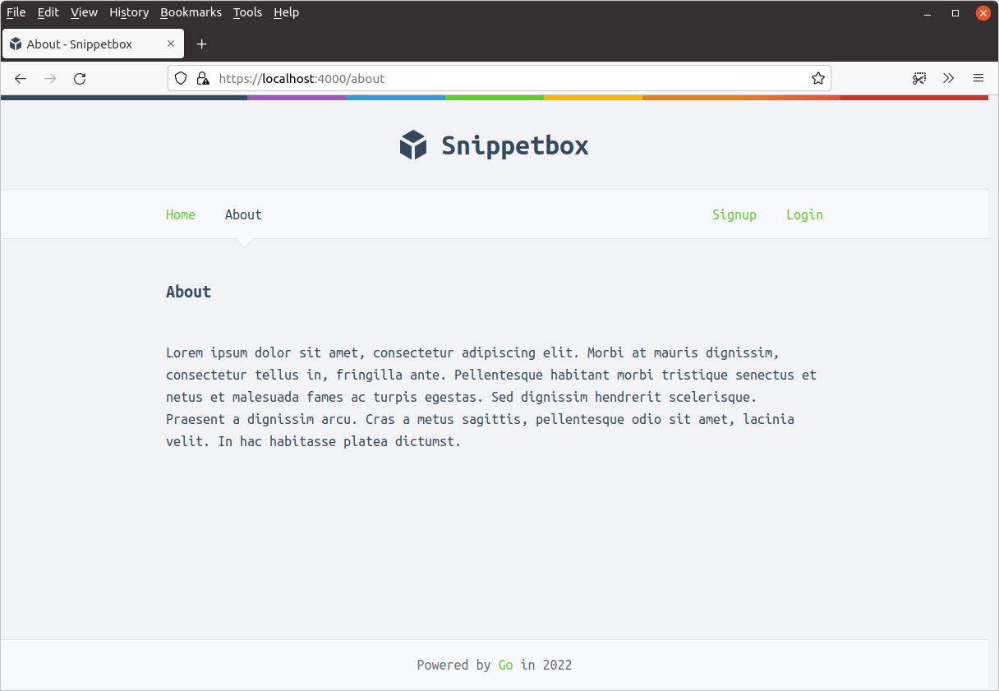

#### 步骤1

创建映射到新的 `about` 处理器的 `GET /about` 路由。考虑哪个中间件堆栈适合要使用的路由。

[显示建议的代码](#17.01-suggested-code-for-step-1)

#### 步骤2

创建一个新的 `ui/html/pages/about.tmpl` 文件，遵循我们用于应用程序其他页面的相同模板模式。包括“关于”页面的标题、标题和一些占位符副本。

[显示建议的代码](#17.01-suggested-code-for-step-2)

#### 步骤3

更新应用程序的主导航栏，以包含指向新“关于”页面的链接（该链接应该对所有用户可见，无论他们是否登录）。

[显示建议的代码](#17.01-suggested-code-for-step-3)

#### 步骤4

更新 `about` 处理器，以便它呈现您刚刚创建的 `about.tmpl` 文件。然后通过在浏览器中访问 [`https://localhost:4000/about`](https://localhost:4000/about) 来检查新页面和导航是否正常工作。

[显示建议的代码](#17.01-suggested-code-for-step-4)

### 建议代码

#### 步骤 1 的建议代码

*文件：cmd/web/handlers.go*

```go
package main

...

func (app *application) about(w http.ResponseWriter, r *http.Request) {
    // Some code will go here later...
}
```

*文件：cmd/web/routes.go*

```go
package main

...

func (app *application) routes() http.Handler {
    mux := http.NewServeMux()

    mux.Handle("GET /static/", http.FileServerFS(ui.Files))

    mux.HandleFunc("GET /ping", ping)

    dynamic := alice.New(app.sessionManager.LoadAndSave, noSurf, app.authenticate)

    mux.Handle("GET /{$}", dynamic.ThenFunc(app.home))
    // Add the about route.
    mux.Handle("GET /about", dynamic.ThenFunc(app.about))
    mux.Handle("GET /snippet/view/{id}", dynamic.ThenFunc(app.snippetView))
    mux.Handle("GET /user/signup", dynamic.ThenFunc(app.userSignup))
    mux.Handle("POST /user/signup", dynamic.ThenFunc(app.userSignupPost))
    mux.Handle("GET /user/login", dynamic.ThenFunc(app.userLogin))
    mux.Handle("POST /user/login", dynamic.ThenFunc(app.userLoginPost))

    protected := dynamic.Append(app.requireAuthentication)

    mux.Handle("GET /snippet/create", protected.ThenFunc(app.snippetCreate))
    mux.Handle("POST /snippet/create", protected.ThenFunc(app.snippetCreatePost))
    mux.Handle("POST /user/logout", protected.ThenFunc(app.userLogoutPost))

    standard := alice.New(app.recoverPanic, app.logRequest, commonHeaders)
    return standard.Then(mux)
}
```

#### 步骤 2 的建议代码

*文件：ui/html/pages/about.tmpl*

```html

{{define "title"}}About{{end}}

{{define "main"}}
    <h2>About</h2>
    <p>Lorem ipsum dolor sit amet, consectetur adipiscing elit. Morbi at mauris dignissim,
    consectetur tellus in, fringilla ante. Pellentesque habitant morbi tristique senectus
    et netus et malesuada fames ac turpis egestas. Sed dignissim hendrerit scelerisque.</p>
    <p>Praesent a dignissim arcu. Cras a metus sagittis, pellentesque odio sit amet,
    lacinia velit. In hac habitasse platea dictumst. </p>
{{end}}
```

#### 步骤 3 的建议代码

*文件：ui/html/partials/nav.tmpl*

```html
{{define "nav"}}
<nav>
    <div>
        <a href='/'>Home</a>
        <!-- Include a new link, visible to all users -->
        <a href='/about'>About</a>
         {{if .IsAuthenticated}}
            <a href='/snippet/create'>Create snippet</a>
        {{end}}
    </div>
    <div>
        {{if .IsAuthenticated}}
            <form action='/user/logout' method='POST'>
                <input type='hidden' name='csrf_token' value='{{.CSRFToken}}'>
                <button>Logout</button>
            </form>
        {{else}}
            <a href='/user/signup'>Signup</a>
            <a href='/user/login'>Login</a>
        {{end}}
    </div>
</nav>
{{end}}
```

#### 步骤 4 的建议代码

*文件：cmd/web/handlers.go*

```go
package main

...

func (app *application) about(w http.ResponseWriter, r *http.Request) {
    data := app.newTemplateData(r)
    app.render(w, r, http.StatusOK, "about.tmpl", data)
}
```

---

<!-- 来源章节：16.02-add-a-debug-mode.md -->

*第 16.2 章。*

## 添加调试模式

如果您使用过其他语言的 Web 框架，例如 Django 或 Laravel，那么您可能熟悉“调试”模式的概念，其中详细的错误在 HTTP 响应中显示给用户，而不是通用的 `"Internal Server Error"` 消息。

本练习的目标是为我们的应用程序设置类似的“调试模式”，可以通过使用 `-debug` 标志来启用该模式，如下所示：

```bash
$ go run ./cmd/web -debug
```

在调试模式下运行时，任何详细的错误和堆栈跟踪都应显示在浏览器中，类似于以下内容：


#### 步骤1

创建一个名为 `debug` 的新命令行标志，默认值为 `false`。然后通过 `application` 结构将此命令行标志中的值提供给处理器。

提示：`flag.Bool()` 函数最适合此任务。

[显示建议的代码](#17.02-suggested-code-for-step-1)

#### 步骤2

转到 `cmd/web/helpers.go` 文件并更新 `serverError()` 帮助程序，以便当且仅当 `debug` 标志已设置时，它才会在 HTTP 响应中呈现详细的错误消息和堆栈跟踪。否则，照常发送一般错误消息。您可以使用 `debug.Stack()` 函数获取堆栈跟踪。

[显示建议的代码](#17.02-suggested-code-for-step-2)

#### 步骤3

尝试一下改变。运行应用程序并使用不带* 参数的 DSN *强制出现运行时错误：

```bash
$ go run ./cmd/web/ -debug -dsn=web:pass@/snippetbox
```

访问 [`https://localhost:4000/`](https://localhost:4000/) 应该会得到如下响应：


*在没有*`-debug`标志的情况下再次运行应用程序应该会产生通用`"Internal Server Error"`消息。

### 建议代码

#### 步骤 1 的建议代码

*文件：cmd/web/main.go*

```go
package main

...

type application struct {
    debug          bool // Add a new debug field.
    logger        *slog.Logger
    snippets       models.SnippetModelInterface
    users          models.UserModelInterface
    templateCache  map[string]*template.Template
    formDecoder    *form.Decoder
    sessionManager *scs.SessionManager
}

func main() {
    addr := flag.String("addr", ":4000", "HTTP network address")
    dsn := flag.String("dsn", "web:pass@/snippetbox?parseTime=true", "MySQL data source name")
    // Create a new debug flag with the default value of false.
    debug := flag.Bool("debug", false, "Enable debug mode")
    flag.Parse()

    logger := slog.New(slog.NewTextHandler(os.Stdout, nil))

    db, err := openDB(*dsn)
    if err != nil {
        logger.Error(err.Error())
        os.Exit(1)
    }
    defer db.Close()

    templateCache, err := newTemplateCache()
    if err != nil {
        logger.Error(err.Error())
        os.Exit(1)
    }

    formDecoder := form.NewDecoder()

    sessionManager := scs.New()
    sessionManager.Store = mysqlstore.New(db)
    sessionManager.Lifetime = 12 * time.Hour
    sessionManager.Cookie.Secure = true

    app := &application{
        debug:          *debug, // Add the debug flag value to the application struct.
        logger:         logger,
        snippets:       &models.SnippetModel{DB: db},
        users:          &models.UserModel{DB: db},
        templateCache:  templateCache,
        formDecoder:    formDecoder,
        sessionManager: sessionManager,
    }

    tlsConfig := &tls.Config{
        CurvePreferences: []tls.CurveID{tls.X25519, tls.CurveP256},
    }

    srv := &http.Server{
        Addr:         *addr,
        Handler:      app.routes(),
        ErrorLog:     slog.NewLogLogger(logger.Handler(), slog.LevelError),
        TLSConfig:    tlsConfig,
        IdleTimeout:  time.Minute,
        ReadTimeout:  5 * time.Second,
        WriteTimeout: 10 * time.Second,
    }

    logger.Info("starting server", "addr", srv.Addr)

    err = srv.ListenAndServeTLS("./tls/cert.pem", "./tls/key.pem")
    logger.Error(err.Error())
    os.Exit(1)
}

...
```

#### 步骤 2 的建议代码

*文件：cmd/web/helpers.go*

```go

...

func (app *application) serverError(w http.ResponseWriter, r *http.Request, err error) {
    var (
        method = r.Method
        uri    = r.URL.RequestURI()
        trace  = string(debug.Stack())
    )

    app.logger.Error(err.Error(), "method", method, "uri", uri)

    if app.debug {
        body := fmt.Sprintf("%s\n%s", err, trace)
        http.Error(w, body, http.StatusInternalServerError)
        return
    }

    http.Error(w, http.StatusText(http.StatusInternalServerError), http.StatusInternalServerError)
}

...
```

---

<!-- 来源章节：16.03-test-the-snippetcreate-method.md -->

*第 16.3 章。*

## 测试 snippetCreate 处理器

您在本练习中的目标是为 `GET /snippet/create` 路由创建端到端测试。具体来说，您想要测试：

- 未经身份验证的用户将被重定向到登录表单。
- 经过身份验证的用户将看到用于创建新片段的表单。

#### 步骤1

在 `cmd/web/handlers_test.go` 文件中创建一个新的 `TestSnippetCreate` 测试。在此测试中，使用[端到端测试章节](13.03-end-to-end-testing.md)中的模式和帮助程序，使用应用程序路由和模拟依赖项来初始化新的测试服务器。

[显示建议的代码](#17.03-suggested-code-for-step-1)

#### 步骤2

创建一个名为 `"Unauthenticated"` 的子测试。在此子测试中，以未经身份验证的用户身份向测试服务器发出 `GET /snippet/create` 请求。验证响应是否具有状态代码 `303` 和 `Location: /user/login` 标头。再次，重用我们在端到端测试章节中创建的帮助程序。

[显示建议的代码](#17.03-suggested-code-for-step-2)

#### 步骤3

创建另一个名为 `"Authenticated`”的子测试。在此子测试中，模拟以用户身份登录进行身份验证的工作流程。具体来说，您需要发出 `GET /user/login` 请求，从响应正文中提取 CSRF 令牌，然后使用模拟用户模型中的凭据发出 `POST /user/login` 请求（电子邮件 `"alice@example.com"`，密码 `"pa$$word"`）。

然后，经过身份验证后，发出 `GET /snippet/create` 请求并验证您是否收到状态代码 `200` 和包含文本 `<form action='/snippet/create' method='POST'>` 的 HTML 正文。

[显示建议的代码](#17.03-suggested-code-for-step-3)

### 建议代码

#### 步骤 1 的建议代码

*文件：cmd/web/handlers_test.go*

```go

...

func TestSnippetCreate(t *testing.T) {
    app := newTestApplication(t)
    ts := newTestServer(t, app.routes())
    defer ts.Close()
}
```

#### 步骤 2 的建议代码

*文件：cmd/web/handlers_test.go*

```go

...

func TestSnippetCreate(t *testing.T) {
    app := newTestApplication(t)
    ts := newTestServer(t, app.routes())
    defer ts.Close()

    t.Run("Unauthenticated", func(t *testing.T) {
        code, headers, _ := ts.get(t, "/snippet/create")
        
        assert.Equal(t, code,  http.StatusSeeOther)
        assert.Equal(t, headers.Get("Location"), "/user/login")
    })
}
```

```bash
$  go test -v -run=TestSnippetCreate ./cmd/web/
=== RUN   TestSnippetCreate
=== RUN   TestSnippetCreate/Unauthenticated
--- PASS: TestSnippetCreate (0.01s)
    --- PASS: TestSnippetCreate/Unauthenticated (0.00s)
PASS
ok      snippetbox.alexedwards.net/cmd/web      0.010s
```

#### 步骤 3 的建议代码

*文件：cmd/web/handlers_test.go*

```go

...

func TestSnippetCreate(t *testing.T) {
    app := newTestApplication(t)
    ts := newTestServer(t, app.routes())
    defer ts.Close()

    t.Run("Unauthenticated", func(t *testing.T) {
        code, headers, _ := ts.get(t, "/snippet/create")
        
        assert.Equal(t, code,  http.StatusSeeOther)
        assert.Equal(t, headers.Get("Location"), "/user/login")
    })
    
    t.Run("Authenticated", func(t *testing.T) {
        // Make a GET /user/login request and extract the CSRF token from the
        // response.
        _, _, body := ts.get(t, "/user/login")
        csrfToken := extractCSRFToken(t, body)

        // Make a POST /user/login request using the extracted CSRF token and
        // credentials from our the mock user model.
        form := url.Values{}
        form.Add("email", "alice@example.com")
        form.Add("password", "pa$$word")
        form.Add("csrf_token", csrfToken)
        ts.postForm(t, "/user/login", form)

        // Then check that the authenticated user is shown the create snippet
        // form.
        code, _, body := ts.get(t, "/snippet/create")
        
        assert.Equal(t, code,  http.StatusOK)
        assert.StringContains(t, body, "<form action='/snippet/create' method='POST'>")
    })
}
```

```bash
$ go test -v -run=TestSnippetCreate ./cmd/web/
=== RUN   TestSnippetCreate
=== RUN   TestSnippetCreate/Unauthenticated
=== RUN   TestSnippetCreate/Authenticated
--- PASS: TestSnippetCreate (0.01s)
    --- PASS: TestSnippetCreate/Unauthenticated (0.00s)
    --- PASS: TestSnippetCreate/Authenticated (0.00s)
PASS
ok      snippetbox.alexedwards.net/cmd/web      0.012s
```

---

<!-- 来源章节：16.04-add-an-account-page-to-the-application.md -->

*第 16.4 章。*

## 向应用程序添加“帐户”页面

本练习的目标是向应用程序添加新的“您的帐户”页面。它应该映射到新的 `GET /account/view` 路由并显示当前经过身份验证的用户的姓名、电子邮件地址和注册日期，类似于：

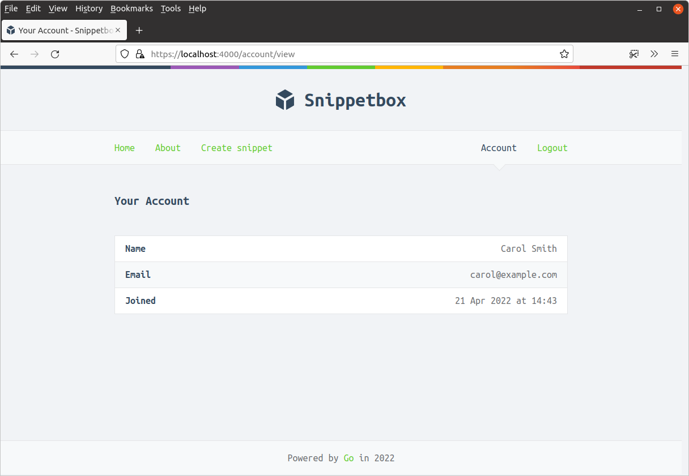

#### 步骤1

在 `internal/models/users.go` 文件中创建一个新的 `UserModel.Get()` 方法。这应该接受用户的 ID 作为参数，并返回一个 `User` 结构，其中包含该用户的所有信息（*除了他们的哈希密码*，我们不需要）。如果未找到具有该 ID 的用户，则应返回 `ErrNoRecord` 错误。

另外，更新 `UserModelInterface` 类型以包含这个新的 `Get()` 方法，并将相应的方法添加到我们的模拟 `mocks.UserModel` 中，以便它继续满足接口。

[显示建议的代码](#17.04-suggested-code-for-step-1)

#### 步骤2

创建映射到新的 `accountView` 处理器的 `GET /account/view` 路由。该路由应仅限于经过身份验证的用户。

[显示建议的代码](#17.04-suggested-code-for-step-2)

#### 步骤3

更新 `accountView` 处理器以从会话中获取 `"authenticatedUserID"`，从数据库中获取相关用户的详细信息（使用新的 `UserModel.Get()` 方法），并将它们转储到纯文本 HTTP 响应中。如果在会话中找不到与 `"authenticatedUserID"` 匹配的用户，请将客户端重定向到 `GET /user/login` 以强制重新进行身份验证。

当您以经过身份验证的用户身份在浏览器中访问 [`https://localhost:4000/account/view`](https://localhost:4000/account/view) 时，您应该会收到类似于以下内容的响应：

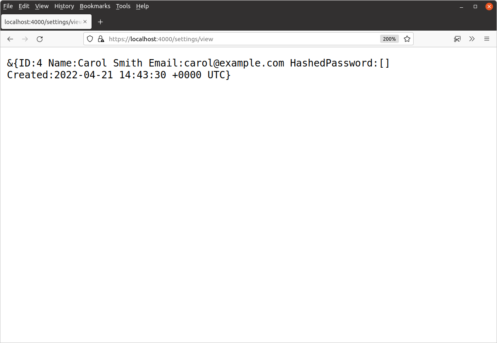

[显示建议的代码](#17.04-suggested-code-for-step-3)

#### 步骤4

创建一个新的 `ui/html/pages/account.tmpl` 文件，该文件在表中显示用户信息。然后更新 `accountView` 处理器以呈现这个新模板，通过 `templateData` 结构传递用户的详细信息。

[显示建议的代码](#17.04-suggested-code-for-step-4)

#### 步骤5

此外，更新站点的主导航栏，以包含指向查看帐户页面的链接（仅对经过身份验证的用户可见）。然后，登录后在浏览器中访问 [`https://localhost:4000/account/view`](https://localhost:4000/account/view) 来健全检查新页面和导航是否按预期工作。

[显示建议的代码](#17.04-suggested-code-for-step-5)

### 建议代码

#### 步骤 1 的建议代码

*文件：internal/models/users.go*

```go
package models

...

type UserModelInterface interface {
    Insert(name, email, password string) error
    Authenticate(email, password string) (int, error)
    Exists(id int) (bool, error)
    Get(id int) (User, error)
}

...

func (m *UserModel) Get(id int) (User, error) {
    var user User

    stmt := `SELECT id, name, email, created FROM users WHERE id = ?`

    err := m.DB.QueryRow(stmt, id).Scan(&user.ID, &user.Name, &user.Email, &user.Created)
    if err != nil {
        if errors.Is(err, sql.ErrNoRows) {
            return User{}, ErrNoRecord
        } else {
            return User{}, err
        }
    }

    return user, nil
}
```

*文件：internal/models/mocks/users.go*

```go
package mocks

import (
    "time" // New import

    "snippetbox.alexedwards.net/internal/models"
)

...

func (m *UserModel) Get(id int) (models.User, error) {
    if id == 1 {
        u := models.User{
            ID:      1,
            Name:    "Alice",
            Email:   "alice@example.com",
            Created: time.Now(),
        }

        return u, nil
    }

    return models.User{}, models.ErrNoRecord
}
```

#### 步骤 2 的建议代码

*文件：cmd/web/handlers.go*

```go

...

func (app *application) accountView(w http.ResponseWriter, r *http.Request) {
    // Some code will go here later...
}
```

*文件：cmd/web/routes.go*

```go
package main

...

func (app *application) routes() http.Handler {
    mux := http.NewServeMux()

    mux.Handle("GET /static/", http.FileServerFS(ui.Files))

    mux.HandleFunc("GET /ping", ping)

    dynamic := alice.New(app.sessionManager.LoadAndSave, noSurf, app.authenticate)

    mux.Handle("GET /{$}", dynamic.ThenFunc(app.home))
    mux.Handle("GET /about", dynamic.ThenFunc(app.about))
    mux.Handle("GET /snippet/view/{id}", dynamic.ThenFunc(app.snippetView))
    mux.Handle("GET /user/signup", dynamic.ThenFunc(app.userSignup))
    mux.Handle("POST /user/signup", dynamic.ThenFunc(app.userSignupPost))
    mux.Handle("GET /user/login", dynamic.ThenFunc(app.userLogin))
    mux.Handle("POST /user/login", dynamic.ThenFunc(app.userLoginPost))

    protected := dynamic.Append(app.requireAuthentication)

    mux.Handle("GET /snippet/create", protected.ThenFunc(app.snippetCreate))
    mux.Handle("POST /snippet/create", protected.ThenFunc(app.snippetCreatePost))
    // Add the view account route, using the protected middleware chain.
    mux.Handle("GET /account/view", protected.ThenFunc(app.accountView))
    mux.Handle("POST /user/logout", protected.ThenFunc(app.userLogoutPost))

    standard := alice.New(app.recoverPanic, app.logRequest, commonHeaders)
    return standard.Then(mux)
}
```

#### 步骤 3 的建议代码

*文件：cmd/web/handlers.go*

```go

...

func (app *application) accountView(w http.ResponseWriter, r *http.Request) {
    userID := app.sessionManager.GetInt(r.Context(), "authenticatedUserID")

    user, err := app.users.Get(userID)
    if err != nil {
        if errors.Is(err, models.ErrNoRecord) {
            http.Redirect(w, r, "/user/login", http.StatusSeeOther)
        } else {
            app.serverError(w, r, err)
        }
        return
    }

    fmt.Fprintf(w, "%+v", user)
}
```

#### 步骤 4 的建议代码

*文件：cmd/web/templates.go*

```go

...

type templateData struct {
    CurrentYear     int
    Snippet         models.Snippet
    Snippets        []models.Snippet
    Form            any
    Flash           string
    IsAuthenticated bool
    CSRFToken       string
    User            models.User
}

...
```

*文件：ui/html/pages/account.tmpl*

```html

{{define "title"}}Your Account{{end}}

{{define "main"}}
    <h2>Your Account</h2>
    {{with .User}}
     <table>
        <tr>
            <th>Name</th>
            <td>{{.Name}}</td>
        </tr>
        <tr>
            <th>Email</th>
            <td>{{.Email}}</td>
        </tr>
        <tr>
            <th>Joined</th>
            <td>{{humanDate .Created}}</td>
        </tr>
    </table>
    {{end }}
{{end}}
```

*文件：cmd/web/handlers.go*

```go

...

func (app *application) accountView(w http.ResponseWriter, r *http.Request) {
    userID := app.sessionManager.GetInt(r.Context(), "authenticatedUserID")

    user, err := app.users.Get(userID)
    if err != nil {
        if errors.Is(err, models.ErrNoRecord) {
            http.Redirect(w, r, "/user/login", http.StatusSeeOther)
        } else {
            app.serverError(w, r, err)
        }
        return
    }

    data := app.newTemplateData(r)
    data.User = user

    app.render(w, r, http.StatusOK, "account.tmpl", data)
}
```

#### 步骤 5 的建议代码

*文件：ui/html/partials/nav.tmpl*

```html
{{define "nav"}}
<nav>
    <div>
        <a href='/'>Home</a>
        <a href='/about'>About</a>
         {{if .IsAuthenticated}}
            <a href='/snippet/create'>Create snippet</a>
        {{end}}
    </div>
    <div>
        {{if .IsAuthenticated}}
            <!-- Add the view account link for authenticated users -->
            <a href='/account/view'>Account</a>
            <form action='/user/logout' method='POST'>
                <input type='hidden' name='csrf_token' value='{{.CSRFToken}}'>
                <button>Logout</button>
            </form>
        {{else}}
            <a href='/user/signup'>Signup</a>
            <a href='/user/login'>Login</a>
        {{end}}
    </div>
</nav>
{{end}}
```

---

<!-- 来源章节：16.05-redirect-user-appropriately-after-login.md -->

*第 16.5 章。*

## 登录后适当重定向用户

如果未经身份验证的用户尝试访问 `GET /account/view`，他们将被重定向到登录页面。然后登录成功后，将被重定向到`GET /snippet/create`表单。这对于用户来说是尴尬和困惑的，因为他们最终会进入与他们最初想去的页面不同的页面。

您在本练习中的目标是更新应用程序，以便用户在登录后重定向到他们最初尝试访问的页面。

#### 步骤1

更新 `requireAuthentication()` 中间件，以便在未经身份验证的用户重定向到登录页面之前，将他们尝试访问的 URL 路径添加到其会话数据中。

[显示建议的代码](#17.05-suggested-code-for-step-1)

#### 步骤2

更新 `userLogin` 处理器以在用户成功登录后检查用户会话中的 URL 路径。如果存在，请将其从会话数据中删除并将用户重定向到该 URL 路径。否则，默认将用户重定向到 `/snippet/create`。

[显示建议的代码](#17.05-suggested-code-for-step-2)

### 建议代码

#### 步骤 1 的建议代码

*文件：cmd/web/middleware.go*

```go
package main

...

func (app *application) requireAuthentication(next http.Handler) http.Handler {
    return http.HandlerFunc(func(w http.ResponseWriter, r *http.Request) {
        if !app.isAuthenticated(r) {
            // Add the path that the user is trying to access to their session
            // data.
            app.sessionManager.Put(r.Context(), "redirectPathAfterLogin", r.URL.Path)
            http.Redirect(w, r, "/user/login", http.StatusSeeOther)
            return
        }

        w.Header().Add("Cache-Control", "no-store")

        next.ServeHTTP(w, r)
    })
}

...
```

#### 步骤 2 的建议代码

*文件：cmd/web/handlers.go*

```go
package main

...

func (app *application) userLoginPost(w http.ResponseWriter, r *http.Request) {
    var form userLoginForm

    err := app.decodePostForm(r, &form)
    if err != nil {
        app.clientError(w, http.StatusBadRequest)
        return
    }

    form.CheckField(validator.NotBlank(form.Email), "email", "This field cannot be blank")
    form.CheckField(validator.Matches(form.Email, validator.EmailRX), "email", "This field must be a valid email address")
    form.CheckField(validator.NotBlank(form.Password), "password", "This field cannot be blank")

    if !form.Valid() {
        data := app.newTemplateData(r)
        data.Form = form

        app.render(w, r, http.StatusUnprocessableEntity, "login.tmpl", data)
        return
    }

    id, err := app.users.Authenticate(form.Email, form.Password)
    if err != nil {
        if errors.Is(err, models.ErrInvalidCredentials) {
            form.AddNonFieldError("Email or password is incorrect")

            data := app.newTemplateData(r)
            data.Form = form

            app.render(w, r, http.StatusUnprocessableEntity, "login.tmpl", data)
        } else {
            app.serverError(w, r, err)
        }
        return
    }

    err = app.sessionManager.RenewToken(r.Context())
    if err != nil {
        app.serverError(w, r, err)
        return
    }

    app.sessionManager.Put(r.Context(), "authenticatedUserID", id)

    // Use the PopString method to retrieve and remove a value from the session
    // data in one step. If no matching key exists this will return the empty
    // string.
    path := app.sessionManager.PopString(r.Context(), "redirectPathAfterLogin")
    if path != "" {
        http.Redirect(w, r, path, http.StatusSeeOther)
        return
    }

    http.Redirect(w, r, "/snippet/create", http.StatusSeeOther)
}

...
```

---

<!-- 来源章节：16.06-implement-a-change-password-feature.md -->

*第 16.6 章。*

## 实施“更改密码”功能

您在本练习中的目标是为经过身份验证的用户添加更改密码的功能，使用类似于以下形式的表单：


在此练习中，您应该确保：

- 询问用户当前的密码，并验证它是否与 `users` 表中的哈希密码匹配（以确认确实是他们发出的请求）。
- 在更新 `users` 表之前对新密码进行哈希处理。

#### 步骤1

创建两个新的路由和处理器：

- `GET /account/password/update` 映射到新的 `accountPasswordUpdate` 处理器。
- `POST /account/password/update` 映射到新的 `accountPasswordUpdatePost` 处理器。

两条路由都应仅限于经过身份验证的用户。

[显示建议的代码](#17.06-suggested-code-for-step-1)

#### 步骤2

创建一个新的 `ui/html/pages/password.tmpl` 文件，其中包含更改密码表单。该表单应：

- 具有三个字段：`currentPassword`、`newPassword` 和 `newPasswordConfirmation`。
- 提交时将 `POST` 表单数据发送至 `/account/password/update`。
- 如果出现验证错误，则显示每个字段的错误。
- 出现验证错误时不重新显示密码。

提示：您可能想使用我们在用户注册表单上所做的工作作为此处的指南。

然后更新 `cmd/web/handlers.go` 文件以包含一个新的 `accountPasswordUpdateForm` 结构，您可以将表单数据解析为该结构，并更新 `accountPasswordUpdate` 处理器以显示此空表单。

当您以经过身份验证的用户身份访问 [`https://localhost:4000/account/password/update`](https://localhost:4000/account/password/update) 时，它应该类似于以下内容：


[显示建议的代码](#17.06-suggested-code-for-step-2)

#### 步骤3

更新 `accountPasswordUpdatePost` 处理器以执行以下表单验证检查，并在发生任何失败时重新显示带有相关错误消息的表单。

- 所有三个字段都是必需的。
- `newPassword` 值的长度必须至少为 8 个字符。
- `newPassword` 和 `newPasswordConfirmation` 值必须匹配。


[显示建议的代码](#17.06-suggested-code-for-step-3)

#### 步骤4

在您的 `internal/models/users.go` 文件中创建一个具有以下签名的新 `UserModel.PasswordUpdate()` 方法：

```go
func (m *UserModel) PasswordUpdate(id int, currentPassword, newPassword string) error
```

在这个方法中：

1. 从数据库中检索具有 `id` 参数指定 ID 的用户的用户详细信息。
2. 检查 `currentPassword` 值是否与用户的哈希密码匹配。如果不匹配，则返回 `ErrInvalidCredentials` 错误。
3. 否则，对 `newPassword` 值进行哈希处理并更新相关用户的 `users` 表中的 `hashed_password` 列。

还要更新 `UserModelInterface` 接口类型以包含您刚刚创建的 `PasswordUpdate()` 方法。

[显示建议的代码](#17.06-suggested-code-for-step-4)

#### 步骤5

更新 `accountPasswordUpdatePost` 处理器，以便如果表单有效，它会调用 `UserModel.PasswordUpdate()` 方法（请记住，用户的 ID 应位于会话数据中）。

如果出现 `models.ErrInvalidCredentials` 错误，请通知用户他们在 `currentPassword` 表单字段中输入了错误的值。否则，向用户会话添加一条闪现消息，表明其密码已成功更改，并将其重定向到其帐户页面。

[显示建议的代码](#17.06-suggested-code-for-step-5)

#### 步骤6

更新帐户以包含更改密码表单的链接，类似于：


[显示建议的代码](#17.06-suggested-code-for-step-6)

#### 步骤7

尝试运行应用程序的测试。您应该会失败，因为 `mocks.UserModel` 类型不再满足 `models.UserModelInterface` 结构中指定的接口。通过向模拟添加适当的 `PasswordUpdate()` 方法来修复此问题并确保测试通过。

[显示建议的代码](#17.06-suggested-code-for-step-7)

### 建议代码

#### 步骤 1 的建议代码

*文件：cmd/web/handlers.go*

```go
package main

...

func (app *application) accountPasswordUpdate(w http.ResponseWriter, r *http.Request) {
    // Some code will go here later...
}

func (app *application) accountPasswordUpdatePost(w http.ResponseWriter, r *http.Request) {
    // Some code will go here later...
}
```

*文件：cmd/web/routes.go*

```go
package main

...

func (app *application) routes() http.Handler {
    mux := http.NewServeMux()

    mux.Handle("GET /static/", http.FileServerFS(ui.Files))

    mux.HandleFunc("GET /ping", ping)

    dynamic := alice.New(app.sessionManager.LoadAndSave, noSurf, app.authenticate)

    mux.Handle("GET /{$}", dynamic.ThenFunc(app.home))
    mux.Handle("GET /about", dynamic.ThenFunc(app.about))
    mux.Handle("GET /snippet/view/{id}", dynamic.ThenFunc(app.snippetView))
    mux.Handle("GET /user/signup", dynamic.ThenFunc(app.userSignup))
    mux.Handle("POST /user/signup", dynamic.ThenFunc(app.userSignupPost))
    mux.Handle("GET /user/login", dynamic.ThenFunc(app.userLogin))
    mux.Handle("POST /user/login", dynamic.ThenFunc(app.userLoginPost))

    protected := dynamic.Append(app.requireAuthentication)

    mux.Handle("GET /snippet/create", protected.ThenFunc(app.snippetCreate))
    mux.Handle("POST /snippet/create", protected.ThenFunc(app.snippetCreatePost))
    mux.Handle("GET /account/view", protected.ThenFunc(app.accountView))
    // Add the two new routes, restricted to authenticated users only.
    mux.Handle("GET /account/password/update", protected.ThenFunc(app.accountPasswordUpdate))
    mux.Handle("POST /account/password/update", protected.ThenFunc(app.accountPasswordUpdatePost))
    mux.Handle("POST /user/logout", protected.ThenFunc(app.userLogoutPost))

    standard := alice.New(app.recoverPanic, app.logRequest, commonHeaders)
    return standard.Then(mux)
}
```

#### 步骤 2 的建议代码

*文件：ui/html/pages/password.tmpl*

```html
{{define "title"}}Change Password{{end}}

{{define "main"}}
<h2>Change Password</h2>
<form action='/account/password/update' method='POST' novalidate>
    <input type='hidden' name='csrf_token' value='{{.CSRFToken}}'>
    <div>
        <label>Current password:</label>
        {{with .Form.FieldErrors.currentPassword}}
            <label class='error'>{{.}}</label>
        {{end}}
        <input type='password' name='currentPassword'>
    </div>
    <div>
        <label>New password:</label>
        {{with .Form.FieldErrors.newPassword}}
            <label class='error'>{{.}}</label>
        {{end}}
        <input type='password' name='newPassword'>
    </div>
    <div>
        <label>Confirm new password:</label>
        {{with .Form.FieldErrors.newPasswordConfirmation}}
            <label class='error'>{{.}}</label>
        {{end}}
        <input type='password' name='newPasswordConfirmation'>
    </div>
    <div>
        <input type='submit' value='Change password'>
    </div>
</form>
{{end}}
```

*文件：cmd/web/handlers.go*

```go
package main

...

type accountPasswordUpdateForm struct {
    CurrentPassword         string `form:"currentPassword"`
    NewPassword             string `form:"newPassword"`
    NewPasswordConfirmation string `form:"newPasswordConfirmation"`
    validator.Validator     `form:"-"`
}

func (app *application) accountPasswordUpdate(w http.ResponseWriter, r *http.Request) {
    data := app.newTemplateData(r)
    data.Form = accountPasswordUpdateForm{}

    app.render(w, r, http.StatusOK, "password.tmpl", data)
}

...
```

#### 步骤 3 的建议代码

*文件：cmd/web/handlers.go*

```go
package main

...

func (app *application) accountPasswordUpdatePost(w http.ResponseWriter, r *http.Request) {
    var form accountPasswordUpdateForm

    err := app.decodePostForm(r, &form)
    if err != nil {
        app.clientError(w, http.StatusBadRequest)
        return
    }

    form.CheckField(validator.NotBlank(form.CurrentPassword), "currentPassword", "This field cannot be blank")
    form.CheckField(validator.NotBlank(form.NewPassword), "newPassword", "This field cannot be blank")
    form.CheckField(validator.MinChars(form.NewPassword, 8), "newPassword", "This field must be at least 8 characters long")
    form.CheckField(validator.NotBlank(form.NewPasswordConfirmation), "newPasswordConfirmation", "This field cannot be blank")
    form.CheckField(form.NewPassword == form.NewPasswordConfirmation, "newPasswordConfirmation", "Passwords do not match")

    if !form.Valid() {
        data := app.newTemplateData(r)
        data.Form = form

        app.render(w, r, http.StatusUnprocessableEntity, "password.tmpl", data)
        return
    }
}
```

#### 步骤 4 的建议代码

*文件：internal/models/users.go*

```go
package models

...

type UserModelInterface interface {
    Insert(name, email, password string) error
    Authenticate(email, password string) (int, error)
    Exists(id int) (bool, error)
    Get(id int) (User, error)
    PasswordUpdate(id int, currentPassword, newPassword string) error
}

...

func (m *UserModel) PasswordUpdate(id int, currentPassword, newPassword string) error {
    var currentHashedPassword []byte

    stmt := "SELECT hashed_password FROM users WHERE id = ?"

    err := m.DB.QueryRow(stmt, id).Scan(&currentHashedPassword)
    if err != nil {
        return err
    }

    err = bcrypt.CompareHashAndPassword(currentHashedPassword, []byte(currentPassword))
    if err != nil {
        if errors.Is(err, bcrypt.ErrMismatchedHashAndPassword) {
            return ErrInvalidCredentials
        } else {
            return err
        }
    }

    newHashedPassword, err := bcrypt.GenerateFromPassword([]byte(newPassword), 12)
    if err != nil {
        return err
    }

    stmt = "UPDATE users SET hashed_password = ? WHERE id = ?"

    _, err = m.DB.Exec(stmt, string(newHashedPassword), id)
    return err
}
```

#### 步骤 5 的建议代码

*文件：cmd/web/handlers.go*

```go
package main

...

func (app *application) accountPasswordUpdatePost(w http.ResponseWriter, r *http.Request) {
    var form accountPasswordUpdateForm

    err := app.decodePostForm(r, &form)
    if err != nil {
        app.clientError(w, http.StatusBadRequest)
        return
    }

    form.CheckField(validator.NotBlank(form.CurrentPassword), "currentPassword", "This field cannot be blank")
    form.CheckField(validator.NotBlank(form.NewPassword), "newPassword", "This field cannot be blank")
    form.CheckField(validator.MinChars(form.NewPassword, 8), "newPassword", "This field must be at least 8 characters long")
    form.CheckField(validator.NotBlank(form.NewPasswordConfirmation), "newPasswordConfirmation", "This field cannot be blank")
    form.CheckField(form.NewPassword == form.NewPasswordConfirmation, "newPasswordConfirmation", "Passwords do not match")

    if !form.Valid() {
        data := app.newTemplateData(r)
        data.Form = form

        app.render(w, r, http.StatusUnprocessableEntity, "password.tmpl", data)
        return
    }

    userID := app.sessionManager.GetInt(r.Context(), "authenticatedUserID")

    err = app.users.PasswordUpdate(userID, form.CurrentPassword, form.NewPassword)
    if err != nil {
        if errors.Is(err, models.ErrInvalidCredentials) {
            form.AddFieldError("currentPassword", "Current password is incorrect")

            data := app.newTemplateData(r)
            data.Form = form

            app.render(w, r, http.StatusUnprocessableEntity, "password.tmpl", data)
        } else {
            app.serverError(w, r, err)
        }
        return
    }

    app.sessionManager.Put(r.Context(), "flash", "Your password has been updated!")

    http.Redirect(w, r, "/account/view", http.StatusSeeOther)
}
```

#### 步骤 6 的建议代码

*文件：ui/html/pages/account.tmpl*

```html
{{define "title"}}Your Account{{end}}

{{define "main"}}
    <h2>Your Account</h2>
    {{with .User}}
     <table>
        <tr>
            <th>Name</th>
            <td>{{.Name}}</td>
        </tr>
        <tr>
            <th>Email</th>
            <td>{{.Email}}</td>
        </tr>
        <tr>
            <th>Joined</th>
            <td>{{humanDate .Created}}</td>
        </tr>
        <tr>
            <!-- Add a link to the change password form -->
            <th>Password</th>
            <td><a href="/account/password/update">Change password</a></td>
        </tr>
    </table>
    {{end }}
{{end}}
```

#### 步骤 7 的建议代码

```bash
$ go test ./...
# snippetbox.alexedwards.net/cmd/web [snippetbox.alexedwards.net/cmd/web.test]
cmd/web/testutils_test.go:48:19: cannot use &mocks.UserModel{} (value of type *mocks.UserModel) as type models.UserModelInterface in struct literal:
        *mocks.UserModel does not implement models.UserModelInterface (missing PasswordUpdate method)
FAIL    snippetbox.alexedwards.net/cmd/web [build failed]
ok      snippetbox.alexedwards.net/internal/models      1.099s
?       snippetbox.alexedwards.net/internal/models/mocks        [no test files]
?       snippetbox.alexedwards.net/internal/validator   [no test files]
?       snippetbox.alexedwards.net/ui   [no test files]
FAIL
```

*文件：internal/models/mock/users.go*

```go
package mocks

...

func (m *UserModel) PasswordUpdate(id int, currentPassword, newPassword string) error {
    if id == 1 {
        if currentPassword != "pa$$word" {
            return models.ErrInvalidCredentials
        }

        return nil
    }

    return models.ErrNoRecord
}
```

```bash
$ go test ./...
ok      snippetbox.alexedwards.net/cmd/web      0.026s
ok      snippetbox.alexedwards.net/internal/models      (cached)
?       snippetbox.alexedwards.net/internal/models/mocks        [no test files]
?       snippetbox.alexedwards.net/internal/validator   [no test files]
?       snippetbox.alexedwards.net/ui   [no test files]
```

---
